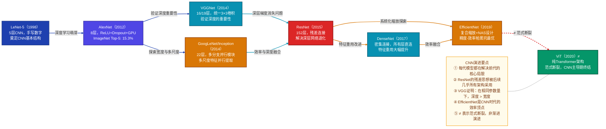
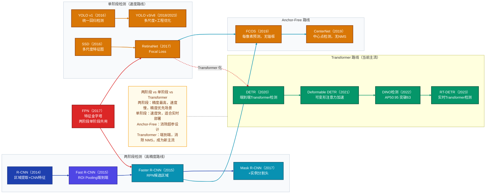
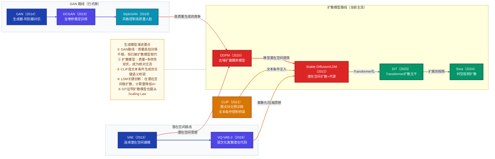
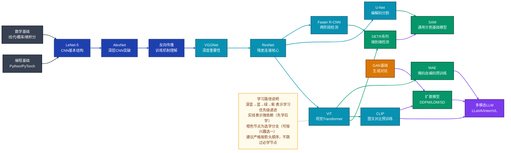

# 计算机视觉模型技术发展综述

> 本文档覆盖计算机视觉领域从规则方法到前沿基础模型的完整发展脉络，包含评估体系、演进路径、学习指南与认知诊断。

---

## § 0. 评估指标体系

> 建立「用什么衡量好坏」的认知基础，后续所有模型比较均依赖此节。

### 按任务类型分类

#### 图像分类

**一级指标（必须掌握）**

| 指标 | 衡量什么 | 计算方式 | 为什么用它而不用其他 |
|------|----------|----------|---------------------|
| **Top-1 Accuracy** | 预测最高概率类别是否正确 | 正确样本数 / 总样本数 | 最直观的分类正确率，单标签任务首选 |
| **Top-5 Accuracy** | 前5个预测中是否包含正确答案 | 前5中含正确类别的样本数 / 总样本数 | ImageNet 等大类别数据集标准，容错空间更大；比 Top-1 更能反映模型「知道但排名低」的情况 |

**二级指标（了解即可）**

- *Precision / Recall / F1*：多类别不平衡场景，补充 Accuracy 的局限
- *Confusion Matrix*：可视化各类别间混淆模式，调试用途

#### 目标检测

**一级指标（必须掌握）**

| 指标 | 衡量什么 | 计算方式 | 为什么用它而不用其他 |
|------|----------|----------|---------------------|
| **mAP（mean Average Precision）** | 各类别检测精度的平均 | 对每类计算 AP（PR 曲线下面积），再对所有类取均值 | 同时衡量定位和分类两个维度，单用 Accuracy 无法反映定位质量 |
| **IoU（Intersection over Union）** | 预测框与真实框重叠程度 | \|预测∩真实\| / \|预测∪真实\| | 定位精度的直接度量，是 mAP 计算的前提阈值 |
| **AP@50 / AP@75 / AP@50:95** | 不同 IoU 阈值下的检测精度 | AP@50：IoU>0.5；AP@75：IoU>0.75；AP@50:95：在 0.5∼0.95 步长 0.05 上均值 | COCO 标准；AP@50:95 最严格（要求精准定位），AP@50 更宽松（历史比较用） |

**二级指标（了解即可）**

- *FPS（帧率）*：实时应用速度指标，精度-速度权衡的横轴
- *FLOPS / 参数量*：模型复杂度，部署选型依据

#### 语义分割

**一级指标（必须掌握）**

| 指标 | 衡量什么 | 计算方式 | 为什么用它而不用其他 |
|------|----------|----------|---------------------|
| **mIoU（mean IoU）** | 所有类别的平均交并比 | 对每类计算 TP/(TP+FP+FN)，再取均值 | 同时惩罚假阳性和假阴性；比 Pixel Accuracy 对类别不平衡更公平 |
| **Pixel Accuracy** | 正确分类的像素比例 | 正确像素数 / 总像素数 | 简单直观，但背景类易占主导（如自动驾驶中背景占 80%+），数值虚高 |

**二级指标（了解即可）**

- *Dice Coefficient*：医学分割常用，= 2×\|A∩B\| / (\|A\|+\|B\|)，与 F1 分数数学等价
- *Boundary F1 Score*：专门衡量边界预测质量

#### 生成任务

**一级指标（必须掌握）**

| 指标 | 衡量什么 | 计算方式 | 为什么用它而不用其他 |
|------|----------|----------|---------------------|
| **FID（Fréchet Inception Distance）** | 生成分布与真实分布的距离 | 在 Inception v3 特征空间中计算两个高斯分布的 Fréchet 距离 | 同时衡量质量和多样性，低 FID ≠ 仅追求逼真（还要防 mode collapse） |
| **SSIM（Structural Similarity）** | 图像结构相似性 | 综合亮度、对比度、结构三维度的加权乘积 | 图像重建任务（超分辨率/去噪）与人类感知相关性好；纯 PSNR 是像素均方误差，感知相关性差 |

**二级指标（了解即可）**

- *IS（Inception Score）*：质量与多样性的早期度量，已逐渐被 FID 取代
- *PSNR（Peak Signal-to-Noise Ratio）*：图像重建质量，感知相关性较弱
- *LPIPS*：基于深度特征的感知相似性，比 SSIM 更接近人类判断
- *CLIPScore*：文生图任务中衡量文本-图像对齐质量

### 指标间的权衡关系

1. **精度 vs 速度**：mAP 高的两阶段检测器（Faster R-CNN）通常比单阶段（YOLO）慢 5-10 倍；工程部署须按场景选择
2. **质量 vs 多样性**：生成模型中追求逼真（高质量）容易陷入 mode collapse（低多样性），FID 同时惩罚两者，是更健康的优化目标
3. **mIoU vs Pixel Accuracy**：类别不平衡场景（行人 < 背景）下 Pixel Accuracy 虚高，mIoU 更公平，应以 mIoU 为主
4. **AP@50 vs AP@50:95**：论文历史比较用 AP@50（VOC 标准），提交 COCO 排行榜用 AP@50:95

### 核心 Benchmark 数据集

| 数据集 | 规模 | 任务类型 | 历史地位 |
|--------|------|----------|---------|
| **ImageNet（ILSVRC）** | 1000类，120万训练图 | 图像分类 | CV 领域最重要基准，AlexNet 在此突破开启深度学习时代 |
| **COCO** | 80类，20万图，150万实例 | 检测+分割+关键点 | 目标检测/分割的事实标准，AP@50:95 严格性推动定位精度提升 |
| **Pascal VOC** | 20类，约1万图 | 检测+分割 | 前 COCO 时代标准，至今用于历史方法横向比较 |
| **ADE20K** | 150类，2万图 | 语义分割 | 语义分割主流 benchmark，类别细粒度高，场景解析专用 |
| **Cityscapes** | 30类，5000精标注图 | 语义分割（自动驾驶场景） | 自动驾驶分割领域的事实标准 |
| **Kinetics-400/700** | 400/700动作类，视频片段 | 视频动作识别 | 视频理解领域核心 benchmark |
| **LAION-5B** | 58亿图文对 | 多模态预训练 | 大规模视觉-语言预训练的数据基础，SD 等模型的训练来源 |

---

## § 1. 起源：基于规则的视觉处理

### 核心问题

计算机视觉最初要解决的核心问题是：**如何让机器「看懂」图像**——从像素矩阵中提取有意义的结构信息（边缘、角点、纹理、形状），并据此识别物体或场景。

本质挑战在于：图像的视觉外观受光照、视角、遮挡、尺度变化影响极大，而像素值本身仅是光强数字，毫无语义。

### 核心假设与设计思路

- **局部性假设**：图像重要信息集中于局部区域（边缘、角点），而非全局像素
- **手工设计假设**：专家可通过观察总结出「好特征」的数学定义，编写为固定算子
- **层次化假设**：低层特征（边缘）→ 中层特征（角点、线段）→ 高层语义（物体）

### 代表性方法

`Sobel 算子（1968）— 横纵方向梯度近似检测边缘 — 对噪声敏感，无法区分边缘粗细`

`Canny 边缘检测（1986）— 高斯平滑+梯度计算+非极大值抑制+双阈值多步骤流程 — 参数需人工调整，纹理复杂区域误检多`

`Harris 角点检测（1988）— 利用局部灰度变化矩阵（结构张量）检测角点 — 对尺度变化无不变性`

`SIFT（尺度不变特征变换，1999）— 构建高斯差分金字塔，在多尺度空间检测极值点并生成 128 维描述子 — 计算量大，实时性差`

`SURF（加速稳健特征，2006）— 用积分图加速 SIFT 近似 — 精度不及 SIFT，深度时代后两者均被取代`

`Viola-Jones 人脸检测（2001）— Haar 特征+积分图+AdaBoost+级联分类器 — 只能检测正脸，对姿态变化脆弱`

`Hough 变换（1962/1972）— 将线/圆检测转化为参数空间的峰值检测 — 参数离散化精度有限，难以推广到复杂形状`

### 该阶段的遗产

| 概念 | 后续继承方式 |
|------|-------------|
| **多尺度分析（图像金字塔）** | 被 FPN（特征金字塔网络）继承，成为目标检测核心组件 |
| **局部描述子思想** | CNN 可视为「可学习的局部滤波器」，与 SIFT 的核心直觉一脉相承 |
| **归一化与不变性** | BatchNorm、LayerNorm 等现代归一化均源于对光照/对比度不变性的追求 |
| **显著区域注意力** | 角点/关键点 → Spatial Attention → Self-Attention，「关注重要区域」的思想持续传承 |

---

## § 2. 转折：传统机器学习方法

### 相对规则方法的突破点

传统机器学习的核心突破在于将「决策逻辑」从人工编码转移到**从数据中学习**：
- 不再手动定义「什么是猫」，而是给模型看大量标注样本，让它自己归纳分类边界
- 将视觉问题拆分为「特征提取（人工）+ 分类器（机器学习）」两步，分而治之

但特征提取部分仍然是手工的——这正是该阶段的根本局限。

### 核心特征表示方法

`HOG（方向梯度直方图，2005）— 捕捉局部区域内梯度方向的统计分布 — 行人检测、车辆检测等刚性物体识别（对外形敏感，对光照不敏感）`

`SIFT/SURF 描述子 — 局部关键点周围的多尺度梯度方向，具有尺度和旋转不变性 — 图像匹配、SLAM、全景拼接`

`LBP（局部二值模式，1994）— 捕捉像素与邻域的大小关系形成纹理编码 — 纹理分类、低计算量人脸识别`

`Bag of Visual Words（BoW，2003）— 将局部描述子量化为视觉词汇，用词频直方图表示图像 — 图像检索、场景分类`

`Fisher Vector（2010）— 基于 GMM 对描述子偏差建模，比 BoW 信息更丰富 — 结合 SVM 在 ImageNet 前期效果最佳`

### 代表性分类器

`SVM（支持向量机）— 在特征空间中找最大间隔超平面，核函数处理非线性 — 需手工设计好特征，难以扩展到大规模数据`

`随机森林（2001）— 多棵决策树集成，降低方差增强鲁棒性 — 适合中低维特征，高维图像特征效果受限`

`AdaBoost（1995）— 串行训练弱分类器，重点关注错误样本 — Viola-Jones 人脸检测核心，对特征质量依赖大`

`DPM（可形变零件模型，2008）— 用混合 HOG 表示物体各部件，允许形变 — ImageNet 前目标检测 SOTA，计算慢，遮挡处理差`

### 该阶段的根本局限

1. **特征工程的天花板**：手工特征无法捕捉高层语义（用 HOG 难以区分「穿衣服的人」与其他人体姿态）
2. **维度灾难**：高维特征向量（Fisher Vector 可达数万维）导致训练极慢
3. **泛化能力弱**：同一套特征在不同场景（室内/室外、白天/夜晚）需重新调参
4. **流程割裂**：特征提取和分类器是独立优化的两步，无法端到端联合优化——「特征提错了，分类器再好也没用」

这四点局限共同催生了深度学习的需求：一种能**自动学习特征**、**端到端优化**的范式。

---

## § 3. 革命：深度学习基础架构（CNN 时代）

### 奠基性突破

**AlexNet（2012）** 是计算机视觉的「范式转变时刻」。

- 发表于：NIPS 2012，作者 Krizhevsky, Sutskever, Hinton
- 在 ImageNet LSVRC-2012 上将 Top-5 错误率从 26.2% 降至 15.3%（相对提升 40%+），第二名仅 26.2%
- 为什么是转折点：
  1. 证明了深层 CNN 可端到端学习视觉特征，超越任何手工特征
  2. GPU 训练的成功证明了硬件加速的可行性
  3. ReLU + Dropout + 数据增强构成了现代深度学习训练的基础范式

### 基础架构演进主线

```
手工特征（HOG+SVM）→ 计算瓶颈，无法端到端
→ AlexNet（2012）：提出 ReLU+Dropout+GPU训练，首次证明深层CNN可行
→ 遗留问题：网络仍浅（8层），特征层次不够丰富

→ VGGNet（2014）：统一 3×3 卷积堆叠，网络深化至 16/19 层
→ 遗留问题：参数量爆炸（138M），全连接层占 90% 参数

→ GoogLeNet/Inception（2014）：Inception 模块并行多尺度分支
→ 遗留问题：结构复杂，工程实现困难，规模化受限

→ ResNet（2015）：残差连接将网络推至 152 层，解决梯度消失
→ 遗留问题：逐层卷积特征复用不充分，只跨一层

→ DenseNet（2017）：密集连接，每层与所有前层直接相连
→ 遗留问题：训练时需保留所有中间特征，显存占用大

→ EfficientNet（2019）：复合缩放（宽度×深度×分辨率），NAS 搜索最优比例
→ 遗留问题：CNN 的局部感受野限制，无法高效捕获长距离依赖
```

### 关键设计思想的传承

- **AlexNet** 引入 ReLU → **解决了** Sigmoid/Tanh 饱和区梯度消失 → **但引入了** dying ReLU（后续 Leaky ReLU / GELU 解决）
- **VGGNet** 用 3×3 堆叠替代大卷积 → **解决了** 参数效率问题（两个 3×3 感受野=一个 5×5，参数更少）→ **但引入了** 更深网络的梯度消失
- **ResNet** 引入残差连接 → **解决了** 深层网络退化（accuracy 不升反降）→ **但引入了** 特征复用局限（仅跨一层）
- **DenseNet** 扩展为稠密连接 → **解决了** 特征复用不充分 → **但引入了** 显存瓶颈（推理时保留所有层）
- **EfficientNet** 用 NAS 寻找最优缩放比 → **解决了** 手工设计的低效 → **但引入了** 对特定数据集过度适配的风险，以及 CNN 固有的局部感受野上限

### 「基础期」终结的标志

**ViT（Vision Transformer，2020）** 发布宣告了 CNN 主导基础期的终结：
- 证明纯 Transformer（无卷积归纳偏置）在大规模预训练下可超越最佳 CNN
- 开启了「预训练-微调」范式在 CV 领域的全面应用
- 但 CNN 并未被淘汰——在边缘部署、小数据场景中仍是主力，ConvNeXt（2022）也证明现代化 CNN 仍能与 ViT 竞争

### CNN 基础架构演进时间线



---

## § 4. 专项方向一：图像分类

#### 图像分类（Image Classification）

**核心任务**：给定一张图像，输出所属类别标签（单标签或多标签分类）。

**演进脉络**：
手工特征+SVM（~2012）≠ AlexNet 奠基（2012）→ VGG/Inception 深化（2014）→ ResNet 解决深度（2015）→ NAS/EfficientNet（2019）≠ ViT 入场（2020）→ MAE/DeiT 数据效率（2021-2022）→ ConvNeXt 反攻（2022）→ 当前 SOTA：超大规模视觉基础模型（2023-2025）

**代表模型清单**：

| 模型名 | 年份 | 核心创新（一句话）| 解决了前代的什么问题 | 重要程度 |
|--------|------|-------------------|----------------------|----------|
| **LeNet-5** | 1998 | 卷积+池化+全连接的 CNN 原型 | 首次证明 CNN 可用于手写识别 | ⭐必学 |
| **AlexNet** | 2012 | ReLU+Dropout+GPU 深层 CNN | 突破手工特征瓶颈，开启深度学习时代 | ⭐必学 |
| **VGGNet** | 2014 | 统一 3×3 卷积堆叠验证深度效果 | 规范化 CNN 设计思路，深度即效果 | ⭐必学 |
| GoogLeNet/Inception | 2014 | Inception 模块并行多尺度卷积 | 减少参数同时增加感受野多样性 | 推荐 |
| **ResNet** | 2015 | 残差连接解决深层网络退化 | 使百层以上网络训练成为可能 | ⭐必学 |
| DenseNet | 2017 | 密集连接充分特征重用 | 缓解梯度消失，减少参数冗余 | 推荐 |
| SENet | 2018 | 通道注意力（Squeeze-Excitation） | 建模特征通道间的依赖关系 | 推荐 |
| **EfficientNet** | 2019 | NAS 搜索的复合缩放策略 | 在参数效率上达到最优权衡 | ⭐必学 |
| **ViT** | 2020 | 将图像分块后用纯 Transformer 处理 | 打破 CNN 对局部感受野的依赖 | ⭐必学 |
| DeiT | 2021 | 知识蒸馏+数据增强使 ViT 无需大数据 | 解决 ViT 对大规模数据的依赖 | 推荐 |
| ConvNeXt | 2022 | 用 Transformer 设计原则重建现代 CNN | 证明设计得当的 CNN 仍可与 ViT 竞争 | 推荐 |
| *EVA / InternImage* | 2022-2023 | 十亿参数视觉基础模型 | 大规模视觉预训练的能力边界 | 了解 |

**与其他子方向的关联**：
- 依赖于：CNN 基础架构（§ 3）、数据增强技术、迁移学习
- 衍生出：目标检测（以分类 Backbone 为基础）、语义分割（密集分类问题）
- 当前融合趋势：与语言模型融合实现零样本分类（CLIP），ViT 成为检测/分割/生成的通用骨干

---

## § 5. 专项方向二：目标检测

#### 目标检测（Object Detection）

**核心任务**：在图像中定位并识别所有目标物体，输出边界框坐标（Bounding Box）和类别标签。

**演进脉络**：
DPM 传统方法（~2012）≠ R-CNN 深度特征（2014）→ Fast/Faster R-CNN 端到端（2015）→ YOLO/SSD 单阶段（2016）→ FPN 多尺度（2017）→ RetinaNet+Focal Loss（2017）→ Anchor-Free（2019）→ DETR Transformer 化（2020）→ DINO/Co-DETR（2022）→ YOLOv8 工程优化（2023）→ 当前 SOTA：DINO v2 检测/Grounding DINO（2023-2024）

**代表模型清单**：

| 模型名 | 年份 | 核心创新（一句话）| 解决了前代的什么问题 | 重要程度 |
|--------|------|-------------------|----------------------|----------|
| **R-CNN** | 2014 | Selective Search 提取区域+CNN 特征+SVM 分类 | 首次将深度特征用于目标检测 | ⭐必学 |
| **Fast R-CNN** | 2015 | ROI Pooling，端到端训练 | 消除重复 CNN 计算，速度×9 | ⭐必学 |
| **Faster R-CNN** | 2015 | RPN（区域候选网络）代替 Selective Search | 实现接近实时的两阶段检测 | ⭐必学 |
| SSD | 2016 | 多尺度特征图上直接预测 | 单阶段检测，速度大幅提升 | 推荐 |
| **YOLO v1** | 2016 | 将检测视为统一回归，网格预测 | 首次达到实时检测速度 | ⭐必学 |
| **FPN** | 2017 | 特征金字塔，自顶向下融合多尺度语义 | 解决小目标检测精度差的问题 | ⭐必学 |
| **RetinaNet** | 2017 | Focal Loss 解决类别极度不平衡 | 单阶段精度首次追上两阶段 | ⭐必学 |
| YOLO v3 | 2018 | 多尺度预测+Darknet53 骨干 | 在速度-精度上达到更好平衡 | 推荐 |
| FCOS | 2019 | Anchor-free，每像素直接预测 | 消除 Anchor 超参数设计困难 | 推荐 |
| CenterNet | 2019 | 中心点检测，无锚框无 NMS | 极简单阶段检测框架 | 推荐 |
| **DETR** | 2020 | Transformer 端到端检测，查询机制 | 消除 NMS 等手工后处理 | ⭐必学 |
| Deformable DETR | 2021 | 可变形注意力加速 DETR 收敛 | 解决 DETR 收敛慢（需 500 epoch）| 推荐 |
| DINO（检测）| 2022 | 改进 DETR，AP50:95 突破 63 | 当时检测 SOTA | 推荐 |
| YOLOv8 | 2023 | 无锚点+任务对齐损失函数 | 工程部署速度-精度最优 | 推荐 |
| *Grounding DINO* | 2023 | 开放词汇检测，文本条件定位 | 零样本检测任意物体 | 了解 |

**目标检测演进链**：



**与其他子方向的关联**：
- 依赖于：图像分类骨干网络（ImageNet 预训练），FPN 多尺度特征融合
- 衍生出：实例分割（Mask R-CNN = 检测+分割头），关键点检测，3D 目标检测
- 当前融合趋势：与 SAM 融合实现开放词汇检测（Grounding DINO + SAM），与 LLM 融合做 Referring Expression Comprehension

---

## § 6. 专项方向三：语义分割与实例分割

#### 语义分割（Semantic Segmentation）

**核心任务**：对图像中的每个像素分配类别标签，但不区分同类别的不同实例（如所有「人」像素同一类）。

**演进脉络**：
手工特征+CRF（~2015）≠ FCN 开启像素级深度学习（2015）→ SegNet/U-Net 编解码结构（2015）→ DeepLab 空洞卷积（2015-2018）→ PSPNet 全局上下文（2017）→ SegFormer Transformer 化（2021）→ Mask2Former 统一分割（2022）→ SAM 零样本分割基础模型（2023）

**代表模型清单**：

| 模型名 | 年份 | 核心创新（一句话）| 解决了什么问题 | 重要程度 |
|--------|------|---------|--------------|----------|
| **FCN** | 2015 | 全卷积网络，将分类器转为像素级预测 | 首次用 CNN 做密集预测 | ⭐必学 |
| SegNet | 2015 | 编码器-解码器+池化索引上采样 | 内存高效的上采样方案 | 了解 |
| **U-Net** | 2015 | 跳跃连接保留精细空间特征 | 医学图像小样本高精度分割 | ⭐必学 |
| **DeepLabv1/v2** | 2015-2016 | 空洞卷积扩大感受野不丢分辨率 | 解决下采样导致精度损失 | ⭐必学 |
| PSPNet | 2017 | 金字塔池化模块融合全局上下文 | 场景解析中的全局语义理解 | 推荐 |
| DeepLabv3+ | 2018 | 空洞卷积+编解码器结合 | 兼顾语义理解和精细边界 | 推荐 |
| OCRNet | 2019 | 对象上下文表示增强像素特征 | 用类别级上下文指导像素分类 | 推荐 |
| SegFormer | 2021 | 层次化 Transformer+轻量 MLP 头 | 高效视觉 Transformer 分割 | 推荐 |
| Mask2Former | 2022 | 掩码注意力+查询机制统一分割框架 | 一套框架解决语义/实例/全景分割 | 推荐 |
| **SAM** | 2023 | 提示驱动的零样本通用分割基础模型 | 任意目标的开放式交互分割 | ⭐必学 |
| SAM 2 | 2024 | 扩展至视频的时序分割 | 视频实例跟踪与分割统一 | 推荐 |

#### 实例分割（Instance Segmentation）

**核心任务**：不仅按像素分配类别，还要区分同类别的不同个体（如「第1个人」和「第2个人」）。

**演进脉络**：Mask R-CNN（2017）→ PANet（2018）→ SOLOv2（2020）→ CondInst（2020）→ Mask2Former（2022）→ SAM（2023）

| 模型名 | 年份 | 核心创新（一句话）| 解决了什么问题 | 重要程度 |
|--------|------|---------|--------------|----------|
| **Mask R-CNN** | 2017 | 检测头+分割头并行，RoIAlign 精准对齐 | 端到端检测与实例分割联合训练 | ⭐必学 |
| PANet | 2018 | 自底向上路径增强，双向特征传递 | 改善深层语义与浅层细节融合 | 推荐 |
| SOLOv2 | 2020 | 按网格位置预测实例掩码，无需边界框 | 无框实例分割新范式 | 了解 |
| CondInst | 2020 | 条件卷积动态生成实例掩码 | 更灵活的无边界框实例分割 | 了解 |
| Mask2Former | 2022 | 统一查询机制解决所有分割子任务 | 一个模型=语义+实例+全景分割 | 推荐 |

**与其他子方向的关联**：
- 依赖于：目标检测（实例分割以检测为基础），编解码架构（U-Net 思想）
- 衍生出：全景分割（语义+实例统一），医学图像分析，视频对象分割（Video Object Segmentation）
- 当前融合趋势：SAM + Grounding DINO 实现开放词汇分割，与深度估计融合实现 3D 感知分割

---

## § 7. 专项方向四：生成式视觉模型

#### 生成式视觉模型（Generative Visual Models）

**核心任务**：生成逼真的图像或视频，包括无条件生成、文本到图像生成、图像编辑、视频生成等。

**演进脉络**：
VAE 潜在空间建模（2013）→ GAN 对抗训练（2014）→ DCGAN/StyleGAN 质量提升（2015-2019）→ VQ-VAE 离散化（2017）≠ DDPM 扩散模型（2020）→ DALL-E/CLIP 文生图（2021）→ Stable Diffusion 开源（2022）→ DiT Transformer 化（2023）→ Sora 视频生成（2024）

**代表模型清单**：

| 模型名 | 年份 | 核心创新（一句话）| 解决了前代的什么问题 | 重要程度 |
|--------|------|---------|-------------------|----------|
| **VAE** | 2013 | 变分推断学习连续潜在空间 | 首次实现可控的概率生成模型 | ⭐必学 |
| **GAN** | 2014 | 生成器-判别器对抗博弈 | 生成真实感图像的突破 | ⭐必学 |
| DCGAN | 2015 | 全卷积架构稳定 GAN 训练 | 解决原始 GAN 训练不稳定 | 推荐 |
| StyleGAN | 2019 | 风格映射网络控制人脸属性 | 高分辨率可控人脸生成 | 推荐 |
| VQ-VAE-2 | 2019 | 层次化离散潜在代码 | 高分辨率多样性生成 | 了解 |
| **DDPM** | 2020 | 去噪扩散概率模型，马尔可夫链去噪 | 超越 GAN 的质量和多样性 | ⭐必学 |
| **DALL-E** | 2021 | Transformer + CLIP 条件的文生图 | 首次大规模文本到图像生成 | ⭐必学 |
| **CLIP** | 2021 | 4亿图文对对比预训练，图文对齐 | 视觉-语言语义空间统一表示 | ⭐必学 |
| **Stable Diffusion** | 2022 | 潜在扩散模型（LDM）开源 | 高效高质量的开放文生图 | ⭐必学 |
| DALL-E 3 | 2023 | 重新标注训练数据改善文本对齐 | 文本指令理解大幅改善 | 推荐 |
| DiT | 2023 | 用 Transformer 替换 U-Net 扩散主干 | Scaling Law 适用于生成模型 | 推荐 |
| *Sora* | 2024 | 时空 Patch 的视频扩散模型 | 首次生成分钟级高质量视频 | 了解 |
| *Flux* | 2024 | Flow Matching + DiT 架构融合 | 更快收敛更稳定的高质量生成 | 了解 |

**生成模型演进链**：



**与其他子方向的关联**：
- 依赖于：VAE 潜在空间思想，Transformer 架构（ViT/DiT），CLIP 图文对齐
- 衍生出：图像编辑（InstructPix2Pix）、超分辨率（SR3）、视频生成（Sora）、3D 生成（Zero-1-to-3）
- 当前融合趋势：与语言模型深度融合（GPT-4o 原生图像生成），视频生成成为下一主战场，3D 生成快速崛起

---

## § 8. 专项方向五：视频理解

#### 视频理解（Video Understanding）

**核心任务**：理解视频中的时序信息，包括动作识别、视频分类、时序动作定位、视频描述生成等。

**演进脉络**：
光流+手工特征（~2013）≠ Two-Stream CNN（2014）→ 3D CNN/C3D（2015）→ I3D（2017）→ Non-local Networks（2018）→ SlowFast（2019）→ TimeSformer（2021）→ VideoMAE（2022）→ Video LLM（2023-2024）

**代表模型清单**：

| 模型名 | 年份 | 核心创新（一句话）| 解决了什么问题 | 重要程度 |
|--------|------|---------|--------------|----------|
| **Two-Stream（双流）** | 2014 | RGB 流+光流流分别编码外观和运动 | 显式建模运动信息，识别率大提升 | ⭐必学 |
| C3D | 2015 | 3D 卷积直接在时空维度提取特征 | 端到端时空特征联合学习 | 推荐 |
| **I3D** | 2017 | 将 ImageNet 2D 权重「膨胀」到 3D | 利用图像预训练知识初始化视频模型 | ⭐必学 |
| Non-local Networks | 2018 | 非局部均值建模长距离时空依赖 | 超越局部卷积时空感受野的限制 | 推荐 |
| **SlowFast** | 2019 | 慢路径（空间语义）+快路径（时序运动）双流 | 同时捕捉空间语义和时序运动信息 | ⭐必学 |
| TimeSformer | 2021 | 时间维度+空间维度分离自注意力 | Transformer 首次高效用于视频 | 推荐 |
| VideoMAE | 2022 | 高掩码比率视频掩码自编码预训练 | 高效视频自监督预训练 | 推荐 |
| *Video-LLaVA* | 2023 | 视频帧+LLM 多轮对话理解 | 视频问答与描述生成 | 了解 |

**与其他子方向的关联**：
- 依赖于：图像分类骨干（2D Backbone）、光流估计（传统或深度学习）、注意力机制
- 衍生出：视频生成（Sora 的技术基础）、行为识别应用（监控/体育分析）
- 当前融合趋势：与 LLM 融合实现视频问答（Video LLM），与扩散模型结合实现视频生成

---

## § 9. 专项方向六：3D 视觉

#### 3D 视觉（3D Vision）

**核心任务**：理解和重建三维世界，包括单目/双目深度估计、点云处理、3D 目标检测、场景重建（NeRF/3DGS）等。

**演进脉络**：
立体视觉+MVS 多视角立体（~2015）≠ PointNet 点云深度学习（2017）→ VoxNet 体素化（2016）→ NeRF 神经辐射场（2020）→ Instant-NGP 加速（2022）→ 3D Gaussian Splatting（2023）→ DUSt3R/MonST3R 端到端重建（2024）

**代表模型清单**：

| 模型名 | 年份 | 核心创新（一句话）| 解决了什么问题 | 重要程度 |
|--------|------|---------|--------------|----------|
| **PointNet** | 2017 | 直接在无序点集上学习特征，置换不变 | 首次让深度学习直接处理点云 | ⭐必学 |
| PointNet++ | 2017 | 层次化局部点云特征学习 | 捕捉局部几何结构，弥补 PointNet 局部性弱 | 推荐 |
| **NeRF** | 2020 | 神经网络隐式表示 3D 场景，体积渲染 | 从多视角图像重建高质量 3D 场景 | ⭐必学 |
| Instant-NGP | 2022 | 哈希编码加速 NeRF 训练 | 将 NeRF 训练从数小时降至数秒 | 推荐 |
| **3D Gaussian Splatting** | 2023 | 显式 3D 高斯点表示+光栅化实时渲染 | 实时高质量新视角合成 | ⭐必学 |
| DUSt3R | 2024 | 端到端多视角 3D 重建，无需相机参数 | 消除传统 MVS 对相机标定的依赖 | 推荐 |
| Depth Anything v2 | 2024 | 大规模单目深度估计基础模型 | 通用场景的精准单目深度估计 | 推荐 |

**与其他子方向的关联**：
- 依赖于：图像特征提取（2D Backbone）、体积渲染知识（NeRF 前提）、几何数学
- 衍生出：自动驾驶 3D 检测（PointPillars/VoxelNet）、机器人感知、AR/VR 内容创作
- 当前融合趋势：3DGS 与扩散模型结合做 3D 生成（DreamFusion），与 LLM 融合做 3D 场景问答

---

## § 10. 专项方向七：自监督与对比学习

#### 自监督视觉学习（Self-supervised Visual Learning）

**核心任务**：不依赖人工标注，通过设计预训练任务（对比学习、掩码重建、预测）让模型学习通用视觉表示。

**演进脉络**：
AutoEncoder 初步尝试（~2010）≠ MoCo 对比学习（2020）→ SimCLR 简化框架（2020）→ BYOL 无负样本（2020）→ DINO 视觉自蒸馏（2021）→ MAE 掩码重建（2021）→ I-JEPA 表示空间预测（2023）→ DINOv2 大规模基础表示（2023）

**代表模型清单**：

| 模型名 | 年份 | 核心创新（一句话）| 解决了什么问题 | 重要程度 |
|--------|------|---------|--------------|----------|
| **MoCo v1/v2** | 2020 | 动量编码器+动态字典对比学习 | 无需大批量的高效对比学习 | ⭐必学 |
| SimCLR | 2020 | 简化对比框架，强调数据增强和投影头 | 证明数据增强策略对对比学习的关键性 | 推荐 |
| BYOL | 2020 | 在线-目标网络，完全无负样本 | 消除对负样本的依赖（理论更简洁）| 推荐 |
| **DINO** | 2021 | ViT 的自蒸馏预训练，涌现分割特性 | ViT 的无监督预训练，特征具有语义分割能力 | ⭐必学 |
| **MAE** | 2021 | 高掩码比例（75%）的图像重建预训练 | 极高数据效率的 ViT 预训练，伸缩性好 | ⭐必学 |
| BEiT | 2021 | 离散视觉 token 的 BERT 风格预训练 | 将 NLP 预训练范式引入视觉 | 了解 |
| I-JEPA | 2023 | 在表示空间（而非像素空间）预测掩码区域 | 超越像素重建的更高层语义预训练 | 推荐 |
| **DINOv2** | 2023 | 1.42亿参数，无监督通用视觉基础模型 | 无标注训练的最强通用视觉表示 | ⭐必学 |

**与其他子方向的关联**：
- 依赖于：Transformer 架构（ViT）、数据增强策略、分布式训练
- 衍生出：提升所有下游任务数据效率（少样本/零样本），多模态模型的视觉编码器
- 当前融合趋势：成为多模态大模型视觉编码器的标准预训练范式（DINOv2 作为 LLaVA 视觉编码器）

---

## § 11. 专项方向八：轻量化与边缘部署

#### 轻量级视觉模型（Lightweight Visual Models）

**核心任务**：在计算资源受限设备（手机、嵌入式、IoT）上实现实时高效的视觉推理。

**演进脉络**：
SqueezeNet（2016）→ MobileNetV1（2017）→ ShuffleNet（2018）→ MobileNetV2（2018）→ MobileNetV3+NAS（2019）→ MobileViT 混合架构（2021）→ 量化/剪枝技术体系（持续）→ 大模型轻量化（2023-2024）

**代表模型清单**：

| 模型名 | 年份 | 核心创新（一句话）| 解决了什么问题 | 重要程度 |
|--------|------|---------|--------------|----------|
| **MobileNetV1** | 2017 | 深度可分离卷积（DWConv+PWConv） | 卷积计算量降低 8-9 倍，适配移动端 | ⭐必学 |
| ShuffleNetV2 | 2018 | 通道分组+Shuffle，实际速度优化 | 对齐理论 FLOPS 与实际推理速度 | 推荐 |
| **MobileNetV2** | 2018 | 倒残差结构+线性瓶颈 | 轻量化同时保持特征表达能力 | ⭐必学 |
| MobileNetV3 | 2019 | NAS 搜索+SE 注意力+激活优化 | 速度-精度帕累托最优 | 推荐 |
| MobileViT | 2021 | 局部卷积+全局注意力混合轻量架构 | 轻量化 ViT，移动端 Transformer | 推荐 |
| **量化（PTQ/QAT）** | 持续 | INT8/INT4 量化减少显存和计算 | 模型压缩部署的核心工程技术 | ⭐必学 |
| *知识蒸馏* | 持续 | 大模型教小模型，迁移软标签知识 | 在小模型上恢复大模型性能 | 🟡推荐 |

**与其他子方向的关联**：
- 依赖于：知识蒸馏技术、NAS、量化理论和工具链（ONNX/TensorRT/CoreML）
- 衍生出：移动端 AR/VR 应用、智能摄像头、自动驾驶 MCU 部署
- 当前融合趋势：将多模态大模型压缩到手机端（MLC-LLM、llama.cpp 视觉扩展）

---

## § N+1. Transformer 与基础模型的统一

### Transformer 在视觉领域的「入场时刻」

**ViT（Vision Transformer，2020，Dosovitskiy et al.）** 是 Transformer 进入计算机视觉的分水岭：
- 将图像切成 16×16 的 Patch，展平后作为 Token 序列送入标准 Transformer Encoder
- 在 JFT-300M 大规模预训练后，在 ImageNet 上超越当时最佳 CNN（EfficientNet）
- 核心发现：**当数据量足够大时，Transformer「归纳偏置更少」反而是优势**——它能学习比卷积更灵活的特征，不被局部性假设束缚

### Transformer 相对 CNN 的核心优势（视觉语境下）

| 优势 | CNN 的对应局限 | 具体体现 |
|------|--------------|---------|
| **全局自注意力** | CNN 感受野随深度缓慢扩大 | ViT 第一层就能建模全图依赖，适合需要全局理解的任务（如 VQA） |
| **可扩展性（Scaling）** | CNN 在数十亿参数时性能饱和 | ViT-22B 仍有明显提升，符合 LLM 的 Scaling Law |
| **统一骨干架构** | 各任务需定制化 CNN | 一套 ViT 骨干可用于分类、检测、分割、生成、多模态 |
| **预训练迁移广度** | CNN 预训练仅迁移同类任务 | ViT 预训练表示在非视觉任务（3D、医疗、分子）上也有迁移性 |

### 基础模型（Foundation Model）代表工作

| 模型名 | 年份 | 核心创新 | 重要程度 |
|--------|------|---------|---------|
| **ViT** | 2020 | 图像 Patch 序列化+纯 Transformer 视觉骨干 | ⭐必学 |
| **CLIP** | 2021 | 4亿图文对对比预训练，零样本分类 | ⭐必学 |
| ALIGN | 2021 | 18亿噪声图文对，大规模数据质量鲁棒性 | 了解 |
| Florence | 2021 | 微软统一视觉基础模型，多任务统一 | 了解 |
| **SAM** | 2023 | 11亿参数通用分割基础模型，提示驱动 | ⭐必学 |
| **DINOv2** | 2023 | 无监督通用视觉特征，线性探测超越监督预训练 | ⭐必学 |
| InternVL | 2024 | 开源多模态视觉基础模型，性能媲美闭源 | 推荐 |
| Qwen2-VL | 2024 | 动态分辨率视觉理解，文档/视频/OCR 强 | 推荐 |

### 与 LLM 融合的现状

**已解决的能力**：
- 图像描述（Image Captioning）：GPT-4o / LLaVA 等已接近人类水平
- 视觉问答（VQA）：常见场景的理解非常强大
- OCR 与文档理解：多模态 LLM 在图文混合内容处理上超越专用模型
- 图表/代码截图理解：Claude 3.5、GPT-4o 均有出色表现

**尚未解决的问题**：
- **精细计数与位置感知**：精确统计图中数量（"有几个苹果"）仍不稳定
- **空间关系推理**：上下左右精确感知，尤其在复杂遮挡场景
- **长视频理解**：超过几分钟的视频处理受 Token 窗口限制
- **物理常识**：对运动轨迹、液体、碰撞等物理规律的视觉推理仍弱

### 「统一架构」趋势的工程代价

1. **训练成本极高**：ViT-22B 需要数千 A100，非普通团队可及
2. **推理延迟高**：自注意力 O(N²) 复杂度在高分辨率图像时开销巨大（N = 像素/patch 数量）
3. **位置编码扩展难**：训练时的图像分辨率/序列长度难以在推理时任意扩展
4. **多模态对齐困难**：视觉 Token 与语言 Token 的语义空间对齐仍是开放问题

---

## § N+2. 发展趋势（2024–2026 前沿）

### 1. 模型规模与能力边界

**① 现状**：Scaling Law 在视觉领域同样成立，但比 NLP 更依赖数据质量而非纯规模。ViT-22B（2023）、InternViL-6B（2024）等超大视觉模型持续刷新 benchmark，模型能力随规模幂律增长。

**② 代表性工作/证据**：Gemini 1.5 Pro 视觉能力（百万 Token 上下文）；GPT-4o 实时视觉推理；EVA-02（4B 参数视觉模型）在 ImageNet 上 Top-1 90%+。

**③ 对学习者的意义**：大规模基础模型已成为下游任务的默认起点。理解「如何高效微调大模型」（LoRA、Adapter、全参微调 vs 冻结）比「从头训练大模型」更实用。

---

### 2. 多模态融合

**① 现状**：视觉+语言融合已成熟（LLaVA、InternVL、Qwen-VL），视觉+音频+语言的三模态融合（Gemini、GPT-4o）成为前沿方向，具身 AI 则推进视觉+触觉+本体感知的多模态。

**② 代表性工作/证据**：LLaVA-1.6（2024）、InternVL2（2024）、Qwen2-VL（2024）在 MMBench、MMStar 等 benchmark 上与闭源模型差距持续缩小。

**③ 对学习者的意义**：多模态 LLM 的核心架构是「视觉编码器（CLIP/DINOv2）+ 投影层（MLP/Cross-Attention）+ LLM」，理解这三者的连接方式是入门多模态的关键路径。

---

### 3. 自监督与数据效率

**① 现状**：MAE、DINOv2 等自监督方法已能在零标注情况下学习强大表示，ImageNet 监督预训练的地位正被动摇。

**② 代表性工作/证据**：DINOv2（2023）在多个下游任务线性探测上超越 ImageNet 监督预训练；I-JEPA（2023）在表示空间做预测，效果优于像素重建。

**③ 对学习者的意义**：医疗、遥感等标注昂贵的垂直领域，「自监督预训练+少量标注微调」已成为首选范式，优先学习 MAE 和 DINOv2。

---

### 4. 轻量化与边缘部署

**① 现状**：INT4/INT8 量化、知识蒸馏、结构化剪枝已相当成熟。苹果、高通 NPU 对 Transformer 的硬件优化持续推进，端侧大模型已初步实现。

**② 代表性工作/证据**：MLC-LLM（LLM 运行于手机端）、YOLO-NAS（NAS 优化边缘检测）、Depth Anything v2 轻量版（28M 参数可实时运行）。

**③ 对学习者的意义**：量化技术（特别是 GPTQ/AWQ）是将大模型实用化的核心工程技能，TensorRT/ONNX/CoreML 是部署工程师必掌握的工具链。

---

### 5. 与 LLM 的深度集成

**① 现状**：视觉 Agent（能看能问能操作）成为热门方向，GUI 理解、具身智能（Embodied AI）需要视觉+推理+行动的联合能力。

**② 代表性工作/证据**：GPT-4o 实时视觉对话；Claude 3.5 Computer Use（屏幕视觉理解+操作）；OpenVLA（视觉-语言-动作模型）；π0（Physical Intelligence 机器人基础模型）。

**③ 对学习者的意义**：视觉 Agent 是 2024-2026 应用热点，核心是如何将视觉感知与 LLM 推理能力通过工具调用/函数调用桥接。

---

### 6. 领域专精化

**① 现状**：通用大模型在特定垂直领域（医疗影像、卫星遥感、工业质检）已不如专精模型，领域适配成为竞争关键。

**② 代表性工作/证据**：MedSAM（医学图像分割）、GeoSAM（遥感图像）、PathChat（病理图像多模态）、InspectionNet（工业质检）。

**③ 对学习者的意义**：垂直领域的核心壁垒在于领域数据和专业知识，而非模型架构创新，领域知识>模型知识。

---

### 7. 视觉领域特有趋势

**① 生成模型作为数据引擎**：用扩散模型生成合成训练数据，解决标注稀缺问题。代表工作：DataComp（评估合成数据效果）、用 SD 合成数据训练识别模型（ImageNet 分类提升 +2%）。

**② 3D 视觉爆发**：3D Gaussian Splatting（2023）使实时高质量 3D 重建成为现实，与 AIGC 结合正在重塑 3D 内容创作管线（游戏/电影/AR）。代表工作：InstantSplat（2024）、Wonderworld 3D 场景生成。

**③ 具身视觉（Embodied Vision）**：机器人操作需要视觉感知+物理推理+规划的联合能力，是 CV 与机器人的融合前沿。代表工作：RT-2（Google，语言-视觉-动作模型）、π0（Physical Intelligence）、OpenVLA。

---

## § N+3. 学习路径图

### ① 知识依赖树

```
[入门前提]
├── 数学基础：线性代数（矩阵乘法/特征值）/ 概率统计（分布/期望/贝叶斯）/ 微积分（链式法则/梯度）
└── 编程基础：Python / NumPy / PyTorch（推荐）或 TensorFlow

[第一阶段：建立直觉]（预计 2-4 周）
├── 必学：卷积操作的直觉理解（什么是卷积核？为什么用于图像？）
├── 必学：LeNet-5（CNN 基本结构，前向/反向传播全流程）
├── 必学：AlexNet（深层 CNN 的突破，理解 ReLU/Dropout/数据增强的作用）
├── 必学：反向传播与梯度下降（训练的核心机制）
└── 实践项目：用 PyTorch 从头实现 LeNet-5，在 MNIST 上达到 >99% 准确率

[第二阶段：掌握主干]（预计 4-8 周）
├── 必学主线（严格按顺序）：
│   ├── VGGNet → 理解深度对性能的影响
│   ├── ResNet → 残差连接，最重要的单一架构创新，必须精读论文
│   ├── Faster R-CNN → 理解目标检测完整框架（Region Proposal + ROI Pooling）
│   ├── U-Net → 编解码器结构，语义分割的核心架构
│   ├── ViT → Transformer 进入视觉领域的理解（Patch Embedding + 自注意力）
│   └── CLIP → 多模态视觉的核心基础（对比学习 + 零样本能力）
└── 选学分支（根据兴趣选择其中一个方向）：
    ├── 生成方向：GAN 基础 → DDPM → Stable Diffusion
    ├── 视频方向：Two-Stream → I3D → SlowFast
    ├── 3D 方向：PointNet → NeRF → 3DGS
    └── 轻量化方向：MobileNetV2 → 量化技术（PTQ/QAT）

[第三阶段：深入专项]（预计 8-16 周）
├── 专项A（检测/分割前沿）：
│   ├── DETR 系列（DETR → Deformable DETR → DINO 检测）
│   ├── SegFormer + Mask2Former
│   └── SAM / SAM 2 实践（结合 Grounding DINO）
├── 专项B（生成/多模态）：
│   ├── 扩散模型原理深入（DDPM 数学推导 → LDM 架构）
│   ├── Stable Diffusion 源码精读（UNet/VAE/CLIP 三组件）
│   └── LLaVA / InternVL 多模态架构（视觉编码器+投影层+LLM）
└── 专项C（基础模型/自监督）：
    ├── MAE 预训练实践（在自定义数据上预训练）
    ├── DINOv2 特征提取与迁移学习
    └── 微调技术精通（LoRA / Adapter / Full Fine-tuning 对比）

[持续跟进：前沿动态]
├── 重点关注会议：CVPR / ICCV / ECCV（CV 三大）/ NeurIPS / ICLR（综合顶会）
├── 论文来源：arXiv cs.CV / Hugging Face Daily Papers / Papers with Code
└── 值得长期追踪：多模态 LLM 视觉能力 / 3D 生成（NeRF/3DGS 生态）/ 具身 AI
```

### ② 学习节点详细标注

| 节点 | 推荐资源类型 | 难度 | 是否必学 | 学完能做什么 |
|------|------------|------|---------|-------------|
| 卷积直觉 | CS231n 第5讲（Stanford 免费课程）| ⭐ | 🔴 必学 | 理解图像特征提取的核心机制，能解释 CNN 为什么有效 |
| LeNet-5 | LeCun 1998 原论文 + PyTorch 实现 | ⭐ | 🔴 必学 | 能从头实现 CNN 前向/反向传播，在 MNIST 上 >99% |
| AlexNet | Krizhevsky 2012 论文 + CS231n 配套 | ⭐⭐ | 🔴 必学 | 理解深度学习超越传统方法的原因，能解释 ReLU/Dropout 的作用 |
| ResNet | He 2015 原论文（精读必要）| ⭐⭐ | 🔴 必学 | 能用 ResNet 微调完成任意图像分类任务，理解残差的数学含义 |
| Faster R-CNN | Ren 2015 原论文 + MMDetection 库 | ⭐⭐⭐ | 🔴 必学 | 理解目标检测完整流程（RPN+ROI Pooling+NMS），能运行检测推理 |
| U-Net | Ronneberger 2015 原论文 | ⭐⭐ | 🔴 必学 | 能做医学/工业图像分割项目，理解编解码跳跃连接 |
| ViT | Dosovitskiy 2020 原论文 | ⭐⭐⭐ | 🔴 必学 | 理解 Transformer 视觉化的核心思路，能解释与 CNN 的本质区别 |
| CLIP | Radford 2021 原论文 + OpenAI 博客 | ⭐⭐⭐ | 🔴 必学 | 能做零样本图像分类和图像检索，理解对比学习的训练范式 |
| DDPM | Ho 2020 原论文 + The Annotated Diffusion Model 博客 | ⭐⭐⭐⭐ | 🟡 强烈推荐 | 理解扩散模型的数学原理（加噪/去噪/ELBO） |
| MAE | He 2021 原论文 | ⭐⭐⭐ | 🟡 强烈推荐 | 理解自监督预训练主流范式，能在自定义数据上预训练 ViT |
| SAM | Kirillov 2023 原论文 + demo + 源码 | ⭐⭐⭐ | 🟡 强烈推荐 | 能在任何图像上做交互式分割，掌握基础模型使用范式 |

### 知识依赖图



---

## § N+4. 我的认知盲区诊断

> 基于现有综述草稿（vision-models.md 原版）的系统性诊断

### ① 重要但未覆盖的内容

| 遗漏内容 | 重要程度 | 为什么不能跳过 | 建议插入位置 |
|----------|----------|----------------|--------------|
| **FPN（特征金字塔网络）** | 🔴 必补 | 现代检测/分割的核心组件，几乎所有后 2017 年 SOTA 都用，原草稿检测章节完全未提 | § 5（目标检测）|
| **DETR 及 Transformer 化检测** | 🔴 必补 | 2020 年后检测领域的主流范式转变（消除 Anchor + NMS），原草稿完全缺失 | § 5（目标检测）|
| **Focal Loss 的原理** | 🔴 必补 | 单阶段检测的关键技术突破，原草稿只列了「RetinaNet：Focal Loss」而无任何解释 | § 5（目标检测）|
| **NeRF 和 3D Gaussian Splatting** | 🔴 必补 | 2020-2023 视觉领域最重要突破之一，原草稿完全未涉及 3D 重建，仅在「发展趋势」提到「3D视觉」 | 新增 § 9（3D 视觉）|
| **SAM（Segment Anything）** | 🔴 必补 | 2023 年最重要的分割基础模型，10 亿参数，影响整个分割领域，原草稿缺失 | § 6（分割）|
| **CLIP 的对比学习训练原理** | 🔴 必补 | 原草稿只写了「对比学习，图像-文本预训练，零样本学习」，对核心机制（InfoNCE 损失/负样本构建/温度参数）只字未提 | § 7（多模态）|
| **DDPM 扩散模型的工作原理** | 🔴 必补 | 原草稿的生成模型章节有 Stable Diffusion 但无任何扩散原理解释，仅写「逐步去噪」 | § 7（生成）|
| **LoRA / 高效微调技术** | 🟡 建议补 | 实际使用大模型的必备工程技能，原草稿无任何微调内容 | § N+1（基础模型）|
| **Anchor-Free 检测（FCOS/CenterNet）** | 🟡 建议补 | 现代检测的重要范式，消除 Anchor 超参设计，原草稿未提 | § 5（目标检测）|
| **视频生成（Sora 等）** | 🟡 建议补 | 2024 年最热门的方向之一，原草稿视频章节完全未涉及生成 | § 8（视频）|
| **自监督学习（MoCo/MAE/DINOv2）** | 🟡 建议补 | 原草稿把 MAE/MoCo/SimCLR 放在「自监督学习」一个独立章节，但缺少对这些方法原理的任何深入解释 | § 10（自监督）|
| **DINOv2 / 视觉基础模型** | 🟡 建议补 | 2023 年最强开源视觉基础模型，原草稿完全缺失 | § N+1（基础模型）|

### ② 覆盖了但论述过浅的内容

**评估指标（§ 0，原草稿）**：
- **现有论述问题**：只列出指标名称（Accuracy/mAP/FID），无计算公式，无选择理由，无指标间权衡关系
- **应补充的内容**：mAP 完整计算流程（PR 曲线 → 每类 AP → 均值），COCO AP@50:95 与 VOC AP@50 的区别，FID 为何比 IS 更好

**传统方法（§ 1/2，原草稿）**：
- **现有论述问题**：仅罗列方法名，缺少核心思想和局限性（例如「HOG」只提了名字，无原理）
- **应补充的内容**：HOG 为什么适合行人检测（梯度方向对形状敏感而对光照不敏感），SIFT 的多尺度空间理论直觉

**CNN 演进（§ 3，原草稿）**：
- **现有论述问题**：只有名称和一句话描述，完全缺乏传承关系（每代解决了前代的什么问题）
- **应补充的内容**：AlexNet → VGG → ResNet 的设计理念传递，残差连接解决「退化问题」的数学直觉

**目标检测（§ 4，原草稿）**：
- **现有论述问题**：Mask R-CNN 被放在两阶段检测中，但它实际属于实例分割；缺少 FPN 这个关键组件
- **应补充的内容**：ROI Pooling vs RoIAlign 的区别（对齐误差问题），NMS 的作用原理，FPN 的自顶向下路径设计

**视觉 Transformer（§ 6，原草稿）**：
- **现有论述问题**：MAE 被放在 ViT 章节，但概念上属于自监督学习；Swin Transformer 仅列名字
- **应补充的内容**：Swin Transformer 的窗口注意力机制和层次化特征，解释为什么比 ViT 更适合检测/分割下游任务

**生成式模型（§ 8，原草稿）**：
- **现有论述问题**：扩散模型原理完全缺失，只列了 Stable Diffusion 和 DALL-E
- **应补充的内容**：DDPM 的前向加噪（q(x_t|x_0)）和反向去噪（p_θ(x_{t-1}|x_t)）过程，LDM（潜在扩散）相对 DDPM 的关键改进——在 Latent Space 而非 Pixel Space 去噪

### ③ 时效性问题

| 模型/内容 | 现状 | 建议更新方向 |
|----------|------|------------|
| YOLOv3/v4/v5（原草稿） | 已有 YOLOv8（2023）、YOLO11（2024）显著超越 | 更新为 YOLOv8 作为工程部署首选，v3/v5 降级为历史参考 |
| BigGAN（原草稿） | GAN 路线已被扩散模型全面超越，BigGAN 几乎无人使用 | 标注为历史方法，指向 Stable Diffusion/DiT |
| IS（Inception Score）| 已被 FID 取代为主流生成评估指标 | 降级为「历史指标」并标注 FID 为当前标准 |
| GPT-4V（原草稿） | 已被 GPT-4o 超越，Gemini 1.5 Pro、Claude 3.5 均是强竞争者 | 更新为 GPT-4o / Qwen2-VL / InternVL2 等 2024 年模型 |
| 2D CNN + LSTM（视频，原草稿）| 已被 3D CNN 和视频 Transformer 全面超越，工业界已基本弃用 | 作为历史方法简要提及，主体指向 SlowFast/TimeSformer/VideoMAE |
| FLAVA（原草稿）| 已被更强的 LLaVA/InternVL/Qwen-VL 系列取代 | 降级为历史参考，重点介绍现役多模态模型 |

### ④ 结构性建议

1. **MAE 放错章节**：原草稿将 MAE 放在「视觉 Transformer（§ 6）」中，但 MAE 的核心贡献是**自监督学习方法**，应移至自监督学习章节。其使用 ViT 架构是实现细节，不改变其本质定位

2. **Mask R-CNN 重复出现**：在「目标检测（§ 4）」和「语义分割（§ 5）」中都有 Mask R-CNN，应合并为「实例分割」子方向统一讲解，明确其既非纯检测也非纯分割，而是实例分割开创性工作

3. **EfficientNet 重复出现**：在「CNN 演进（§ 3）」和「轻量级模型（§ 11）」中各出现一次。建议在 CNN 演进章节作为效率顶峰提及，在轻量级章节聚焦 MobileNet 系列，避免重复

4. **多模态与生成内容职责不清**：原草稿「§ 7 多模态」中有 CLIP/BLIP，「§ 8 生成式」中有 GAN/扩散模型，但两者界限模糊。建议：
   - 「多模态理解」：CLIP/BLIP/LLaVA/GPT-4V（判别式，侧重理解）
   - 「多模态生成」：DALL-E/SD/Imagen（生成式，侧重创作）

5. **发展趋势章节过于扁平**：原草稿的发展趋势只有 10 条无差别的短句（无深度、无证据、无学习者意义），建议按「现状 + 证据 + 学习意义」三维结构展开每条趋势

6. **子方向顺序建议**：现有顺序（CNN → 检测 → 分割 → ViT → 多模态 → 生成 → 视频 → 自监督 → 轻量化）基本合理，但建议调整为：
   - CNN 演进（§ 3）→ **ViT 紧跟**（§ 4 调整）→ 再展开各个下游方向（检测/分割/生成）→ 最后是自监督（依赖 ViT）和轻量化（横切关注点）
   - 这样能让读者在学完架构基础后，自然进入基于该架构的各子方向

---

*综述版本：v2.0 | 适配领域：计算机视觉技术发展综述 | 更新日期：2026-03*
