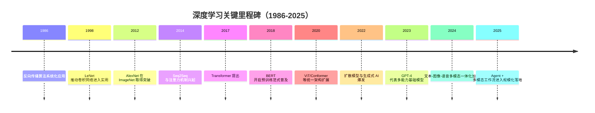
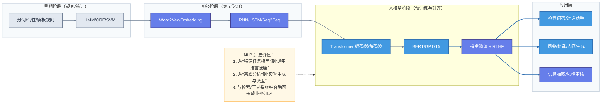
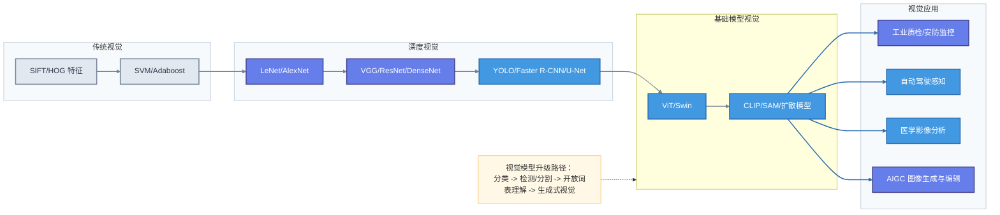
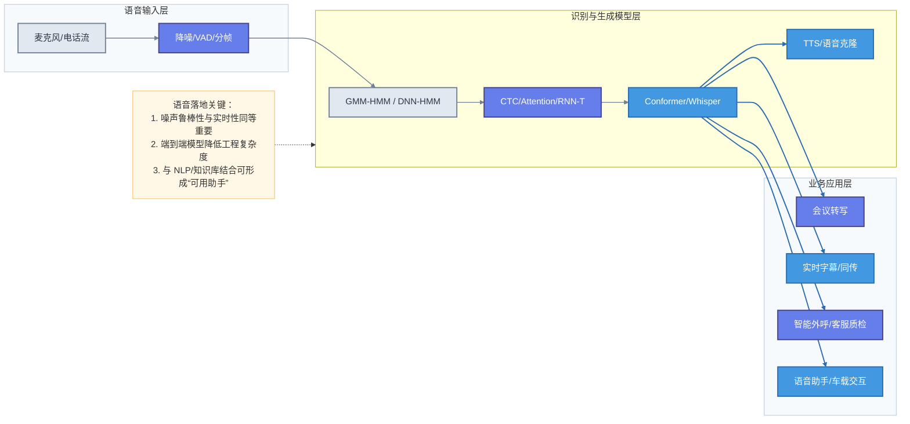
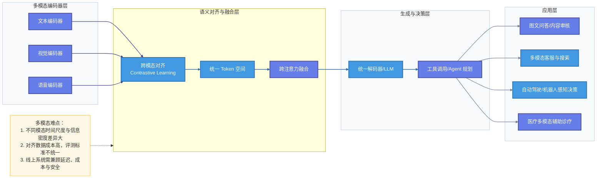
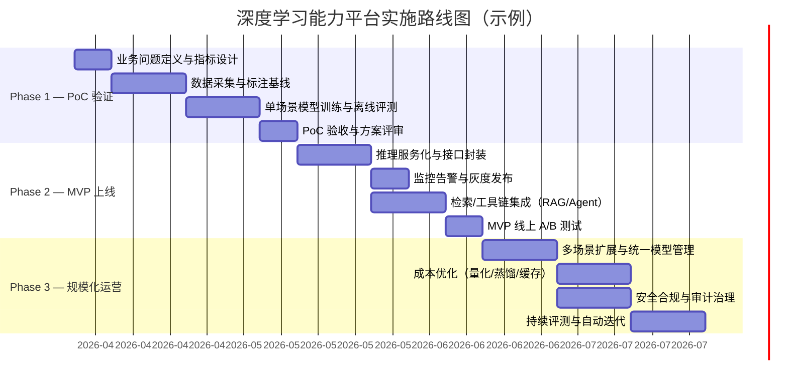

# 深度学习模型发展演变与应用场景（含 NLP / 视觉 / 语音 / 多模态）

## 1. 文档目标与阅读指南

本文面向希望系统理解 AI 模型演进脉络的读者，重点回答四个问题：
- 模型为什么会从“简单”演进到“复杂”；
- 每一次架构升级解决了什么核心问题；
- 各技术在真实业务中的典型应用是什么；
- 如何把这些能力落地到可实施的项目路线中。

建议阅读顺序：先看第 2 节（总演进逻辑），再按第 3~6 节分领域深入，最后看第 7 节（实践路线）与第 8 节（面试 FAQ）。

---

## 2. 深度学习模型总体演进：从特征工程到基础模型

### 2.1 演进主线

深度学习的发展，本质是“表示学习能力”与“通用化能力”不断增强的过程，可概括为：
- **阶段 1：人工特征 + 浅层模型**（依赖专家经验，泛化弱）；
- **阶段 2：端到端深度网络**（自动学习特征，性能显著提升）；
- **阶段 3：大规模预训练**（任务从“单任务训练”转为“预训练 + 微调/提示”）；
- **阶段 4：基础模型与多模态统一**（从“模型”升级为“能力平台”）。

### 2.2 关键概念与关系图（概念 / 模块 / 关系）

```mermaid
flowchart LR
    %% 样式定义
    classDef coreStyle fill:#4299e1,stroke:#2b6cb0,stroke-width:2px,color:#fff
    classDef supportStyle fill:#667eea,stroke:#434190,stroke-width:2px,color:#fff
    classDef extStyle fill:#e2e8f0,stroke:#718096,stroke-width:2px,color:#2d3748
    classDef subgraphStyle fill:#f7fafc,stroke:#cbd5e0,stroke-width:1.5px
    classDef noteStyle fill:#fff8e6,stroke:#ffb74d,stroke-width:1px

    subgraph inputLayer["输入与数据层"]
        A[多源数据<br/>文本/图像/语音/日志]:::extStyle
        B[数据治理<br/>清洗/标注/增强]:::supportStyle
    end
    class inputLayer subgraphStyle

    subgraph modelLayer["模型能力层"]
        C[表示学习<br/>Embedding]:::coreStyle
        D[架构升级<br/>CNN/RNN/Transformer]:::coreStyle
        E[训练范式<br/>监督/自监督/指令微调]:::supportStyle
    end
    class modelLayer subgraphStyle

    subgraph appLayer["应用与工程层"]
        F[任务能力<br/>分类/生成/检索/预测]:::coreStyle
        G[系统能力<br/>部署/监控/评测/迭代]:::supportStyle
        H[业务价值<br/>效率提升/体验优化/成本下降]:::extStyle
    end
    class appLayer subgraphStyle

    A -->|原始数据供给| B
    B -->|训练数据| C
    C -->|特征表示| D
    D -->|模型参数学习| E
    E -->|输出任务能力| F
    F -->|集成到业务系统| G
    G -->|驱动结果| H

    linkStyle 0,1,2 stroke:#2b6cb0,stroke-width:2px
    linkStyle 3,4 stroke:#434190,stroke-width:1.8px
    linkStyle 5,6 stroke:#718096,stroke-width:1.5px

    Note[演进核心规律：<br/>1. 数据规模与算力提升推动模型复杂化<br/>2. 统一架构降低跨任务迁移成本<br/>3. 工程化能力决定模型价值上限]:::noteStyle
    Note -.-> modelLayer
```

### 2.3 发布时间与里程碑（发布时间）

---

## 3. NLP 模型演进与应用场景

### 3.1 从简单到复杂的演进过程

1. **规则与统计时代**：n-gram、HMM、CRF、SVM，依赖人工特征，迁移能力弱。  
2. **神经网络时代**：Word2Vec、RNN/LSTM，开始端到端学习。  
3. **注意力与 Transformer**：并行计算更高效，长距离依赖建模显著提升。  
4. **预训练大模型时代**：BERT（理解）、GPT（生成）成为通用底座。  
5. **指令对齐与 Agent 化**：从“文本生成器”升级为“可调用工具的问题解决器”。

### 3.2 NLP 关键流程图（流程 / 功能 / 模块关系）

### 3.3 NLP 典型应用场景

#### 3.3.1 情感分析与舆情监测

- **电商评论情感分类**：对商品评价进行正/负/中性三分类，细粒度分析"物流快、但包装差"等属性级情感，辅助选品与售后策略。
- **社交媒体舆情监测**：实时采集微博、Twitter 等平台数据，通过情感趋势、话题聚类识别品牌危机或产品口碑波动，触发预警。
- **金融市场情绪指数**：对财经新闻、研究报告做情感打分，作为量化投资因子或风险预警信号。
- **用户 NPS/满意度分析**：对客服工单、用户反馈表单批量做情感评分，辅助运营决策与产品改进。
- **政务与公众反馈**：分析政策公示评论、民意调查文本，量化公众态度与关注热点。

#### 3.3.2 信息抽取与知识图谱构建

- **命名实体识别（NER）**：从医疗记录中识别疾病名、药物名、检测指标；从法律文书中提取案号、当事人、争议焦点；从招聘 JD 中识别职位、技能、公司。
- **关系抽取**：自动从新闻/报告中发现"A 收购 B""X 药治疗 Y 病"等实体关系，构建或补全知识图谱。
- **事件抽取**：识别财报中的"Q3 营收下滑 15%""裁员 500 人"等结构化事件，供下游分析使用。
- **知识图谱问答（KGQA）**：将知识库与大模型结合，支持多跳推理查询，如"A 公司的 CEO 毕业于哪所大学"。

#### 3.3.3 文本分类与路由

- **工单智能分类与派单**：客服工单按产品线、问题类型自动分类，路由至对应处理团队，减少人工转单。
- **邮件/消息分类**：企业内部邮件按紧急度、类别归档；钓鱼邮件/垃圾邮件检测。
- **新闻与内容分类**：媒体平台对文章按主题（科技、财经、体育）自动打标，驱动推荐系统。
- **合规/有害内容检测**：识别平台 UGC 中的违禁词、暴力、诈骗话术，自动拦截或标注人工复审。

#### 3.3.4 文本生成与内容创作

- **营销文案生成**：基于产品信息和目标人群生成多版本广告文案，A/B 测试后择优发布。
- **长文本摘要**：对研究报告、会议纪要、法律合同生成结构化摘要，降低阅读成本。
- **机器翻译与本地化**：大模型翻译质量接近专业译者，应用于电商平台多语言商品描述、游戏本地化、外交文件初译。
- **代码辅助生成**：GitHub Copilot、Cursor 等工具基于上下文补全代码、自动写注释与单元测试，提升开发效率 30%~50%。
- **个性化报告自动撰写**：金融行业量化报告、数据平台周报、运营日报自动生成，减少重复劳动。

#### 3.3.5 问答系统与智能助手

- **企业内部知识库问答（RAG）**：将内部文档、FAQ、政策文件向量化入库，用户提问时检索相关片段后由大模型生成回答，准确率和可溯源性均高于纯生成。
- **多轮对话客服**：识别用户意图、维护对话状态、调用订单/物流系统 API，完成全流程自助服务。
- **法律咨询助手**：结合法规库与判例库回答合同纠纷、劳动仲裁等常见法律问题，辅助律师检索。
- **医疗预问诊**：用户描述症状后，系统追问关键信息并给出初步分诊建议，降低医生重复性问诊负担。

#### 3.3.6 搜索增强与推荐系统

- **语义搜索（Dense Retrieval）**：传统关键词搜索无法命中的语义相近内容，通过向量检索精准召回，提升搜索体验。
- **对话式搜索**：用户可用自然语言多轮细化搜索条件（"价格在 500 以内、评分高的无线耳机"），替代繁琐筛选器。
- **内容推荐冷启动**：对新用户或新内容，通过语义匹配而非协同过滤完成冷启动推荐。

#### 3.3.7 风控与合规

- **反欺诈文本检测**：识别贷款申请材料中的逻辑矛盾、伪造痕迹；识别客服对话中的话术欺诈。
- **合同风险审查**：自动标注合同中的不利条款、缺失条款、与标准模板的差异，降低法务审查成本。
- **监管报送合规检查**：对财务报告、信披文件做合规性预检，识别遗漏披露项或措辞风险。

---

## 4. 视觉模型演进与应用场景

### 4.1 从简单到复杂的演进过程

1. **手工特征 + 传统分类器**：SIFT/HOG + SVM。  
2. **CNN 突破阶段**：LeNet、AlexNet、VGG、ResNet。  
3. **任务专用网络阶段**：Faster R-CNN、YOLO、U-Net、Mask R-CNN。  
4. **Transformer 视觉化阶段**：ViT、Swin Transformer，统一建模能力增强。  
5. **视觉基础模型阶段**：CLIP、SAM、扩散模型，实现“识别 + 生成 + 分割”一体化。

### 4.2 视觉模型演进图（概念 / 功能 / 关系）

### 4.3 视觉领域典型应用场景

#### 4.3.1 工业制造与质量检测

- **表面缺陷检测**：识别金属、玻璃、PCB 板等产品表面划痕、气泡、错位等缺陷，替代人眼检验，良率可提升至 99.9% 以上。
- **尺寸与几何测量**：利用结构光 + 视觉系统实现亚毫米级精度测量，适用于精密零件、屏幕边框等场景。
- **产线异常行为预警**：检测工人未佩戴安全帽/手套、危险区域闯入、设备运行异常姿态等，实时告警。
- **外观一致性比对**：将生产实物与标准图纸/3D 模型对比，自动判定是否合格，减少漏检率。
- **焊缝与材料内部检测**：结合 X 光、热成像等异构传感器，检测不可见缺陷（气孔、裂纹）。

#### 4.3.2 交通与自动驾驶

- **目标检测与跟踪**：实时识别行人、车辆、骑手、障碍物，并保持跨帧目标 ID 连续，用于辅助驾驶与自动驾驶感知模块。
- **车道线与可行驶区域分割**：精确分割车道线、路沿、斑马线，为规划模块提供可行驶边界。
- **交通违规监控**：识别闯红灯、违规变道、压实线等行为，自动生成证据截图，支撑执法。
- **车辆行为预测**：预测周围车辆的未来轨迹，为自车规划提供安全裕度。
- **停车场无感支付**：车牌识别 + 车型识别，实现无停留快速出入库计费。

#### 4.3.3 医疗影像分析

- **病灶定位与分割**：在 CT/MRI/超声图像中自动圈出肺结节、肿瘤、斑块、血管狭窄区域，辅助医生快速定位。
- **眼底疾病筛查**：通过眼底图像识别糖尿病视网膜病变、青光眼风险，适合大规模体检筛查。
- **病理切片分析**：对组织切片扫描图（WSI）做细胞分类和癌变区域识别，辅助病理科分级诊断。
- **骨龄与生长发育评估**：基于 X 光片自动评估骨龄，辅助儿科诊断。
- **手术导航与规划**：3D 重建器官模型，辅助外科医生术前规划手术路径和切除范围。

#### 4.3.4 零售与消费

- **客流热力分析**：统计门店客流量、停留时长、动线路径，优化货架布局与促销位设计。
- **货架陈列监控**：识别货架是否缺货、商品摆放是否符合标准（品牌/价签/面朝前），自动推送补货通知。
- **无人结算与防损**：基于多相机识别顾客取放商品，结合重力传感器实现免扫码结算；识别异常拿取行为预防盗损。
- **虚拟试穿 / 试妆**：通过视觉分割与 AR 叠加，让用户在线预览服装、眼镜、口红上身效果，降低退货率。
- **商品视觉搜索**：拍照即可搜索同款或相似商品，用于导购与比价场景。

#### 4.3.5 安防与公共安全

- **人脸识别与布控**：在高铁站、机场等卡口进行 1:N 人脸比对，识别关注人员，辅助安保布控（需严格隐私合规）。
- **活体检测（防伪）**：防止照片、视频、3D 面具等伪造攻击，保障人脸支付与门禁系统安全。
- **异常行为检测**：识别人群聚集、人员摔倒、遗弃包裹、翻越围栏等安全事件，自动报警。
- **消防隐患检测**：识别占道停车、消防通道堵塞、电动车室内充电等安全隐患。

#### 4.3.6 农业与自然环境

- **病虫害识别**：对作物叶片图像识别锈病、白粉病、害虫种类，指导精准施药，减少农药用量。
- **卫星/无人机遥感解析**：对农田遥感图像做作物分类、长势估算、旱涝识别，辅助农业保险定损和政策补贴。
- **动物种群监测**：通过摄像头或无人机影像统计野生动物数量，辅助自然保护区管理。

#### 4.3.7 内容创作与媒体

- **AI 图像生成（AIGC）**：扩散模型（Stable Diffusion、DALL-E、Midjourney）生成广告素材、概念图、游戏贴图，大幅降低设计成本。
- **视频剪辑自动化**：镜头检测、场景切分、字幕烧录、人脸虚化，减少后期剪辑工作量。
- **图像超分辨率与修复**：老照片修复、视频帧超分，用于影视制作和历史档案数字化。
- **虚拟数字人**：结合人脸重建与驱动技术，制作品牌虚拟代言人或直播间数字主播。

---

## 5. 语音模型演进与应用场景

### 5.1 从简单到复杂的演进过程

1. **统计语音时代**：GMM-HMM + MFCC 特征。  
2. **深度声学模型时代**：DNN-HMM，识别准确率显著提升。  
3. **端到端时代**：CTC、Attention、RNN-T，降低模块耦合。  
4. **统一架构时代**：Conformer、Transformer-Transducer。  
5. **大模型语音时代**：Whisper、wav2vec2、语音大模型（ASR + TTS + 翻译一体化）。

### 5.2 语音系统流程图（流程 / 模块 / 功能）

### 5.3 语音领域典型应用场景

#### 5.3.1 会议与办公效率

- **实时会议转写**：对线上/线下会议进行多说话人分离（Diarization）+ 全文转录，错误率（WER）已可达 5% 以下（标准普通话）。
- **纪要自动生成**：转写结果 + NLP 摘要，自动提取决议、待办事项、责任人，会议结束即可分发。
- **语音指令操作系统**：办公软件通过语音完成格式调整、表格填写、文件搜索，适合手部受限或无屏场景。
- **异步语音协作**：语音留言转文字，便于异步查阅和搜索。

#### 5.3.2 呼叫中心与客服质检

- **全量录音转写与质检**：替代抽检模式，对全量通话进行 ASR 转写后，通过规则或 NLP 模型自动评分（合规用语、情绪、服务流程完整性）。
- **实时话术提示**：坐席通话中，系统实时识别用户意图，弹出对应话术建议和产品信息，提升成单率。
- **智能外呼（IVR 升级版）**：AI 语音代替人工执行满意度回访、账单提醒、预约确认等高频外呼任务。
- **情绪识别与升温预警**：通过声学特征（音量、语速、音调波动）检测用户情绪升温，及时提示人工介入。
- **通话摘要与 CRM 对接**：通话结束后自动生成摘要并写入 CRM，消除坐席手工填写记录的负担。

#### 5.3.3 车载与 IoT 交互

- **免手操车载语音助手**：识别"导航去最近加油站""调低空调温度"等指令，驾驶过程中不分散注意力。
- **唤醒词检测（KWS）**：低功耗芯片端侧运行，始终监听唤醒词（"小艺""Hey Siri"），触发后才传云端处理。
- **智能家居控制**：通过自然语言控制灯光、窗帘、门锁、空调等，支持多步骤组合指令。
- **工业设备语音巡检**：工人现场语音录入设备异常描述，系统自动转写并生成工单，解放双手。

#### 5.3.4 媒体、影视与内容生产

- **自动字幕与多语言字幕**：视频平台对 UGC/PGC 内容批量生成字幕，并同步翻译为多语言，降低人工制作成本。
- **TTS 有声读物与播客**：将文字内容转为高拟真语音，制作有声书、新闻播报、播客内容。
- **语音克隆（声音复刻）**：采集少量目标人声（5~30 秒），克隆其音色用于广告配音、游戏 NPC、虚拟主播，降低录制成本（须合规授权）。
- **影视配音本地化**：影视剧多语言配音自动生成，保留原声演员情绪特征，降低人工翻配周期。

#### 5.3.5 教育与语言学习

- **口语发音评测（GOP 评分）**：通过音素级对齐评估学习者发音准确度、流利度，用于英语/普通话口语练习 App。
- **实时纠错与发音指导**：检测错误音素并提示标准读法，替代人工纠音，适合大班在线教育。
- **听力理解练习生成**：TTS 合成不同口音、语速的听力材料，丰富备考资源。
- **无障碍辅助**：为听障人士提供实时字幕；为视障人士提供屏幕阅读与语音输入。

#### 5.3.6 医疗与健康

- **临床病历语音录入**：医生口述病历，系统实时转写并结构化录入 HIS/EMR，减少书写负担，转写准确率在专科词库支撑下可达 98% 以上。
- **声纹身份核验**：电话银行、医保报销等场景通过声纹比对替代或辅助身份验证。
- **心理健康风险监测**：通过声学特征（语速下降、停顿增多、音调单一）辅助筛查抑郁倾向（仍需专业医生确诊）。
- **手术室语音控制**：外科医生在无菌状态下通过语音调取影像、记录手术步骤。

#### 5.3.7 跨语种通信与国际化

- **实时同传（Simultaneous Interpretation）**：ASR + 翻译 + TTS 串联，延迟控制在 2~3 秒内，用于国际会议、跨境直播。
- **多语言客服中心**：统一接入多语种用户，ASR 识别后翻译为坐席语言，回复再翻回用户语言，降低多语种坐席成本。
- **跨语言内容本地化**：对视频/音频内容做语音识别 + 翻译 + 配音，快速出多语言版本。

---

## 6. 多模态模型演进与应用场景

### 6.1 从简单到复杂的演进过程

1. **早期融合**：手工拼接文本/图像/音频特征，鲁棒性弱。  
2. **双塔与对齐学习**：CLIP 类模型实现跨模态共同语义空间。  
3. **统一编码解码**：视觉语言模型（VLM）支持看图问答、文图生成。  
4. **指令化多模态大模型**：支持文本、图像、语音联合输入输出。  
5. **全链路 Agent 化**：模型可调用搜索、数据库、业务系统完成复杂任务。

### 6.2 多模态架构关系图（模块 / 关系 / 流程）

### 6.3 多模态典型应用场景

#### 6.3.1 电商与内容平台

- **图文商品搜索**：用户拍一张图即可搜索同款或相似商品，结合文字修饰（"同款但要红色"）精确筛选，转化率显著高于纯文字搜索。
- **商品多模态审核**：同时分析商品图片与标题描述，识别"图文不符""违禁商品"等风险，减少人工复审量。
- **短视频自动理解与打标**：对视频帧序列 + 字幕 + 音频综合分析，自动生成标签、摘要、分类，驱动推荐系统。
- **多模态推荐**：结合用户的历史浏览图片、点击文字、收听音频偏好，构建统一用户兴趣向量，提升推荐多样性与相关性。
- **直播内容实时分析**：实时识别直播画面中的商品、口播内容，自动关联购物车链接，辅助直播带货运营。

#### 6.3.2 智慧医疗

- **多模态联合诊断**：将影像（CT/MRI/病理切片）、电子病历文字、检验报告数值、语音问诊记录融合分析，比单一模态诊断准确率更高。
- **放射科报告生成**：AI 读片后直接生成结构化影像报告草稿，医生核对修改后发布，减少书写时间 60% 以上。
- **手术视频 + 语音记录分析**：将手术录像与麻醉师/主刀语音标注对齐，自动生成手术记录并辅助质控。
- **康复训练指导**：摄像头实时捕捉患者动作姿态，结合语音指令和可穿戴传感器数据，给出个性化康复建议。
- **药物研发文献理解**：分子结构图 + 实验数据表格 + 论文文字联合理解，辅助研究人员快速发现有效化合物线索。

#### 6.3.3 智能制造与工业巡检

- **图像缺陷 + 工单文本协同**：视觉检测系统发现缺陷后自动拍照，结合维修历史文本生成工单，推荐处理方案。
- **语音 + 视觉操作引导**：工人佩戴 AR 眼镜，系统识别当前操作步骤后通过语音和视觉叠加提示下一步，降低培训周期。
- **设备状态预测性维护**：振动声音 + 红外温度图像 + 运行日志文本联合建模，预判设备故障时间窗口。
- **仓储与物流调度**：摄像头识别货物形态 + 条码文字 + 语音指令，三路信息融合驱动 AGV 路径规划和拣货机器人。

#### 6.3.4 智能驾驶与机器人

- **感知融合**：摄像头图像 + 激光雷达点云 + 高精地图文字 + 传感器数值联合感知，构建 360° 环境理解。
- **自然语言驾驶指令**：乘客说"靠边停一下"或"找个附近的停车场"，系统理解语义后调用规划模块执行。
- **具身智能体（Embodied AI）**：机器人通过摄像头观察环境，理解语言指令后规划并执行拿取、摆放、搜索等任务，代表前沿研究方向。
- **远程操控辅助**：操作员通过语音 + 视觉反馈控制远程机器人，AI 辅助完成精细动作和避障决策。

#### 6.3.5 教育与培训

- **智能辅导系统**：学生拍照上传作业，AI 识别题目图像 + 理解解题过程文字，给出针对性讲解和错误归因。
- **口语 + 体态综合评测**：在线面试或英语口语练习时，同时分析发音准确度（语音）、表达流畅度（文本）和面部表情自信度（视觉），给出综合反馈。
- **课堂行为分析**：通过摄像头分析学生专注度、手举情况，结合语音互动数据评估课堂参与度（须学校授权并匿名化处理）。
- **多模态内容生成**：根据教学大纲文字自动生成配图课件、配音视频和练习题，降低备课成本。

#### 6.3.6 金融与保险

- **保险理赔多模态审核**：车险事故现场照片 + 维修报价文字 + 语音陈述三路融合，AI 自动核损定价，压缩理赔周期。
- **KYC 身份核验**：身份证图像识别 + 人脸活体比对 + 视频语音真实性检测，多模态联合防范身份冒用。
- **金融投研辅助**：财报 PDF 图表 + 文字数据 + 管理层电话会议语音一体化理解，辅助分析师快速提炼投资要点。

#### 6.3.7 文化创意与娱乐

- **AIGC 内容创作**：根据剧本文字生成分镜图（文 → 图）、配乐（文 → 音频）、视频预览（文 → 视频），加速影视/游戏前期制作。
- **虚拟偶像与数字人**：语音 + 面部驱动 + 语义理解三路协作，使数字人在直播/会议中具备自然的"看、听、说"能力。
- **互动叙事游戏**：玩家语音输入影响剧情走向，AI 实时生成对应文字/图像/语音反馈，实现个性化游戏体验。

---

## 7. 实践落地：从 PoC 到生产的实施路线图

下图给出一个可复用的 AI 能力建设节奏，帮助团队从“模型可用”走向“业务可持续”。

### 7.1 落地建议（便于实践）

- 先定义业务指标，再选模型（避免“模型先进但业务无收益”）。  
- 优先做小闭环 MVP，快速上线拿真实反馈。  
- 将“评测、监控、回滚”作为上线前置条件。  
- 将多模型路由与成本控制纳入架构设计。  
- 将数据反馈回流到训练流程，形成持续优化闭环。

---

## 8. 面试常见问题（FAQ）

### Q1：为什么 Transformer 能成为 NLP 主流架构？
**A：**并行计算效率高，能更好捕获长距离依赖；同时在大规模预训练下具备更强迁移性，适配多任务统一建模。

### Q2：CNN 还会被 ViT 完全替代吗？
**A：**短期不会。CNN 在中小数据、边缘设备和工业实时场景仍具性价比；ViT 在大数据和通用视觉任务优势更明显，实际中常混合使用。

### Q3：语音识别上线最常见的瓶颈是什么？
**A：**噪声环境、口音差异与实时延迟。工程上通常通过前端降噪、领域自适应训练、流式解码优化来解决。

### Q4：多模态系统为什么比单模态更难落地？
**A：**核心难点是数据对齐（时间、语义、质量）、系统复杂度（多编码器多链路）和成本控制（推理资源占用高）。

### Q5：如何选择“微调模型”还是“RAG + 提示工程”？
**A：**若需求偏知识更新与可解释，优先 RAG；若需求偏稳定风格、固定流程和专有能力，优先微调。多数企业采用混合路线。

### Q6：如何评估大模型效果，避免“只看主观体验”？
**A：**建立分层评测：离线指标（准确率/召回/F1）+ 在线指标（转化率、时延、失败率）+ 人工抽检（事实性、安全性）。

### Q7：模型上线后性能下降（模型漂移）怎么办？
**A：**建立漂移监控（数据分布与输出分布）、阈值告警、自动回滚与周期性重训练机制。

### Q8：企业在引入生成式 AI 时最容易忽略什么？
**A：**安全合规与成本治理。需提前设计敏感数据脱敏、权限控制、日志审计和推理成本预算。

### Q9：为什么现在强调 Agent，而不只是 ChatBot？
**A：**ChatBot 主要负责“对话”，Agent 更强调“任务完成”，可规划步骤、调用工具、访问系统，直接产出业务结果。

### Q10：面试中如何简洁说明“模型演进的本质”？
**A：**一句话版本：**从人工定义特征，走向模型自动学习表示；从单任务训练，走向大规模预训练与跨任务泛化；从单模态能力，走向多模态与可执行智能体。**

---

## 9. 小结

深度学习模型的演进不是单纯“参数变大”，而是数据、架构、训练范式与工程系统协同升级的结果。  
在实践中，真正决定价值上限的是：**能否把模型能力嵌入可观测、可迭代、可治理的业务闭环。**
