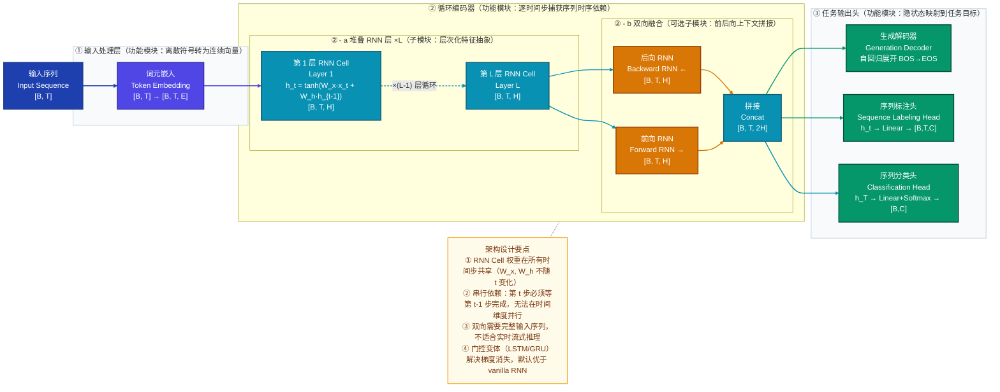
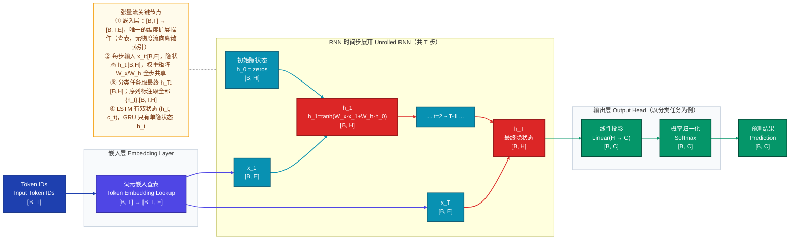
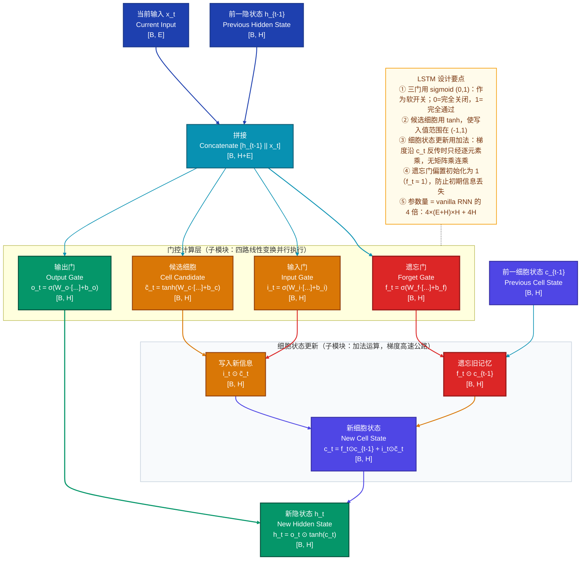
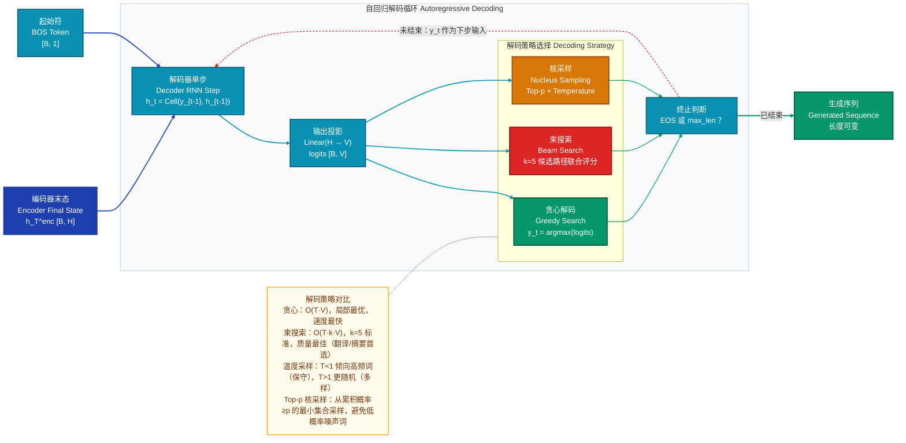

# RNN 循环神经网络 深度学习技术分析文档

> 版本：v1.0 | 日期：2026-03-23 | 任务类型：序列建模

---

## 1. 模型定位

**RNN（Recurrent Neural Network，循环神经网络）** 是专为**序列数据建模**设计的神经网络，属于序列模型（Sequence Modeling）研究方向。其核心创新在于引入**隐状态循环连接机制**——在每个时间步将当前隐状态传递给下一步，使模型具备对历史信息的「记忆」能力，从而打破了前馈网络对输入独立性的假设，成为处理时序依赖数据（文本、语音、时间序列）的奠基性架构。

---

## 2. 整体架构

### 2.1 三层拆解（ASCII 树形结构）

```
RNN 整体架构
├── 输入处理层（Input Processing）                    # 原始序列 → 连续向量，唯一维度突变节点
│   ├── 词元化（Tokenization）                        # 文本/符号 → 整数索引 [B, T]
│   └── 嵌入层（Embedding Layer）                     # 查嵌入矩阵：索引 → 稠密向量 [B, T, E]
│
├── 循环编码器（Recurrent Encoder）                   # 核心计算主干，时序依赖建模，串行展开
│   ├── 单向 RNN 层（Unidirectional，基础）            # 按时间顺序正向展开，共享权重
│   │   ├── RNN 单元（RNN Cell）                      # 每步：h_t = f(x_t, h_{t-1})，参数共享
│   │   │   ├── 线性变换（Linear）                    # W_h·h_{t-1} + W_x·x_t + b
│   │   │   └── 激活函数（tanh）                      # 压缩到 (-1,1)，防值域无限增长
│   │   └── 多层堆叠（Stacked Layers ×L）             # 下层输出作上层输入，层次化抽象
│   ├── 门控变体（Gated Variants）                    # 解决 vanilla RNN 梯度消失/长程遗忘
│   │   ├── LSTM Cell（1997）                         # 遗忘门/输入门/输出门 + 细胞状态高速公路
│   │   └── GRU Cell（2014）                          # 更新门/重置门，参数减少 25%，性能接近
│   └── 双向扩展（Bidirectional，可选）                # 前向 + 后向并行，融合全局上下文
│       ├── 前向 RNN（Forward）                       # h_t^{→}：利用历史信息
│       └── 后向 RNN（Backward）                      # h_t^{←}：利用未来信息；拼接后维度 2H
│
└── 任务输出头（Task Head）                           # 将隐状态映射到目标输出，与编码器串行
    ├── 序列分类（Sequence Classification）            # 取最终 h_T → Linear → Softmax → [B,C]
    ├── 序列标注（Sequence Labeling）                  # 每步 h_t → Linear → 标签分布 [B,T,C]
    └── 序列生成（Sequence Generation）               # Decoder 自回归展开，逐步生成目标序列
```

### 2.2 模块职责与连接方式说明

| 层级 | 连接方式 | 职责边界 |
|------|---------|---------|
| 输入处理层 → 循环编码器 | **串行** | 输入处理层是唯一的维度突变节点（$V \to E$），编码器接收固定宽度向量序列 |
| RNN Cell 各时间步 | **串行依赖**（核心特征） | $h_t$ 依赖 $h_{t-1}$，无法并行；参数 $W_x, W_h$ 所有步共享 |
| 双向 RNN 前向/后向 | **并行计算，拼接输出** | 两路独立处理，最终在特征维度拼接为 $2H$，互不依赖 |
| 多层堆叠 | **串行**（深度堆叠） | 层 $l$ 的输出序列 $\{h_t^l\}$ 作为层 $l+1$ 的输入序列 |
| 循环编码器 → 任务头 | **串行** | 任务头根据下游任务选择取哪些时间步的隐状态 |

---

## 3. 模型整体架构图



---

## 4. 数据直觉

### 以情感分析任务为例：一条评论的完整旅程

**原始输入**（真实文字）：

```
"这部电影的特效非常惊艳，但剧情却令人失望。"
```

**① 预处理：Tokenization → Embedding**

```
分词结果（基于词级分词）：
["这部", "电影", "的", "特效", "非常", "惊艳", "，", "但", "剧情", "却", "令人", "失望", "。"]
                                                                 ↓ 词表索引映射（词表大小 V=10000）
整数序列: [142, 883, 4, 2341, 67, 5521, 2, 89, 1024, 31, 4421, 768, 3]
形状: [1, 13]   (批次=1, 序列长 T=13)
                                                                 ↓ 嵌入矩阵查表（嵌入维度 E=128）
嵌入输出: shape [1, 13, 128]
```

此时每个词变成 128 维浮点向量。「惊艳」和「精彩」在嵌入空间中彼此靠近，「失望」和「难看」靠近——**嵌入层在表达语义相似性，而非任何时序关系**。

---

**② 关键中间表示：RNN 时间步展开（隐状态维度 H=256）**

RNN 每步将「当前输入」和「历史记忆」融合，更新隐状态：

| 时间步 | 输入词 | 隐状态语义（直觉解读） | 关键变化 |
|--------|--------|----------------------|---------|
| $t=1$  | "这部" | 接近零向量，仅有微弱信号 | 序列开始，无历史 |
| $t=3$  | "的"   | 积累了"这部电影"的上下文，但语义模糊 | — |
| $t=6$  | "惊艳" | **正面情感信号强烈激活**，$h_6$ 带有显著正极性 | 情感出现 |
| $t=8$  | "但"   | 转折连词开始「动摇」正面信号，隐状态极性开始改变 | 转折点 |
| $t=12$ | "失望" | **负面情感压制正面**，$h_{12}$ 极性已反转为负 | 情感翻转 |
| $t=13$ | "。"   | 综合全句最终隐状态：情感偏负面（整体失望 > 惊艳） | 序列终结 |

这一过程揭示了 vanilla RNN 的局限：**句末的「失望」会淹没句前的「惊艳」**，因为 RNN 靠覆写更新记忆，早期信息逐渐被稀释。

---

**③ 模型原始输出**

```python
h_13 ∈ R^256               # 最终隐状态（综合全句语义）
↓ Linear(256, 3)           # 线性投影到类别数 C=3（正面/中性/负面）
logits = [1.2, 0.8, 2.7]  # 原始得分（未归一化）
↓ Softmax
probs  = [0.17, 0.12, 0.71]
↓ argmax
预测标签: 2（负面）
```

**④ 后处理结果**

最终输出：**负面**情感，置信度 71%。

真实解读：这条评论是「褒贬混合」，模型因长程记忆不足，过度受句尾负面词影响——这正是为什么 LSTM 的遗忘门/输入门设计如此重要。

---

## 5. 核心数据流

### 5.1 前向传播 / 张量流图



### 5.2 逐层张量维度变化追踪

| 处理阶段 | 具体操作 | 输入形状 | 输出形状 | 参数量（E=128, H=256, V=10000, C=3） |
|---------|---------|---------|---------|--------------------------------------|
| 词元化 | 词表查索引 | `[B, T]`（整数） | `[B, T]` | — |
| 嵌入层 | 查嵌入矩阵 $E$ | `[B, T]` | `[B, T, E]` | $V \times E = 1.28M$ |
| RNN Cell（每步，vanilla） | 矩阵乘 + tanh | `x:[B,E]`, `h:[B,H]` | `h:[B,H]` | $(E+H) \times H + H = 98K$ |
| LSTM Cell（每步） | 4 门计算 + 更新 | `x:[B,E]`, `h/c:[B,H]` | `h/c:[B,H]` | $4(E+H)H + 4H = 393K$ |
| 序列输出（分类） | 取最后时间步 | `[B, T, H]` | `[B, H]` | — |
| 输出线性层 | 全连接 | `[B, H]` | `[B, C]` | $H \times C + C = 771$ |
| Softmax | 归一化概率 | `[B, C]` | `[B, C]` | — |

---

## 6. 关键组件

### 6.1 RNN Cell — 带记忆的动态线性变换

**直觉**：RNN Cell 本质上做一件事——把「我现在看到了什么」（$x_t$）和「我之前记住了什么」（$h_{t-1}$）混合，经过非线性压缩，得到「更新后的记忆」（$h_t$）。它就像一块不断覆写的「便利贴」，每步根据新输入刷新已有记录。

**计算原理与公式**：

$$h_t = \tanh(W_x \cdot x_t + W_h \cdot h_{t-1} + b)$$

等价的拼接形式（计算效率更高，底层 cuDNN 实现常用）：

$$h_t = \tanh\left([x_t \;\|\; h_{t-1}] \cdot W + b\right), \quad W \in \mathbb{R}^{(E+H) \times H}$$

其中：
- $W_x \in \mathbb{R}^{E \times H}$：输入权重，学习「当前词对记忆的贡献」
- $W_h \in \mathbb{R}^{H \times H}$：循环权重，是参数共享的核心，决定「历史记忆如何传递」
- $\tanh$：值域 $(-1, 1)$ 有界，防止隐状态无限增长；在 $z \approx 0$ 时 $\tanh'(z) \approx 1$，梯度初期较稳定

**为什么用 tanh 而非 ReLU？**：ReLU 在 RNN 中容易导致梯度爆炸（$h_t$ 无界累积），而 tanh 的饱和区虽然会引发梯度消失，但配合 LSTM/GRU 后可缓解。现代变体（如 SRU）已逐渐改用分离架构规避这一问题。

---

### 6.2 LSTM Cell — 显式长程记忆管理

**直觉**：如果 RNN Cell 是「便利贴」，LSTM 就是「有分类文件夹的日记本」。它额外维护一条**细胞状态（Cell State）** $c_t$ 作为长期记忆的高速公路，通过三个「软开关（Gate）」精确控制信息的读写：**忘掉什么（遗忘门）、写入什么（输入门）、输出什么（输出门）**，从而让关键信息可以在数百步之后仍保持不被稀释。

**完整内部计算（四步门控流程）**：

**第一步：遗忘门** — 决定从旧细胞状态中丢弃哪些信息

$$f_t = \sigma(W_f \cdot [h_{t-1} \;\|\; x_t] + b_f)$$

**第二步：输入门** — 决定将哪些新信息写入细胞状态

$$i_t = \sigma(W_i \cdot [h_{t-1} \;\|\; x_t] + b_i)$$
$$\tilde{c}_t = \tanh(W_c \cdot [h_{t-1} \;\|\; x_t] + b_c)$$

**第三步：细胞状态更新** — 核心：加法更新，梯度高速公路

$$c_t = f_t \odot c_{t-1} + i_t \odot \tilde{c}_t$$

**第四步：输出门** — 决定从细胞状态中输出哪些信息

$$o_t = \sigma(W_o \cdot [h_{t-1} \;\|\; x_t] + b_o)$$
$$h_t = o_t \odot \tanh(c_t)$$

其中 $\sigma(\cdot)$ 为 sigmoid 函数（值域 $(0,1)$，用作软开关），$\odot$ 为 Hadamard 逐元素积。

**核心设计洞察**：$c_t = f_t \odot c_{t-1} + i_t \odot \tilde{c}_t$ 这个**加法更新**是解决梯度消失的关键。梯度沿细胞状态传递时经历的是：

$$\frac{\partial c_t}{\partial c_{t-1}} = f_t$$

这是**逐元素乘法**（而非矩阵乘法的连乘），若 $f_t \approx 1$（遗忘门初始化偏置设为 1 可保证），梯度可以近似无损传递数百步。这与 ResNet 的残差连接 $x_{l+1} = F(x_l) + x_l$ 是同一类设计哲学：**用加法创造梯度高速公路**。

---

### 6.3 BPTT — 时间维度反向传播

**直觉**：RNN 将同一组权重 $W_h$ 在 $T$ 个时间步复用了 $T$ 次。反向传播时，梯度必须沿时间轴「穿越」所有步骤，就像在长达 $T$ 节的连锁反应中，每经过一节都要乘以当时的局部导数。$T$ 步连乘后，梯度可能指数级消失（长序列无法学习）或爆炸（训练发散）。

**梯度传播公式**：

损失 $\mathcal{L}$ 对权重 $W_h$ 的梯度需要对所有时间步求和：

$$\frac{\partial \mathcal{L}}{\partial W_h} = \sum_{t=1}^{T} \frac{\partial \mathcal{L}_t}{\partial W_h} = \sum_{t=1}^{T} \sum_{k=1}^{t} \left(\prod_{j=k+1}^{t} \frac{\partial h_j}{\partial h_{j-1}}\right) \frac{\partial h_k}{\partial W_h}$$

其中关键的连乘项为：

$$\prod_{j=k+1}^{t} \frac{\partial h_j}{\partial h_{j-1}} = \prod_{j=k+1}^{t} \underbrace{\text{diag}(\tanh'(z_j))}_{\text{饱和区趋近 }0} \cdot \underbrace{W_h^T}_{\text{奇异值}<1 \text{ 则衰减}}$$

- 当 $W_h$ 最大奇异值 $< 1$ 或 tanh 处于饱和区 → 连乘趋近 $0$ → **梯度消失**，长程依赖无法学习
- 当最大奇异值 $> 1$ → 连乘趋近 $\infty$ → **梯度爆炸**，通常用梯度裁剪（Gradient Clipping）解决

---

## 7. LSTM 门控内部结构图



---

## 8. 训练策略

### 8.1 损失函数设计

**序列分类任务**（取最终隐状态）：交叉熵损失

$$\mathcal{L}_{CE} = -\sum_{i=1}^{C} y_i \log \hat{y}_i$$

**序列标注任务**（每步独立预测）：逐步交叉熵均值

$$\mathcal{L}_{seq} = -\frac{1}{T}\sum_{t=1}^{T}\sum_{c=1}^{C} y_{t,c} \log \hat{y}_{t,c}$$

**语言模型**（下一词预测）：负对数似然，等价于逐步交叉熵

$$\mathcal{L}_{LM} = -\frac{1}{T}\sum_{t=1}^{T} \log P(w_t \mid w_1, \ldots, w_{t-1})$$

模型困惑度（Perplexity）是其指数形式，更直观：$PPL = e^{\mathcal{L}_{LM}}$

**CTC 任务**（语音识别等不定长对齐）：对所有合法对齐路径概率求和

$$\mathcal{L}_{CTC} = -\log \sum_{\pi \in \mathcal{B}^{-1}(y)} P(\pi \mid x)$$

其中 $\mathcal{B}$ 为去重折叠函数，$\mathcal{B}^{-1}(y)$ 是所有能折叠为目标序列 $y$ 的路径集合。

---

### 8.2 优化器与学习率调度

**Adam 优化器**（RNN 首选，自适应学习率应对梯度尺度差异）：

$$m_t = \beta_1 m_{t-1} + (1-\beta_1) g_t \quad \text{（一阶矩估计）}$$
$$v_t = \beta_2 v_{t-1} + (1-\beta_2) g_t^2 \quad \text{（二阶矩估计）}$$
$$\theta_{t+1} = \theta_t - \frac{\alpha}{\sqrt{\hat{v}_t} + \epsilon} \hat{m}_t$$

典型超参数：$\alpha = 10^{-3}$，$\beta_1 = 0.9$，$\beta_2 = 0.999$，$\epsilon = 10^{-8}$

**学习率调度策略**：
- **线性预热 + 余弦退火**：前 $N_{warmup}$ 步线性升温防止初期不稳定，之后余弦衰减
- **ReduceLROnPlateau**：验证集指标连续 $k$ epoch 停滞时自动降低学习率（乘以 $\gamma \approx 0.5$），适合中小规模任务

---

### 8.3 关键训练技巧

| 技巧 | 原理 | 注意事项 |
|-----|------|---------|
| **梯度裁剪（Gradient Clipping）** | $\|g\| > \text{max\_norm}$ 时：$g \leftarrow g \cdot \frac{\text{max\_norm}}{\|g\|}$ | RNN 建议阈值 5.0（高于 Transformer 的 1.0） |
| **变分 Dropout（Variational Dropout）** | 同一 mask 在 T 步复用；非循环连接上施加 | 普通 Dropout 每步独立会破坏时序连贯性 |
| **截断 BPTT** | 长序列分 $k$ 段（$k=64\sim256$），段内完整反传，段间 `.detach()` | 梯度无法跨段，理论上限制了可学习的依赖长度 |
| **嵌入层预训练初始化** | 用 GloVe/Word2Vec 初始化，可选是否 `requires_grad` | 低资源场景 freeze 嵌入层，防止过拟合 |
| **遗忘门偏置初始化为 1** | 初始 $f_t \approx \sigma(1) \approx 0.73$，倾向于保留旧记忆 | 仅 LSTM 有效，改善收敛初期稳定性 |
| **pack_padded_sequence** | 跳过 padding 位的无效计算，保证 $h_T$ 正确性 | 需配合 `pad_packed_sequence` 恢复 |

---

## 9. 训练流程图

```mermaid
flowchart LR
    %% ── 配色主题 ────────────────────────────────────────────────
    classDef dataStyle     fill:#1e40af,stroke:#1e3a8a,stroke-width:2px,color:#fff
    classDef forwardStyle  fill:#0891b2,stroke:#155e75,stroke-width:2px,color:#fff
    classDef lossStyle     fill:#dc2626,stroke:#991b1b,stroke-width:2.5px,color:#fff
    classDef backwardStyle fill:#d97706,stroke:#92400e,stroke-width:2px,color:#fff
    classDef optStyle      fill:#7c3aed,stroke:#4c1d95,stroke-width:2px,color:#fff
    classDef evalStyle     fill:#059669,stroke:#064e3b,stroke-width:2px,color:#fff
    classDef ctrlStyle     fill:#374151,stroke:#111827,stroke-width:2px,color:#fff
    classDef noteStyle     fill:#fffbeb,stroke:#f59e0b,stroke-width:1.5px,color:#78350f
    classDef layerStyle    fill:#f8fafc,stroke:#cbd5e0,stroke-width:1.5px

    DATASET[("序列数据集<br>Sequence Dataset")]:::dataStyle

    %% ── 数据加载 ────────────────────────────────────────────────
    subgraph LOAD["数据加载 Data Loading"]
        direction LR
        DL["数据加载器<br>DataLoader<br>采样 + 批次化"]:::dataStyle
        PAD["序列补齐<br>Dynamic Padding<br>[B, T_max]"]:::dataStyle
    end
    class LOAD layerStyle

    %% ── 前向传播 ────────────────────────────────────────────────
    subgraph FORWARD["前向传播 Forward Pass（BPTT 展开）"]
        direction LR
        INIT_H["初始化隐状态<br>h_0 = zeros<br>[B, H]"]:::forwardStyle
        UNROLL["时间步展开<br>T 步串行循环<br>h_t = Cell(x_t, h_{t-1})"]:::forwardStyle
        PRED["预测输出<br>Logits / Probs<br>[B,C] 或 [B,T,C]"]:::forwardStyle
    end
    class FORWARD layerStyle

    LOSS["损失计算<br>Cross-Entropy / CTC<br>标量 Loss"]:::lossStyle

    %% ── 反向传播 ────────────────────────────────────────────────
    subgraph BACKWARD["反向传播 BPTT Backward"]
        direction LR
        BW["loss.backward()<br>沿时间轴反传梯度<br>∂L/∂W_h 跨 T 步累加"]:::backwardStyle
        CLIP["梯度裁剪<br>Gradient Clipping<br>max_norm=5.0"]:::backwardStyle
    end
    class BACKWARD layerStyle

    %% ── 参数更新 ────────────────────────────────────────────────
    subgraph OPTIM["参数更新 Optimization"]
        direction LR
        OPT["optimizer.step()<br>Adam / SGD"]:::optStyle
        LRS["scheduler.step()<br>Cosine / ReduceLROnPlateau"]:::optStyle
        ZERO["optimizer.zero_grad()<br>清零梯度"]:::optStyle
    end
    class OPTIM layerStyle

    %% ── 验证评估 ────────────────────────────────────────────────
    subgraph EVAL["验证评估 Validation（每 N Epoch）"]
        direction LR
        VAL["验证集前向<br>torch.no_grad()<br>pack_padded_sequence"]:::evalStyle
        METRIC["指标计算<br>Acc / PPL / BLEU / F1"]:::evalStyle
        CKPT["检查点保存<br>Best Checkpoint"]:::evalStyle
    end
    class EVAL layerStyle

    DONE["训练完成<br>Final Model"]:::ctrlStyle

    %% ── 数据流 ────────────────────────────────────────────────
    DATASET --> DL
    DL      --> PAD
    PAD     -->|"[B, T_max]"| INIT_H
    INIT_H  --> UNROLL
    UNROLL  --> PRED
    PRED    --> LOSS
    LOSS    --> BW
    BW      --> CLIP
    CLIP    --> OPT
    OPT     --> LRS
    LRS     --> ZERO
    ZERO    -.->|"下一个 Batch"| DL
    OPT     -->|"每 N Epoch 触发"| VAL
    VAL     --> METRIC
    METRIC  --> CKPT
    CKPT    -.->|"早停判断"| DONE

    %% ── 设计注记 ──────────────────────────────────────────────
    NOTE["RNN 训练关键点<br>① 梯度裁剪阈值设为 5.0（高于 Transformer 1.0），BPTT 梯度尺度更不规律<br>② pack_padded_sequence 消除 padding 对最终隐状态的污染<br>③ 截断 BPTT：超长序列分 chunk_size=256 段展开，跨段 detach() 截断梯度<br>④ 推理时关闭 Dropout + no_grad，Truncated BPTT 不适用于推理"]:::noteStyle
    NOTE -.- FORWARD

    %% 边索引：0-15，共 16 条；NOTE -.- 为边 16
    linkStyle 0,1,2   stroke:#1e40af,stroke-width:2px
    linkStyle 3,4,5   stroke:#0891b2,stroke-width:2px
    linkStyle 6,7,8   stroke:#dc2626,stroke-width:2px
    linkStyle 9,10    stroke:#7c3aed,stroke-width:2px
    linkStyle 11      stroke:#7c3aed,stroke-width:1.5px,stroke-dasharray:4 3
    linkStyle 12,13   stroke:#059669,stroke-width:2px
    linkStyle 14      stroke:#059669,stroke-width:1.5px,stroke-dasharray:4 3
    linkStyle 15      stroke:#374151,stroke-width:1.5px,stroke-dasharray:4 3
```



---

## 10. 数据处理流水线图

```mermaid
flowchart LR
    %% ── 配色主题 ────────────────────────────────────────────────
    classDef rawStyle      fill:#374151,stroke:#111827,stroke-width:2px,color:#fff
    classDef prepStyle     fill:#4f46e5,stroke:#3730a3,stroke-width:2px,color:#fff
    classDef augStyle      fill:#d97706,stroke:#92400e,stroke-width:2px,color:#fff
    classDef batchStyle    fill:#0891b2,stroke:#155e75,stroke-width:2px,color:#fff
    classDef outputStyle   fill:#059669,stroke:#064e3b,stroke-width:2px,color:#fff
    classDef storeStyle    fill:#ea580c,stroke:#7c2d12,stroke-width:2px,color:#fff
    classDef noteStyle     fill:#fffbeb,stroke:#f59e0b,stroke-width:1.5px,color:#78350f
    classDef layerStyle    fill:#f8fafc,stroke:#cbd5e0,stroke-width:1.5px

    %% ── 原始数据 ────────────────────────────────────────────────
    subgraph RAW["原始数据 Raw Data"]
        direction LR
        TEXT[("原始文本<br>Raw Text / CSV")]:::rawStyle
        LABEL[("标签文件<br>Labels / Annotations")]:::rawStyle
    end
    class RAW layerStyle

    %% ── 离线预处理 ──────────────────────────────────────────────
    subgraph PREPROC["离线预处理（一次性执行，结果缓存）"]
        direction LR
        CLEAN["文本清洗<br>Text Cleaning<br>去噪 / 繁简转换"]:::prepStyle
        TOK["分词与编码<br>Tokenization<br>词表构建 + 索引映射"]:::prepStyle
        VOCAB[("词表<br>vocab.json<br>V = 30000")]:::storeStyle
        CACHE[("索引序列缓存<br>Preprocessed IDs<br>NPY / HDF5")]:::storeStyle
    end
    class PREPROC layerStyle

    %% ── 在线处理 ────────────────────────────────────────────────
    subgraph ONLINE["在线处理（每次迭代执行）"]
        direction LR
        TRUNC["截断或填充<br>Truncation / Padding<br>max_len = 512"]:::augStyle
        MASK["填充掩码生成<br>Padding Mask<br>[B, T] bool"]:::augStyle
    end
    class ONLINE layerStyle

    %% ── 批次化 ──────────────────────────────────────────────────
    subgraph BATCH_PROC["批次化 Batching"]
        direction LR
        SORT["按长度排序<br>Sort by Length<br>减少批内 Padding 总量"]:::batchStyle
        COLLATE["动态填充<br>Dynamic Padding<br>本批最大长度填充"]:::batchStyle
        PIN["锁页内存<br>Pin Memory<br>non_blocking=True"]:::batchStyle
    end
    class BATCH_PROC layerStyle

    MODEL_IN["模型输入<br>Token IDs [B, T]<br>+ Padding Mask [B, T]"]:::outputStyle

    %% ── 数据流 ────────────────────────────────────────────────
    TEXT   --> CLEAN
    LABEL  --> CLEAN
    CLEAN  --> TOK
    TOK    --> VOCAB
    TOK    --> CACHE
    CACHE  --> TRUNC
    TRUNC  --> MASK
    MASK   --> SORT
    SORT   --> COLLATE
    COLLATE --> PIN
    PIN    -->|"GPU 异步传输"| MODEL_IN

    %% ── 设计注记 ──────────────────────────────────────────────
    NOTE["NLP 数据流水线要点<br>① 动态填充（Dynamic Padding）：按批次最大长度填充，优于全局最大长度<br>② 按长度排序后同批序列长度接近，填充总量最小（PackedSequence 友好）<br>③ Padding Mask 随 Token IDs 一起送入，避免 padding 位参与损失计算<br>④ 词表大小影响嵌入参数量：V=30000, E=128 → 约 3.84M 参数"]:::noteStyle
    NOTE -.- ONLINE

    %% 边索引：0-10，共 11 条；NOTE -.- 为边 11
    linkStyle 0,1,2   stroke:#374151,stroke-width:2px
    linkStyle 3,4     stroke:#4f46e5,stroke-width:2px
    linkStyle 5,6,7   stroke:#d97706,stroke-width:2px
    linkStyle 8,9,10  stroke:#0891b2,stroke-width:2px
```



---

## 11. 评估指标与性能对比

### 11.1 主要评估指标

| 任务类型 | 核心指标 | 含义与选用理由 |
|---------|---------|--------------|
| 序列分类 | **Accuracy / Macro-F1** | 分类正确率；F1 适用于类别不平衡场景，比 Accuracy 更公平 |
| 语言模型 | **Perplexity（困惑度，PPL）** | $PPL = e^{\mathcal{L}_{LM}}$，衡量模型对序列的「惊讶程度」，越低越好；直觉上：PPL=100 意味着模型在每步预测时面临 100 个等可能选择 |
| 机器翻译 | **BLEU** | n-gram 精度的几何平均（1~4-gram），衡量生成质量与参考译文的相似度；BLEU-4 是标准，取值 0~100 |
| 语音识别 | **WER（词错误率）** | $WER = \frac{S+D+I}{N}$（替换+删除+插入 / 总词数），越低越好 |
| 序列标注 | **Span-F1** | 实体级别 F1（边界+类别均需正确），比 Token-F1 更严格 |
| 生成任务 | **ROUGE-L** | 最长公共子序列的召回率，摘要任务标准指标 |

### 11.2 Penn Treebank 语言模型 Benchmark（PPL ↓，越低越好）

| 模型 | 参数量 | Val PPL | Test PPL | 备注 |
|-----|-------|---------|---------|------|
| KN 5-gram LM（基线） | — | 141.2 | 141.2 | 传统 n-gram 方法 |
| Vanilla RNN（H=300） | ~4M | 120.7 | 114.5 | 无门控，梯度消失明显 |
| LSTM（单层，H=650） | ~19M | 82.2 | 78.4 | 标准 LSTM |
| LSTM（2层，标准 Dropout） | ~24M | 71.5 | 68.7 | 多层 + Dropout |
| AWD-LSTM（变分 Dropout+ASGD） | ~24M | 60.0 | 57.3 | 当时 RNN 类 SOTA |
| GRU（2层，H=500） | ~18M | 73.0 | 70.6 | 参数少 25%，性能接近 |
| Transformer-XL（参考） | ~151M | 23.1 | 24.0 | 注意：参数量差异巨大 |

### 11.3 消融实验：LSTM 各组件贡献（PTB Test PPL）

| 变体 | Test PPL | 较完整版差距 | 结论 |
|-----|---------|-----------|------|
| LSTM 完整（基准） | 68.7 | — | — |
| 去掉遗忘门（$f_t=1$） | 89.3 | +20.6 | **遗忘门贡献最大**，控制旧记忆清除 |
| 去掉输入门（$i_t=1$） | 75.1 | +6.4 | 输入门次之，控制新信息写入量 |
| 去掉输出门（$o_t=1$） | 72.8 | +4.1 | 输出门影响相对小 |
| 替换为 GRU | 70.6 | +1.9 | GRU 性能接近，参数减少 25% |
| 单层 LSTM（H=650） | 78.4 | +9.7 | 多层堆叠贡献显著 |
| 去掉 Dropout | 105.2 | +36.5 | 正则化至关重要 |

### 11.4 效率指标（2层 LSTM，H=512，T=100，B=32，A100 GPU）

| 指标 | 数值 |
|-----|------|
| 参数量 | ~5.2M |
| FLOPs / 序列（单向） | ~105M |
| 训练吞吐量 | ~2800 序列/秒 |
| 推理延迟（单序列，CPU） | ~12ms |
| 推理延迟（单序列，GPU） | ~2.3ms |
| 显存占用（B=32） | ~1.8GB |

---

## 12. 推理与部署

### 12.1 推理阶段与训练阶段的差异

| 方面 | 训练阶段 | 推理阶段 | 操作 |
|-----|---------|---------|------|
| Dropout | 开启（正则化） | **关闭** | `model.eval()` |
| 计算图 | 保留（反向传播需要） | **不保留** | `torch.no_grad()` |
| 初始隐状态 | 每批次全零初始化 | 流式场景**可复用**上段末态 | `h_0 = prev_h_T.detach()` |
| 序列长度 | 受截断 BPTT 限制 | **任意长度**（流式逐步处理） | — |
| BatchNorm | 使用 batch 统计量 | 使用运行均值/方差 | 自动切换 |
| 生成模式 | Teacher Forcing（已知目标）| **自回归**（逐步预测喂回） | 解码循环 |

### 12.2 输出后处理

**序列分类**：Softmax → argmax，或保留 top-k 概率作为置信度。

**序列生成（Seq2Seq）**：

- **贪心解码（Greedy Search）**：$y_t = \arg\max P(y_t \mid y_{<t}, x)$，最简单但次优（局部最优陷阱）

- **束搜索（Beam Search）**：维护 $k$ 条候选路径，按序列联合概率评分：

$$y^* = \arg\max_{y} \frac{1}{|y|^\alpha} \log P(y \mid x)$$

其中 $\alpha$ 为长度惩罚（防短句偏好，通常 $\alpha = 0.6 \sim 0.7$），$k=5$ 是常用设置

- **温度采样（Temperature Sampling）**：$P'(y) \propto P(y)^{1/T}$，$T < 1$ 更保守，$T > 1$ 更多样

- **Top-p 核采样（Nucleus Sampling）**：从累积概率 $\geq p$ 的最小候选集采样，避免低频噪声词

**CTC 解码**：贪心方案（去连续重复 → 去空白符）；精确方案：CTC Prefix Beam Search。

### 12.3 常见部署优化手段

| 优化手段 | 原理 | 预期收益 |
|---------|------|---------|
| **INT8 量化（PTQ）** | 权重和激活量化为 8 位整数，TensorRT 或 ONNX Runtime 实现 | 2× 加速，显存减少 4×，精度损失 < 1% |
| **ONNX 导出** | `torch.onnx.export` → ONNX Runtime 跨平台推理 | 推理速度提升 30~50%，支持多硬件后端 |
| **知识蒸馏（KD）** | 大 LSTM 教师指导小 LSTM 学生，软标签 + 中间层对齐 | 50% 参数量达到 90%+ 精度 |
| **PackedSequence 加速** | 消除批内 padding 位的无效计算 | 吞吐量提升 20~40%（序列长度方差越大收益越大） |
| **隐状态缓存（流式）** | 复用上一段末态 $h_T$，避免重复编码历史上下文 | 实时推理延迟降低 60%+，适合对话/语音流 |
| **TorchScript / `torch.compile`** | 图优化 + 算子融合 | 推理速度提升 20~30% |

---

## 13. 推理解码策略图（可选补充图）



---

## 14. FAQ（14 个问题，覆盖基本原理、设计决策、实现细节、性能优化）

---

### 基本原理类

**Q1：RNN 和普通前馈网络（FNN）的本质区别是什么？**

RNN 与 FNN 的根本区别在于**时间维度上的参数共享与隐状态传递**。FNN 假设每个输入独立，无法利用序列历史。RNN 通过引入隐状态 $h_t$，将计算结果携带到下一时间步，使模型具备「记忆」能力。

本质上，RNN 是带有**反馈回路**的计算图——将其沿时间轴展开（Unrolling），得到深度等于 $T$ 的前馈网络，但所有层共享同一组权重 $W_h, W_x$。这种权重共享使 RNN 能处理任意长度序列（参数量与 $T$ 无关），但也引入了 BPTT 中的连乘不稳定性问题。

---

**Q2：为什么 vanilla RNN 会梯度消失，LSTM 如何从根本上缓解？**

Vanilla RNN 的梯度消失来自 BPTT 的**连乘效应**。从 $t$ 步反传到 $k$ 步（$k < t$）需经过：

$$\frac{\partial h_t}{\partial h_k} = \prod_{j=k+1}^{t} W_h^T \cdot \text{diag}(\tanh'(z_j))$$

当 $W_h$ 最大奇异值 $< 1$ 或 tanh 处于饱和区，这个乘积指数级趋零。

LSTM 的解决方案是**细胞状态的加法更新路径**：

$$c_t = f_t \odot c_{t-1} + i_t \odot \tilde{c}_t \implies \frac{\partial c_t}{\partial c_{t-1}} = f_t$$

梯度沿 $c$ 传递时只经过逐元素乘，而非矩阵乘法的连乘。若遗忘门 $f_t \approx 1$（初始化时设偏置为 1 保证），梯度近似无损传递 $T$ 步。这与 ResNet 的残差连接本质相同：**用加法构造梯度高速公路**，避免了深层连乘的衰减。

---

**Q3：GRU 和 LSTM 的区别与选择原则？**

GRU 将 LSTM 的遗忘门和输入门合并为**更新门** $z_t$，并取消独立细胞状态：

$$z_t = \sigma(W_z \cdot [h_{t-1} \| x_t] + b_z)$$
$$r_t = \sigma(W_r \cdot [h_{t-1} \| x_t] + b_r)$$
$$\tilde{h}_t = \tanh(W \cdot [r_t \odot h_{t-1} \| x_t] + b)$$
$$h_t = (1 - z_t) \odot h_{t-1} + z_t \odot \tilde{h}_t$$

| 维度 | LSTM | GRU |
|-----|------|-----|
| 参数量（同 H） | $4(E+H)H + 4H$ | $3(E+H)H + 3H$（少 25%） |
| 门数量 | 3 | 2 |
| 独立细胞状态 | 有（$c_t$） | 无 |
| 长序列能力 | 略优 | 接近 |
| 训练/推理速度 | 慢 | 快 |

**选择建议**：资源受限或短序列 → GRU；复杂长序列任务 → LSTM；两者都不够 → Transformer/Mamba。

---

**Q4：Seq2Seq 架构为什么需要 Encoder-Decoder，而不是单个 RNN？**

单个 RNN 要求输入输出长度相同且对齐（一步输入 → 一步输出），无法处理**不等长不对齐**的序列转换任务（如中文 5 词可能对应英文 8 词）。

Encoder-Decoder 解耦了两个过程：
- **Encoder RNN**：将源序列压缩为上下文向量 $c = h_T^{enc}$
- **Decoder RNN**：以 $c$ 初始化，自回归生成目标序列

但存在**信息瓶颈**：固定维度的 $c$ 难以表示长源序列的所有信息，这直接催生了注意力机制（Attention）——让解码器每步动态关注编码器不同位置，而非依赖单一固定向量。Attention 机制是 Transformer 的前身，本质上是让 Decoder 在每步生成时对 Encoder 输出做一次加权查询。

---

### 设计决策类

**Q5：为什么 RNN 在时间步间共享权重，而不是每步用独立权重？**

参数共享背后有三个层次的合理性：

**泛化性**：自然语言的语法规则不依赖于词语在序列中的位置——"猫"无论在第 3 步还是第 30 步都应以相同方式处理。独立权重会强迫模型在每个位置独立学习相同规律，严重浪费参数。

**可扩展性**：若每步用独立权重，参数量与序列长度 $T$ 成正比，无法处理变长序列。参数共享使模型对任意 $T$ 都使用相同规模的参数集。

**样本效率**：共享参数意味着每个样本的每个时间步都为同一组参数提供梯度信号，等效于显著增大了有效训练样本量。

---

**Q6：双向 RNN 的应用场景与局限性分别是什么？**

**适用场景**：任何需要在每个位置利用全局上下文的任务——命名实体识别、词性标注、机器阅读理解等判别式任务。例如处理「他买了苹果公司的股票」时，双向 RNN 可同时看到「苹果」前后的「买了」和「股票」，从而正确识别「苹果公司」为机构名。

**局限性**：
- **无法流式推理**：后向 RNN 需要完整序列才能运行，不支持实时流式输入
- **不适合语言模型**：语言模型有因果约束（不能看未来），双向会泄露未来信息
- **计算量翻倍**：前后向两路独立计算，参数和耗时约为单向 2 倍

---

### 实现细节类

**Q7：`pack_padded_sequence` 的作用是什么，不用会有什么问题？**

一个批次中序列长度不同（如 [30, 25, 18, 12]），需要填充到最大长度 30 才能组成张量。若直接喂入 RNN，填充的零向量也参与计算：

**问题一**：填充位产生无意义计算（浪费算力），RNN 会在「结束后的虚假步骤」上额外运行

**问题二**：最终隐状态 $h_T$ 被错误计算——短序列实际在第 12 步结束，但 RNN 继续处理 18 步零向量，使 $h_T$ 携带冗余信息，影响分类精度

**正确用法**：

```python
# 按长度降序排列
packed = pack_padded_sequence(embedded, lengths, batch_first=True, enforce_sorted=True)
output, (h_n, c_n) = lstm(packed)       # h_n 自动取每序列真实末位隐状态
output, _ = pad_packed_sequence(output, batch_first=True)  # 恢复填充格式
```

`pack_padded_sequence` 告诉 RNN「这个序列到第 $l_i$ 步就结束了，后面别算了」，确保 $h_T$ 是序列真实结束时的状态。

---

**Q8：RNN 中 Dropout 的正确使用方式是什么？**

普通 Dropout 每步随机丢弃不同神经元，施加在循环连接上会破坏时序连贯性。正确做法如下：

**方案一：标准 Dropout（只在非循环连接上）**

```
输入 x_t → [Dropout p=0.3] → RNN Cell → h_t → [Dropout p=0.3] → 下一层
循环连接 h_{t-1} → h_t：不施加 Dropout
```

PyTorch `nn.LSTM(dropout=0.3)` 在**层间**（非循环连接）自动实现此方案。

**方案二：变分 Dropout（Variational Dropout，推荐）**

在同一序列的 $T$ 步内**复用同一 Dropout mask**，等效于对近似贝叶斯不确定性建模：

```python
# 每序列只采样一次 mask，T 步共享
mask = (torch.rand(B, H) > p).float() / (1 - p)
for t in range(T):
    h_t = tanh(x_t @ W_x + (h_prev * mask) @ W_h + b)
```

实证表明变分 Dropout 优于普通 Dropout，AWD-LSTM 中的关键正则化手段。

**方案三：Zoneout**

以概率 $p$ 保持 $h_t = h_{t-1}$（随机「停留」而非丢弃），更符合 RNN 的时序语义。

---

**Q9：截断 BPTT 如何工作，会牺牲什么？**

超长序列的完整 BPTT 需要展开深度为 $T$ 的计算图，显存消耗 $O(T)$，常导致 OOM。

**截断 BPTT 操作**：将序列切分为长度 $k$ 的片段，片段内完整反传，片段间 `detach()` 截断梯度：

```python
for i in range(0, T, chunk_size):
    chunk_x = x[:, i:i+chunk_size]
    h = h.detach()           # 截断跨段梯度，但保留前向状态
    output, h = rnn(chunk_x, h)
    loss = criterion(output, target[:, i:i+chunk_size])
    loss.backward()
    optimizer.step()
```

**代价**：梯度无法跨越 $k$ 步的边界，模型**理论上无法通过梯度学习长度超过 $k$ 的依赖**。但前向状态的连续传递使推理时仍能利用超过 $k$ 步的历史（只是缺乏对应的训练信号）。

实践中 $k = 64 \sim 256$，这也是 RNN 在超长序列任务上被 Transformer-XL、Mamba 等架构取代的核心原因。

---

**Q10：Seq2Seq 的 Attention 机制是如何解决信息瓶颈的？**

传统 Seq2Seq 将整个源序列压缩为单一上下文向量 $c = h_T^{enc}$，固定维度的 $c$ 在长序列场景下信息损失严重。

Bahdanau 注意力机制让解码器每步动态计算对编码器各位置的权重：

$$e_{t,s} = v_a^T \tanh(W_a h_t^{dec} + U_a h_s^{enc}) \quad \text{（对齐得分）}$$

$$\alpha_{t,s} = \frac{\exp(e_{t,s})}{\sum_{s'} \exp(e_{t,s'})} \quad \text{（注意力权重，Softmax 归一化）}$$

$$c_t = \sum_{s=1}^{S} \alpha_{t,s} \cdot h_s^{enc} \quad \text{（动态上下文向量）}$$

每步的 $c_t$ 是编码器所有隐状态的**加权平均**，$\alpha_{t,s}$ 反映「生成第 $t$ 个目标词时对源序列第 $s$ 个位置的关注程度」。这不仅解决了信息瓶颈，还提供了**可解释的词语对齐**——可视化 $\alpha \in \mathbb{R}^{T_{dec} \times T_{enc}}$ 即可直观看到翻译对应关系，是 Transformer Self-Attention 的直接前身。

---

### 性能优化类

**Q11：RNN 推理天然串行，有哪些主流加速方案？**

RNN 的时序依赖（$h_t$ 依赖 $h_{t-1}$）使序列维度无法并行，但有以下层面可优化：

**① 批维度并行**：$B$ 个独立序列组成 batch，批内完全并行。这是最基本的优化，务必充分利用。

**② cuDNN 融合内核**：PyTorch `nn.LSTM` 底层调用 NVIDIA cuDNN 的 RNN 融合实现，将每步 4 个门计算合并为一次大矩阵乘，减少 Kernel Launch 开销。实测比朴素逐步实现快 3~5×。

**③ SRU（Simple Recurrent Unit）**：将门计算（可并行）与状态更新（串行但极轻量）解耦：
```
门计算（整个序列并行）：Z, F, O = Conv1D(X)   →  [B, T, H] 矩阵乘，无依赖
状态更新（串行扫描）：h_t = f_t ⊙ h_{t-1} + (1-f_t) ⊙ z_t  →  纯逐元素操作
```
GPU 上比标准 LSTM 快 5~10×，精度损失极小。

**④ 状态空间模型（SSM / Mamba）**：将线性 RNN 的递推表达为并行前缀扫描（Parallel Prefix Scan），实现序列维度的 $O(\log T)$ 深度并行，是 RNN 在 Transformer 时代的现代复兴方向。

---

**Q12：深层（多层）RNN 为什么优于宽层（大 H）RNN？**

多层 RNN 和宽层 RNN 是两种增加容量的方式：

| 配置 | 例：2层 H=256 | 例：1层 H=512 |
|-----|-------------|-------------|
| 参数量（E=128） | $2 \times (128+256) \times 256 \approx 196K$ | $(128+512) \times 512 \approx 328K$ |
| 表示深度 | 层1学低阶特征，层2学高阶语义 | 单层扁平 |
| 训练难度 | 层间可加残差连接 | 较稳定 |
| 实证效果 | 通常更好 | 次优 |

**层次性更有价值**的原因：底层 RNN 捕获词法/短语级模式，高层捕获句法/语义级模式，这种层次化抽象与语言理解的认知结构对应。实证上（Zaremba et al., 2014），PTB 上 2 层 LSTM 比 1 层低 10 PPL 以上，而继续加宽单层 LSTM 的收益边际递减。

实践中控制 $L = 2 \sim 4$ 层，层间加 Dropout（$p = 0.2 \sim 0.5$）。

---

**Q13：RNN 相比 Transformer 有哪些不可替代的优势？何时仍应使用 RNN？**

| 维度 | RNN / LSTM | Transformer |
|-----|-----------|-------------|
| 推理时间复杂度 | $O(T)$（序列长度线性） | $O(T^2)$（注意力矩阵平方） |
| 显存（推理） | $O(H)$（固定隐状态） | $O(T \cdot d)$（KV Cache 随序列增长） |
| 流式推理 | 天然支持（隐状态即上下文） | KV Cache 方案，显存随 T 增长 |
| 超长序列 | 截断 BPTT 可处理 $T > 10^4$ | 位置编码外推困难 |
| 参数量 | MB 级，嵌入式友好 | GB 级，部署成本高 |
| 训练数据需求 | 归纳偏置有利于低资源 | 需要大规模数据预训练 |

**仍推荐使用 RNN 的场景**：
- IoT / 嵌入式设备上的实时信号处理（语音唤醒、异常检测）
- 在线学习场景（数据逐步到来，无法存完整序列）
- 金融/传感器等超长时间序列（$T > 10000$）
- 与 SSM 融合的现代架构（Mamba、S4 等可视为结构化 RNN 的复兴）

---

**Q14：RNN 发展脉络与现代继承者是什么？**

```
1986  Vanilla RNN（Rumelhart）        → 引入循环连接，确立序列建模范式
1997  LSTM（Hochreiter & Schmidhuber）→ 门控机制，解决长程依赖，影响至今
1997  双向 RNN（Schuster & Paliwal） → 双向全局上下文，判别式任务标配
2014  GRU（Cho et al.）               → LSTM 简化版，合并门控，工程常用
2014  Seq2Seq（Sutskever et al.）     → Encoder-Decoder，机器翻译革命
2015  Attention + RNN（Bahdanau）    → 解决信息瓶颈，Transformer 前身
2017  AWD-LSTM（Merity et al.）      → 正则化技巧集成，语言模型 SOTA
2017  Transformer 超越 RNN           → 自注意力并行化，规模优势碾压
2022  S4（Gu et al.）                 → 状态空间模型，RNN 的线性化并行化
2023  Mamba（Gu & Dao）              → 选择性状态空间，RNN 的现代复兴
```

Mamba 的核心洞察：RNN 的隐状态 $c_t = A c_{t-1} + B x_t$ 是线性递推，可用**并行扫描（Parallel Scan）**在 GPU 上以 $O(\log T)$ 深度完成，同时保留 RNN 的流式推理优势。这使 RNN 在「长序列 + 实时推理」场景重新具备竞争力。

---

## 附录：RNN 变体参数规模对比（H=256, E=128）

| 模型 | 可学习参数公式 | 参数量 |
|-----|-------------|-------|
| Vanilla RNN | $(E+H) \times H + H$ | ~98K |
| LSTM | $4 \times [(E+H) \times H + H]$ | ~393K |
| GRU | $3 \times [(E+H) \times H + H]$ | ~295K |
| 双向 LSTM | $2 \times$ LSTM | ~786K |
| 2 层堆叠 LSTM | LSTM(E→H) + LSTM(H→H) | ~655K |
