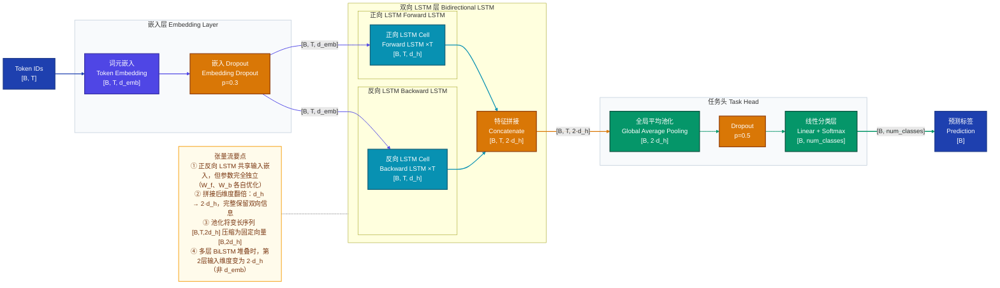
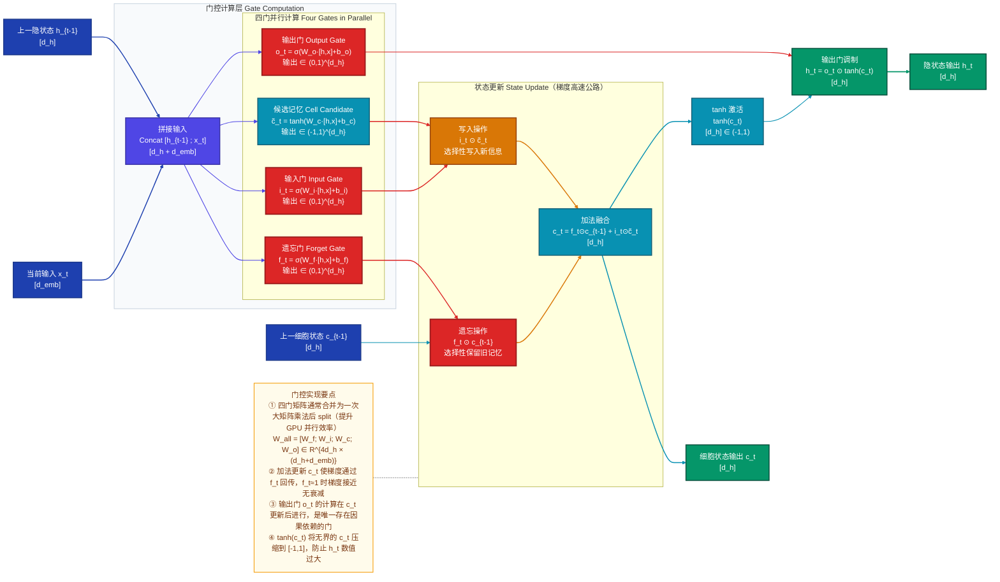

# LSTM & BiLSTM 深度学习模型技术分析文档

> 本文档系统分析长短期记忆网络（LSTM）及其双向变体（BiLSTM）的架构设计、计算原理、训练策略与工程部署，遵循「直觉 → 原理 → 公式」递进结构。

---

## 一、模型定位

**LSTM（Long Short-Term Memory，长短期记忆网络）** 是解决序列建模中"长程依赖遗忘"问题的循环神经网络变体，属于**序列建模 / 时序分析**方向；核心创新在于引入**门控机制**（遗忘门、输入门、输出门）与显式的**细胞状态（Cell State）**，使网络能够选择性地保留或遗忘历史信息，从根本上缓解了传统 RNN 的梯度消失问题。

**BiLSTM（Bidirectional LSTM，双向长短期记忆网络）** 在 LSTM 基础上引入双向处理，同时从序列的正向与反向两个方向捕获上下文信息，使每个时间步的表示既包含过去上下文也包含未来上下文，特别适用于对完整序列有全局感知需求的判别式任务（如命名实体识别、情感分类）。

---

## 二、整体架构

### 2.1 LSTM 架构（ASCII 树形结构）

```
LSTM 模型
├── 输入层 Input Layer                              # 将原始序列转化为稠密嵌入向量
│   ├── 词元嵌入 Token Embedding                   # 将离散 token id 映射到 d_emb 维语义空间
│   └── 嵌入层 Dropout（可选）                      # 对嵌入向量随机置零，防止词向量过拟合
│
├── LSTM 核心层 LSTM Core（可堆叠 N 层）            # 序列主干，逐步提炼时序特征
│   ├── 遗忘门 Forget Gate                         # 决定从细胞状态中丢弃多少旧信息（乘法清除）
│   ├── 输入门 Input Gate                          # 决定将哪些新信息写入细胞状态（选择性写入）
│   ├── 候选记忆 Cell Candidate                    # 生成待写入的候选内容（tanh 激活）
│   ├── 细胞状态更新 Cell State Update             # 加法融合：保留旧记忆 + 写入新信息
│   └── 输出门 Output Gate                        # 决定从细胞状态中读取多少信息给隐状态
│
├── 正则化层 Regularization（可选）                 # 防止过拟合
│   ├── Dropout（标准 / 变分）                      # 以概率 p 随机置零，变分版本对全序列同 mask
│   └── 层归一化 Layer Normalization               # 对隐状态 d_h 维度归一化，稳定梯度
│
└── 任务头 Task Head                               # 将隐状态映射为目标输出
    ├── 序列标注：逐步全连接 Linear（+ CRF）        # 每时间步独立预测标签；CRF 建模标签转移
    ├── 分类：池化 + 全连接 Linear                 # 取最后一步或均值池化后输出类别分数
    └── 生成：作为 Encoder-Decoder 的编码输出      # 最后隐状态传入解码器
```

### 2.2 BiLSTM 架构（ASCII 树形结构）

```
BiLSTM 模型
├── 输入层 Input Layer                              # 与 LSTM 相同，双向共享嵌入层参数
│   └── 词元嵌入 Token Embedding                   # [B, T] → [B, T, d_emb]
│
├── 双向 LSTM 层 Bidirectional LSTM（可堆叠）       # 同时捕获正向和反向时序依赖
│   ├── 正向 LSTM Forward LSTM                    # 从 t=1 → t=T 顺序处理序列
│   │   └── LSTM Cell ×T                         # 每步更新 h_f_t, c_f_t（参数独立于反向）
│   └── 反向 LSTM Backward LSTM                  # 从 t=T → t=1 逆序处理序列
│       └── LSTM Cell ×T                         # 每步更新 h_b_t, c_b_t（参数独立于正向）
│
├── 特征融合层 Feature Fusion                       # 合并正反向隐状态
│   └── 拼接 Concatenate                          # [h_f ; h_b] → [B, T, 2×d_h]（维度加倍）
│
├── 正则化层 Regularization（可选）                  # Dropout / Layer Normalization
│
└── 任务头 Task Head                               # 接收 [B, T, 2×d_h] 或 [B, 2×d_h]
    ├── 序列标注：逐步 Linear + CRF                # CRF 捕获全局标签一致性约束
    └── 分类：全局池化 + Linear                   # 取均值或末态双向拼接后分类
```

**模块间连接方式说明：**
- **串行**：输入层 → LSTM核心层 → 融合层 → 任务头，数据依次单向流动
- **并行**：BiLSTM 中正向与反向 LSTM 并行处理同一序列，两条路径互不依赖，可并发计算
- **跨层特征复用**：多层 BiLSTM 堆叠时，上一层输出 `[B, T, 2d_h]` 作为下一层输入；可选跳接（Skip Connection）复用中间层表示以缓解深层梯度消失

---

## 三、数据直觉

以**情感分析**任务为例，输入一条电影评论，判断其情感极性（正面/负面）。

### 3.1 原始输入

```
"这部电影的特效令人叹为观止，演员表演也非常精彩，强烈推荐！"
```

一条中文字符序列，共 29 个字符（含标点），没有任何数学结构，模型无法直接理解。

### 3.2 预处理后

**字级分词（Tokenization）**：

```
["这", "部", "电", "影", "的", "特", "效", "令", "人", "叹", "为", "观",
 "止", "，", "演", "员", "表", "演", "也", "非", "常", "精", "彩", "，",
 "强", "烈", "推", "荐", "！"]
```

**映射为 Token ID**（对应词汇表索引）：

```
[312, 89, 46, 108, 5, 721, 334, 203, 8, 1024, 67, 411, 502, 4,
 183, 291, 377, 183, 16, 54, 43, 689, 201, 4, 478, 312, 203, 412, 3]
```

**形成输入张量**：`[1, 29]`（批次大小=1，序列长度=29）

### 3.3 关键中间表示

**Stage 1：嵌入层输出 `[1, 29, 128]`**

> 每个 token id 被映射为 128 维稠密向量。"叹为观止"这 4 个字的向量在嵌入空间中彼此相近（语义相似），而"，"（标点）的向量游离在低语义密度区域。
>
> **这一步在表达**：词的语义相似性被编码进向量距离中，从符号离散空间进入连续语义空间。

**Stage 2：LSTM 隐状态序列 `[1, 29, 256]`**

> 处理到"叹（第10步）"时，隐状态 $h_{10}$ 已经累积了"特效令人"的积极语义：遗忘门接近关闭（$f_{10} \approx 0.9$，保留前面的积极情感），输入门全开（$i_{10} \approx 0.95$，将"叹为观止"的强正面信号写入）。
>
> **这一步在表达**：时序上下文被逐步累积在隐状态中，"记忆"在流动——到达序列末尾时，隐状态浓缩了整句话的情感轨迹。

**Stage 3：BiLSTM 融合后 `[1, 29, 512]`**

> "演（第15步）"字位置的表示同时包含：正向 LSTM 看到的"特效令人叹为观止"（积极历史），以及反向 LSTM 已经看完整句后带回的"非常精彩，强烈推荐"（积极未来）。
>
> **这一步在表达**：每个词都能感知整句话的全局上下文，消歧能力显著增强（同一个"苹果"在不同句尾可得到不同的表示）。

**Stage 4：均值池化后 `[1, 512]`**

> 对所有 29 个时间步的隐状态取均值，将变长序列压缩为固定维度的句子级向量。
>
> **这一步在表达**：整句话的综合语义被浓缩为单一向量，用于后续分类决策。

### 3.4 模型输出与后处理

| 阶段 | 内容 |
|------|------|
| 原始输出（Logits） | `[1, 2]` → `[3.82, -1.21]` |
| Softmax 后 | `[0.98, 0.02]`（正面 98%，负面 2%） |
| 最终预测 | **正面（Positive）**，置信度 98% |

---

## 四、核心数据流

下图展示 BiLSTM 前向传播的完整张量流，追踪从原始 Token ID 到分类输出的完整维度变化路径。重点关注正反向 LSTM 的**并行分支**与最终**拼接融合**节点处的维度变化。



**图后要点：**
- **维度翻倍**是 BiLSTM 的标志性特征，后续任务头输入维度必须配置为 `2·d_h`
- 正反向两条数据路径（`DROP0 → LSTM_F` 和 `DROP0 → LSTM_B`）同时执行，无先后依赖，可并行计算
- 若使用 `pack_padded_sequence`，LSTM 内部会自动跳过 PAD 位置，输出仍可 `pad_packed_sequence` 恢复为 `[B, T, d_h]`

---

## 五、模型整体架构图

下图展示 LSTM 与 BiLSTM 的完整模块层级，重点关注门控单元内部的数据依赖关系，以及双向扩展后正反向模块的并行组织方式。

```mermaid
flowchart LR
    classDef inputStyle    fill:#1e40af,stroke:#1e3a8a,stroke-width:2px,color:#fff
    classDef embedStyle    fill:#4f46e5,stroke:#3730a3,stroke-width:2px,color:#fff
    classDef encoderStyle  fill:#0891b2,stroke:#155e75,stroke-width:2px,color:#fff
    classDef attnStyle     fill:#dc2626,stroke:#991b1b,stroke-width:2.5px,color:#fff
    classDef ffnStyle      fill:#d97706,stroke:#92400e,stroke-width:2px,color:#fff
    classDef headStyle     fill:#059669,stroke:#064e3b,stroke-width:2px,color:#fff
    classDef noteStyle     fill:#fffbeb,stroke:#f59e0b,stroke-width:1.5px,color:#78350f
    classDef layerStyle    fill:#f8fafc,stroke:#cbd5e0,stroke-width:1.5px

    SRC["原始序列输入<br>[B, T]"]:::inputStyle

    subgraph INPUT_MODULE["输入模块 Input Module"]
        direction TB
        TOK_EMB["词元嵌入<br>Token Embedding<br>[B, T, d_emb]"]:::embedStyle
        INP_DROP["嵌入层 Dropout<br>Input Dropout"]:::ffnStyle
    end
    class INPUT_MODULE layerStyle

    subgraph LSTM_CORE["LSTM 核心层（功能模块：序列时序特征提取）"]
        direction TB
        subgraph CELL["① LSTM 单元（子模块：门控记忆更新 ×T 步）"]
            direction LR
            FG["遗忘门<br>Forget Gate<br>f_t = σ(W_f·[h,x]+b_f)"]:::attnStyle
            IG["输入门<br>Input Gate<br>i_t = σ(W_i·[h,x]+b_i)"]:::attnStyle
            CG["候选记忆<br>Cell Candidate<br>c̃_t = tanh(W_c·[h,x]+b_c)"]:::encoderStyle
            OG["输出门<br>Output Gate<br>o_t = σ(W_o·[h,x]+b_o)"]:::attnStyle
            CS["细胞状态更新<br>Cell State Update<br>c_t = f⊙c_{t-1} + i⊙c̃"]:::encoderStyle
            HS["隐状态输出<br>Hidden State<br>h_t = o⊙tanh(c_t)"]:::encoderStyle
        end
        REC["序列递推输出<br>Recurrent Output<br>[B, T, d_h]"]:::encoderStyle
    end
    class LSTM_CORE layerStyle

    subgraph BIDIR["双向扩展（功能模块：全局上下文感知）"]
        direction TB
        FWD_LSTM["正向 LSTM<br>Forward LSTM<br>t: 1 → T"]:::encoderStyle
        BWD_LSTM["反向 LSTM<br>Backward LSTM<br>t: T → 1"]:::encoderStyle
        MERGE["双向融合<br>Concat Bidirectional<br>[B, T, 2·d_h]"]:::ffnStyle
    end
    class BIDIR layerStyle

    subgraph TASK_HEAD["任务头（功能模块：特定任务输出）"]
        direction LR
        CLS_HEAD["分类头<br>Classification Head<br>Pool + Linear"]:::headStyle
        SEQ_HEAD["序列标注头<br>Sequence Labeling<br>Linear + CRF"]:::headStyle
    end
    class TASK_HEAD layerStyle

    OUT["预测输出<br>Prediction Output"]:::headStyle

    SRC      --> TOK_EMB
    TOK_EMB  --> INP_DROP
    INP_DROP --> FG
    INP_DROP --> IG
    INP_DROP --> CG
    INP_DROP --> OG
    FG       --> CS
    IG       --> CS
    CG       --> CS
    CS       --> HS
    OG       --> HS
    HS       --> REC
    REC      --> FWD_LSTM
    REC      --> BWD_LSTM
    FWD_LSTM --> MERGE
    BWD_LSTM --> MERGE
    MERGE    --> CLS_HEAD
    MERGE    --> SEQ_HEAD
    CLS_HEAD --> OUT
    SEQ_HEAD --> OUT

    NOTE["架构设计要点<br>① 细胞状态 c_t 是 LSTM 的核心创新：加法更新使梯度可无损跨越多时间步<br>② FG/IG/CG 并行计算，OG 在 CS 更新后才有意义（存在计算依赖）<br>③ BiLSTM 正反向参数完全独立，各自维护独立的 W_f / W_b<br>④ 任务头可灵活替换，主干 LSTM 权重可冻结用于迁移学习"]:::noteStyle
    NOTE -.- LSTM_CORE

    %% 边索引：0-19，共 20 条；NOTE -.- 为边 20
    linkStyle 0     stroke:#1e40af,stroke-width:2px
    linkStyle 1,2   stroke:#4f46e5,stroke-width:2px
    linkStyle 3,4,5,6 stroke:#0891b2,stroke-width:1.5px
    linkStyle 7,8,9,10,11 stroke:#dc2626,stroke-width:2px
    linkStyle 12    stroke:#0891b2,stroke-width:2px
    linkStyle 13,14 stroke:#0891b2,stroke-width:1.5px
    linkStyle 15,16 stroke:#d97706,stroke-width:2px
    linkStyle 17,18 stroke:#059669,stroke-width:1.5px
    linkStyle 19    stroke:#059669,stroke-width:2.5px
```



**图后要点：**
- 遗忘门（FG）、输入门（IG）、候选记忆（CG）三者从同一输入 `[h_{t-1}; x_t]` 并行计算，可通过一次大矩阵乘法后 `split` 提升效率
- 输出门（OG）依赖更新后的细胞状态 $c_t$，存在数据依赖，是四门中唯一的"串行"门
- BiLSTM 中的"双向扩展"模块可独立替换为任意单向 LSTM，架构具有模块化可替换性

---

## 六、关键组件深度分析

### 6.1 LSTM 门控机制

**直觉**：LSTM 的门控本质上是一组可学习的"阀门"，每个阀门输出 0～1 之间的值，控制信息的通过量——遗忘门决定"忘记多少旧记忆"，输入门决定"写入多少新信息"，输出门决定"对外展示多少"。与人类记忆类比：你能清晰记住多年前的重要事件（细胞状态保留），却往往忘记今天早餐吃了什么（遗忘门清除了无关信息）。

**内部计算原理**：给定时间步 $t$ 的输入 $x_t \in \mathbb{R}^{d_\text{emb}}$ 和上一时刻隐状态 $h_{t-1} \in \mathbb{R}^{d_h}$，拼接为 $[h_{t-1}; x_t] \in \mathbb{R}^{d_h + d_\text{emb}}$：

**遗忘门（Forget Gate）**：决定从 $c_{t-1}$ 保留多少信息

$$f_t = \sigma(W_f \cdot [h_{t-1}; x_t] + b_f) \in (0,1)^{d_h}$$

**输入门（Input Gate）**：决定写入多少新信息

$$i_t = \sigma(W_i \cdot [h_{t-1}; x_t] + b_i) \in (0,1)^{d_h}$$

**候选细胞状态（Cell Candidate）**：新的候选记忆内容

$$\tilde{c}_t = \tanh(W_c \cdot [h_{t-1}; x_t] + b_c) \in (-1,1)^{d_h}$$

**细胞状态更新**（核心公式，门控加法结构是梯度流动的关键）：

$$c_t = f_t \odot c_{t-1} + i_t \odot \tilde{c}_t$$

**输出门（Output Gate）**：

$$o_t = \sigma(W_o \cdot [h_{t-1}; x_t] + b_o) \in (0,1)^{d_h}$$

**隐状态输出**：

$$h_t = o_t \odot \tanh(c_t)$$

其中 $\sigma$ 是 Sigmoid 函数，$\odot$ 是逐元素乘法（Hadamard 积）。

**为什么这样设计：**
- $c_t$ 的更新是**加法**而非乘法，梯度回传时经过加法节点几乎不衰减（$\frac{\partial c_t}{\partial c_{t-1}} = f_t$，在 $f_t \approx 1$ 时梯度约为 1），这是解决梯度消失的核心
- 三个门都使用 Sigmoid 输出 $(0,1)$，语义清晰（0=完全关闭，1=完全开放），且可微
- $\tilde{c}_t$ 使用 tanh 输出 $(-1,1)$，保持记忆内容有正有负，防止细胞状态单调累加

下图展示 LSTM 单元内部门控的完整计算依赖关系。重点关注**细胞状态的加法更新路径**（`FORGET_MULT → ADD_GATE ← INPUT_MULT`），这条路径是梯度的"高速公路"，是 LSTM 能够记住长程依赖的根本原因。



**图后要点：**
- 四门的权重矩阵在实现时通常合并为一个 `[4d_h, d_h+d_emb]` 的大矩阵，一次矩阵乘法后通过 `torch.chunk(4, dim=-1)` 分拆，利用 GPU 并行效率
- `STATE_UPDATE` 子图中的加法节点是 LSTM 克服梯度消失的核心，梯度在此处以 $f_t$ 为系数流向 $c_{t-1}$，而非经过非线性压缩

### 6.2 双向机制（BiLSTM）

**直觉**：单向 LSTM 像阅读一本书，只能看已读过的内容；BiLSTM 则相当于把书正读一遍再反读一遍，每个词的表示都融合了前文和后文的信息。这对消歧至关重要——"苹果很好吃" vs "苹果股价上涨"中的"苹果"，反向 LSTM 在处理"苹果"时已经看到了后面的"好吃"或"股价"，从而学到完全不同的表示。

**计算原理**：

正向 LSTM 从 $t=1$ 到 $t=T$ 逐步处理：

$$\overrightarrow{h}_t, \overrightarrow{c}_t = \text{LSTM}_f(x_t, \overrightarrow{h}_{t-1}, \overrightarrow{c}_{t-1})$$

反向 LSTM 从 $t=T$ 到 $t=1$ 逐步处理：

$$\overleftarrow{h}_t, \overleftarrow{c}_t = \text{LSTM}_b(x_t, \overleftarrow{h}_{t+1}, \overleftarrow{c}_{t+1})$$

最终在每个时间步拼接两个方向的隐状态：

$$h_t^{\text{bi}} = [\overrightarrow{h}_t \;;\; \overleftarrow{h}_t] \in \mathbb{R}^{2 d_h}$$

**为什么选择拼接而非求和：**
- **拼接**保留了正反向的完整信息，允许后续层分别利用两个方向的特征；**求和**会造成信息混叠，正反向特征相互干扰
- 参数独立（$W_f \neq W_b$）允许正反向 LSTM 学习不同的时序模式：正向侧重"因为…所以"的因果链，反向侧重"…的结果是"的溯因链

### 6.3 梯度流动机制（为什么能解决梯度消失）

**直觉**：传统 RNN 的梯度要连续乘过 $T$ 个 Jacobian 矩阵，若每个矩阵谱范数小于1则指数衰减（消失），若都大于1则指数增长（爆炸）。LSTM 通过**加法公路**让梯度可以不经乘法直接跨越多个时间步，就像高速公路绕开了拥堵路口。

**反向传播分析**：

对细胞状态 $c$ 的梯度回传：

$$\frac{\partial c_t}{\partial c_{t-1}} = f_t$$

若遗忘门保持开启（$f_t \approx 1$），则跨越 $k$ 个时间步后梯度近似不衰减：

$$\frac{\partial \mathcal{L}}{\partial c_{t-k}} = \frac{\partial \mathcal{L}}{\partial c_t} \cdot \prod_{j=t-k+1}^{t} f_j \approx \frac{\partial \mathcal{L}}{\partial c_t}$$

对比 Vanilla RNN 的隐状态梯度回传：

$$\frac{\partial h_t}{\partial h_{t-k}} = \prod_{j=t-k+1}^{t} \text{diag}(\sigma'(\cdot)) \cdot W_{hh}$$

当 $W_{hh}$ 的谱范数 $< 1$ 时，$k$ 步后梯度 $\to 0$（消失）；谱范数 $> 1$ 时梯度 $\to \infty$（爆炸）。LSTM 通过门控将"乘法"转为"加法"，从根本上规避了这个问题。

---

## 七、训练策略

### 7.1 损失函数设计

| 任务类型 | 损失函数 | 说明 |
|---------|---------|------|
| 序列分类 | 交叉熵 $\mathcal{L}_\text{CE}$ | 对最终隐状态或池化表示计算 |
| 序列标注 | 每步交叉熵 / CRF 负对数似然 | CRF 建模全局标签一致性 |
| 语言模型 | Token-level 负对数似然 | 对每个位置的预测词计算 |
| 回归任务 | MSE / Huber Loss | 输出层不加激活函数 |

**CRF 联合训练损失**（序列标注最优选择）：

$$\mathcal{L}_\text{CRF} = -\log \frac{\exp(s(\mathbf{x}, \mathbf{y}))}{\sum_{\tilde{\mathbf{y}}} \exp(s(\mathbf{x}, \tilde{\mathbf{y}}))}$$

其中 $s(\mathbf{x}, \mathbf{y}) = \sum_t (E_{y_t} + T_{y_{t-1}, y_t})$，$E$ 是发射分数（来自 BiLSTM 输出），$T \in \mathbb{R}^{K \times K}$ 是可学习的标签转移矩阵。

### 7.2 优化器与学习率调度

**推荐优化器：**
- **Adam**（$\beta_1=0.9, \beta_2=0.999, \epsilon=10^{-8}$）：默认选择，自适应学习率，收敛稳定
- **AdamW**：带权重衰减的 Adam，适合有 L2 正则化需求的大模型场景

**学习率调度：**

| 策略 | 公式 | 适用场景 |
|-----|------|---------|
| 固定学习率 | $\eta = \eta_0$ | 小数据集快速实验 |
| 余弦退火 | $\eta_t = \eta_{\min} + \frac{1}{2}(\eta_{\max} - \eta_{\min})\left(1 + \cos\dfrac{t\pi}{T}\right)$ | 长周期训练 |
| ReduceLROnPlateau | 验证集停滞时乘以衰减因子 | 监控指标自动调整 |
| 线性预热 + 线性衰减 | $\eta_t = \eta_0 \cdot \min(t/t_{\text{warm}},\ 1) \cdot \text{decay}$ | 与预训练词向量联用 |

### 7.3 关键训练技巧

1. **梯度裁剪（Gradient Clipping）**：LSTM 训练的**必要操作**，防止梯度爆炸
   ```python
   torch.nn.utils.clip_grad_norm_(model.parameters(), max_norm=5.0)
   ```

2. **变分 Dropout（Variational Dropout）**：对同一序列的所有时间步使用相同的 dropout mask，避免标准 Dropout 破坏序列一致性，效果优于标准 Dropout 约 0.3~0.8%

3. **遗忘门偏置初始化为 1**：使初始 $f_t \approx 0.73$，鼓励初期保留记忆，有助于梯度稳定
   ```python
   for name, param in model.lstm.named_parameters():
       if 'bias' in name:
           n = param.size(0)
           param.data[n//4:n//2].fill_(1.0)  # 遗忘门 bias 区间
   ```

4. **早停（Early Stopping）**：监控验证集 F1/Accuracy，连续 N Epoch 不提升则停止

5. **预训练词向量初始化**：使用 Word2Vec / GloVe / FastText 初始化嵌入层，可选是否冻结。冻结适合数据量小的场景，解冻适合数据量大或领域特化场景

下图展示 BiLSTM 完整训练循环。重点关注**梯度裁剪节点**（位于 `loss.backward()` 后、`optimizer.step()` 前）以及**验证分支的触发时机**（每 N Epoch 触发一次，与训练主循环并列）。

```mermaid
flowchart LR
    classDef dataStyle     fill:#1e40af,stroke:#1e3a8a,stroke-width:2px,color:#fff
    classDef forwardStyle  fill:#0891b2,stroke:#155e75,stroke-width:2px,color:#fff
    classDef lossStyle     fill:#dc2626,stroke:#991b1b,stroke-width:2.5px,color:#fff
    classDef backwardStyle fill:#d97706,stroke:#92400e,stroke-width:2px,color:#fff
    classDef optStyle      fill:#7c3aed,stroke:#4c1d95,stroke-width:2px,color:#fff
    classDef evalStyle     fill:#059669,stroke:#064e3b,stroke-width:2px,color:#fff
    classDef ctrlStyle     fill:#374151,stroke:#111827,stroke-width:2px,color:#fff
    classDef noteStyle     fill:#fffbeb,stroke:#f59e0b,stroke-width:1.5px,color:#78350f
    classDef layerStyle    fill:#f8fafc,stroke:#cbd5e0,stroke-width:1.5px

    DATASET[("文本数据集<br>Text Dataset")]:::dataStyle

    subgraph LOADER["数据加载 Data Loading"]
        direction LR
        DL["DataLoader<br>批次化 + pad_sequence"]:::dataStyle
        AUG["在线增强<br>EDA / Token Dropout"]:::dataStyle
    end
    class LOADER layerStyle

    subgraph FORWARD["前向传播 Forward Pass"]
        direction LR
        EMBED_FW["嵌入层<br>Embedding<br>[B,T,d_emb]"]:::forwardStyle
        BILSTM_FW["BiLSTM 层<br>Bidirectional LSTM<br>[B,T,2d_h]"]:::forwardStyle
        HEAD_FW["任务头预测<br>Task Head<br>[B,num_class]"]:::forwardStyle
    end
    class FORWARD layerStyle

    LOSS["损失计算<br>CrossEntropy / CRF NLL<br>标量"]:::lossStyle

    subgraph BACKWARD["反向传播 Backward Pass"]
        direction LR
        BW["loss.backward()<br>BPTT 计算梯度"]:::backwardStyle
        CLIP["梯度裁剪<br>clip_grad_norm_<br>max_norm=5.0"]:::backwardStyle
    end
    class BACKWARD layerStyle

    subgraph OPTIM["参数更新 Optimization"]
        direction LR
        OPT["optimizer.step()<br>Adam / AdamW"]:::optStyle
        LRS["scheduler.step()<br>ReduceLROnPlateau"]:::optStyle
        ZERO["optimizer.zero_grad()"]:::optStyle
    end
    class OPTIM layerStyle

    subgraph EVAL["验证评估 Validation（每 N Epoch）"]
        direction LR
        VAL["验证集推理<br>model.eval() + no_grad"]:::evalStyle
        METRIC["指标计算<br>Accuracy / F1 / BLEU"]:::evalStyle
        CKPT["模型保存<br>Best Checkpoint"]:::evalStyle
    end
    class EVAL layerStyle

    DONE["训练完成<br>Final Model"]:::ctrlStyle

    DATASET  --> DL
    DL       --> AUG
    AUG      -->|"Batch [B, T]"| EMBED_FW
    EMBED_FW --> BILSTM_FW
    BILSTM_FW --> HEAD_FW
    HEAD_FW  --> LOSS
    LOSS     --> BW
    BW       --> CLIP
    CLIP     --> OPT
    OPT      --> LRS
    LRS      --> ZERO
    ZERO     -.->|"下一 Batch"| DL
    OPT      -->|"每 N Epoch 触发"| VAL
    VAL      --> METRIC
    METRIC   --> CKPT
    CKPT     -.->|"早停判断"| DONE

    NOTE["训练要点<br>① BPTT（Backpropagation Through Time）：梯度沿 T 步时间轴逆向传播<br>② max_norm=5.0：LSTM 常用比 Transformer 更大的裁剪阈值（RNN 更易爆炸）<br>③ 遗忘门 bias 初始化为 1：减少初期梯度不稳定<br>④ 变分 Dropout：训练时对全序列使用同一 mask，评估时关闭<br>⑤ CRF 的 Viterbi 解码只在推理时运行，训练时只需前向分数和 partition function"]:::noteStyle
    NOTE -.- BACKWARD

    %% 边索引：0-15，共 16 条；NOTE -.- 为边 16
    linkStyle 0,1,2   stroke:#1e40af,stroke-width:2px
    linkStyle 3,4,5   stroke:#0891b2,stroke-width:2px
    linkStyle 6,7,8   stroke:#dc2626,stroke-width:2px
    linkStyle 9,10    stroke:#7c3aed,stroke-width:2px
    linkStyle 11      stroke:#7c3aed,stroke-width:1.5px,stroke-dasharray:4 3
    linkStyle 12,13,14 stroke:#059669,stroke-width:2px
    linkStyle 15      stroke:#059669,stroke-width:1.5px,stroke-dasharray:4 3
```



---

## 八、数据处理流水线

下图展示 NLP 序列任务的完整数据处理流水线。重点关注**变长序列的填充（Padding）策略**和 **Pack/Unpack 操作**——这是 LSTM 高效处理批次数据的工程关键，对计算效率影响显著。

```mermaid
flowchart LR
    classDef rawStyle      fill:#374151,stroke:#111827,stroke-width:2px,color:#fff
    classDef prepStyle     fill:#4f46e5,stroke:#3730a3,stroke-width:2px,color:#fff
    classDef augStyle      fill:#d97706,stroke:#92400e,stroke-width:2px,color:#fff
    classDef batchStyle    fill:#0891b2,stroke:#155e75,stroke-width:2px,color:#fff
    classDef outputStyle   fill:#059669,stroke:#064e3b,stroke-width:2px,color:#fff
    classDef storeStyle    fill:#ea580c,stroke:#7c2d12,stroke-width:2px,color:#fff
    classDef noteStyle     fill:#fffbeb,stroke:#f59e0b,stroke-width:1.5px,color:#78350f
    classDef layerStyle    fill:#f8fafc,stroke:#cbd5e0,stroke-width:1.5px

    subgraph RAW["原始数据 Raw Data"]
        direction LR
        TEXT[("文本文件<br>CSV / JSON / TXT")]:::rawStyle
        LABEL[("标注文件<br>Labels / Annotations")]:::rawStyle
        SPLIT_DATA[("数据划分<br>train / val / test")]:::rawStyle
    end
    class RAW layerStyle

    subgraph PREPROCESS["离线预处理（一次性执行）"]
        direction LR
        CLEAN["文本清洗<br>去噪 + 标准化<br>去除HTML/特殊符号"]:::prepStyle
        TOKENIZE["分词<br>Tokenization<br>字/词/子词级别"]:::prepStyle
        VOCAB["词汇表构建<br>Vocabulary Building<br>过滤低频词"]:::prepStyle
        ENCODE["Token ID 映射<br>Token Encoding<br>UNK 处理"]:::prepStyle
        CACHE_DATA[("索引化存储<br>Processed Cache")]:::storeStyle
    end
    class PREPROCESS layerStyle

    subgraph AUGMENT["在线文本增强（训练时）"]
        direction LR
        SWAP["随机词序交换<br>Random Swap<br>EDA"]:::augStyle
        DELETE["随机词删除<br>Random Deletion<br>p=0.1"]:::augStyle
        SYNONYM["同义词替换<br>Synonym Replace<br>WordNet"]:::augStyle
    end
    class AUGMENT layerStyle

    subgraph BATCH["批次化 Batching"]
        direction LR
        SORT["按长度排序<br>Sort by Length<br>减少无效填充"]:::batchStyle
        PAD["序列填充<br>pad_sequence<br>右填充 PAD=0"]:::batchStyle
        PACK["打包变长序列<br>pack_padded_sequence<br>跳过 PAD 位置"]:::batchStyle
        MASK["生成注意力掩码<br>Attention Mask<br>[B, T]"]:::batchStyle
    end
    class BATCH layerStyle

    MODEL_INPUT["LSTM 输入<br>PackedSequence + Mask<br>[B, T_max]"]:::outputStyle

    TEXT       --> CLEAN
    LABEL      --> SPLIT_DATA
    SPLIT_DATA --> CLEAN
    CLEAN      --> TOKENIZE
    TOKENIZE   --> VOCAB
    VOCAB      --> ENCODE
    ENCODE     --> CACHE_DATA
    CACHE_DATA --> SWAP
    SWAP       --> DELETE
    DELETE     --> SYNONYM
    SYNONYM    --> SORT
    SORT       --> PAD
    PAD        --> PACK
    PACK       --> MASK
    MASK       -->|"PackedSequence + mask"| MODEL_INPUT

    NOTE["数据管道工程要点<br>① Sort by Length：批内样本按长度降序排列，配合 pack 减少无效 PAD 计算<br>② pack_padded_sequence：让 LSTM 跳过 PAD 位置，可节省约 30~60% 计算量<br>③ 词汇表截断：保留高频词（如 top-50000），低频词映射为 UNK<br>④ 在线增强只在训练时开启：val/test 只做 clean + tokenize + encode<br>⑤ unpack 用 pad_packed_sequence 恢复 [B, T, d_h]，注意需 unsort 还原顺序"]:::noteStyle
    NOTE -.- BATCH

    %% 边索引：0-14，共 15 条；NOTE -.- 为边 15
    linkStyle 0,1,2   stroke:#374151,stroke-width:2px
    linkStyle 3,4,5,6 stroke:#4f46e5,stroke-width:2px
    linkStyle 7,8,9,10 stroke:#d97706,stroke-width:2px
    linkStyle 11,12,13,14 stroke:#0891b2,stroke-width:2px
```



---

## 九、评估指标与性能对比

### 9.1 主要评估指标

| 指标 | 公式 | 适用场景 | 选用原因 |
|------|------|---------|---------|
| **Accuracy** | $\frac{TP+TN}{N}$ | 类别均衡的分类任务 | 直观易解释，类别不均衡时需谨慎 |
| **F1 Score** | $\frac{2 \cdot P \cdot R}{P + R}$ | 序列标注、NER | 平衡精确率和召回率，适合不均衡标签分布 |
| **Macro-F1** | 各类别 F1 算术平均 | 多类别分类 | 对稀有类别同等重视，不受类别频率影响 |
| **BLEU** | N-gram 精确率几何均值 | 机器翻译、文本生成 | 衡量生成序列与参考的 N-gram 重叠程度 |
| **Perplexity（PPL）** | $\exp\!\left(-\frac{1}{T}\sum_t \log p(w_t)\right)$ | 语言模型 | 越低越好，衡量模型对语言的预测困惑度 |

### 9.2 核心 Benchmark 性能

**情感分析（SST-2 数据集）**：

| 模型 | 准确率 | 参数量 |
|------|-------|-------|
| Vanilla RNN | ~82% | ~1M |
| LSTM | ~87% | ~2M |
| **BiLSTM** | **~90%** | ~4M |
| BiLSTM + Self-Attention | ~92% | ~4.5M |
| BERT-base（参考） | ~93% | 110M |

**NER（CoNLL-2003 数据集，Entity-level F1）**：

| 模型 | F1 | 特点 |
|-----|-----|------|
| CRF（统计特征） | 89.7 | 仅人工特征，无神经网络 |
| LSTM-CRF | 90.9 | 神经特征 + 序列标签依赖建模 |
| **BiLSTM-CRF** | **91.2** | 双向上下文 + CRF 约束 |
| BiLSTM-CRF + ELMo | 92.2 | 上下文化词向量增强 |
| BERT + CRF（参考） | 93.0+ | Transformer 预训练 |

### 9.3 消融实验

| 配置 | SST-2 Acc | CoNLL F1 | 单组件贡献 |
|-----|----------|---------|---------|
| 单向 LSTM（基线） | 87.2 | 90.9 | — |
| + 反向 LSTM（→ BiLSTM） | +2.8% | +0.3% | 双向上下文 |
| + CRF 解码头 | — | +0.6% | 标签一致性约束 |
| + 预训练词向量（GloVe） | +1.5% | +0.8% | 语义先验知识 |
| + 变分 Dropout | +0.6% | +0.4% | 序列级正则化 |
| + 遗忘门 bias=1 初始化 | +0.3% | +0.2% | 训练初期稳定 |

### 9.4 效率指标

| 模型 | 参数量 | 训练速度（相对） | 推理延迟（CPU） |
|-----|-------|-------------|--------------|
| LSTM（$d_h=256$） | ~2M | 1× | ~5ms/句 |
| BiLSTM（$d_h=256$） | ~4M | ~1.8× | ~9ms/句 |
| BiLSTM（$d_h=512$） | ~15M | ~3× | ~18ms/句 |
| BiLSTM + CRF（$d_h=256$） | ~4.5M | ~2× | ~12ms/句 |
| BERT-base（参考） | 110M | ~15× | ~25ms/句（GPU） |

---

## 十、推理与部署

### 10.1 训练与推理阶段差异

| 组件 | 训练阶段 | 推理阶段 |
|-----|---------|---------|
| Dropout | 开启（`model.train()`） | 关闭（`model.eval()`） |
| 变分 Dropout mask | 每句重新采样 | 完全关闭 |
| BatchNorm（若有） | 使用当前批次统计量 | 使用训练期 EMA 统计量 |
| `torch.no_grad()` | 不使用 | 必须使用，节省约 50% 显存 |
| 序列填充 | 按批内最大长度填充 | 单句推理无需填充 |
| CRF 解码 | 前向分数 + Partition Function | Viterbi 动态规划最优解码 |

### 10.2 输出后处理流程

**分类任务（Softmax 解码）**：

$$\text{Logits}[B, C] \xrightarrow{\text{Softmax}} \text{概率分布} \xrightarrow{\arg\max} \text{类别标签}[B]$$

**序列标注（CRF Viterbi 解码）**：

CRF 使用 Viterbi 算法（动态规划）找到最高分的全局一致标签序列：

$$\hat{\mathbf{y}} = \arg\max_{\mathbf{y}} \sum_{t=1}^{T} (E_{y_t} + T_{y_{t-1}, y_t})$$

时间复杂度 $O(T \cdot K^2)$，$K$ 为标签数量（如 BIO-NER 约 10~20 类）。

**文本生成（LSTM Language Model）**：

| 解码策略 | 说明 | 适用场景 |
|---------|------|---------|
| 贪心解码 | 每步取概率最高词 | 快速推理，多样性低 |
| Beam Search | 维护宽度 $k$ 的候选序列 | 机器翻译，质量与速度平衡 |
| Top-k 采样 | 从 Top-k 个词中随机采样 | 创意文本生成 |
| Top-p（Nucleus）采样 | 从累计概率 $\leq p$ 的词中采样 | 更动态的多样性控制 |

### 10.3 部署优化手段

**动态量化（Dynamic Quantization）**：

将 LSTM 权重量化为 INT8，激活仍为 FP32，可减少约 4× 模型体积，推理加速 1.5~2×：

```python
model_quantized = torch.quantization.quantize_dynamic(
    model,
    {nn.LSTM, nn.Linear},
    dtype=torch.qint8
)
```

**ONNX 导出**（需显式处理 LSTM 状态）：

```python
# 注意：LSTM 导出需要提供 h0/c0 初始状态
dummy_input = torch.zeros(1, seq_len, d_emb)
h0 = torch.zeros(num_layers * num_directions, 1, d_h)
c0 = torch.zeros(num_layers * num_directions, 1, d_h)

torch.onnx.export(
    model, (dummy_input, (h0, c0)), "bilstm.onnx",
    opset_version=11,
    dynamic_axes={"input": {0: "batch", 1: "seq_len"}}
)
```

**知识蒸馏（BERT → BiLSTM）**：

用大型预训练模型（BERT）作为 Teacher，BiLSTM 作为 Student，通过软标签蒸馏：

$$\mathcal{L}_\text{distill} = \alpha \mathcal{L}_\text{CE}(y, \hat{y}_s) + (1-\alpha) \mathcal{L}_\text{KL}\!\left(\frac{\hat{y}_t}{T}, \frac{\hat{y}_s}{T}\right)$$

可将 BERT 约 90% 的性能压缩进 BiLSTM 的体积和延迟中，是工业界常见的"大模型蒸馏小模型"路径。

**TorchScript 导出**（消除 Python 解释器开销）：

```python
scripted_model = torch.jit.script(model)
scripted_model.save("bilstm_scripted.pt")
```

---

## 十一、FAQ（14 题）

### 基本原理类

---

**Q1. LSTM 是如何解决 RNN 梯度消失问题的？**

传统 RNN 的隐状态更新为 $h_t = \tanh(W h_{t-1} + U x_t)$，梯度反传时需要连续乘以 $W^T \cdot \text{diag}(\tanh'(\cdot))$，其谱范数若小于1则随时间步数 $k$ 呈指数衰减（梯度消失），若大于1则指数增长（梯度爆炸）。

LSTM 的关键突破在于**细胞状态的加法更新路径**：

$$c_t = f_t \odot c_{t-1} + i_t \odot \tilde{c}_t$$

梯度从 $c_t$ 反传到 $c_{t-1}$ 时，导数为 $\frac{\partial c_t}{\partial c_{t-1}} = f_t$，这是一个可学习的门控值（而非固定权重矩阵）。当网络学到"需要记忆"时，$f_t \to 1$，梯度可以几乎无损地跨越多个时间步。这条路径在原始论文（Hochreiter & Schmidhuber, 1997）中被称为**常数误差转盘（CEC, Constant Error Carousel）**——"常数"指梯度通过加法路径时理论上不变，这是 LSTM 能够记住数百步前信息的根本原因。

---

**Q2. 遗忘门、输入门、输出门各自的直觉含义是什么？**

可以用"写内存"来类比：

- **遗忘门**（$f_t$）：决定从"旧硬盘"（$c_{t-1}$）抹掉多少内容。读到"然而"、"但是"等转折词时，遗忘门应大幅激活，清除之前的情感倾向，为新方向腾出空间
- **输入门**（$i_t$）：决定把"当前想法"（$\tilde{c}_t$）写多少进"硬盘"。遇到"令人叹为观止"等关键情感词时，输入门全开，将强烈的情感信号写入长期记忆
- **输出门**（$o_t$）：决定从"硬盘"读多少到"工作记忆"（$h_t$）对外展示。并非所有细胞状态都对当前任务有用——在无关位置，输出门半闭，避免干扰后续预测

这三个门的分工体现了"写、保持、读"三个独立操作，各司其职，共同实现灵活的信息管理。

---

**Q3. 为什么 BiLSTM 在 NER、阅读理解等任务上比单向 LSTM 更优？**

在命名实体识别中，识别"苹果"是公司名还是水果名，需要同时感知前文（"公司"、"股票"）和后文（"的 CEO"、"的股价"）。单向 LSTM 处理"苹果"时只知道前面出现了什么，而 BiLSTM 的反向 LSTM 已经读完整句，能在"苹果"位置携带后文信息。

从信息论角度：位置 $t$ 的最优表示应该利用所有可用的上下文 $[x_1, ..., x_T]$。单向 LSTM 只能利用 $[x_1, ..., x_t]$（约一半信息），BiLSTM 能利用全部信息，表达能力上限更高。

**重要限制**：BiLSTM 必须看完整个序列才能得到任意位置的表示，因此**不能用于自回归生成任务**（语言模型、翻译解码等需要在线逐步生成的场景）。这是 BiLSTM 的根本性约束。

---

**Q4. GRU 与 LSTM 的区别是什么？什么时候选 GRU？**

GRU（Gated Recurrent Unit）将 LSTM 的遗忘门和输入门合并为单一**更新门**，并去掉独立的细胞状态，直接用隐状态携带长期信息：

$$z_t = \sigma(W_z \cdot [h_{t-1}; x_t]), \quad r_t = \sigma(W_r \cdot [h_{t-1}; x_t])$$

$$\tilde{h}_t = \tanh(W \cdot [r_t \odot h_{t-1}; x_t]), \quad h_t = (1 - z_t) \odot h_{t-1} + z_t \odot \tilde{h}_t$$

| 对比项 | LSTM | GRU |
|-------|------|-----|
| 参数量 | $4 \times$ 基础参数 | $3 \times$ 基础参数 |
| 门数量 | 3 个独立门 | 2 个门 |
| 记忆机制 | 独立细胞状态 $c_t$ | 隐状态直接携带 |
| 性能（平均） | 通常略优 | 相当或略差 |
| 训练速度 | 较慢 | 快约 25%（少 1/3 参数） |

**选 GRU 的场景**：数据量较小（<50K 样本）、计算资源受限、需要快速原型迭代时。复杂长序列建模（>200步）或有充足数据时，优先 LSTM。

---

### 设计决策类

---

**Q5. 为什么遗忘门偏置初始化为 1 而不是 0？**

若遗忘门偏置随机初始化（约为 0），则 $f_t = \sigma(0) \approx 0.5$，初期就会丢弃约一半的历史信息。这在训练初期导致梯度信号难以回传到较早时间步，模型难以学习长距离依赖。

将遗忘门偏置初始化为 1，使 $f_t = \sigma(1) \approx 0.73$，初期更倾向于"记住"而非"遗忘"，让梯度能够跨越更长的时间窗口，为学习长程依赖创造更好的初始条件。这是 Jozefowicz et al.（2015）通过大规模超参搜索实验发现的最佳实践，后被社区广泛采纳。

PyTorch 中 `bias_hh_l0` 的布局为 `[W_ii, W_if, W_ig, W_io]`（input, forget, cell, output），遗忘门对应第 `[n//4 : n//2]` 区间：

```python
for name, param in model.lstm.named_parameters():
    if 'bias' in name:
        n = param.size(0)
        param.data[n//4:n//2].fill_(1.0)
```

---

**Q6. 为什么序列标注任务要在 BiLSTM 后接 CRF，而不是直接 Softmax？**

Softmax 在每个位置独立预测标签，完全忽略了标签之间的约束关系。在 BIO 标注体系中存在大量硬性约束：`I-PER` 不可能跟在 `B-LOC` 之后，`I-X` 前必须有 `B-X`——这些约束 Softmax 根本无法建模。

CRF 引入可学习的**转移矩阵** $T \in \mathbb{R}^{K \times K}$，$T_{ij}$ 表示从标签 $i$ 转移到标签 $j$ 的分数。训练时用前向算法（Forward Algorithm）计算 Partition Function 以优化条件对数似然；推理时用 Viterbi 算法找全局最优标签路径。

```
BiLSTM 独立预测（可能违反约束）：  B-PER I-PER I-LOC B-ORG
CRF 全局约束后（合法序列）：       B-PER I-PER B-LOC I-LOC
```

在 CoNLL-2003 上，BiLSTM 直接加 CRF 相比单独 Softmax 通常提升 F1 约 0.5~2%，且输出序列语言上更合法。

---

**Q7. 变分 Dropout 为什么比标准 Dropout 效果更好？**

标准 Dropout 在每个时间步独立采样不同的 dropout mask，对于同一序列的不同位置，被置零的单元不同。这破坏了序列的统计一致性——模型在时间步 $t$ 和 $t+1$ 看到的"结构"不同，正则化信号混乱。

变分 Dropout（Gal & Ghahramani, 2016）对同一序列的所有时间步使用**相同的随机 mask**：

$$h_t = f\!\left(x_t \odot m_x,\; h_{t-1} \odot m_h\right), \quad m_x, m_h \sim \text{Bernoulli}(1-p) \text{ 在一次 forward 中固定}$$

这等价于对 RNN 权重进行贝叶斯近似（dropout as Bayesian approximation in RNN），使模型在整个序列上保持一致的不确定性估计，正则化效果更稳定，通常比标准 Dropout 提升约 0.3~0.8%。

---

**Q8. 多层 LSTM 堆叠时，层数和隐层维度如何选择？**

**层数选择原则：**
- 大多数任务 2~3 层已足够，超过 4 层收益边际递减且训练难度显著增加
- 层数增加必须配套增加 Dropout（层间 Dropout `p=0.3~0.5`）防止过拟合
- 下层学习低级语法特征（词性、边界），上层学习高级语义特征（实体类型、情感方向）——这与深度 CNN 的特征层级类比一致

**隐层维度选择原则：**
- 简单分类任务：128~256（参数量 ~1~4M）
- 中等任务（NER、机器翻译）：256~512（参数量 ~4~16M）
- 复杂长序列任务：512~1024（参数量 ~16~64M）

**调优策略**：先设定单层小维度，若验证集欠拟合则增加维度或层数；若过拟合则增加正则化（Dropout、权重衰减）而非盲目减小容量。

---

### 实现细节类

---

**Q9. PyTorch 中 `pack_padded_sequence` 和 `pad_packed_sequence` 的作用是什么？**

批次化训练时，序列长度不一，需要填充（Pad）到相同长度。若直接输入，LSTM 会在 PAD 位置继续计算，造成：（1）**计算浪费**：无效位置的矩阵乘法占用算力；（2）**语义污染**：PAD 位置的梯度会影响模型参数，使隐状态在真实序列结束后继续被 PAD 修改。

`pack_padded_sequence` 将填充后的张量打包为 `PackedSequence`，LSTM 内部跳过 PAD 位置。

```python
# 按长度降序排列（PyTorch LSTM 要求）
sorted_lengths, sort_idx = lengths.sort(descending=True)
x = x[sort_idx]

# 打包 → LSTM → 解包
packed = nn.utils.rnn.pack_padded_sequence(x, sorted_lengths, batch_first=True)
output_packed, (hn, cn) = self.lstm(packed)
output, _ = nn.utils.rnn.pad_packed_sequence(output_packed, batch_first=True)

# 还原原始顺序
_, unsort_idx = sort_idx.sort()
output = output[unsort_idx]
```

对长度差异大的批次（最长 512，最短 10），pack 可节省约 30~60% 计算量，同时确保 `hn` 是每个序列真实末尾的隐状态（而非 PAD 位置的状态）。

---

**Q10. LSTM 中的 `h_0` 和 `c_0` 如何初始化？训练时如何处理？**

**常见初始化策略：**

1. **零初始化**（最常用）：`h_0 = c_0 = zeros(num_layers × num_directions, B, d_h)`，简单有效，适合绝大多数分类/标注任务
2. **可学习初始化**：将 `h_0, c_0` 设为可学习参数 `nn.Parameter`，对批次中所有样本使用同一初始状态，适用于序列有固定起始语义的场景
3. **任务相关初始化**：Encoder-Decoder 中，Decoder 的 `h_0` 从 Encoder 最后隐状态经线性变换得到，传递源端语义

**有状态（Stateful）vs 无状态（Stateless）训练：**
- **无状态**（默认，适合分类/NER）：每个新样本重置 `h_0 = c_0 = 0`
- **有状态**（适合语言模型）：将上一个 batch 的终态 `(hn, cn)` 执行 `detach()` 后传入下一个 batch，防止梯度跨 batch 传播（否则会因内存保留整个训练历史导致 OOM）

---

**Q11. BiLSTM 能否用于流式（Streaming）推理？**

**不能**，这是 BiLSTM 的根本约束。反向 LSTM 需要从序列末尾向前处理，必须**先看完整个序列**才能得到任意位置的反向隐状态。这与流式场景（实时语音识别、在线翻译）要求"边输入边输出"相冲突。

**工程替代方案：**

| 方案 | 原理 | 延迟 | 精度损失 |
|-----|------|------|---------|
| 单向 LSTM | 只用正向，天然流式 | 极低 | 中等（丢失后文上下文） |
| 分块 BiLSTM | 对固定长度窗口做 BiLSTM | 可控 | 较小（窗口足够大时） |
| 流式 Conformer | 受限注意力 + 卷积 | 低 | 最小 |
| Lookahead LSTM | 允许向前看固定步数 | 中等 | 较小 |

工业界语音识别主流方案是流式 Conformer 或 Lookahead + 单向 LSTM。

---

**Q12. 如何调试 LSTM 出现的梯度爆炸问题？**

**诊断方法：**

```python
# 在 backward 后、optimizer.step 前打印梯度范数
total_norm = 0
for p in model.parameters():
    if p.grad is not None:
        total_norm += p.grad.data.norm(2).item() ** 2
total_norm = total_norm ** 0.5
print(f"Grad norm: {total_norm:.4f}")
```

若 `total_norm > 100`（经验阈值），则梯度爆炸。

**解决方案（按优先级）：**

1. **梯度裁剪**（最直接有效）：`torch.nn.utils.clip_grad_norm_(model.parameters(), max_norm=5.0)`
2. **降低学习率**：从 `1e-3` 降到 `5e-4` 或 `1e-4`
3. **遗忘门 bias 初始化为 1**：减少初期梯度不稳定风险
4. **减小序列长度或使用截断 BPTT**：超长序列（>500步）是梯度爆炸的常见来源
5. **添加 Layer Normalization**：对 LSTM 隐状态后加 LN，稳定梯度量级

---

**Q13. LSTM 与 Transformer 相比，在哪些场景下仍有优势？**

| 对比维度 | LSTM / BiLSTM | Transformer |
|---------|--------------|-------------|
| 超长序列（>2048 token） | 表现稳定（线性复杂度） | 注意力 $O(L^2)$，需特殊处理 |
| 小数据集（<10K 样本） | 归纳偏置更强，不易过拟合 | 通常需要预训练或大数据 |
| CPU 推理延迟 | 极低（~5~20ms/句） | 较高（需 GPU 加速） |
| 流式在线处理 | 单向 LSTM 天然支持 | 需要特殊 Streaming 设计 |
| 参数效率 | 参数量少（~2~15M） | 参数量通常更大（≥100M） |
| 时间序列归纳偏置 | 局部递推，天然适合时序 | 需额外位置编码 |
| 强化学习记忆模块 | 隐状态可自然充当工作记忆 | 需要特殊设计 |

**LSTM 当前仍活跃的领域：**
- **嵌入式 / 边缘设备**：内存 < 100MB，CPU 推理，LSTM 几乎是唯一选择
- **金融时间序列**：高频数据，滑动窗口递推，LSTM 比 Transformer 更自然
- **强化学习**：AlphaStar、MuZero 等使用 LSTM 作为策略网络的循环记忆模块
- **在线学习**：状态增量更新，天然适合持续接收新数据的在线场景

---

**Q14. 如何将 BiLSTM 与注意力机制结合提升性能？**

**方案一：Self-Attention over BiLSTM Outputs（最常用）**

BiLSTM 输出序列 $H \in \mathbb{R}^{T \times 2d_h}$ 后，用注意力机制对时间步加权聚合：

$$e_t = \tanh(W_a h_t + b_a) \in \mathbb{R}^{d_a}$$

$$\alpha_t = \text{softmax}(u_a^\top e_t) \in \mathbb{R}^T, \quad v = \sum_{t=1}^T \alpha_t h_t \in \mathbb{R}^{2d_h}$$

其中 $u_a$ 是可学习的上下文向量，注意力权重 $\alpha_t$ 衡量每个位置对最终分类的重要性。

**优势：**
- 相比平均/最大池化，注意力可聚焦于关键词（情感词、实体词），分类任务通常提升 1~3%
- 注意力权重 $\alpha_t$ 可直接可视化，提供模型可解释性（哪些词影响了预测）

**方案二：BiLSTM + Transformer Block**

在 BiLSTM 输出上叠加 Transformer 的多头自注意力层，兼顾 LSTM 的局部递推归纳偏置和注意力的全局依赖捕获能力。这是 ELMo 到 BERT 时代的重要过渡架构，在低资源场景下仍具竞争力。

---

*文档完。基于 LSTM（Hochreiter & Schmidhuber, 1997）、BiLSTM（Schuster & Paliwal, 1997）及后续大量工程实践整理。*
