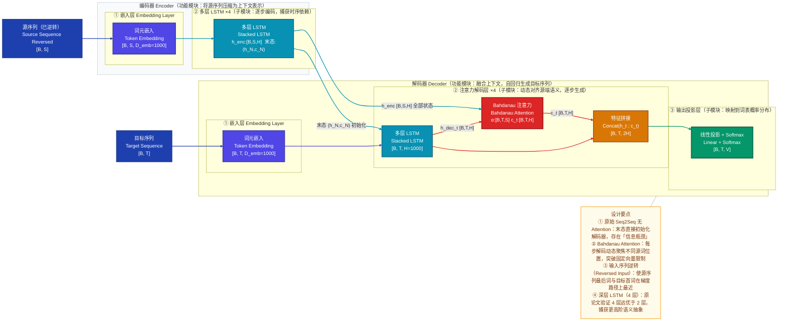
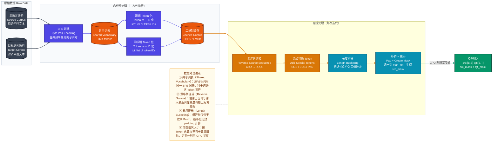
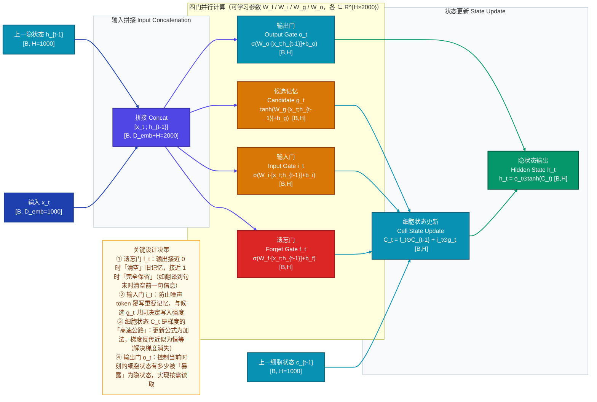
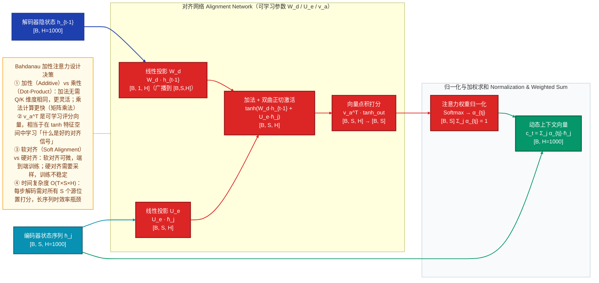

# Seq2Seq 深度学习模型技术分析文档

> **论文出处**：*Sequence to Sequence Learning with Neural Networks*（Sutskever, Vinyals, Le，NeurIPS 2014）
> **关键扩展**：*Neural Machine Translation by Jointly Learning to Align and Translate*（Bahdanau, Cho, Bengio，ICLR 2015）

---

## 一、模型定位

Seq2Seq（序列到序列，Sequence-to-Sequence）由 Sutskever、Vinyals、Le 于 NeurIPS 2014 提出，核心解决**可变长度输入序列到可变长度输出序列的端到端映射**问题，属于**条件序列生成（Conditional Sequence Generation）** 研究方向。

**核心创新**：提出 LSTM Encoder-Decoder 双塔架构，用编码器将任意长度的源序列压缩为固定维向量，再由解码器从该向量自回归地生成目标序列——首次在无对齐监督的情况下端到端学习英法翻译，以 BLEU 34.81 超越 Moses SMT 基线（33.30）。该架构是现代 NLP 生成任务（文摘、对话、代码生成、ASR）的基础范式；Bahdanau Attention（2015）在其上引入动态对齐机制，进一步突破固定上下文向量的信息瓶颈；Transformer（2017）则以自注意力彻底取代 LSTM，但 Encoder-Decoder 骨架延续至今。

---

## 二、整体架构

### 2.1 功能模块 → 子模块 → 关键算子（三层拆解）

```
Seq2Seq 模型（含 Bahdanau Attention 扩展）
│
├── 数据预处理层  Data Preprocessing
│   ├── 词表构建  Vocabulary Building         源/目标语言 token → 整数 ID（BPE 共享词表 ~32K）
│   ├── 文本分词  Tokenization                BPE 子词切分，句首加 <SOS>，句末加 <EOS>
│   └── 序列补齐  Padding & Masking           Batch 内统一到最长序列，生成 padding mask
│
├── 编码器  Encoder（功能模块：将源序列逐步压缩为高维语义表示）
│   ├── ① 嵌入层  Embedding Layer             token ID → 连续稠密向量，D_emb = 1000
│   └── ② 多层 LSTM 堆叠 ×4（串行，捕获时序依赖）
│       ├── LSTM Cell（×S 时刻展开）          遗忘门 / 输入门 / 输出门控制信息流
│       ├── 隐状态序列  h_1..h_S [B, S, H]    每时刻上下文表示；Attention 模式全部传给解码器
│       └── 末时刻状态  (h_N, c_N) [N_L, B, H] 信息瓶颈：无 Attention 时直接初始化解码器
│
├── 上下文桥接  Context Bridge（编解码器接口）
│   ├── 固定向量模式（原始 Seq2Seq）            编码器末态 (h_N, c_N) → 解码器初始状态
│   └── 动态注意力模式（Bahdanau 扩展）         每步解码动态计算 c_t = Σ α_tj · h̄_j
│
├── 解码器  Decoder（功能模块：融合上下文，自回归生成目标序列）
│   ├── ① 嵌入层  Embedding Layer             目标 token ID → 稠密向量 [B, T, D_emb]
│   ├── ② 注意力层  Attention Layer（可选）
│   │   ├── 对齐网络  Alignment Network        e_tj = v^T tanh(W·h_{t-1} + U·h̄_j)
│   │   ├── 归一化权重  α_tj                   Softmax over source positions [B, T, S]
│   │   └── 动态上下文向量  c_t                c_t = Σ_j α_tj · h̄_j  [B, T, H]
│   ├── ③ LSTM 解码层 ×4（输入为 [y_{t-1}; c_t] 拼接）
│   │   ├── LSTM Cell                          与编码器结构相同，维护解码器自身隐状态
│   │   └── 特征拼接  Concat(h_t, c_t)         [B, 2H]，融合生成历史与源端语义
│   └── ④ 输出投影层  Output Projection
│       ├── 线性变换  Linear [2H → V]           将拼接特征映射到词表大小空间
│       └── Softmax                            输出当前时刻各 token 的概率分布 [B, V]
│
└── 推理解码策略（仅推理阶段）
    ├── 贪心解码  Greedy Decoding              每步 argmax，O(T)，快但非全局最优
    └── 束搜索  Beam Search（k=5~10）          维护 k 条候选路径，取归一化对数概率最高序列
```

**模块间连接方式**：
- **串行主链**：Embedding → LSTM Encoder → Context Bridge → LSTM Decoder → Linear → Softmax，数据单向流动。
- **跨模块复用**：Attention 模式下，编码器输出 `h_enc [B, S, H]` 被解码器每一步重复查询，形成**跨模块特征复用**而非一次性传递。
- **残差初始化**：编码器末态 `(h_N, c_N)` 直接初始化解码器 LSTM，形成**状态继承**连接。

---

### 2.2 模型整体架构图

下图展示 Seq2Seq + Bahdanau Attention 的完整模块层次，重点关注**编码器末态如何初始化解码器**、**Attention 如何以跨模块特征复用打破信息瓶颈**，以及特征从嵌入层流向最终 Softmax 的完整路径。



**架构设计决策解析**：

- **双路连接设计**：编码器通过两条路径连接解码器——**末态路径**（状态初始化，传递全局语义压缩）和**全状态路径**（Attention 动态查询，传递细粒度位置信息），两者互补，前者确保解码器「理解」源序列整体，后者确保每步生成时可「精确回望」源端任意位置。
- **为何 4 层而非更多**：4 层在 WMT EN-FR 任务上实验最优；层数过深导致 BPTT 梯度消失加剧，尽管 LSTM 有一定缓解，但超过 4 层收益递减。
- **模块解耦**：编解码器结构完全对称，可分别替换（如 LSTM 编码器换为 Transformer 编码器），这是后续混合架构（如 ConvSeq2Seq、T5）的设计空间来源。

---

## 三、数据直觉

以一条**中英机器翻译**样例为主线，完整展示数据在各阶段的形态变化。

**原始输入**：`"我爱自然语言处理"`（源语言：中文）
**目标输出**：`"I love natural language processing"`（目标语言：英文）

---

### 阶段 1：原始输入

```
源句子：  我  爱  自然  语言  处理
目标句子：I  love  natural  language  processing
```
这是一对平行语料，来自人工对齐的双语数据集（如 WMT 或 OPUS）。

---

### 阶段 2：预处理后（BPE 分词 + Token ID 化 + 特殊标记 + 序列逆转）

**目标序列**（加 `<SOS>` / `<EOS>`，训练时输入 `<SOS>...` 输出 `...<EOS>`）：
```
输入端：  <SOS>  I     love   natural   language   processing
ID：       1     342   8901   5612      7823        4421
目标端：   I     love  natural  language  processing  <EOS>
ID：      342   8901   5612    7823       4421         2
```

**源序列**（加 `<EOS>` 后**逆转**，这是原论文的关键 trick）：
```
原始：  我(34)  爱(567)  自然(1234)  语言(5678)  处理(910)  <EOS>(2)
逆转：  <EOS>(2)  处理(910)  语言(5678)  自然(1234)  爱(567)  我(34)
```
**为什么要逆转？** 直觉上：翻译时「我」→「I」、「爱」→「love」具有近似的头部对齐关系。逆转后，`我(34)` 成为编码器最后读入的词，与解码器第一步预测 `I` 之间的梯度路径**最短**，信号更强。

---

### 阶段 3：关键中间表示

**编码器嵌入后**（Embedding 层输出）：
```
h_emb[0] = Embedding(2)    → [0.12, -0.87, 0.34, ..., 0.56]  # 512维向量，代表 <EOS> 的语义
h_emb[1] = Embedding(910)  → [-0.45, 0.92, -0.11, ..., 0.78]  # "处理"的语义方向
...
h_emb[5] = Embedding(34)   → [0.89, -0.23, 0.67, ..., -0.12]  # "我"的语义方向
```
此时每个向量是**孤立的 token 表示**，尚未感知上下文。

**编码器 LSTM 末态**（4 层 LSTM 处理完整序列后）：
```
h_N = [0.73, -0.18, 0.91, ..., -0.44]  # 1000维，编码了「我爱自然语言处理」的整体语义
c_N = [1.24, -0.67, 0.38, ..., 0.92]   # 细胞状态，储存长程记忆（如「处理」与「自然语言」的组合关系）
```
此时 `h_N` 是整个源句子的**语义压缩表示**——它携带了「主谓宾结构」「情感倾向」「领域知识（NLP 相关）」等高阶信息，但不再携带任何位置信息（信息已压缩，这正是瓶颈所在）。

**注意力权重**（解码第 1 步，预测 `I` 时）：
```
α[t=1, :] = [0.02, 0.03, 0.01, 0.04, 0.07, 0.83]  # 6个源词位置的注意力权重
             <EOS> 处理  语言  自然  爱    我
```
权重 0.83 集中在「我」位置——这正是**软对齐**：模型学会了「翻译 I 时主要看「我」」，这个对应关系没有被显式监督，完全由端到端训练学到。

---

### 阶段 4：模型输出

```
解码步 t=1 输出 Logits（词表大小 V=32000）：
logits = [−3.2, −8.1, 12.4, −5.6, ..., −2.1]
                         ↑
                  索引 342（"I"）分数最高 → softmax → P("I") = 0.97
```

---

### 阶段 5：后处理结果

```
Beam Search（k=5）最终输出序列：
Beam 1: I love natural language processing  (score=-2.34, len=5)  ✓ 最优
Beam 2: I love NLP                          (score=-2.91, len=3)
Beam 3: I love the natural language ...     (score=-3.12, len=6)
...

最终预测：「I love natural language processing」
```

---

### 3.1 数据处理流水线图

下图展示 NLP 翻译任务的完整数据流水线，重点关注**离线预处理（BPE 训练、词表构建）与在线处理（序列逆转、补齐、批次化）的职责划分**，以及如何从原始文本到模型可消费的 Tensor。



---

## 四、核心数据流（重点）

下图追踪一条样例从源序列 Token IDs 到目标 Token 概率分布的完整张量变换路径，重点关注**编码器全状态如何同时支撑解码器初始化和 Attention 计算**，以及**特征拼接后维度如何变化**。

```mermaid
flowchart LR
    %% ── 配色主题 ─────────────────────────────────────────────────
    classDef inputStyle    fill:#1e40af,stroke:#1e3a8a,stroke-width:2px,color:#fff
    classDef embedStyle    fill:#4f46e5,stroke:#3730a3,stroke-width:2px,color:#fff
    classDef encoderStyle  fill:#0891b2,stroke:#155e75,stroke-width:2px,color:#fff
    classDef attnStyle     fill:#dc2626,stroke:#991b1b,stroke-width:2.5px,color:#fff
    classDef ffnStyle      fill:#d97706,stroke:#92400e,stroke-width:2px,color:#fff
    classDef headStyle     fill:#059669,stroke:#064e3b,stroke-width:2px,color:#fff
    classDef noteStyle     fill:#fffbeb,stroke:#f59e0b,stroke-width:1.5px,color:#78350f
    classDef layerStyle    fill:#f8fafc,stroke:#cbd5e0,stroke-width:1.5px

    SRC_IDS["源序列 Token IDs<br>Source Token IDs<br>[B, S]"]:::inputStyle
    TGT_IDS["目标序列 Token IDs<br>Target Token IDs<br>[B, T]"]:::inputStyle

    subgraph ENC_PATH["编码器路径 Encoder Path"]
        direction LR
        E_EMB["词元嵌入<br>Token Embedding<br>[B,S] → [B,S,1000]"]:::embedStyle
        ENC_LSTM["多层 LSTM 编码<br>Stacked LSTM Encoding<br>×4 层 × S 步时间展开"]:::encoderStyle
        ENC_OUT["编码器输出<br>h_enc: [B, S, 1000]<br>末态: (h_N,c_N): [4,B,1000]"]:::encoderStyle
    end
    class ENC_PATH layerStyle

    subgraph DEC_PATH["解码器路径 Decoder Path（教师强制）"]
        direction LR
        D_EMB["词元嵌入<br>Token Embedding<br>[B,T] → [B,T,1000]"]:::embedStyle
        DEC_LSTM["多层 LSTM 解码<br>Stacked LSTM Decoding<br>由 (h_N,c_N) 初始化"]:::encoderStyle
        DEC_OUT["解码器隐状态<br>Decoder Hidden States<br>h_dec: [B, T, 1000]"]:::encoderStyle
    end
    class DEC_PATH layerStyle

    subgraph ATTN_PATH["注意力路径 Attention Path"]
        direction LR
        ATTN_COMP["注意力计算<br>Q=h_dec  K/V=h_enc<br>α:[B,T,S] → c_t:[B,T,1000]"]:::attnStyle
    end
    class ATTN_PATH layerStyle

    CONCAT["特征拼接<br>Concat [h_dec ; c_t]<br>[B,T,1000+1000]=[B,T,2000]"]:::ffnStyle
    LOGITS["线性投影<br>Linear: 2000 → V<br>[B, T, V=32000]"]:::headStyle
    PROBS["Token 概率分布<br>Softmax → P(y_t)<br>[B, T, V]  Σ=1 over V"]:::headStyle

    SRC_IDS --> E_EMB
    E_EMB --> ENC_LSTM
    ENC_LSTM --> ENC_OUT
    TGT_IDS --> D_EMB
    D_EMB --> DEC_LSTM
    ENC_OUT -->|"(h_N,c_N) 初始化"| DEC_LSTM
    DEC_LSTM --> DEC_OUT
    ENC_OUT -->|"h_enc [B,S,1000]"| ATTN_COMP
    DEC_OUT -->|"h_dec [B,T,1000]"| ATTN_COMP
    DEC_OUT --> CONCAT
    ATTN_COMP --> CONCAT
    CONCAT --> LOGITS
    LOGITS --> PROBS

    %% 边索引：0-12，共 13 条；NOTE -.- 为边 13
    NOTE["张量流要点<br>① 编码器末态 [4,B,1000] 对应 4 层 LSTM 各层的最终 (h,c)，逐层初始化解码器对应层<br>② 教师强制：训练时目标序列整体输入，所有 T 步并行计算，大幅加速训练<br>③ 注意力输出 c_t 与 h_dec 在特征维度拼接，使输出层同时看到「已生成内容」和「当前关注源端」<br>④ 词表 V=32K，最终线性层参数量 2000×32000=64M，占模型总参数的相当比例"]:::noteStyle
    NOTE -.- ATTN_PATH

    linkStyle 0,1,2 stroke:#0891b2,stroke-width:2px
    linkStyle 3,4 stroke:#4f46e5,stroke-width:2px
    linkStyle 5,6 stroke:#0891b2,stroke-width:1.5px
    linkStyle 7,8 stroke:#dc2626,stroke-width:2px
    linkStyle 9,10 stroke:#d97706,stroke-width:2px
    linkStyle 11,12 stroke:#059669,stroke-width:2px
```



**关键维度变化汇总表**：

| 节点 | 输入形状 | 输出形状 | 说明 |
|------|---------|---------|------|
| Token Embedding | `[B, S]` | `[B, S, 1000]` | 查嵌入表，每个 ID 映射为 1000 维向量 |
| Encoder LSTM × 4 | `[B, S, 1000]` | `[B, S, 1000]` + `[4, B, 1000]` | 序列隐状态 + 末态 |
| Decoder LSTM × 4 | `[B, T, 1000]` | `[B, T, 1000]` | 维度不变，时序自回归 |
| Bahdanau Attn | `[B,T,H]` + `[B,S,H]` | `[B, T, 1000]` | 注意力加权后上下文 |
| Concat | `[B,T,H]` + `[B,T,H]` | `[B, T, 2000]` | 拼接，维度翻倍 |
| Linear | `[B, T, 2000]` | `[B, T, 32000]` | 映射到词表空间 |

---

## 五、关键组件

### 5.1 LSTM 单元——门控记忆机制

**直觉理解**：普通 RNN 在反向传播时梯度经过若干次矩阵乘法会指数衰减（梯度消失）或爆炸，导致无法记住 20 步之前发生的事。LSTM 的核心思路是引入一条「高速公路」——**细胞状态** $C_t$，梯度可以沿着这条通道几乎无损地流过几百个时间步，就像一条传送带，由三个「阀门」（门）控制信息的写入和遗忘。

**内部计算原理**：

给定当前输入 $x_t \in \mathbb{R}^{D_\text{emb}}$ 和上一步隐状态 $h_{t-1} \in \mathbb{R}^{H}$，LSTM 执行以下计算：

$$f_t = \sigma(W_f [h_{t-1}; x_t] + b_f) \quad \text{（遗忘门：决定丢弃旧信息的比例）}$$

$$i_t = \sigma(W_i [h_{t-1}; x_t] + b_i) \quad \text{（输入门：决定写入新信息的比例）}$$

$$g_t = \tanh(W_g [h_{t-1}; x_t] + b_g) \quad \text{（候选记忆：计算待写入的新内容）}$$

$$o_t = \sigma(W_o [h_{t-1}; x_t] + b_o) \quad \text{（输出门：决定读出多少细胞状态）}$$

$$C_t = f_t \odot C_{t-1} + i_t \odot g_t \quad \text{（细胞状态更新：旧×遗忘 + 新×写入）}$$

$$h_t = o_t \odot \tanh(C_t) \quad \text{（隐状态输出）}$$

其中 $\odot$ 为逐元素乘法（Hadamard 积），$\sigma$ 为 Sigmoid，$[\cdot;\cdot]$ 为拼接。

**梯度流分析**：$C_t = f_t \odot C_{t-1} + \cdots$，梯度 $\frac{\partial \mathcal{L}}{\partial C_{t-1}} = f_t \odot \frac{\partial \mathcal{L}}{\partial C_t}$。若遗忘门 $f_t \approx 1$（模型学会「记住」），梯度近似为恒等传播，彻底解决梯度消失。

下图展示 LSTM 单元内部完整计算流程，重点关注**四门并行计算的结构**以及**细胞状态如何在遗忘门和输入门的共同控制下更新**。



---

### 5.2 Bahdanau 注意力机制——动态上下文对齐

**直觉理解**：原始 Seq2Seq 要求编码器把整句话的意思「塞进」一个固定维向量，就像把一整本书压缩成一句摘要——对于短句没问题，但长句必然遗失细节。Bahdanau Attention 的思路是：解码每个词时，让模型自由地「回头翻」源序列，通过一个可学习的评分函数计算当前解码状态与每个源词位置的**相关性分数**（软对齐权重 $\alpha$），再以此加权所有源词表示得到**当前专属的上下文向量** $c_t$——每步解码都有自己的「参考书签」。

**内部计算原理**：

设解码器上一步隐状态为 $h_{t-1} \in \mathbb{R}^H$，编码器所有时刻隐状态为 $\bar{h}_j \in \mathbb{R}^H$（$j = 1 \ldots S$）。

**对齐分数**（Additive / Bahdanau 形式）：

$$e_{tj} = v_a^\top \tanh(W_d h_{t-1} + U_e \bar{h}_j)$$

其中 $W_d \in \mathbb{R}^{H \times H}$，$U_e \in \mathbb{R}^{H \times H}$，$v_a \in \mathbb{R}^H$ 均为可学习参数。

**归一化注意力权重**：

$$\alpha_{tj} = \frac{\exp(e_{tj})}{\sum_{k=1}^{S} \exp(e_{tk})}, \quad \sum_j \alpha_{tj} = 1$$

**动态上下文向量**：

$$c_t = \sum_{j=1}^{S} \alpha_{tj} \bar{h}_j$$

最终解码器输入为 $[y_{t-1}; c_t]$ 的拼接，或 $c_t$ 直接加入 LSTM 输入。

下图展示 Bahdanau 注意力内部计算结构，重点关注**加性对齐网络的三步计算（线性投影→加法激活→点积打分）**和**权重如何实现软对齐**。



**Bahdanau vs Luong 注意力对比**：

| 特性 | Bahdanau（加性） | Luong（乘性/点积） |
|------|-----------------|------------------|
| 打分函数 | $v^\top \tanh(Wh + Uh')$ | $h^\top h'$ 或 $h^\top W h'$ |
| 计算复杂度 | 较高（含 tanh） | 较低（矩阵乘法） |
| Query 来源 | $h_{t-1}$（前一步） | $h_t$（当前步） |
| 典型用途 | RNN 时代主流 | Transformer 基础 |

---

## 六、训练策略

### 6.1 损失函数设计

训练目标是最大化目标序列的条件对数似然：

$$\mathcal{L} = -\sum_{n=1}^{N} \sum_{t=1}^{T_n} \log P(y_t^{(n)} \mid y_1^{(n)}, \ldots, y_{t-1}^{(n)}, x^{(n)})$$

展开为**逐时刻交叉熵**：

$$\mathcal{L} = -\frac{1}{\sum_n T_n} \sum_{n,t} y_t^{(n)} \cdot \log \hat{y}_t^{(n)}$$

其中 $\hat{y}_t^{(n)}$ 为 Softmax 输出概率，$y_t^{(n)}$ 为 one-hot 标签。**除以总 Token 数**（而非批次数）可使损失值不受序列长度影响，训练更稳定。

### 6.2 教师强制（Teacher Forcing）

**问题**：解码器自回归——每步输入依赖上一步输出；若在训练早期预测错误，错误会累积传播。

**解决方案**：训练时直接将**真实目标序列**（shifted right）作为解码器每步输入，而非使用模型自己的预测，这等价于「教师告诉你正确答案再做下一题」。

**优缺点**：
- **优点**：训练速度快（并行计算所有 T 步），梯度信号强（始终基于正确上下文）。
- **缺点**：**曝光偏差（Exposure Bias）**——训练时从未见过自己的错误输出，推理时却要自食其错，导致训练/推理分布不匹配，尤其在长序列生成上性能下降。

**缓解方案**：计划采样（Scheduled Sampling，Bengio 2015）——以概率 $\epsilon_t$ 使用真实标签，以 $1-\epsilon_t$ 使用模型预测，$\epsilon_t$ 随训练进行逐渐降低到 0。

### 6.3 优化器与学习率调度

原论文使用 **SGD**（无 momentum），初始学习率 0.7，每半个 epoch 将学习率乘以 0.5，共训练 7.5 个 epoch。

**为何用 SGD 而非 Adam**：实验发现 Adam 在 Seq2Seq 上出现训练不稳定（可能与 LSTM 梯度的尖峰特性有关），SGD 配合梯度裁剪在该任务上更稳健。

### 6.4 梯度裁剪（Gradient Clipping）

LSTM 在处理长序列时仍可能发生梯度爆炸。原论文限制梯度范数不超过 5.0：

$$\text{如果 } \|\nabla \theta\|_2 > 5.0, \quad \nabla \theta \leftarrow \frac{5.0}{\|\nabla \theta\|_2} \nabla \theta$$

这是 LSTM 训练中最重要的稳定性手段。

### 6.5 完整训练流程图

下图展示 Seq2Seq 的完整训练循环，重点关注**教师强制如何嵌入前向传播**、**梯度裁剪在反向传播后如何介入**，以及**BLEU 评估与早停如何联动**。

```mermaid
flowchart LR
    %% ── 配色主题 ─────────────────────────────────────────────────
    classDef dataStyle     fill:#1e40af,stroke:#1e3a8a,stroke-width:2px,color:#fff
    classDef forwardStyle  fill:#0891b2,stroke:#155e75,stroke-width:2px,color:#fff
    classDef lossStyle     fill:#dc2626,stroke:#991b1b,stroke-width:2.5px,color:#fff
    classDef backwardStyle fill:#d97706,stroke:#92400e,stroke-width:2px,color:#fff
    classDef optStyle      fill:#7c3aed,stroke:#4c1d95,stroke-width:2px,color:#fff
    classDef evalStyle     fill:#059669,stroke:#064e3b,stroke-width:2px,color:#fff
    classDef ctrlStyle     fill:#374151,stroke:#111827,stroke-width:2px,color:#fff
    classDef noteStyle     fill:#fffbeb,stroke:#f59e0b,stroke-width:1.5px,color:#78350f
    classDef layerStyle    fill:#f8fafc,stroke:#cbd5e0,stroke-width:1.5px

    DATASET[("平行语料库<br>Parallel Corpus<br>WMT / OPUS")]:::dataStyle

    subgraph LOADER["数据加载 Data Loading"]
        direction LR
        DL["数据加载器<br>DataLoader<br>长度排桶 + 批次化"]:::dataStyle
        PROC["在线预处理<br>Reverse Src + Pad<br>生成 src/tgt Batch"]:::dataStyle
    end
    class LOADER layerStyle

    subgraph FORWARD["前向传播 Forward Pass（教师强制 Teacher Forcing）"]
        direction LR
        ENC_FW["编码器前向<br>Encoder Forward<br>源序列 → h_enc + (h_N,c_N)"]:::forwardStyle
        DEC_FW["解码器前向<br>Decoder Forward<br>tgt[:-1]（真实标签）→ Logits"]:::forwardStyle
    end
    class FORWARD layerStyle

    LOSS["交叉熵损失<br>Cross-Entropy Loss<br>L = -Σ log P(y_t|y_{t-1},x)"]:::lossStyle

    subgraph BACKWARD["反向传播 Backward Pass（BPTT）"]
        direction LR
        BW["loss.backward()<br>BPTT 时间展开梯度"]:::backwardStyle
        CLIP["梯度裁剪<br>Gradient Clip<br>max_norm = 5.0"]:::backwardStyle
    end
    class BACKWARD layerStyle

    subgraph OPTIM["参数更新 Optimization"]
        direction LR
        OPT["optimizer.step()<br>SGD (lr=0.7)"]:::optStyle
        LRS["学习率调度<br>每半 Epoch × 0.5<br>共 7.5 Epoch"]:::optStyle
        ZERO["optimizer.zero_grad()<br>清零梯度"]:::optStyle
    end
    class OPTIM layerStyle

    subgraph EVAL["验证评估 Validation（每 Epoch）"]
        direction LR
        VAL["验证集推理<br>with torch.no_grad()<br>贪心解码"]:::evalStyle
        METRIC["BLEU 计算<br>BLEU Score<br>4-gram 精度+BP"]:::evalStyle
        CKPT["保存检查点<br>Checkpoint<br>保存最高 BLEU 模型"]:::evalStyle
    end
    class EVAL layerStyle

    DONE["训练结束<br>Best Checkpoint<br>最终模型"]:::ctrlStyle

    DATASET --> DL
    DL --> PROC
    PROC -->|"(src,tgt) Batch"| ENC_FW
    ENC_FW --> DEC_FW
    DEC_FW --> LOSS
    LOSS --> BW
    BW --> CLIP
    CLIP --> OPT
    OPT --> LRS
    LRS --> ZERO
    ZERO -.->|"下一个 Batch"| DL
    OPT -->|"每 Epoch 触发"| VAL
    VAL --> METRIC
    METRIC --> CKPT
    CKPT -.->|"BLEU 不再提升则早停"| DONE

    %% 边索引：0-14，共 15 条；NOTE -.- 为边 15
    NOTE["训练策略要点<br>① 教师强制：解码器输入 tgt[:-1]（真实前缀），目标 tgt[1:]，并行计算所有时刻<br>② SGD 无 momentum：原论文验证 Adam 在此场景不稳定，SGD+裁剪更鲁棒<br>③ 梯度裁剪 max_norm=5.0：防梯度爆炸，LSTM 训练必备<br>④ BPTT（Backpropagation Through Time）：梯度沿时间展开反传，需限制序列长度防内存溢出<br>⑤ 曝光偏差（Exposure Bias）：训练/推理分布不一致，计划采样（Scheduled Sampling）可缓解"]:::noteStyle
    NOTE -.- OPTIM

    linkStyle 0,1,2 stroke:#1e40af,stroke-width:2px
    linkStyle 3,4 stroke:#0891b2,stroke-width:2px
    linkStyle 5,6,7 stroke:#dc2626,stroke-width:2px
    linkStyle 8,9 stroke:#7c3aed,stroke-width:2px
    linkStyle 10,11 stroke:#7c3aed,stroke-width:1.5px,stroke-dasharray:4 3
    linkStyle 12,13 stroke:#059669,stroke-width:2px
    linkStyle 14 stroke:#059669,stroke-width:1.5px,stroke-dasharray:4 3
```



---

## 七、评估指标与性能对比

### 7.1 主要评估指标

**BLEU（Bilingual Evaluation Understudy）**：机器翻译最核心指标，计算模型输出与参考译文的 n-gram 精确率，并乘以长度惩罚因子（BP）：

$$\text{BLEU} = \text{BP} \cdot \exp\left(\sum_{n=1}^{4} w_n \log p_n\right)$$

其中 $p_n$ 为 n-gram 精确率（1~4 gram 等权重），$\text{BP} = \min(1, e^{1-r/c})$（$r$ 参考长度，$c$ 输出长度）。**选用原因**：与人工评分相关性高，计算廉价，无需人工标注，成为机器翻译的标准指标。

**困惑度（Perplexity，PPL）**：训练过程中监控语言模型质量：

$$\text{PPL} = \exp\left(-\frac{1}{T} \sum_{t=1}^{T} \log P(y_t)\right)$$

PPL 越低表示模型对正确答案越确信。**注意**：PPL 在验证集上监控过拟合，但与 BLEU 不完全正相关（PPL 降低不代表 BLEU 提升）。

### 7.2 核心 Benchmark 性能对比

**WMT 英法翻译（EN-FR WMT14）**：

| 模型 | BLEU | 说明 |
|------|------|------|
| Moses SMT（基线） | 33.30 | 传统统计机器翻译 |
| **Seq2Seq 4-Layer LSTM**（原论文） | **34.81** | 首次超越 SMT，深层 LSTM |
| Seq2Seq + Ensemble（5 模型） | 36.50 | 5 个 LSTM 模型集成 |
| Seq2Seq + Attention（Bahdanau） | ~28–29 | EN-DE 任务，解决长句退化 |
| Transformer（Vaswani 2017） | 41.0 | 后继者，LSTM 时代终结 |

### 7.3 关键消融实验（原论文）

| 实验配置 | BLEU | 结论 |
|---------|------|------|
| 1 层 LSTM | 31.50 | 深度重要 |
| 2 层 LSTM | 32.20 | 仍不如 4 层 |
| 4 层 LSTM（默认） | 34.81 | 最优深度 |
| 不逆转输入序列 | 33.20 | 逆转提升 +1.6 BLEU |
| H=500（单向） | 33.10 | 隐层宽度影响显著 |
| 测试时 Beam=1（贪心）| 33.80 | Beam Search 提升 ~1 BLEU |
| Beam=12 | 34.81 | 最优 Beam 大小 |

### 7.4 效率指标

| 指标 | 数值 | 说明 |
|------|------|------|
| 参数量 | ~380M | 4 层 × 1000H × 2（编解码器）+ 嵌入 |
| 训练时间 | ~10 天 × 8 GPU（2014年） | 当时 SOTA 效率 |
| 推理延迟 | ~100ms/句 | CPU 推理，Beam=5 |
| 嵌入层参数 | ~64M | 32K × 1000 × 2（源/目标嵌入） |

---

## 八、推理与部署

### 8.1 推理与训练的主要差异

| 方面 | 训练阶段 | 推理阶段 |
|------|---------|---------|
| 解码器输入 | 真实目标序列（Teacher Forcing） | 模型自身上一步预测 |
| 批次并行度 | 所有 T 步并行计算 | 逐步自回归，无法并行 |
| Dropout | 开启（防过拟合） | 关闭（`model.eval()`） |
| 梯度计算 | 开启 | 关闭（`torch.no_grad()`） |
| 终止条件 | 固定 T 步 | 遇到 `<EOS>` 或达到最大长度 |

### 8.2 Beam Search 解码流程

贪心解码每步仅保留概率最大的一个候选，极容易陷入局部最优（如翻译出开头的高频词后难以纠错）。Beam Search 维护 $k$ 条候选序列（Beam），在更大搜索空间中找全局更优路径。

**对数概率累加**（防数值下溢）：

$$\text{score}(y_{1:t}) = \sum_{\tau=1}^{t} \log P(y_\tau \mid y_{1:\tau-1}, x)$$

**长度归一化**（防偏好短序列）：

$$\text{score}_\text{norm}(y_{1:T}) = \frac{\text{score}(y_{1:T})}{T^\alpha}, \quad \alpha = 0.6 \sim 0.8$$

下图展示束搜索推理流程，重点关注**逐步扩展与 Top-K 裁剪的迭代逻辑**以及**终止条件判断**。

```mermaid
flowchart LR
    %% ── 配色主题 ─────────────────────────────────────────────────
    classDef inputStyle    fill:#1e40af,stroke:#1e3a8a,stroke-width:2px,color:#fff
    classDef encoderStyle  fill:#0891b2,stroke:#155e75,stroke-width:2px,color:#fff
    classDef attnStyle     fill:#dc2626,stroke:#991b1b,stroke-width:2.5px,color:#fff
    classDef ffnStyle      fill:#d97706,stroke:#92400e,stroke-width:2px,color:#fff
    classDef headStyle     fill:#059669,stroke:#064e3b,stroke-width:2px,color:#fff
    classDef ctrlStyle     fill:#374151,stroke:#111827,stroke-width:2px,color:#fff
    classDef noteStyle     fill:#fffbeb,stroke:#f59e0b,stroke-width:1.5px,color:#78350f
    classDef layerStyle    fill:#f8fafc,stroke:#cbd5e0,stroke-width:1.5px

    SRC_BEAM["源序列（单条推理）<br>[1, S]"]:::inputStyle
    ENC_BEAM["编码器编码<br>Encoder Encoding<br>h_enc:[1,S,H]  (h_N,c_N)"]:::encoderStyle

    subgraph BEAM_INIT["初始化 Initialization"]
        direction LR
        INIT_STATE["初始 Beam<br>sequences=[[SOS]]<br>scores=[0.0]  k=1"]:::encoderStyle
    end
    class BEAM_INIT layerStyle

    subgraph BEAM_STEP["逐步扩展 Step-by-step Expansion（×T 步自回归）"]
        direction LR
        DEC_STEP["解码器单步<br>Decoder Step<br>h_t + Attention → logits [k, V]"]:::attnStyle
        LOG_PROB["累加对数概率<br>Log-Prob Accumulation<br>score += log P(y_t)  [k×V 候选]"]:::ffnStyle
        TOP_K["保留 Top-K 候选<br>Keep Top-K Beams<br>k=5，已结束序列移入完成集"]:::ffnStyle
    end
    class BEAM_STEP layerStyle

    subgraph BEAM_END["终止条件 Termination Check"]
        direction LR
        EOS_CHECK["EOS 检测<br>EOS Token Check<br>命中则加入完成序列集"]:::headStyle
        MAX_LEN["最大长度截断<br>Max Length Check<br>T_max = S × 1.5"]:::headStyle
    end
    class BEAM_END layerStyle

    FINAL["输出最优序列<br>Best Beam Output<br>长度归一化后得分最高"]:::headStyle

    SRC_BEAM --> ENC_BEAM
    ENC_BEAM --> INIT_STATE
    INIT_STATE --> DEC_STEP
    DEC_STEP --> LOG_PROB
    LOG_PROB --> TOP_K
    TOP_K -.->|"×(T-1) 步迭代"| DEC_STEP
    TOP_K --> EOS_CHECK
    EOS_CHECK --> MAX_LEN
    MAX_LEN --> FINAL

    %% 边索引：0-8，共 9 条；NOTE -.- 为边 9
    NOTE["束搜索设计决策<br>① Beam Size k=5：在搜索质量（k 越大越好）与计算开销（O(k×V×T)）间折中，k=1 退化为贪心<br>② 长度惩罚 α=0.6：防止模型偏好短序列（短序列对数概率绝对值小），Beam 1 优先短句<br>③ 覆盖惩罚（Coverage Penalty）：惩罚注意力未均匀覆盖所有源词的序列，防止漏译<br>④ 推理批次：可复制 Beam 维度将 1 条推理扩展为 k 条并行，实现批次 Beam Search 加速"]:::noteStyle
    NOTE -.- BEAM_STEP

    linkStyle 0,1 stroke:#1e40af,stroke-width:2px
    linkStyle 2,3,4 stroke:#0891b2,stroke-width:2px
    linkStyle 5 stroke:#dc2626,stroke-width:1.5px,stroke-dasharray:4 3
    linkStyle 6,7,8 stroke:#059669,stroke-width:2px
```



### 8.3 常见部署优化手段

| 优化手段 | 方法 | 效果 |
|---------|------|------|
| **INT8 量化** | Post-Training Quantization，嵌入层保持 FP32，线性层量化 | 显存减半，速度提升 1.5~2× |
| **ONNX 导出** | `torch.onnx.export`，支持 TensorRT 后端推理 | GPU 推理速度提升 2~4× |
| **动态批次推理** | 相近长度请求合并为 Batch，填充最小化 | 吞吐量提升 3~5× |
| **KV Cache 复用** | 编码器输出 `h_enc` 仅计算一次，解码时复用 | 避免重复编码开销 |
| **知识蒸馏** | 用大型 Ensemble 模型蒸馏为单模型 | 在接近 Ensemble 质量的前提下减小模型 |
| **ONNX + CTranslate2** | 专为 Seq2Seq 推理优化的框架 | 翻译速度提升 2~10×，支持 CPU 加速 |

---

## 九、FAQ

### Q1：为什么要逆转（Reverse）源序列？逆转真的有效吗？

**设计动机**：翻译任务中存在近似的**头部对齐**规律，即源序列的第一个词往往对应目标序列的第一个词（如「我」对应「I」）。但在标准 Seq2Seq 中，解码器第一步预测 `I` 时距离源序列第一个词「我」的 LSTM 时间步最长（需反向传播经过所有 S 步），梯度信号最弱。

**逆转后**：「我」变成最后一个被编码的词，距离解码器第一步只有 1 步时间距离，梯度信号最强。原论文实验验证逆转提升约 **+1.6 BLEU**（33.20 → 34.81），是训练技巧而非架构改进，零额外计算开销。

---

### Q2：为什么用 LSTM 而不是普通 RNN（Vanilla RNN）？

**梯度消失问题**：普通 RNN 的隐状态更新 $h_t = \tanh(Wh_{t-1} + Ux_t)$，反向传播时梯度经过 $W$ 的连乘：$\frac{\partial \mathcal{L}}{\partial h_0} \propto W^T$。若 $\|W\| < 1$ 则指数衰减（梯度消失），若 $\|W\| > 1$ 则指数增大（梯度爆炸）。对于翻译任务，源序列常达 30~60 词，普通 RNN 完全无法在如此长的依赖上学习。

**LSTM 的解决**：细胞状态 $C_t$ 的更新为加法形式，梯度可以沿 $C_t \rightarrow C_{t-1}$ 方向近似无损传播，配合遗忘门选择性遗忘，有效覆盖长达 200+ 词的依赖。

---

### Q3：什么是「信息瓶颈」问题？如何解决？

**问题描述**：原始 Seq2Seq 要求整条源序列的全部语义压缩进一个固定维度向量 `h_N ∈ R^H`（如 1000 维）。对于短句（5~10 词）尚可，但对于长句（40+ 词），语义必然有损压缩，导致解码质量随序列长度显著下降——Cho 等人（2014）的实验展示了 BLEU 在句子长度超过 30 时急剧下降的曲线。

**Bahdanau Attention 的解决**：不强迫所有信息塞进一个向量，而是保留编码器所有时刻的隐状态 `h_enc[j]`，每步解码时动态加权计算专属上下文向量 $c_t$，彻底打破固定维度的容量限制。

---

### Q4：教师强制（Teacher Forcing）是什么？它有什么副作用？

**原理**：训练时解码器每步输入 $y_{t-1}$ 使用**真实标签**而非模型上一步的预测，这等价于在条件分布 $P(y_t | y_{<t}^{\text{真实}}, x)$ 上做最大似然估计。

**副作用——曝光偏差（Exposure Bias）**：训练时解码器始终看到完美的真实输入，推理时却只能接收自己的（可能错误的）预测；若推理时第 5 步预测错误，后续所有步都将基于这个错误继续生成，而模型从未在训练中学会「如何从错误中恢复」。这个偏差在长序列生成上尤为严重。

**缓解方法**：
1. **计划采样（Scheduled Sampling）**：以衰减概率混合真实标签和模型预测。
2. **RAML（Reward Augmented Maximum Likelihood）**：在损失函数中引入序列级奖励。
3. **Minimum Risk Training（MRT）**：直接优化 BLEU 等序列级指标（非 token 级交叉熵）。

---

### Q5：为什么使用 SGD 而非 Adam 训练 Seq2Seq？

**原论文选择**：Sutskever 等实验中发现 Adam 不如 SGD 稳定。深层 LSTM 的梯度在时间维度上有尖峰特性（爆炸与消失交替），而 Adam 的自适应学习率在遇到梯度尖峰时会过度放大某些参数更新，导致训练发散。

**现代实践**：后续研究（如 OpenNMT、fairseq）发现经过适当调参后 Adam 也能在 Seq2Seq 上收敛，且收敛速度更快。通常做法是 Adam + warmup + 较小初始学习率（1e-4）+ 梯度裁剪。

**底层原因**：Adam 对每个参数维护二阶矩估计，对稀疏梯度（如嵌入层中大多数词在一个 Batch 内不出现）格外有利，但对 LSTM 的循环参数（每步都更新）优势不明显，反而可能因动量累积引入不稳定。

---

### Q6：BPTT（Backpropagation Through Time）是什么？有什么挑战？

**原理**：LSTM 在时间维度展开后等价于一个非常深的前馈网络（深度 = 序列长度 S），BPTT 即在这个展开网络上应用标准反向传播。计算图包含 $S \times N_\text{layer}$ 个节点，梯度需要从最后一个时刻反向传播到第一个时刻。

**主要挑战**：
1. **显存占用**：前向时所有时刻的激活值需保留在显存中用于反向传播，序列越长显存越大（$O(S \times B \times H)$）。
2. **梯度爆炸/消失**：虽然 LSTM 有缓解，但超长序列（>200 步）仍存在问题。
3. **训练时间**：时间维度无法并行（每步 LSTM 依赖上一步），是 LSTM 相比 Transformer 的最大劣势。

**工程缓解**：截断 BPTT（Truncated BPTT）——每隔 $K$ 步截断梯度传播，牺牲远程依赖换取显存和速度。

---

### Q7：Bahdanau Attention 的计算复杂度如何？在长序列上有何问题？

**复杂度分析**：每步解码时，需对所有 $S$ 个源词位置计算对齐分数，每次计算代价 $O(H)$，共 $S$ 次，因此每步解码复杂度为 $O(S \times H)$，完整解码 $T$ 步总复杂度为 $O(T \times S \times H)$。

**长序列问题**：当 $S = T = 500$（文档级翻译）时，注意力矩阵 $[B, T, S] = [B, 500, 500]$，显存和计算量显著增加。此外，Softmax 在 $S$ 维度上操作，若 $S$ 很大则注意力权重被「稀释」，每个位置获得的关注极少（注意力分散问题）。

**Transformer 的改进**：用 Scaled Dot-Product Attention 替代加性注意力，计算效率更高；同时使用多头注意力在不同子空间并行捕获多种对齐模式。

---

### Q8：如何在 Batch 中处理变长序列？

**问题**：不同句子长度不同，无法直接堆叠为矩阵。

**标准做法**：
1. **Padding**：将同一 Batch 内所有序列补齐到最长序列的长度，用 `<PAD>` 填充。
2. **Padding Mask**：生成布尔掩码矩阵，标记哪些位置是 `<PAD>`，在注意力计算时将 PAD 位置的分数设为 $-\infty$（Softmax 后为 0），在损失计算时忽略 PAD 位置的贡献。
3. **长度排桶（Length Bucketing）**：将相近长度的句子放同一 Batch，最小化 PAD 比例。经验值：若桶宽为 4（如 28~31 词一组），PAD 比例可控制在 5% 以内。

---

### Q9：Seq2Seq 模型有哪些主要局限性？

1. **信息瓶颈**（原始版本）：固定向量无法容纳长序列全部信息。
2. **曝光偏差**：训练/推理分布不匹配，长序列生成错误累积。
3. **顺序计算**：LSTM 无法并行处理时间维度，训练速度慢（vs Transformer）。
4. **长程依赖有限**：即使 LSTM 有缓解，超过 100 步的依赖仍难以捕获。
5. **对称假设**：编解码器结构对称，但实际上编码器需要双向上下文，解码器只能单向，强制对称是次优选择（Bahdanau 用双向 RNN 编码器解决了这个问题）。

---

### Q10：为什么 Seq2Seq 能超越 SMT（统计机器翻译）？

**SMT 的局限**：SMT 由多个独立子组件构成（语言模型、翻译模型、调序模型），各组件分开训练，最优化目标不统一；特征工程繁琐，需人工设计大量语言学特征；调序（Reordering）问题难以建模。

**Seq2Seq 的优势**：
- **端到端优化**：所有参数在同一损失函数下联合优化，无「管道误差传播」问题。
- **隐式学习调序**：通过 LSTM 状态自然地建模语序差异（如中文 SVO vs 英文 SVO），无需显式调序模型。
- **大规模表达能力**：数亿参数的 LSTM 可以学习复杂的非线性映射，远超 SMT 的线性组合。

---

### Q11：Seq2Seq 和 Transformer 的核心区别是什么？

| 对比维度 | Seq2Seq（LSTM） | Transformer |
|---------|----------------|-------------|
| 核心计算单元 | LSTM（循环计算） | Multi-Head Self-Attention（并行计算） |
| 序列并行度 | 无（逐步顺序） | 完全并行（编码器；解码器训练时亦并行） |
| 长程依赖 | 梯度路径 $O(S)$，有衰减 | 直接注意力路径 $O(1)$，无衰减 |
| 注意力机制 | 显式 Bahdanau Attention（可选） | 内置 Multi-Head Self-Attention |
| 位置感知 | 天然时序（LSTM 状态传递） | 需要显式位置编码（Positional Encoding） |
| 训练速度 | 慢（时序计算） | 快（GPU 友好的矩阵运算） |

---

### Q12：Dropout 在 Seq2Seq 中如何正确应用？

**问题**：LSTM 的时间维度连接（$h_t \rightarrow h_{t+1}$）如果对时间方向使用普通 Dropout，会破坏 LSTM 的时序记忆，导致性能急剧下降。

**正确做法——变分 Dropout（Variational Dropout / Locked Dropout）**：
- 在**非时间维度**（输入 $x_t$、层间连接、输出 $h_t$）应用普通 Dropout，随机丢弃 Dropout 掩码。
- 关键点：**同一序列的所有时刻使用同一个 Dropout 掩码**，而不是每步独立采样。这样不会切断时序记忆，又能正则化模型。

**实践中的 Dropout 位置**：
- 嵌入层输出 → LSTM 第一层输入（Dropout rate 0.3）
- LSTM 层间连接（Dropout rate 0.3）
- LSTM 最后层 → 线性投影层（Dropout rate 0.3）
- 时间方向循环连接：**不加 Dropout**

---

### Q13：如何诊断和解决 Seq2Seq 的常见训练问题？

**问题 1：Loss 下降但 BLEU 不提升**
- 根因：过拟合到训练集；或推理时使用贪心解码，质量差于训练时。
- 解决：增大 Dropout；使用 Beam Search 推理；增加训练数据。

**问题 2：解码器输出大量重复词**
- 根因：注意力权重集中在少数位置；或解码器 LSTM 状态塌缩（全部 token 预测同一高频词）。
- 解决：添加覆盖机制（Coverage Mechanism）；使用 Minimum Risk Training。

**问题 3：梯度爆炸（Loss 突然变 NaN）**
- 根因：梯度裁剪阈值过大，或学习率过高。
- 解决：降低梯度裁剪阈值（5.0 → 1.0）；降低学习率；检查嵌入层是否存在超大权重初始化。

**问题 4：长句翻译质量差**
- 根因：信息瓶颈（无 Attention）；或 Attention 分散化（权重均匀分布无焦点）。
- 解决：添加 Bahdanau Attention；增加 LSTM 层数；使用更大的隐层维度。

---

### Q14：Seq2Seq 的权重初始化策略有哪些考量？

**LSTM 参数初始化**：
- **权重矩阵** $W, U$：使用 Glorot Uniform（Xavier Uniform）初始化，方差 $\text{Var}(W) = \frac{2}{n_{in} + n_{out}}$，保持前向传播的激活值方差稳定。
- **遗忘门偏置** $b_f$：初始化为 **1**（而非 0）。原因：遗忘门初始值偏大（接近 1），意味着模型开始时倾向于「记住所有信息」，给训练初期更强的梯度信号，避免遗忘门被初始化到 0 后梯度完全截断。
- **嵌入层**：均匀分布 $U(-0.1, 0.1)$，或使用预训练词向量（如 word2vec、GloVe）初始化后继续微调。

**原论文具体做法**：所有参数在 $[-0.08, 0.08]$ 均匀分布初始化（简单有效），遗忘门偏置设为 1。

---

*文档生成日期：2026-03-23 | 分析对象：Seq2Seq（Sutskever et al., NeurIPS 2014）及 Bahdanau Attention（Bahdanau et al., ICLR 2015）*
