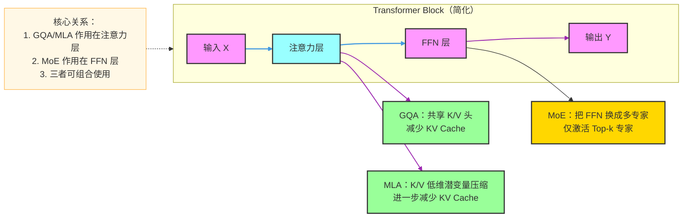
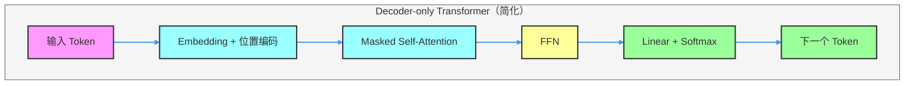
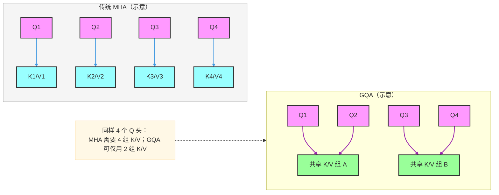
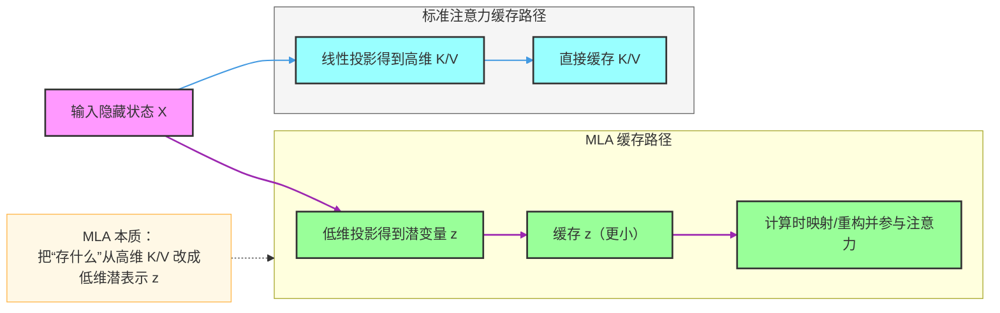
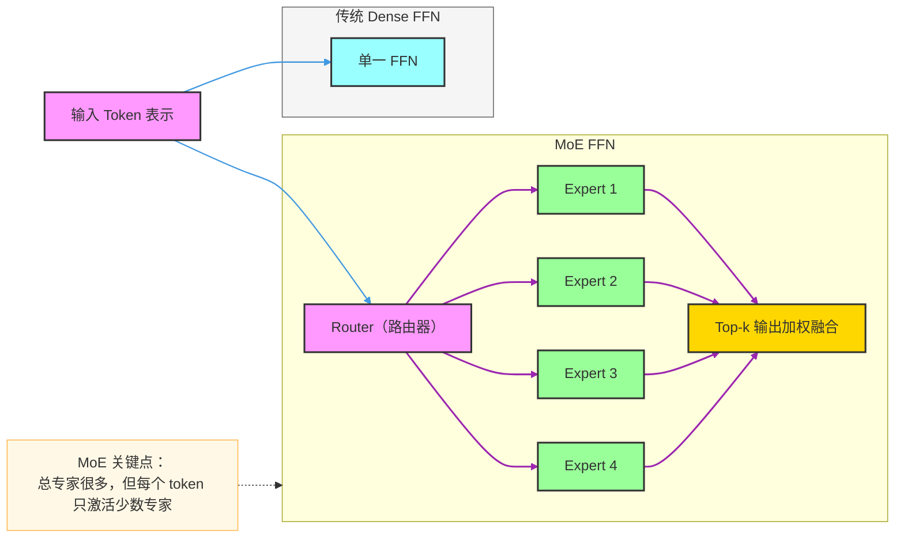
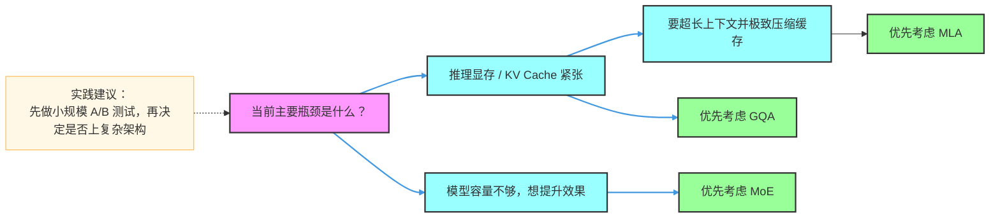

# Transformer 改进架构入门：GQA、MLA、MoE（零基础 + 面试）

> 目标读者：0 基础同学  
> 阅读目标：读完后你能讲清楚 `Transformer / GQA / MLA / MoE` 的核心区别、优缺点和面试回答思路。

---

## 一、先建立全局认知：这 4 个名词是什么关系？

- `Transformer`：基础骨架（注意力 + 前馈网络）。
- `GQA`：改进的是注意力里的 `K/V` 头共享方式，主要为**省显存、提吞吐**。
- `MLA`：改进的是注意力里的 `K/V` 表示方式，主要为**进一步压缩 KV Cache**。
- `MoE`：改进的是前馈网络 `FFN`，主要为**在总参数很大时仍保持较低计算开销**。

一句话记忆：

- `GQA/MLA` 主要优化**注意力成本**（尤其是推理阶段 KV Cache）。
- `MoE` 主要优化**参数规模与计算成本的矛盾**（大容量、稀疏激活）。

---

## 二、四种架构在模型中的位置（总览图）

---

## 三、Transformer（基线架构）

### 1）定位

- Transformer 是现代大模型的基础范式，最核心能力是**全局建模上下文关系**。
- 应用场景：NLP、代码、多模态、语音、时间序列等。

### 2）核心 Backbone

- 典型 Block：`Attention + FFN + Residual + LayerNorm`。
- 解码场景（LLM）常见的是 Decoder-only Transformer。

### 3）最大创新

- 自注意力机制：任意 token 可以直接“看见”其他 token（全局依赖）。
- 并行训练能力强（相比 RNN 的串行）。

### 4）结构范式

`输入 token -> 词向量/位置编码 -> 多层 Transformer Block -> 线性层 -> 输出概率`

### 5）性能指标（直觉）

- 优点：效果强、通用性强、扩展性强。
- 缺点：注意力在长序列上成本高，推理时 KV Cache 占显存。

### 6）基础架构图（简化）

---

## 四、GQA（Grouped-Query Attention）

### 1）定位

- GQA 是注意力层的工程优化方案，用更少的 `K/V` 头服务更多的 `Q` 头。
- 目标是：**大幅降低 KV Cache 和内存带宽压力**，同时尽量保持效果。

### 2）核心 Backbone

- 在标准多头注意力（MHA）中，通常每个 `Q` 头都有对应 `K/V` 头。
- GQA 让多个 `Q` 头共享同一组 `K/V` 头（按组共享）。

### 3）最大创新

- 用“分组共享”替代“一一对应”，实现质量和效率之间的折中。

### 4）结构范式

`Q 头数 hq > K/V 头数 hkv`，每 `hq/hkv` 个 Q 头共享一组 K/V。

### 5）性能指标（直觉）

- 优点：显存更省、推理吞吐更高、部署友好。
- 缺点：分组过大时可能损失部分表达能力。

### 6）架构图（MHA vs GQA）

---

## 五、MLA（Multi-head Latent Attention）

### 1）定位

- MLA 是更激进的注意力优化思路：先把 `K/V` 信息压缩到低维潜空间，再用于注意力计算。
- 目标是：**在超长上下文和大批量推理下显著降低 KV Cache 成本**。

### 2）核心 Backbone

- 标准方式：直接缓存每层每个 token 的高维 `K/V`。
- MLA 方式：先投影到低维潜变量 `z`，缓存 `z`，需要时再恢复或参与计算。

### 3）最大创新

- 把注意力中的“记忆体”从高维 `K/V` 改造成低维潜表示，提升缓存效率。

### 4）结构范式

`X -> 低维投影(压缩) -> 潜变量缓存 -> 注意力计算(重构/映射) -> 输出`

### 5）性能指标（直觉）

- 优点：比 GQA 更进一步地压缩缓存，长上下文推理更友好。
- 缺点：实现复杂度更高，训练和工程细节要求更严格。

### 6）架构图（标准 KV Cache vs MLA）

---

## 六、MoE（Mixture of Experts）

### 1）定位

- MoE 主要改造 FFN：把一个大 FFN 换成多个“专家 FFN”。
- 每个 token 不再走所有专家，而是由路由器选择 `Top-k` 个专家参与计算。

### 2）核心 Backbone

- Dense FFN：每个 token 都走同一套参数。
- MoE FFN：每个 token 只走少数专家（稀疏激活）。

### 3）最大创新

- 在“总参数量很大”的同时，保持“每 token 计算量可控”。

### 4）结构范式

`输入 token -> Router 打分 -> 选择 Top-k 专家 -> 加权融合 -> 输出`

### 5）性能指标（直觉）

- 优点：模型容量可以非常大，性价比高，扩展性好。
- 缺点：训练和分布式实现复杂，可能出现专家负载不均衡。

### 6）架构图（Dense FFN vs MoE）

---

## 七、核心对比：到底该怎么区分？

### 1）一句话差异

- `Transformer`：原始通用骨架。
- `GQA`：共享 K/V 头，省缓存。
- `MLA`：潜变量压缩 K/V，进一步省缓存。
- `MoE`：专家路由替代 Dense FFN，扩参数不扩太多计算。

### 2）对比表（面试高频）

| 维度 | Transformer | GQA | MLA | MoE |
|---|---|---|---|---|
| 改动位置 | 注意力+FFN（基线） | 注意力（头共享） | 注意力（潜变量压缩） | FFN（专家化） |
| 主要目标 | 强表达能力 | 减少 KV Cache | 进一步压缩 KV Cache | 提升模型容量/性价比 |
| 推理显存 | 高 | 低于基线 | 常低于 GQA | 与注意力方案有关 |
| 工程复杂度 | 中 | 中 | 较高 | 高 |
| 典型风险 | 长上下文成本高 | 分组过大损失精度 | 实现细节复杂 | 专家负载不均、训练不稳 |
| 是否可组合 | - | 可与 MoE 组合 | 可与 MoE 组合 | 可与 GQA/MLA 组合 |

---

## 八、面试回答模板（可直接背）

### Q1：GQA 和 MHA 的本质区别是什么？

**答题模板：**

`MHA` 基本是 Q/K/V 头一一对应；`GQA` 是多个 Q 头共享一组 K/V 头。  
这样做的收益是显著降低 KV Cache 和内存带宽开销，尤其在大模型推理阶段吞吐更好；代价是共享过度时会损失一部分表达能力。

### Q2：MLA 比 GQA 更“先进”在哪里？

**答题模板：**

`GQA` 还是在头维度做共享，`MLA` 是从表示维度出发，把 K/V 压缩到低维潜空间再缓存。  
所以 MLA 往往在超长上下文下更省缓存，但实现更复杂，工程门槛也更高。

### Q3：MoE 为什么能“参数很大但算力不爆炸”？

**答题模板：**

MoE 把一个 FFN 拆成很多专家，每个 token 只走 Top-k 专家，不需要激活全部参数。  
因此总参数可以很大（容量大），但单 token 实际计算量接近稀疏计算规模。

### Q4：GQA/MLA/MoE 可以同时用吗？

**答题模板：**

可以，且很常见。  
`GQA/MLA` 主要在注意力侧降成本，`MoE` 在 FFN 侧扩容量，两个方向互补。

---

## 九、重要 FAQ（0 基础常见困惑）

### FAQ 1：为什么大模型推理总提 KV Cache？

因为自回归生成时，历史 token 的 K/V 会被反复使用。  
如果不缓存，每次都重算会非常慢；缓存后速度快，但显存压力变大。

### FAQ 2：GQA 一定比 MHA 好吗？

不一定。  
GQA 是效率优先的折中方案，通常“更省资源”，但效果是否持平要看具体模型和分组策略。

### FAQ 3：MLA 一定比 GQA 更好吗？

也不一定。  
MLA 常在长上下文和高吞吐场景更占优，但实现复杂度高、训练和部署细节更多。

### FAQ 4：MoE 是不是“多个完整模型投票”？

不是。  
MoE 一般是 Transformer 内部某些层（常见 FFN）变成专家集合，不是把多个完整大模型并排推理。

### FAQ 5：MoE 的主要工程难点是什么？

专家负载均衡和分布式通信。  
如果路由不均，部分专家会过载，训练和推理效率都会受影响。

### FAQ 6：面试时如何快速判断候选架构？

先看瓶颈在“注意力缓存”还是“模型容量”：  
- 若瓶颈是推理显存/KV Cache，优先考虑 `GQA/MLA`。  
- 若瓶颈是模型容量不足且算力受限，优先考虑 `MoE`。

---

## 十、给小白的最终记忆卡片

- **第一层记忆（位置）**：`GQA/MLA` 改注意力，`MoE` 改 FFN。  
- **第二层记忆（目标）**：`GQA/MLA` 省缓存，`MoE` 扩容量。  
- **第三层记忆（代价）**：越激进越复杂，工程难度随之上升。  
- **第四层记忆（面试）**：先讲“改哪里”，再讲“为什么快/省”，最后讲“代价和适用场景”。

---

## 十一、补充：一页决策图（选型思路）

---

## 十二、市面热门模型的架构说明表（基于公开资料）

> 说明：以下内容用于学习和面试复习，基于公开论文/技术报告/官方博客整理。  
> 同一模型不同版本可能有差异，闭源模型细节可能未完全公开。

### 1）开源热门模型（更适合面试细节追问）

| 模型系列（代表） | 基础骨架 | 注意力侧 | FFN 侧 | 是否 MoE | 一句话定位 |
|---|---|---|---|---|---|
| LLaMA 2 / LLaMA 3 | Decoder-only Transformer | 常见为 `GQA` | Dense FFN | 否 | 主流开源通用底座，工程和生态成熟 |
| Qwen2 / Qwen2.5（Dense） | Decoder-only Transformer | 常见为 `GQA` | Dense FFN | 否 | 中文和代码能力均衡，部署方案丰富 |
| Qwen2.5-MoE（部分版本） | Decoder-only Transformer | 常见为 `GQA` | MoE FFN | 是 | 在可控计算下提升模型容量 |
| Mistral 7B | Decoder-only Transformer | 常见为 `GQA` | Dense FFN | 否 | 强调推理效率的小中型高性价比模型 |
| Mixtral 8x7B / 8x22B | Decoder-only Transformer | 常见为 `GQA` | MoE FFN | 是 | 代表性的开源 MoE 路线 |
| DeepSeek-V2 / V3（公开路线） | Decoder-only Transformer 变体 | `MLA` | MoE FFN | 是 | 以缓存压缩 + 专家稀疏为核心卖点 |

### 2）闭源热门模型（公开细节有限）

| 模型系列（代表） | 基础骨架 | 注意力侧 | FFN 侧 | 是否 MoE | 备注 |
|---|---|---|---|---|---|
| GPT-4.x 系列 | Transformer 家族 | 未完全公开 | 未完全公开 | 未完全公开 | 可讲“工业级优化 + 细节未全披露” |
| Claude 3.x 系列 | Transformer 家族 | 未完全公开 | 未完全公开 | 未完全公开 | 公开信息更偏能力描述而非结构细节 |
| Gemini 1.5/2.x 系列 | Transformer 家族 | 未完全公开 | 未完全公开 | 未完全公开 | 可强调长上下文与多模态能力 |

### 3）面试速记版（30 秒）

- 开源趋势可概括为：`GQA` 逐步普及，`MoE` 在大模型中越来越常见。  
- 更激进路线是：在注意力侧继续做 `KV Cache` 压缩（如 `MLA`），再和 `MoE` 组合。  
- 回答时要主动补一句：**“具体实现取决于模型版本，以下按公开资料说明。”**

