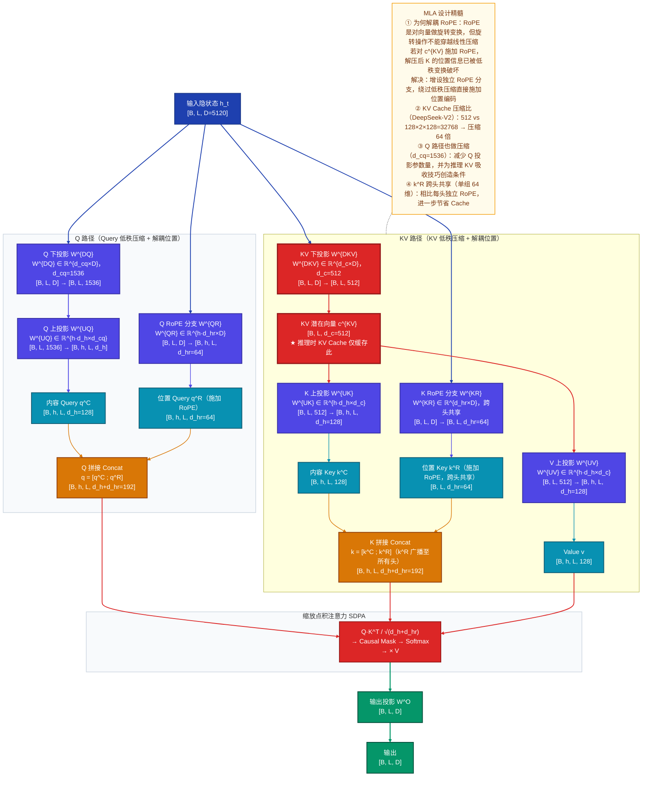
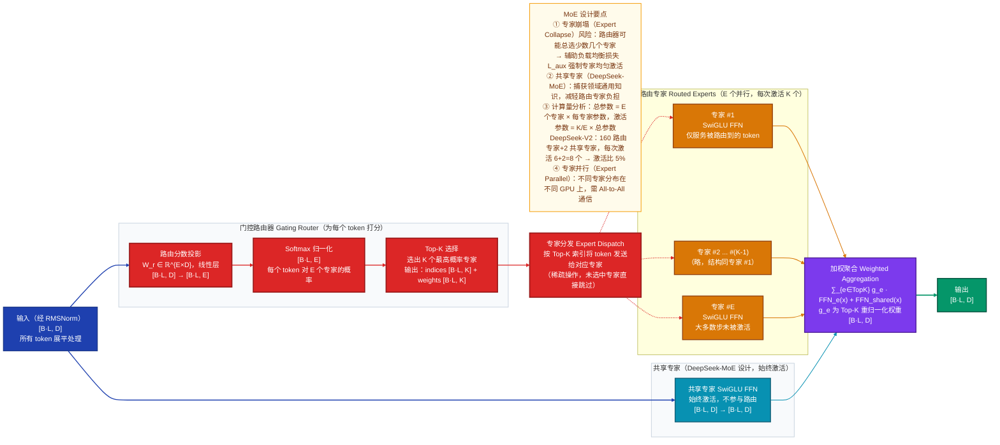

好的，我来为你撰写这份完整的技术分析文档。

---

# Transformer 三大改进方向深度技术分析

## GQA · MLA · MoE 对比研究

---

## 目录

1. [模型定位](#一模型定位)
2. [整体架构](#二整体架构)
3. [数据直觉](#三数据直觉)
4. [核心数据流（重点）](#四核心数据流重点)
5. [关键组件](#五关键组件)
6. [训练与评估](#六训练与评估)
7. [推理与部署](#七推理与部署)
8. [FAQ](#八faq)

---

## 一、模型定位

### 1.1 三条核心瓶颈

标准 Transformer（Decoder-only 范式）在扩展到百亿级别时，在三个维度上撞上了工程极限：

| 瓶颈编号 | 瓶颈名称 | 根本原因 | 量化感知（7B，32 层，32 头，$d_h=128$，seq=4096，batch=32）|
|:---:|:---|:---|:---|
| ① | **KV Cache 显存墙** | 自回归推理须缓存历史所有 token 的 K/V 向量 | $32 \times 32 \times 2 \times 4096 \times 128 \times 2\,\text{bytes} \approx 17\,\text{GB}$ |
| ② | **参数量与算力强耦合** | 每个 token 激活全量 FFN 参数 | 参数翻倍 → FLOPs 线性翻倍，无法廉价扩容 |
| ③ | **注意力 $O(L^2)$ 复杂度** | 注意力矩阵与序列长度平方成比例 | 128K 上下文单层矩阵达 $128K^2 \approx 16\,\text{G}$ 元素 |

**本文聚焦瓶颈 ① 与 ② 的工业级解法**（瓶颈 ③ 的 FlashAttention 路线不在本文讨论范围）。

---

### 1.2 三种方案一句话定位

**GQA（分组查询注意力，Grouped Query Attention）**
> 研究方向：推理效率优化——KV Cache 轻量级压缩。  
> 核心创新：将 $h$ 个 Query 头分为 $G$ 组，组内头共享同一对 K/V 投影，以接近零质量损失的代价将 KV Cache 压缩 $h/G$ 倍，是 MHA 质量与 MQA 效率之间性价比最高的折中方案。  
> 代表模型：LLaMA-2/3、Mistral-7B、Gemma。

**MLA（多头潜在注意力，Multi-head Latent Attention）**
> 研究方向：推理效率优化——KV Cache 激进极限压缩。  
> 核心创新：用低秩矩阵将 KV 投影到 $d_c \ll 2h d_h$ 的潜在向量，仅缓存该压缩表示；同时引入**解耦 RoPE 分支**解决"旋转位置编码无法穿越低秩变换"的根本矛盾。DeepSeek-V2 实测 KV Cache 压缩比高达 **93.3%**。  
> 代表模型：DeepSeek-V2、DeepSeek-V3。

**MoE（混合专家模型，Mixture of Experts）**
> 研究方向：模型容量扩展——参数量与单 token 算力解耦。  
> 核心创新：将 FFN 层替换为 $E$ 个并行专家子 FFN，通过可学习的稀疏门控路由器让每个 token 动态选择 Top-$K$ 个专家激活，"花一份密集小模型的算力，调用一个稀疏大模型的知识"。  
> 代表模型：Mixtral-8×7B、Switch Transformer、DeepSeek-V2/V3（MLA + MoE 组合）。

**三者关系总结：GQA 与 MLA 互为替代（二选一优化注意力层），MoE 与二者**正交可组合**。**

---

## 二、整体架构

### 2.1 功能模块三层拆解（ASCII 树形结构）

```
Decoder-only Transformer LLM 完整架构
（三种变体替换点标注，按「功能模块 → 子模块 → 关键算子」三层展开）
│
├── 【功能模块 ①】输入层 Input Layer
│   │   职责：将离散 Token ID 序列映射为连续向量表示
│   │
│   ├── 词元嵌入 Token Embedding                     查表操作：[B,L] → [B,L,D]；参数 [V,D]
│   └── 旋转位置编码 RoPE                             无独立参数层，在注意力内部注入位置信息
│
├── 【功能模块 ②】Transformer Block ×N               职责：逐层建模 Token 间全局依赖，提炼语义特征
│   │   （串行堆叠，N 通常 32~96 层；每层结构相同但参数独立）
│   │
│   ├── 【子模块 ①】注意力子层 Attention Sub-Layer    职责：捕获全局 Token 间依赖关系
│   │   ├── 输入归一化 RMSNorm（Pre-Norm）            [B,L,D]；均方根归一化，稳定深层梯度
│   │   │
│   │   ├── ══ 替换点 A：注意力机制（MHA / GQA / MLA 三选一）══════════════════════
│   │   │
│   │   ├── [基线] 多头自注意力 MHA
│   │   │   ├── Q 投影 W_Q ∈ ℝ^{D×h·d_h}            [B,L,D] → [B,h,L,d_h]
│   │   │   ├── K 投影 W_K ∈ ℝ^{D×h·d_h}            [B,L,D] → [B,h,L,d_h]
│   │   │   ├── V 投影 W_V ∈ ℝ^{D×h·d_h}            [B,L,D] → [B,h,L,d_h]
│   │   │   └── 缩放点积注意力 SDPA + 输出投影 W_O    KV Cache = 2·h·d_h 维/token
│   │   │
│   │   ├── [GQA 替换] 分组查询注意力 GQA（G 个共享 K/V 头，G < h）
│   │   │   ├── Q 投影 W_Q ∈ ℝ^{D×h·d_h}            [B,L,D] → [B,h,L,d_h]（同 MHA）
│   │   │   ├── K 投影 W_K ∈ ℝ^{D×G·d_h}            [B,L,D] → [B,G,L,d_h]  ← 头数缩减
│   │   │   ├── V 投影 W_V ∈ ℝ^{D×G·d_h}            [B,L,D] → [B,G,L,d_h]  ← 头数缩减
│   │   │   ├── KV 扩展 repeat(K/V, h/G, dim=head)   [B,G,L,d_h] → [B,h,L,d_h]（广播）
│   │   │   └── SDPA + 输出投影 W_O                  KV Cache = 2·G·d_h 维/token；压缩 h/G 倍
│   │   │
│   │   └── [MLA 替换] 多头潜在注意力 MLA（低秩压缩 KV）
│   │       ├── Q 下投影 W^{DQ} ∈ ℝ^{d_cq×D}        [B,L,D] → [B,L,d_cq]（Q 压缩）
│   │       ├── Q 上投影 W^{UQ} ∈ ℝ^{h·d_h×d_cq}    [B,L,d_cq] → [B,h,L,d_h]（Q 解压）
│   │       ├── Q RoPE 分支 W^{QR} ∈ ℝ^{h·d_hr×D}   [B,L,D] → [B,h,L,d_hr]（Q 位置感知）
│   │       ├── KV 下投影 W^{DKV} ∈ ℝ^{d_c×D}       [B,L,D] → [B,L,d_c]  ← KV Cache 仅缓存此
│   │       ├── K 上投影 W^{UK} ∈ ℝ^{h·d_h×d_c}     [B,L,d_c] → [B,h,L,d_h]（K 解压）
│   │       ├── V 上投影 W^{UV} ∈ ℝ^{h·d_h×d_c}     [B,L,d_c] → [B,h,L,d_h]（V 解压）
│   │       ├── K RoPE 分支 W^{KR} ∈ ℝ^{d_hr×D}     [B,L,D] → [B,L,d_hr]（K 位置感知，跨头共享）
│   │       └── SDPA：Q=[q_C,q_R], K=[k_C,k_R] 拼接  KV Cache = d_c 维/token；压缩 2hd_h/d_c 倍
│   │
│   ├── 残差连接 Residual Add                        x = x + Attn(LN(x))；模块间串行连接
│   │
│   ├── 【子模块 ②】前馈子层 FFN Sub-Layer            职责：逐 Token 非线性特征变换（提炼语义、存储知识）
│   │   ├── 输入归一化 RMSNorm（Pre-Norm）            [B,L,D]
│   │   │
│   │   ├── ══ 替换点 B：前馈网络（Dense FFN / MoE 二选一）═══════════════════════════
│   │   │
│   │   ├── [基线] 密集前馈网络 SwiGLU
│   │   │   ├── Gate 投影 W_gate                     [B,L,D] → [B,L,4D]
│   │   │   ├── Up 投影 W_up                         [B,L,D] → [B,L,4D]
│   │   │   ├── SiLU 门控激活 silu(gate) ⊙ up        按元素相乘，非线性门控
│   │   │   └── Down 投影 W_down                     [B,L,4D] → [B,L,D]
│   │   │
│   │   └── [MoE 替换] 混合专家前馈网络
│   │       ├── 门控路由器 Router W_r ∈ ℝ^{E×D}      [B·L,D] → [B·L,E]（对所有专家打分）
│   │       │   ├── Softmax 归一化                   得到路由概率分布
│   │       │   └── Top-K 选择                       选出概率最高的 K 个专家
│   │       ├── 专家分发 Expert Dispatch              按路由结果将 token 分配到对应专家
│   │       │   ├── 专家 FFN #1 ... #E（结构同 SwiGLU，权重相互独立）
│   │       │   │   └── 仅被路由到的 token 激活，其余专家跳过
│   │       │   └── 共享专家（DeepSeek-MoE 设计，始终激活，捕获通用知识）
│   │       └── 加权聚合 Weighted Sum                ∑_{e∈TopK} g_e · FFN_e(x)，路由权重重归一化
│   │
│   └── 残差连接 Residual Add                        x = x + FFN(LN(x))；模块间串行连接
│
└── 【功能模块 ③】输出层 Output Layer                职责：隐状态 → 词表概率分布
    ├── 输出归一化 RMSNorm                           [B,L,D]
    └── 语言模型头 LM Head（线性投影）                [B,L,D] → [B,L,V]；通常与 Embedding 矩阵权重共享
```

**模块间连接方式：**
- 注意力子层与 FFN 子层：**串行**（Attn → Add → FFN → Add）
- Block 间：**串行堆叠**，每层输入是上一层残差输出
- GQA 中 KV 扩展：**组内广播并行**（组内所有 Query 头共享同一 K/V，计算时复制扩展）
- MoE 中专家计算：**token 间批次并行**（不同 token 路由到不同专家，可并行执行）

---

### 2.2 三种变体整体架构对比图

下图展示 Transformer Block 的完整结构及三种变体的替换位置，重点关注**替换点 A（注意力层）**和**替换点 B（FFN 层）**，以及各变体的 KV Cache 规模对比。

```mermaid
flowchart LR
    classDef inputStyle    fill:#1e40af,stroke:#1e3a8a,stroke-width:2px,color:#fff
    classDef embedStyle    fill:#4f46e5,stroke:#3730a3,stroke-width:2px,color:#fff
    classDef encoderStyle  fill:#0891b2,stroke:#155e75,stroke-width:2px,color:#fff
    classDef attnStyle     fill:#dc2626,stroke:#991b1b,stroke-width:2.5px,color:#fff
    classDef ffnStyle      fill:#d97706,stroke:#92400e,stroke-width:2px,color:#fff
    classDef headStyle     fill:#059669,stroke:#064e3b,stroke-width:2px,color:#fff
    classDef noteStyle     fill:#fffbeb,stroke:#f59e0b,stroke-width:1.5px,color:#78350f
    classDef layerStyle    fill:#f8fafc,stroke:#cbd5e0,stroke-width:1.5px

    INPUT["Token IDs<br>[B, L]"]:::inputStyle

    subgraph EMB_LAYER["① 输入层 Input Layer"]
        direction LR
        EMB["词元嵌入 + RoPE 位置编码<br>Token Embedding + RoPE<br>[B, L, D]"]:::embedStyle
    end
    class EMB_LAYER layerStyle

    subgraph BLOCK["② Transformer Block ×N（串行堆叠）"]
        direction LR
        NORM1["输入归一化<br>RMSNorm Pre-Norm<br>[B, L, D]"]:::encoderStyle
        ATTN["注意力机制<br>替换点 A：MHA / GQA / MLA<br>[B, L, D] → [B, L, D]"]:::attnStyle
        ADD1["残差连接<br>Residual Add<br>x = x + Attn_out"]:::encoderStyle
        NORM2["输入归一化<br>RMSNorm Pre-Norm<br>[B, L, D]"]:::encoderStyle
        FFN_NODE["前馈网络<br>替换点 B：Dense FFN / MoE<br>[B, L, D] → [B, L, D]"]:::ffnStyle
        ADD2["残差连接<br>Residual Add<br>x = x + FFN_out"]:::encoderStyle
    end
    class BLOCK layerStyle

    subgraph OUT_LAYER["③ 输出层 Output Layer"]
        direction LR
        NORM_OUT["输出归一化<br>RMSNorm<br>[B, L, D]"]:::encoderStyle
        LMHEAD["语言模型头<br>LM Head（与 Embedding 共享权重）<br>[B, L, D] → [B, L, V]"]:::headStyle
    end
    class OUT_LAYER layerStyle

    OUTPUT["输出 Logits<br>[B, L, V]"]:::headStyle

    NOTE_A["注意力替换点 A 对比<br>MHA：KV Cache = 2·h·d_h / token（基线）<br>GQA：KV Cache = 2·G·d_h / token（G < h，压缩 h/G 倍）<br>MLA：KV Cache = d_c / token（d_c 远小于 2·h·d_h，压缩 ~64 倍）"]:::noteStyle
    NOTE_B["FFN 替换点 B 对比<br>Dense：全量参数激活，D→4D→D，算力=参数量<br>MoE：E 个专家，每 token 激活 K 个<br>参数量×E，算力仅×K/E（参数-算力解耦）"]:::noteStyle

    INPUT --> EMB
    EMB --> NORM1
    NORM1 --> ATTN
    ATTN --> ADD1
    ADD1 --> NORM2
    NORM2 --> FFN_NODE
    FFN_NODE --> ADD2
    ADD2 -.->|"×(N-1) 层循环"| NORM1
    ADD2 --> NORM_OUT
    NORM_OUT --> LMHEAD
    LMHEAD --> OUTPUT
    NOTE_A -.- ATTN
    NOTE_B -.- FFN_NODE

    %% 边索引：0-10，共 11 条有向边；NOTE 悬浮边 11-12
    linkStyle 0     stroke:#1e40af,stroke-width:2px
    linkStyle 1,2   stroke:#4f46e5,stroke-width:2px
    linkStyle 3,4   stroke:#0891b2,stroke-width:2px
    linkStyle 5,6   stroke:#d97706,stroke-width:2px
    linkStyle 7     stroke:#d97706,stroke-width:1.5px,stroke-dasharray:4 3
    linkStyle 8,9,10 stroke:#059669,stroke-width:2px
```



**图后要点：**
- **替换点 A 的三种方案互斥**：同一个模型的注意力层只能是 MHA、GQA、MLA 之一，不可同时使用
- **替换点 A 与 B 正交**：注意力变体与 FFN 变体可任意组合，DeepSeek-V2 即选择 MLA + MoE 组合
- **KV Cache 仅取决于替换点 A**：MoE 对 KV Cache 没有影响，因为 KV Cache 只来自注意力层
- **残差连接是统一框架**：三种变体均保留 Pre-Norm + 残差结构，保证梯度稳定传播

---

## 三、数据直觉

### 3.1 样例设定

选取一条具体的中文查询作为主线，逐阶段追踪数据形态变化：

> **原始输入（真实文字）**：`"北京今天最高气温是多少度？"`

这是一个典型的事实问答请求，模型需要理解地点（北京）、时间（今天）、询问目标（最高气温），并生成合理的回答续写。

---

### 3.2 阶段一：原始输入 → 预处理（Tokenization）

BPE 分词器将原始字符串切分为词元（Token）：

```
原始文字：  北京    今天    最高    气温    是    多少度    ？
Token ID：  21271   22909  15981  12345   338   35628    30002
Token 数：  7 个 Token（seq_len = 7）
```

- `"北京"` 作为常见词被合并为单个 Token
- `"多少度"` 因字符组合频率高，也被合并为单个 Token
- `"是"` 为高频单字，独立成 Token
- 每个 Token 是一个整数 ID，可以理解为"这个语义单元在词表中的门牌号"

输出张量：`Token ID Tensor [B=1, L=7]`

---

### 3.3 阶段二：预处理 → 词元嵌入

嵌入矩阵 $\mathbf{E} \in \mathbb{R}^{V \times D}$（V=10万词表，D=4096）将每个 Token ID 映射为 4096 维向量：

```
"北京" (ID=21271) → 向量 [0.23, -0.45, 0.11, ..., 0.08]  ← 4096 维
"气温" (ID=12345) → 向量 [0.01,  0.67, -0.33, ..., 0.15] ← 4096 维
```

**这一步在表达什么**：此时每个 Token 的向量表示仅包含**该词本身的语义**，完全没有上下文信息——"气温"向量无论出现在"北京气温"还是"上海气温"的句子中，此刻都完全一样。各 Token 向量在语义空间中互相独立，犹如孤岛。

输出张量：`[B=1, L=7, D=4096]`

---

### 3.4 阶段三：穿越注意力层（以 MLA 为例）

**第 1 层注意力**，输入 7 个 token 的 4096 维向量序列。

在 MLA 中：
1. KV 下投影将每个 token 的 4096 维向量**压缩**为 512 维潜在向量 $c^{KV}$（DeepSeek-V2 设定）
2. 缓存 7 × 512 = 3584 个数值（而 MHA 需缓存 7 × 128头 × 2 × 128维 = 229376 个数值）

**注意力分布**的人类可读含义（以"气温"这个 token 为例）：
- "气温" 对 "最高" 的注意力权重 ≈ 0.31 → 理解"是哪种气温？是最高的"
- "气温" 对 "北京" 的注意力权重 ≈ 0.27 → 理解"哪里的气温？是北京的"
- "气温" 对 "今天" 的注意力权重 ≈ 0.22 → 理解"什么时间的气温？是今天的"
- "气温" 对 "多少度" 的注意力权重 ≈ 0.15 → 理解"询问的是数值"

**第 1 层注意力之后**：`"气温"` 的向量表示已从"气温这个词的通用语义"升级为"北京今天最高气温（被询问数值）"。这一步本质上是**上下文融合**：用其他 token 的信息重新解释每个 token 的含义。

经过 N 层注意力后，最后一个 token `"？"` 的表示已汇聚了整句话的完整语义。

---

### 3.5 阶段四：穿越前馈层（以 MoE 为例）

注意力层输出进入 MoE FFN 层，路由器对 `"气温"` token 打分：

```
专家路由分数（160 个专家中选 Top-6）：
  专家 #23（气象/天气领域，推测）：0.18 ✓ 选中
  专家 #47（数值/单位领域，推测）：0.15 ✓ 选中
  专家 #91（地理/城市领域，推测）：0.13 ✓ 选中
  ...（另外 3 个专家）
  其余 154 个专家：跳过，不参与本 token 的计算
```

**这一步在表达什么**：FFN 层是模型"记忆库"的读取操作。MoE 通过路由让不同类型的 token 激活不同的"专家知识库"——"气温"token 激活气象专家和数值专家，而"北京"token 可能激活地理专家和历史专家。这种专业化分工使模型总参数量增大但单 token 计算量保持可控。

---

### 3.6 阶段五：模型输出 → 后处理

**模型原始输出**：最后一个 token 位置对应的 logits 向量 `[V=100000]`，是词表上未归一化的分数。

```
logits 前几名（温度采样 T=0.7 后）：
  "是"（干燥）：logit = 8.3
  "约"：        logit = 7.9
  "在"：        logit = 7.7
  "大约"：      logit = 7.4
  ...
```

**后处理结果**：经 Softmax 得到概率分布后，采用 Top-P 采样（nucleus sampling，p=0.9），最终生成下一个 token `"约"`。

模型随后自回归地继续生成：`"约 15 摄氏度，..."` —— 给出北京气温的推断回答。

---

## 四、核心数据流（重点）

### 4.1 GQA 注意力数据流

下图追踪 GQA 中一条数据从输入 `[B, L, D]` 到输出 `[B, L, D]` 的完整张量变化，重点关注 K/V 头数从 $h$ 压缩到 $G$，以及**扩展广播**步骤如何恢复到 $h$ 头以完成标准 SDPA 计算。

```mermaid
flowchart LR
    classDef inputStyle    fill:#1e40af,stroke:#1e3a8a,stroke-width:2px,color:#fff
    classDef projStyle     fill:#4f46e5,stroke:#3730a3,stroke-width:2px,color:#fff
    classDef splitStyle    fill:#0891b2,stroke:#155e75,stroke-width:2px,color:#fff
    classDef attnStyle     fill:#dc2626,stroke:#991b1b,stroke-width:2.5px,color:#fff
    classDef mergeStyle    fill:#d97706,stroke:#92400e,stroke-width:2px,color:#fff
    classDef headStyle     fill:#059669,stroke:#064e3b,stroke-width:2px,color:#fff
    classDef noteStyle     fill:#fffbeb,stroke:#f59e0b,stroke-width:1.5px,color:#78350f
    classDef layerStyle    fill:#f8fafc,stroke:#cbd5e0,stroke-width:1.5px

    IN["输入 X（经 RMSNorm）<br>[B, L, D]"]:::inputStyle

    subgraph PROJ["线性投影层（Q 保持 h 头，K/V 压缩至 G 头）"]
        direction LR
        WQ["Q 投影 W_Q<br>W_Q ∈ ℝ^{D×h·d_h}<br>[B, L, D] → [B, L, h·d_h]"]:::projStyle
        WK["K 投影 W_K<br>W_K ∈ ℝ^{D×G·d_h}（G < h）<br>[B, L, D] → [B, L, G·d_h]"]:::projStyle
        WV["V 投影 W_V<br>W_V ∈ ℝ^{D×G·d_h}（G < h）<br>[B, L, D] → [B, L, G·d_h]"]:::projStyle
    end
    class PROJ layerStyle

    subgraph RESHAPE["多头 Reshape（Q/K/V 均施加 RoPE）"]
        direction LR
        SQ["Q Reshape + RoPE<br>[B, h, L, d_h]<br>h 个独立 Query 头"]:::splitStyle
        SK["K Reshape + RoPE<br>[B, G, L, d_h]<br>G 个 K 头（KV Cache 缓存此）"]:::splitStyle
        SV["V Reshape<br>[B, G, L, d_h]<br>G 个 V 头（KV Cache 缓存此）"]:::splitStyle
    end
    class RESHAPE layerStyle

    subgraph EXPAND["KV 扩展广播（每个 K/V 头对应 h/G 个 Query 头）"]
        direction LR
        EK["K Expand / repeat<br>[B, G, L, d_h] → [B, h, L, d_h]<br>沿 head 维度重复 h/G 次"]:::splitStyle
        EV["V Expand / repeat<br>[B, G, L, d_h] → [B, h, L, d_h]<br>沿 head 维度重复 h/G 次"]:::splitStyle
    end
    class EXPAND layerStyle

    subgraph SDPA["缩放点积注意力（×h 头并行，与标准 MHA 完全相同）"]
        direction LR
        QK["Q·K^T 矩阵乘法<br>[B, h, L, L]"]:::attnStyle
        SCALE["缩放 ÷ √d_h<br>防数值溢出"]:::attnStyle
        MASK["因果掩码 Causal Mask<br>未来位置置 -∞"]:::attnStyle
        SOFTMAX["Softmax 归一化<br>[B, h, L, L]<br>注意力权重"]:::attnStyle
        AV["Attn-Weight × V<br>[B, h, L, d_h]<br>加权求和上下文"]:::attnStyle
    end
    class SDPA layerStyle

    CONCAT["拼接多头 + Reshape<br>Concat + Reshape<br>[B, L, h·d_h]"]:::mergeStyle
    WO["输出投影 W_O<br>W_O ∈ ℝ^{h·d_h×D}<br>[B, L, D]"]:::headStyle
    OUT["输出<br>[B, L, D]"]:::headStyle

    IN --> WQ
    IN --> WK
    IN --> WV
    WQ --> SQ
    WK --> SK
    WV --> SV
    SK --> EK
    SV --> EV
    SQ --> QK
    EK --> QK
    QK --> SCALE
    SCALE --> MASK
    MASK --> SOFTMAX
    SOFTMAX --> AV
    EV --> AV
    AV --> CONCAT
    CONCAT --> WO
    WO --> OUT

    NOTE["GQA 关键设计<br>① KV Cache 缓存的是 reshape 后的 K/V：大小为 [G, L, d_h]，非扩展后的 [h, L, d_h]<br>② Expand 操作发生在计算 SDPA 之前，仅在前向传播中执行，不占 Cache<br>③ h/G = 4（如 LLaMA-2 70B：h=64, G=8）→ KV Cache 减小 8 倍<br>④ G=1 退化为 MQA（最激进），G=h 退化为 MHA（原始）"]:::noteStyle
    NOTE -.- EXPAND

    %% 边索引：0-17，共 18 条；NOTE -.- 为边 18
    linkStyle 0,1,2   stroke:#1e40af,stroke-width:2px
    linkStyle 3,4,5   stroke:#4f46e5,stroke-width:1.5px
    linkStyle 6,7     stroke:#0891b2,stroke-width:2px
    linkStyle 8,9     stroke:#0891b2,stroke-width:1.5px
    linkStyle 10,11,12,13 stroke:#dc2626,stroke-width:2px
    linkStyle 14      stroke:#0891b2,stroke-width:1.5px
    linkStyle 15,16   stroke:#d97706,stroke-width:2px
    linkStyle 17      stroke:#059669,stroke-width:2.5px
```



---

### 4.2 MLA 注意力内部结构图

下图展示 MLA 的核心双路设计：**内容路径**（低秩压缩 + 上投影）和**位置路径**（解耦 RoPE 分支）。重点关注 KV 下投影 $c^{KV}$ 是实际缓存的唯一表示，以及两路最终如何拼接后进入 SDPA。



**图后要点：**
- **解耦 RoPE 的本质矛盾**：若直接对 $c^{KV}$ 施加 RoPE 再上投影，由于矩阵乘法与旋转操作不可交换，解压后 K 向量无法保有正确的位置信息；因此必须独立设置不经低秩变换的 RoPE 分支
- **推理 KV 吸收优化**：通过将 $W^{UK}$ 预先与 $W^{UQ}$ 合并，注意力分数 $q^C \cdot k^C$ 可直接从 $c^Q$ 和 $c^{KV}$ 计算，完全绕过 K 矩阵实体化，进一步节省推理时计算量

---

### 4.3 MoE FFN 内部结构图

下图展示 MoE 层的完整数据流，重点关注路由器如何选择专家、token 如何被分发给对应专家，以及最终如何加权聚合输出。



---

## 五、关键组件

### 5.1 GQA：分组 K/V 共享机制

#### 直觉

想象一个电话客服中心：MHA 是每位客服（Query 头）都有自己独立的资料库（K/V 头）；MQA 是所有客服共享同一份资料库；GQA 是将客服分成几个小组，组内成员共享一份资料库——既比人均一本节省资源，又比全员共享一本服务质量高。

本质上，GQA 是在"不同 Query 头对历史信息的关注点是否相同"这个问题上做了**粗粒度分组假设**：同组内的头关注点相似，可以共享 K/V。

#### 原理

将 $h$ 个 Query 头按顺序分为 $G$ 组（$G$ 整除 $h$），每组 $h/G$ 个头：

- **分组方式**：第 $g$ 组的 Query 头 $\{(g-1)\cdot h/G, \ldots, g \cdot h/G - 1\}$ 共享第 $g$ 个 K/V 头
- **KV 扩展**：计算时将 $G$ 个 K/V 头沿 head 维度重复 $h/G$ 次（`torch.repeat_interleave`），恢复为 $h$ 头格式，随后与 MHA 完全相同

这个设计关键在于：**扩展操作仅发生在计算阶段，不占 KV Cache 空间**。KV Cache 存储的始终是压缩后的 $G$ 头格式。

#### 公式

令 $h$ = 总 Query 头数，$G$ = KV 头组数（$1 \leq G \leq h$），$d_h$ = 每头维度：

$$Q = XW_Q,\quad W_Q \in \mathbb{R}^{D \times h d_h} \quad\Rightarrow\quad Q \in \mathbb{R}^{B \times h \times L \times d_h}$$

$$K = XW_K,\quad W_K \in \mathbb{R}^{D \times G d_h} \quad\Rightarrow\quad K \in \mathbb{R}^{B \times G \times L \times d_h}$$

$$V = XW_V,\quad W_V \in \mathbb{R}^{D \times G d_h} \quad\Rightarrow\quad V \in \mathbb{R}^{B \times G \times L \times d_h}$$

KV 扩展（每组内广播 $h/G$ 次）：

$$\hat{K} = \text{repeat\_interleave}(K,\, h/G,\, \text{dim}=1) \in \mathbb{R}^{B \times h \times L \times d_h}$$

$$\hat{V} = \text{repeat\_interleave}(V,\, h/G,\, \text{dim}=1) \in \mathbb{R}^{B \times h \times L \times d_h}$$

标准缩放点积注意力（与 MHA 完全相同）：

$$\text{GQA}(Q, \hat{K}, \hat{V}) = \text{softmax}\!\left(\frac{Q \hat{K}^T}{\sqrt{d_h}} + M\right)\hat{V}$$

其中 $M$ 为因果掩码矩阵。KV Cache 从 $2hd_h$ 维/token 降至 $2Gd_h$ 维/token，**压缩比** $= h/G$。

---

### 5.2 MLA：低秩 KV 压缩 + 解耦 RoPE

#### 直觉

GQA 是"减少 K/V 头的数量"来降低 Cache，MLA 则更激进——它问：**"既然 K 和 V 都是由同一个隐状态线性投影得到的，它们是否存在公共的低秩表示？"**

答案是肯定的。MLA 通过低秩分解，先将隐状态压缩到 $d_c = 512$ 维（远小于 $h \cdot d_h = 128 \times 128 = 16384$ 维），只缓存这个压缩向量，使用时再解压回完整 K/V。就像把书压缩成 ZIP 文件存档，用时再解压——只要压缩率足够高，存储成本骤降。

但有个技术难题：RoPE 是对向量施加依赖位置的旋转，但这个旋转操作与线性压缩不可交换（先压缩再旋转 ≠ 先旋转再压缩）。MLA 通过增设一条**不经过压缩的独立 RoPE 分支**（称为解耦 RoPE）来绕开这个矛盾。

#### 原理

**KV 压缩路径**（存入 Cache 的部分）：

$$c^{KV}_t = W^{DKV} h_t, \quad W^{DKV} \in \mathbb{R}^{d_c \times D}$$

$c^{KV}_t \in \mathbb{R}^{d_c}$ 是第 $t$ 个 token 的 KV 潜在向量，**这是推理时唯一需要缓存的向量**。

**KV 解压路径**（从 Cache 重建 K/V）：

$$k^C_{t,i} = W^{UK}_i c^{KV}_t, \quad v_{t,i} = W^{UV}_i c^{KV}_t$$

其中 $W^{UK}_i, W^{UV}_i \in \mathbb{R}^{d_h \times d_c}$ 为第 $i$ 头的上投影矩阵。

**解耦 RoPE 路径**（不经低秩变换）：

$$k^R_t = \text{RoPE}(W^{KR} h_t), \quad W^{KR} \in \mathbb{R}^{d_{hr} \times D}$$

$k^R_t$ 是共享的位置感知 Key，对所有注意力头一致广播（跨头共享）。

**最终 Q/K 的构成**（内容 + 位置拼接）：

$$q_{t,i} = [q^C_{t,i};\, q^R_{t,i}], \quad k_{t,i} = [k^C_{t,i};\, k^R_t]$$

注意力计算：

$$o_{t,i} = \text{softmax}\!\left(\frac{q_{t,i} \cdot k_{s,i}^T}{\sqrt{d_h + d_{hr}}}\right)_{s \leq t} \!\cdot v_{t,i}$$

**KV Cache 压缩比**（以 DeepSeek-V2 参数为例）：

$$\text{标准 MHA Cache} = 2 \times h \times d_h = 2 \times 128 \times 128 = 32768 \text{ 维/token}$$

$$\text{MLA Cache} = d_c + d_{hr} = 512 + 64 = 576 \text{ 维/token}$$

$$\text{压缩比} \approx \frac{32768}{576} \approx 56.9 \times$$

---

### 5.3 MoE：稀疏门控路由与负载均衡

#### 直觉

想象一家专科医院，有 160 个科室（专家）。每位患者（token）到来时，导诊台（路由器）根据病情摘要推荐最匹配的 6 个科室就诊，其余 154 个科室今天无需接诊这位患者。相比让所有科室都检查每位患者（Dense FFN），效率大幅提升。

关键问题是：**导诊台如何学会准确推荐？** 答案是端到端训练——路由器与专家联合学习，路由器逐渐学会把相似类型的 token（如数学 token、代码 token、自然语言 token）发送给固定的专家组，形成**领域专业化**。

#### 原理

**门控路由器（Token-Choice 方式）**：

每个 token 的隐状态 $h_i \in \mathbb{R}^D$ 经路由器线性投影并归一化：

$$s_i = \text{Softmax}(h_i W_r^T), \quad W_r \in \mathbb{R}^{E \times D}$$

选取分数最高的 $K$ 个专家：

$$\mathcal{T}_i = \text{TopK}(s_i, K)$$

对选中专家的权重重归一化：

$$g_{i,e} = \frac{s_{i,e}}{\sum_{j \in \mathcal{T}_i} s_{i,j}}, \quad e \in \mathcal{T}_i$$

**稀疏 FFN 输出**：

$$y_i = \sum_{e \in \mathcal{T}_i} g_{i,e} \cdot \text{FFN}_e(h_i) + \text{FFN}_{shared}(h_i)$$

其中 $\text{FFN}_{shared}$ 为始终激活的共享专家（DeepSeek-MoE 设计）。

**负载均衡辅助损失**（防止专家崩塌）：

定义：$f_e = \frac{1}{BL}\sum_{i: e \in \mathcal{T}_i} 1$（专家 $e$ 实际处理 token 的比例），$P_e = \frac{1}{BL}\sum_i s_{i,e}$（路由器给专家 $e$ 的平均概率），则：

$$\mathcal{L}_{aux} = \alpha \cdot E \cdot \sum_{e=1}^{E} f_e \cdot P_e$$

$f_e \cdot P_e$ 在所有专家均匀分配时取最小值（$f_e = P_e = 1/E$ 时各项相等），当路由崩塌到少数专家时迅速增大，从而通过梯度反传迫使路由器均匀分配。总训练损失为 $\mathcal{L} = \mathcal{L}_{CE} + \mathcal{L}_{aux}$，$\alpha$ 通常取 $10^{-2} \sim 10^{-3}$。

---

## 六、训练与评估

### 6.1 三种变体的训练策略对比

**GQA 的训练策略**

GQA 改动极小，对训练几乎无特殊要求。实践上有两种来源：
1. **从头训练**（LLaMA-2/3 采用）：直接使用 GQA 架构训练，成本无额外增加
2. **从 MHA 迁移（Uptrain）**：将已训练好的 MHA 模型通过 Mean Pooling 将同组 K/V 头合并为单个头，再在下游任务上继续微调（Ainslie et al. 2023 论文中提出）

关键超参数：$G$ 的选择通常为 $h$ 的因子，典型值 $G = h/4$ 或 $G = h/8$。

**MLA 的训练策略**

MLA 需要注意**矩阵吸收（Matrix Absorption）**在训练与推理时的差异：
- 训练时：全部矩阵都独立存在（$W^{DKV}$, $W^{UK}$, $W^{UV}$ 分开），正常反传
- 推理时：可将 $W^{UK}$ 吸收进 $W^{UQ}$（见第七章），但吸收操作仅影响推理效率，不影响训练

解耦 RoPE 分支引入额外参数 $W^{QR}$ 和 $W^{KR}$，参数量少但对位置感知至关重要，不可省略。

**MoE 的训练策略**

MoE 训练有三个独特挑战：

| 挑战 | 问题描述 | 解决方案 |
|:---|:---|:---|
| 专家崩塌 | 路由器总倾向选固定少数专家 | 辅助负载均衡损失 $\mathcal{L}_{aux}$ |
| 训练不稳定 | MoE 模型初期损失波动大 | 专家 FFN 权重独立初始化 + 较小 $\alpha$ |
| 通信开销 | 专家并行时需 All-to-All 通信 | Expert Parallel + Token Drop 策略 |

---

### 6.2 评估指标与效率指标

| 指标类型 | 指标名称 | 说明 |
|:---|:---|:---|
| 语言建模 | **Perplexity（PPL）** | 越低越好；GQA 相比 MHA 通常差距 < 0.5 PPL |
| 下游任务 | **MMLU / HellaSwag / GSM8K** | 标准 LLM benchmark；MoE 通常优于同算力 Dense 模型 |
| KV Cache 效率 | **KV Cache 大小（GB）** | 直接指标；MLA 可比 MHA 减少 93%+ |
| 推理吞吐 | **Tokens/s（TPS）** | 相同显存下 GQA/MLA 因 KV 减小而吞吐更高 |
| 训练效率 | **MFU（模型 FLOPs 利用率）** | MoE 因稀疏激活难以达到 Dense 模型的 MFU |
| 专家均衡 | **专家激活频率标准差** | MoE 特有；越小越均衡，辅助损失效果越好 |

---

### 6.3 训练流程图

下图展示包含 MoE 辅助损失在内的完整训练流程，重点关注 MoE 特有的**辅助负载均衡损失**如何与主损失合并优化。

```mermaid
flowchart LR
    classDef dataStyle     fill:#1e40af,stroke:#1e3a8a,stroke-width:2px,color:#fff
    classDef forwardStyle  fill:#0891b2,stroke:#155e75,stroke-width:2px,color:#fff
    classDef lossStyle     fill:#dc2626,stroke:#991b1b,stroke-width:2.5px,color:#fff
    classDef backwardStyle fill:#d97706,stroke:#92400e,stroke-width:2px,color:#fff
    classDef optStyle      fill:#7c3aed,stroke:#4c1d95,stroke-width:2px,color:#fff
    classDef evalStyle     fill:#059669,stroke:#064e3b,stroke-width:2px,color:#fff
    classDef noteStyle     fill:#fffbeb,stroke:#f59e0b,stroke-width:1.5px,color:#78350f
    classDef layerStyle    fill:#f8fafc,stroke:#cbd5e0,stroke-width:1.5px

    DATASET[("预训练语料<br>Pre-training Corpus<br>（Token IDs 序列）")]:::dataStyle

    subgraph LOAD["数据加载 Data Loading"]
        direction LR
        DL["DataLoader<br>动态打包 + 批次化"]:::dataStyle
        PACK["序列打包 Packing<br>拼接短序列至 max_len<br>提高 GPU 利用率"]:::dataStyle
    end
    class LOAD layerStyle

    subgraph FORWARD["前向传播 Forward Pass"]
        direction LR
        FW["模型前向<br>GQA/MLA + Dense/MoE<br>混合精度 BF16"]:::forwardStyle
        LOGITS["输出 Logits<br>[B, L, V]"]:::forwardStyle
        ROUTE_STAT["路由统计（MoE 专用）<br>记录 f_e（实际激活频率）<br>和 P_e（路由概率均值）"]:::forwardStyle
    end
    class FORWARD layerStyle

    subgraph LOSS_CALC["损失计算 Loss Computation"]
        direction LR
        CE_LOSS["交叉熵损失<br>L_CE = CrossEntropy(logits, labels)<br>语言建模主目标"]:::lossStyle
        AUX_LOSS["辅助负载均衡损失（MoE 专用）<br>L_aux = α·E·∑f_e·P_e<br>促进专家均匀激活"]:::lossStyle
        TOTAL_LOSS["总损失<br>L = L_CE + L_aux"]:::lossStyle
    end
    class LOSS_CALC layerStyle

    subgraph BACKWARD["反向传播 Backward Pass"]
        direction LR
        GRAD["loss.backward()<br>GradScaler（混合精度）"]:::backwardStyle
        CLIP["梯度裁剪<br>max_norm = 1.0"]:::backwardStyle
    end
    class BACKWARD layerStyle

    subgraph OPTIM["参数更新 Optimization"]
        direction LR
        OPT["AdamW 优化器<br>β1=0.9, β2=0.95<br>weight_decay=0.1"]:::optStyle
        LRS["学习率调度<br>Warmup → 余弦退火"]:::optStyle
        ZERO_GRAD["清零梯度<br>zero_grad()"]:::optStyle
    end
    class OPTIM layerStyle

    subgraph EVAL["验证评估（每 N 步）"]
        direction LR
        VAL["验证集推理<br>with torch.no_grad()"]:::evalStyle
        PPL["困惑度评估<br>PPL = exp(L_CE)"]:::evalStyle
        CKPT["保存检查点<br>Checkpoint"]:::evalStyle
    end
    class EVAL layerStyle

    DATASET --> DL
    DL --> PACK
    PACK -->|"Batch [B, L]"| FW
    FW --> LOGITS
    FW --> ROUTE_STAT
    LOGITS --> CE_LOSS
    ROUTE_STAT --> AUX_LOSS
    CE_LOSS --> TOTAL_LOSS
    AUX_LOSS --> TOTAL_LOSS
    TOTAL_LOSS --> GRAD
    GRAD --> CLIP
    CLIP --> OPT
    OPT --> LRS
    LRS --> ZERO_GRAD
    ZERO_GRAD -.->|"下一个 Batch"| DL
    OPT -->|"每 N 步触发"| VAL
    VAL --> PPL
    PPL --> CKPT
    CKPT -.->|"早停 / 继续训练"| DATASET

    NOTE["训练关键要点<br>① GQA/MLA 对训练流程无特殊改动，L_aux 仅 MoE 需要<br>② 混合精度（BF16）：参数 BF16 存储，梯度 FP32 累积<br>③ MoE 路由梯度：L_aux 对路由权重 s_{i,e} 反传，推动路由均匀化<br>④ 序列打包（Packing）：无 padding 填充，tokens/GPU/s 提升 30-50%<br>⑤ 梯度累积：每 K 步 backward 一次 optimizer.step()，等效大批次"]:::noteStyle
    NOTE -.- LOSS_CALC

    %% 边索引：0-18，共 19 条有向边；NOTE -.- 为边 19
    linkStyle 0,1,2   stroke:#1e40af,stroke-width:2px
    linkStyle 3,4     stroke:#0891b2,stroke-width:1.5px
    linkStyle 5,6,7,8 stroke:#dc2626,stroke-width:2px
    linkStyle 9,10    stroke:#d97706,stroke-width:2px
    linkStyle 11,12,13 stroke:#7c3aed,stroke-width:2px
    linkStyle 14      stroke:#7c3aed,stroke-width:1.5px,stroke-dasharray:4 3
    linkStyle 15,16,17 stroke:#059669,stroke-width:2px
    linkStyle 18      stroke:#059669,stroke-width:1.5px,stroke-dasharray:4 3
```



---

## 七、推理与部署

### 7.1 推理与训练的关键差异

| 差异点 | 训练阶段 | 推理阶段 |
|:---|:---|:---|
| 序列并行 | 整个序列一次前向（Teacher Forcing） | **自回归逐 token 生成**，每步只前向一个 token |
| KV Cache | 无需 Cache，每步重新计算全部 K/V | **必须维护 KV Cache**，缓存历史 token 的 K/V |
| MoE 路由 | 批次内不同样本可能激活不同专家 | 单 token 推理时，路由结果决定哪些专家权重需加载 |
| 精度 | BF16/FP32 混合，梯度 FP32 | INT8/INT4 量化推理，无梯度计算 |

### 7.2 GQA 推理优化

GQA 在推理时优化直接且直观：

- **KV Cache 布局**：Cache 维度为 `[batch, num_kv_heads=G, seq_len, head_dim]`，不需要存储 $h/G$ 个重复副本
- **PagedAttention 兼容**：vLLM 的 PagedAttention 与 GQA 原生兼容，KV Cache 以 page 为单位动态分配
- **吞吐量提升来源**：KV Cache 减小 → 相同 GPU 显存可容纳更大 batch → 吞吐量线性提升

典型效果：LLaMA-2 70B（$h=64$, $G=8$）相比同参数 MHA 模型，batch_size 可扩大约 8 倍，理论吞吐量提升 4~6 倍（受带宽瓶颈影响）。

### 7.3 MLA 推理优化：KV Cache 矩阵吸收

MLA 有一个在推理时才生效的关键优化技巧——**KV Cache 吸收（KV Absorption）**。

**问题**：若直接缓存 $c^{KV}$ 并在每步推理时做 $k^C = W^{UK} c^{KV}$, $v = W^{UV} c^{KV}$，则每次注意力计算都需要解压所有历史 token 的 $c^{KV}$，引入额外计算。

**解决方案——将 $W^{UK}$ 吸收进 Q 投影**：

注意内容注意力分数可以化简：

$$q^C_{t,i} \cdot (k^C_{s,i})^T = (W^{UQ}_i c^Q_t)^T (W^{UK}_i c^{KV}_s)$$

$$= (c^Q_t)^T \underbrace{(W^{UQ}_i)^T W^{UK}_i}_{W^{abs}_i \in \mathbb{R}^{d_{cq} \times d_c}} c^{KV}_s$$

预计算一次 $W^{abs}_i = (W^{UQ}_i)^T W^{UK}_i$ 后，注意力分数可直接从低维向量 $c^Q_t$ 和 $c^{KV}_s$ 计算，**完全不需要实体化完整的 K 矩阵**。

类似地，对 V 也可推迟上投影：

$$o_{t,i} = W^{UV}_i \underbrace{\sum_s \alpha_{t,s,i} c^{KV}_s}_{\text{先在低维做加权求和}}$$

整个注意力计算过程中，Cache 中存储的始终是 $d_c = 512$ 维向量，而非 $h \times d_h = 16384$ 维向量。

### 7.4 MoE 推理部署挑战与方案

| 挑战 | 描述 | 解决方案 |
|:---|:---|:---|
| **专家并行（EP）** | 160 个专家分散在多 GPU 上，每 token 路由后需 All-to-All 通信 | 专家并行 + 高速互联（NVLink / InfiniBand） |
| **专家负载不均** | 推理时某些专家被频繁选中，GPU 负载不平衡 | 动态路由策略 + 专家预热（Expert Pre-warming） |
| **显存碎片** | 被路由到的专家权重需及时加载 | Expert Offloading（CPU-GPU 专家权重流水线） |
| **延迟 vs 吞吐** | 单条请求推理时稀疏激活效果不显著 | 批次聚合（Batching）放大稀疏收益 |

---

### 7.5 数据处理流水线图（NLP 文本预处理）

下图展示从原始文本到模型输入张量的完整数据流水线，适用于三种变体共同的 NLP 文本处理场景。重点关注离线 Tokenization 与在线动态打包的分工。

```mermaid
flowchart LR
    classDef rawStyle      fill:#374151,stroke:#111827,stroke-width:2px,color:#fff
    classDef prepStyle     fill:#4f46e5,stroke:#3730a3,stroke-width:2px,color:#fff
    classDef augStyle      fill:#d97706,stroke:#92400e,stroke-width:2px,color:#fff
    classDef batchStyle    fill:#0891b2,stroke:#155e75,stroke-width:2px,color:#fff
    classDef outputStyle   fill:#059669,stroke:#064e3b,stroke-width:2px,color:#fff
    classDef storeStyle    fill:#ea580c,stroke:#7c2d12,stroke-width:2px,color:#fff
    classDef noteStyle     fill:#fffbeb,stroke:#f59e0b,stroke-width:1.5px,color:#78350f
    classDef layerStyle    fill:#f8fafc,stroke:#cbd5e0,stroke-width:1.5px

    subgraph RAW["原始语料 Raw Corpus"]
        direction LR
        TXT[("文本文件<br>JSONL / Parquet / TXT")]:::rawStyle
        DEDUP[("去重 + 质量过滤<br>MinHash 去重<br>质量分类器过滤")]:::rawStyle
    end
    class RAW layerStyle

    subgraph OFFLINE["离线预处理（一次性执行，结果持久化）"]
        direction LR
        TOKENIZE["分词 Tokenization<br>BPE Tokenizer<br>原始文本 → Token ID 序列"]:::prepStyle
        CHUNK["定长切块 Chunking<br>每段 max_len=4096 个 Token<br>超长截断，过短丢弃"]:::prepStyle
        CACHE_DB[("Token ID 数据库<br>Arrow / MMapDataset<br>内存映射加速随机访问")]:::storeStyle
    end
    class OFFLINE layerStyle

    subgraph ONLINE["在线动态处理（每次迭代执行）"]
        direction LR
        SAMPLE["随机采样<br>Dataset.shuffle + 分布式采样<br>DataLoader with DistributedSampler"]:::augStyle
        PACK["序列打包 Sequence Packing<br>拼接多条短序列到 max_len<br>消除 padding，提升 GPU 利用率"]:::augStyle
        MASK_GEN["注意力掩码生成<br>因果掩码 Causal Mask<br>跨序列边界隔离掩码"]:::augStyle
        LABEL["标签移位 Label Shifting<br>input[:-1] → labels[1:]<br>Next Token Prediction 目标"]:::augStyle
    end
    class ONLINE layerStyle

    subgraph BATCH["批次化 Batching"]
        direction LR
        COLLATE["Collate Function<br>输入 Tensor [B, L]<br>标签 Tensor [B, L]"]:::batchStyle
        PIN["Pin Memory<br>页面锁定内存"]:::batchStyle
        WORKERS["多进程预取<br>num_workers = N<br>CPU 与 GPU 并行 IO"]:::batchStyle
    end
    class BATCH layerStyle

    MODEL_IN["模型输入<br>input_ids [B, L]<br>attention_mask [B, L]<br>labels [B, L]"]:::outputStyle

    TXT --> DEDUP
    DEDUP --> TOKENIZE
    TOKENIZE --> CHUNK
    CHUNK --> CACHE_DB
    CACHE_DB --> SAMPLE
    SAMPLE --> PACK
    PACK --> MASK_GEN
    MASK_GEN --> LABEL
    LABEL --> COLLATE
    COLLATE --> PIN
    PIN --> WORKERS
    WORKERS -->|"GPU 异步传输<br>non_blocking=True"| MODEL_IN

    NOTE["工程关键点<br>① BPE Tokenizer 离线预处理：避免每 epoch 重复分词，节省训练时间<br>② MMapDataset 内存映射：TB 级数据集无需全量加载至内存<br>③ 序列打包（Packing）：消除 padding，tokens/second 提升 30-50%<br>④ 跨序列掩码隔离：打包后多条序列拼在一起，必须阻止跨序列注意力<br>⑤ num_workers 建议值：min(CPU 核数/2, 8)，过多反而增加进程切换开销"]:::noteStyle
    NOTE -.- ONLINE

    %% 边索引：0-11，共 12 条；NOTE -.- 为边 12
    linkStyle 0,1     stroke:#374151,stroke-width:2px
    linkStyle 2,3,4   stroke:#4f46e5,stroke-width:2px
    linkStyle 5,6,7,8 stroke:#d97706,stroke-width:2px
    linkStyle 9,10,11 stroke:#0891b2,stroke-width:2px
```



---

## 八、FAQ

### 基本原理类

---

**Q1：GQA 中 G=1 和 G=h 分别对应什么已知方案？**

- **G=1**（所有 Query 头共享 1 个 K/V 头）= **MQA（Multi-Query Attention，多查询注意力）**。这是最激进的压缩，KV Cache 缩至 $2d_h$ 维/token，但模型质量下降显著，PaLM、Falcon 早期版本曾采用
- **G=h**（每个 Query 头有独立 K/V 头）= 标准 **MHA（Multi-Head Attention）**。质量最高，Cache 最大
- **1 < G < h** = GQA 的真正创新区间。实践中 $G = h/8$（如 LLaMA-2 70B：h=64, G=8）或 $G = h/4$（如 LLaMA-3 8B：h=32, G=8）表现最佳

换言之，GQA 是 MHA 和 MQA 的统一框架，两者都是特例。

---

**Q2：MLA 为什么必须设计"解耦 RoPE"？直接对压缩向量 $c^{KV}$ 施加 RoPE 不行吗？**

不行，原因是**矩阵乘法与旋转变换不可交换**。

RoPE 对向量 $\mathbf{k}$ 施加依赖位置 $m$ 的旋转变换 $R_m \mathbf{k}$。若先压缩再施加 RoPE：

$$k^C = W^{UK} \cdot R_m c^{KV}$$

则 $R_m c^{KV}$ 是在低维空间旋转，上投影 $W^{UK}$ 是线性映射。由于 $W^{UK} R_m \neq R'_m W^{UK}$（不存在对应的高维旋转使等式成立），高维 K 向量中的位置信息已被严重扭曲，模型无法正确编码序列位置顺序。

MLA 的解决方案是**绕路而非正面硬解**：单独保留一条不经低秩变换的 RoPE 分支（$k^R = \text{RoPE}(W^{KR} h_t)$），最终 K 由内容部分（无位置信息，来自低秩分解）和位置部分（精确 RoPE，绕过低秩变换）拼接而成。

---

**Q3：MoE 中 K（激活专家数）应该设为多少？K=1 与 K=2 有何本质区别？**

- **K=1（Switch Transformer 方案）**：路由硬性，每个 token 只由单个专家处理。优点是计算量最小、专家特化最强；缺点是路由决策是"全有全无"的离散跳跃，梯度信号对路由器不够平滑，训练不稳定，且单个专家处理一个 token 容错率低
- **K=2（多数 MoE 模型默认）**：两个专家的加权组合。路由权重 $g_1, g_2$（$g_1 + g_2 = 1$）形成连续插值，梯度可以更稳定地传回路由器。且两个专家互补，表示能力更强
- **K=6~8（DeepSeek-V2）**：通过大量专家（160 个）配合较多激活数（6个），让模型既有稀疏性（6/160=3.75%激活率）又有足够冗余

实验表明 K=2 的效果相比 K=1 有明显质量提升，但 K 从 2 增大到 4 或 8 的收益递减。一般建议：总专家数 $E$ 不变时，$K \approx E/20 \sim E/10$ 是合理区间。

---

**Q4：MHA、GQA、MQA、MLA 四种方案的 KV Cache 大小如何精确比较？**

设模型有 $N_{layer}$ 层，$h$ 个注意力头，$d_h$ 每头维度，序列长 $L$，batch size $B$，数据类型 FP16（2 bytes/float），则单次推理 KV Cache：

| 方案 | KV Cache 公式 | 数值示例（DeepSeek-V2 规模：$N=60$, $h=128$, $d_h=128$, $L=4096$, $B=1$）|
|:---|:---|:---|
| MHA | $N \cdot 2h d_h \cdot L \cdot B \cdot 2$ | $60 \times 2 \times 128 \times 128 \times 4096 \times 2 = 240\,\text{GB}$ |
| GQA (G=8) | $N \cdot 2G d_h \cdot L \cdot B \cdot 2$ | $60 \times 2 \times 8 \times 128 \times 4096 \times 2 = 15\,\text{GB}$ |
| MQA | $N \cdot 2 d_h \cdot L \cdot B \cdot 2$ | $60 \times 2 \times 128 \times 4096 \times 2 = 1.875\,\text{GB}$ |
| MLA | $N \cdot (d_c + d_{hr}) \cdot L \cdot B \cdot 2$ | $60 \times (512+64) \times 4096 \times 2 = 0.282\,\text{GB}$ |

MLA 的 KV Cache 约为 MHA 的 **0.12%**，为 GQA(G=8) 的 **1.9%**——差距极为悬殊。

---

### 设计决策类

---

**Q5：GQA 的分组数 G 如何选择？选 G 时有哪些工程考量？**

**质量维度**：$G$ 越大（更接近 MHA）质量越高，$G$ 越小（更接近 MQA）压缩越激进。Ainslie et al. 实验表明 $G \geq h/8$ 时质量与 MHA 差距不足 1 PPL。

**工程维度**：
1. **$G$ 必须整除 $h$**：否则分组不均匀，实现复杂
2. **$G$ 越小，张量并行（TP）越受限**：TP 要求每个 GPU 分到整数个 K/V 头，$G$ 太小时 TP 度受 $G$ 的因子限制
3. **显存-质量 Pareto 前沿**：通常 $G = h/4 \sim h/8$ 处于前沿上

实践经验：70B+ 模型首选 $G = h/8$（显存压力大，需激进压缩）；7B~13B 模型选 $G = h/4$（显存尚可，优先保质量）。

---

**Q6：MLA 为什么连 Q 也做低秩压缩（$W^{DQ}$, $W^{UQ}$）？压缩 Q 对 KV Cache 没有帮助，设计动机是什么？**

表面上看，Q 在自回归推理时不需要缓存（每步只有当前 token 的 Q），压缩 Q 对 KV Cache 无益。但有两个深层动机：

1. **推理时的 KV 吸收技巧需要它**：如第七章所述，当 Q 被压缩到 $d_{cq}$ 维后，可以将 K 的上投影 $W^{UK}$ 吸收进 Q 的等效投影矩阵，使注意力分数计算直接在低维空间完成（$d_{cq} \times d_c$ 乘法），**避免实体化全尺寸 K 矩阵**，节省推理时的计算量
2. **减少参数量**：Q 投影矩阵原本为 $W_Q \in \mathbb{R}^{D \times hd_h}$，做低秩分解后参数从 $D \times hd_h$ 降至 $D \times d_{cq} + d_{cq} \times hd_h$（当 $d_{cq} < \frac{D \cdot hd_h}{D + hd_h}$ 时有净节省）

---

**Q7：MoE 为什么必须设计辅助负载均衡损失？不加会怎样？**

不加辅助损失时，路由器会迅速发生**专家崩塌（Expert Collapse）**。

原因在路由器的正反馈机制：假设初始化时专家 A 碰巧处理更多 token，就会获得更多梯度更新、更快地适应训练数据，于是路由器学到"发给专家 A 的 token 损失更低"，下一步发给 A 更多 token，如此循环，最终 90%+ 的 token 都流向少数几个专家，其余专家无梯度、权重不再更新，等同于死亡。

崩塌的实际后果：
- 激活的有效专家数从 $K$ 骤降为 1~2 个
- MoE 退化为比等算力 Dense 模型参数更多但质量更差的怪物
- 被跳过的专家参数成为完全无用的显存浪费

辅助损失通过将 $f_e$（实际激活率）与 $P_e$（路由概率）的相关性加入梯度，迫使路由器主动分散流量，使每个专家获得均等的学习机会。

---

### 实现细节类

---

**Q8：GQA 在 PyTorch 中如何高效实现 KV 扩展？**

有两种方式，性能有差异：

**方式一：`torch.repeat_interleave`（语义清晰，推荐）**

```python
# K, V shape: [B, G, L, d_h]
# 目标：扩展到 [B, h, L, d_h]，每个 KV 头重复 h//G 次
K_expanded = K.repeat_interleave(h // G, dim=1)  # [B, h, L, d_h]
V_expanded = V.repeat_interleave(h // G, dim=1)
attn_out = F.scaled_dot_product_attention(Q, K_expanded, V_expanded)
```

**方式二：`expand` + `contiguous`（零拷贝视图，更高效）**

```python
# 先 reshape 成 [B, G, h//G, L, d_h] 再 expand
K = K.unsqueeze(2).expand(B, G, h//G, L, d_h).reshape(B, h, L, d_h)
V = V.unsqueeze(2).expand(B, G, h//G, L, d_h).reshape(B, h, L, d_h)
```

注意：`expand` 是零拷贝视图，`reshape` 后若需要连续内存则触发拷贝；但在 FlashAttention 等 CUDA 内核中，可以直接接受 GQA 的非连续 KV 输入（$[B, G, L, d_h]$），无需扩展，效率更高。PyTorch 2.0+ 的 `F.scaled_dot_product_attention` 已原生支持 GQA（通过设置 `enable_gqa=True`）。

---

**Q9：MLA 的"KV Cache 吸收"技巧在推理代码层面如何实现？**

训练时保持原始矩阵结构（$W^{DKV}$, $W^{UK}$, $W^{UV}$ 分开存储）。在导出推理引擎时，执行一次性矩阵吸收预计算：

```python
# 推理引擎初始化时（仅执行一次）
# W_UQ: [h, d_h, d_cq], W_UK: [h, d_h, d_c]
W_absorbed = torch.einsum('hdi,hdj->hij', W_UQ, W_UK)  # [h, d_cq, d_c]

# 推理时的注意力分数计算（每步执行）
# c_Q_t: [B, d_cq]（当前 token Q 的压缩表示）
# c_KV_cache: [B, T, d_c]（历史 token KV Cache）
attn_scores_content = torch.einsum('bd,hdc,btc->bht', c_Q_t, W_absorbed, c_KV_cache)

# V 的计算：先做加权和再上投影
# attn_weights: [B, h, T]
context_compressed = torch.einsum('bht,btd->bhd', attn_weights, c_KV_cache)  # [B, h, d_c]
output = torch.einsum('bhd,hkd->bhk', context_compressed, W_UV)  # [B, h, d_h]
```

关键：全程只操作 $d_c = 512$ 维的 KV Cache 向量，不出现 $h \times d_h = 16384$ 维的完整 K/V 矩阵。

---

**Q10：MoE 的专家并行（Expert Parallelism）是什么？与张量并行（Tensor Parallelism）有何本质区别？**

**张量并行（TP）**：将单个矩阵（如 $W_Q \in \mathbb{R}^{D \times hd_h}$）按列或行切分到多个 GPU 上，每个 GPU 保存矩阵的一个分片，集体完成一次矩阵乘法。要求所有 GPU **同步参与每次前向计算**，通信为 AllReduce（每层一次）。

**专家并行（EP）**：每个 GPU 完整存储 $E/P$ 个专家的权重（$P$ 为 GPU 数），不切分单个矩阵。路由结果出来后，token 被发送（All-to-All 通信）到存有对应专家的 GPU 处理，处理完再 All-to-All 收回。

| 对比维度 | 张量并行 | 专家并行 |
|:---|:---|:---|
| 切分对象 | 单个权重矩阵（参数维度） | 专家集合（模型结构维度） |
| 通信操作 | AllReduce（每层） | All-to-All（每 MoE 层两次） |
| 通信量 | 与隐层维度成比例 | 与 token 数量成比例 |
| 负载均衡 | 天然均衡 | 依赖路由均匀性 |
| 适用场景 | 所有层 | 仅 MoE 层 |

大规模 MoE（如 DeepSeek-V3）通常同时使用 TP + EP 的组合并行策略。

---

### 性能优化类

---

**Q11：GQA 相比 MHA 有多大的质量损失？有哪些实验数据？**

从 Ainslie et al. 2023 的系统实验和各大模型的公开报告：

- **Perplexity 差距**：$G = h/8$ 时 PPL 通常比 MHA 高 0.1~0.3（相对差 < 1%），$G = h/4$ 时差距更小，几乎不可察觉
- **下游任务**：MMLU、HellaSwag、ARC 等标准 benchmark 上 GQA 模型（如 LLaMA-2 70B）与等规模 MHA 模型差距通常在误差范围内（< 0.5%）
- **长上下文受益更明显**：随着序列长度增加，GQA 的 KV Cache 节省允许更大 batch size，实际推理吞吐量可提升 2~8 倍，而模型质量几乎不变

结论：GQA 是目前**性价比最高**的 LLM 注意力优化，以近乎零的质量代价换取显著的推理效率提升，已成为事实上的工业标准。

---

**Q12：在什么场景下 MLA 优于 GQA？在什么场景下 GQA 更实用？**

| 场景 | 推荐方案 | 理由 |
|:---|:---|:---|
| **极长上下文（>32K）、大批次（>16）** | MLA | KV Cache 压缩比 56×，显存节省极为显著；GQA 在此场景仍有瓶颈 |
| **超大头数模型（$h>64$）** | MLA | GQA 压缩极限为 $G=1$（即 MQA），而 MLA 的压缩与头数无关 |
| **工程简洁性优先、中等规模部署** | GQA | 实现简单，与现有框架（vLLM、TGI）100%兼容；MLA 需定制推理内核 |
| **现有 MHA 模型迁移** | GQA | 可通过 Mean Pooling Uptrain 迁移；MLA 结构变化大，几乎无法从 MHA 迁移 |
| **追求极致推理效率的新架构** | MLA | 适合从头训练时采用；KV Cache 压缩比不是一个量级 |

本质区别：GQA 是**保守优化**（改动小，兼容好），MLA 是**激进重设计**（压缩极致，但工程复杂）。

---

**Q13：MoE 的"专家死亡（Dead Expert）"和"专家崩塌（Expert Collapse）"有何区别？如何各自缓解？**

| 问题 | 定义 | 成因 | 缓解方案 |
|:---|:---|:---|:---|
| **专家死亡** | 某些专家在训练过程中始终不被路由选中，权重一直得不到更新 | 初始化偏差导致路由器从一开始就偏好其他专家 | ① 专家权重独立随机初始化；② 训练初期引入噪声路由（Noisy Top-K）；③ 设置最小专家激活频率阈值 |
| **专家崩塌** | 少数几个专家被过度激活（处理 80%+ token），多数专家被遗忘 | 强化学习式正反馈：好专家获得更多梯度，进一步变好 | ① 辅助负载均衡损失 $\mathcal{L}_{aux}$；② Expert Choice 路由（专家选 token，天然均衡）；③ Token Dropping（超过 capacity factor 的 token 丢弃而非过度加载某专家） |

两者有关联但不同：专家死亡是个别专家的问题，崩塌是全局路由的系统性问题。DeepSeek-MoE 通过设置较小的 $\alpha$（$10^{-3}$）和细粒度辅助损失有效抑制了崩塌。

---

**Q14：DeepSeek-V2 是如何同时使用 MLA 和 MoE 的？两者组合时有什么特殊设计？**

DeepSeek-V2 的架构是**逐层交替**：每个 Transformer Block 的注意力子层使用 MLA，FFN 子层使用 MoE（60 层全部如此）。

关键设计细节：
1. **共享专家（Shared Expert）**：DeepSeek-MoE 设计了 2 个不参与路由的共享专家，与 6 个路由专家并行执行，共享专家始终激活，负责捕获所有 token 共有的通用语义知识，路由专家负责特化知识
2. **细粒度专家（Fine-grained Expert）**：160 个路由专家，每个专家 FFN 的隐层维度比传统 MoE 更小，但数量更多；细粒度使路由器有更细的粒度区分 token 类型，专家特化程度更高
3. **设备级负载均衡**：传统辅助损失只保证专家级均衡（每个专家处理等量 token），DeepSeek-V2 额外引入设备级损失，保证每台 GPU 上的专家总体负载均衡，减少 All-to-All 通信中的等待时间

MLA + MoE 组合的协同效应：MLA 压缩 KV Cache（解决显存），MoE 增大参数量（提升质量），二者正交叠加，使 DeepSeek-V2（激活参数 21B，总参数 236B）达到了远超同等激活参数密集模型的质量。

---

**Q15：三种技术能否同时使用？组合时有什么约束？**

可以，而且这正是主流超大规模 LLM 的实践方向：

**可组合**：
- MLA + MoE：✅ 完全正交，分别作用于不同子层（注意力 vs FFN）。DeepSeek-V2/V3 的实际验证
- GQA + MoE：✅ 同上，Mistral MoE（Mixtral）即采用 GQA + MoE

**互斥**：
- MLA vs GQA：❌ 二者都是注意力子层的替换，只能二选一

**关联约束**：
- MLA + 张量并行（TP）：MLA 的低秩分解矩阵在 TP 切分时需特别处理。$W^{DKV}$ 不切分（压缩后维度小），$W^{UK}$ / $W^{UV}$ 按头维度列切分，解耦 RoPE 分支也需协调
- MoE + 序列并行（SP）：序列并行将 token 分散在不同 GPU，MoE 的专家分发 All-to-All 通信与 SP 的 AllGather 通信需要精心编排避免死锁

**最佳组合实践（2024-2025 工业级方案）**：

```
MLA（极致压缩 KV Cache）
  + MoE 细粒度专家（高质量-低算力）
  + FlashAttention（IO 高效注意力计算）
  + RoPE（无参数位置编码）
  + RMSNorm Pre-Norm（训练稳定）
  = DeepSeek-V3 类架构
```

---

*文档完。本文系统对比了 GQA、MLA、MoE 三种主流 Transformer 改进方向，涵盖架构设计、数据流追踪、关键机制、训练部署与常见问题，适合作为 LLM 架构研究与工程实践的参考文档。*