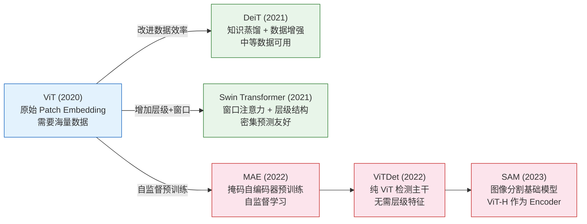
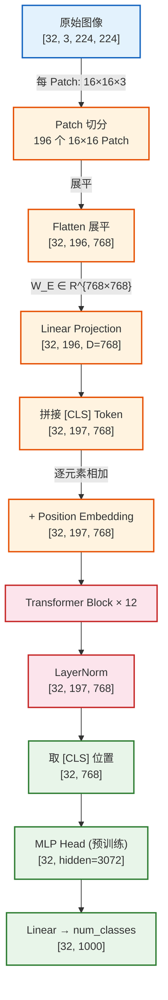
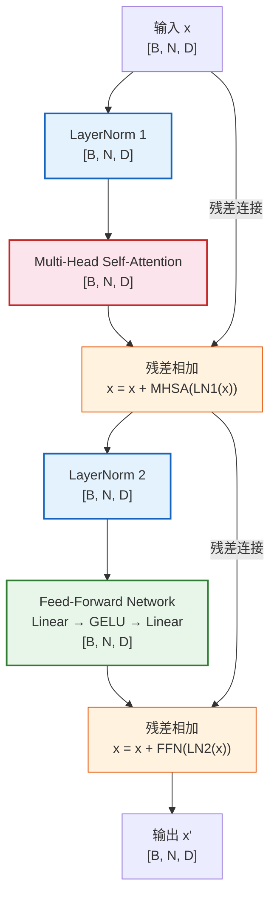
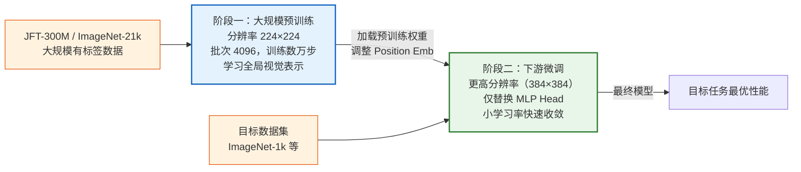
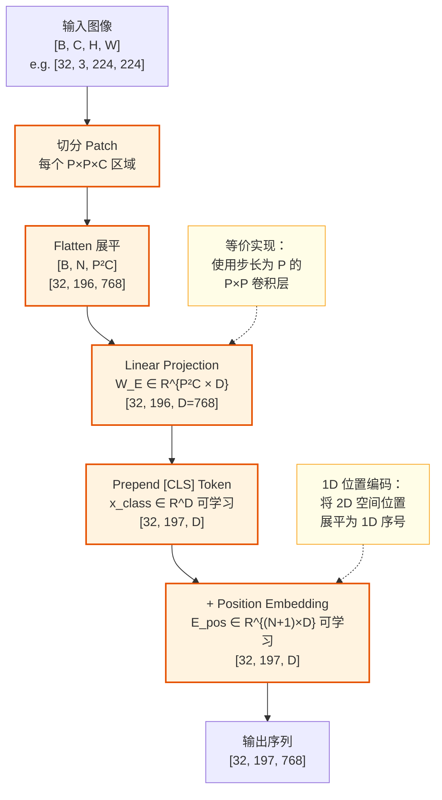
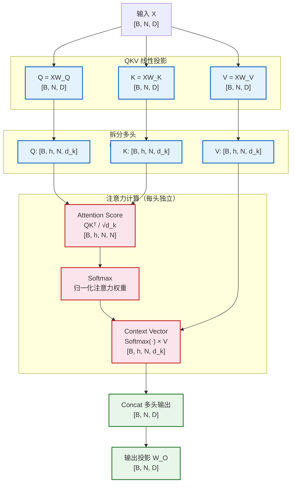

# Vision Transformer (ViT) 深度解析

> **论文**：[An Image is Worth 16x16 Words: Transformers for Image Recognition at Scale](https://arxiv.org/abs/2010.11929)
> **作者**：Alexey Dosovitskiy et al.（Google Brain）
> **发布时间**：2020 年 10 月
> **适用读者**：深度学习工程师、CV 研究者、对 Transformer 架构感兴趣的技术人员

---

## 目录

1. [模型架构概览](#一模型架构概览)
2. [模型架构详情](#二模型架构详情)
3. [关键组件架构：深度拆解](#三关键组件架构深度拆解)
4. [面试常见问题 FAQ](#四面试常见问题-faq)

---

## 一、模型架构概览

### 1.1 模型定位

**解决的问题**：将纯 Transformer 架构应用于图像分类任务，打破 CNN 在视觉领域的统治地位。

**研究领域**：计算机视觉（Computer Vision）× 自注意力机制（Self-Attention）

**核心价值**：
- 证明了 Transformer 无需依赖 CNN 归纳偏置（平移等变性、局部性），在**足够大的数据集**上预训练后可以超越 CNN
- 开创了视觉大模型的预训练范式，是后续 CLIP、MAE、Swin Transformer 等工作的基石

**典型应用场景**：
- 大规模图像分类（ImageNet、JFT-300M）
- 迁移学习下游任务（目标检测、语义分割）
- 多模态预训练（与语言模型联合训练）

**与代表性模型对比**：

| 模型 | 核心特征 | 归纳偏置 | 数据需求 |
|------|----------|----------|----------|
| ResNet | 局部卷积 + 残差连接 | 强（平移等变） | 中等 |
| EfficientNet | 复合缩放卷积 | 强 | 中等 |
| **ViT** | 纯 Transformer + Patch Embedding | **弱** | **大（需海量数据）** |
| Swin Transformer | 窗口自注意力（改进 ViT） | 中 | 中等 |

---

### 1.2 核心思想与创新点

**最关键的设计思路**：

> "把图像当成一段文字序列来处理"

具体做法：
1. 将输入图像切分为固定大小的 **Patch（图像块）**，每个 Patch 展平后经线性投影映射为一个 Token Embedding
2. 在序列开头拼接一个可学习的 `[CLS]` Token
3. 加入可学习的位置编码（Position Embedding）
4. 将 Token 序列送入标准的 Transformer Encoder，完全复用 NLP 中的架构
5. 取 `[CLS]` Token 的最终输出接分类头

**解决的痛点**：
- CNN 的感受野随层数增长，**早期层无法捕获全局依赖**；ViT 从第一层起即可通过自注意力建立**任意两个 Patch 之间的关系**
- 证明了 CV 模型**不必依赖手工设计的归纳偏置**，用数据量换取更强的通用表示能力

---

### 1.3 整体架构概览

**学习范式**：有监督学习（预训练 + 微调）

**输入**：图像张量 `[B, C, H, W]`，如 `[32, 3, 224, 224]`

**输出**：类别 Logits `[B, num_classes]`，如 `[32, 1000]`

```mermaid
flowchart LR
    classDef inputStyle fill:#e3f2fd,stroke:#1565c0,stroke-width:2px
    classDef embStyle fill:#fff3e0,stroke:#e65100,stroke-width:2px
    classDef encStyle fill:#fce4ec,stroke:#c62828,stroke-width:2px
    classDef headStyle fill:#e8f5e9,stroke:#2e7d32,stroke-width:2px
    classDef noteStyle fill:#fffde7,stroke:#f9a825,stroke-width:1px

    subgraph Input["① 输入阶段"]
        A["原始图像<br/>[B, 3, 224, 224]"]:::inputStyle
    end

    subgraph Embedding["② Patch Embedding 阶段"]
        B["图像分块<br/>16×16 Patches → N=196 个 Token"]:::embStyle
        C["线性投影<br/>[B, 196, D]"]:::embStyle
        D["拼接 [CLS] Token<br/>[B, 197, D]"]:::embStyle
        E["加入 Position Embedding<br/>[B, 197, D]"]:::embStyle
    end

    subgraph Encoder["③ Transformer Encoder × L 层"]
        F["Multi-Head Self-Attention<br/>多头自注意力"]:::encStyle
        G["Add & LayerNorm"]:::encStyle
        H["Feed-Forward Network (MLP)<br/>前馈神经网络"]:::encStyle
        I["Add & LayerNorm"]:::encStyle
    end

    subgraph Head["④ 分类头"]
        J["提取 [CLS] Token<br/>[B, D]"]:::headStyle
        K["MLP Head → Softmax<br/>[B, num_classes]"]:::headStyle
    end

    A -->|"切成 N 个 Patch"| B
    B -->|"Flatten + Linear"| C
    C --> D
    D --> E
    E --> F
    F --> G
    G --> H
    H --> I
    I -->|"重复 L 次"| F
    I --> J
    J --> K

    Note["设计要点：<br/>1. Patch 切分替代卷积特征提取<br/>2. [CLS] Token 汇聚全局信息<br/>3. 可学习位置编码保留空间关系"]:::noteStyle
    Note -.-> Encoder
```



---

### 1.4 输入输出示例

**具体示例**（ImageNet 图像分类）：

- **输入**：一张 `224×224` 的 RGB 狗狗图片，归一化后形状为 `[1, 3, 224, 224]`
- **处理过程**：
  - 切成 `14×14 = 196` 个 `16×16` 的 Patch
  - 每个 Patch 展平为 `768` 维向量（`16×16×3 = 768`）
  - 拼接 `[CLS]` Token → 序列长度 `197`
  - 经 12 层 Transformer Encoder 处理
  - 取 `[CLS]` 位置输出，过线性层
- **输出**：`[1, 1000]` 的 Logits，经 Softmax 后最高分对应"Golden Retriever"类别，置信度 0.92

---

### 1.5 关键模块一览

| 模块 | 职责 | 输入 → 输出 |
|------|------|------------|
| **Patch Embedding** | 将图像离散化为 Token 序列 | `[B,C,H,W]` → `[B,N,D]` |
| **Position Embedding** | 注入空间位置信息 | `[B,N,D]` → `[B,N,D]`（相加） |
| **Multi-Head Self-Attention** | 建模 Patch 间全局依赖 | `[B,N,D]` → `[B,N,D]` |
| **Feed-Forward Network** | 逐 Token 非线性变换 | `[B,N,D]` → `[B,N,D]` |
| **LayerNorm** | 稳定训练，加速收敛 | `[B,N,D]` → `[B,N,D]` |
| **MLP Head** | 将 `[CLS]` 映射为类别分数 | `[B,D]` → `[B,num_classes]` |

---

### 1.6 性能表现概览

| 模型 | 预训练数据 | ImageNet Top-1 | 参数量 |
|------|-----------|---------------|--------|
| ViT-B/16 | ImageNet-21k | 81.8% | 86M |
| ViT-L/16 | ImageNet-21k | 82.6% | 307M |
| ViT-H/14 | JFT-300M | **88.55%** | 632M |
| ResNet-152 | ImageNet-1k | 78.3% | 60M |
| EfficientNet-B7 | ImageNet-1k | 84.3% | 66M |

> 关键结论：ViT 在大数据预训练下（JFT-300M）超越了同期所有 CNN，但在仅 ImageNet 训练时弱于 EfficientNet，印证了其"数据饥渴型"特点。

---

### 1.7 模型家族与演进脉络



---

## 二、模型架构详情

### 2.1 数据集构成与数据示例

**主要训练数据集**：

| 数据集 | 规模 | 类别数 | 用途 |
|--------|------|--------|------|
| ImageNet-1k (ILSVRC) | 约 128 万张 | 1,000 | 小规模训练/微调基准 |
| ImageNet-21k | 约 1,400 万张 | 21,841 | 中规模预训练 |
| JFT-300M | 约 3 亿张（Google 内部） | 29,593 | 超大规模预训练 |

**数据集划分**（以 ImageNet-1k 为例）：

- 训练集：1,281,167 张（约 128 万）
- 验证集：50,000 张（5 万，用于标准评估）
- 测试集：100,000 张（无公开标签）

**典型训练样本示例**：

```
输入图像：一张 JPEG 格式的狗狗照片（原始尺寸 500×375）
标签：类别索引 207（"golden retriever"）

数据流经模型的形态变化：
┌─────────────────────────────────────────────────────────────┐
│ 阶段 0：原始图像   [500, 375, 3]  JPEG，值域 [0, 255]       │
│ 阶段 1：Resize     [256, 256, 3]  双线性插值               │
│ 阶段 2：RandomCrop [224, 224, 3]  随机裁剪                 │
│ 阶段 3：归一化     [224, 224, 3]  均值/方差标准化           │
│ 阶段 4：组 Batch   [32, 3, 224, 224]  打包为批次           │
│ 阶段 5：Patch 分块 [32, 196, 768]  展平后的 Patch 序列     │
│ 阶段 6：加 CLS+PE  [32, 197, 768]  含位置信息的完整序列    │
│ 阶段 7：Encoder 输出[32, 197, 768]  上下文化表示           │
│ 阶段 8：取 CLS     [32, 768]       全局图像表示             │
│ 阶段 9：分类输出   [32, 1000]      类别 Logits             │
└─────────────────────────────────────────────────────────────┘
```

---

### 2.2 数据处理与输入规范

**预处理流程（训练阶段）**：

```python
transform_train = transforms.Compose([
    transforms.Resize(256),                        # 短边 resize 到 256
    transforms.RandomCrop(224),                    # 随机裁剪 224×224
    transforms.RandomHorizontalFlip(p=0.5),        # 随机水平翻转
    transforms.ColorJitter(0.4, 0.4, 0.4),        # 颜色抖动（DeiT 增强）
    transforms.ToTensor(),                          # [0,255] → [0,1]
    transforms.Normalize(
        mean=[0.485, 0.456, 0.406],                # ImageNet 均值
        std=[0.229, 0.224, 0.225]                  # ImageNet 标准差
    ),
])
```

**预处理流程（推理阶段）**：

```python
transform_val = transforms.Compose([
    transforms.Resize(256),
    transforms.CenterCrop(224),                    # 中心裁剪，保证可复现
    transforms.ToTensor(),
    transforms.Normalize(mean=[...], std=[...]),
])
```

**Patch 切分规则**：

- 输入图像：`H × W × C = 224 × 224 × 3`
- Patch 尺寸：`P × P = 16 × 16`
- Patch 数量：`N = (H/P) × (W/P) = 14 × 14 = 196`
- 每个 Patch 展平维度：`P² × C = 16² × 3 = 768`
- 经线性投影后的嵌入维度：`D`（ViT-B 为 768，ViT-L 为 1024，ViT-H 为 1280）

---

### 2.3 架构全景与数据流

**完整维度变换路径（以 ViT-B/16 为例，Batch=32）**：



**各 ViT 规格对比**：

| 规格 | 层数 L | 隐藏维度 D | MLP 维度 | 注意力头数 | 参数量 |
|------|--------|-----------|---------|-----------|--------|
| ViT-B/16 | 12 | 768 | 3072 | 12 | 86M |
| ViT-L/16 | 24 | 1024 | 4096 | 16 | 307M |
| ViT-H/14 | 32 | 1280 | 5120 | 16 | 632M |

---

### 2.4 核心模块深入分析

#### Transformer Encoder Block 内部结构

每个 Encoder Block 包含两个子层，均采用 **Pre-LayerNorm** 形式（与原始 Transformer 的 Post-LN 不同）：



---

### 2.5 维度变换路径

**完整维度变换表**：

| 步骤 | 操作 | 输入维度 | 输出维度 | 说明 |
|------|------|---------|---------|------|
| 1 | 图像输入 | `[B,3,224,224]` | `[B,3,224,224]` | 原始 RGB 图像 |
| 2 | Patch 切分 | `[B,3,224,224]` | `[B,196,768]` | 196个Patch，每个展平为768 |
| 3 | Linear Projection | `[B,196,768]` | `[B,196,D]` | 映射到嵌入维度 D |
| 4 | 拼接 CLS Token | `[B,196,D]` | `[B,197,D]` | 序列头部插入CLS |
| 5 | 加 Position Emb | `[B,197,D]` | `[B,197,D]` | 逐元素相加 |
| 6 | QKV 投影（每头） | `[B,197,D]` | `[B,h,197,d_k]` | `d_k=D/h`，多头拆分 |
| 7 | 注意力计算 | `[B,h,197,d_k]` | `[B,h,197,d_k]` | Softmax(QKᵀ/√d_k)V |
| 8 | 多头拼接 | `[B,h,197,d_k]` | `[B,197,D]` | 还原嵌入维度 |
| 9 | FFN 扩展 | `[B,197,D]` | `[B,197,4D]` | 第一个线性层扩展4倍 |
| 10 | FFN 压缩 | `[B,197,4D]` | `[B,197,D]` | 第二个线性层还原 |
| 11 | 重复 L 次 | `[B,197,D]` | `[B,197,D]` | L=12/24/32 层 |
| 12 | 取 CLS Token | `[B,197,D]` | `[B,D]` | 提取分类表示 |
| 13 | MLP Head | `[B,D]` | `[B,num_classes]` | 最终类别预测 |

---

### 2.6 数学表达与关键公式

#### Patch Embedding

$$
\mathbf{z}_0 = [\mathbf{x}_{\text{class}}; \mathbf{x}_p^1\mathbf{E}; \mathbf{x}_p^2\mathbf{E}; \cdots; \mathbf{x}_p^N\mathbf{E}] + \mathbf{E}_{pos}
$$

其中：
- $\mathbf{x}_p^i \in \mathbb{R}^{P^2 \cdot C}$：第 $i$ 个展平后的 Patch
- $\mathbf{E} \in \mathbb{R}^{P^2 C \times D}$：可学习的线性投影矩阵
- $\mathbf{E}_{pos} \in \mathbb{R}^{(N+1) \times D}$：可学习的位置编码
- $\mathbf{x}_{\text{class}}$：可学习的 `[CLS]` Token

#### Multi-Head Self-Attention（MHSA）

**单头注意力**：

$$
\text{Attention}(\mathbf{Q}, \mathbf{K}, \mathbf{V}) = \text{Softmax}\left(\frac{\mathbf{Q}\mathbf{K}^T}{\sqrt{d_k}}\right)\mathbf{V}
$$

**多头注意力**：

$$
\text{MHSA}(\mathbf{x}) = \text{Concat}(\text{head}_1, \cdots, \text{head}_h)\mathbf{W}^O
$$

$$
\text{head}_i = \text{Attention}(\mathbf{x}\mathbf{W}_i^Q, \mathbf{x}\mathbf{W}_i^K, \mathbf{x}\mathbf{W}_i^V)
$$

其中：
- $\mathbf{W}_i^Q, \mathbf{W}_i^K, \mathbf{W}_i^V \in \mathbb{R}^{D \times d_k}$，$d_k = D/h$
- $\mathbf{W}^O \in \mathbb{R}^{D \times D}$

#### Transformer Encoder Block

$$
\mathbf{z}'_l = \text{MHSA}(\text{LN}(\mathbf{z}_{l-1})) + \mathbf{z}_{l-1}
$$

$$
\mathbf{z}_l = \text{MLP}(\text{LN}(\mathbf{z}'_l)) + \mathbf{z}'_l
$$

#### FFN（MLP 层）

$$
\text{FFN}(\mathbf{x}) = \text{GELU}(\mathbf{x}\mathbf{W}_1 + \mathbf{b}_1)\mathbf{W}_2 + \mathbf{b}_2
$$

其中 $\mathbf{W}_1 \in \mathbb{R}^{D \times 4D}$，$\mathbf{W}_2 \in \mathbb{R}^{4D \times D}$

#### 最终分类

$$
\hat{y} = \text{LN}(\mathbf{z}_L^0) \cdot \mathbf{W}_{\text{head}}
$$

其中 $\mathbf{z}_L^0$ 为第 $L$ 层 `[CLS]` Token 的输出

---

### 2.7 损失函数与优化策略

**损失函数**：标准交叉熵（Cross-Entropy Loss）

$$
\mathcal{L} = -\sum_{c=1}^{C} y_c \log \hat{p}_c
$$

**优化器与学习率调度（ViT 原始设置）**：

| 超参数 | 预训练 | 微调 |
|--------|--------|------|
| 优化器 | Adam (β₁=0.9, β₂=0.999) | SGD / Adam |
| 学习率 | 1e-3（Base），3e-4（Large） | 1e-5 ~ 1e-3（视任务） |
| Weight Decay | 0.1 | 0.0 |
| 学习率调度 | Linear Warmup + Cosine Decay | Cosine Decay |
| Batch Size | 4096（分布式） | 512 |
| Dropout | 0.1 | 0.0 |

---

### 2.8 训练流程与策略

**两阶段训练流程**：



**关键训练技巧**：

1. **分辨率变化处理**：微调时分辨率从 224 升至 384，此时 Patch 数从 196 增至 576，需对预训练位置编码进行 **2D 双线性插值**
2. **预训练 MLP Head vs 微调 Linear Head**：预训练时用两层 MLP Head，微调时替换为单层线性层
3. **Label Smoothing**：训练时对标签进行平滑，防止过拟合（ε=0.1）
4. **Mixup / RandAugment**（DeiT 改进版）：大幅提升数据效率，使中等数据集上也能取得好结果

**训练基础设施**（ViT-H 原始论文）：
- TPUv3-core × 核心数：ViT-L 约用 64 核训练约 7 天
- JFT-300M 数据集预处理：分布式数据管道

---

### 2.9 推理与预测流程

**完整推理流程**：

```
原始图像（任意尺寸）
    ↓ Resize + CenterCrop → [224, 224, 3]
    ↓ 归一化 → float32
    ↓ 添加 Batch 维度 → [1, 3, 224, 224]
    ↓ Patch Embedding → [1, 197, 768]
    ↓ Transformer Encoder × 12 → [1, 197, 768]
    ↓ 取 [CLS] Token → [1, 768]
    ↓ LayerNorm → [1, 768]
    ↓ Linear Head → [1, 1000]
    ↓ Softmax → 概率分布
    ↓ ArgMax → 类别索引 207
    ↓ 映射到类别名 → "golden retriever"（置信度 92.3%）
```

**推理阶段与训练阶段的差异**：

| 方面 | 训练阶段 | 推理阶段 |
|------|---------|---------|
| Dropout | 开启（p=0.1） | 关闭（`model.eval()`） |
| 数据增强 | RandomCrop, Flip... | CenterCrop 只 |
| 批归一化 | 不使用（用 LN） | 不适用 |
| 梯度计算 | 开启 | `torch.no_grad()` 关闭 |

**部署优化手段**：

- **ONNX 导出**：`torch.onnx.export()` → TensorRT 加速，推理速度提升 2-3×
- **INT8 量化**：权重从 FP32 量化为 INT8，内存减少 75%，速度提升约 2×（精度下降 <1%）
- **Flash Attention**：重写注意力计算核，内存复杂度从 O(N²) 降至 O(N)，支持更长序列

---

### 2.10 评估指标与实验分析

**评估指标**：

| 指标 | 含义 | 为何选用 |
|------|------|---------|
| Top-1 Accuracy | 最高概率预测正确率 | 最直观的分类精度 |
| Top-5 Accuracy | 前五预测包含正确类别 | 评估模型不确定性 |
| Throughput (img/s) | 每秒处理图像数 | 衡量实际部署效率 |
| FLOPs | 浮点运算次数 | 理论计算量指标 |

**ImageNet 上详细对比**：

| 模型 | Top-1 Acc | 参数量 | FLOPs | 预训练数据 |
|------|-----------|--------|-------|-----------|
| ResNet-50 | 76.1% | 25M | 4.1G | ImageNet-1k |
| ResNet-152 | 78.3% | 60M | 11.5G | ImageNet-1k |
| EfficientNet-B7 | 84.3% | 66M | 37G | ImageNet-1k |
| ViT-B/16 | 77.9% | 86M | 17.5G | ImageNet-1k（从零）|
| ViT-B/16 | 81.8% | 86M | 17.5G | ImageNet-21k |
| ViT-L/16 | 82.6% | 307M | 61.6G | ImageNet-21k |
| ViT-H/14 | **88.55%** | 632M | 167G | JFT-300M |

**关键消融实验结论**：

| 消融项 | 结论 |
|--------|------|
| Patch 大小（16 vs 32） | 16×16 更细粒度，精度更高，但计算量更大 |
| 位置编码方式（1D vs 2D vs 相对） | 1D 可学习编码已足够，2D 提升微小 |
| `[CLS]` vs 全局平均池化 | 两者性能相近，`[CLS]` 更符合 NLP 习惯 |
| 预训练数据量（1k vs 21k vs 300M） | 数据量越大，ViT 提升越显著 |
| Hybrid（CNN+ViT） | 在小数据上优于纯 ViT，大数据时差距消失 |

**注意力可视化**：ViT 的注意力图可通过 Attention Rollout 方法可视化，低层注意力局部，高层注意力全局，能自然聚焦到目标物体区域。

---

### 2.11 设计亮点与思考

**值得学习的设计思路**：

1. **极简主义**：完全复用 NLP 的 Transformer 架构，几乎无图像专用设计，体现了架构通用性
2. **Pre-LayerNorm**：相比 Post-LN，训练更稳定，梯度流动更顺畅
3. **可学习位置编码**：比正弦位置编码更灵活，通过学习自动适应图像空间结构
4. **[CLS] Token 汇聚全局信息**：优雅地将分类任务统一为对特殊 Token 的线性变换

**设计中的权衡与取舍**：

| 权衡点 | ViT 的选择 | 代价 |
|--------|-----------|------|
| 归纳偏置 | 弱（无局部性假设） | 需要大量数据补偿 |
| 序列长度 | N=196（固定分辨率） | 高分辨率时计算量 O(N²) 急剧增加 |
| 位置编码 | 1D 可学习 | 对图像 2D 结构的建模不如 2D PE |
| 预训练代价 | 极高（JFT-300M） | 社区难以复现原始结果 |

**已知局限性**：

1. **数据饥渴**：在 ImageNet-1k 上从零训练远逊于 ResNet，必须依赖大规模预训练
2. **计算复杂度**：注意力的 O(N²) 复杂度限制了处理高分辨率图像的能力
3. **密集预测困难**：无层级特征图，直接用于检测/分割需要额外设计（如 FPN 替代）
4. **位置编码插值**：分辨率变化时需插值位置编码，存在一定性能损失

---

## 三、关键组件架构：深度拆解

### 3.1 组件一：Patch Embedding

#### 定位与职责

Patch Embedding 是 ViT 的**输入接口层**，负责将二维图像转换为 Transformer 可处理的一维 Token 序列。它解决了图像与 Transformer 之间的**模态对齐**问题。

**为什么需要它**：
- Transformer 处理序列数据，图像是二维网格数据
- 需要一种方式将空间信息"打包"为向量，同时保持语义完整性
- 相比逐像素处理（序列太长）和全局压缩（信息损失），Patch 切分是最优折中

#### 内部结构



#### 计算细节

```python
class PatchEmbedding(nn.Module):
    def __init__(self, img_size=224, patch_size=16, in_chans=3, embed_dim=768):
        super().__init__()
        num_patches = (img_size // patch_size) ** 2
        # 等价于展平后做线性变换，用卷积实现更高效
        self.proj = nn.Conv2d(in_chans, embed_dim,
                              kernel_size=patch_size, stride=patch_size)
        self.cls_token = nn.Parameter(torch.zeros(1, 1, embed_dim))
        self.pos_embed = nn.Parameter(torch.zeros(1, num_patches + 1, embed_dim))

    def forward(self, x):
        B, C, H, W = x.shape
        # [B, C, H, W] → [B, D, H/P, W/P] → [B, D, N] → [B, N, D]
        x = self.proj(x).flatten(2).transpose(1, 2)
        # 扩展 CLS token 到 Batch 维度并拼接
        cls = self.cls_token.expand(B, -1, -1)
        x = torch.cat([cls, x], dim=1)        # [B, N+1, D]
        x = x + self.pos_embed                 # 位置编码逐元素相加
        return x
```

**设计细节**：
- `Conv2d(kernel=P, stride=P)` 与 `Flatten + Linear` **数学完全等价**，但前者利用 GPU 并行更高效
- 位置编码初始化为全零，训练过程中学习到类似 2D 正弦编码的空间规律

---

### 3.2 组件二：Multi-Head Self-Attention (MHSA)

#### 定位与职责

MHSA 是 ViT 的**核心计算单元**，实现 Patch 间的全局依赖建模。每个 Patch Token 都能直接"看到"序列中的所有其他 Patch，这是 ViT 相比 CNN 最本质的差异。

#### 内部结构与计算流程



#### 关键实现代码

```python
class MultiHeadSelfAttention(nn.Module):
    def __init__(self, dim, num_heads=12, dropout=0.0):
        super().__init__()
        self.num_heads = num_heads
        self.d_k = dim // num_heads
        self.scale = self.d_k ** -0.5

        self.qkv = nn.Linear(dim, dim * 3)    # 合并 Q/K/V 投影，高效
        self.proj = nn.Linear(dim, dim)        # 输出投影 W_O
        self.attn_drop = nn.Dropout(dropout)

    def forward(self, x):
        B, N, D = x.shape
        # [B, N, 3D] → [B, N, 3, h, d_k] → [3, B, h, N, d_k]
        qkv = self.qkv(x).reshape(B, N, 3, self.num_heads, self.d_k)
        qkv = qkv.permute(2, 0, 3, 1, 4)
        q, k, v = qkv.unbind(0)               # 各 [B, h, N, d_k]

        # 注意力分数：[B, h, N, N]
        attn = (q @ k.transpose(-2, -1)) * self.scale
        attn = attn.softmax(dim=-1)
        attn = self.attn_drop(attn)

        # 上下文向量：[B, h, N, d_k] → [B, N, D]
        x = (attn @ v).transpose(1, 2).reshape(B, N, D)
        return self.proj(x)
```

**实现细节注意事项**：
- **数值稳定性**：除以 `√d_k` 防止点积值过大导致 Softmax 梯度消失
- **合并 QKV 投影**：一次 `Linear(D, 3D)` 比三次独立投影减少内存带宽开销
- **attn_drop 在 Softmax 之后**：随机屏蔽注意力权重，是 ViT 中的正则化手段

---

### 3.3 组件三：Position Embedding

#### 定位与职责

由于 Self-Attention 本身是**排列不变的（permutation invariant）**，没有位置编码时模型无法区分 Patch 的空间顺序。Position Embedding 为每个 Token 注入位置信息，是 ViT 感知图像空间结构的关键。

#### 可学习 1D 位置编码 vs 其他方案对比

| 方案 | 实现方式 | 优势 | 劣势 |
|------|---------|------|------|
| **可学习 1D（ViT 选用）** | `nn.Parameter([N+1, D])` | 灵活，自动学习 | 分辨率变化需插值 |
| 固定正弦/余弦 | 公式计算 | 无需学习，可外推 | 2D 空间建模弱 |
| 可学习 2D | 行+列编码相加 | 更显式的空间感知 | 实验提升有限 |
| 相对位置编码（如 Swin） | 可学习偏置矩阵 | 更强的位置泛化 | 实现复杂 |

#### 分辨率变化时的插值处理

```python
def interpolate_pos_embed(model, new_img_size):
    """微调时从 224 升至 384 的位置编码插值"""
    pos_embed = model.pos_embed  # [1, 197, D]，其中 196=14×14

    # 分离 CLS token 和图像 patch 位置编码
    cls_pos = pos_embed[:, :1, :]           # [1, 1, D]
    patch_pos = pos_embed[:, 1:, :]         # [1, 196, D]

    # 从 14×14 插值到 24×24（384/16=24）
    patch_pos = patch_pos.reshape(1, 14, 14, -1).permute(0, 3, 1, 2)
    patch_pos = F.interpolate(patch_pos, size=(24, 24),
                              mode='bicubic', align_corners=False)
    patch_pos = patch_pos.permute(0, 2, 3, 1).reshape(1, 576, -1)

    return torch.cat([cls_pos, patch_pos], dim=1)  # [1, 577, D]
```

#### 位置编码的可视化规律

训练收敛后，可学习位置编码会自然学习到以下规律：
- **空间相邻的 Patch** 其位置编码余弦相似度更高
- **同行或同列的 Patch** 呈现出周期性模式
- 整体上近似于 2D 正弦编码，但通过数据自动学习而来

---

## 四、面试常见问题 FAQ

### 基础概念类

---

**Q1：ViT 与 CNN 相比有什么本质区别？各自适用什么场景？**

**A：**

| 维度 | CNN | ViT |
|------|-----|-----|
| 感受野 | 局部 → 逐层扩大 | 全局（从第一层） |
| 归纳偏置 | 平移等变性、局部性 | 几乎无 |
| 数据需求 | 中等（ImageNet-1k 即可） | 大（建议 21k+ 预训练） |
| 计算复杂度 | O(N) 线性（像素数） | O(N²)（Patch 数） |
| 迁移能力 | 较强 | 大数据预训练后更强 |

**适用场景**：
- 数据有限、计算资源受限 → CNN（ResNet、EfficientNet）
- 有大规模预训练权重、追求最优精度 → ViT（ViT-L、Swin）
- 工业落地、端侧部署 → MobileNet、EfficientNet-Lite

---

**Q2：ViT 中的 `[CLS]` Token 是什么，为什么要用它？**

**A：**

`[CLS]`（Classification Token）是一个可学习的向量，拼接在 Patch Token 序列的开头。由于 Self-Attention 的全局建模特性，经过多层 Transformer 后，`[CLS]` Token 会汇聚来自所有 Patch 的信息，其最终输出被用作整张图像的全局表示，接分类头输出类别预测。

**为何选 `[CLS]` 而非全局平均池化（GAP）？**
- 消融实验表明两者精度相近
- `[CLS]` 更符合 BERT 的设计习惯，便于多任务统一
- GAP 会将所有 Token 平等对待，而 `[CLS]` 可通过注意力机制选择性地关注重要区域

---

**Q3：为什么 ViT 在小数据集上表现不如 CNN？**

**A：**

核心原因是**归纳偏置的缺失**。CNN 内置了平移等变性和局部感受野，这些先验知识在小数据场景下本质上等同于"免费的数据增强"——即使训练数据有限，CNN 也能泛化出良好的特征。

ViT 没有这些先验，必须从数据中从零学习空间关系，因此在 ImageNet-1k（128万）级别的数据上，ViT-B 的精度低于同等规模的 EfficientNet。当预训练数据扩展到 ImageNet-21k（1400万）或 JFT-300M（3亿）时，ViT 才能充分发挥其**无约束的全局建模能力**，超越 CNN。

---

**Q4：ViT 的位置编码为什么选 1D 而不是 2D？**

**A：**

论文中对比了四种位置编码方案（无 PE、1D 可学习、2D 可学习、相对位置编码），结论是**性能差异微小**，1D 可学习编码与 2D 可学习编码的精度差距不超过 0.1%。

原因分析：
- Transformer 中的 Attention 本身已经能通过 QK 内积隐式学习到 Patch 之间的相对位置关系
- 1D 位置编码在学习后会自然形成近似 2D 的空间规律（通过可视化验证）
- 选 1D 更简洁，也更便于处理可变分辨率（1D 插值比 2D 更简单直接）

---

**Q5：ViT 中的 Pre-LayerNorm 和 Post-LayerNorm 有什么区别？为什么 ViT 选前者？**

**A：**

- **Post-LN**（原始 Transformer）：LN 在残差相加**之后**，即 `LN(x + Sublayer(x))`
- **Pre-LN**（ViT 采用）：LN 在子层**之前**，即 `x + Sublayer(LN(x))`

**Pre-LN 的优势**：
1. 梯度流动更稳定：残差通路上没有 LN，梯度可以直接从输出流向输入
2. 训练更稳定：更不容易出现梯度爆炸/消失，可以用更大的学习率
3. 深层网络更友好：Post-LN 在 12 层以上时往往需要 Warmup 才能稳定，Pre-LN 更鲁棒

**代价**：Pre-LN 在最后一层输出后需要额外加一个 LN（`self.norm(x[:, 0])`），而 Post-LN 最后一层自带归一化效果。

---

### 架构设计类

---

**Q6：如何计算 ViT-B/16 的注意力计算量（FLOPs）？**

**A：**

以 ViT-B/16（N=197，D=768，h=12，d_k=64）为例，**单层 MHSA 的 FLOPs**：

1. **QKV 投影**：3 × 2ND² = 3 × 2 × 197 × 768² ≈ 695M
2. **注意力分数 QKᵀ**：2N²D = 2 × 197² × 768 ≈ 59.7M
3. **加权求和 AV**：同上 ≈ 59.7M
4. **输出投影 W_O**：2ND² ≈ 232M
5. **FFN（扩展4倍）**：2 × 2N × D × 4D = 2 × 197 × 768 × 3072 ≈ 1858M

**单层总计**：约 2.9G FLOPs；**12层总计**：约 34.8G FLOPs（与论文报告的 17.5G 有出入，因论文可能使用不同计算约定）

---

**Q7：ViT 如何处理不同尺寸的输入图像？**

**A：**

ViT 本身的设计是固定 Patch 大小（如 16×16），但可以处理不同输入尺寸：

**方法一：Patch 数量变化 + 位置编码插值**（推荐）
- 不同尺寸图像产生不同数量的 Patch（如 224→196，384→576）
- 对预训练的 1D 位置编码进行 2D 双线性插值适配新的 Patch 数量
- 这是 ViT 微调时提升分辨率的标准做法，有轻微精度损失

**方法二：Padding + Masking**
- 对图像补零到最大尺寸，对多余 Patch 加 Mask 忽略
- 计算浪费，实际很少使用

**方法三：可变 Patch 大小**（研究方向）
- 如 FlexiViT 探索了在推理时动态调整 Patch 大小，通过 Patch Embedding 的 PI-resize 实现

---

**Q8：ViT 中的注意力可以并行计算吗？计算复杂度是多少？**

**A：**

**可以完全并行**：ViT 中每一层的计算不像 RNN 那样有时序依赖，所有 Token 同时计算注意力，因此：

- **时间复杂度**：O(N²D)，其中 N 为 Patch 数，D 为嵌入维度
- **空间复杂度**：O(N²)，注意力矩阵需要存储 N×N 的分数

**对高分辨率图像的影响**：
- 224×224，P=16：N=196，注意力矩阵 196×196 ≈ 38K 元素，可接受
- 512×512，P=16：N=1024，注意力矩阵 1024×1024 ≈ 1M 元素，显存压力大
- 1024×1024，P=16：N=4096，注意力矩阵 ≈ 16M 元素，普通 GPU 难以承载

**解决方案**：Flash Attention（IO-aware 算法）、Swin Transformer（窗口注意力）、Linformer（低秩近似）

---

**Q9：Hybrid ViT 是什么？它和纯 ViT 有什么区别？**

**A：**

**Hybrid ViT** 使用 CNN（如 ResNet 的前几个 Stage）提取特征图，再将特征图作为 Patch Embedding 的输入，而非直接从原始像素切 Patch。

```
原始图像 → CNN Backbone（提取到 feat_map） → 展平+线性投影 → Transformer Encoder
```

**与纯 ViT 对比**：

| 方面 | 纯 ViT | Hybrid ViT |
|------|--------|-----------|
| 数据需求 | 更高（无归纳偏置） | 更低（CNN 提供局部先验） |
| 小数据精度 | 较低 | 较高 |
| 大数据精度 | 持平或更高 | 持平 |
| 计算效率 | Patch 切分简单 | CNN 部分额外开销 |

**结论**：Hybrid ViT 是数据量不足时的折中方案；大规模数据下纯 ViT 更简洁且性能相当。

---

### 工程实践类

---

**Q10：在资源有限的情况下如何微调 ViT？**

**A：**

**策略一：Linear Probing（线性探测）**
- 冻结全部 Transformer 权重，只训练最后的分类头
- 适合：目标数据集极小（<1K 样本），快速验证特征质量
- 代价：精度较低

**策略二：Full Fine-tuning（全量微调）**
- 加载预训练权重，以小学习率（1e-5～1e-4）微调全部参数
- 适合：有足够算力，目标数据集中等规模（1K～100K）
- 建议：使用 Cosine LR Decay + Warmup，配合 Label Smoothing

**策略三：LoRA / Adapter（参数高效微调）**
- 在注意力层插入低秩分解矩阵，只训练约 0.5%～2% 的参数
- 适合：资源极其有限，多任务微调（一个基础模型 + 多个 LoRA）

**策略四：冻结前 N 层（Partial Fine-tuning）**
- 冻结底层（学习通用低级特征），只微调顶层（学习任务特定特征）
- 经验规则：通常微调后 1/3 的层即可取得与全量微调相近的效果

---

**Q11：ViT 的注意力头数、层数、隐藏维度应该如何选择？**

**A：**

ViT 遵循 Transformer **等比例缩放**的设计原则：

- **注意力头数 h = D / 64**（保证每头维度 d_k = 64）
  - ViT-B：D=768，h=12；ViT-L：D=1024，h=16；ViT-H：D=1280，h=16
- **FFN 维度 = 4D**（标准 Transformer 配置，提供非线性表达能力）
- **层数 L**：是最直接影响精度的因素（B=12，L=24，H=32）

**实践建议**：
- 先确定计算预算（FLOPs），再选最接近的标准规格
- 增加层数（深度）通常比增加宽度（D）更有效
- 对于下游任务微调，ViT-B/16 是性价比最高的起点

---

**Q12：如何判断 ViT 是否在过拟合？有什么解决方法？**

**A：**

**判断指标**：
- 训练 Loss 持续下降但验证 Loss 开始上升
- 训练精度远高于验证精度（差距 > 5%）
- 注意力权重过于集中（熵过低）

**常用解决方案**：

| 方法 | 作用 | 推荐场景 |
|------|------|---------|
| Dropout (p=0.1) | 随机丢弃神经元 | 通用 |
| Weight Decay (0.1) | L2 正则化 | 通用 |
| RandAugment | 随机数据增强 | 数据量不足 |
| Mixup / CutMix | 混合训练样本 | 分类任务 |
| Label Smoothing (ε=0.1) | 软化标签 | 通用 |
| 降低学习率 | 减缓拟合速度 | 训练后期 |
| 使用更小的模型 | 减少参数量 | 数据量极少时 |

---

**Q13：ViT 和 BERT 有什么相似之处？它们的预训练方式有何不同？**

**A：**

**相似之处**：
- 都使用 Transformer Encoder 作为核心架构
- 都有 `[CLS]` Token 用于下游任务
- 都采用"大规模预训练 + 下游微调"的范式

**预训练方式的根本差异**：

| 方面 | BERT | ViT（原始） |
|------|------|------------|
| 预训练目标 | **自监督**（Masked LM + NSP） | **有监督**（大规模分类标签） |
| 数据需求 | 无标签文本（海量） | 有标签图像（JFT-300M） |
| 代价 | 低（无需人工标注） | 高（需要大规模标注数据） |

**ViT 的自监督发展**：
- **MAE（2022）**：类比 BERT 的 Mask 机制，随机 Mask 75% 的 Patch，用 Decoder 重建像素，实现 ViT 的自监督预训练，效果超越有监督预训练的 ViT
- **DINO（2021）**：基于知识蒸馏的自监督，Teacher-Student 框架，ViT 的注意力图能精确定位目标边界

---

**Q14：ViT 在目标检测和语义分割任务中如何应用？有什么挑战？**

**A：**

**核心挑战**：ViT 是**无层级（isotropic）架构**，所有层输出相同分辨率的特征图（1/16 分辨率），而检测/分割通常需要**多尺度特征图**（如 FPN 所需的 1/4、1/8、1/16、1/32）。

**应用方案**：

**方案一：直接接检测头（ViTDet）**
- 保持 ViT 纯 Encoder 结构，最后一层特征图接简单的 RPN + RCNN
- 只在最后 4 层使用局部窗口注意力降低计算量
- 性能接近 Swin，但结构更简洁

**方案二：引入层级特征（Swin Transformer）**
- 修改 ViT 引入 Patch Merging 操作，构建 1/4、1/8、1/16、1/32 多尺度特征
- 与 FPN 完美契合，成为检测/分割主流 Backbone

**方案三：特征图重组（BEIT 系列）**
- 将 ViT 各层特征上采样/下采样后拼接，人工构建多尺度金字塔

**实践推荐**：
- 通用目标检测/分割 → **Swin Transformer**（工程友好，COCO SOTA）
- 追求纯粹架构统一 → **ViTDet / SAM**（Facebook Research 路线）

---

**Q15：ViT 论文中的"hybrid"实验结论是什么？对我们选型有什么启示？**

**A：**

**论文结论**：在中等规模数据（ImageNet-21k）上，Hybrid ViT（ResNet+ViT）比纯 ViT 精度略高；在超大规模数据（JFT-300M）上，两者差距几乎消失，纯 ViT 的结果甚至略优。

**选型启示**：

```
数据量决定架构选择：

数据量 < 10M  →  CNN 或 Hybrid ViT（CNN 的归纳偏置有优势）
数据量 10M~100M → Hybrid ViT 或 Swin（平衡精度与数据效率）
数据量 > 100M  →  纯 ViT（发挥全局建模的最大潜力）
```

**2026 年的实践现状**：随着 MAE、DINO 等自监督预训练方法的普及，纯 ViT 的数据需求已大幅降低——即使在 ImageNet-1k 上用 MAE 预训练的 ViT-L，也能超越在 JFT-300M 上有监督训练的 ViT-B。**数据效率问题已基本解决**，纯 ViT 正成为视觉领域的主流基础架构。

---

> **参考文献**：
> 1. Dosovitskiy et al., "An Image is Worth 16x16 Words: Transformers for Image Recognition at Scale", ICLR 2021
> 2. Touvron et al., "Training data-efficient image transformers & distillation through attention", ICML 2021 (DeiT)
> 3. Liu et al., "Swin Transformer: Hierarchical Vision Transformer using Shifted Windows", ICCV 2021
> 4. He et al., "Masked Autoencoders Are Scalable Vision Learners", CVPR 2022 (MAE)
> 5. Caron et al., "Emerging Properties in Self-Supervised Vision Transformers", ICCV 2021 (DINO)
> 6. Li et al., "Exploring Plain Vision Transformer Backbones for Object Detection", ECCV 2022 (ViTDet)
