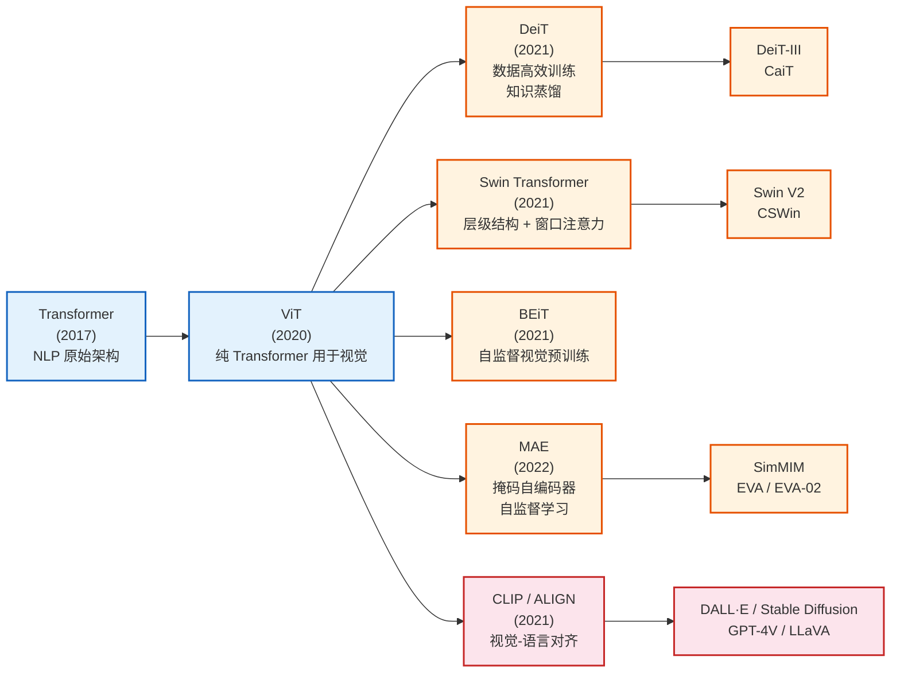
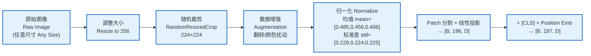
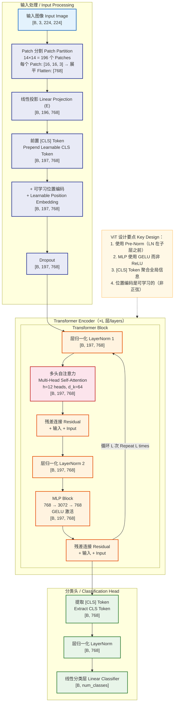
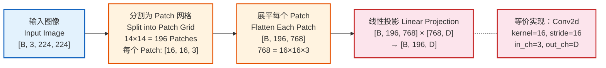
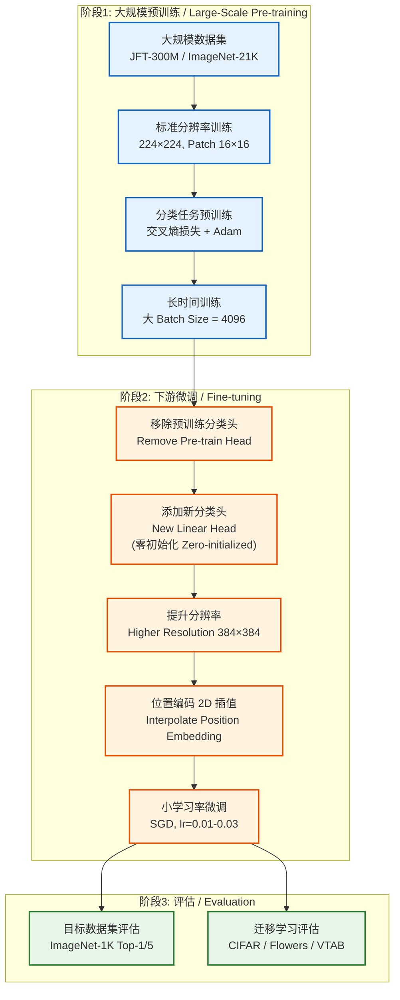
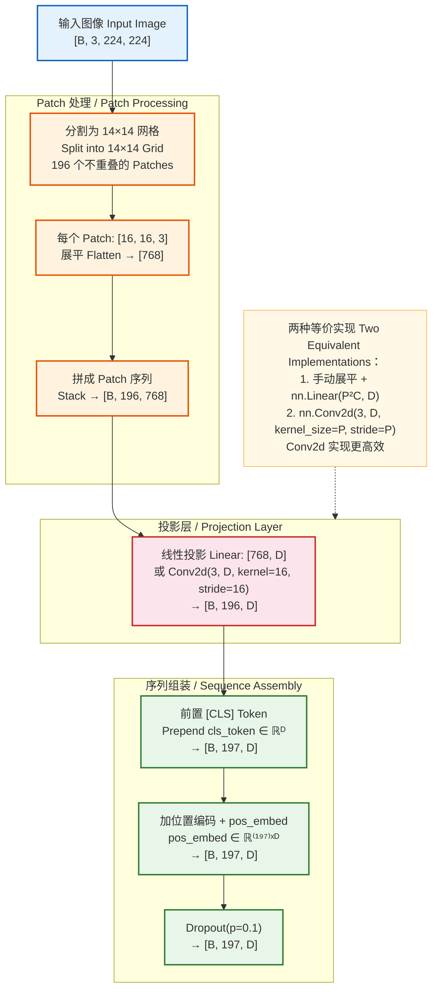
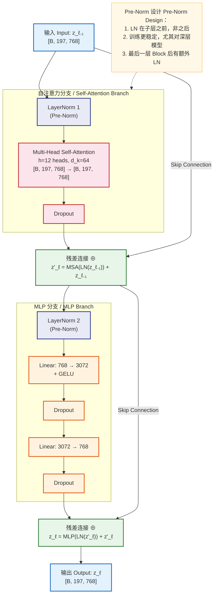
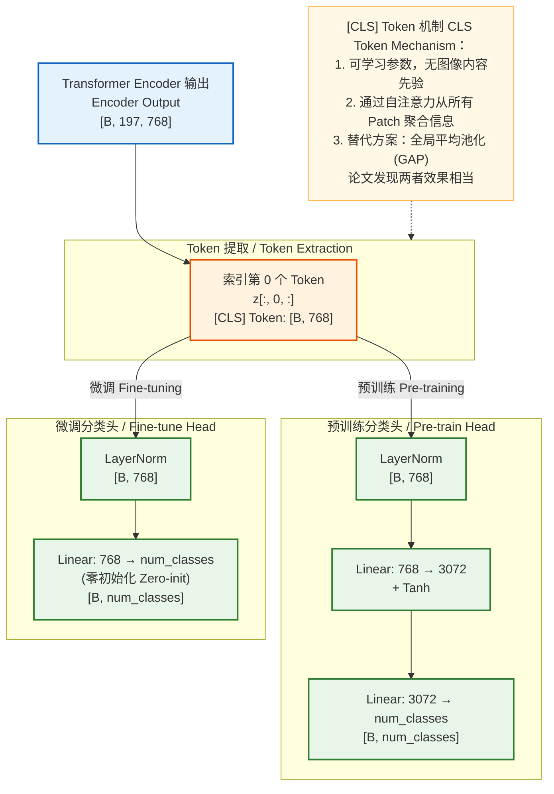

# Vision Transformer (ViT) 模型架构深度解析

> 基于论文 *"An Image is Worth 16x16 Words: Transformers for Image Recognition at Scale"*（Dosovitskiy et al., 2020）
> 本文档涵盖：模型架构概览 → 架构详情 → 关键组件深度拆解 → 面试常见问题

---

## 一、模型架构概览

### 1. 模型定位

| 维度 | 说明 |
|------|------|
| **研究领域** | 计算机视觉（CV）/ 图像识别 |
| **解决问题** | 图像分类任务，将 Transformer 架构从 NLP 引入视觉领域 |
| **核心价值** | 证明纯 Transformer 架构（无卷积）在大规模预训练下可以达到甚至超越 CNN 的图像分类性能 |
| **典型应用** | 图像分类、目标检测（作为 backbone）、语义分割、图像生成、多模态理解等 |

**与同领域模型对比**：

| 模型 | 结构基础 | 归纳偏置 | 数据需求 | 全局建模能力 | 扩展性(Scalability) |
|------|---------|---------|---------|------------|-------------------|
| ResNet | 卷积堆叠 | 强（平移不变性、局部性） | 中等 | 受限于感受野 | 一般 |
| EfficientNet | 卷积 + NAS | 强 | 中等 | 受限于感受野 | 较好 |
| **ViT** | **纯 Transformer** | **弱（几乎无视觉先验）** | **大（需大规模预训练）** | **✅ 全局自注意力** | **极强** |
| DeiT | ViT + 蒸馏 | 弱 + 蒸馏引导 | 中等（ImageNet 即可） | ✅ 全局自注意力 | 强 |

### 2. 核心思想与创新点

**核心突破——"An Image is Worth 16x16 Words"**：

1. **图像 Patch 化**：将图像切分为固定大小的 Patch（如 16×16），每个 Patch 类比为 NLP 中的一个 "Token"，从而将 2D 图像问题转化为 1D 序列问题
2. **直接复用标准 Transformer**：对 Patch 序列应用标准 Transformer Encoder（几乎不做任何视觉特定的修改），证明通用架构在视觉领域同样有效
3. **大规模预训练 + 迁移**：在大规模数据集（如 JFT-300M、ImageNet-21K）上预训练，然后在下游任务上微调，性能超越当时最好的 CNN
4. **[CLS] Token 分类**：借鉴 BERT 的设计，添加一个可学习的分类 Token，其最终表示用于图像级分类

**解决的痛点**：
- CNN 的**局部感受野限制**：需要堆叠很多层才能获得全局感知能力
- CNN 的**架构设计复杂**：各种手工设计的模块（残差块、瓶颈层、SE 模块等），需要大量领域专业知识
- **视觉与语言架构的割裂**：CNN 和 Transformer 分属不同领域，阻碍了统一多模态模型的发展

### 3. 整体架构概览

ViT 采用纯 **Transformer Encoder** 架构（不含 Decoder）：
- **Patch Embedding**：将图像切分为 Patch 并线性映射为嵌入向量
- **Transformer Encoder**：标准 Transformer 编码器堆叠（12/24/32 层）
- **Classification Head**：基于 [CLS] Token 的 MLP 分类头
- **学习范式**：监督学习（预训练为图像分类，下游微调）

**输入**：RGB 图像，形状 `[B, 3, H, W]`（如 `[B, 3, 224, 224]`）
**输出**：类别概率分布，形状 `[B, num_classes]`

```mermaid
flowchart LR
    classDef inputStyle fill:#e3f2fd,stroke:#1565c0,stroke-width:2px
    classDef patchStyle fill:#e8eaf6,stroke:#283593,stroke-width:2px
    classDef encoderStyle fill:#fff3e0,stroke:#e65100,stroke-width:2px
    classDef attnStyle fill:#fce4ec,stroke:#c62828,stroke-width:2px
    classDef headStyle fill:#e8f5e9,stroke:#2e7d32,stroke-width:2px
    classDef noteStyle fill:#fff8e6,stroke:#ffb74d,stroke-width:1px

    subgraph InputStage["输入阶段 / Input Stage"]
        A["输入图像 Input Image<br/>[B, 3, 224, 224]"]:::inputStyle
        B["Patch 分割 + 线性投影<br/>Patch Partition + Linear Projection<br/>[B, 196, 768]"]:::patchStyle
        C["添加 [CLS] Token<br/>Prepend CLS Token<br/>[B, 197, 768]"]:::patchStyle
        D["添加位置编码<br/>+ Position Embedding<br/>[B, 197, 768]"]:::patchStyle
    end

    subgraph Encoder["Transformer 编码器<br/>Transformer Encoder（×L 层/layers）"]
        E["多头自注意力<br/>Multi-Head Self-Attention"]:::attnStyle
        F["残差连接 & 层归一化<br/>Add & LayerNorm"]:::encoderStyle
        G["MLP（前馈网络）<br/>MLP Block"]:::encoderStyle
        H["残差连接 & 层归一化<br/>Add & LayerNorm"]:::encoderStyle
    end

    subgraph Head["分类头 / Classification Head"]
        I["提取 [CLS] Token<br/>Extract CLS Token<br/>[B, 768]"]:::headStyle
        J["MLP Head<br/>[B, num_classes]"]:::headStyle
    end

    A --> B --> C --> D
    D --> E --> F --> G --> H
    H -->|"循环 L 次 Repeat L times"| E
    H --> I --> J

    Note["核心设计 Key Design：<br/>1. 图像 Patch 化为序列 Image → Patch Sequence<br/>2. 直接复用标准 Transformer Encoder<br/>3. [CLS] Token 聚合全局信息<br/>4. 大规模预训练是性能关键"]:::noteStyle
    Note -.-> Encoder
```



### 4. 输入输出示例

**输入示例（图像分类任务）**：

```
输入: 一张 224×224 的 RGB 图像（如 ImageNet 中的一只猫）
形状: [1, 3, 224, 224]  （batch_size=1, channels=3, height=224, width=224）

Patch 大小: 16×16
Patch 数量: (224/16) × (224/16) = 14 × 14 = 196 个 Patch
每个 Patch 展平: 16 × 16 × 3 = 768 维向量

线性投影后: [1, 196, 768]  （196 个 Patch，每个 768 维）
添加 [CLS] Token 后: [1, 197, 768]  （196 个 Patch + 1 个 CLS Token）
添加位置编码后: [1, 197, 768]  （逐元素加法）
```

**输出示例**：

```
Transformer Encoder 输出: [1, 197, 768]  （197 个 Token 的上下文表示）
提取 [CLS] Token: [1, 768]  （第 0 个位置的表示）
MLP Head 输出: [1, 1000]  （ImageNet 1000 类的 logits）
Softmax 后: [1, 1000]  （概率分布，如 "tabby cat": 0.87, "tiger cat": 0.06, ...）
预测类别: "tabby cat"  （取 argmax）
```

### 5. 关键模块一览

| 模块 | 职责 | 数据流转 |
|------|------|---------|
| **Patch Embedding** | 将图像切分为 Patch 并线性映射为 D 维嵌入 | [B, 3, H, W] → [B, N, D] |
| **[CLS] Token** | 可学习的分类 Token，聚合全局图像信息 | 前置到序列首位 |
| **Position Embedding** | 可学习的位置编码，注入空间位置信息 | 逐元素加到 Patch 嵌入上 |
| **Transformer Encoder** | L 层标准 Transformer 编码器，提取全局特征 | [B, N+1, D] → [B, N+1, D] |
| **Multi-Head Self-Attention** | 建模 Patch 间的全局依赖关系 | [B, N+1, D] → [B, N+1, D] |
| **MLP Block** | 逐 Token 的非线性特征变换 | [B, N+1, D] → [B, N+1, 4D] → [B, N+1, D] |
| **MLP Head** | 将 [CLS] Token 的表示映射为分类概率 | [B, D] → [B, num_classes] |

### 6. 性能表现与评估概览

**图像分类基准测试（论文原始结果）**：

| 模型 | 预训练数据 | ImageNet Top-1 | ImageNet ReaL | CIFAR-100 | VTAB (19 tasks) |
|------|-----------|----------------|---------------|-----------|-----------------|
| ResNet152x4 (BiT-L) | JFT-300M | 87.54 | 90.54 | 93.51 | 76.3 |
| EfficientNet-L2 (NoisyStudent) | JFT-300M | 88.35 | 90.55 | - | - |
| **ViT-H/14** | **JFT-300M** | **88.55** | **90.72** | **94.55** | **77.63** |
| ViT-L/16 | ImageNet-21K | 85.30 | 88.62 | 93.25 | 72.72 |

**模型规模**：

| 配置 | 层数 L | 隐藏维度 D | MLP 维度 | 头数 h | 参数量 |
|------|--------|-----------|---------|--------|--------|
| ViT-Base/16 | 12 | 768 | 3072 | 12 | ~86M |
| ViT-Large/16 | 24 | 1024 | 4096 | 16 | ~307M |
| ViT-Huge/14 | 32 | 1280 | 5120 | 16 | ~632M |

> 命名规则：ViT-{模型大小}/{Patch大小}，如 ViT-B/16 表示 Base 模型、Patch 大小 16×16

### 7. 模型家族与演进脉络



**关键演进路线**：
- **数据效率提升（DeiT）**：通过知识蒸馏和强数据增强，使 ViT 在 ImageNet-1K 上就能训练良好
- **层级化视觉 Transformer（Swin）**：引入窗口注意力和层级特征图，适配下游密集预测任务
- **自监督视觉预训练（MAE/BEiT）**：借鉴 NLP 的掩码预训练范式，减少对标注数据的依赖
- **多模态统一（CLIP）**：将 ViT 作为视觉编码器，与文本编码器对齐，开启多模态时代

---

## 二、模型架构详情

### 1. 数据集构成与数据示例

#### 训练数据集

| 数据集 | 规模 | 类别数 | 类型 | 用途 |
|--------|------|--------|------|------|
| ImageNet-1K (ILSVRC-2012) | ~130 万张 | 1,000 | 有标注自然图像 | 基准评估 / 小规模预训练 |
| ImageNet-21K | ~1400 万张 | 21,843 | 有标注自然图像 | 中等规模预训练 |
| JFT-300M | ~3 亿张 | 18,291 | Google 内部有标注（含噪声） | 大规模预训练 |

#### 数据集特征

- **JFT-300M**：Google 内部数据集，标签来自自动化流水线，有约 20% 的噪声标签；论文关键结论——ViT 的优势在大数据集上才能显现
- **ImageNet-21K**：ImageNet 的全集，约为 ImageNet-1K 的 10 倍规模
- **预训练-微调范式**：先在大数据集预训练，然后在目标数据集（如 ImageNet-1K、CIFAR-100）上微调

#### 数据样例与形态变化

```
阶段1 - 原始数据:
  图像: 一张 JPEG 格式的猫的照片（任意分辨率，如 375×500）
  标签: "tabby cat"（类别 ID: 281）

阶段2 - 预处理后（训练时）:
  Resize: 256×256（短边缩放 + 中心裁剪 或 随机裁剪至 224×224）
  数据增强: RandomResizedCrop(224) → RandomHorizontalFlip → 颜色扰动
  归一化: 像素值 [0,255] → [0,1] → 减均值除标准差
  形状: [3, 224, 224]  （C, H, W 格式）

阶段3 - Patch 分割:
  每个 Patch 大小: 16×16×3 = 768 维
  Patch 数量: 14×14 = 196
  展平后: [196, 768]

阶段4 - 线性投影 + [CLS] Token + 位置编码:
  线性投影: [196, 768] → [196, 768]  （当 Patch 大小恰好等于嵌入维度时）
  添加 [CLS]: [197, 768]
  添加位置编码: [197, 768]
  组成批次: [B, 197, 768]

阶段5 - Transformer Encoder 输出:
  形状: [B, 197, 768]  （每个 Token 的上下文表示）

阶段6 - 分类输出:
  提取 [CLS]: [B, 768]
  MLP Head: [B, 768] → [B, 1000]
  Softmax: [B, 1000]  （概率分布）
```

### 2. 数据处理与输入规范

**预处理流程**：



**训练与微调的输入差异**：

| 阶段 | 输入分辨率 | Patch 大小 | Patch 数量 | 说明 |
|------|-----------|-----------|-----------|------|
| 预训练 | 224×224 | 16×16 | 196 | 标准预训练分辨率 |
| 微调（高分辨率） | 384×384 | 16×16 | 576 | 更高分辨率，位置编码需插值 |
| 微调（更高分辨率） | 512×512 | 16×16 | 1024 | 序列长度增加，计算量上升 |

**高分辨率微调的位置编码处理**：当微调分辨率高于预训练分辨率时，预训练得到的位置编码需要进行 2D 双线性插值来适配新的 Patch 数量。这是 ViT 微调时的一个关键技巧。

### 3. 架构全景与数据流



### 4. 核心模块深入分析

#### 4.1 Patch Embedding

Patch Embedding 是 ViT 最关键的创新——将 2D 图像转化为 1D Token 序列。

**实现方式**：实际上等价于一个 kernel_size=stride=patch_size 的卷积操作：

$$\mathbf{z}_0 = [\mathbf{x}_{cls};\; \mathbf{x}_p^1 \mathbf{E};\; \mathbf{x}_p^2 \mathbf{E};\; \cdots;\; \mathbf{x}_p^N \mathbf{E}] + \mathbf{E}_{pos}$$

其中 $\mathbf{x}_p^i \in \mathbb{R}^{P^2 \cdot C}$ 是第 $i$ 个 Patch 的展平向量，$\mathbf{E} \in \mathbb{R}^{(P^2 \cdot C) \times D}$ 是线性投影矩阵。



#### 4.2 [CLS] Token 与位置编码

**[CLS] Token**：
- 一个可学习的参数向量 $\mathbf{x}_{cls} \in \mathbb{R}^{D}$，前置到 Patch 序列的第 0 个位置
- 经过 Transformer Encoder 后，[CLS] Token 通过自注意力机制聚合了所有 Patch 的信息
- 最终用其表示来做分类，类似 BERT 中的 [CLS] 设计

**Position Embedding**：
- ViT 使用**可学习的 1D 位置编码** $\mathbf{E}_{pos} \in \mathbb{R}^{(N+1) \times D}$，而非 Transformer 原始的正弦位置编码
- 论文实验表明，可学习的 1D 位置编码与 2D 感知位置编码效果几乎一致（说明模型能自动学到 2D 空间关系）
- 位置编码与 Patch Embedding 相加（而非拼接），不增加序列维度

#### 4.3 Transformer Encoder Block

ViT 使用的是 **Pre-Norm** 变体（与原始 Transformer 的 Post-Norm 不同）：

$$\mathbf{z}'_\ell = \text{MSA}(\text{LN}(\mathbf{z}_{\ell-1})) + \mathbf{z}_{\ell-1}$$

$$\mathbf{z}_\ell = \text{MLP}(\text{LN}(\mathbf{z}'_\ell)) + \mathbf{z}'_\ell$$

**Pre-Norm vs Post-Norm 的区别**：
- Post-Norm：$\text{LN}(x + \text{Sublayer}(x))$ — 原始 Transformer
- Pre-Norm：$x + \text{Sublayer}(\text{LN}(x))$ — ViT 采用
- Pre-Norm 训练更稳定，尤其是对于深层模型（24 层、32 层），不需要精细的 Warmup

#### 4.4 Multi-Head Self-Attention (MSA)

与标准 Transformer 完全一致：

$$\text{MSA}(\mathbf{z}) = [\text{head}_1;\; \text{head}_2;\; \cdots;\; \text{head}_h] \mathbf{W}^O$$

$$\text{head}_i = \text{Attention}(\mathbf{z}\mathbf{W}_i^Q,\; \mathbf{z}\mathbf{W}_i^K,\; \mathbf{z}\mathbf{W}_i^V) = \text{softmax}\left(\frac{\mathbf{z}\mathbf{W}_i^Q (\mathbf{z}\mathbf{W}_i^K)^T}{\sqrt{d_k}}\right) \mathbf{z}\mathbf{W}_i^V$$

在 ViT 中，自注意力的 "序列" 由 [CLS] Token 和所有图像 Patch 组成。注意力矩阵的形状为 $[B, h, N+1, N+1]$，其中 $N$ 是 Patch 数量。每个 Patch 可以直接关注到图像中任意位置的 Patch。

#### 4.5 MLP Block

$$\text{MLP}(\mathbf{z}) = \text{GELU}(\mathbf{z}\mathbf{W}_1 + \mathbf{b}_1)\mathbf{W}_2 + \mathbf{b}_2$$

- $\mathbf{W}_1 \in \mathbb{R}^{D \times 4D}$，$\mathbf{W}_2 \in \mathbb{R}^{4D \times D}$
- 使用 **GELU** 激活函数（而非 ReLU），GELU 更平滑，在 Transformer 类模型中被广泛使用
- MLP 比率固定为 4：隐层维度 = 4 × 嵌入维度
- 两个线性层之间加 Dropout

#### 4.6 Classification Head

**预训练阶段**：
- MLP Head = Linear(D, hidden) → GELU → Linear(hidden, num_classes)
- 一个带隐层的 MLP

**微调阶段**：
- MLP Head = Linear(D, num_classes)
- 简化为单层线性层
- 通常加一个 LayerNorm

### 5. 维度变换路径

以 ViT-Base/16 配置为例（D=768, h=12, d_k=64, MLP_dim=3072, N=196）：

| 步骤 | 操作 | 维度变化 | 说明 |
|------|------|---------|------|
| 1 | 输入图像 | [B, 3, 224, 224] | RGB 图像 |
| 2 | Patch 分割 + 展平 | [B, 196, 768] | 196 = 14×14, 768 = 16×16×3 |
| 3 | 线性投影 E | [B, 196, 768] → [B, 196, 768] | 当 P²C = D 时维度不变 |
| 4 | 前置 [CLS] Token | [B, 196, 768] → [B, 197, 768] | 序列长度 +1 |
| 5 | + Position Embedding | [B, 197, 768] → [B, 197, 768] | 逐元素加法 |
| 6 | Dropout | [B, 197, 768] → [B, 197, 768] | 训练时 p=0.1 |
| 7 | LayerNorm 1 | [B, 197, 768] → [B, 197, 768] | Pre-Norm |
| 8 | Q/K/V 线性投影 | [B, 197, 768] → 3×[B, 197, 768] | 三次独立投影 |
| 9 | 拆分多头 | [B, 197, 768] → [B, 12, 197, 64] | reshape + transpose |
| 10 | QKᵀ / √d_k | [B, 12, 197, 64]×[B, 12, 64, 197] → [B, 12, 197, 197] | 注意力得分矩阵 |
| 11 | Softmax + Dropout | [B, 12, 197, 197] → [B, 12, 197, 197] | 注意力权重 |
| 12 | × V | [B, 12, 197, 197]×[B, 12, 197, 64] → [B, 12, 197, 64] | 加权聚合 |
| 13 | 合并多头 + Wᴼ | [B, 12, 197, 64] → [B, 197, 768] | concat + 线性投影 |
| 14 | 残差连接 | [B, 197, 768] + [B, 197, 768] → [B, 197, 768] | Skip Connection |
| 15 | LayerNorm 2 | [B, 197, 768] → [B, 197, 768] | Pre-Norm |
| 16 | MLP 第一层 | [B, 197, 768] → [B, 197, 3072] | Linear + GELU |
| 17 | MLP 第二层 | [B, 197, 3072] → [B, 197, 768] | Linear + Dropout |
| 18 | 残差连接 | [B, 197, 768] + [B, 197, 768] → [B, 197, 768] | Skip Connection |
| 19 | （重复步骤 7-18 共 L 次） | [B, 197, 768] | 12 层 Encoder |
| 20 | 最终 LayerNorm | [B, 197, 768] → [B, 197, 768] | 输出前归一化 |
| 21 | 提取 [CLS] | [B, 197, 768] → [B, 768] | 取序列第 0 个位置 |
| 22 | MLP Head | [B, 768] → [B, 1000] | 线性分类 |

### 6. 数学表达与关键公式

#### 核心公式汇总

**1. Patch Embedding**：

$$\mathbf{z}_0 = [\mathbf{x}_{cls};\; \mathbf{x}_p^1\mathbf{E};\; \mathbf{x}_p^2\mathbf{E};\; \cdots;\; \mathbf{x}_p^N\mathbf{E}] + \mathbf{E}_{pos}$$

其中 $\mathbf{x}_p^i \in \mathbb{R}^{P^2 \cdot C}$，$\mathbf{E} \in \mathbb{R}^{(P^2 \cdot C) \times D}$，$\mathbf{E}_{pos} \in \mathbb{R}^{(N+1) \times D}$

**2. Transformer Encoder（Pre-Norm 版本）**：

$$\mathbf{z}'_\ell = \text{MSA}(\text{LN}(\mathbf{z}_{\ell-1})) + \mathbf{z}_{\ell-1}, \quad \ell = 1, 2, \ldots, L$$

$$\mathbf{z}_\ell = \text{MLP}(\text{LN}(\mathbf{z}'_\ell)) + \mathbf{z}'_\ell, \quad \ell = 1, 2, \ldots, L$$

**3. 多头自注意力**：

$$\text{MSA}(\mathbf{z}) = \text{Concat}(\text{head}_1, \ldots, \text{head}_h)\mathbf{W}^O$$

$$\text{head}_i = \text{softmax}\left(\frac{(\mathbf{z}\mathbf{W}_i^Q)(\mathbf{z}\mathbf{W}_i^K)^T}{\sqrt{d_k}}\right)\mathbf{z}\mathbf{W}_i^V$$

**4. MLP Block**：

$$\text{MLP}(\mathbf{z}) = \text{GELU}(\mathbf{z}\mathbf{W}_1 + \mathbf{b}_1)\mathbf{W}_2 + \mathbf{b}_2$$

**5. GELU 激活函数**：

$$\text{GELU}(x) = x \cdot \Phi(x) = x \cdot \frac{1}{2}\left[1 + \text{erf}\left(\frac{x}{\sqrt{2}}\right)\right]$$

**6. 分类输出**：

$$\mathbf{y} = \text{LN}(\mathbf{z}_L^0)$$

其中 $\mathbf{z}_L^0$ 是最后一层 Encoder 输出中 [CLS] Token 对应的向量。

### 7. 损失函数与优化策略

#### 损失函数

- **预训练**：标准交叉熵损失

$$\mathcal{L} = -\sum_{i=1}^{K} y_i \log(p_i)$$

- **微调**：同样使用交叉熵损失，可选择加 Label Smoothing

#### 优化器与训练配置

**预训练配置**：

| 参数 | 值 |
|------|---|
| 优化器 | Adam ($\beta_1=0.9, \beta_2=0.999$) |
| 学习率 | Base lr = 0.001 |
| 学习率调度 | 线性 Warmup + 余弦衰减（Cosine Decay） |
| 权重衰减 | 0.1 |
| Batch Size | 4096 |
| 训练轮数 | 在 JFT-300M 上预训练 7 个 epoch，在 ImageNet-21K 上 90 / 300 epoch |
| 梯度裁剪 | 全局范数裁剪，max_norm=1.0 |

**微调配置**：

| 参数 | 值 |
|------|---|
| 优化器 | SGD with Momentum 0.9 |
| 学习率 | 较小（如 0.01 - 0.03，余弦衰减） |
| Batch Size | 512 |
| 训练轮数 | 较少（如 10K - 20K 步） |
| 分辨率 | 通常提升至 384×384 或 512×512 |

### 8. 训练流程与策略

#### 学习范式

- **监督预训练**：在大规模有标注数据集（JFT-300M / ImageNet-21K）上进行图像分类预训练
- **迁移微调**：将预训练模型在下游目标数据集上微调
- 论文的核心发现：**数据规模是决定 ViT 性能的关键因素**

#### 训练流程



#### 数据增强策略

| 阶段 | 增强方式 |
|------|---------|
| 预训练 | Resize + RandomCrop + HorizontalFlip + 颜色扰动（较轻） |
| 微调 | RandAugment / Mixup / CutMix / 随机擦除（较强） |

**关键发现**：ViT 对数据增强比 CNN 更敏感，合理的增强策略可以弥补一部分数据规模的不足。

#### 训练基础设施

- 使用 Google 的 TPU v3 集群
- ViT-H/14 在 JFT-300M 上预训练约需 2,500 TPU v3-core-days
- ImageNet-21K 预训练需约 30 天（使用 8 个 TPU v3）

### 9. 推理与预测流程

#### 推理流程

ViT 的推理是**单次前向传播**（非自回归），因此推理效率较高：


#### 完整推理示例

```
输入: 一张 384×384 的猫的照片

Step 1: 预处理
  CenterCrop(384) → Normalize → [1, 3, 384, 384]

Step 2: Patch Embedding
  Patch 大小: 16×16
  Patch 数量: (384/16)² = 24×24 = 576
  线性投影: [1, 576, 768]
  + [CLS]: [1, 577, 768]
  + Position Embedding (插值到 577): [1, 577, 768]

Step 3: Transformer Encoder (12 层)
  输出: [1, 577, 768]

Step 4: 分类
  [CLS] Token: [1, 768]
  LayerNorm: [1, 768]
  Linear: [1, 768] → [1, 1000]
  Softmax: [0.001, ..., 0.87(tabby cat), ..., 0.06(tiger cat), ..., 0.001]

最终预测: "tabby cat" (class 281), 置信度 0.87
```

#### 推理优化手段

| 方法 | 原理 | 效果 |
|------|------|------|
| FP16 / BF16 推理 | 半精度推理 | 速度提升 ~2x，内存减半 |
| Token 剪枝 (Token Pruning) | 移除不重要的 Token | 减少计算量 20-40% |
| ONNX / TensorRT 导出 | 图优化 + 算子融合 | 推理速度提升 2-5x |
| 知识蒸馏 | 用大模型指导小模型 | 小模型获得大模型性能 |
| FlashAttention | IO 感知的注意力实现 | 大幅减少显存，提速 2-4x |

### 10. 评估指标与实验分析

#### 主要评估指标

| 指标 | 含义 | 选用理由 |
|------|------|---------|
| **Top-1 Accuracy** | 预测的最高概率类别与真实标签匹配的比例 | 图像分类标准指标 |
| **Top-5 Accuracy** | 真实标签在前 5 个预测中的比例 | 衡量模型的粗粒度分类能力 |
| **ImageNet ReaL** | 使用修正后的多标签进行评估 | 更公正，避免原标签的歧义性 |
| **VTAB** | 19 个多样化视觉任务的平均得分 | 衡量迁移学习的通用性 |

#### 核心实验结果

**不同预训练数据规模下的对比（ViT vs ResNet (BiT)）**：

| 预训练数据集 | ViT-L/16 | BiT-L (ResNet152x4) | 赢家 |
|-------------|----------|---------------------|------|
| ImageNet-1K (~1.3M) | 76.5 | **84.7** | CNN |
| ImageNet-21K (~14M) | 85.3 | **85.4** | 持平 |
| JFT-300M (~300M) | **87.8** | 87.5 | **ViT** |

**关键发现**：在小数据集上 CNN 优于 ViT（归纳偏置的优势），但在大数据集上 ViT 的 scaling 特性更好。

#### 消融实验结果

**位置编码消融（ViT-B/16 在 ImageNet 上微调）**：

| 位置编码方式 | Top-1 Accuracy |
|-------------|----------------|
| 无位置编码 | 61.32 |
| 1D 可学习位置编码 | **79.39** |
| 2D 可学习位置编码 | 79.35 |
| 相对位置编码 | 78.62 |

1D 与 2D 位置编码效果几乎一致，说明 Transformer 可以从 1D 位置编码中自动学到 2D 空间结构。

**Patch 大小消融**：

| Patch 大小 | 序列长度 N (224×224) | 计算量 (GFLOPs) | ImageNet Top-1 |
|-----------|---------------------|----------------|----------------|
| 32×32 | 49 | ~4.4 | 较低 |
| 16×16 | 196 | ~17.6 | 适中 |
| 14×14 | 256 | ~23.6 | 较高 |
| 8×8 | 784 | ~70.6 | 最高（但计算量极大） |

Patch 越小，序列越长，信息保留越多，性能越好，但计算量以序列长度平方增长。

#### 注意力可视化

论文中对 ViT 的注意力进行了可视化分析：
- **浅层注意力**：部分头关注相邻 Patch（类似 CNN 的局部感受野），部分头关注全局
- **深层注意力**：更多头关注语义相关的区域（如关注物体的不同部位）
- **注意力距离**：随着层数加深，平均注意力距离增大，说明低层学到局部特征，高层学到全局关系
- **[CLS] Token 的注意力**：在高层中，[CLS] 能关注到目标物体的关键区域

### 11. 设计亮点与思考

#### 值得学习的设计思路

1. **极简主义的跨领域迁移**：几乎不修改 NLP 的 Transformer 架构，仅加了一个 Patch Embedding，就成功应用于视觉任务，证明了通用架构的力量
2. **Scaling Law 在视觉中的验证**：模型越大、数据越多，性能持续提升，且未见饱和（与 NLP 中的 GPT 系列一致）
3. **预训练-微调范式**：建立了视觉领域的大规模预训练范式，影响了后续所有工作
4. **位置编码的灵活性**：可学习的位置编码在微调时可以通过插值适应不同分辨率

#### 设计权衡

| 权衡 | 选择 | 代价 |
|------|------|------|
| 通用性 vs 归纳偏置 | 去除几乎所有视觉先验 | 在小数据集上性能不如 CNN |
| 全局注意力 vs 计算量 | O(N²) 全局自注意力 | 高分辨率输入时计算量剧增 |
| Patch 大小 vs 精度 | 16×16（权衡效率和精度） | 更小的 Patch 更精细但更慢 |
| [CLS] Token vs 全局池化 | [CLS] Token | 论文发现 [CLS] 和全局平均池化效果相当 |

#### 已知局限性

1. **数据饥渴**：在中小规模数据集（如仅 ImageNet-1K）上训练时，性能明显不如 CNN，需要大规模预训练才能发挥优势
2. **O(N²) 复杂度**：自注意力的计算和内存复杂度对序列长度呈平方增长，限制了使用小 Patch 或高分辨率输入
3. **缺乏多尺度特征**：原始 ViT 输出单一尺度的特征图，不适合目标检测和语义分割等需要多尺度特征的下游任务（Swin Transformer 解决了这一问题）
4. **位置编码的分辨率迁移**：微调时分辨率改变需要对位置编码做插值，可能损失精度
5. **训练成本高**：大规模预训练需要大量算力（数千 TPU-days）

---

## 三、关键组件深度拆解

### 组件一：Patch Embedding（图像分块嵌入）

#### 1. 组件定位与职责

Patch Embedding 是 ViT 的**入口模块**，负责将 2D 图像转化为 1D Token 序列，使标准 Transformer 能够处理视觉数据。它解决的核心问题是：**如何在不引入视觉特有归纳偏置的前提下，将图像表示为 Transformer 可接受的序列形式**。

如果直接将每个像素作为一个 Token，224×224 的图像会产生 50,176 个 Token，自注意力的 O(N²) 复杂度将无法承受。Patch Embedding 通过将图像分块，将序列长度控制在可计算范围（如 196）。

#### 2. 内部结构拆解



#### 3. 计算流程与维度变换

```
输入: 图像 X ∈ [B, 3, 224, 224]

Step 1 — 分割 Patch（以 P=16 为例）:
  网格大小: H/P × W/P = 14 × 14 = 196
  每个 Patch: [16, 16, 3] → 展平为 [768]
  所有 Patch: [B, 196, 768]

Step 2 — 线性投影（两种等价实现）:
  方法 A: nn.Linear(768, D)
    [B, 196, 768] × [768, D] → [B, 196, D]
  方法 B: nn.Conv2d(3, D, kernel_size=16, stride=16)
    [B, 3, 224, 224] → [B, D, 14, 14] → reshape → [B, 196, D]

Step 3 — 添加 [CLS] Token:
  cls_token: [1, 1, D] → expand → [B, 1, D]
  concat([B, 1, D], [B, 196, D]) → [B, 197, D]

Step 4 — 添加位置编码:
  pos_embed: [1, 197, D] → expand → [B, 197, D]
  [B, 197, D] + [B, 197, D] → [B, 197, D]

Step 5 — Dropout:
  [B, 197, D] → [B, 197, D]

输出: [B, 197, D]  传入 Transformer Encoder
```

#### 4. 设计细节与技巧

**Conv2d 实现的优势**：
- 虽然数学上等价于展平 + 线性投影，但 Conv2d 利用了 GPU 上高度优化的卷积算子，实际运行更快
- 自动处理了 Patch 的空间分割，无需手动 reshape

**位置编码的 2D 插值**：
```
预训练: 224×224, Patch 14×14, pos_embed: [1, 197, D]  （1 个 CLS + 196 个 Patch）
微调:   384×384, Patch 24×24, pos_embed 需要: [1, 577, D]  （1 个 CLS + 576 个 Patch）

插值流程:
1. 分离 CLS Token 的位置编码: cls_pos [1, 1, D]
2. 取 Patch 位置编码: patch_pos [1, 196, D] → reshape → [1, D, 14, 14]
3. 双线性插值: interpolate([1, D, 14, 14], size=(24, 24)) → [1, D, 24, 24]
4. 展平: [1, D, 24, 24] → [1, 576, D]
5. 拼接 CLS: concat(cls_pos, [1, 576, D]) → [1, 577, D]
```

#### 5. 变体与演进

| 变体 | 模型 | 方式 | 特点 |
|------|------|------|------|
| 标准 Patch Embedding | ViT | 非重叠 Patch + 线性投影 | 简单直接 |
| 卷积 Stem | Early Convolutions ViT | 用几层小卷积替代 Patch Embedding | 提升训练稳定性和低层特征质量 |
| 重叠 Patch Embedding | PVT, CvT | 使用重叠卷积（stride < kernel） | 保留更多边界信息 |
| 层级 Patch Embedding | Swin Transformer | 不同阶段使用不同 Patch 大小 | 构建多尺度特征金字塔 |

#### 6. 代码级参考

```python
class PatchEmbedding(nn.Module):
    def __init__(self, img_size=224, patch_size=16, in_chans=3, embed_dim=768):
        super().__init__()
        self.num_patches = (img_size // patch_size) ** 2
        self.proj = nn.Conv2d(in_chans, embed_dim,
                              kernel_size=patch_size, stride=patch_size)
        self.cls_token = nn.Parameter(torch.zeros(1, 1, embed_dim))
        self.pos_embed = nn.Parameter(
            torch.zeros(1, self.num_patches + 1, embed_dim)
        )
        self.dropout = nn.Dropout(0.1)
        nn.init.trunc_normal_(self.cls_token, std=0.02)
        nn.init.trunc_normal_(self.pos_embed, std=0.02)

    def forward(self, x):
        B = x.shape[0]
        # [B, 3, 224, 224] → [B, D, 14, 14] → [B, D, 196] → [B, 196, D]
        x = self.proj(x).flatten(2).transpose(1, 2)
        cls_tokens = self.cls_token.expand(B, -1, -1)
        x = torch.cat([cls_tokens, x], dim=1)     # [B, 197, D]
        x = x + self.pos_embed                      # [B, 197, D]
        return self.dropout(x)
```

---

### 组件二：ViT Transformer Encoder Block（编码器块）

#### 1. 组件定位与职责

Transformer Encoder Block 是 ViT 的**核心特征提取单元**，负责在 Patch Token 之间建立全局依赖关系并进行特征变换。ViT 通过堆叠 L 个相同结构的 Block（如 ViT-B 为 12 层）来逐步提取从低级到高级的视觉特征。

与原始 Transformer 的关键区别：ViT 使用 **Pre-Norm**（LayerNorm 在子层之前），而原始 Transformer 使用 Post-Norm（LayerNorm 在子层之后）。

#### 2. 内部结构拆解



#### 3. 计算流程与维度变换

```
输入: z_{ℓ-1} ∈ [B, 197, 768]

=== 自注意力分支 ===
Step 1 — LayerNorm 1:
  z_norm = LN(z_{ℓ-1})    [B, 197, 768]

Step 2 — Q/K/V 投影:
  Q = z_norm · W_Q   [B, 197, 768] × [768, 768] → [B, 197, 768]
  K = z_norm · W_K   [B, 197, 768] × [768, 768] → [B, 197, 768]
  V = z_norm · W_V   [B, 197, 768] × [768, 768] → [B, 197, 768]

Step 3 — 拆分为 12 头:
  Q: [B, 197, 768] → [B, 12, 197, 64]
  K: [B, 197, 768] → [B, 12, 197, 64]
  V: [B, 197, 768] → [B, 12, 197, 64]

Step 4 — 注意力计算:
  scores = Q·Kᵀ / √64   [B, 12, 197, 197]
  weights = softmax(scores) → Dropout
  context = weights · V    [B, 12, 197, 64]

Step 5 — 合并头 + 输出投影:
  [B, 12, 197, 64] → [B, 197, 768] → W_O → [B, 197, 768]

Step 6 — 残差连接:
  z'_ℓ = Dropout(MSA_output) + z_{ℓ-1}   [B, 197, 768]

=== MLP 分支 ===
Step 7 — LayerNorm 2:
  z_norm2 = LN(z'_ℓ)   [B, 197, 768]

Step 8 — MLP 第一层:
  h = GELU(z_norm2 · W_1 + b_1)   [B, 197, 768] → [B, 197, 3072]
  h = Dropout(h)

Step 9 — MLP 第二层:
  out = h · W_2 + b_2    [B, 197, 3072] → [B, 197, 768]
  out = Dropout(out)

Step 10 — 残差连接:
  z_ℓ = out + z'_ℓ   [B, 197, 768]

输出: z_ℓ ∈ [B, 197, 768]
```

#### 4. 设计细节与技巧

**GELU vs ReLU**：

$$\text{GELU}(x) = x \cdot \Phi(x) \approx 0.5x\left(1 + \tanh\left[\sqrt{2/\pi}(x + 0.044715x^3)\right]\right)$$

GELU 的优势：
- 在零点附近更平滑，避免了 ReLU 的 "dying neuron" 问题
- 概率解释：以输入值的大小为概率来决定是否保留该激活
- 在 Transformer 类模型中已成为标准选择

**参数初始化**：
- 线性层使用截断正态分布初始化（std=0.02）
- LayerNorm 的 $\gamma$ 初始化为 1，$\beta$ 初始化为 0
- 良好的初始化对 ViT 的训练稳定性至关重要

#### 5. 代码级参考

```python
class TransformerBlock(nn.Module):
    def __init__(self, dim=768, num_heads=12, mlp_ratio=4.0, dropout=0.1):
        super().__init__()
        self.norm1 = nn.LayerNorm(dim)
        self.attn = MultiHeadSelfAttention(dim, num_heads, dropout)
        self.norm2 = nn.LayerNorm(dim)
        mlp_hidden = int(dim * mlp_ratio)
        self.mlp = nn.Sequential(
            nn.Linear(dim, mlp_hidden),
            nn.GELU(),
            nn.Dropout(dropout),
            nn.Linear(mlp_hidden, dim),
            nn.Dropout(dropout),
        )

    def forward(self, x):
        x = x + self.attn(self.norm1(x))   # Pre-Norm + Residual
        x = x + self.mlp(self.norm2(x))    # Pre-Norm + Residual
        return x


class MultiHeadSelfAttention(nn.Module):
    def __init__(self, dim=768, num_heads=12, dropout=0.1):
        super().__init__()
        self.num_heads = num_heads
        self.head_dim = dim // num_heads
        self.scale = self.head_dim ** -0.5
        self.qkv = nn.Linear(dim, dim * 3)
        self.proj = nn.Linear(dim, dim)
        self.attn_drop = nn.Dropout(dropout)
        self.proj_drop = nn.Dropout(dropout)

    def forward(self, x):
        B, N, C = x.shape
        qkv = self.qkv(x).reshape(
            B, N, 3, self.num_heads, self.head_dim
        ).permute(2, 0, 3, 1, 4)
        q, k, v = qkv.unbind(0)

        attn = (q @ k.transpose(-2, -1)) * self.scale
        attn = attn.softmax(dim=-1)
        attn = self.attn_drop(attn)

        x = (attn @ v).transpose(1, 2).reshape(B, N, C)
        return self.proj_drop(self.proj(x))
```

---

### 组件三：Classification Head 与 [CLS] Token 机制

#### 1. 组件定位与职责

Classification Head 是 ViT 的**输出模块**，负责将 Transformer Encoder 提取的全局特征映射为分类概率。它与 [CLS] Token 紧密耦合——[CLS] Token 作为全局信息的聚合器，Classification Head 在其表示上做最终决策。

这一设计直接借鉴了 BERT 的 [CLS] 机制，是 ViT "从 NLP 迁移到 CV" 的标志性设计之一。

#### 2. 内部结构拆解



#### 3. [CLS] Token 的信息聚合过程

```
初始化: cls_token ∈ ℝᴰ（可学习参数，随机初始化）

Layer 1:
  [CLS] 通过自注意力关注所有 196 个 Patch
  → 初步聚合低级视觉特征（边缘、纹理等）

Layer 2-6:
  [CLS] 逐层融合越来越抽象的特征
  → 中层聚合局部模式（部件、形状等）

Layer 7-12:
  [CLS] 关注语义级别的全局信息
  → 高层聚合全局语义（类别、场景等）

最终输出:
  [CLS] 的表示 ∈ ℝᴰ 蕴含了图像的全局判别特征
  → 直接用于分类
```

#### 4. [CLS] Token vs 全局平均池化 (GAP)

| 方面 | [CLS] Token | 全局平均池化 (GAP) |
|------|-----------|------------------|
| 实现 | 专用可学习 Token，通过自注意力聚合 | 对所有 Patch Token 取平均 |
| 额外参数 | 1 个 D 维向量 | 无 |
| 信息聚合方式 | 注意力加权（可学习） | 等权平均 |
| 论文结论 | ViT 默认使用 | 效果与 [CLS] 相当 |
| 后续趋势 | BERT 风格的模型继续使用 | DeiT、Swin 等更多使用 GAP |

#### 5. 代码级参考

```python
class VisionTransformer(nn.Module):
    def __init__(self, img_size=224, patch_size=16, in_chans=3,
                 num_classes=1000, embed_dim=768, depth=12,
                 num_heads=12, mlp_ratio=4.0, dropout=0.1):
        super().__init__()
        self.patch_embed = PatchEmbedding(
            img_size, patch_size, in_chans, embed_dim
        )
        self.blocks = nn.Sequential(*[
            TransformerBlock(embed_dim, num_heads, mlp_ratio, dropout)
            for _ in range(depth)
        ])
        self.norm = nn.LayerNorm(embed_dim)
        self.head = nn.Linear(embed_dim, num_classes)
        nn.init.zeros_(self.head.weight)
        nn.init.zeros_(self.head.bias)

    def forward(self, x):
        x = self.patch_embed(x)          # [B, 197, D]
        x = self.blocks(x)               # [B, 197, D]
        x = self.norm(x)                 # [B, 197, D]
        cls_token = x[:, 0]              # [B, D]
        return self.head(cls_token)       # [B, num_classes]
```

---

## 四、面试常见问题（FAQ）

### Q1: ViT 的核心思想是什么？为什么要把图像分成 Patch？

**答**：ViT 的核心思想是将 Transformer 架构从 NLP 直接迁移到计算机视觉领域，用**尽量少的修改**证明纯 Transformer 在视觉任务上也能表现出色。

把图像分成 Patch 是出于**计算可行性**的考虑。如果将每个像素作为一个 Token，224×224 的图像会产生 50,176 个 Token，自注意力的 O(N²) 复杂度约需计算 25 亿次的注意力得分，完全不可行。使用 16×16 的 Patch 后，序列长度降为 196，注意力矩阵仅约 38,000 个元素，计算量降低了约 65,000 倍。

每个 Patch 类比为 NLP 中的一个 "word"，这也是论文标题 "An Image is Worth 16x16 Words" 的含义。

---

### Q2: ViT 为什么在小数据集上不如 CNN，但在大数据集上更强？

**答**：这是 ViT 最重要的实验发现之一，根本原因在于**归纳偏置（Inductive Bias）**。

CNN 内置了两个强归纳偏置：
1. **局部性（Locality）**：卷积核只关注局部区域，天然适合图像中相邻像素高度相关的特性
2. **平移等变性（Translation Equivariance）**：同一特征在图像不同位置共享相同的检测器

这些先验使 CNN 在**数据有限时仍能快速收敛到合理的解**——它已经"知道"该关注局部、该共享特征。

ViT 几乎没有这些先验，自注意力是全局操作，每个 Patch 对所有其他 Patch 的关系需要从数据中学习。在数据不足时，模型无法学到这些隐含的视觉结构，因此性能不如 CNN。但当数据足够多时（如 JFT-300M 的 3 亿张图），ViT 不受限于卷积的局部性，能够学到**更灵活、更通用的表示**，并且展现出更好的 Scaling 特性。

论文中的实验数据：

| 预训练数据规模 | ViT-L/16 | BiT-L (ResNet) |
|-------------|----------|----------------|
| ~1M (ImageNet-1K) | 76.5 | **84.7** |
| ~14M (ImageNet-21K) | 85.3 | **85.4** |
| ~300M (JFT-300M) | **87.8** | 87.5 |

---

### Q3: ViT 中 [CLS] Token 是什么？为什么需要它？可以用全局平均池化替代吗？

**答**：[CLS] Token 是一个可学习的参数向量，前置到 Patch 序列的第 0 个位置。它在 Transformer Encoder 的每一层中通过自注意力与所有 Patch Token 交互，逐层聚合全局信息。最终，它的表示被用作整个图像的全局表示来进行分类。

这一设计直接借鉴了 BERT，目的是提供一个**与任何具体 Patch 无关的全局聚合点**。

**可以用全局平均池化（GAP）替代**。论文实验表明，使用 [CLS] Token 和使用 GAP（对所有 Patch Token 取平均）效果几乎一致。后续很多工作（如 DeiT、Swin Transformer）实际上更多使用 GAP，因为它更简单、不需要额外参数。

选择 [CLS] Token 更多是为了与 BERT 保持设计一致性，方便多模态统一。

---

### Q4: ViT 使用的是 Pre-Norm 还是 Post-Norm？有什么区别？

**答**：ViT 使用的是 **Pre-Norm**，即 LayerNorm 放在子层（Self-Attention 或 MLP）之前：

```
Pre-Norm (ViT):  output = x + Sublayer(LayerNorm(x))
Post-Norm (原始 Transformer): output = LayerNorm(x + Sublayer(x))
```

两者的关键区别：

| 特性 | Post-Norm | Pre-Norm |
|------|-----------|----------|
| 训练稳定性 | 较差，需要精细的 Warmup | 更稳定，对 Warmup 依赖较小 |
| 最终性能 | 充分调参后略高 | 略低（但差距很小） |
| 深层模型 | 可能训练困难 | 稳定支持 24+ 层 |
| 残差路径 | 归一化后再残差 | 残差路径保持"干净" |

Pre-Norm 训练更稳定的直觉是：在 Pre-Norm 中，残差连接的主路径（identity path）不经过 LayerNorm，梯度可以直接通过残差流回底层，类似于 ResNet 的设计理念。

---

### Q5: 如何处理不同分辨率的输入？位置编码怎么办？

**答**：这是 ViT 实践中的一个关键问题。当微调时的输入分辨率高于预训练分辨率（如从 224→384），Patch 数量会改变（如 196→576），导致预训练的位置编码维度不匹配。

解决方案是对位置编码进行 **2D 双线性插值**：

1. 分离 [CLS] Token 的位置编码（保持不变）
2. 将 Patch 位置编码 reshape 为 2D 网格形式：[1, 196, D] → [1, D, 14, 14]
3. 使用双线性插值缩放到新尺寸：[1, D, 14, 14] → [1, D, 24, 24]
4. 展平并与 [CLS] 位置编码拼接：[1, 577, D]

这种方法有效但并非完美——插值后的位置编码是预训练值的近似，可能引入少量性能损失。论文中的做法是在微调时使用较小的学习率，让位置编码有足够的时间适应新分辨率。

后续工作中，FlexiViT 探索了更灵活的分辨率/Patch大小适配方案。

---

### Q6: ViT 的计算复杂度是多少？与 CNN 相比如何？

**答**：ViT 的计算瓶颈在于自注意力模块，总体复杂度分析如下：

**自注意力复杂度**：
- QKᵀ 计算：$O(N^2 \cdot D)$，其中 $N$ 是 Patch 数量
- 对于 ViT-B/16 在 224×224 输入下：$N=196$，$D=768$

**MLP 复杂度**：
- $O(N \cdot D \cdot 4D) = O(4N \cdot D^2)$

**总复杂度**：$O(N^2 \cdot D + N \cdot D^2)$

| 模型 | 参数量 | GFLOPs (224²) | GFLOPs (384²) | ImageNet Top-1 |
|------|--------|--------------|--------------|----------------|
| ResNet-50 | 25M | 4.1 | - | 76.2 |
| ResNet-152 | 60M | 11.6 | - | 78.3 |
| ViT-B/16 | 86M | 17.6 | 55.5 | 77.9 (IN-1K) / 84.2 (IN-21K) |
| ViT-L/16 | 307M | 61.6 | 191.1 | 76.5 (IN-1K) / 85.3 (IN-21K) |

在相似 FLOPs 下，CNN 在纯 ImageNet 训练中更高效；但 ViT 在大规模预训练后迁移时，性能-计算比更优。

---

### Q7: ViT 中 Patch 大小的选择有什么影响？为什么通常选 16×16？

**答**：Patch 大小是一个关键的设计超参数，直接影响**序列长度、计算量和模型性能**的三角权衡：

| Patch 大小 | 序列长度 (224²) | 每个 Patch 信息量 | 计算量 | 性能 |
|-----------|----------------|----------------|--------|------|
| 32×32 | 49 | 多（3072维） | 很低 | 较低（信息损失大） |
| **16×16** | **196** | **中等（768维）** | **中等** | **较好（平衡点）** |
| 14×14 | 256 | 中等（588维） | 较高 | 更好 |
| 8×8 | 784 | 少（192维） | 很高 | 最好（但计算昂贵） |

16×16 是实践中最常用的选择，原因：
1. 序列长度 196 在当前硬件上计算效率良好
2. 16×16×3=768 恰好是 ViT-B 的嵌入维度，Patch 展平后无需改变维度
3. 在性能-效率曲线上处于较好的位置

论文命名规则中的 "/16" 或 "/14" 即表示 Patch 大小，如 ViT-B/16 vs ViT-B/32。

---

### Q8: ViT 的位置编码学到了什么？1D 位置编码能学到 2D 空间关系吗？

**答**：论文通过可视化学到的位置编码的余弦相似度矩阵，展示了一个有趣的发现：

**1D 可学习位置编码确实能学到 2D 空间结构**。具体来说，每个位置的编码向量与其**2D 空间上的邻近位置**有更高的相似度——形成了类似 2D 网格的模式。这说明 Transformer 仅从 1D 位置索引就能自动学到图像的 2D 空间布局。

论文消融实验对比了四种位置编码：
- 无位置编码：61.32%（严重下降，无法区分 Patch 位置）
- 1D 可学习：**79.39%**
- 2D 可学习：79.35%
- 相对位置：78.62%

1D 和 2D 效果几乎一致（差 0.04%），说明**显式的 2D 结构并非必要**——模型有足够的能力从数据中学到空间关系。

---

### Q9: DeiT 是如何让 ViT 不再依赖大规模预训练的？

**答**：DeiT（Data-efficient Image Transformers, 2021）通过以下策略使 ViT 仅在 ImageNet-1K 上就能训练出竞争力强的模型：

1. **知识蒸馏（Knowledge Distillation）**：
   - 引入一个额外的 **Distillation Token**（类似 [CLS] Token）
   - 教师模型使用训练好的 CNN（如 RegNetY-16GF）
   - 学生模型（ViT）同时学习真实标签和教师的软标签
   - 硬蒸馏效果优于软蒸馏

2. **强数据增强**：RandAugment、Mixup、CutMix、Random Erasing 的组合

3. **训练技巧**：
   - 重复增强（Repeated Augmentation）
   - 随机深度（Stochastic Depth / DropPath）
   - 指数移动平均（EMA）

结果：DeiT-B（与 ViT-B 相同架构）仅在 ImageNet-1K 上训练就达到 81.8% Top-1 精度，接近 ViT-B 在 ImageNet-21K 预训练后的水平。

---

### Q10: ViT 与 Swin Transformer 的核心区别是什么？各自的优缺点？

**答**：

| 特性 | ViT | Swin Transformer |
|------|-----|-----------------|
| 注意力范围 | **全局**（所有 Patch 之间） | **局部窗口**（窗口内 Patch 之间） |
| 特征图尺度 | 单尺度 | **多尺度层级**（类似 FPN） |
| 计算复杂度 | O(N²)（N 为 Patch 数） | O(N·M)（M 为窗口大小，固定） |
| 下游适配 | 需要额外适配器 | 天然适配检测/分割 |
| 架构思路 | NLP → CV，最少改动 | CV 先验 + Transformer |
| 归纳偏置 | 极少 | 中等（局部性 + 层级） |
| 预训练需求 | 大规模数据 | ImageNet-1K 即可 |

**ViT 优点**：架构极简、Scaling 特性好、适合多模态统一
**ViT 缺点**：数据饥渴、单尺度不适合密集预测、计算量大

**Swin 优点**：数据效率高、多尺度特征、线性复杂度、适配检测/分割
**Swin 缺点**：架构更复杂、窗口边界效应、Scaling 特性可能不如 ViT

在实践中，纯图像分类常用 ViT（配合大规模预训练），目标检测和语义分割常用 Swin 或其变体作为 backbone。

---

### Q11: ViT 的注意力权重可视化能展示什么？如何理解不同层的注意力模式？

**答**：ViT 的注意力可视化揭示了模型在不同层学到的视觉模式：

**浅层（Layer 1-4）**：
- 部分注意力头关注**局部相邻 Patch**，类似 CNN 的局部感受野
- 部分头已经能关注到较远的区域
- 注意力模式多样，不同头关注不同方向

**中间层（Layer 5-8）**：
- 注意力逐渐从局部扩展到更大范围
- 开始出现对**语义相关区域**的关注（如关注物体的不同部位）

**深层（Layer 9-12）**：
- 注意力变得更加全局化
- [CLS] Token 的注意力集中在**与分类相关的目标区域**上
- 某些头学到了类似**显著性检测**的模式

论文中还提出了 **"平均注意力距离"** 指标：计算每个头关注的 Patch 对之间的平均空间距离。结果显示：
- 浅层的某些头距离很小（局部关注），某些头距离很大（全局关注）
- 随层数增加，整体平均距离增大
- 这说明 ViT 自动学到了从局部到全局的层级特征提取策略，类似 CNN 中感受野逐层扩大的效果

---

### Q12: 如何从零开始训练一个 ViT？有哪些常见的训练问题和技巧？

**答**：

**常见训练问题**：

1. **训练不收敛/不稳定**：
   - 原因：ViT 缺乏归纳偏置，对初始化和超参数敏感
   - 解决：使用 Warmup（如 10K 步线性预热）；使用 Pre-Norm 而非 Post-Norm；梯度裁剪（max_norm=1.0）

2. **小数据集上过拟合**：
   - 原因：模型参数量大，缺乏归纳偏置
   - 解决：强数据增强（RandAugment + Mixup + CutMix + Random Erasing）；DropPath（随机深度）；权重衰减 0.05-0.3

3. **学习率选择困难**：
   - 推荐：使用余弦退火调度；基础学习率按 $lr = base\_lr \times batch\_size / 256$ 进行线性缩放
   - 预训练常用 1e-3，微调常用 1e-5 到 3e-2

**关键训练技巧清单**：

| 技巧 | 说明 |
|------|------|
| AdamW 优化器 | 解耦的权重衰减，比 SGD 对 ViT 更友好 |
| 余弦学习率衰减 | 比阶梯式衰减更平滑 |
| 线性 Warmup | 前 5-10K 步线性增长学习率 |
| 随机深度 (DropPath) | 随机跳过 Transformer Block，正则化效果好 |
| 数据增强组合 | RandAugment + Mixup(0.8) + CutMix(1.0) |
| Label Smoothing | 通常设为 0.1 |
| EMA (指数移动平均) | 保持模型权重的滑动平均 |
| 梯度裁剪 | max_norm=1.0，防止训练爆炸 |

---

### Q13: ViT 在下游任务（如目标检测、语义分割）中如何使用？

**答**：原始 ViT 输出单尺度特征图，不适合直接用于密集预测任务。有以下适配方案：

1. **ViTDet（Exploring Plain Vision Transformer Backbones, 2022）**：
   - 直接使用 ViT 作为 backbone
   - 通过简单的上采样/下采样从单尺度特征构建 FPN
   - 配合 MAE 预训练，在 COCO 检测上取得了优异结果

2. **Swin Transformer（2021）**：
   - 重新设计为多尺度层级结构
   - 天然输出 4 个不同尺度的特征图
   - 可直接接入 FPN → Faster R-CNN / Mask R-CNN

3. **ViT + 适配器（Adapter）**：
   - 在 ViT 不同层抽取特征，通过 FPN 或 UperNet 聚合
   - 如 SegViT、Segmenter 等

4. **DPT（Dense Prediction Transformer, 2021）**：
   - 从 ViT 的多个中间层抽取 Token
   - 将 Token 重排为 2D 特征图
   - 通过逐步上采样恢复高分辨率

当前主流方案是 MAE 预训练的 ViT + ViTDet 框架，在检测和分割任务上已经超越了 CNN backbone。

---

### Q14: ViT 之后有哪些重要的后续工作？当前的发展趋势是什么？

**答**：

| 方向 | 代表工作 | 核心贡献 |
|------|---------|---------|
| 数据效率 | DeiT (2021) | 蒸馏 + 强增强，ImageNet-1K 即可训练 |
| 层级结构 | Swin (2021), PVT (2021) | 多尺度特征，适配密集预测 |
| 自监督预训练 | MAE (2022), BEiT (2021), DINO (2021) | 掩码自编码 / 对比学习，减少标注依赖 |
| 高效注意力 | EfficientViT, FastViT | 降低计算复杂度，适配边缘设备 |
| 多模态 | CLIP (2021), ALIGN (2021), LLaVA | 视觉-语言对齐，基础模型 |
| 视觉生成 | DiT (2023), ViT in Diffusion | ViT 作为扩散模型的 backbone |
| 大规模视觉模型 | EVA (2023), InternImage, DINOv2 | 数十亿参数的视觉基础模型 |

**当前发展趋势**：

1. **自监督预训练成为主流**：MAE 证明了仅重建像素就能学到强大的视觉表示，不再依赖标注数据
2. **视觉基础模型**：DINOv2、EVA 等大规模预训练模型成为各种下游任务的通用 backbone
3. **视觉-语言统一**：CLIP 范式将 ViT 作为视觉编码器，与语言模型对齐，催生了 GPT-4V、LLaVA 等多模态大模型
4. **ViT 进入生成模型**：DiT（Diffusion Transformer）用 ViT 替代 U-Net 作为扩散模型的 backbone，推动了 Sora 等视频生成模型的发展

---

> **参考文献**
>
> 1. Dosovitskiy, A., et al. "An Image is Worth 16x16 Words: Transformers for Image Recognition at Scale." ICLR, 2021.
> 2. Touvron, H., et al. "Training Data-Efficient Image Transformers & Distillation through Attention." ICML, 2021.
> 3. Liu, Z., et al. "Swin Transformer: Hierarchical Vision Transformer using Shifted Windows." ICCV, 2021.
> 4. He, K., et al. "Masked Autoencoders Are Scalable Vision Learners." CVPR, 2022.
> 5. Radford, A., et al. "Learning Transferable Visual Models From Natural Language Supervision." ICML, 2021.
> 6. Caron, M., et al. "Emerging Properties in Self-Supervised Vision Transformers." ICCV, 2021.
> 7. Li, Y., et al. "Exploring Plain Vision Transformer Backbones for Object Detection." ECCV, 2022.
> 8. Peebles, W., Xie, S. "Scalable Diffusion Models with Transformers." ICCV, 2023.
