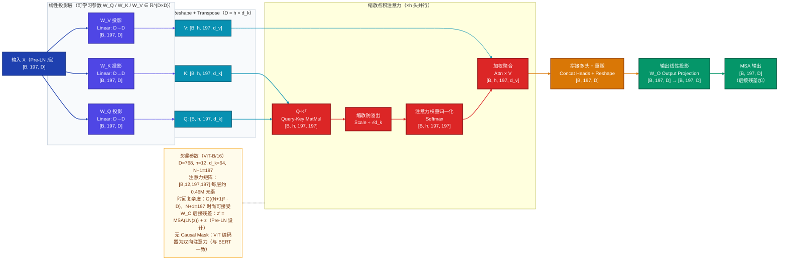
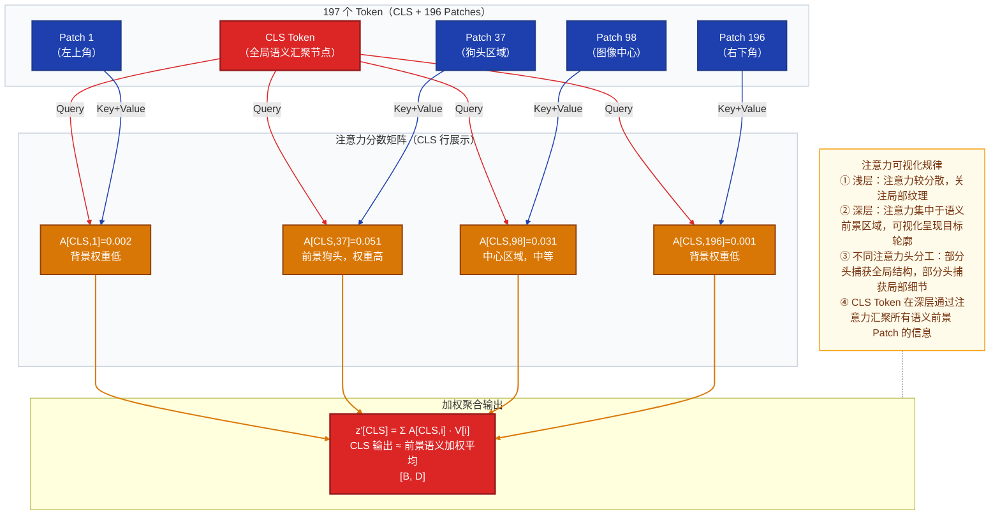

# Vision Transformer（ViT）技术分析文档

> **论文**：*An Image is Worth 16×16 Words: Transformers for Image Recognition at Scale*
> **作者**：Dosovitskiy et al.（Google Brain）
> **发表**：ICLR 2021

---

## 1. 模型定位

**ViT（Vision Transformer）** 是首个将纯 Transformer 架构直接应用于图像分类的模型，属于**计算机视觉 × 自然语言处理交叉**研究方向；其核心创新在于：将图像切分为固定大小的 Patch 序列，以类似处理单词的方式送入标准 Transformer 编码器，彻底摒弃卷积归纳偏置，证明「在足够大的数据规模下，纯注意力机制可以媲美甚至超越 CNN」。

---

## 2. 整体架构

### 2.1 三层拆解：ASCII 树形结构

```
ViT（Vision Transformer）
│
├── 功能模块 A：图像分块（Patch Splitting）
│   └── 子模块 A1：非重叠 Patch 切分
│       ├── 算子：reshape / unfold           将 [B,3,H,W] → [B,N,P²C]，固定 Patch 大小 P
│       └── 职责边界：仅做几何切分，不含可学习参数
│
├── 功能模块 B：嵌入层（Embedding Layer）
│   ├── 子模块 B1：Patch 线性投影
│   │   └── 算子：Linear(P²C → D)            可学习投影矩阵 E，将每个 Patch 压缩为 D 维向量
│   ├── 子模块 B2：[CLS] Token 拼接
│   │   └── 算子：torch.cat / prepend        在序列头部插入可学习分类向量，汇聚全局语义
│   └── 子模块 B3：位置编码注入
│       └── 算子：加法（element-wise add）    1D 可学习位置嵌入 E_pos ∈ ℝ^{(N+1)×D}，赋予空间位置信息
│
├── 功能模块 C：Transformer 编码器（Transformer Encoder ×L）
│   └── 子模块 C1：Pre-LN Transformer 块（串行堆叠 L 层）
│       ├── 算子：LayerNorm（前置归一化）      稳定梯度，Pre-LN 比 Post-LN 更易训练大模型
│       ├── 算子：Multi-Head Self-Attention   全局依赖建模，197 个 Token 互相注意
│       ├── 算子：残差连接（Residual Add）     梯度高速公路，缓解深层退化问题
│       ├── 算子：LayerNorm（前置归一化）      FFN 前再次归一化
│       ├── 算子：MLP（Linear-GELU-Linear）   特征非线性变换，隐层维度扩展 4×
│       └── 算子：残差连接（Residual Add）     保留原始特征，防止信息丢失
│
└── 功能模块 D：分类头（Classification Head）
    ├── 子模块 D1：CLS Token 提取
    │   └── 算子：index select（取 index=0）  仅取 [CLS] 表示，代表整图语义
    ├── 子模块 D2：最终层归一化
    │   └── 算子：LayerNorm                   对 CLS 表示稳定归一化后再投影
    └── 子模块 D3：线性分类投影
        └── 算子：Linear(D → K)               映射至 K 个类别 Logits（预训练时为 MLP，微调时为单层 Linear）
```

**模块间连接方式**：
- A → B → C → D：**严格串行**，数据沿序列方向逐步流动
- C 内部 L 个 Transformer 块：**串行堆叠**，每块输入即上块输出
- 每块内 MHSA / MLP：与**残差连接并行**（主路 + 残差路汇聚）

---

### 2.2 模型整体架构图

```mermaid
flowchart LR
    %% ── 配色主题 ─────────────────────────────────────────────────
    classDef inputStyle    fill:#1e40af,stroke:#1e3a8a,stroke-width:2px,color:#fff
    classDef embedStyle    fill:#4f46e5,stroke:#3730a3,stroke-width:2px,color:#fff
    classDef encoderStyle  fill:#0891b2,stroke:#155e75,stroke-width:2px,color:#fff
    classDef attnStyle     fill:#dc2626,stroke:#991b1b,stroke-width:2.5px,color:#fff
    classDef ffnStyle      fill:#d97706,stroke:#92400e,stroke-width:2px,color:#fff
    classDef headStyle     fill:#059669,stroke:#064e3b,stroke-width:2px,color:#fff
    classDef noteStyle     fill:#fffbeb,stroke:#f59e0b,stroke-width:1.5px,color:#78350f
    classDef layerStyle    fill:#f8fafc,stroke:#cbd5e0,stroke-width:1.5px

    INPUT_IMG["输入图像<br>Input Image<br>[B, 3, 224, 224]"]:::inputStyle

    subgraph PREPROC["① 图像分块（功能模块：切分为 N 个 Patch 序列）"]
        direction LR
        PATCH_SPLIT["Patch 切分<br>Patch Splitting<br>[B, N, P²·C]<br>N=196, P²·C=768"]:::inputStyle
    end
    class PREPROC layerStyle

    subgraph EMBED["② 嵌入层（功能模块：将 Patch 序列映射为 Token 表示）"]
        direction LR
        LINEAR_PROJ["线性投影<br>Linear Projection E<br>[B, N, D]"]:::embedStyle
        CLS_TOK["拼接 CLS Token<br>Prepend CLS Token<br>[B, N+1, D]"]:::embedStyle
        POS_EMB["加入位置编码<br>Add Positional Embedding E_pos<br>[B, N+1, D]"]:::embedStyle
    end
    class EMBED layerStyle

    subgraph ENCODER["③ Transformer 编码器（功能模块：全局上下文建模）"]
        direction TB
        subgraph BLOCK["③-1 Transformer 块 ×L（子模块：逐层提取多尺度语义）"]
            direction LR
            LN1["层归一化 1<br>LayerNorm 1<br>[B, N+1, D]"]:::encoderStyle
            MHSA["多头自注意力<br>Multi-Head Self-Attention<br>[B, N+1, D]"]:::attnStyle
            ADD1["残差连接 1<br>Residual Add<br>[B, N+1, D]"]:::encoderStyle
            LN2["层归一化 2<br>LayerNorm 2<br>[B, N+1, D]"]:::encoderStyle
            FFN["前馈网络<br>Feed-Forward Network<br>[B, N+1, D→4D→D]"]:::ffnStyle
            ADD2["残差连接 2<br>Residual Add<br>[B, N+1, D]"]:::encoderStyle
        end
    end
    class ENCODER layerStyle

    subgraph HEAD["④ 分类头（功能模块：将 CLS Token 映射为分类概率）"]
        direction LR
        LN_FINAL["层归一化<br>LayerNorm Final<br>[B, D]"]:::headStyle
        MLP_HEAD["线性分类层<br>Linear Classification Head<br>[B, K]"]:::headStyle
    end
    class HEAD layerStyle

    OUTPUT["预测类别概率<br>Class Probabilities<br>[B, K]"]:::headStyle

    INPUT_IMG --> PATCH_SPLIT
    PATCH_SPLIT --> LINEAR_PROJ
    LINEAR_PROJ --> CLS_TOK
    CLS_TOK --> POS_EMB
    POS_EMB -->|"[B, N+1, D]"| LN1
    LN1 --> MHSA
    MHSA --> ADD1
    ADD1 --> LN2
    LN2 --> FFN
    FFN --> ADD2
    ADD2 -.->|"×(L-1) 层循环"| LN1
    ADD2 -->|"取 CLS Token<br>[B, D]"| LN_FINAL
    LN_FINAL --> MLP_HEAD
    MLP_HEAD -->|"[B, K]"| OUTPUT

    NOTE["设计要点<br>① 完全去除卷积，线性投影将 Patch 直接映射为 Token，与 NLP Transformer 同构<br>② CLS Token 聚合全局语义，作为图像级表示（与 BERT 同源设计）<br>③ 1D 可学习位置嵌入（而非 2D 或正弦固定编码），实验证明效果相当<br>④ Pre-LN（先 LN 再注意力），训练更稳定，梯度方差更小"]:::noteStyle
    NOTE -.- ENCODER

    %% 边索引：0-13 主边，14 NOTE边，共 15 条
    linkStyle 0     stroke:#1e40af,stroke-width:2px
    linkStyle 1,2,3 stroke:#4f46e5,stroke-width:2px
    linkStyle 4,5,6,7,8,9 stroke:#0891b2,stroke-width:2px
    linkStyle 10    stroke:#dc2626,stroke-width:1.5px,stroke-dasharray:4 3
    linkStyle 11,12,13 stroke:#059669,stroke-width:2px
```



---

## 3. 数据直觉

以一张 **224×224 像素的金毛寻回犬（Golden Retriever）** 照片为例，完整追踪数据在模型中经历的每一步变化。

---

### 阶段 1：原始输入

```
原始图像：一张狗狗照片，JPEG 格式，分辨率 1920×1080
↓
预处理后（Resize + CenterCrop）：224×224 RGB 图像
像素值：uint8 [0, 255] → float32 [0.0, 1.0]
归一化后：减均值 [0.485, 0.456, 0.406]，除标准差 [0.229, 0.224, 0.225]
         → 像素值约在 [-2.1, 2.6] 范围内
张量形状：[1, 3, 224, 224]（Batch=1, RGB 3通道）
```

**这一步在表达什么**：将原始像素值缩放到训练数据集的统计分布范围，消除亮度、对比度差异的影响。

---

### 阶段 2：Patch 切分 + 线性投影

```
Patch 切分（P=16）：
  将 224×224 图像切成 14×14=196 个不重叠的 16×16 小块
  每个 Patch 含 16×16×3 = 768 个像素值
  形状：[1, 196, 768]

线性投影（E ∈ ℝ^{768×768}）：
  每个 768 维 Patch 向量 × 投影矩阵 E → 768 维嵌入向量
  形状：[1, 196, 768]
  
  示例（第 37 号 Patch，位于狗狗头部区域）：
    原始 Patch 像素：[0.72, -0.45, 1.23, 0.88, ...]（768 个值，含毛发橙黄色信息）
    投影后向量：[-0.31, 0.85, -1.12, 0.44, ...]（768 个值，语义压缩表示）
```

**这一步在表达什么**：线性投影将局部像素统计特征「翻译」为模型可处理的语义向量空间，类似于 NLP 中的词嵌入——每个 Patch 对应一个「视觉词元（Visual Token）」。

---

### 阶段 3：加入 [CLS] Token 与位置编码

```
拼接 [CLS] Token（可学习向量）：
  形状：[1, 197, 768]（第 0 个位置为 CLS，后 196 个为 Patch Token）

加入 1D 可学习位置编码 E_pos ∈ ℝ^{197×768}：
  每个 Token 的嵌入向量 += 对应位置的位置编码
  形状：[1, 197, 768]

位置 0（CLS）：学到的是「我是整图汇聚节点」的位置信息
位置 37（第 37 号 Patch，狗头区域）：学到的是「我在图像左上 1/4 区域」的位置信息
```

**这一步在表达什么**：Patch 序列本身不含空间位置信息（如同打乱单词顺序的句子），位置编码注入后，模型才能区分「左上角的毛发」与「右下角的草地」，位置嵌入矩阵可视化后呈现明显的二维网格相似性结构。

---

### 阶段 4：Transformer 编码器（关键中间表示）

```
初始状态（第 0 层输入）：
  [CLS]    → 197 个 Token 尚未交互，CLS 仅包含初始化信息
  Patch_37 → 仅含局部毛发颜色信息，不知道整图语义

经过第 1 层 Transformer 块后：
  注意力矩阵 A ∈ ℝ^{197×197}（多头之一示例）：
    CLS 的注意力分布：约 30% 权重集中在背景天空区域，约 50% 在狗身上
    Patch_37 开始「看到」相邻 Patch（狗脸附近区域）

经过第 6 层（中间层）后：
  CLS Token 已聚合中层语义（纹理、局部形状）
  注意力逐渐向前景对象（狗）集中，背景权重降低

经过第 12 层（最后层，ViT-B）后：
  CLS Token 向量 z_L^0 ∈ ℝ^{768}：
    高度压缩的图像级语义表示
    余弦相似度与「狗」类别中心最近，远离「猫」「汽车」等类别中心
    注意力图（Attention Rollout）：清晰勾勒出狗的轮廓，背景权重几乎为零
```

**这一步在表达什么**：每一层 Transformer 逐步将局部像素信息「融合」为全局语义信息。浅层学习颜色/纹理，中层学习形状/部件，深层表示抽象语义类别。全局自注意力机制使得任意两个 Patch 之间可以一步交互，而 CNN 需要堆叠多层卷积才能实现感受野的全局覆盖。

---

### 阶段 5：输出与后处理

```
模型原始输出：
  取 z_L^0（CLS Token）经 LayerNorm 后 → Linear(768 → 1000)
  Logits：[1, 1000] 的实数向量
  示例（部分类别的 logit 值）：
    class 207（Golden Retriever）：logit = 8.73
    class 208（Labrador Retriever）：logit = 6.21
    class 275（Italian Greyhound）：logit = 2.45
    class 0（tench，一种鱼）：logit = -3.12
    
Softmax 后处理：
  class 207（Golden Retriever）：probability ≈ 92.3%
  class 208（Labrador Retriever）：probability ≈  6.1%
  其余 998 类：probability ≈  1.6%（合计）

最终输出：
  预测标签：Golden Retriever（金毛寻回犬）
  置信度：92.3%
  Top-5 预测：Golden Retriever, Labrador, Flat-Coated Retriever, Cocker Spaniel, Irish Setter
```

---

## 4. 核心数据流

### 4.1 完整张量维度变化路径

以 ViT-B/16 为例（D=768，L=12，h=12，patch_size=16）：

```
输入图像           [B, 3, 224, 224]
       ↓ Patch 切分（reshape/unfold，P=16，N=H·W/P²）
Patch 序列         [B, 196, 768]      ← 196=14×14，768=16×16×3
       ↓ 线性投影（E ∈ ℝ^{768×768}）
Patch 嵌入         [B, 196, 768]      ← 维度不变，但语义空间发生变换
       ↓ 拼接 [CLS] Token（cat）
含 CLS 序列        [B, 197, 768]      ← N+1 个 Token
       ↓ 加入位置编码（E_pos ∈ ℝ^{197×768}，element-wise add）
带位置信息序列      [B, 197, 768]      ← 维度不变，空间信息注入
       ↓ × L 层 Transformer 块（维度恒定）
       │
       ├── LayerNorm              [B, 197, 768]
       ├── Q/K/V 线性投影          [B, 197, 768] × 3
       ├── 拆分多头（h=12, d_k=64） [B, 12, 197, 64]
       ├── 注意力矩阵 QKᵀ          [B, 12, 197, 197]  ← 计算瓶颈 O(N²)
       ├── Softmax                [B, 12, 197, 197]
       ├── 加权求和 AV             [B, 12, 197, 64]
       ├── 合并多头                [B, 197, 768]
       ├── 输出投影 W_O            [B, 197, 768]
       ├── 残差加                 [B, 197, 768]
       ├── LayerNorm              [B, 197, 768]
       ├── FFN Linear(768→3072)   [B, 197, 3072]
       ├── GELU 激活              [B, 197, 3072]
       ├── FFN Linear(3072→768)   [B, 197, 768]
       └── 残差加                 [B, 197, 768]
       ↓
编码输出            [B, 197, 768]
       ↓ 取 index=0（CLS Token）
CLS 表示           [B, 768]           ← 图像级全局语义向量
       ↓ LayerNorm
归一化 CLS          [B, 768]
       ↓ 线性分类头（Linear(768 → K)）
Logits             [B, K]             ← K=1000（ImageNet）
       ↓ Softmax（推理时）
类别概率            [B, K]
       ↓ argmax
预测类别标签         [B]               ← 整数类别索引
```

---

### 4.2 前向传播 / 张量流图

```mermaid
flowchart LR
    %% ── 配色主题 ─────────────────────────────────────────────────
    classDef inputStyle    fill:#1e40af,stroke:#1e3a8a,stroke-width:2px,color:#fff
    classDef embedStyle    fill:#4f46e5,stroke:#3730a3,stroke-width:2px,color:#fff
    classDef procStyle     fill:#0891b2,stroke:#155e75,stroke-width:2px,color:#fff
    classDef attnStyle     fill:#dc2626,stroke:#991b1b,stroke-width:2.5px,color:#fff
    classDef headStyle     fill:#059669,stroke:#064e3b,stroke-width:2px,color:#fff
    classDef noteStyle     fill:#fffbeb,stroke:#f59e0b,stroke-width:1.5px,color:#78350f
    classDef layerStyle    fill:#f8fafc,stroke:#cbd5e0,stroke-width:1.5px

    INPUT_T["图像张量<br>[B, 3, 224, 224]"]:::inputStyle

    subgraph EMBT["嵌入层 Embedding Layer"]
        direction LR
        PATCH_T["Patch 切分<br>Patch Splitting<br>[B, 196, 768]"]:::embedStyle
        PROJ_T["线性投影<br>Linear Projection E<br>[B, 196, D]"]:::embedStyle
        CLS_T["拼接 CLS Token<br>Prepend CLS<br>[B, 197, D]"]:::embedStyle
        POSE_T["加入位置编码<br>Add Pos Embedding<br>[B, 197, D]"]:::embedStyle
    end
    class EMBT layerStyle

    subgraph BLOCKT["Transformer Block ×L（逐层堆叠）"]
        direction LR
        LN1T["层归一化 1<br>LayerNorm<br>[B, 197, D]"]:::procStyle
        MHSAT["多头自注意力<br>Multi-Head Self-Attention<br>[B, 197, D] → [B, 197, D]"]:::attnStyle
        ADD1T["残差连接 1<br>Residual Add<br>[B, 197, D]"]:::procStyle
        LN2T["层归一化 2<br>LayerNorm<br>[B, 197, D]"]:::procStyle
        FFNT["前馈网络<br>FFN: Linear→GELU→Linear<br>[B, 197, D→4D→D]"]:::procStyle
        ADD2T["残差连接 2<br>Residual Add<br>[B, 197, D]"]:::procStyle
    end
    class BLOCKT layerStyle

    subgraph EXTT["特征提取 Feature Extraction"]
        direction LR
        CLSEXT["取 CLS Token<br>Extract index=0<br>[B, D]"]:::headStyle
        LNOUT["层归一化<br>LayerNorm Final<br>[B, D]"]:::headStyle
    end
    class EXTT layerStyle

    MLP_T["线性分类头<br>Linear Head: D→K<br>[B, K]"]:::headStyle
    OUTT["Softmax 输出<br>Class Probabilities<br>[B, K]"]:::headStyle

    INPUT_T --> PATCH_T
    PATCH_T --> PROJ_T
    PROJ_T --> CLS_T
    CLS_T --> POSE_T
    POSE_T -->|"嵌入序列 [B, 197, D]"| LN1T
    LN1T --> MHSAT
    MHSAT --> ADD1T
    ADD1T --> LN2T
    LN2T --> FFNT
    FFNT --> ADD2T
    ADD2T -.->|"×(L-1) 层循环"| LN1T
    ADD2T --> CLSEXT
    CLSEXT --> LNOUT
    LNOUT -->|"[B, D]"| MLP_T
    MLP_T -->|"[B, K]"| OUTT

    NOTET["张量流要点<br>① Patch 切分：无参数操作，将 [B,3,H,W] 重塑为 [B,N,P²C]<br>② 每层 Transformer 内维度始终保持 [B, N+1, D]，只有 FFN 内部临时扩展 4×<br>③ 注意力矩阵 [B, h, 197, 197] 是显存瓶颈，随序列长度平方增长<br>④ 仅 CLS Token（index=0）参与最终分类，其余 196 个 Patch Token 丢弃"]:::noteStyle
    NOTET -.- BLOCKT

    %% 边索引：0-14 主边，15 NOTE边，共 16 条
    linkStyle 0     stroke:#1e40af,stroke-width:2px
    linkStyle 1,2,3,4 stroke:#4f46e5,stroke-width:2px
    linkStyle 5,6,7,8,9,10 stroke:#0891b2,stroke-width:2px
    linkStyle 11    stroke:#dc2626,stroke-width:1.5px,stroke-dasharray:4 3
    linkStyle 12,13 stroke:#059669,stroke-width:2px
    linkStyle 14,15 stroke:#059669,stroke-width:2.5px
```



---

## 5. 关键组件

### 5.1 Patch Embedding（图像分块嵌入）

#### 直觉

把一张图像类比成一篇文章：**每个 16×16 的图像块就是一个「单词」**，线性投影矩阵就是「词典」，负责将像素语言翻译成模型能理解的语义向量。这是 ViT 最核心的工程决策，一步实现了「图像 → 序列」的格式转换。

#### 计算原理

给定输入图像 $\mathbf{x} \in \mathbb{R}^{H \times W \times C}$，Patch 大小为 $P \times P$：

**步骤 1：切分为 N 个 Patch**

$$N = \frac{H \times W}{P^2}, \quad \mathbf{x}_p^i \in \mathbb{R}^{P^2 \cdot C}, \quad i = 1, 2, \ldots, N$$

以 ViT-B/16 为例：$N = \frac{224 \times 224}{16^2} = 196$，每个 Patch 为 $768$ 维向量。

**步骤 2：线性投影**

$$\mathbf{z}_i = \mathbf{x}_p^i \mathbf{E}, \quad \mathbf{E} \in \mathbb{R}^{(P^2 C) \times D}$$

**步骤 3：拼接 [CLS] Token 并加位置编码**

$$\mathbf{z}_0 = \left[ \mathbf{x}_{\text{cls}}; \, \mathbf{x}_p^1 \mathbf{E}; \, \mathbf{x}_p^2 \mathbf{E}; \, \cdots; \, \mathbf{x}_p^N \mathbf{E} \right] + \mathbf{E}_{\text{pos}}$$

其中 $\mathbf{x}_{\text{cls}} \in \mathbb{R}^D$ 是可学习的分类向量，$\mathbf{E}_{\text{pos}} \in \mathbb{R}^{(N+1) \times D}$ 是可学习的 1D 位置嵌入矩阵。

> **为什么选 1D 位置编码而非 2D？** 论文消融实验表明，1D、2D 和相对位置编码的性能差异极小（< 0.1%），说明 Transformer 可以从数据中自行学习 2D 空间关系，无需手动注入 2D 归纳偏置。

---

### 5.2 Multi-Head Self-Attention（多头自注意力）

#### 直觉

自注意力机制本质上是让序列中每个 Token **「问一遍所有 Token 它们有多重要」**，然后按重要性加权求和。对于图像 Token，这意味着每个 Patch 可以直接关注任意位置的其他 Patch——无论它们在空间上多远——这正是 CNN 卷积无法做到的全局感受野。

#### 计算原理

输入 $\mathbf{Z} \in \mathbb{R}^{(N+1) \times D}$，多头注意力拥有 $h$ 个注意力头，每头维度 $d_k = D/h$：

**单头注意力（Scaled Dot-Product Attention）**：

$$\text{Attention}(\mathbf{Q}, \mathbf{K}, \mathbf{V}) = \text{softmax}\!\left(\frac{\mathbf{Q}\mathbf{K}^\top}{\sqrt{d_k}}\right)\mathbf{V}$$

其中：

$$\mathbf{Q} = \mathbf{Z}\mathbf{W}^Q, \quad \mathbf{K} = \mathbf{Z}\mathbf{W}^K, \quad \mathbf{V} = \mathbf{Z}\mathbf{W}^V$$
$$\mathbf{W}^Q, \mathbf{W}^K, \mathbf{W}^V \in \mathbb{R}^{D \times d_k}$$

**多头注意力**：

$$\text{MultiHead}(\mathbf{Q}, \mathbf{K}, \mathbf{V}) = \text{Concat}(\text{head}_1, \ldots, \text{head}_h)\mathbf{W}^O$$

$$\text{head}_i = \text{Attention}(\mathbf{Z}\mathbf{W}_i^Q, \mathbf{Z}\mathbf{W}_i^K, \mathbf{Z}\mathbf{W}_i^V)$$

**计算复杂度分析**：

- 时间复杂度：$O(N^2 D)$，其中注意力矩阵 $QK^\top \in \mathbb{R}^{N \times N}$ 是瓶颈
- 空间复杂度：注意力矩阵占用 $O(N^2)$ 显存
- ViT-B/16 的注意力矩阵：$[B, 12, 197, 197] \approx 0.46M$ 浮点数（单样本）

> **缩放因子 $\sqrt{d_k}$ 的作用**：当 $d_k$ 较大时，$QK^\top$ 的内积会进入极大或极小值域，导致 softmax 梯度消失。除以 $\sqrt{d_k}$ 将内积方差控制在单位量级，保证梯度稳定。

---

### 5.3 Pre-LN Transformer Block（前置归一化的 Transformer 块）

#### 直觉

Pre-LN 把「调音」（归一化）放在了「演奏」（注意力/MLP）之前，而非之后。这个看似微小的调整，使得梯度能够通过残差连接**直接回传到浅层**，不再受到深层 LN 操作的阻断，极大提升了深层 ViT 的训练稳定性。

#### 计算原理

ViT 使用 Pre-LN（而非原始 Transformer 的 Post-LN）：

**注意力子层**：

$$\mathbf{z}'_\ell = \text{MSA}\!\left(\text{LN}(\mathbf{z}_{\ell-1})\right) + \mathbf{z}_{\ell-1}$$

**前馈子层**：

$$\mathbf{z}_\ell = \text{MLP}\!\left(\text{LN}(\mathbf{z}'_\ell)\right) + \mathbf{z}'_\ell$$

**MLP 内部结构**：

$$\text{MLP}(\mathbf{x}) = \text{GELU}\!\left(\mathbf{x}\mathbf{W}_1 + \mathbf{b}_1\right)\mathbf{W}_2 + \mathbf{b}_2$$

其中 $\mathbf{W}_1 \in \mathbb{R}^{D \times 4D}$，$\mathbf{W}_2 \in \mathbb{R}^{4D \times D}$，内部维度扩展 4 倍增强表达能力。

**最终分类**（取 $\ell = L$ 时 CLS Token 的输出）：

$$\mathbf{y} = \text{LN}(\mathbf{z}_L^0)$$

其中 $\mathbf{z}_L^0$ 表示第 $L$ 层输出中 index=0 的 CLS Token 向量。

> **Pre-LN 梯度分析**：Post-LN 中，梯度需要穿越 LN 才能到达残差路径，LN 的归一化操作会改变梯度的尺度，容易导致深层网络梯度爆炸或消失。Pre-LN 中，残差路径始终是畅通的恒等映射，$\partial \mathbf{z}_\ell / \partial \mathbf{z}_0 = \mathbf{I} + \text{...}$，梯度范数上限更稳定。

---

### 5.4 模块内部结构图（Multi-Head Self-Attention）



---

### 5.5 注意力机制可视化图（Attention 信息流）



---

## 6. 训练策略

### 6.1 两阶段训练范式

ViT 的训练分为**大规模预训练**和**下游微调**两个阶段，这是与 CNN 最大的训练策略差异。

#### 阶段一：大规模预训练

| 配置项 | ViT-B/16 | ViT-L/16 | ViT-H/14 |
|--------|----------|----------|----------|
| 预训练数据 | ImageNet-21k（14M）| ImageNet-21k / JFT-300M | JFT-300M |
| 输入分辨率 | 224×224 | 224×224 | 224×224 |
| 批次大小 | 4096 | 4096 | 4096 |
| 优化器 | Adam | Adam | Adam |
| 学习率 | 8e-4（ViT-B） | 6e-4（ViT-L） | 4e-4（ViT-H） |
| 权重衰减 | 0.1 | 0.1 | 0.1 |
| 预热步数 | 10,000 | 10,000 | 10,000 |
| 学习率调度 | 线性预热 + 余弦衰减 | 同左 | 同左 |
| 训练 Epoch | 90（JFT-300M 约 7 Epoch） | 同左 | 同左 |
| Dropout | 0.1 | 0.1 | 0.1 |

#### 阶段二：下游微调

微调时使用**更高分辨率**（384×384），位置编码通过 2D 双线性插值适配新序列长度：

```
预训练位置编码：E_pos ∈ ℝ^{197×768}（196=14×14 patches）
微调高分辨率：输入 384×384，Patch 数量 N=576=24×24
插值方式：将 14×14 的 2D 位置编码 grid 双线性插值到 24×24
```

| 配置项 | 微调策略 |
|--------|---------|
| 优化器 | SGD（momentum=0.9）或 AdamW |
| 学习率 | 比预训练小 10-100× |
| 分类头 | 替换为 Linear(D → K_downstream)，随机初始化 |
| Dropout | 关闭或设为 0 |
| 训练 Epoch | 通常 10-30 epoch |

---

### 6.2 损失函数

预训练和微调均使用**带标签平滑（Label Smoothing）的交叉熵损失**：

$$\mathcal{L} = -\sum_{k=1}^{K} \tilde{y}_k \log p_k$$

其中 $\tilde{y}_k = (1 - \epsilon) \cdot y_k + \frac{\epsilon}{K}$，$\epsilon = 0.1$ 为标签平滑系数，$y_k$ 为 one-hot 标签。

**标签平滑的作用**：防止模型对训练集过度自信（logit 值过大），提升泛化能力，尤其对大模型效果显著。

---

### 6.3 关键训练技巧

| 技巧 | 描述 | 作用 |
|------|------|------|
| **Stochastic Depth（随机深度）** | 训练时以概率 $p$ 随机跳过某些 Transformer 块 | 正则化，相当于对深度做随机 Dropout |
| **MixUp / CutMix** | 混合两个样本的像素或区域及其标签 | 数据增强，提升对边界区域的泛化 |
| **RandAugment** | 从增强操作库随机采样 N 种增强 | 减少手工调参，增强多样性 |
| **Warmup + Cosine Decay** | 前 10k 步线性增大 LR，之后余弦衰减 | 大批量训练时避免初期梯度爆炸 |
| **梯度裁剪** | `max_norm=1.0` | 防止注意力层梯度爆炸 |
| **EMA（指数移动平均）** | 维护模型权重的移动平均版本用于推理 | 平滑参数更新，提升最终性能 0.1-0.3% |

---

### 6.4 训练流程图

```mermaid
flowchart LR
    %% ── 配色主题 ─────────────────────────────────────────────────
    classDef dataStyle     fill:#1e40af,stroke:#1e3a8a,stroke-width:2px,color:#fff
    classDef forwardStyle  fill:#0891b2,stroke:#155e75,stroke-width:2px,color:#fff
    classDef lossStyle     fill:#dc2626,stroke:#991b1b,stroke-width:2.5px,color:#fff
    classDef backwardStyle fill:#d97706,stroke:#92400e,stroke-width:2px,color:#fff
    classDef optStyle      fill:#7c3aed,stroke:#4c1d95,stroke-width:2px,color:#fff
    classDef evalStyle     fill:#059669,stroke:#064e3b,stroke-width:2px,color:#fff
    classDef ctrlStyle     fill:#374151,stroke:#111827,stroke-width:2px,color:#fff
    classDef noteStyle     fill:#fffbeb,stroke:#f59e0b,stroke-width:1.5px,color:#78350f
    classDef layerStyle    fill:#f8fafc,stroke:#cbd5e0,stroke-width:1.5px

    PTDATA[("大规模预训练数据集<br>JFT-300M / ImageNet-21k")]:::dataStyle
    FTDATA[("下游微调数据集<br>ImageNet-1k / CIFAR-100")]:::dataStyle

    subgraph LOADERV["数据加载 Data Loading"]
        direction LR
        DLV["DataLoader<br>大批量采样 (B=4096)"]:::dataStyle
        AUGV["在线数据增强<br>RandAugment + MixUp + CutMix"]:::dataStyle
    end
    class LOADERV layerStyle

    subgraph FORWARDV["前向传播 Forward Pass"]
        direction LR
        FWV["ViT 前向<br>Patch Embed → Transformer ×L → MLP Head"]:::forwardStyle
        PREDV["预测 Logits<br>[B, K]"]:::forwardStyle
    end
    class FORWARDV layerStyle

    LOSSV["交叉熵损失（含标签平滑 ε=0.1）<br>Cross-Entropy + Label Smoothing<br>预训练期：多类分类 Loss"]:::lossStyle

    subgraph BACKWARDV["反向传播 Backward Pass"]
        direction LR
        BWV["loss.backward()<br>混合精度 AMP（fp16）"]:::backwardStyle
        CLIPV["梯度裁剪<br>Gradient Clip max_norm=1.0"]:::backwardStyle
    end
    class BACKWARDV layerStyle

    subgraph OPTIMV["参数更新 Optimization"]
        direction LR
        OPTV["Adam (β₁=0.9, β₂=0.999)<br>权重衰减 wd=0.1"]:::optStyle
        LRSV["线性预热(10k步) + 余弦衰减<br>Linear Warmup + Cosine Decay"]:::optStyle
        ZEROV["梯度清零<br>zero_grad()"]:::optStyle
    end
    class OPTIMV layerStyle

    subgraph EVALV["验证评估（每 Epoch 触发）"]
        direction LR
        VALV["验证集前向<br>with torch.no_grad()"]:::evalStyle
        METRICV["Top-1 / Top-5 准确率"]:::evalStyle
        CKPTV["保存最优检查点<br>+ EMA 模型权重"]:::evalStyle
    end
    class EVALV layerStyle

    DONEV["预训练完成 → 切换微调阶段<br>替换分类头，调整分辨率"]:::ctrlStyle

    PTDATA --> DLV
    FTDATA --> DLV
    DLV --> AUGV
    AUGV -->|"Batch [B, 3, H, W]"| FWV
    FWV --> PREDV
    PREDV --> LOSSV
    LOSSV --> BWV
    BWV --> CLIPV
    CLIPV --> OPTV
    OPTV --> LRSV
    LRSV --> ZEROV
    ZEROV -.->|"下一个 Batch"| DLV
    OPTV -->|"每 Epoch 触发"| VALV
    VALV --> METRICV
    METRICV --> CKPTV
    CKPTV -.->|"微调阶段切换"| DONEV

    NOTEV["训练策略要点<br>① 预训练：大批量 4096，大 LR（8e-4），Adam 优化器<br>② 微调：小 LR（比预训练低 10-100×），更高分辨率（384×384）<br>③ 混合精度（AMP）：fp16 前向 + fp32 梯度累积，节省 50% 显存<br>④ 位置编码插值：分辨率变化时做 2D 双线性插值对齐序列长度<br>⑤ Stochastic Depth：随机跳过层，等效于对网络深度做 Dropout"]:::noteStyle
    NOTEV -.- OPTIMV

    %% 边索引：0-15 主边，16 NOTE边，共 17 条
    linkStyle 0,1,2,3 stroke:#1e40af,stroke-width:2px
    linkStyle 4,5     stroke:#0891b2,stroke-width:2px
    linkStyle 6,7,8   stroke:#dc2626,stroke-width:2px
    linkStyle 9,10    stroke:#7c3aed,stroke-width:2px
    linkStyle 11      stroke:#7c3aed,stroke-width:1.5px,stroke-dasharray:4 3
    linkStyle 12,13,14 stroke:#059669,stroke-width:2px
    linkStyle 15      stroke:#059669,stroke-width:1.5px,stroke-dasharray:4 3
```



---

## 7. 评估指标与性能对比

### 7.1 主要评估指标

| 指标 | 含义 | 选用原因 |
|------|------|---------|
| **Top-1 Accuracy** | 预测概率最高的类别是否正确 | ImageNet 标准评测指标，反映模型整体分类能力 |
| **Top-5 Accuracy** | Top-5 预测中是否包含正确类别 | 衡量模型在易混淆类别间的辨别力 |
| **ImageNet-ReaL** | 使用重新标注（ReaL）的标签计算准确率 | 原始 ImageNet 标签存在噪声，ReaL 更贴近真实性能 |
| **FLOPs** | 前向传播乘加运算量 | 反映计算效率，用于与 CNN 的效率对比 |
| **参数量 (Params)** | 可学习参数总数 | 衡量模型容量与存储成本 |
| **TPU 核时（Core-days）** | 训练所需的 TPU 计算资源 | 评估训练成本，对工业应用至关重要 |

---

### 7.2 核心 Benchmark 性能对比

**ImageNet Top-1 准确率（无额外测试增强）**：

| 模型 | 参数量 | 预训练数据 | ImageNet Top-1 | FLOPs |
|------|-------|-----------|---------------|-------|
| ResNet-152 | 60M | IN-1k | 78.3% | 11.6G |
| EfficientNet-B7 | 66M | IN-1k | 84.3% | 37.0G |
| BiT-L (ResNet-152×4) | 928M | JFT-300M | 87.5% | — |
| **ViT-B/16** | **86M** | **IN-21k** | **81.8%** | **17.6G** |
| **ViT-L/16** | **307M** | **IN-21k** | **82.2%** | **63.6G** |
| **ViT-L/16** | **307M** | **JFT-300M** | **87.8%** | **63.6G** |
| **ViT-H/14** | **632M** | **JFT-300M** | **88.5%** | **190.4G** |

> **关键洞察**：ViT-B/16 在 ImageNet-21k（约 14M 图像）上预训练后，性能与相近参数量的 EfficientNet 相当；只有在 JFT-300M（约 300M 图像）规模的数据下，ViT-L/16 和 ViT-H/14 才能超越最强 CNN 基线。这印证了「ViT 需要大量数据弥补卷积归纳偏置缺失」的核心论断。

---

### 7.3 关键消融实验

**（1）数据集规模的影响**（ViT-L/16）

| 预训练数据集 | 规模 | ImageNet Top-1 |
|------------|------|---------------|
| ImageNet-1k | 1.3M | 76.5%（低于 ResNet！） |
| ImageNet-21k | 14M | 82.2% |
| JFT-300M | 300M | 87.8% |

**结论**：数据规模从 1.3M 增大到 300M，准确率提升超 11 个百分点，证明大数据是 ViT 的核心驱动力。

**（2）模型规模的影响**（JFT-300M 预训练）

| 模型 | 参数量 | ImageNet Top-1 | JFT 训练计算量 |
|------|-------|---------------|-------------|
| ViT-B/16 | 86M | 84.2% | 0.24K TPU-days |
| ViT-L/16 | 307M | 87.8% | 0.68K TPU-days |
| ViT-H/14 | 632M | 88.5% | 2.50K TPU-days |

**（3）位置编码类型消融**（ViT-B/16，IN-21k）

| 位置编码类型 | ImageNet Top-1 |
|------------|---------------|
| 无位置编码 | 61.4%（严重退化！） |
| 1D 可学习（ViT 默认） | 81.0% |
| 2D 可学习 | 81.1% |
| 相对位置编码 | 80.9% |

**结论**：1D/2D/相对编码性能相近，但无位置编码性能灾难性下降。

**（4）输入 Patch 大小消融**（JFT-300M）

| Patch 大小 | 序列长度 N | FLOPs | ImageNet Top-1 |
|-----------|---------|-------|---------------|
| 32×32 | 49 | 4.2G | 83.7% |
| 16×16 | 196 | 17.6G | 84.2% |
| 14×14 | 256 | 190.4G | 88.5%（ViT-H） |

---

## 8. 推理与部署

### 8.1 训练与推理阶段差异

| 组件 | 训练阶段 | 推理阶段 |
|------|---------|---------|
| **Dropout** | 开启（p=0.1，注意力和 MLP 均有） | **关闭**（`model.eval()` 自动处理） |
| **Stochastic Depth** | 开启（随机跳过层） | **关闭**（所有层参与计算） |
| **标签平滑** | 参与 Loss 计算 | **无关**（推理不计算 Loss） |
| **MixUp/CutMix** | 在 Collate 阶段混合样本 | **不使用** |
| **分类输出** | 直接输出 Logits 计算 Cross-Entropy | **+Softmax** → 概率输出（或直接 argmax Logits） |
| **BatchNorm** | **ViT 不使用 BatchNorm**（仅 LayerNorm） | **无影响**（LN 统计量不依赖批次） |

> **重要说明**：ViT 全程使用 LayerNorm 而非 BatchNorm，推理阶段无需切换 BN 的 eval 模式（不累积 running mean/var），这是 ViT 相比 CNN 部署更简洁的一个优点。

---

### 8.2 高分辨率推理与位置编码插值

ViT 在微调时通常采用更高输入分辨率（384×384 而非预训练时的 224×224）以提升精度。此时 Patch 数量从 196 变为 576，位置编码需要做插值：

$$\mathbf{E}_{\text{pos}}^{\text{new}} = \text{Interpolate}_{2D}\!\left(\mathbf{E}_{\text{pos}}^{\text{orig}},\, (14 \times 14) \to (24 \times 24)\right)$$

具体实现：将原始 $196 \times D$ 的位置编码矩阵（CLS 除外）reshape 为 $14 \times 14 \times D$ 的特征图，用双线性插值缩放至 $24 \times 24 \times D$，再 reshape 回 $576 \times D$，与 CLS 编码拼接得到 $577 \times D$ 的新位置编码。

---

### 8.3 常见部署优化

| 优化手段 | 描述 | 典型收益 |
|---------|------|---------|
| **INT8 量化** | 将权重和激活从 fp32/fp16 量化为 int8 | 模型大小 ↓ 75%，推理速度 ↑ 2-4× |
| **FP16 混合精度** | 推理时使用 fp16（Tensor Core 加速） | 推理速度 ↑ 1.5-2×，显存 ↓ 50% |
| **ONNX 导出** | 将 PyTorch 模型导出为 ONNX 格式 | 跨框架部署（TensorRT/ONNX Runtime） |
| **TensorRT 优化** | 融合算子、选择最优 kernel、fp16/int8 | 端到端推理速度 ↑ 3-5× |
| **知识蒸馏（DeiT）** | 以 ViT 为教师，训练轻量级学生模型 | 在 ImageNet 上 79.9% 仅需 22M 参数 |
| **剪枝（Token Pruning）** | 逐层剔除不重要的 Patch Token | FLOPs 降低 30-50%，精度损失 < 0.5% |
| **Flash Attention** | 分块计算注意力，避免 $O(N^2)$ 显存 | 长序列推理显存 ↓ 5-10×，速度 ↑ 2-4× |
| **Vision Transformer 专用加速库** | xFormers、timm 内置融合算子 | 显存效率提升，推理速度提升 |

---

### 8.4 数据处理流水线图

```mermaid
flowchart LR
    %% ── 配色主题 ─────────────────────────────────────────────────
    classDef rawStyle      fill:#374151,stroke:#111827,stroke-width:2px,color:#fff
    classDef prepStyle     fill:#4f46e5,stroke:#3730a3,stroke-width:2px,color:#fff
    classDef augStyle      fill:#d97706,stroke:#92400e,stroke-width:2px,color:#fff
    classDef batchStyle    fill:#0891b2,stroke:#155e75,stroke-width:2px,color:#fff
    classDef outputStyle   fill:#059669,stroke:#064e3b,stroke-width:2px,color:#fff
    classDef noteStyle     fill:#fffbeb,stroke:#f59e0b,stroke-width:1.5px,color:#78350f
    classDef layerStyle    fill:#f8fafc,stroke:#cbd5e0,stroke-width:1.5px

    subgraph RAWP["原始数据 Raw Data"]
        direction LR
        IMGR[("图像文件<br>JPEG / PNG")]:::rawStyle
        ANNR[("类别标签<br>JSON / TXT")]:::rawStyle
        SPLITR[("数据集划分<br>train / val / test")]:::rawStyle
    end
    class RAWP layerStyle

    subgraph PREPP["离线预处理（一次性执行）"]
        direction LR
        RESIZEP["尺寸归一化<br>Resize → 256×256<br>（推理时直接 CenterCrop 224）"]:::prepStyle
        NORMP["像素标准化<br>Normalize<br>mean=[0.485,0.456,0.406]<br>std=[0.229,0.224,0.225]"]:::prepStyle
        CACHEP[("特征缓存<br>LMDB / WebDataset")]:::prepStyle
    end
    class PREPP layerStyle

    subgraph AUGP["在线数据增强（训练时开启，验证/推理关闭）"]
        direction LR
        CROPA["随机裁剪<br>RandomResizedCrop(224)<br>scale=(0.08, 1.0)"]:::augStyle
        FLIPA["随机水平翻转<br>RandomHorizontalFlip"]:::augStyle
        RAA["随机增强<br>RandAugment(N=2, M=9)"]:::augStyle
        MIXUPA["样本混合<br>MixUp(α=0.8) / CutMix(α=1.0)"]:::augStyle
        ERASEA["随机擦除<br>RandomErasing(p=0.25)"]:::augStyle
    end
    class AUGP layerStyle

    subgraph BATCHP["批次化 Batching"]
        direction LR
        COLLATEP["Collate Function<br>标签软化（MixUp 时生成软标签）"]:::batchStyle
        PINP["Pin Memory<br>页面锁定内存传输"]:::batchStyle
        WORKP["多进程加载<br>num_workers=8"]:::batchStyle
    end
    class BATCHP layerStyle

    MODELINP["模型输入<br>Tensor [B, 3, 224, 224]<br>+ 软标签 [B, K]（MixUp 时）"]:::outputStyle

    IMGR --> RESIZEP
    ANNR --> SPLITR
    SPLITR --> RESIZEP
    RESIZEP --> NORMP
    NORMP --> CACHEP
    CACHEP --> CROPA
    CROPA --> FLIPA
    FLIPA --> RAA
    RAA --> ERASEA
    ERASEA --> MIXUPA
    MIXUPA --> COLLATEP
    COLLATEP --> PINP
    PINP --> WORKP
    WORKP -->|"GPU 异步传输 non_blocking=True"| MODELINP

    NOTEP["ViT 数据管道要点<br>① 验证 / 推理时仅做 Resize(256) + CenterCrop(224) + Normalize，不做增强<br>② RandAugment 是 ViT 训练关键增强，与 CNN 的手工增强策略不同<br>③ MixUp 在 Collate 阶段操作：混合一批样本的像素及其 one-hot 标签<br>④ 对于 384×384 微调：Resize 改为 480，CenterCrop 改为 384<br>⑤ WebDataset 格式优化：流式读取，适合 JFT 等超大数据集的分布式训练"]:::noteStyle
    NOTEP -.- AUGP

    %% 边索引：0-13 主边，14 NOTE边，共 15 条
    linkStyle 0,1,2   stroke:#374151,stroke-width:2px
    linkStyle 3,4     stroke:#4f46e5,stroke-width:2px
    linkStyle 5,6,7,8,9,10 stroke:#d97706,stroke-width:2px
    linkStyle 11,12,13 stroke:#0891b2,stroke-width:2px
    linkStyle 14      stroke:#059669,stroke-width:2.5px
```



---

## 9. FAQ（常见问题解答）

### 基本原理类

---

**Q1：ViT 的核心直觉是什么？为什么把图像切成 Patch 而不是像素？**

**A**：ViT 的核心直觉是「将图像视为单词序列」。如果将每个像素视为一个 Token，224×224 图像就有 50,176 个 Token，注意力矩阵会达到 $50176^2 \approx 2.5 \times 10^9$ 个元素，完全不可行。切成 16×16 的 Patch 后，序列长度只有 196，注意力矩阵降至 $196^2 \approx 38,000$ 个元素，完全可计算。

同时，16×16 的 Patch 本身具有足够的语义信息（一个 Patch 可以包含完整的纹理特征）——这也是论文标题「An Image is Worth 16×16 Words」的由来：每个 Patch 就是一个「视觉词元」。

---

**Q2：[CLS] Token 的设计来自哪里？为什么不用平均池化代替？**

**A**：[CLS] Token 的设计直接来源于 BERT。它是一个可学习的向量，被插在序列最前面，通过 L 层双向自注意力与所有 Patch Token 交互，最终在输出层承担「汇聚全序列语义」的职责。

论文中对比了三种聚合方式：
- `[CLS] Token`（默认）：最终 Top-1 = 79.7%
- 全局平均池化（GAP）：最终 Top-1 = 79.5%
- 两者相差不到 0.2%，但 [CLS] Token 更符合 Transformer 语义（专用汇聚节点），且与 BERT 迁移学习范式统一。

---

**Q3：ViT 的位置编码为什么选 1D 而不是 2D？图像不是二维的吗？**

**A**：理论上 2D 位置编码更「自然」，因为图像天然具有空间二维结构。但论文消融实验表明：

| 位置编码类型 | Top-1 准确率 |
|------------|------------|
| 1D 可学习 | 81.0% |
| 2D 可学习 | 81.1% |
| 相对位置 | 80.9% |

三者差异不超过 0.2%。原因是：足够大的模型和数据可以让 1D 位置嵌入**自行学习**出 2D 空间关系——可视化 1D 位置嵌入的余弦相似度矩阵，会清晰看到它编码了 2D 网格结构（相邻位置的位置向量余弦相似度高，远离位置低）。这体现了 Transformer 强大的「自学习归纳偏置」能力。

---

**Q4：什么是归纳偏置？为什么 CNN 的归纳偏置多于 ViT？**

**A**：归纳偏置（Inductive Bias）是模型对数据结构的先验假设。

- **CNN 的归纳偏置**：
  - **局部性**：卷积核只看局部邻域，假设视觉特征是局部的
  - **平移等变性**：同一特征无论出现在图像哪个位置，都能被检测到
  - 这些偏置在小数据集上非常有效，因为与真实图像统计特性高度吻合

- **ViT 的归纳偏置**：
  - 仅有很少的归纳偏置：位置嵌入没有假设相邻 Patch 的关系，自注意力对所有 Token 对等权
  - MLP 是逐 Token 独立应用，具有平移等变性
  - 但整体上，ViT 对 2D 图像结构几乎没有先验假设

**核心权衡**：归纳偏置少意味着需要从数据中学习更多先验，即**数据需求量大**。这解释了为什么小数据集（< 10M 样本）上 ViT 不如 CNN，而大数据集（> 100M）上 ViT 更优。

---

### 设计决策类

---

**Q5：Pre-LN 相比 Post-LN 有什么具体优势？**

**A**：

**Post-LN（原始 Transformer）**：

$$\mathbf{z}'_\ell = \text{LN}(\mathbf{z}_{\ell-1} + \text{MSA}(\mathbf{z}_{\ell-1}))$$

梯度反传时，从输出到输入需要穿过 LN 层，而 LN 的归一化会改变梯度的尺度，在深层网络中可能导致梯度爆炸或消失，通常需要精心设计的学习率预热策略。

**Pre-LN（ViT 使用）**：

$$\mathbf{z}'_\ell = \mathbf{z}_{\ell-1} + \text{MSA}(\text{LN}(\mathbf{z}_{\ell-1}))$$

残差路径是**干净的恒等映射**，梯度可以直接从 $\mathbf{z}'_\ell$ 流回 $\mathbf{z}_{\ell-1}$，不受 LN 干扰。实验表明 Pre-LN 的训练曲线更稳定，对学习率调度更不敏感，适合大规模模型训练。

代价是：Pre-LN 的最终层输出不经过 LN，因此 ViT 在分类头之前额外添加了一个 `LN_final` 来稳定 CLS Token 的表示尺度。

---

**Q6：Patch Embedding 用 Linear Projection 而非卷积，有什么区别？**

**A**：实际上两者等价——对 Patch 应用线性投影等同于用 `stride=P, kernel_size=P` 的非重叠卷积（Conv2d 实现）：

```python
# ViT 原始实现（等价形式）
self.proj = nn.Conv2d(in_chans, embed_dim, kernel_size=patch_size, stride=patch_size)

# 或显式线性投影
self.proj = nn.Linear(patch_size * patch_size * in_chans, embed_dim)
```

论文中提到了一种「混合架构（Hybrid ViT）」：先用 CNN（如 ResNet-50）提取中间特征图，再将特征图切分为 Patch 送入 Transformer。这种方案在小数据集上表现更好，因为 CNN 提供了额外的卷积归纳偏置。

---

**Q7：ViT 如何处理不同输入分辨率（如推理时图像大小不一致）？**

**A**：ViT 的 Patch Embedding 层本质上是固定 stride 的线性投影，不同分辨率会产生不同数量的 Patch：
- 224×224 → N=196 patches
- 384×384 → N=576 patches
- 512×512 → N=1024 patches

**位置编码插值**：当推理分辨率与预训练分辨率不同时，位置编码矩阵（形状随 N 变化）需要通过 2D 双线性插值适配：

```python
# 伪代码：位置编码插值
pos_embed = pos_embed[:, 1:, :]  # 去掉 CLS 的位置编码
pos_embed = pos_embed.reshape(1, h_old, w_old, embed_dim)
pos_embed = F.interpolate(pos_embed, size=(h_new, w_new), mode='bilinear')
pos_embed = pos_embed.reshape(1, h_new * w_new, embed_dim)
pos_embed = torch.cat([cls_pos_embed, pos_embed], dim=1)
```

注意：大幅度的分辨率变化（如从 224 直接推理 1024×1024）会导致位置编码分布偏移，性能下降，通常需要在目标分辨率下额外微调几个 epoch。

---

### 实现细节类

---

**Q8：ViT 的注意力复杂度为 $O(N^2)$，序列变长时如何应对？**

**A**：ViT-B/16 在 224×224 分辨率下 N=196，注意力矩阵 $[B,12,197,197]$ 约 0.46M 元素，问题不大。但随着分辨率增大或 Patch 缩小，计算量急剧增长：

| 分辨率 | Patch=16 | N | 注意力矩阵大小 |
|-------|---------|---|------------|
| 224×224 | 16 | 196 | ~38K |
| 384×384 | 16 | 576 | ~332K |
| 1024×1024 | 16 | 4096 | ~16.8M |

**应对方案**：
1. **Flash Attention**：分块计算注意力，显存复杂度从 $O(N^2)$ 降至 $O(N)$，速度提升 2-4×
2. **局部注意力（Swin Transformer）**：限制注意力在局部窗口内，复杂度降至 $O(N)$
3. **Token 剪枝（DynamicViT, EViT）**：推理时逐层丢弃不重要的 Patch Token，降低序列长度
4. **线性注意力（Linformer, Performer）**：用低秩近似替代精确注意力，复杂度降至 $O(N)$

---

**Q9：ViT 的参数量是如何构成的？**

**A**：以 ViT-B/16（D=768, L=12, h=12, MLP=3072）为例：

| 组件 | 参数量 | 计算方式 |
|------|-------|---------|
| Patch Embedding | 768×768 + 768 = 590K | Linear(768, 768) |
| CLS Token | 768 = 0.768K | 可学习向量 |
| 位置编码 | 197×768 = 151K | 可学习矩阵 |
| Transformer 块 ×12 | 约 84.9M | 每块 7.08M |
| ↳ MHSA Q/K/V 投影 | 3×(768×768+768) = 1.77M | 每块 |
| ↳ MHSA O 投影 | 768×768+768 = 590K | 每块 |
| ↳ LN×2 | 2×(768×2) = 3K | 每块 |
| ↳ FFN W1 | 768×3072+3072 = 2.36M | 每块 |
| ↳ FFN W2 | 3072×768+768 = 2.36M | 每块 |
| 最终 LayerNorm | 768×2 = 1.5K | 全局共 1 个 |
| 分类头（Linear） | 768×1000 = 768K | ImageNet 1000 类 |
| **总计** | **≈ 86M** | — |

---

**Q10：为什么 ViT 中使用 GELU 激活而不是 ReLU？**

**A**：GELU（Gaussian Error Linear Unit）是 BERT/GPT 系 Transformer 的标准激活函数：

$$\text{GELU}(x) = x \cdot \Phi(x) \approx 0.5x\left(1 + \tanh\!\left[\sqrt{2/\pi}(x + 0.044715x^3)\right]\right)$$

其中 $\Phi(x)$ 是标准正态分布的 CDF。

**相比 ReLU 的优势**：
1. GELU 在 0 附近是光滑的（可微），而 ReLU 在 0 点不可微，可能导致梯度消失（Dead ReLU）
2. GELU 对负输入不是完全截断（$x < 0$ 时 GELU 返回小的负值），保留一定的负梯度信号
3. 实验表明 GELU 在 Transformer 架构（特别是 NLP 和 ViT）中始终优于 ReLU 约 0.2-0.5%

---

### 性能优化类

---

**Q11：如何在小数据集（如 CIFAR-10/100，< 100K 样本）上有效训练 ViT？**

**A**：ViT 的低数据效率是其主要缺陷。在小数据集上有效使用 ViT 的策略：

**策略 1：使用预训练权重**（最推荐）
- 从 ImageNet-21k 或 JFT 预训练的 ViT 检查点微调，只需 10-30 epoch
- CIFAR-100 上 ViT-L/16（IN-21k 预训练）可达 94.55% Top-1

**策略 2：使用 DeiT（Data-efficient Image Transformer）**
- 引入知识蒸馏 Token（Distillation Token），以 RegNet/EfficientNet 为教师
- 仅在 ImageNet-1k 上训练，无需额外数据，ViT-B 达 82.9%
- 使用大量数据增强（MixUp/CutMix/RandAugment/Stochastic Depth）

**策略 3：使用 Hybrid ViT**
- 前几层用 CNN（提供卷积归纳偏置），后续层用 Transformer
- 小数据集上效果优于纯 ViT

**策略 4：调整超参数**
- 减小模型规模（ViT-S/16 或 ViT-Ti/16）
- 增大 Dropout（p=0.1 → 0.3）
- 增强正则化（强 Stochastic Depth）

---

**Q12：ViT 微调策略有哪些？全量微调、线性探针、LoRA 各适用什么场景？**

**A**：

| 策略 | 训练参数 | 显存需求 | 适用场景 | 典型精度 |
|------|---------|---------|---------|---------|
| **全量微调** | 全部参数（86M+） | 高 | 有充足数据和算力时，精度最高 | 最高 |
| **线性探针** | 仅分类头（< 1M） | 低 | 快速评估表示质量，数据极少 | 中等 |
| **部分微调** | 最后 K 层 + 分类头 | 中等 | 数据量适中，防止过拟合 | 较高 |
| **LoRA** | 注入低秩矩阵（≈ 1-5M） | 低 | 多任务适配，避免改变主干权重 | 接近全量微调 |
| **Prompt Tuning** | 可学习 Prompt Token | 极低 | 大模型微调，保持主干冻结 | 中等偏高 |

**全量微调最佳实践**：
- 学习率为预训练的 1/100（如 1e-5 vs 1e-3）
- 使用 Layer-wise Learning Rate Decay（浅层 LR 更小，深层 LR 更大）
- 减小 BatchSize（从 4096 降至 256-512）
- 关闭 Stochastic Depth 或降低 Drop Rate

---

**Q13：ViT 的注意力图（Attention Map）能否可视化？如何解释？**

**A**：可以。常见的可视化方法有两种：

**方法 1：单层单头注意力可视化**
直接取某一层某一头的注意力矩阵 $A \in \mathbb{R}^{197 \times 197}$，提取 CLS Token 对所有 Patch 的注意力权重（即 $A[0, 1:]$），reshape 为 $14 \times 14$ 的热力图：

```python
attn = model.blocks[-1].attn.attn_weights  # [B, h, 197, 197]
cls_attn = attn[0, :, 0, 1:]  # [h, 196]
cls_attn = cls_attn.mean(0).reshape(14, 14)  # 对所有头取均值
```

**方法 2：Attention Rollout**（更准确）
沿层级递归地将注意力矩阵相乘（考虑残差连接），得到从输入到 CLS 的完整信息流权重：

$$\mathbf{A}_{\text{rollout}} = \mathbf{A}_1 \cdot \mathbf{A}_2 \cdots \mathbf{A}_L, \quad \mathbf{A}_l = 0.5 \cdot \hat{\mathbf{A}}_l + 0.5 \cdot \mathbf{I}$$

**可视化规律**：
- 浅层注意力较均匀，深层注意力高度集中于语义前景
- 不同注意力头分工明确：部分头关注全局结构，部分头关注局部纹理细节
- ViT 的注意力图与 CNN 的 Grad-CAM 高度相似，说明两类模型学习到了类似的特征

---

**Q14：ViT 与 CNN 的对比优劣势总结，分别适用什么场景？**

**A**：

| 维度 | ViT | CNN（如 EfficientNet/ResNet） |
|------|-----|---------------------------|
| **归纳偏置** | 少（需数据学习） | 多（局部性、平移不变性） |
| **数据效率** | 需要大规模预训练 | 小数据集（< 1M）也可训练 |
| **全局感受野** | 每层均为全局（$O(N^2)$） | 需堆叠多层卷积才能覆盖全图 |
| **可扩展性** | 极强（模型/数据双向扩展） | 较好，但大模型训练不稳定 |
| **迁移学习** | 预训练权重普适性极强 | 预训练同样有效，但可能差一点 |
| **部署友好度** | 推理 BatchNorm 问题不存在（纯 LN） | BN 需要 eval 模式切换 |
| **长序列/高分辨率** | $O(N^2)$ 计算瓶颈 | 卷积滑动窗口，复杂度更低 |
| **最终精度上限** | 更高（JFT 预训练后超越 CNN） | 稍低，但工程实践中差距不大 |

**推荐场景**：
- 有大规模预训练数据 + 大算力 → ViT
- 资源受限的嵌入式端侧部署 → 轻量 CNN 或 MobileViT
- 目标检测/分割等密集预测任务 → Swin Transformer（改进的局部 ViT）
- NLP-Vision 多模态任务 → ViT 接口统一，天然适合

---

**Q15：Swin Transformer 相比 ViT 做了哪些改进？**

**A**：Swin Transformer（ECCV 2021 Best Paper）针对 ViT 的两个核心问题进行了改进：

**问题 1：$O(N^2)$ 注意力复杂度**
- ViT：全局注意力，所有 Token 对等交互
- Swin：**局部窗口注意力**，每个窗口内（如 $7 \times 7$ Patch）做注意力，复杂度降至 $O(N)$

**问题 2：缺乏多尺度特征**（密集预测任务需要）
- ViT：单一尺度特征图，适合图像分类但不适合检测/分割
- Swin：**Patch Merging** 逐步合并 Patch 降低分辨率，形成类 CNN 的层级特征图（C3/C4/C5 风格）

**Window 注意力的设计**：
- Local Window：在 $7 \times 7$ 窗口内做自注意力，窗口间无信息流动
- Shifted Window（SW-MSA）：每隔一层将窗口错位 $(W/2, W/2)$，实现跨窗口信息交流

通过这两点改进，Swin 在 ImageNet 上达到 87.3%（Swin-L），同时在 COCO 目标检测上大幅超越 ViT，成为视觉 Transformer 的通用骨干网络。

---

*文档版本：v1.0 | 分析日期：2026-03-23 | 参考论文：Dosovitskiy et al., "An Image is Worth 16×16 Words"，ICLR 2021*
