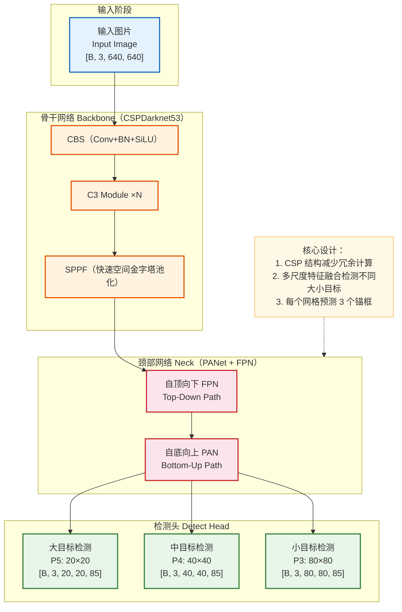
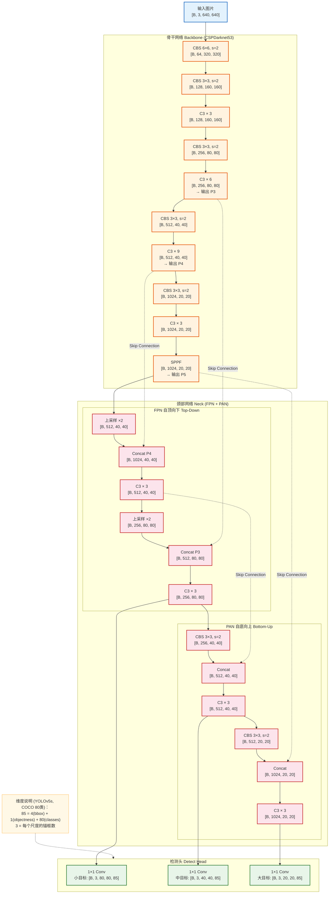
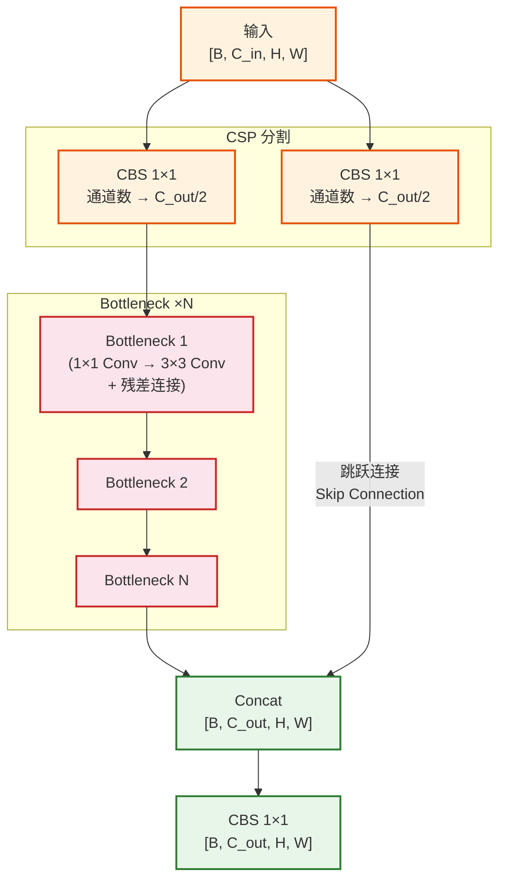
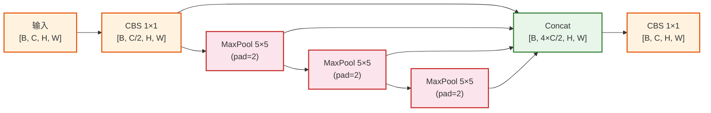
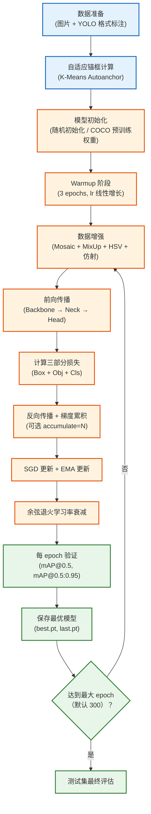
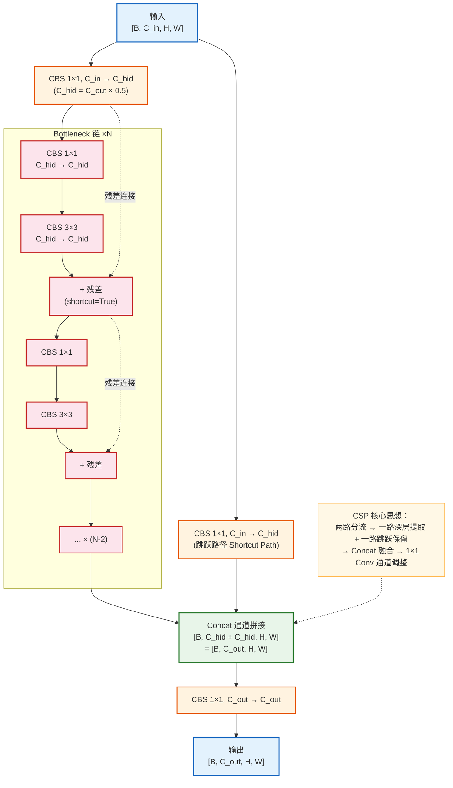
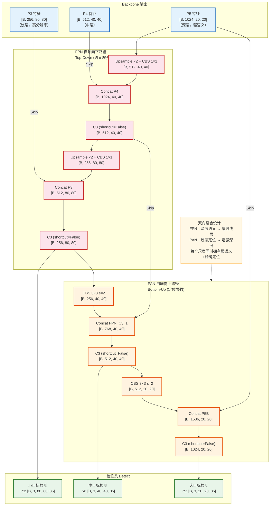
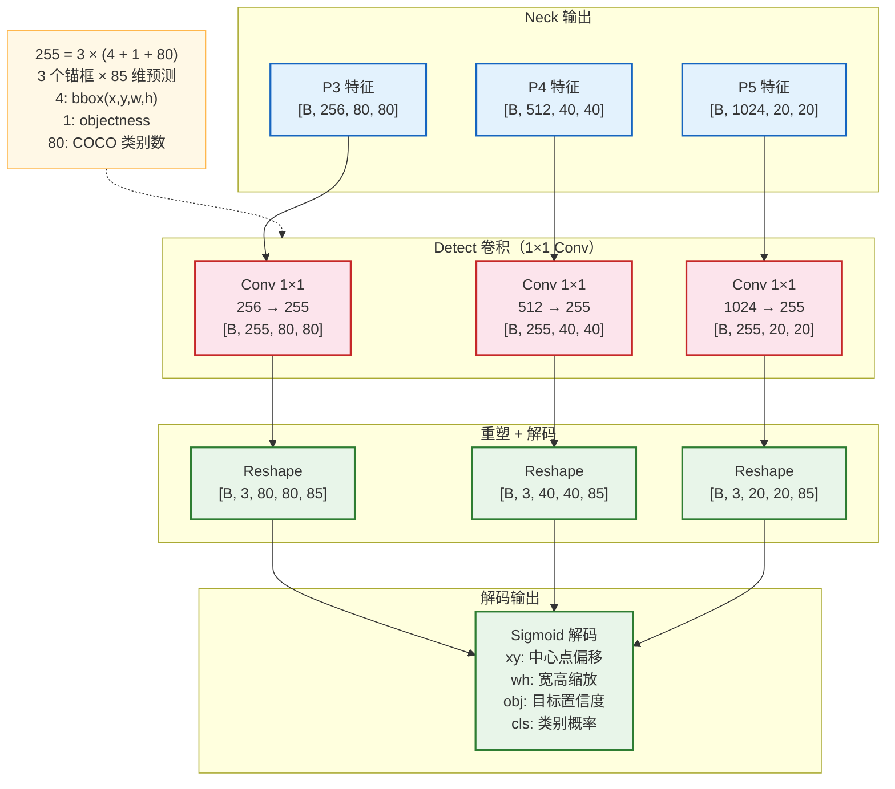

# YOLOv5 模型架构深度解析

> **项目**：YOLOv5（You Only Look Once v5）
> **发布**：2020 年 6 月，由 Ultralytics 公司开源
> **作者**：Glenn Jocher（Ultralytics）
> **代码**：https://github.com/ultralytics/yolov5
> **特点**：无正式论文发表，以工程实现和社区迭代驱动

---

## 目录

1. [模型架构概览](#一模型架构概览)
2. [模型架构详情](#二模型架构详情)
3. [关键组件架构](#三关键组件架构)
4. [面试常见问题 FAQ](#四面试常见问题-faq)

---

## 一、模型架构概览

### 1.1 模型定位

**YOLOv5** 是一个面向**实时目标检测**的深度学习模型，属于计算机视觉（CV）中的目标检测领域。它继承了 YOLO 系列"一次前向推理即完成检测"的核心理念，在检测精度与推理速度之间取得了出色的平衡。

| 维度 | 说明 |
|------|------|
| 研究领域 | 目标检测（Object Detection） |
| 应用任务 | 实时目标检测、实例分割（v7.0+）、图像分类 |
| 核心价值 | 工程化程度极高、部署友好、精度-速度平衡优异 |

**典型应用场景**：
- 自动驾驶中的行人/车辆检测
- 工业质检中的缺陷检测
- 安防监控中的人员/物体识别
- 无人机航拍目标检测
- 医学影像中的病灶定位

**与同领域代表性模型的定位对比**：

| 模型 | 核心机制 | 精度 (mAP) | 速度 (FPS) | 特点 |
|------|----------|-----------|-----------|------|
| YOLOv3 | Darknet-53 + FPN | 33.0 | ~30 | YOLO 经典版本 |
| YOLOv4 | CSPDarknet + PANet + SPP | 43.5 | ~62 | 各种 BoS/BoF 技巧集成 |
| **YOLOv5** | **CSPDarknet + PANet + SPP** | **50.7** | **~140** | **工程极致优化、部署友好** |
| YOLOX | Decoupled Head + Anchor-Free | 51.1 | ~68 | 无锚框设计 |
| YOLOv8 | C2f + Decoupled Head + Anchor-Free | 53.9 | ~128 | YOLOv5 的继任者 |
| DETR | Transformer + 二部图匹配 | 42.0 | ~28 | 端到端，无需 NMS |

> 注：mAP 为 COCO val2017 上的结果，FPS 为 V100 GPU 测试，YOLOv5 使用 YOLOv5x 配置。

---

### 1.2 核心思想与创新点

**核心理念**：将目标检测视为**回归问题**——一次前向传播同时预测所有目标的位置和类别，而非传统的"先提取候选区域再分类"的两阶段方法。

**YOLOv5 的关键工程贡献**：

1. **自适应锚框计算**：训练前基于数据集自动通过 K-Means 聚类计算最优锚框尺寸，替代手动设置
2. **自适应图片缩放**：推理时智能计算最小填充量，减少冗余灰边，提升检测速度
3. **多尺度模型系列**：提供 YOLOv5n/s/m/l/x 五种规模，通过调节深度和宽度系数灵活适配不同场景
4. **强大的数据增强**：Mosaic 四图拼接 + Copy-Paste + MixUp + HSV 变换 + 仿射变换等组合
5. **极致的工程优化**：PyTorch 原生实现、自动混合精度、自动 batch size、TensorRT/ONNX/CoreML 全平台导出

**相比前序工作的改进**：
- 比 YOLOv4 更**易用、易部署**——纯 PyTorch 实现，无需 Darknet 框架
- 自动化程度更高——自适应锚框、自适应图片缩放、自动超参搜索
- 持续迭代更新——累计 300+ 次版本更新，社区活跃

---

### 1.3 整体架构概览

YOLOv5 采用经典的 **Backbone + Neck + Head** 三段式目标检测架构：



**学习范式**：监督学习（有标注的目标检测数据，端到端训练）

**输入与输出**：
- **输入**：RGB 图片 $[B, 3, H, W]$，默认 $H = W = 640$
- **输出**：三个尺度的检测张量，每个锚框预测 $(x, y, w, h, obj\_conf, cls_1, cls_2, ..., cls_C)$

---

### 1.4 输入输出示例

**示例场景**：使用 COCO 数据集（80 类目标）进行目标检测。

**输入示例**：

```
一张包含两个人和一辆汽车的街景照片
原始图片尺寸：1920 × 1080
预处理后：[1, 3, 640, 640]（Letterbox 缩放 + 灰色填充）
像素值范围：[0.0, 1.0]（归一化后）
```

**输出示例**：

```
模型原始输出（NMS 之前）：
  P3 (80×80): [1, 3, 80, 80, 85]  → 19200 个预测框（小目标）
  P4 (40×40): [1, 3, 40, 40, 85]  → 4800 个预测框（中目标）
  P5 (20×20): [1, 3, 20, 20, 85]  → 1200 个预测框（大目标）
  总计：25200 个候选框

NMS 后处理后的最终检测结果（3个目标）：
  目标1: [x1=120, y1=85, x2=380, y2=520, conf=0.92, class="person"]
  目标2: [x1=450, y1=100, x2=680, y2=490, conf=0.87, class="person"]
  目标3: [x1=700, y1=200, x2=1200, y2=550, conf=0.95, class="car"]

每个检测结果包含 85 维：4(边界框) + 1(目标置信度) + 80(类别概率)
```

---

### 1.5 关键模块一览

| 模块名称 | 主要职责 |
|----------|----------|
| **Focus / CBS 输入层** | 对输入图片进行初始下采样和特征提取（v6.0+ 使用 6×6 Conv 替代 Focus） |
| **CSPDarknet53 Backbone** | 多层级特征提取，输出三个尺度的特征图（P3/P4/P5） |
| **C3 模块** | CSP Bottleneck × 3，核心特征提取单元，减少冗余计算 |
| **SPPF** | 快速空间金字塔池化，扩大感受野，融合多尺度上下文信息 |
| **FPN（自顶向下）** | 将高层语义特征向下传播，增强低层特征的语义信息 |
| **PAN（自底向上）** | 将低层定位特征向上传播，增强高层特征的定位精度 |
| **Detect Head** | 在三个尺度上预测边界框、置信度和类别概率 |
| **NMS 后处理** | 非极大值抑制，去除重叠冗余框，输出最终检测结果 |

**模块数据流**：

```
输入图片 → CBS下采样 → CSPDarknet53(C3×N) → SPPF
                                    ↓
                    P3/P4/P5 三尺度特征 → FPN(自顶向下融合) → PAN(自底向上融合)
                                                                    ↓
                                                        Detect Head × 3 → NMS → 检测结果
```

---

### 1.6 性能表现概览

YOLOv5 提供五种不同规模的模型，满足不同场景需求：

| 模型 | 参数量 | FLOPs | mAP@0.5 | mAP@0.5:0.95 | 推理速度 (V100) |
|------|--------|-------|---------|--------------|----------------|
| YOLOv5n | 1.9M | 4.5G | 45.7% | 28.0% | 0.6ms |
| YOLOv5s | 7.2M | 16.5G | 56.8% | 37.4% | 1.0ms |
| YOLOv5m | 21.2M | 49.0G | 64.1% | 45.4% | 1.8ms |
| YOLOv5l | 46.5M | 109.1G | 67.3% | 49.0% | 2.7ms |
| YOLOv5x | 86.7M | 205.7G | 68.9% | 50.7% | 4.8ms |

> 测试条件：COCO val2017，输入尺寸 640×640，V100 GPU，batch_size=32。

---

### 1.7 模型家族与演进脉络

```
YOLOv1 (2016, Joseph Redmon)
    ↓ 引入分类+定位统一回归
YOLOv2 / YOLO9000 (2017)
    ↓ Batch Norm + Anchor Box + 多尺度训练
YOLOv3 (2018)
    ↓ Darknet-53 + FPN + 三尺度检测
YOLOv4 (2020, Alexey Bochkovskiy)
    ↓ CSPDarknet + Mosaic + SPP + PANet
YOLOv5 (2020, Ultralytics)
    ↓ PyTorch 工程化重构 + 持续迭代优化
    ↓
YOLOX (2021, 旷视) → Anchor-Free + Decoupled Head
YOLOv7 (2022, WongKinYiu) → E-ELAN + RepVGG
YOLOv8 (2023, Ultralytics) → YOLOv5 继任者，C2f + Anchor-Free
YOLOv9/v10/v11 (2024+) → 持续演进
```

YOLOv5 的核心定位是**工程实践的标杆**——它不一定是学术指标最高的，但在"训练-验证-部署"全流程的易用性上，长期是 YOLO 系列中最成熟的版本。

---

## 二、模型架构详情

### 2.1 数据集构成与数据示例

#### 主要训练/评估数据集

| 数据集 | 图片数 | 类别数 | 标注方式 | 用途 |
|--------|--------|--------|----------|------|
| COCO 2017 | 118K (train) / 5K (val) / 20K (test) | 80 | 边界框 + 实例分割 + 关键点 | 主要基准 |
| VOC 2007+2012 | ~16.5K (trainval) / 4.9K (test) | 20 | 边界框 | 补充评估 |
| Objects365 | 1.7M | 365 | 边界框 | 大规模预训练 |
| 自定义数据集 | 用户定义 | 用户定义 | YOLO 格式标注 | 实际业务 |

#### COCO 数据集划分

- **训练集（train2017）**：118,287 张图片，约 860K 个标注实例
- **验证集（val2017）**：5,000 张图片
- **测试集（test-dev）**：20,288 张图片（标注不公开，需提交服务器评测）
- 80 个类别涵盖：人、交通工具、动物、家居物品等

#### COCO 类别分布特征

COCO 数据集存在明显的**类别不均衡**：
- "person" 类别占比约 30%，远超其他类别
- 小目标（面积 < 32²）占标注实例的约 41%
- YOLOv5 通过 Mosaic 增强和多尺度训练缓解分布不均衡

#### 典型数据样例

**YOLO 格式标注文件**（每行一个目标）：

```
# class_id  x_center  y_center  width  height  (均为归一化坐标，相对于图片宽高)
0  0.482421  0.634765  0.138671  0.346093   # person
0  0.723437  0.589843  0.154687  0.340625   # person
2  0.559375  0.412500  0.356250  0.362500   # car
```

**数据形态变化流程**：

```
① 原始图片：[H_orig, W_orig, 3]（如 1920×1080，RGB，uint8）
② Letterbox 缩放：[640, 640, 3]（等比缩放 + 灰色填充，保持宽高比）
③ 数据增强：Mosaic 拼接 / MixUp / HSV / 仿射变换
④ 归一化：[640, 640, 3] → 像素值 ÷ 255 → [0.0, 1.0]
⑤ 转置+批处理：[B, 3, 640, 640]（CHW 格式，float32）
⑥ 模型输出：P3[B,3,80,80,85] + P4[B,3,40,40,85] + P5[B,3,20,20,85]
⑦ NMS后处理：List[[N_det, 6]]（每张图检测 N_det 个目标，6=x1,y1,x2,y2,conf,cls）
⑧ 坐标还原：将预测坐标从 640×640 映射回原始图片尺寸
```

---

### 2.2 数据处理与输入规范

#### 预处理流程

**1. Letterbox 自适应缩放**：

```
原始图片 1920×1080 → 等比缩放到 640 内 → 实际尺寸 640×360
→ 上下各填充 140 像素灰色(114,114,114) → 最终 640×640

关键优化：填充量取 stride(32) 的整数倍，减少冗余计算
```

**2. 数据增强组合（训练时）**：

| 增强方式 | 参数 | 作用 |
|----------|------|------|
| **Mosaic** | 4 张图拼接 | 丰富背景、增加小目标、减少对大 batch 的依赖 |
| **Copy-Paste** | 随机粘贴实例 | 增加目标多样性 |
| **MixUp** | alpha=0.15 | 两张图叠加，提升泛化 |
| **HSV 增强** | H:±0.015, S:±0.7, V:±0.4 | 色彩鲁棒性 |
| **随机仿射** | 旋转±0°, 缩放±0.5, 平移±0.1 | 几何变换鲁棒性 |
| **随机翻转** | 水平翻转 p=0.5 | 左右对称性 |
| **Albumentations** | Blur, MedianBlur, CLAHE 等 | 额外增强（可选） |

**3. 标签处理**：
- 标注格式：YOLO 格式（归一化的 `class x_center y_center width height`）
- 增强后需同步变换标注框坐标
- 增强后的标注框需裁剪到图片边界内

#### 批处理策略

- 默认 Batch Size：16（可自动调整以充分利用 GPU 显存）
- 支持矩形推理（Rectangular Inference）：同一 batch 内图片缩放到相近尺寸，减少填充冗余
- 数据加载使用多进程（num_workers=8）+ 预取机制

---

### 2.3 架构全景与数据流

#### 完整架构拆解（以 YOLOv5s 为例）



#### 逐步维度变化（YOLOv5s, 输入 640×640, COCO 80类）

| 阶段 | 模块 | 输出形状 | 下采样倍率 |
|------|------|----------|-----------|
| 输入 | - | [B, 3, 640, 640] | 1× |
| Backbone-0 | CBS 6×6, s=2 | [B, 64, 320, 320] | 2× |
| Backbone-1 | CBS 3×3, s=2 + C3×3 | [B, 128, 160, 160] | 4× |
| Backbone-2 (P3) | CBS 3×3, s=2 + C3×6 | [B, 256, 80, 80] | 8× |
| Backbone-3 (P4) | CBS 3×3, s=2 + C3×9 | [B, 512, 40, 40] | 16× |
| Backbone-4 (P5) | CBS 3×3, s=2 + C3×3 + SPPF | [B, 1024, 20, 20] | 32× |
| Neck-FPN-1 | Upsample + Concat P4 + C3 | [B, 512, 40, 40] | 16× |
| Neck-FPN-2 | Upsample + Concat P3 + C3 | [B, 256, 80, 80] | 8× |
| Neck-PAN-1 | CBS s=2 + Concat + C3 | [B, 512, 40, 40] | 16× |
| Neck-PAN-2 | CBS s=2 + Concat + C3 | [B, 1024, 20, 20] | 32× |
| Head-P3 | 1×1 Conv | [B, 3, 80, 80, 85] | 8× |
| Head-P4 | 1×1 Conv | [B, 3, 40, 40, 85] | 16× |
| Head-P5 | 1×1 Conv | [B, 3, 20, 20, 85] | 32× |

---

### 2.4 核心模块深入分析

#### CBS 模块（Conv + BatchNorm + SiLU）

YOLOv5 中最基本的构建单元，所有卷积层后都跟随 BN 和 SiLU 激活：

```
CBS(x) = SiLU(BatchNorm(Conv2d(x)))
```

SiLU（又名 Swish）激活函数：$\text{SiLU}(x) = x \cdot \sigma(x)$，其中 $\sigma$ 为 Sigmoid 函数。

#### C3 模块（CSP Bottleneck with 3 Convolutions）

C3 是 YOLOv5 的核心特征提取模块，基于 CSPNet 思想设计：



**CSP 设计思想**：将输入特征分为两路——一路经过多个 Bottleneck 层提取深层特征，另一路直接跳跃连接。两路在输出端 Concat 合并。这种设计**减少了重复梯度信息**，降低计算量的同时保持特征丰富性。

#### SPPF（Spatial Pyramid Pooling - Fast）

SPPF 是 SPP 的加速版本，通过串联多个 5×5 MaxPool 等效实现多尺度池化：



**等效关系**：三次串联 5×5 MaxPool（等效感受野分别为 5×5, 9×9, 13×13）等价于 SPP 中并行的三种尺度池化，但**速度快约 2 倍**，因为共享了中间计算结果。

---

### 2.5 维度变换路径

以 YOLOv5s 为例，展示一个检测结果从原始预测到最终输出的维度变换：

| 步骤 | 操作 | 输入形状 | 输出形状 | 说明 |
|------|------|----------|----------|------|
| 1 | Head Conv | [B, C_neck, H, W] | [B, 255, H, W] | 255 = 3 × 85 |
| 2 | Reshape | [B, 255, H, W] | [B, 3, H, W, 85] | 拆分锚框维度 |
| 3 | Sigmoid(xy) | [B, 3, H, W, 85] 的 [:2] | 范围 [0, 1] | 中心点偏移 |
| 4 | Sigmoid(wh).pow(2)×4×anchor | [B, 3, H, W, 85] 的 [2:4] | 像素坐标 | 宽高还原 |
| 5 | Sigmoid(obj) | [B, 3, H, W, 85] 的 [4] | 范围 [0, 1] | 目标置信度 |
| 6 | Sigmoid(cls) | [B, 3, H, W, 85] 的 [5:] | 范围 [0, 1] | 类别概率 |
| 7 | 三尺度合并 | 3×[B, Na, H, W, 85] | [B, 25200, 85] | 合并所有候选框 |
| 8 | NMS | [B, 25200, 85] | List[[N_det, 6]] | 过滤冗余框 |

> 25200 = 80×80×3 + 40×40×3 + 20×20×3（三个尺度的总候选框数）

---

### 2.6 数学表达与关键公式

#### 边界框预测解码

YOLOv5 v6.0+ 使用改进的锚框解码公式：

$$b_x = (2 \cdot \sigma(t_x) - 0.5) + c_x$$

$$b_y = (2 \cdot \sigma(t_y) - 0.5) + c_y$$

$$b_w = p_w \cdot (2 \cdot \sigma(t_w))^2$$

$$b_h = p_h \cdot (2 \cdot \sigma(t_h))^2$$

其中：
- $(t_x, t_y, t_w, t_h)$：网络原始输出
- $(c_x, c_y)$：网格单元左上角坐标
- $(p_w, p_h)$：锚框的先验宽高
- $\sigma$：Sigmoid 函数

**改进动机**：
- $2\sigma(t) - 0.5$ 使中心点偏移范围从 $[0, 1]$ 扩展到 $[-0.5, 1.5]$，允许预测跨网格边界的目标中心
- $(2\sigma(t))^2$ 使宽高缩放范围为 $[0, 4]$，避免指数函数导致的数值不稳定

#### IoU 与 GIoU / CIoU 计算

**IoU（交并比）**：

$$\text{IoU} = \frac{|A \cap B|}{|A \cup B|}$$

**CIoU（Complete IoU，YOLOv5 默认使用）**：

$$\mathcal{L}_{CIoU} = 1 - \text{IoU} + \frac{\rho^2(\mathbf{b}, \mathbf{b}^{gt})}{c^2} + \alpha v$$

其中：
- $\rho(\mathbf{b}, \mathbf{b}^{gt})$：预测框与真实框中心点的欧氏距离
- $c$：最小包围矩形的对角线长度
- $v = \frac{4}{\pi^2}(\arctan\frac{w^{gt}}{h^{gt}} - \arctan\frac{w}{h})^2$：宽高比一致性惩罚
- $\alpha = \frac{v}{(1-\text{IoU}) + v}$：平衡系数

---

### 2.7 损失函数与优化策略

#### 多任务损失函数

YOLOv5 的总损失由三部分组成：

$$\mathcal{L}_{total} = \lambda_{box} \cdot \mathcal{L}_{box} + \lambda_{obj} \cdot \mathcal{L}_{obj} + \lambda_{cls} \cdot \mathcal{L}_{cls}$$

| 损失项 | 公式 | 权重系数 | 说明 |
|--------|------|----------|------|
| 边界框回归损失 | $\mathcal{L}_{box} = 1 - \text{CIoU}$ | $\lambda_{box} = 0.05$ | CIoU Loss |
| 目标置信度损失 | $\mathcal{L}_{obj} = \text{BCE}(\hat{o}, \text{IoU}_{target})$ | $\lambda_{obj} = 1.0$ | 二值交叉熵 |
| 类别分类损失 | $\mathcal{L}_{cls} = \text{BCE}(\hat{c}, c)$ | $\lambda_{cls} = 0.5$ | 多标签二值交叉熵 |

**关键设计**：
- **目标置信度的标签**不是简单的 0/1，而是**预测框与真实框的 IoU 值**，使置信度学会预测定位质量
- 三个尺度的目标损失有不同权重：P3（小目标）权重 4.0，P4（中目标）权重 1.0，P5（大目标）权重 0.4，**加大对小目标的关注**

#### 优化器与超参数

| 超参数 | 典型值 | 说明 |
|--------|--------|------|
| 优化器 | SGD | momentum=0.937, nesterov=True |
| 初始学习率 | 0.01 | 权重参数 |
| 最终学习率 | 0.01 × lrf | lrf=0.01，即最终 lr=1e-4 |
| 学习率调度 | 余弦退火 | 线性 warmup 3 epochs + cosine decay |
| 权重衰减 | 5e-4 | L2 正则化 |
| Warmup | 3 epochs | 学习率和 momentum 同时 warmup |
| Batch Size | 16 / 32 / 64 | 依 GPU 显存而定 |
| EMA | decay=0.9999 | 指数移动平均，平滑权重 |

---

### 2.8 训练流程与策略



**关键训练策略**：

- **自适应锚框（Autoanchor）**：训练开始前，对数据集标注框执行 K-Means 聚类，如果最优锚框与默认锚框的 BPR（Best Possible Recall）差异 > 0.98，则自动更新锚框
- **Mosaic 增强关闭**：最后 10 个 epoch 关闭 Mosaic 和 Copy-Paste 增强，让模型适应"正常"数据分布
- **EMA（指数移动平均）**：维护模型参数的滑动平均，用于验证和最终模型，提升泛化性
- **混合精度训练**：使用 `torch.cuda.amp`，FP16 前向 + FP32 梯度，加速约 1.5-2×
- **多尺度训练**：训练时输入尺寸在 [640×0.5, 640×1.5] 范围内随机缩放

**训练基础设施**：
- 推荐 GPU：NVIDIA V100 / A100 / RTX 3090+
- COCO 完整训练（300 epochs）：单 V100 约 3-5 天（YOLOv5s）
- 支持多 GPU 分布式训练（`torch.distributed`）和 SyncBatchNorm

---

### 2.9 推理与预测流程

#### 完整推理链路

```mermaid
flowchart LR
    classDef inputStyle fill:#e3f2fd,stroke:#1565c0,stroke-width:2px
    classDef procStyle fill:#fff3e0,stroke:#e65100,stroke-width:2px
    classDef modelStyle fill:#fce4ec,stroke:#c62828,stroke-width:2px
    classDef postStyle fill:#e8f5e9,stroke:#2e7d32,stroke-width:2px

    A["原始图片<br/>(任意尺寸)"]:::inputStyle
    B["Letterbox 缩放<br/>→ [640, 640]"]:::procStyle
    C["归一化 ÷255<br/>BGR→RGB, HWC→CHW"]:::procStyle
    D["模型推理<br/>(Backbone→Neck→Head)"]:::modelStyle
    E["解码预测框<br/>(Sigmoid + Grid)"]:::modelStyle
    F["NMS 后处理<br/>(conf_thres + iou_thres)"]:::postStyle
    G["坐标还原<br/>(缩放回原图尺寸)"]:::postStyle
    H["最终检测结果<br/>[x1,y1,x2,y2,conf,cls]"]:::postStyle

    A --> B --> C --> D --> E --> F --> G --> H
```



#### NMS（非极大值抑制）后处理

NMS 是 YOLOv5 推理的关键后处理步骤：

```
1. 过滤低置信度框：conf < conf_threshold（默认 0.25）→ 丢弃
2. 计算综合置信度：score = obj_conf × cls_conf
3. 按类别分组，每个类别独立执行 NMS
4. 对每个类别：
   a. 按 score 降序排列
   b. 取最高 score 的框作为保留框
   c. 计算剩余框与保留框的 IoU
   d. IoU > iou_threshold（默认 0.45）的框被抑制
   e. 重复 b-d 直到所有框被处理
5. 可选：限制每张图最多保留 max_det（默认 300）个检测框
```

#### 推理与训练的主要差异

| 方面 | 训练阶段 | 推理阶段 |
|------|----------|----------|
| 数据增强 | 启用（Mosaic 等） | **关闭** |
| Dropout | 不使用（YOLOv5 无 Dropout） | 不使用 |
| BatchNorm | 使用 batch 统计量 | **使用训练期累积统计量** |
| 梯度计算 | 启用 | **关闭**（`torch.no_grad()`） |
| 模型权重 | 当前训练权重 | **EMA 权重** |
| 输入尺寸 | 多尺度随机 | 固定（如 640） |
| NMS | 不需要（直接与标注框计算损失） | **需要** |

#### 完整推理代码示例

```python
import torch

model = torch.hub.load('ultralytics/yolov5', 'yolov5s', pretrained=True)
model.eval()

img = 'https://ultralytics.com/images/zidane.jpg'

results = model(img)
results.print()
# image 1/1: 720x1280 2 persons, 2 ties

results.pandas().xyxy[0]
#      xmin    ymin    xmax    ymax  confidence  class  name
# 0  749.50   43.50  1148.0  704.5      0.874      0  person
# 1  433.50  433.50   517.5  714.5      0.687     27    tie
```

#### 推理加速与部署优化

| 优化手段 | 加速效果 | 适用场景 |
|----------|----------|----------|
| FP16 半精度 | 1.5~2× | GPU 推理 |
| TensorRT | 2~5× | NVIDIA GPU 部署 |
| ONNX Runtime | 1.5~3× | CPU/GPU 跨平台 |
| CoreML | - | Apple 设备 |
| OpenVINO | 2~4× | Intel 设备 |
| TFLite | - | 移动端/嵌入式 |
| 模型剪枝 | 1.5~3× | 资源受限场景 |
| 知识蒸馏 | 保持精度+减小模型 | 小模型部署 |

---

### 2.10 评估指标与实验分析

#### 评估指标说明

| 指标 | 公式/含义 | 说明 |
|------|-----------|------|
| Precision | $P = \frac{TP}{TP + FP}$ | 预测为正的样本中真正为正的比例 |
| Recall | $R = \frac{TP}{TP + FN}$ | 所有正样本中被正确检测的比例 |
| AP (Average Precision) | P-R 曲线下面积 | 单个类别的检测性能 |
| mAP@0.5 | 所有类别 AP 的均值（IoU=0.5） | PASCAL VOC 标准指标 |
| mAP@0.5:0.95 | IoU 从 0.5 到 0.95 步长 0.05 的平均 mAP | COCO 主要指标，更严格 |
| FLOPs | 浮点运算量 | 衡量计算复杂度 |
| 推理延迟 | 单张图片端到端耗时（含 NMS） | 实际部署速度 |

#### COCO val2017 详细对比结果

| 模型 | 输入尺寸 | mAP@0.5:0.95 | mAP@0.5 | 参数量 | FLOPs | 推理延迟(V100) |
|------|----------|--------------|---------|--------|-------|---------------|
| YOLOv3-tiny | 416 | 16.6 | 33.1 | 8.7M | 5.6G | 0.7ms |
| YOLOv3 | 640 | 33.0 | 57.9 | 61.5M | 155G | 4.3ms |
| YOLOv4-CSP | 640 | 43.5 | - | 52.9M | 120G | 6.0ms |
| **YOLOv5s** | **640** | **37.4** | **56.8** | **7.2M** | **16.5G** | **1.0ms** |
| **YOLOv5m** | **640** | **45.4** | **64.1** | **21.2M** | **49.0G** | **1.8ms** |
| **YOLOv5l** | **640** | **49.0** | **67.3** | **46.5M** | **109.1G** | **2.7ms** |
| **YOLOv5x** | **640** | **50.7** | **68.9** | **86.7M** | **205.7G** | **4.8ms** |
| YOLOX-L | 640 | 49.7 | 68.0 | 54.2M | 155G | 3.0ms |
| YOLOv8s | 640 | 44.9 | 61.8 | 11.2M | 28.6G | 1.2ms |
| YOLOv8x | 640 | 53.9 | 71.0 | 68.2M | 258G | 5.0ms |

#### 按目标大小的检测性能（YOLOv5x, COCO val2017）

| 目标大小 | mAP@0.5:0.95 | 占比 | 说明 |
|----------|--------------|------|------|
| 小目标 (area < 32²) | 34.2 | ~41% | 小目标检测是主要挑战 |
| 中目标 (32² < area < 96²) | 54.8 | ~34% | 中等目标检测表现最好 |
| 大目标 (area > 96²) | 64.5 | ~25% | 大目标容易检测 |

#### 模型缩放消融分析

| 缩放维度 | YOLOv5n | YOLOv5s | YOLOv5m | YOLOv5l | YOLOv5x |
|----------|---------|---------|---------|---------|---------|
| 深度系数 (depth_multiple) | 0.33 | 0.33 | 0.67 | 1.0 | 1.33 |
| 宽度系数 (width_multiple) | 0.25 | 0.50 | 0.75 | 1.0 | 1.25 |
| C3 重复次数 (第3层) | 2 | 2 | 6 | 9 | 12 |
| mAP@0.5:0.95 | 28.0 | 37.4 | 45.4 | 49.0 | 50.7 |
| 参数量 | 1.9M | 7.2M | 21.2M | 46.5M | 86.7M |

---

### 2.11 设计亮点与思考

**设计亮点**：

1. **工程化极致**：YOLOv5 是目标检测领域工程化程度最高的开源项目之一。从数据准备、训练、验证到多平台部署，全流程高度自动化。

2. **模型缩放策略**：通过 `depth_multiple` 和 `width_multiple` 两个系数，用同一套代码产生 n/s/m/l/x 五种规模模型，设计优雅。

3. **SPPF 加速设计**：用串联小核 MaxPool 等效替代并行大核池化，是一个精妙的工程优化。

4. **自适应机制**：Autoanchor、Auto Batch Size、Letterbox 自适应缩放——减少人工调参的负担。

5. **社区驱动迭代**：300+ 次版本更新，持续集成最新改进（如从 Focus 到 6×6 Conv、从 SPP 到 SPPF），保持生命力。

**设计权衡**：

| 权衡维度 | 选择 | 代价 |
|----------|------|------|
| Anchor-based vs Anchor-free | Anchor-based | 需要预定义锚框，超参较多 |
| 单阶段 vs 两阶段 | 单阶段 | 小目标精度略低于两阶段（如 Faster R-CNN） |
| 速度 vs 精度 | 多规模可选 | 最大模型仍逊于专门优化精度的模型 |
| 通用性 vs 专用性 | 通用框架 | 特定场景（如遥感、医学）可能需要额外适配 |
| Coupled Head vs Decoupled Head | Coupled Head | 分类和回归共享特征可能相互干扰 |

**已知局限性**：
- **小目标检测**：单尺度 640 输入时，小目标（< 32×32 像素）检测精度有限，需增大输入尺寸或加入 P2 检测层
- **密集/遮挡场景**：大量目标密集排列时，NMS 可能抑制正确检测框
- **旋转目标**：仅支持水平边界框，不支持旋转框（OBB），遥感场景受限（YOLOv5-OBB 版本单独提供）
- **长尾分布**：对罕见类别的检测能力有限，COCO 数据集中低频类别的 AP 偏低

---

## 三、关键组件架构

### 3.1 组件一：C3 模块（CSP Bottleneck with 3 Convolutions）

#### 定位与职责

C3 模块是 YOLOv5 中出现**频率最高**的核心特征提取单元，贯穿 Backbone 和 Neck。它基于 CSPNet（Cross Stage Partial Network）思想，目的是在**减少计算冗余**的前提下充分提取特征。

为什么需要 CSP 设计？传统的 ResNet Bottleneck 全部输入都经过所有层，梯度信息在各层间存在大量重复。CSP 将输入分为两路，一路经过深层处理，一路直接旁路，在减少约 20% 计算量的同时保持甚至提升检测精度。

#### 内部结构拆解



#### 计算流程与维度变换

以 Backbone 第 3 层的 C3 模块为例（YOLOv5s, 输入 [B, 256, 80, 80], C3×6）：

| 步骤 | 操作 | 输入形状 | 输出形状 | 说明 |
|------|------|----------|----------|------|
| 1 | CBS 1×1 (CV1) | [B, 256, 80, 80] | [B, 128, 80, 80] | 主路径通道减半 |
| 2 | CBS 1×1 (CV2) | [B, 256, 80, 80] | [B, 128, 80, 80] | 跳跃路径通道减半 |
| 3 | Bottleneck ×6 | [B, 128, 80, 80] | [B, 128, 80, 80] | 6 个 Bottleneck 串联 |
| 4 | Concat | [B, 128, 80, 80] × 2 | [B, 256, 80, 80] | 两路通道拼接 |
| 5 | CBS 1×1 (CV3) | [B, 256, 80, 80] | [B, 256, 80, 80] | 最终通道调整 |

#### 关键代码参考

```python
class Bottleneck(nn.Module):
    def __init__(self, c1, c2, shortcut=True, g=1, e=0.5):
        super().__init__()
        c_ = int(c2 * e)
        self.cv1 = CBS(c1, c_, 1, 1)
        self.cv2 = CBS(c_, c2, 3, 1, g=g)
        self.add = shortcut and c1 == c2

    def forward(self, x):
        return x + self.cv2(self.cv1(x)) if self.add else self.cv2(self.cv1(x))


class C3(nn.Module):
    def __init__(self, c1, c2, n=1, shortcut=True, g=1, e=0.5):
        super().__init__()
        c_ = int(c2 * e)
        self.cv1 = CBS(c1, c_, 1, 1)       # 主路径入口
        self.cv2 = CBS(c1, c_, 1, 1)       # 跳跃路径
        self.cv3 = CBS(2 * c_, c2, 1, 1)   # 融合后输出
        self.m = nn.Sequential(
            *(Bottleneck(c_, c_, shortcut, g, e=1.0) for _ in range(n))
        )

    def forward(self, x):
        return self.cv3(torch.cat((self.m(self.cv1(x)), self.cv2(x)), 1))
```

#### 设计细节

- **Bottleneck 中的残差连接**：仅在 `c1 == c2` 时启用（`shortcut=True`），在通道数变化时退化为普通两层卷积
- **Neck 中的 C3 使用 `shortcut=False`**：Neck 的 C3 模块内部 Bottleneck 不使用残差连接，允许更灵活的特征变换
- **深度缩放**：不同模型规模的 C3 重复次数不同，由 `depth_multiple` 控制（如 YOLOv5n 的 n=1，YOLOv5x 的 n=4）

---

### 3.2 组件二：FPN + PAN 颈部网络（多尺度特征融合）

#### 定位与职责

FPN（Feature Pyramid Network）+ PAN（Path Aggregation Network）构成了 YOLOv5 的颈部网络，是实现**多尺度目标检测**的核心。它解决的问题是：

- **浅层特征**分辨率高、定位精确，但语义信息弱
- **深层特征**语义丰富，但分辨率低、定位粗糙
- 需要**融合不同层级的特征**，使每个检测尺度都同时具备强语义和精确定位

#### 内部结构拆解



#### FPN vs PAN 的信息流对比

| 路径 | 方向 | 传递的信息 | 增强效果 |
|------|------|-----------|----------|
| **FPN（自顶向下）** | P5 → P4 → P3 | 高层语义信息向下传播 | 增强小目标的语义理解 |
| **PAN（自底向上）** | P3 → P4 → P5 | 低层定位信息向上传播 | 增强大目标的精确定位 |

如果只用 FPN 而不用 PAN：小目标可以获得良好的语义增强，但大目标的定位信息被多次上采样后会损失。PAN 补充了一条自底向上的路径，让深层特征也能获取高分辨率的定位细节。

#### 设计细节

- **FPN 使用最近邻上采样**：而非反卷积（Deconv），避免引入棋盘效应
- **PAN 使用 stride=2 的 CBS 下采样**：而非 MaxPool，保留更多信息
- **Concat 而非 Add**：YOLOv5 使用 Concat + 1×1 Conv 融合跨层特征，保留更多通道信息（相比简单相加）
- **Neck 中 C3 的 shortcut=False**：允许 Neck 自由变换特征，不被残差连接约束

---

### 3.3 组件三：Detect Head 与锚框分配策略

#### 定位与职责

Detect Head 是 YOLOv5 的最终输出层，负责在三个尺度的特征图上**预测目标的位置、尺寸、置信度和类别**。它与锚框分配策略（正负样本匹配）紧密配合，决定了模型"学什么"和"怎么学"。

#### Detect Head 内部结构



#### 锚框设置（COCO 默认）

| 检测尺度 | 特征图大小 | 锚框尺寸 (像素) | 适配目标 |
|----------|-----------|----------------|----------|
| P3 (stride=8) | 80×80 | [10,13], [16,30], [33,23] | 小目标 |
| P4 (stride=16) | 40×40 | [30,61], [62,45], [59,119] | 中目标 |
| P5 (stride=32) | 20×20 | [116,90], [156,198], [373,326] | 大目标 |

#### 正负样本分配策略

YOLOv5 使用**基于锚框宽高比的匹配策略 + 多网格扩展**：

```
对于每个真实框 GT：
1. 计算 GT 与所有 9 个锚框的宽高比：
   r_w = GT_w / anchor_w
   r_h = GT_h / anchor_h
   max_ratio = max(r_w, 1/r_w, r_h, 1/r_h)

2. 如果 max_ratio < anchor_t（默认 4.0），则该锚框为匹配锚框

3. 扩展网格分配：
   - GT 中心点所在网格为正样本
   - GT 中心点最近的 2 个相邻网格也为正样本
   - 每个 GT 最多匹配 3 个网格 × 3 个锚框 = 9 个正样本

4. 不满足条件的网格-锚框对为负样本
```

**Build Targets 的关键改进**：通过扩展相邻网格，YOLOv5 **大幅增加正样本数量**（相比 YOLOv3 每个 GT 只分配 1 个正样本），加速训练收敛并提升召回率。

#### 关键代码参考

```python
class Detect(nn.Module):
    def __init__(self, nc=80, anchors=(), ch=()):
        super().__init__()
        self.nc = nc
        self.no = nc + 5  # 每个锚框的输出维度
        self.nl = len(anchors)  # 检测层数（3）
        self.na = len(anchors[0]) // 2  # 每层锚框数（3）

        self.m = nn.ModuleList(
            nn.Conv2d(x, self.no * self.na, 1) for x in ch
        )

    def forward(self, x):
        z = []
        for i in range(self.nl):
            x[i] = self.m[i](x[i])
            bs, _, ny, nx = x[i].shape
            # [B, 255, H, W] → [B, 3, H, W, 85]
            x[i] = x[i].view(bs, self.na, self.no, ny, nx)
            x[i] = x[i].permute(0, 1, 3, 4, 2).contiguous()

            if not self.training:
                # 推理时解码
                grid, anchor_grid = self._make_grid(nx, ny, i)
                xy = (x[i][..., :2].sigmoid() * 2 - 0.5 + grid) * self.stride[i]
                wh = (x[i][..., 2:4].sigmoid() * 2) ** 2 * anchor_grid
                conf = x[i][..., 4:].sigmoid()
                y = torch.cat((xy, wh, conf), -1)
                z.append(y.view(bs, -1, self.no))

        return x if self.training else torch.cat(z, 1)
```

---

## 四、面试常见问题 FAQ

### Q1：YOLOv5 的核心架构是什么？用一句话概括其设计。

**答**：YOLOv5 采用 **CSPDarknet53 Backbone + FPN-PAN Neck + Anchor-based Coupled Head** 的三段式架构——骨干网络提取多尺度特征，颈部网络双向融合语义和定位信息，检测头在三个尺度上同时预测所有目标的位置和类别，实现了单阶段实时目标检测。

---

### Q2：YOLOv5 中 CSP（Cross Stage Partial）结构有什么作用？为什么不直接用 ResNet？

**答**：CSP 结构将输入特征分为两路——一路通过多层 Bottleneck 深度处理，另一路直接跳过。相比传统 ResNet 全部输入经过所有层的方式，CSP 的优势在于：

1. **减少计算冗余**：只有一半通道经过深层处理，计算量减少约 20%
2. **降低梯度信息重复**：CSPNet 论文证明，在 DenseNet 和 ResNet 中存在大量重复梯度信息，CSP 的分流设计有效缓解了这一问题
3. **保持特征丰富性**：跳跃路径直接保留原始特征，Concat 融合后信息更丰富

实验表明，CSP 版本的 Darknet 在相近参数量下，精度优于原始 Darknet53 约 1-2 mAP。

---

### Q3：YOLOv5 为什么使用三个检测尺度？而不是更多或更少？

**答**：三个检测尺度（P3/P4/P5，stride=8/16/32）是精度和效率的平衡点：

- **P3（80×80，stride=8）**：每个网格对应原图 8×8 像素区域，适合检测**小目标**
- **P4（40×40，stride=16）**：每个网格对应原图 16×16 像素区域，适合检测**中目标**
- **P5（20×20，stride=32）**：每个网格对应原图 32×32 像素区域，适合检测**大目标**

如果减少到两个尺度（如去掉 P3），小目标检测能力会严重下降。如果增加到四个尺度（如加入 P2，stride=4，特征图 160×160），会增加大量计算量（候选框增加 4 倍）但收益有限。YOLOv5 也提供了 P6（stride=64）的变体用于超大目标检测（YOLOv5x6，输入 1280×1280）。

---

### Q4：Mosaic 数据增强的原理是什么？为什么有效？

**答**：Mosaic 增强将 4 张训练图片随机裁剪并拼接成一张图片输入训练：

```
┌────────┬────────┐
│ 图片1  │ 图片2  │
│        │        │
├────────┼────────┤
│ 图片3  │ 图片4  │
│        │        │
└────────┴────────┘
```

**为什么有效**：
1. **丰富背景上下文**：一张输入包含 4 张图的背景信息，相当于变相扩大了训练数据多样性
2. **增加小目标数量**：4 张图缩放后目标变小，增加了小目标的训练样本
3. **减少对大 Batch Size 的依赖**：每次迭代实际"看到"了 4 倍的图片内容，Batch Normalization 的统计量更稳定
4. **增强边缘检测能力**：目标可能出现在拼接边界处，训练模型处理截断目标

**最后 10 个 epoch 关闭 Mosaic**：因为 Mosaic 创造了不真实的分布（4 图拼接），最后阶段用正常数据微调以适应真实场景分布。

---

### Q5：YOLOv5 的损失函数是如何设计的？三个损失项分别有什么作用？

**答**：YOLOv5 使用三部分损失的加权和：

$$\mathcal{L} = 0.05 \cdot \mathcal{L}_{box} + 1.0 \cdot \mathcal{L}_{obj} + 0.5 \cdot \mathcal{L}_{cls}$$

| 损失项 | 类型 | 作用 | 技巧 |
|--------|------|------|------|
| $\mathcal{L}_{box}$ | CIoU Loss | 回归边界框位置和大小 | 同时考虑重叠、中心距离和宽高比 |
| $\mathcal{L}_{obj}$ | BCE Loss | 预测该网格是否含有目标 | 标签值为预测框与 GT 的 IoU（软标签） |
| $\mathcal{L}_{cls}$ | BCE Loss | 预测目标的类别 | 多标签分类，非互斥 |

**CIoU vs IoU 的优势**：IoU Loss 只度量重叠面积，当两个框不重叠时 IoU=0 梯度为零。CIoU 额外加入中心点距离和宽高比惩罚，即使不重叠也能产生有效梯度，加速收敛。

**目标置信度使用 IoU 软标签**：如果简单使用 0/1 标签，模型会对所有正样本预测相同的高置信度，无法区分"定位精确"和"定位粗糙"的框。使用 IoU 作为软标签，让模型学会自我评估定位质量。

---

### Q6：YOLOv5 如何进行正负样本分配？与 YOLOv3 有什么区别？

**答**：

**YOLOv3 的分配策略**：每个真实框只分配给**一个**最佳匹配的锚框（IoU 最大），每个 GT 只有 1 个正样本。这导致正样本极少，训练效率低。

**YOLOv5 的改进策略**：
1. **宽高比匹配**：GT 与锚框的宽高比在 [1/4, 4] 范围内即为匹配（不再只取最佳）
2. **多网格扩展**：GT 中心所在网格 + 最近 2 个相邻网格都可作为正样本
3. **结果**：每个 GT 可能有 3-9 个正样本（3 个网格 × 1-3 个匹配锚框）

**效果**：正样本数量增加约 3-9 倍，显著提升了模型的召回率和训练收敛速度。

---

### Q7：YOLOv5 的 FPN + PAN 与单独使用 FPN 相比有什么优势？

**答**：

- **只用 FPN（自顶向下）**：深层语义信息可以增强浅层特征，但浅层的高分辨率定位信息只能传递到本层，深层获取不到精确的位置特征

- **FPN + PAN（双向融合）**：
  - FPN 路径：P5 → P4 → P3（语义增强浅层）
  - PAN 路径：P3 → P4 → P5（定位增强深层）
  - 每个尺度都同时拥有**强语义信息**和**精确定位信息**

具体来说，在 COCO 数据集上：
- FPN 对小目标（AP_S）提升明显（语义增强高分辨率层）
- PAN 对大目标（AP_L）提升明显（定位增强低分辨率层）
- 双向融合使所有尺度的检测都受益

---

### Q8：NMS 后处理有什么局限性？有哪些替代方案？

**答**：

**NMS 的局限性**：
1. **引入超参数**：IoU 阈值（通常 0.45）需要手动设置，不同场景最优值不同
2. **密集场景丢失**：高度重叠的目标（如人群中的人）可能被误抑制
3. **无法端到端训练**：NMS 不可导，切断了后处理与模型的梯度连接
4. **增加推理延迟**：NMS 是串行操作，成为速度瓶颈之一

**替代方案**：

| 方案 | 代表工作 | 思路 | 缺点 |
|------|---------|------|------|
| Soft-NMS | Bodla et al., 2017 | 降低重叠框的分数而非直接删除 | 仍非端到端 |
| DIoU-NMS | YOLOv4 | 用中心点距离而非 IoU 作为抑制标准 | 仍非端到端 |
| 端到端检测 | DETR, RT-DETR | Transformer + 二部图匹配，无需 NMS | 计算量较大 |
| Matrix NMS | SOLOv2 | 矩阵运算并行化 NMS | 仍需阈值 |

---

### Q9：如何将 YOLOv5 部署到移动端/嵌入式设备？

**答**：

**推荐部署路径**：

```
YOLOv5 (PyTorch) → ONNX → 目标平台推理引擎
```

**具体方案**：

| 目标平台 | 推荐格式 | 推理引擎 | 注意事项 |
|----------|---------|----------|----------|
| NVIDIA GPU | TensorRT | TensorRT | 选择 FP16/INT8 量化 |
| Intel CPU | OpenVINO | OpenVINO Runtime | 选择 INT8 量化 |
| Apple 设备 | CoreML | CoreML | 需要转换 NMS 逻辑 |
| Android | TFLite / NCNN | TFLite / NCNN | 选择 YOLOv5n/s 小模型 |
| 通用 CPU/GPU | ONNX | ONNX Runtime | 跨平台兼容最好 |
| 边缘设备 (Jetson) | TensorRT | TensorRT | Jetson Nano 用 YOLOv5n |

**关键优化措施**：
1. **选择合适的模型规模**：移动端首选 YOLOv5n（1.9M 参数），其次 YOLOv5s
2. **降低输入分辨率**：从 640 降到 320/416，速度提升显著
3. **INT8 量化**：精度损失约 1-2 mAP，速度提升 2-4×
4. **知识蒸馏**：用大模型指导小模型训练，提升小模型精度
5. **剪枝**：去除冗余通道，进一步压缩模型

---

### Q10：YOLOv5 训练自定义数据集时有哪些常见问题和最佳实践？

**答**：

**数据准备最佳实践**：

| 实践 | 建议值 | 说明 |
|------|--------|------|
| 标注格式 | YOLO 格式 | class x_center y_center width height（归一化） |
| 数据量 | 每类 ≥ 1500 张图 | 少于 300 张效果较差 |
| 类别平衡 | 各类别数量差 ≤ 10× | 严重不均衡需过采样或 focal loss |
| 背景图片 | 占总量 0-10% | 无目标的图片减少误检 |
| 标注质量 | 边界框紧密贴合 | 松散标注会降低定位精度 |

**常见问题排查**：

1. **mAP 很低**：
   - 检查标注格式是否正确（归一化坐标，x_center 而非 x_min）
   - 检查类别 ID 是否从 0 开始
   - 增加训练 epoch（至少 100 epoch）

2. **训练不收敛**：
   - 降低学习率（从 0.01 降到 0.001）
   - 检查图片-标注对应关系
   - 检查锚框是否适配（运行 Autoanchor）

3. **过拟合**：
   - 增加数据增强强度
   - 增加训练数据量
   - 使用预训练权重（`--weights yolov5s.pt`）
   - 减小模型规模（如 YOLOv5m → YOLOv5s）

4. **小目标漏检**：
   - 增大输入分辨率（640 → 1280）
   - 添加 P2 检测层（stride=4）
   - 增加 Mosaic 增强中小目标的比例
   - 使用切片推理（SAHI）

---

### Q11：YOLOv5 与 YOLOv8 有什么关键区别？该如何选择？

**答**：

| 维度 | YOLOv5 | YOLOv8 |
|------|--------|--------|
| 核心模块 | C3（CSP Bottleneck） | C2f（更高效的 CSP 变体） |
| 检测头 | Coupled Head（分类回归共享） | Decoupled Head（分类回归解耦） |
| 锚框方式 | Anchor-based（9 个预定义锚框） | Anchor-free（无需预定义锚框） |
| 正样本分配 | 宽高比匹配 + 网格扩展 | TaskAlignedAssigner（动态分配） |
| 损失函数 | CIoU + BCE | DFL + CIoU + BCE |
| 成熟度 | 极高（300+ 版本迭代，社区广泛验证） | 较高（持续更新中） |
| 精度（COCO） | 50.7 mAP（YOLOv5x） | 53.9 mAP（YOLOv8x） |

**选择建议**：
- **选 YOLOv5**：追求稳定可靠的生产环境部署、需要最广泛的社区支持和部署工具链、项目对风险容忍度低
- **选 YOLOv8**：追求最高精度、接受新架构的学习成本、新项目从零开始

---

### Q12：YOLOv5 的 SiLU 激活函数相比 ReLU/LeakyReLU 有什么优势？

**答**：

$$\text{SiLU}(x) = x \cdot \sigma(x) = \frac{x}{1 + e^{-x}}$$

| 激活函数 | 公式 | 优势 | 劣势 |
|----------|------|------|------|
| ReLU | $\max(0, x)$ | 计算快，无梯度消失 | 负半轴梯度为零（Dead ReLU） |
| LeakyReLU | $\max(\alpha x, x)$ | 缓解 Dead ReLU | $\alpha$ 需要手动设置 |
| **SiLU/Swish** | $x \cdot \sigma(x)$ | 平滑、自门控、无死区 | 计算略慢（含 Sigmoid） |

SiLU 的核心优势：
1. **平滑非线性**：处处可导，梯度更稳定
2. **自门控机制**：$\sigma(x)$ 起到了自适应门控的作用，大值近似恒等、小值被平滑抑制
3. **性能提升**：Google Brain 的搜索实验（Searching for Activation Functions, 2017）发现 Swish 在深度网络中普遍优于 ReLU

在 YOLOv5 中，SiLU 相比 LeakyReLU 带来约 0.5-1.0 mAP 的提升。

---

> **参考资料**
>
> 1. Ultralytics YOLOv5 官方仓库：https://github.com/ultralytics/yolov5
> 2. Redmon, J., et al. "You Only Look Once: Unified, Real-Time Object Detection." CVPR, 2016.
> 3. Bochkovskiy, A., et al. "YOLOv4: Optimal Speed and Accuracy of Object Detection." arXiv, 2020.
> 4. Wang, C., et al. "CSPNet: A New Backbone that can Enhance Learning Capability of CNN." CVPR Workshop, 2020.
> 5. Lin, T., et al. "Feature Pyramid Networks for Object Detection." CVPR, 2017.
> 6. Liu, S., et al. "Path Aggregation Network for Instance Segmentation." CVPR, 2018.
> 7. Zheng, Z., et al. "Distance-IoU Loss: Faster and Better Learning for Bounding Box Regression." AAAI, 2020.
> 8. COCO Dataset: https://cocodataset.org/
