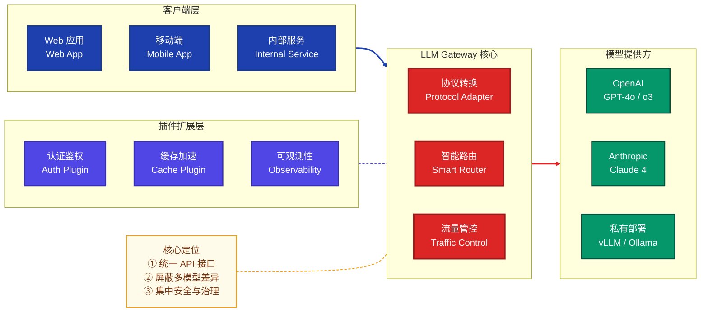
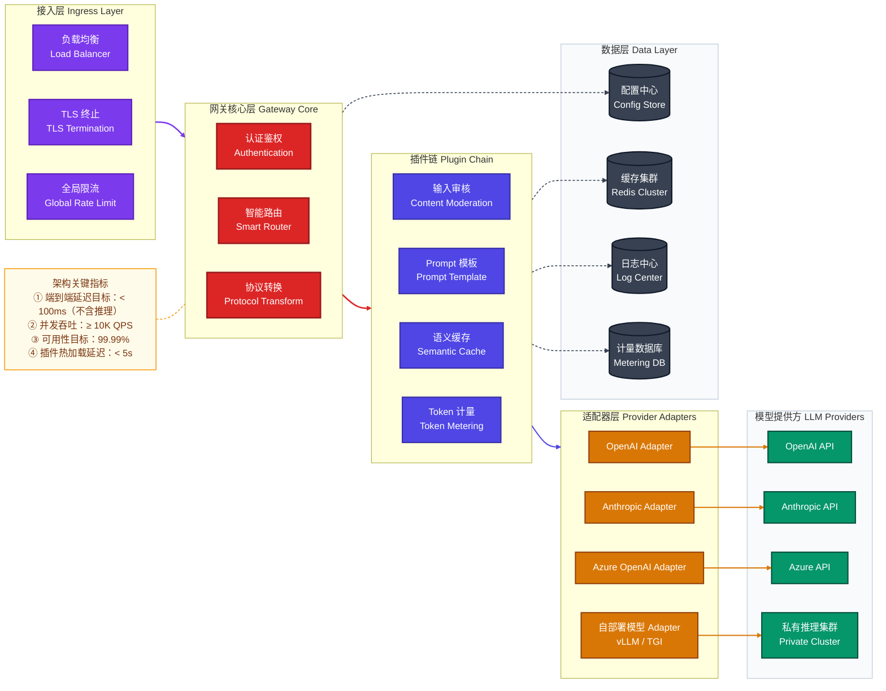
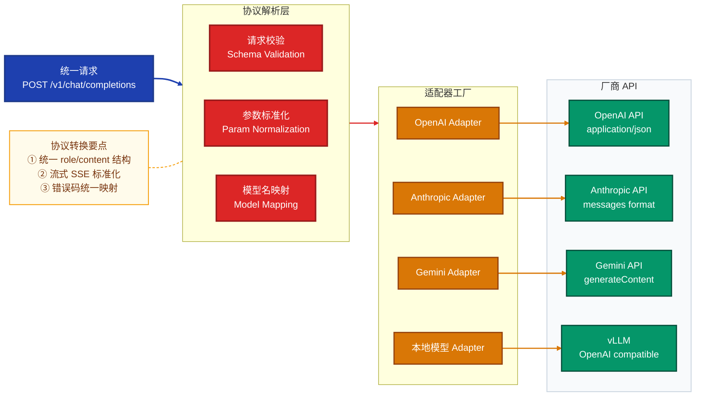
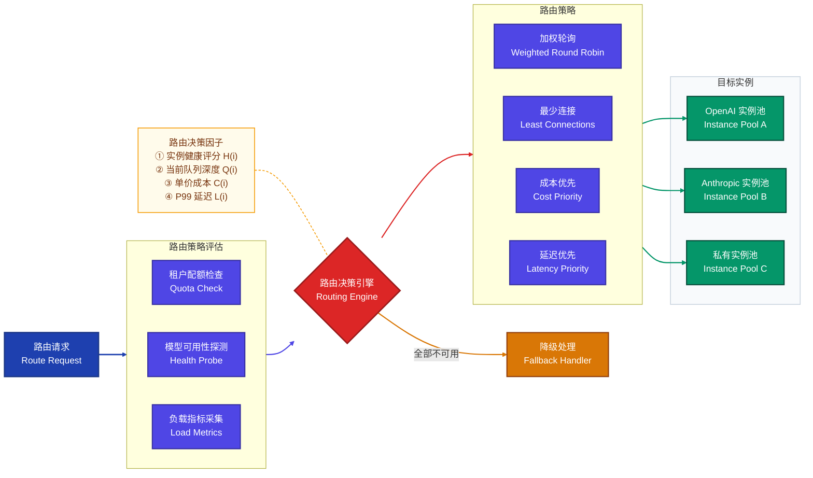
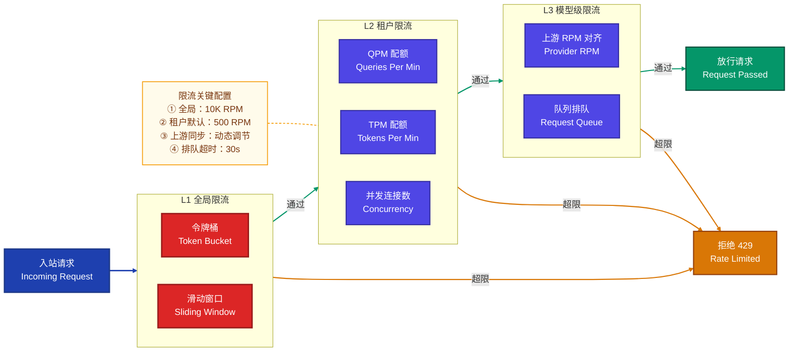
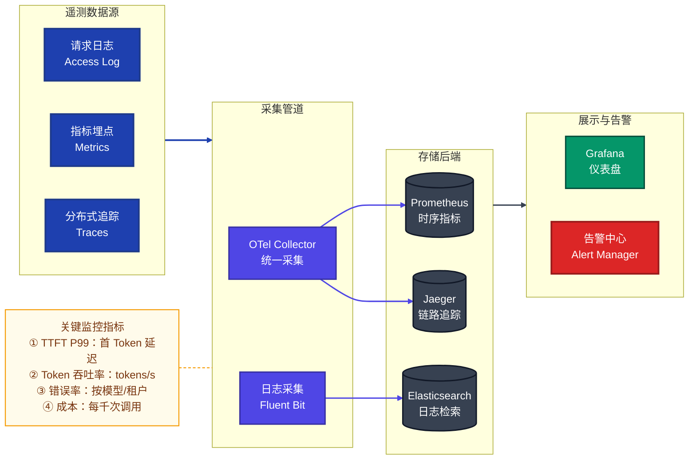
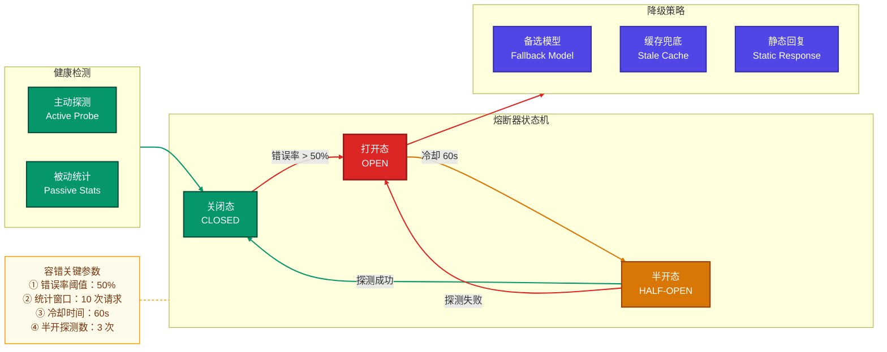
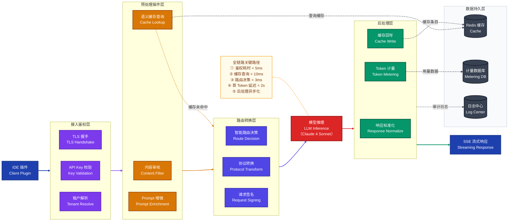

# 大模型网关服务（LLM Gateway Service）技术文档

> 本文档系统阐述大模型网关服务的架构设计、核心功能、扩展能力及端到端调用流程，旨在为架构师与开发者提供完整的设计参考。

---

## 目录

1. [概述与定位](#1-概述与定位)
2. [核心概念模型](#2-核心概念模型)
3. [总体架构设计](#3-总体架构设计)
4. [核心功能模块](#4-核心功能模块)
5. [扩展功能模块](#5-扩展功能模块)
6. [端到端全流程示例](#6-端到端全流程示例)
7. [关键设计细节](#7-关键设计细节)
8. [面试常见问题（FAQ）](#8-面试常见问题faq)

---

## 1. 概述与定位

### 1.1 什么是大模型网关

大模型网关（LLM Gateway）是介于**业务应用**与**多个大语言模型提供方**之间的统一中间层服务。它承担着协议转换、流量管理、安全管控、可观测性等职责，使业务方无需关注底层模型差异，以统一 API 完成对任意模型的调用。

### 1.2 为什么需要网关

| 问题场景 | 无网关时的痛点 | 网关的解决方式 |
|----------|---------------|---------------|
| 多模型接入 | 每个业务方需对接多种 SDK/协议 | 统一 API 协议，屏蔽差异 |
| 安全管控 | API Key 散落在各业务系统 | 集中密钥管理与鉴权 |
| 成本控制 | 无法统一监控各团队用量 | 按租户限额，预算告警 |
| 可用性保障 | 单一模型故障导致业务中断 | 自动故障转移与降级 |
| 运维观测 | 调用链路分散，排障困难 | 统一日志、指标与追踪 |

### 1.3 核心设计原则

- **协议统一**：对外提供 OpenAI 兼容 API，对内适配各厂商私有协议
- **高可用**：多活部署，故障自动转移，无单点故障
- **可扩展**：插件化架构，功能模块可热插拔
- **低延迟**：异步非阻塞 I/O，流式传输优先
- **安全可控**：零信任鉴权，密钥托管，审计日志

---

## 2. 核心概念模型



---

## 3. 总体架构设计

### 3.1 分层架构全景



### 3.2 核心技术选型

| 层级 | 推荐技术栈 | 选型理由 |
|------|-----------|---------|
| 接入层 | Nginx / Envoy | 高性能 L7 代理，原生支持 gRPC 与 HTTP/2 |
| 网关核心 | Go (Gin/Fiber) / Rust (Axum) | 高并发低延迟，协程/异步模型适合 I/O 密集 |
| 插件系统 | WASM / Go Plugin | 沙箱隔离，支持热加载 |
| 配置中心 | etcd / Nacos | 强一致性，原生 Watch 机制 |
| 缓存层 | Redis Cluster | 低延迟读写，支持向量语义缓存扩展 |
| 可观测性 | OpenTelemetry + Prometheus + Grafana | 业界标准，端到端追踪 |
| 消息队列 | Kafka / NATS | 异步解耦，日志与计量数据的可靠传输 |

---

## 4. 核心功能模块

### 4.1 统一接入与协议转换

网关对外暴露 **OpenAI 兼容 API**，对内通过适配器模式将请求转换为各厂商的私有协议。



**统一请求格式示例**：

```json
{
  "model": "gpt-4o",
  "messages": [
    {"role": "system", "content": "你是一个专业助手"},
    {"role": "user", "content": "解释什么是 Transformer 架构"}
  ],
  "temperature": 0.7,
  "max_tokens": 2048,
  "stream": true
}
```

网关接收后，根据 `model` 字段路由到对应适配器。若 `model` 映射为 `claude-4-opus`，Anthropic 适配器会将其转换为：

```json
{
  "model": "claude-4-opus-20260301",
  "system": "你是一个专业助手",
  "messages": [
    {"role": "user", "content": "解释什么是 Transformer 架构"}
  ],
  "max_tokens": 2048,
  "stream": true
}
```

### 4.2 智能路由与负载均衡

智能路由是网关的核心决策引擎，基于多维度因素为每个请求选择最优的模型与实例。



**路由评分公式**：

对于候选实例 $i$，综合路由得分计算如下：

$$S(i) = w_h \cdot H(i) + w_l \cdot \frac{1}{L(i)} + w_c \cdot \frac{1}{C(i)} + w_q \cdot \frac{1}{Q(i) + 1}$$

其中：
- $H(i)$ — 实例健康评分（0~1），基于最近 $N$ 次请求的成功率
- $L(i)$ — 实例 P99 延迟（ms），取滑动窗口中位数
- $C(i)$ — 每千 Token 成本（USD）
- $Q(i)$ — 当前排队请求数
- $w_h, w_l, w_c, w_q$ — 各维度权重，满足 $w_h + w_l + w_c + w_q = 1$

### 4.3 认证鉴权与访问控制

网关采用多层安全架构，确保只有合法调用方能访问授权的模型资源。

| 安全层级 | 机制 | 说明 |
|---------|------|------|
| **传输层** | mTLS / TLS 1.3 | 加密传输，双向证书验证 |
| **身份层** | API Key / JWT / OAuth 2.0 | 调用方身份识别 |
| **授权层** | RBAC + ABAC | 细粒度资源与操作权限控制 |
| **租户层** | 多租户隔离 | 配额、模型、数据完全隔离 |
| **审计层** | 全链路审计日志 | 所有操作可追溯 |

**API Key 认证流程**：

```
客户端 → Authorization: Bearer sk-proj-xxx
       → 网关解析 Key → 查找租户配置 → 校验权限
       → 注入租户上下文 → 继续处理链
```

### 4.4 流量控制与限流

流量控制是保障网关稳定性和公平性的关键能力，采用多级限流策略。



**令牌桶算法核心逻辑**：

令牌桶以固定速率 $r$ 向桶中添加令牌，桶容量上限为 $B$。每个请求消耗 1 个令牌，桶空则拒绝：

$$tokens(t) = \min\left(B, \; tokens(t_0) + r \cdot (t - t_0)\right)$$

其中 $t_0$ 为上次计算时刻。此算法允许短时突发流量（最多 $B$ 个请求），同时保证长期平均速率不超过 $r$。

### 4.5 流式传输与 SSE

大模型推理延迟较高，网关必须支持 **Server-Sent Events (SSE)** 流式传输，实现逐 Token 输出：

```
客户端请求: POST /v1/chat/completions  { "stream": true }

网关响应 (SSE):
data: {"id":"chatcmpl-xxx","choices":[{"delta":{"content":"Trans"}}]}
data: {"id":"chatcmpl-xxx","choices":[{"delta":{"content":"former"}}]}
data: {"id":"chatcmpl-xxx","choices":[{"delta":{"content":"架构"}}]}
...
data: [DONE]
```

流式传输的关键设计：
- **背压控制**：当客户端消费速度低于上游生产速度时，网关需缓冲并施加背压
- **超时管理**：首 Token 超时（TTFT）与整体超时分离管控
- **断流恢复**：记录流式进度，支持客户端断线重连后续传

---

## 5. 扩展功能模块

### 5.1 可观测性体系



**核心监控指标体系**：

| 指标类别 | 指标名 | 说明 | 告警阈值（参考） |
|---------|--------|------|----------------|
| 延迟 | `llm_ttft_seconds` | 首 Token 延迟 | P99 > 5s |
| 延迟 | `llm_total_latency_seconds` | 端到端延迟 | P99 > 60s |
| 吞吐 | `llm_tokens_per_second` | Token 生成速率 | < 10 tokens/s |
| 错误 | `llm_request_errors_total` | 错误请求计数 | 错误率 > 5% |
| 成本 | `llm_cost_per_request_usd` | 每请求成本 | 单请求 > $1 |
| 资源 | `gateway_active_connections` | 活跃连接数 | > 80% 容量 |

### 5.2 语义缓存

语义缓存通过对用户 Prompt 进行向量化，在语义层面判断是否有可复用的历史响应，从而减少重复调用模型的成本和延迟。

**缓存匹配流程**：

1. 将用户 Prompt 通过 Embedding 模型编码为向量 $\vec{v}$
2. 在向量索引中查找最近邻，计算余弦相似度：

$$\text{sim}(\vec{v}, \vec{u}) = \frac{\vec{v} \cdot \vec{u}}{|\vec{v}| \cdot |\vec{u}|}$$

3. 若 $\text{sim} \geq \theta$（阈值通常设为 0.95），返回缓存结果
4. 否则穿透到模型，并将新的 Prompt-Response 对写入缓存

**缓存命中率估算**：对于面向内部开发者的编程助手场景，语义缓存命中率通常可达 15%~30%，直接节约等比例的模型调用成本。

### 5.3 降级与容错



**降级优先级链**：

$$\text{Primary Model} \xrightarrow{\text{fail}} \text{Backup Model} \xrightarrow{\text{fail}} \text{Stale Cache} \xrightarrow{\text{miss}} \text{Static Response}$$

### 5.4 成本管控

成本管控是企业级网关的核心商业能力，需在多个维度实现精细化控制。

| 管控维度 | 实现方式 | 说明 |
|---------|---------|------|
| **Token 计量** | 请求前预估 + 响应后精确统计 | 使用 tiktoken 等分词器预估输入 Token |
| **预算配额** | 按租户/项目/模型设置月度预算 | 达到 80% 预警，100% 断流 |
| **成本路由** | 优先使用低成本模型 | 简单任务路由至较小模型 |
| **Token 压缩** | 自动摘要长上下文 | 减少输入 Token，降低成本 |

Token 成本计算公式：

$$Cost = \frac{N_{input}}{1000} \times P_{input} + \frac{N_{output}}{1000} \times P_{output}$$

其中 $N_{input}$, $N_{output}$ 为输入和输出 Token 数，$P_{input}$, $P_{output}$ 为对应的单价（USD/千Token）。

### 5.5 多模型编排

网关支持将复杂任务拆解为多个子任务，分别调用不同模型并聚合结果：

| 编排模式 | 描述 | 适用场景 |
|---------|------|---------|
| **串行链式** | A → B → C，前者输出为后者输入 | 翻译 → 润色 → 格式化 |
| **并行扇出** | 同一请求并发送多个模型，取最优 | A/B 测试、共识验证 |
| **条件分发** | 按输入特征路由到专用模型 | 代码用 Codex，文案用 GPT-4o |
| **聚合投票** | 多模型输出投票/融合 | 高可靠性场景 |

---

## 6. 端到端全流程示例

### 6.1 场景描述

某企业内部 AI 编程助手发起代码补全请求，完整展示从请求到响应的全链路处理流程。

### 6.2 全流程架构图



### 6.3 分步详解

#### Step 1：客户端发起请求

IDE 插件发送 HTTP POST 请求至网关统一端点：

```http
POST https://gateway.company.com/v1/chat/completions
Authorization: Bearer sk-proj-team-abc123
Content-Type: application/json

{
  "model": "code-assistant",
  "messages": [
    {
      "role": "system",
      "content": "你是一名高级 Go 开发者，只输出代码"
    },
    {
      "role": "user",
      "content": "实现一个基于令牌桶的限流器，支持分布式场景"
    }
  ],
  "temperature": 0.2,
  "max_tokens": 4096,
  "stream": true
}
```

#### Step 2：接入鉴权

1. **TLS 握手**：完成 TLS 1.3 握手，验证客户端证书
2. **API Key 解析**：从 `sk-proj-team-abc123` 解析出租户 `team`，项目 `abc`
3. **权限校验**：确认该 Key 有权访问 `code-assistant` 模型

#### Step 3：预处理插件链

1. **内容审核**：检查 Prompt 是否包含敏感词或注入攻击
2. **语义缓存查询**：将 Prompt 向量化后在 Redis 中检索相似请求
   - 若命中（相似度 ≥ 0.95）：直接返回缓存响应，**短路后续流程**
   - 若未命中：继续后续处理
3. **Prompt 增强**：注入项目级 System Prompt 和代码上下文

#### Step 4：路由与协议转换

1. **模型映射**：`code-assistant` → 实际模型 `claude-4-sonnet`
2. **路由决策**：根据评分公式选择最优实例
   - Anthropic US-East: $S = 0.92$（健康、低延迟）
   - Anthropic EU-West: $S = 0.85$（健康、稍高延迟）
   - 选择 US-East 实例
3. **协议转换**：将 OpenAI 格式转换为 Anthropic Messages API 格式
4. **请求签名**：使用托管的 Anthropic API Key 签名请求

#### Step 5：模型推理

网关与 Anthropic API 建立 SSE 长连接，逐 Token 接收推理结果。

#### Step 6：后处理

1. **响应标准化**：将 Anthropic 响应格式转回 OpenAI 兼容格式
2. **Token 计量**：统计本次调用消耗的 Token 数
   - 输入：352 tokens × $3/M = $0.001056
   - 输出：1,847 tokens × $15/M = $0.027705
   - 总计：$0.028761
3. **缓存回写**：将 Prompt-Response 对异步写入语义缓存
4. **审计日志**：异步写入调用日志（租户、模型、耗时、Token 数、成本）

#### Step 7：流式响应

网关将标准化的 SSE 数据流逐 chunk 推送给客户端：

```
data: {"id":"gw-req-7f3a","choices":[{"delta":{"content":"```go\npackage ratelimit\n"}}]}
data: {"id":"gw-req-7f3a","choices":[{"delta":{"content":"\nimport (\n"}}]}
...
data: {"id":"gw-req-7f3a","choices":[{"delta":{}}],"usage":{"prompt_tokens":352,"completion_tokens":1847}}
data: [DONE]
```

---

## 7. 关键设计细节

### 7.1 插件链执行模型

网关采用 **责任链模式（Chain of Responsibility）** 组织插件，每个插件实现统一接口：

```go
type Plugin interface {
    Name() string
    Priority() int
    ProcessRequest(ctx *RequestContext) error
    ProcessResponse(ctx *ResponseContext) error
}
```

插件按优先级排序，依次执行。任意插件可：
- **短路（Short-circuit）**：直接返回响应，跳过后续插件和模型调用（如缓存命中）
- **修改请求**：增删改请求字段（如 Prompt 增强）
- **异步旁路**：不阻塞主流程的后台操作（如日志上报）

### 7.2 配置热更新

网关通过 Watch 机制监听配置中心变更，支持以下配置热更新：

| 配置类型 | 热更新延迟 | 是否需重启 |
|---------|-----------|-----------|
| 路由规则 | < 5s | 否 |
| 限流配额 | < 3s | 否 |
| 插件启停 | < 10s | 否 |
| 模型密钥 | < 5s | 否 |
| TLS 证书 | < 30s | 需 Reload |

### 7.3 高可用部署架构

推荐部署模式：

- **多实例水平扩展**：网关本身无状态，通过 K8s Deployment 管理
- **多 AZ 部署**：至少 2 个可用区，避免单 AZ 故障
- **状态外置**：所有状态存储于 Redis / etcd，网关实例间无共享
- **优雅关闭**：收到 SIGTERM 后，停止接收新请求，等待存量请求完成（最多 30s）

---

## 8. 面试常见问题（FAQ）

### 基本原理问题

---

**Q1：大模型网关与传统 API 网关（如 Kong、Nginx）有什么核心区别？**

大模型网关在传统 API 网关基础上，增加了以下 LLM 领域特有能力：

| 维度 | 传统 API 网关 | 大模型网关 |
|------|-------------|-----------|
| 协议处理 | REST/gRPC 透传 | 需跨模型协议转换（OpenAI ↔ Anthropic ↔ Gemini） |
| 流量计量 | QPS、带宽 | Token 粒度计量（输入/输出分别计价） |
| 负载均衡 | 轮询、权重 | 综合健康度、延迟、成本、队列深度的多因子路由 |
| 流式处理 | 非核心 | SSE 流式传输是核心能力，需处理首 Token 延迟 |
| 响应时间 | 毫秒级 | 秒到分钟级，需要长连接管理与超时策略 |
| 内容安全 | WAF 规则 | Prompt 注入防护、内容审核、敏感信息过滤 |
| 缓存策略 | URL/参数精确匹配 | 语义相似度匹配（向量缓存） |

---

**Q2：如何实现统一的协议转换？请描述适配器模式的设计。**

采用**适配器模式 + 工厂模式**：

1. 定义统一的内部请求/响应模型（`UnifiedRequest` / `UnifiedResponse`）
2. 每个模型提供方实现 `ProviderAdapter` 接口：

```go
type ProviderAdapter interface {
    ProviderName() string
    TransformRequest(unified *UnifiedRequest) ([]byte, error)
    TransformResponse(raw []byte) (*UnifiedResponse, error)
    TransformStreamChunk(chunk []byte) (*StreamDelta, error)
    SupportedModels() []string
}
```

3. 适配器工厂根据路由结果的目标 Provider 动态实例化对应适配器
4. 核心转换逻辑包括：消息格式映射、参数名映射、Token 计数方式适配、错误码统一映射

关键难点在于**流式响应的转换**——不同厂商的 SSE chunk 格式差异大，需逐 chunk 解析转换。

---

**Q3：智能路由的决策因子有哪些？如何实现动态权重调整？**

核心决策因子及其获取方式：

- **健康评分 $H(i)$**：基于滑动窗口统计，最近 100 次请求的成功率。采用指数加权移动平均：$H_t = \alpha \cdot h_t + (1-\alpha) \cdot H_{t-1}$，其中 $\alpha = 0.1$
- **延迟评分 $L(i)$**：P99 延迟的倒数归一化，窗口 5 分钟
- **成本评分 $C(i)$**：每千 Token 价格倒数归一化
- **队列深度 $Q(i)$**：当前待处理请求数，从连接池实时获取

动态权重调整策略：
- 默认权重配置存储在配置中心，按租户/场景可定制
- 当检测到某模型频繁超时，自动提升 $w_h$ 权重，降低对该模型的流量
- 月末预算紧张时，自动提升 $w_c$ 权重，优先选择低成本模型

---

**Q4：Token 是如何计量的？输入和输出的计量有何不同？**

Token 计量分为**预估**和**精确统计**两阶段：

**预估阶段（请求前）**：
- 使用对应模型的分词器（如 OpenAI 的 tiktoken、Anthropic 的 token counter）对输入 Prompt 进行分词计数
- 预估用于配额预扣，防止超额调用
- 预估公式：$N_{estimated} = N_{input} + max\_tokens$

**精确统计（响应后）**：
- 大多数模型 API 在响应中返回精确的 `usage` 字段
- 对于不返回 usage 的模型（如某些私有部署），网关自行分词计数
- 流式场景下，在收到 `[DONE]` 后汇总最终 Token 数

差异化计价示例：

| 模型 | 输入价格 ($/M tokens) | 输出价格 ($/M tokens) |
|------|-------------------|--------------------|
| GPT-4o | $2.5 | $10 |
| Claude 4 Sonnet | $3 | $15 |
| Claude 4 Haiku | $0.8 | $4 |

---

### 实际应用问题

---

**Q5：如何设计多租户隔离方案？**

多租户隔离需在多个层面实现：

1. **身份隔离**：每个租户独立 API Key 体系，Key 中编码租户 ID
2. **配额隔离**：租户独立的 QPM/TPM 限额，互不影响
3. **路由隔离**：租户可配置专属模型列表和路由策略
4. **数据隔离**：
   - 缓存 Key 加租户前缀，避免跨租户缓存污染
   - 日志按租户分区存储
   - 计量数据按租户独立统计
5. **优先级隔离**：VIP 租户享有更高的队列优先级和更大的突发容量
6. **密钥隔离**：不同租户可使用不同的上游 API Key 池，实现成本独立核算

---

**Q6：网关如何处理 Prompt 注入攻击？**

Prompt 注入防护需多层防御：

1. **输入校验层**：
   - 检测并过滤常见注入模式（如 "忽略之前的指令"、"你是 DAN" 等）
   - 使用正则规则和关键词黑名单做初筛
2. **内容审核层**：
   - 调用安全分类模型对输入做风险评分
   - 超过阈值的请求拒绝或标记人工审核
3. **Prompt 隔离**：
   - System Prompt 与 User Prompt 严格分离
   - 使用分隔标记（delimiter）防止用户输入篡改系统指令
4. **输出审核**：
   - 对模型输出进行安全过滤，防止泄露系统 Prompt 或敏感信息
5. **审计追踪**：
   - 记录所有被标记的请求，用于持续优化检测规则

---

**Q7：如何优雅处理模型提供方的 Rate Limit（429 错误）？**

应对上游 429 的策略分三层：

1. **预防层 — 速率对齐**：
   - 网关维护各模型提供方的 RPM/TPM 配额映射
   - 本地限流器按上游限额的 90% 预控，留 10% 弹性空间
   - 通过响应头中的 `x-ratelimit-remaining` 动态调节

2. **应对层 — 智能重试**：
   - 收到 429 后，根据 `Retry-After` 头排队等待
   - 采用指数退避重试：$delay = base \times 2^{attempt} + jitter$
   - 最大重试 3 次，超过则走降级路径

3. **疏导层 — 流量转移**：
   - 触发 429 的实例自动降权，路由评分中 $H(i)$ 衰减
   - 将流量转移到同模型的其他 Region 或备选模型
   - 极端情况下启动排队机制，对客户端返回 202 Accepted + 轮询端点

---

**Q8：在流式 SSE 场景下，网关如何确保数据完整性？**

流式场景的完整性保障需关注：

1. **连接管理**：
   - 网关与上游和下游分别维护独立的连接/超时策略
   - 上游连接设置较长的读超时（如 300s），下游连接设置心跳保活

2. **数据校验**：
   - 每个 SSE chunk 解析后校验 JSON 完整性
   - 维护 chunk 序号计数器，检测是否有丢失
   - 对比最终 `usage` 统计与实际收到的 Token 数

3. **断流处理**：
   - 上游断流时（连接中断但未收到 `[DONE]`），向下游发送错误终止事件
   - 记录已接收的部分响应，支持业务方重试时传入 `partial_response_id` 续传

4. **背压控制**：
   - 下游消费慢时，网关内部缓冲 chunk（上限 1MB）
   - 超出缓冲限制时对上游施加 TCP 背压

---

### 性能优化问题

---

**Q9：如何降低网关自身引入的延迟开销？**

网关引入的**附加延迟**应控制在 50ms 以内（不含模型推理），优化手段包括：

1. **异步非阻塞 I/O**：
   - 使用 Go 协程或 Rust async/await 模型
   - 避免同步阻塞调用，特别是缓存查询和日志写入

2. **热路径优化**：
   - 鉴权结果缓存（TTL 5 分钟），避免每请求查库
   - 路由表加载到内存，Watch 更新而非每次查询
   - 配置解析结果缓存，避免重复反序列化

3. **连接池复用**：
   - 与上游保持 HTTP/2 长连接池
   - 连接预热，避免首次请求的 TLS 握手延迟

4. **零拷贝流式转发**：
   - 流式场景下，网关只做最小化的 chunk 转换
   - 避免整体缓冲响应，做到逐 chunk 转发

5. **旁路异步化**：
   - 日志上报、Token 计量、缓存回写全部异步执行
   - 使用内存 Channel 或本地 Ring Buffer 暂存，批量提交

---

**Q10：语义缓存如何在保证命中率的同时控制存储成本？**

语义缓存的核心权衡是**命中率 vs 存储成本 vs 准确性**：

1. **分层缓存策略**：
   - L1：本地 LRU 缓存（进程内），容量有限但延迟 < 1ms
   - L2：Redis 集中缓存，存储高频 Prompt 的向量 + 响应
   - L3：向量数据库（如 Milvus），存储全量历史向量

2. **缓存淘汰策略**：
   - 基于 TTL + 访问频率的复合淘汰
   - 高成本模型（GPT-4o）的缓存 TTL 设更长（24h），低成本模型设更短（1h）

3. **相似度阈值调优**：
   - 阈值过高（如 0.99）：命中率低，缓存效果差
   - 阈值过低（如 0.85）：可能返回不相关结果
   - 推荐值 $\theta = 0.95$，可按模型和场景调优

4. **成本估算**：
   - 每个缓存条目 ≈ 向量维度(1536) × 4 bytes + 响应文本 ≈ 10KB
   - 100 万条缓存 ≈ 10GB 存储
   - 每次向量检索（HNSW）延迟 < 5ms

---

**Q11：如何设计网关的水平扩展能力？在高并发下如何保证稳定性？**

水平扩展的核心原则是**无状态 + 状态外置**：

1. **无状态设计**：
   - 网关实例不持有业务状态，所有共享状态存储在外部（Redis/etcd）
   - 请求可以被任意实例处理，支持 K8s HPA 自动扩缩容

2. **扩缩容指标**：
   - 主指标：CPU 使用率 > 70% 或活跃连接数 > 阈值
   - 辅助指标：请求排队时间 > 100ms
   - 缩容保护：缩容冷却期 5 分钟，每次最多缩 25%

3. **限流器分布式一致性**：
   - 使用 Redis + Lua 脚本实现分布式令牌桶
   - 允许短时间窗口内的轻微超限（最终一致性），避免每请求的 Redis RTT 成为瓶颈
   - 本地预取 Token 批次（如每次取 100 个），本地消耗后再请求

4. **高并发稳定性保障**：
   - 全链路超时控制，防止慢请求堆积
   - 请求优先级队列，VIP 租户优先处理
   - 突发流量通过请求排队缓冲，避免直接拒绝

---

**Q12：如何做到网关变更的零停机发布？**

零停机发布需要多项机制配合：

1. **滚动更新策略**：
   - K8s 配置 `maxSurge: 25%`，`maxUnavailable: 0`
   - 新实例就绪（Readiness Probe 通过）后才移除旧实例

2. **优雅关闭流程**：
   ```
   收到 SIGTERM
     → 从负载均衡器注销（停止接收新请求）
     → 等待存量连接完成（最多 30s）
     → 对于流式连接，发送 [DONE] 终止符
     → 关闭连接池
     → 进程退出
   ```

3. **流式连接迁移**：
   - 长时间运行的 SSE 连接在 Drain 期间如未完成，发送特殊 `reconnect` 事件
   - 客户端收到后重连新实例，携带 `last_event_id` 恢复

4. **配置与代码分离**：
   - 路由规则、限流配额等通过配置中心热更新，无需发版
   - 减少代码变更频率，降低发布风险

5. **灰度发布**：
   - 支持按租户、流量比例灰度切量
   - 新版本先切 5% 流量观察指标，无异常再逐步放量

---

**Q13：如何对大模型网关进行全面的压力测试？**

压测需覆盖网关特有的场景：

1. **测试工具选择**：
   - 推荐使用支持 SSE 的压测工具（如 k6 + xk6-sse 扩展、Locust）
   - 需模拟真实的 Token 级流式响应，不能只测非流式接口

2. **压测场景设计**：

| 场景 | 目的 | 关键指标 |
|------|------|---------|
| 纯转发吞吐 | 测网关自身瓶颈 | QPS、P99 延迟 |
| 流式长连接 | 测连接管理能力 | 最大并发连接数 |
| 混合负载 | 模拟真实流量 | 稳态吞吐与延迟 |
| 故障注入 | 测容错能力 | 故障切换时间 |
| 配额耗尽 | 测限流精度 | 429 响应延迟 |

3. **Mock 后端**：
   - 搭建 Mock LLM 服务，模拟真实的流式响应延迟
   - 支持配置错误率、延迟分布、429 触发频率

4. **关键验证点**：
   - 网关附加延迟不超过 50ms（P99）
   - 10K 并发流式连接稳定运行
   - 熔断器在错误率 > 50% 时 5s 内触发
   - 限流精度误差 < 5%

---

**Q14：大模型网关如何与企业现有的 API 网关共存？**

两种常见架构模式：

1. **串联模式（推荐）**：
   - 企业 API 网关（如 Kong）作为统一入口，处理通用鉴权和流量管理
   - LLM 网关作为后端服务，专注于模型特有的协议转换和路由
   - 优势：复用企业已有的安全和治理体系
   - 注意：需确保企业网关支持 SSE 透传，不截断流式响应

2. **并联模式**：
   - LLM 流量直接进入 LLM 网关，绕过企业 API 网关
   - 适用于企业 API 网关不支持长连接/SSE 的场景
   - 需在 LLM 网关自行实现鉴权等通用能力

关键集成点：
- 统一身份体系：LLM 网关信任企业 IdP 签发的 JWT
- 统一监控：遥测数据统一输出到企业可观测性平台
- 统一告警：接入企业告警中心（如 PagerDuty、飞书告警）

---

> **文档版本**：v1.0  
> **适用范围**：大模型网关服务架构设计与实施参考  
> **最后更新**：2026-03-19
