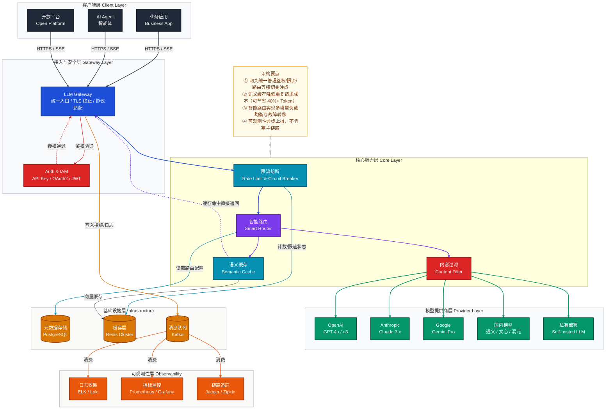
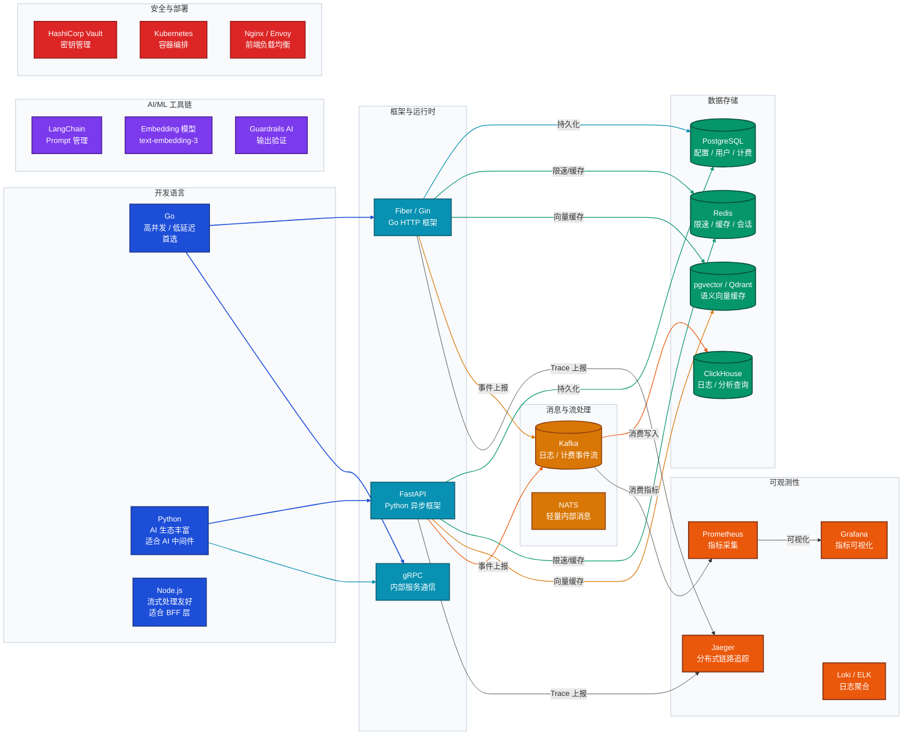
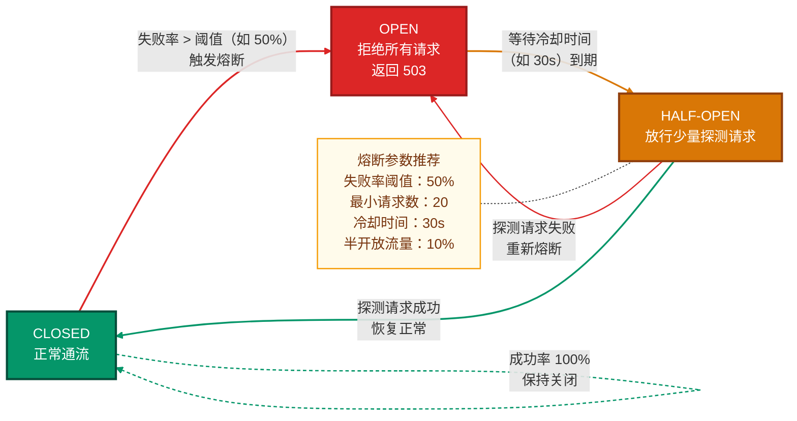
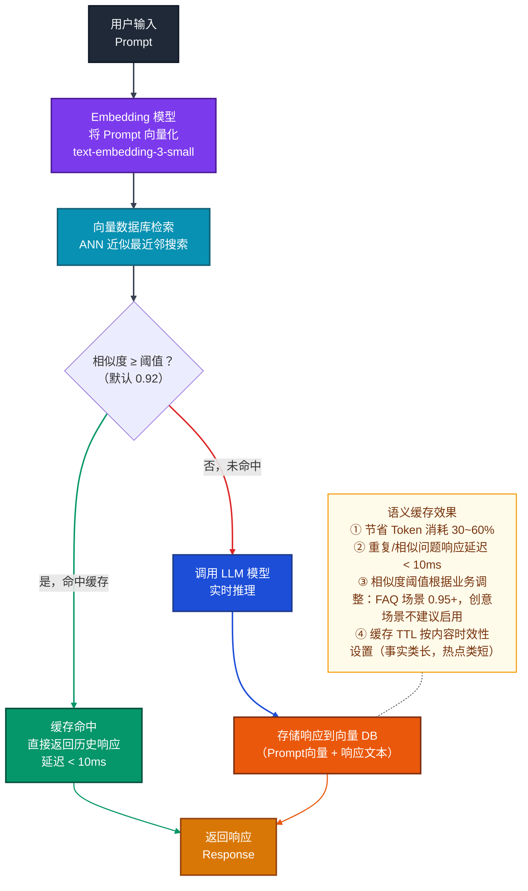
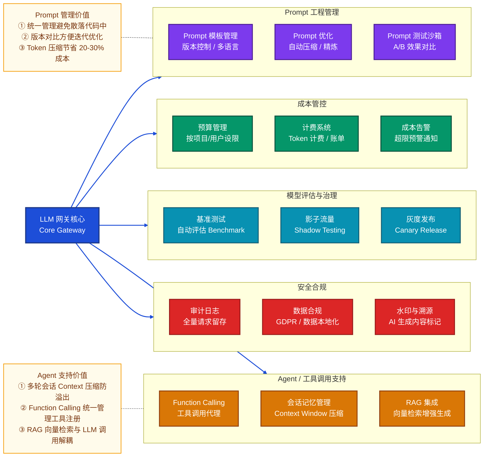
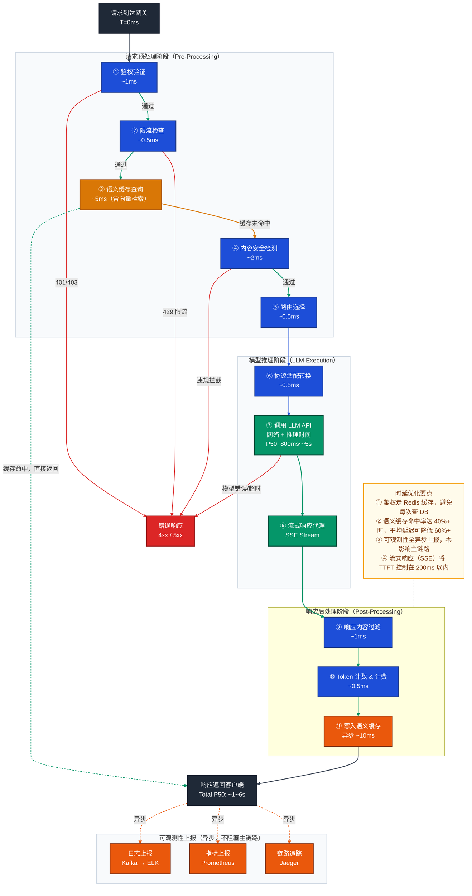
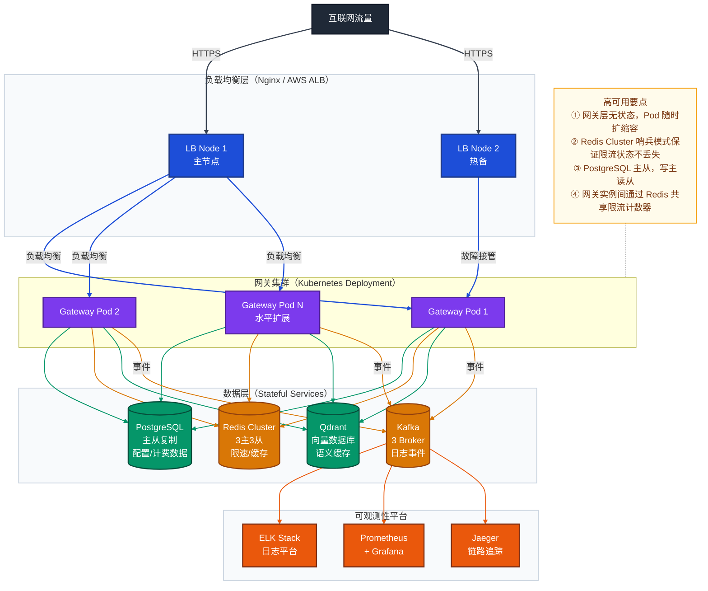
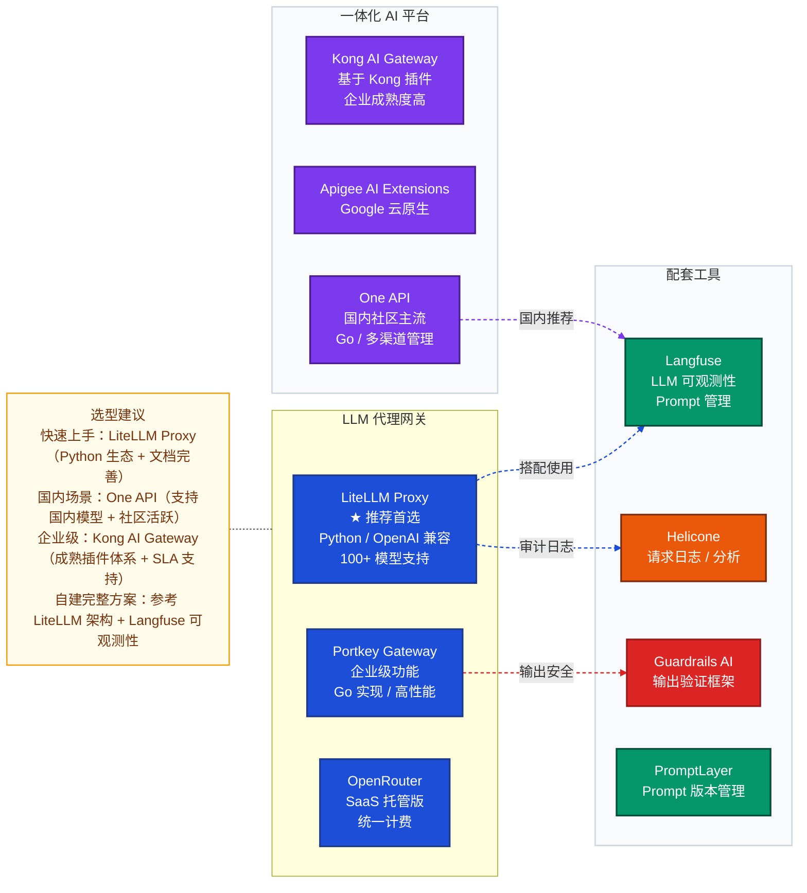

# 大模型网关（LLM Gateway）架构设计全解

> 本文档系统讲解如何从零设计一个生产级 LLM 大模型网关，涵盖架构设计思路、技术栈选型、核心功能模块、扩展能力建设、优秀开源项目推荐，以及面试高频问题解答。

---

## 目录

1. [概述：什么是大模型网关](#一概述什么是大模型网关)
2. [整体架构设计](#二整体架构设计)
3. [技术栈选型](#三技术栈选型)
4. [核心功能模块](#四核心功能模块)
5. [扩展功能模块](#五扩展功能模块)
6. [数据流与关键链路](#六数据流与关键链路)
7. [部署架构](#七部署架构)
8. [优秀开源项目推荐](#八优秀开源项目推荐)
9. [常见问题 FAQ](#九常见问题-faq)

---

## 一、概述：什么是大模型网关

### 1.1 背景与定义

随着 OpenAI、Anthropic、Google、百度、阿里等各大厂商相继推出 LLM（大语言模型）API，企业在使用大模型时面临以下挑战：

- **多模型异构**：不同厂商 API 格式不统一，迁移成本高
- **成本失控**：Token 用量难以追踪，费用黑盒
- **安全合规**：Prompt 注入、数据泄露、内容审核等风险
- **稳定性差**：单一模型故障无法自动切换，SLA 无保障
- **可观测性弱**：请求链路不透明，问题定位困难

**大模型网关（LLM Gateway）** 是专门针对大模型 API 调用的统一接入层，负责对所有上游应用和下游模型提供商之间的流量进行管理、路由、转换、监控和治理。其本质是**面向 AI 场景的 API 网关**。

### 1.2 核心价值

| 价值维度 | 说明 |
|----------|------|
| **统一入口** | 上层应用只需对接网关，无需关心底层模型差异 |
| **成本管控** | 细粒度 Token 计费、预算告警、用量配额 |
| **安全防护** | 鉴权、内容过滤、Prompt 注入检测、数据脱敏 |
| **高可用保障** | 模型故障自动降级/切换、熔断、重试 |
| **可观测性** | 请求链路追踪、Metrics、日志、成本分析 |
| **研发提效** | 统一 SDK、缓存加速、Prompt 模板管理 |

---

## 二、整体架构设计

### 2.1 架构分层概览



### 2.2 设计原则

| 原则 | 说明 |
|------|------|
| **单一职责** | 网关只负责流量治理，不嵌入业务逻辑 |
| **协议兼容** | 完全兼容 OpenAI API 格式，降低迁移成本 |
| **异步解耦** | 日志、计费、通知等走消息队列异步处理 |
| **无状态设计** | 网关节点本身无状态，支持水平扩展 |
| **降级优先** | 故障时优先保证可用性，而非强一致性 |
| **零信任安全** | 每次请求都需完整鉴权，不依赖网络边界 |

---

## 三、技术栈选型

### 3.1 技术栈全景图



### 3.2 技术选型对比

#### 网关实现语言

| 语言 | 优势 | 劣势 | 适用场景 |
|------|------|------|----------|
| **Go** | 高并发、低内存、编译型、部署简单 | AI 生态相对弱 | 纯网关层、高并发场景 |
| **Python** | LangChain/LlamaIndex 生态丰富、AI 工具链完善 | 并发性能差（GIL） | AI 中间件、Prompt 管理 |
| **Node.js** | 流式处理天然友好（SSE/Stream） | 类型安全弱 | BFF 层、流式响应代理 |
| **Rust** | 极致性能、内存安全 | 开发复杂度高 | 超高性能场景 |

**推荐方案**：Go 实现核心网关层 + Python 实现 AI 中间件层（Prompt 处理、语义缓存等）。

#### 向量数据库（语义缓存）

| 方案 | 特点 | 推荐指数 |
|------|------|----------|
| **Redis + RedisSearch** | 低延迟、运维简单、与限流共用实例 | ⭐⭐⭐⭐ |
| **pgvector** | 复用 PostgreSQL、事务一致性好 | ⭐⭐⭐⭐ |
| **Qdrant** | 专业向量数据库、高精度检索 | ⭐⭐⭐⭐⭐ |
| **Chroma** | 轻量、适合开发环境 | ⭐⭐⭐ |

---

## 四、核心功能模块

### 4.1 模块全景图

```mermaid
flowchart TB
    %% ── 配色 ─────────────────────────────────────────────────────────────
    classDef reqStyle     fill:#1d4ed8,stroke:#1e3a8a,stroke-width:2px,color:#fff
    classDef authStyle    fill:#dc2626,stroke:#991b1b,stroke-width:2px,color:#fff
    classDef rlStyle      fill:#d97706,stroke:#92400e,stroke-width:2px,color:#fff
    classDef cacheStyle   fill:#0891b2,stroke:#155e75,stroke-width:2px,color:#fff
    classDef routerStyle  fill:#7c3aed,stroke:#4c1d95,stroke-width:2px,color:#fff
    classDef filterStyle  fill:#dc2626,stroke:#991b1b,stroke-width:2px,color:#fff
    classDef adapterStyle fill:#059669,stroke:#064e3b,stroke-width:2px,color:#fff
    classDef respStyle    fill:#1d4ed8,stroke:#1e3a8a,stroke-width:2px,color:#fff
    classDef obsStyle     fill:#ea580c,stroke:#7c2d12,stroke-width:2px,color:#fff
    classDef noteStyle    fill:#fffbeb,stroke:#f59e0b,stroke-width:1.5px,color:#78350f
    classDef layerStyle   fill:#f8fafc,stroke:#cbd5e0,stroke-width:1.5px

    %% ── 请求进入 ──────────────────────────────────────────────────────────
    REQ["客户端请求<br>Client Request"]:::reqStyle

    %% ── 模块 1：鉴权与访问控制 ───────────────────────────────────────────
    subgraph M1["① 鉴权与访问控制"]
        API_KEY["API Key 验证"]:::authStyle
        OAUTH["OAuth2 / JWT 验证"]:::authStyle
        RBAC["RBAC 权限控制<br>角色/资源/操作"]:::authStyle
    end
    class M1 layerStyle

    %% ── 模块 2：限流与熔断 ────────────────────────────────────────────────
    subgraph M2["② 限流与熔断"]
        RL_TOKEN["Token 级限流<br>TPM / RPM"]:::rlStyle
        RL_USER["用户级配额<br>日/月用量上限"]:::rlStyle
        CB["熔断器<br>Circuit Breaker"]:::rlStyle
        RETRY["重试策略<br>Exponential Backoff"]:::rlStyle
    end
    class M2 layerStyle

    %% ── 模块 3：语义缓存 ──────────────────────────────────────────────────
    subgraph M3["③ 语义缓存"]
        EMBED["Prompt Embedding<br>向量化"]:::cacheStyle
        SIM["相似度检索<br>Cosine Similarity"]:::cacheStyle
        CACHE_HIT["缓存命中直接返回<br>Cache Hit Return"]:::cacheStyle
    end
    class M3 layerStyle

    %% ── 模块 4：智能路由 ──────────────────────────────────────────────────
    subgraph M4["④ 智能路由"]
        ROUTE_RULE["规则路由<br>按模型/版本/标签"]:::routerStyle
        LB["负载均衡<br>加权轮询 / 最小延迟"]:::routerStyle
        FALLBACK["故障转移<br>Primary → Fallback"]:::routerStyle
        AB_TEST["A/B 测试路由<br>流量百分比分配"]:::routerStyle
    end
    class M4 layerStyle

    %% ── 模块 5：内容安全过滤 ──────────────────────────────────────────────
    subgraph M5["⑤ 内容安全过滤"]
        INJ_DET["Prompt 注入检测"]:::filterStyle
        PII["PII 数据脱敏<br>手机号/邮箱/身份证"]:::filterStyle
        MOD["内容审核<br>违禁词 / 有害内容"]:::filterStyle
    end
    class M5 layerStyle

    %% ── 模块 6：协议适配 ──────────────────────────────────────────────────
    subgraph M6["⑥ 协议适配层"]
        OPENAI_COMPAT["OpenAI 兼容适配"]:::adapterStyle
        AZURE_ADAPT["Azure OpenAI 适配"]:::adapterStyle
        CLAUDE_ADAPT["Anthropic 适配"]:::adapterStyle
        STREAM["流式响应代理<br>SSE / Stream"]:::adapterStyle
    end
    class M6 layerStyle

    %% ── 模块 7：可观测性 ──────────────────────────────────────────────────
    subgraph M7["⑦ 可观测性（贯穿全链路）"]
        direction LR
        MLOG["结构化日志<br>请求/响应/错误"]:::obsStyle
        MMETRIC["指标采集<br>延迟/Token/成本"]:::obsStyle
        MTRACE["分布式追踪<br>TraceID 全链路"]:::obsStyle
    end
    class M7 layerStyle

    %% ── 响应返回 ──────────────────────────────────────────────────────────
    RESP["客户端响应<br>Client Response"]:::respStyle

    %% ── 数据流 ────────────────────────────────────────────────────────────
    REQ --> API_KEY
    REQ --> OAUTH
    API_KEY --> RBAC
    OAUTH --> RBAC
    RBAC --> RL_TOKEN
    RL_TOKEN --> RL_USER
    RL_USER --> CB
    CB --> RETRY
    RETRY --> EMBED
    EMBED --> SIM
    SIM -->|"缓存命中"| CACHE_HIT
    SIM -->|"缓存未命中"| ROUTE_RULE
    CACHE_HIT --> RESP
    ROUTE_RULE --> LB
    LB --> FALLBACK
    FALLBACK --> AB_TEST
    AB_TEST --> INJ_DET
    INJ_DET --> PII
    PII --> MOD
    MOD --> OPENAI_COMPAT
    OPENAI_COMPAT --> STREAM
    STREAM --> RESP
    RESP -.->|"异步上报"| MLOG
    RESP -.->|"异步上报"| MMETRIC
    RESP -.->|"异步上报"| MTRACE

    %% 边索引 0-23，共 24 条
    linkStyle 0,1 stroke:#374151,stroke-width:2px
    linkStyle 2,3 stroke:#dc2626,stroke-width:1.5px
    linkStyle 4,5,6,7 stroke:#d97706,stroke-width:2px
    linkStyle 8,9 stroke:#0891b2,stroke-width:2px
    linkStyle 10 stroke:#0891b2,stroke-width:1.5px,stroke-dasharray:4 3
    linkStyle 11 stroke:#7c3aed,stroke-width:2px
    linkStyle 12 stroke:#0891b2,stroke-width:1.5px,stroke-dasharray:4 3
    linkStyle 13,14,15,16 stroke:#7c3aed,stroke-width:2px
    linkStyle 17,18,19 stroke:#dc2626,stroke-width:2px
    linkStyle 20,21 stroke:#059669,stroke-width:2px
    linkStyle 22 stroke:#374151,stroke-width:2px
    linkStyle 23,24,25 stroke:#ea580c,stroke-width:1.5px,stroke-dasharray:4 3
```

### 4.2 鉴权与访问控制

#### 认证流程

```mermaid
flowchart LR
    %% ── 配色 ─────────────────────────────────────────────────────────────
    classDef clientStyle   fill:#1f2937,stroke:#111827,stroke-width:2px,color:#f9fafb
    classDef gatewayStyle  fill:#1d4ed8,stroke:#1e3a8a,stroke-width:2.5px,color:#fff
    classDef authStyle     fill:#dc2626,stroke:#991b1b,stroke-width:2px,color:#fff
    classDef cacheStyle    fill:#0891b2,stroke:#155e75,stroke-width:2px,color:#fff
    classDef dbStyle       fill:#059669,stroke:#064e3b,stroke-width:2px,color:#fff
    classDef successStyle  fill:#059669,stroke:#064e3b,stroke-width:2px,color:#fff
    classDef errorStyle    fill:#dc2626,stroke:#991b1b,stroke-width:2px,color:#fff
    classDef noteStyle     fill:#fffbeb,stroke:#f59e0b,stroke-width:1.5px,color:#78350f
    classDef layerStyle    fill:#f8fafc,stroke:#cbd5e0,stroke-width:1.5px

    CLIENT["客户端<br>带 API Key 请求"]:::clientStyle
    GW["网关入口<br>Gateway"]:::gatewayStyle
    EXTRACT["提取认证信息<br>Header / Bearer Token"]:::authStyle
    REDIS_CHK["Redis 缓存查询<br>已验证 Key 缓存"]:::cacheStyle
    DB_CHK[("数据库查询<br>Key 状态 / 权限"]:::dbStyle
    RBAC_CHK["RBAC 权限验证<br>Role & Resource"]:::authStyle
    QUOTA_CHK["配额检查<br>用量是否超限"]:::authStyle
    PASS["鉴权通过<br>✓ Allow"]:::successStyle
    REJECT["鉴权失败<br>✗ 401 / 403 / 429"]:::errorStyle

    CLIENT -->|"请求"| GW
    GW --> EXTRACT
    EXTRACT -->|"查缓存"| REDIS_CHK
    REDIS_CHK -->|"缓存未命中"| DB_CHK
    REDIS_CHK -->|"缓存命中"| RBAC_CHK
    DB_CHK -->|"Key 有效，写回缓存"| RBAC_CHK
    DB_CHK -->|"Key 无效"| REJECT
    RBAC_CHK -->|"权限不足"| REJECT
    RBAC_CHK -->|"权限满足"| QUOTA_CHK
    QUOTA_CHK -->|"超出配额"| REJECT
    QUOTA_CHK -->|"配额充足"| PASS

    NOTE["认证要点<br>① API Key 缓存至 Redis（TTL 5min），降低 DB 压力<br>② RBAC 支持多租户：租户 → 应用 → API Key 三级隔离<br>③ Key 轮转支持双 Key 过渡期，零停机更换"]:::noteStyle
    NOTE -.- RBAC_CHK

    %% 边索引 0-10，共 11 条
    linkStyle 0 stroke:#374151,stroke-width:2px
    linkStyle 1 stroke:#dc2626,stroke-width:1.5px
    linkStyle 2 stroke:#0891b2,stroke-width:1.5px
    linkStyle 3 stroke:#0891b2,stroke-width:1.5px,stroke-dasharray:4 3
    linkStyle 4 stroke:#0891b2,stroke-width:1.5px,stroke-dasharray:4 3
    linkStyle 5 stroke:#059669,stroke-width:1.5px
    linkStyle 6 stroke:#dc2626,stroke-width:1.5px
    linkStyle 7 stroke:#dc2626,stroke-width:1.5px
    linkStyle 8 stroke:#059669,stroke-width:1.5px
    linkStyle 9 stroke:#dc2626,stroke-width:1.5px
    linkStyle 10 stroke:#059669,stroke-width:2px
```

**关键设计点：**

- **多租户隔离**：`Tenant → Project → API Key` 三级资源隔离
- **API Key 管理**：支持 Key 创建、轮转、吊销，双 Key 过渡期保证零停机
- **权限细化**：基于 RBAC 控制可调用的模型列表、最大 Token 数、可访问 API 端点
- **审计日志**：每次 Key 使用均记录，支持溯源

### 4.3 限流与熔断

**限流维度设计（多层联合限流）：**

| 限流层级 | 限流维度 | 窗口算法 | 存储 |
|----------|----------|----------|------|
| 全局限流 | 所有请求 QPS | 滑动窗口 | Redis |
| 模型级限流 | 每个模型 TPM/RPM | 令牌桶 | Redis |
| 用户级限流 | 每个 API Key RPM | 固定窗口 | Redis |
| IP 限流 | 单 IP QPS | 漏桶 | Redis |

**熔断器状态机：**



### 4.4 智能路由

路由策略支持多种模式，可按需组合：

| 路由策略 | 场景 | 实现方式 |
|----------|------|----------|
| **规则路由** | 按请求标签/模型版本固定路由 | 配置中心规则匹配 |
| **加权轮询** | 多模型负载均衡 | Redis 计数轮转 |
| **最小延迟** | 优先路由到响应最快的端点 | 滑动窗口延迟统计 |
| **故障转移** | 主模型不可用时切换备用 | 健康检查 + 自动切换 |
| **成本最优** | 优先使用单价低的模型 | Token 单价排序 |
| **A/B 测试** | 新旧模型效果对比 | 流量百分比分配 |

### 4.5 语义缓存

语义缓存是 LLM 网关区别于普通 API 网关的核心特性，通过向量相似度匹配来复用历史响应。

**工作原理：**



### 4.6 协议适配层

不同厂商的 LLM API 格式差异较大，协议适配层负责统一转换：

| 适配目标 | 输入格式 | 输出格式 | 特殊处理 |
|----------|----------|----------|----------|
| OpenAI GPT | OpenAI 标准 | 透传 | Function Calling、Vision |
| Azure OpenAI | OpenAI 标准 | Azure 格式转换 | 部署名映射 |
| Anthropic Claude | OpenAI 标准 | Claude Messages API | System Prompt 位置 |
| Google Gemini | OpenAI 标准 | Gemini 格式 | Multi-modal 内容转换 |
| 通义千问/文心一言 | OpenAI 标准 | 各厂商私有格式 | 字段映射 |
| 私有部署 Ollama | OpenAI 标准 | Ollama API | 本地模型名映射 |

### 4.7 可观测性体系

**关键监控指标（Golden Signals for LLM）：**

| 类别 | 指标名 | 说明 |
|------|--------|------|
| **延迟** | `llm_request_duration_p99` | 端到端请求 P99 延迟 |
| **延迟** | `llm_first_token_latency_p50` | 首 Token 延迟（TTFT） |
| **吞吐** | `llm_requests_total` | 总请求量（按模型/状态分组） |
| **Token** | `llm_tokens_used_total` | 总 Token 消耗量 |
| **成本** | `llm_cost_usd_total` | 总费用（美元） |
| **错误** | `llm_error_rate` | 错误率（按错误类型分组） |
| **缓存** | `llm_cache_hit_rate` | 语义缓存命中率 |
| **熔断** | `llm_circuit_breaker_state` | 熔断器当前状态 |

---

## 五、扩展功能模块

### 5.1 扩展功能全景



### 5.2 Prompt 工程管理

| 功能 | 说明 |
|------|------|
| **模板仓库** | 集中管理 Prompt 模板，支持参数化变量、多语言版本 |
| **版本控制** | 类 Git 的版本管理，支持回滚、diff 对比 |
| **Prompt 压缩** | 自动裁剪冗余内容、压缩历史消息，减少 Token 消耗 |
| **A/B 测试** | 对比不同 Prompt 版本的效果指标（准确率、满意度） |
| **注入防护** | 检测并拦截 Prompt Injection 攻击 |

### 5.3 成本管控体系

**多级预算控制：**

```
全局预算上限
  └── 租户预算
        └── 项目预算
              └── API Key 预算
                    └── 单次请求 Token 上限
```

**计费策略：**
- 实时 Token 计数（Input + Output Token 分别计价）
- 支持自定义单价（私有模型自定义成本）
- 每日/每月账单报表自动生成
- 预算使用率达 80%/100% 时触发邮件/Webhook 告警

### 5.4 Agent 与工具调用支持

| 能力 | 说明 |
|------|------|
| **Function Calling 代理** | 统一管理工具定义，网关层执行工具调用并回填结果 |
| **会话记忆压缩** | 超出 Context Window 时自动压缩历史，保留关键信息 |
| **RAG 集成** | 支持在请求前注入检索结果，增强回答准确性 |
| **多轮对话状态** | 维护会话状态，支持跨请求的上下文连续性 |

---

## 六、数据流与关键链路

### 6.1 完整请求生命周期



### 6.2 流式响应（SSE）处理链路

流式响应（Server-Sent Events）是 LLM 网关与普通 API 网关的重要差异点：

```
客户端 ←──── 网关（SSE 代理）←──── LLM API（Chunked Transfer）
         实时转发每个 Token            每生成一个 Token 推送一次
```

**关键实现点：**
- 网关不缓冲完整响应，而是**边收边转发**（减少首字延迟）
- 流式传输期间实时累计 Token 计数
- 连接中断时支持优雅处理（记录已消费 Token）
- 支持 SSE 心跳保活（防止客户端超时断开）

---

## 七、部署架构

### 7.1 生产部署架构



### 7.2 Kubernetes 资源配置建议

| 组件 | CPU Request | Memory Request | 副本数 | HPA 策略 |
|------|-------------|---------------|--------|----------|
| Gateway Pod | 500m | 512Mi | 3 | CPU > 70% 自动扩容 |
| Redis | 500m | 1Gi | 6（3主3从） | 手动扩容 |
| PostgreSQL | 1000m | 2Gi | 2（主从） | 手动扩容 |
| Qdrant | 1000m | 2Gi | 3 | 手动扩容 |

---

## 八、优秀开源项目推荐

### 8.1 核心网关项目



### 8.2 项目详细对比

| 项目 | 语言 | Stars | 支持模型数 | 核心亮点 | 适用场景 |
|------|------|-------|-----------|----------|----------|
| **[LiteLLM](https://github.com/BerriAI/litellm)** | Python | 15k+ | 100+ | OpenAI 兼容、轻量部署、Proxy 模式 | 快速集成、开发测试 |
| **[One API](https://github.com/songquanpeng/one-api)** | Go | 18k+ | 30+ | 国内模型完善支持、渠道管理、中文文档 | 国内企业、个人 |
| **[Portkey Gateway](https://github.com/Portkey-AI/gateway)** | TypeScript | 6k+ | 200+ | 高性能、完整 AI Gateway 功能 | 企业生产环境 |
| **[Kong AI Gateway](https://github.com/Kong/kong)** | Lua/Go | 38k+ | 插件扩展 | 企业级成熟度、插件生态完善 | 大型企业 |
| **[Langfuse](https://github.com/langfuse/langfuse)** | TypeScript | 8k+ | — | LLM 可观测性、Prompt 管理 | 监控配套 |
| **[Helicone](https://github.com/Helicone/helicone)** | TypeScript | 2k+ | — | 零代码接入、请求分析 | 快速监控 |

### 8.3 推荐组合方案

**方案一：快速上手（个人/小团队）**
```
LiteLLM Proxy + Langfuse + Redis
```

**方案二：国内企业首选**
```
One API + 自建 Prometheus/Grafana + Redis Cluster
```

**方案三：企业级完整方案**
```
自研网关（Go）+ Portkey 参考架构 + Langfuse + ClickHouse + Kafka
```

**方案四：云原生大规模**
```
Kong AI Gateway + Kubernetes + Istio + 全套 ELK + Jaeger
```

---

## 九、常见问题 FAQ

### Q1：LLM 网关和普通 API 网关有什么核心区别？

**A：** 普通 API 网关主要处理 HTTP 请求的路由、鉴权、限流，而 LLM 网关在此基础上针对大模型场景做了深度定制：

| 对比维度 | 普通 API 网关 | LLM 网关 |
|----------|--------------|----------|
| **限流单位** | QPS/RPS | Token Per Minute（TPM）、Request Per Minute（RPM）双维度 |
| **缓存策略** | 精确匹配缓存 | 语义相似度缓存（向量检索） |
| **成本感知** | 无 | Token 计费、预算管控、成本分析 |
| **流式处理** | 较少涉及 | SSE/Stream 是核心能力 |
| **协议转换** | 路径/Header 转发 | 不同 LLM 厂商 API 格式互转 |
| **安全** | IP/签名验证 | Prompt 注入检测、PII 脱敏、内容审核 |
| **可观测性** | 延迟/错误率 | 额外增加 Token 消耗、TTFT、成本等 AI 专属指标 |

---

### Q2：语义缓存的相似度阈值如何设定？阈值太低会有什么问题？

**A：** 相似度阈值是语义缓存最关键的超参数，直接影响缓存效果和回答准确性：

- **阈值过高（如 0.99）**：几乎等同于精确匹配，缓存命中率极低，失去语义缓存的价值
- **阈值过低（如 0.80）**：语义差异较大的问题会命中同一缓存，导致**答非所问**，严重影响用户体验

**推荐策略：**

| 业务场景 | 推荐阈值 | 原因 |
|----------|----------|------|
| FAQ 问答 / 知识库 | 0.93～0.97 | 问题表述相似但实质相同 |
| 代码生成 | 0.95+ | 代码需求细微差异导致结果完全不同 |
| 客服对话 | 0.90～0.95 | 允许一定语义模糊 |
| 创意写作 | **不建议启用** | 每次需要新鲜创意内容 |
| 数据分析 | 0.95+ | 数据精确性要求高 |

**工程建议**：在 A/B 测试下，从高阈值逐步降低，同时监控"缓存不满意率"指标（用户反馈负面 + 命中缓存的比率）。

---

### Q3：如何实现多模型的故障转移（Failover）？有哪些注意事项？

**A：** 故障转移需要设计**主备模型链**（Fallback Chain）：

```
主模型（gpt-4o）→ 备用1（claude-3-sonnet）→ 备用2（gemini-pro）→ 降级提示
```

**触发条件：**
- HTTP 状态码 5xx（服务端错误）
- 超时（建议设置 30s 超时）
- 熔断器 OPEN 状态
- 错误响应格式（模型 API 变更）

**注意事项：**
1. **Prompt 兼容性**：不同模型对 System Prompt 格式要求不同，切换时需要适配
2. **成本意识**：切换到更贵模型需要通知或审批机制
3. **幂等性**：重试请求要防止重复计费
4. **用户感知**：流式场景中已发送部分内容，切换模型需要重置流
5. **告警通知**：主模型降级时应立即告警，而非静默切换

---

### Q4：Token 限流和请求数限流应该如何配合使用？

**A：** LLM 场景下两者缺一不可：

- **单纯 RPM（请求数/分钟）限流**：一个请求携带 10 万 Token，而另一个只有 100 Token，RPM 限流无法控制实际资源消耗
- **单纯 TPM（Token/分钟）限流**：无法防止恶意用户发送大量小请求（DDoS 场景）

**推荐联合策略：**
```
每分钟请求数 ≤ 60 RPM  AND  每分钟 Token ≤ 100,000 TPM
```

**实现细节（Redis 令牌桶）：**
- 维护两个独立的计数器：`key:{user_id}:rpm` 和 `key:{user_id}:tpm`
- 请求进来时先检查 RPM，通过后预扣 `max_tokens`（请求中声明的上限）
- 请求完成后用**实际消耗 Token** 修正计数（避免预扣过多影响其他请求）

---

### Q5：如何防止 Prompt 注入攻击？有哪些检测手段？

**A：** Prompt 注入是 LLM 应用面临的核心安全威胁，攻击者通过构造特殊输入，诱导模型忽略系统指令或泄露敏感信息。

**检测手段：**

| 方法 | 原理 | 准确率 | 性能开销 |
|------|------|--------|----------|
| **关键词黑名单** | 匹配"忽略系统提示"等特征词 | 低（易绕过） | 极低 |
| **规则引擎** | 正则匹配越权指令模式 | 中 | 低 |
| **分类器模型** | 专训 Prompt 注入分类模型 | 高 | 中（需推理） |
| **二次验证** | 将用户输入单独发给 LLM 判断是否注入 | 高 | 高（额外调用） |
| **输入沙箱** | 对用户输入 Prompt 进行结构化隔离 | 高 | 低 |

**工程最佳实践：**
- System Prompt 与 User Input 严格分离，不允许 User Input 覆盖 System 级指令
- 对于高安全场景，使用分类器模型 + 二次验证双重防护
- 建立注入样本库，持续迭代更新检测规则

---

### Q6：流式响应（SSE）场景下如何准确计算 Token 用量？

**A：** 流式响应（Streaming）是 LLM 特有的挑战，因为 Token 是逐个生成的：

**方案一：事后计算（推荐）**
- 累积所有流式 chunks 中的文本内容
- 流式传输结束后，调用 tiktoken/tokenizer 统一计算
- 优点：精确；缺点：需要缓存完整响应

**方案二：流式 Token 累计**
- 监听每个 chunk 中的 `usage` 字段（OpenAI 最新 API 在最后一个 chunk 中返回 usage）
- 从最后一个 `data: [DONE]` 前的 chunk 解析 `usage.completion_tokens`
- 优点：实时；缺点：依赖 API 支持

**方案三：预估修正**
- 请求发送前预估 output tokens（按 max_tokens 上限）
- 流式结束后以实际值修正
- 优点：可实时计费；缺点：有误差窗口

**实践建议**：优先使用方案二（解析 API 返回的 usage），不支持时降级为方案一。

---

### Q7：网关层做语义缓存，怎么保证缓存内容的时效性？

**A：** 语义缓存面临"**知识时效性**"和"**缓存命中率**"的经典权衡：

**TTL 策略设计：**

| 内容类型 | 推荐 TTL | 原因 |
|----------|----------|------|
| 产品文档/FAQ | 24h ～ 7d | 更新频率低 |
| 新闻摘要/热点 | 1h ～ 4h | 内容时效性强 |
| 代码解释 | 7d ～ 30d | 代码通常稳定 |
| 实时数据查询 | **不缓存** | 每次需最新结果 |
| 通用知识问答 | 3d ～ 7d | 较稳定 |

**主动失效机制：**
- **标签失效**：给缓存条目打领域标签（如 `product-v2`），产品更新时批量失效
- **版本失效**：Prompt 模板版本变更时，自动清除相关缓存
- **手动清除接口**：提供管理 API，允许运营手动清除指定主题缓存

---

### Q8：如何设计多租户隔离方案？

**A：** LLM 网关的多租户隔离需要在以下维度保证隔离：

```
租户A (Tenant A)
  ├── 项目1 (Project 1)
  │     ├── API Key: sk-xxx-1 (生产环境)
  │     └── API Key: sk-xxx-2 (测试环境)
  └── 项目2 (Project 2)
        └── API Key: sk-xxx-3

租户B (Tenant B)
  └── 项目3 (Project 3)
```

**隔离维度：**

| 维度 | 隔离方式 |
|------|----------|
| **资源隔离** | 每个租户独立的 Token 配额、并发限制 |
| **数据隔离** | 请求日志按租户分区存储，禁止跨租户查询 |
| **缓存隔离** | 语义缓存 Key 加租户前缀（`tenant_id:vector_hash`） |
| **模型权限** | 按租户配置可访问的模型列表（如：免费版只能用低成本模型） |
| **费率隔离** | 不同租户可配置不同计费费率（企业协议价） |
| **网络隔离** | 高安全租户可配置独立出口 IP（满足模型厂商 IP 白名单要求） |

---

### Q9：LLM 网关的性能瓶颈通常在哪里？如何优化？

**A：** 性能瓶颈分析与优化：

| 瓶颈点 | 典型表现 | 优化方案 |
|--------|----------|----------|
| **Redis 限流争用** | 高并发下限流延迟增加 | Redis Cluster 分片、本地 + 远程双层限流 |
| **向量检索延迟** | 语义缓存查询 > 20ms | 使用 HNSW 索引、限制向量维度（≤1536）、缩小检索范围 |
| **数据库鉴权查询** | API Key 验证慢 | Redis 热缓存（TTL 5min）、连接池优化 |
| **协议适配序列化** | JSON 序列化 CPU 高 | 使用 sonic/simdjson 等高性能 JSON 库 |
| **流式响应积压** | 内存占用高 | 背压机制、连接数限制、超时强制断开 |
| **网关节点 CPU** | 单节点 CPU 打满 | 水平扩展、减少同步处理、异步上报 |

**核心优化原则**：网关层要做到**零业务逻辑**——所有可异步的操作（日志、计费、缓存写入）都异步化，主链路只做**鉴权→限流→路由→转发**四件事。

---

### Q10：如何评估一个 LLM 网关的完善程度？

**A：** 可以从以下维度进行评估（按重要性排序）：

**P0 必须具备：**
- [ ] 支持 OpenAI API 兼容格式
- [ ] API Key 鉴权与多租户隔离
- [ ] Token 级别限流（TPM/RPM）
- [ ] 多模型路由与故障转移
- [ ] 基础请求日志

**P1 生产必备：**
- [ ] 语义缓存（命中率 > 30%）
- [ ] 成本统计与预算告警
- [ ] 熔断器与重试机制
- [ ] Prompt 注入检测
- [ ] PII 数据脱敏
- [ ] P99 延迟 / 错误率告警
- [ ] 流式响应（SSE）支持

**P2 高级能力：**
- [ ] Prompt 模板管理
- [ ] A/B 测试路由
- [ ] 成本最优路由
- [ ] Function Calling 代理
- [ ] 会话记忆压缩
- [ ] RAG 集成支持
- [ ] 分布式链路追踪

**P3 企业增强：**
- [ ] 水印与内容溯源
- [ ] GDPR 合规数据处理
- [ ] 审计日志（不可篡改）
- [ ] 多云 / 混合云部署
- [ ] SLA 保障协议

---

> **总结**：一个完善的 LLM 网关本质上是**流量治理 + AI 专属能力**的融合产物。建议优先参考 LiteLLM、One API 等开源项目快速验证核心功能，再根据业务规模和特定需求进行二次开发或替换为自研方案。核心理念是：**让业务代码专注于业务逻辑，让网关承载所有与模型调用相关的横切关注点**。
