# 算力调度平台技术文档

> 本文档系统梳理国产芯片底层架构、主流推理框架与引擎、推理加速核心技术，并详细阐述算力调度平台的设计方法论与全流程示例。

---

## 目录

1. [国产芯片底层架构](#1-国产芯片底层架构)
2. [常用推理框架](#2-常用推理框架)
3. [常用推理引擎](#3-常用推理引擎)
4. [推理加速核心技术](#4-推理加速核心技术)
5. [模型推理加速实践](#5-模型推理加速实践)
6. [算力调度平台设计](#6-算力调度平台设计)
7. [全流程示例](#7-全流程示例)
8. [面试常见问题 FAQ](#8-面试常见问题-faq)

---

## 1. 国产芯片底层架构

### 1.1 国产 AI 芯片生态全景

国产 AI 芯片经过近年发展，已形成覆盖云端训练、云端推理、边缘推理等多层级的完整生态。核心厂商包括华为昇腾（Ascend）、寒武纪（Cambricon）、海光（Hygon）、燧原科技（Enflame）、壁仞科技（Biren）、昆仑芯（Kunlunxin）、天数智芯（Iluvatar）等。

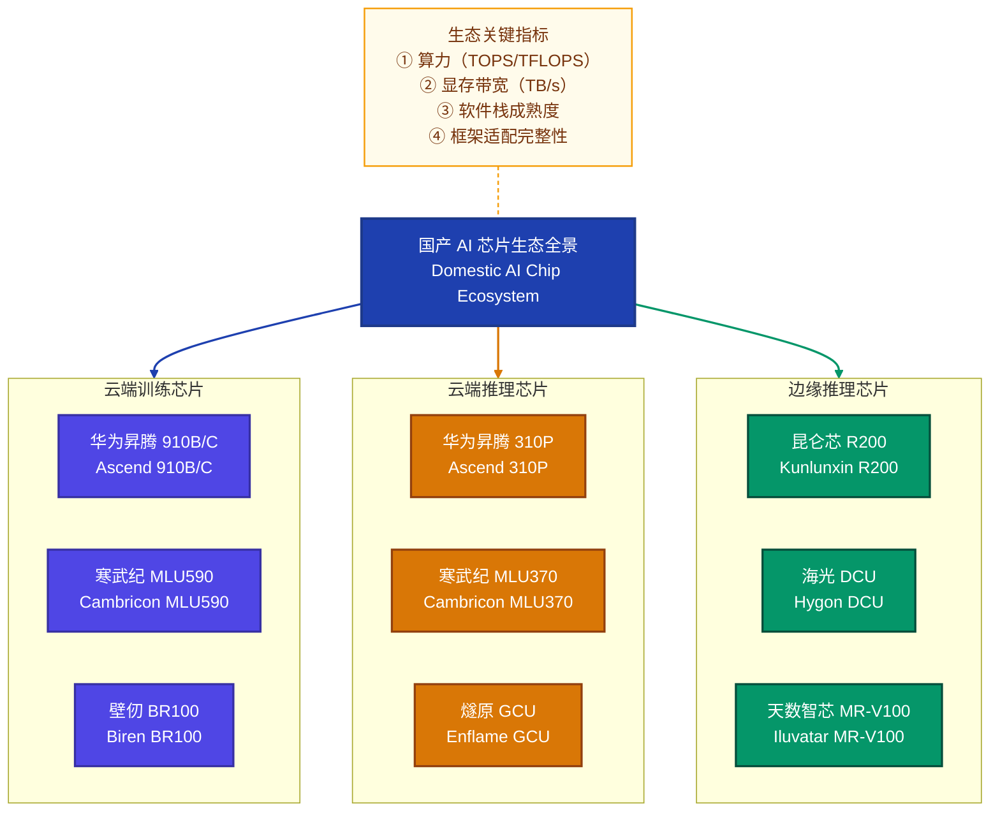

### 1.2 典型芯片架构对比

| 芯片厂商 | 代表芯片 | 架构特点 | 计算核心 | 峰值算力（INT8） | 显存/带宽 | 软件栈 |
|----------|---------|---------|---------|-----------------|----------|--------|
| **华为昇腾** | Ascend 910B | 达芬奇架构（Da Vinci），3D Cube 计算引擎 | AI Core（Cube/Vector/Scalar 三级流水线） | ~640 TOPS | 64GB HBM2e / 1.6TB/s | CANN（Compute Architecture for Neural Networks） |
| **寒武纪** | MLU590 | MLUarch03 架构，SIMD + 张量指令混合 | IPU（Intelligent Processing Unit） | ~1024 TOPS | 48GB HBM2e / 1.2TB/s | CNToolkit + MagicMind |
| **海光** | DCU Z100 | 类 GPGPU 架构（x86 + GPGPU） | CU（Compute Unit），SIMT 编程模型 | ~296 TOPS | 32GB HBM2e / 1.0TB/s | DTK（DCU Toolkit），兼容 ROCm |
| **壁仞** | BR100 | 自研 GCSA 架构（General Computing Systolic Array） | 脉动阵列 + SIMT 融合 | ~2048 TOPS | 64GB HBM2e / 1.6TB/s | BIRENSUPA |
| **燧原** | GCU i20 | GCU 架构，SPC（Stream Processing Cluster） | SPC 流处理簇，VLIW 指令 | ~512 TOPS | 32GB HBM2 / 819GB/s | TopsRider |
| **昆仑芯** | R200 | XPU 架构，融合 SDNN + SIMD | XPU Core，多级缓存体系 | ~256 TOPS | 16GB GDDR6 / 512GB/s | XTDK（XPU Toolkit） |

### 1.3 华为昇腾达芬奇架构深度解析

达芬奇架构（Da Vinci Architecture）是华为面向 AI 场景自研的计算架构，以 AI Core 为基本计算单元。每个 AI Core 包含三个计算单元与两个存储单元，形成高效的异构计算流水线。

**三级计算单元：**

- **Cube Unit（矩阵计算单元）**：负责矩阵乘法运算，单次可完成 $C_{m \times n} = A_{m \times k} \times B_{k \times n}$ 的矩阵运算，其中典型配置为 $m=n=16, k=16$，单 Cube 单周期完成 $16 \times 16 \times 16 = 4096$ 次 FP16 MAC 运算
- **Vector Unit（向量计算单元）**：负责非矩阵类向量运算（如激活函数、Softmax、LayerNorm），支持 FP16/FP32/INT8 多精度运算
- **Scalar Unit（标量计算单元）**：负责地址计算、流程控制和标量运算，类似 CPU 中的控制核心

**两级存储体系：**

- **L1 Buffer（局部缓存）**：片上 SRAM，提供高带宽低延迟的数据访问，典型容量为 512KB~1MB
- **L2 Buffer（共享缓存）**：多 AI Core 共享的 L2 缓存，用于跨核数据交换

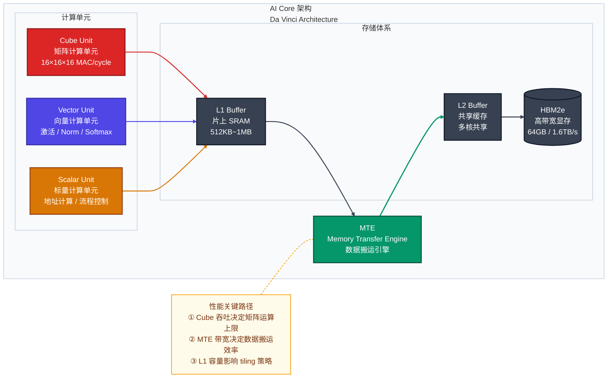

### 1.4 国产芯片软件栈体系

国产芯片的软件栈是连接上层框架（如 PyTorch、PaddlePaddle）和底层硬件之间的桥梁，通常分为四个层级：

| 层级 | 职责 | 华为昇腾 | 寒武纪 | 海光 DCU |
|------|------|---------|--------|---------|
| **应用框架层** | 提供模型开发 API | MindSpore / PyTorch（Ascend 适配） | PyTorch（Cambricon 适配） | PyTorch（ROCm 适配） |
| **图编译层** | 计算图优化与编译 | GE（Graph Engine） | MagicMind | MIGraphX |
| **算子库层** | 高性能算子实现 | CANN Ops | CNNops / BANGC | rocBLAS / MIOpen |
| **驱动层** | 硬件抽象与驱动 | Ascend Driver / HAL | CNDrv | DTK Driver / ROCm |

---

## 2. 常用推理框架

### 2.1 推理框架概述

推理框架是将训练好的模型部署到生产环境中、执行前向推理（Forward Inference）的软件系统。与训练框架不同，推理框架重点关注推理延迟（Latency）、吞吐量（Throughput）和资源效率（Resource Efficiency）。

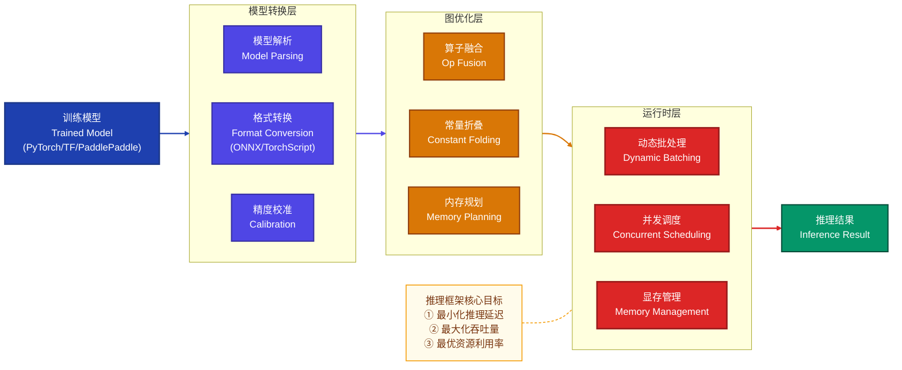

### 2.2 主流推理框架对比

| 框架名称 | 开发者 | 适用场景 | 支持硬件 | 特色功能 | LLM 支持 |
|---------|--------|---------|---------|---------|---------|
| **vLLM** | UC Berkeley | 大模型在线推理服务 | NVIDIA GPU / AMD GPU / 昇腾 | PagedAttention 显存管理 | 原生支持 |
| **TensorRT-LLM** | NVIDIA | 大模型高性能推理 | NVIDIA GPU（Ampere+） | 深度 kernel 优化 + In-flight Batching | 原生支持 |
| **ONNX Runtime** | Microsoft | 通用模型跨平台推理 | CPU / GPU / NPU / 多国产芯片 | ONNX 标准格式、广泛硬件覆盖 | 通过扩展支持 |
| **TorchServe** | Meta / AWS | PyTorch 模型部署 | CPU / NVIDIA GPU | 与 PyTorch 生态无缝集成 | 基础支持 |
| **Triton Inference Server** | NVIDIA | 多模型多框架统一服务 | NVIDIA GPU | 模型仓库管理、动态批处理、多框架后端 | 作为服务层支持 |
| **MindSpore Lite** | 华为 | 端侧/边缘推理 | 昇腾 / Kirin NPU / CPU | 华为全栈适配、图编译优化 | 有限支持 |
| **PaddleLite** | 百度 | 移动端/边缘推理 | CPU / GPU / 昆仑芯 / 寒武纪 | 百度生态集成、国产芯片广泛适配 | 通过 PaddleNLP |
| **llama.cpp** | 开源社区 | 轻量级本地推理 | CPU / GPU（CUDA/Metal/Vulkan） | 纯 C++ 实现、极低依赖 | 原生支持 |

### 2.3 vLLM 架构深度解析

vLLM 是当前大语言模型推理领域最具影响力的开源框架之一，核心创新是 **PagedAttention** 机制。

**PagedAttention 原理：**

传统 KV Cache 管理为每个请求预分配连续的最大长度显存，导致严重的显存碎片和浪费。PagedAttention 借鉴操作系统的虚拟内存分页管理思想：

- 将 KV Cache 划分为固定大小的 **Block**（页），每个 Block 存储固定数量 token 的 KV 值
- 使用 **Block Table（页表）** 维护逻辑 Block 到物理 Block 的映射关系
- 物理 Block 按需分配，无需连续，大幅减少显存碎片

显存利用率从传统方式的 20%~40% 提升到 **90%+**，吞吐量提升 2~4 倍。

$$
\text{Attention}(Q, K, V) = \text{softmax}\left(\frac{QK^T}{\sqrt{d_k}}\right)V
$$

在 PagedAttention 中，$K$ 和 $V$ 被分页存储：

$$
K = [K_{\text{block}_0}, K_{\text{block}_1}, \ldots, K_{\text{block}_n}]
$$

每个 $K_{\text{block}_i}$ 的物理地址通过 Block Table 查找，类似 OS 页表：

$$
\text{PhysAddr}(K_{\text{block}_i}) = \text{BlockTable}[\text{SeqID}][i]
$$

---

## 3. 常用推理引擎

### 3.1 推理引擎 vs 推理框架

推理引擎（Inference Engine）侧重底层计算优化和硬件抽象，负责将模型的计算图高效映射到目标硬件；推理框架（Inference Framework）则更偏上层，涵盖模型服务化、请求调度、负载均衡等生产级能力。两者的关系为：**推理框架调用推理引擎完成底层计算**。

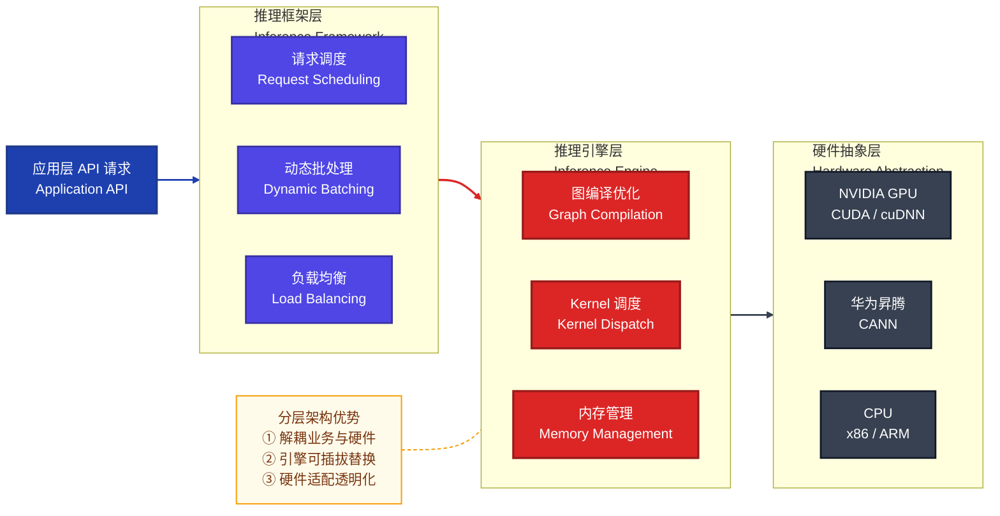

### 3.2 主流推理引擎详解

#### 3.2.1 TensorRT

NVIDIA TensorRT 是目前最成熟的 GPU 推理引擎，核心优化策略：

- **层融合（Layer Fusion）**：将多个连续层（如 Conv+BN+ReLU）融合为单个 CUDA Kernel，减少 Kernel Launch 开销和中间数据读写
- **精度校准（Precision Calibration）**：支持 FP32→FP16→INT8 的自动精度转换，通过校准数据集（Calibration Dataset）最小化量化损失
- **Kernel 自动调优（Auto-Tuning）**：针对目标 GPU 架构自动选择最优 Kernel 实现
- **动态形状（Dynamic Shape）**：支持 Batch Size、序列长度等维度的动态变化

#### 3.2.2 CANN（华为昇腾推理引擎）

CANN（Compute Architecture for Neural Networks）是华为昇腾芯片的核心软件栈：

- **AscendCL（Ascend Computing Language）**：统一的编程接口，类似于 CUDA Runtime API
- **融合算子库（Fusion Ops）**：针对达芬奇架构优化的高性能算子实现
- **AOL（Ascend Operator Library）**：包含 1000+ 预编译优化算子
- **图引擎 GE（Graph Engine）**：执行计算图切分、算子调度和内存优化

#### 3.2.3 MagicMind（寒武纪推理引擎）

寒武纪 MagicMind 是面向 MLU 系列芯片的推理加速引擎：

- **算子自动融合**：基于模式匹配的自动子图识别与融合
- **量化训练集成**：支持量化感知训练（QAT）和训练后量化（PTQ）
- **多框架模型导入**：支持 PyTorch、TensorFlow、ONNX、Caffe 等多种模型格式

### 3.3 推理引擎综合对比

| 推理引擎 | 目标硬件 | 模型格式 | 量化支持 | 动态 Shape | 算子融合 | LLM 优化 |
|---------|---------|---------|---------|-----------|---------|---------|
| **TensorRT** | NVIDIA GPU | ONNX / UFF / TF-TRT | FP16/INT8/INT4 | 支持 | 深度融合 | TensorRT-LLM |
| **CANN** | 华为昇腾 | ONNX / MindSpore / AscendIR | FP16/INT8 | 支持 | 自动融合 | MindIE |
| **MagicMind** | 寒武纪 MLU | ONNX / PT / TF / Caffe | FP16/INT8/INT4 | 支持 | 模式匹配融合 | 部分支持 |
| **MIGraphX** | 海光 DCU | ONNX / MIOpen | FP16/INT8 | 支持 | 基础融合 | 有限支持 |
| **OpenVINO** | Intel CPU/GPU/VPU | ONNX / IR / TF / PT | FP16/INT8/INT4 | 支持 | 多层融合 | GenAI 扩展 |
| **TVM (Apache)** | 多硬件（可编译目标） | Relay IR | FP16/INT8 | 有限 | 自动融合 | 社区方案 |

---

## 4. 推理加速核心技术

### 4.1 技术全景图

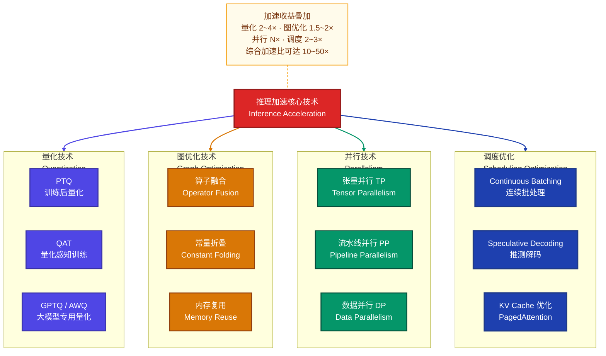

### 4.2 量化技术（Quantization）

量化是将模型参数和计算从高精度（如 FP32）转换为低精度（如 FP16、INT8、INT4）的技术，是推理加速中效果最显著的单项技术。

#### 4.2.1 量化基本原理

**线性量化映射公式：**

$$
x_q = \text{round}\left(\frac{x - z}{s}\right), \quad x \approx s \cdot x_q + z
$$

其中：
- $x$ 是原始浮点值
- $x_q$ 是量化后的整数值
- $s$（scale）是缩放因子：$s = \frac{x_{\max} - x_{\min}}{2^b - 1}$，$b$ 为量化位宽
- $z$（zero_point）是零点偏移

**对称量化（Symmetric）**：$z = 0$，适用于权重量化

$$
x_q = \text{round}\left(\frac{x}{s}\right), \quad s = \frac{\max(|x|)}{2^{b-1} - 1}
$$

**非对称量化（Asymmetric）**：$z \neq 0$，适用于激活值量化

#### 4.2.2 大模型量化方法

| 方法 | 类型 | 原理 | 精度损失 | 适用模型规模 |
|------|------|------|---------|------------|
| **GPTQ** | PTQ | 基于二阶海森矩阵近似的逐层量化，通过 OBQ（Optimal Brain Quantization）最小化量化误差 | 极低 | 7B~175B |
| **AWQ** | PTQ | 保护 1% 重要通道（Salient Channels）不量化，其余通道 INT4 量化 | 极低 | 7B~175B |
| **SmoothQuant** | PTQ | 将激活值的量化难度通过数学等价变换迁移到权重上：$Y = (X \cdot \text{diag}(s)^{-1}) \cdot (\text{diag}(s) \cdot W)$ | 低 | 7B~175B |
| **GGUF (llama.cpp)** | PTQ | 分块量化（Block-wise Quantization），每 32/64 个权重共享一组量化参数 | 低~中 | 任意规模 |
| **QLoRA** | QAT | 4-bit 量化基座 + LoRA 微调适配器，NF4（NormalFloat 4-bit）数据类型 | 极低 | 7B~65B |

#### 4.2.3 GPTQ 量化算法流程

GPTQ 将量化问题形式化为最小化重构误差：

$$
\arg\min_{\hat{W}} \| WX - \hat{W}X \|_2^2
$$

其中 $W$ 是原始权重矩阵，$\hat{W}$ 是量化后的权重矩阵，$X$ 是校准数据输入。

通过海森矩阵 $H = 2X X^T$ 的逆，逐列量化并补偿残余误差：

$$
\delta_j = \frac{w_j - \text{quant}(w_j)}{[H^{-1}]_{jj}}, \quad W_{:, j:} \leftarrow W_{:, j:} - \delta_j \cdot [H^{-1}]_{j, j:}
$$

### 4.3 算子融合（Operator Fusion）

算子融合是将计算图中多个连续的小算子合并为一个大算子（Fused Kernel），减少中间结果的显存读写和 Kernel Launch 开销。

**常见融合模式：**

| 融合模式 | 融合前 | 融合后 | 加速来源 |
|---------|--------|--------|---------|
| Conv-BN-ReLU | 3 个 Kernel | 1 个 Kernel | 减少 2 次显存读写 |
| QKV Projection | 3 次 MatMul | 1 次 Fused MatMul | 减少数据搬运 |
| MHA Fusion | Softmax + Dropout + MatMul | FlashAttention | 减少 $O(N^2)$ 显存占用 |
| GeGLU Fusion | GELU + Gate + Mul | 1 个 Kernel | 减少中间张量 |
| LayerNorm Fusion | Mean + Var + Norm + Scale + Bias | 1 个 Kernel | 减少 4 次读写 |

### 4.4 FlashAttention

FlashAttention 是 Attention 计算的革命性优化，核心思想是利用 **分块计算（Tiling）+ IO 感知（IO-Aware）** 算法，避免在 HBM 中存储 $N \times N$ 的注意力矩阵。

**传统 Attention 的显存复杂度：**

$$
\text{Memory}(\text{Standard Attention}) = O(N^2)
$$

**FlashAttention 的显存复杂度：**

$$
\text{Memory}(\text{FlashAttention}) = O(N)
$$

其关键在于将 $Q, K, V$ 分块加载到 SRAM 中计算，利用 **在线 Softmax（Online Softmax）** 技术实现分块的精确 Softmax 计算：

$$
m_{\text{new}} = \max(m_{\text{old}}, \max(\tilde{S}_j)), \quad \ell_{\text{new}} = e^{m_{\text{old}} - m_{\text{new}}} \cdot \ell_{\text{old}} + e^{\tilde{m}_j - m_{\text{new}}} \cdot \tilde{\ell}_j
$$

$$
O_{\text{new}} = \frac{e^{m_{\text{old}} - m_{\text{new}}} \cdot \ell_{\text{old}} \cdot O_{\text{old}} + e^{\tilde{m}_j - m_{\text{new}}} \cdot \tilde{P}_j V_j}{\ell_{\text{new}}}
$$

### 4.5 Speculative Decoding（推测解码）

推测解码是一种利用小模型（Draft Model）加速大模型（Target Model）自回归生成的技术。

**核心原理：**

1. 小模型快速生成 $\gamma$ 个候选 token：$\tilde{x}_1, \tilde{x}_2, \ldots, \tilde{x}_\gamma$
2. 大模型一次性验证所有候选 token 的概率分布
3. 使用拒绝采样（Rejection Sampling）接受或拒绝候选 token

**接受概率：**

$$
P_{\text{accept}}(\tilde{x}_i) = \min\left(1, \frac{p(\tilde{x}_i)}{q(\tilde{x}_i)}\right)
$$

其中 $p$ 是大模型的概率分布，$q$ 是小模型的概率分布。

**加速比估计：**

$$
\text{Speedup} = \frac{\gamma + 1}{c \cdot \gamma + 1} \cdot \frac{1}{1 - \alpha^\gamma}
$$

其中 $c$ 是小模型与大模型单步推理耗时的比值，$\alpha$ 是平均接受率。

### 4.6 Continuous Batching（连续批处理）

传统静态批处理（Static Batching）要求同一 Batch 内所有请求同时开始、同时结束，导致短请求等待长请求完成。Continuous Batching 允许请求在任意时刻加入或离开 Batch。

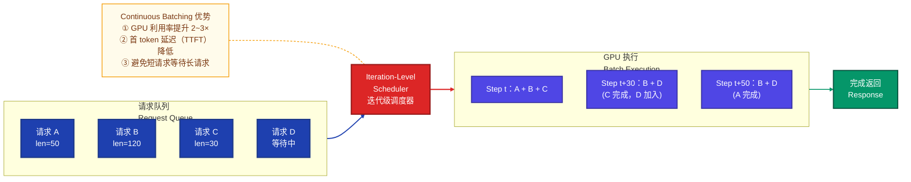

---

## 5. 模型推理加速实践

### 5.1 推理加速端到端流程

模型推理加速是一个系统工程，从模型优化到部署上线需要经历多个阶段，每个阶段都有对应的优化手段。

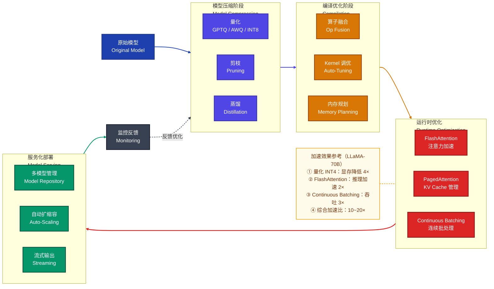

### 5.2 实践案例：LLaMA-70B 推理加速

以下是一个典型的大模型推理加速全流程实践：

**第一步：模型量化**

```python
from awq import AutoAWQForCausalLM
from transformers import AutoTokenizer

model_path = "meta-llama/Llama-2-70b-hf"
quant_path = "llama-70b-awq-int4"

model = AutoAWQForCausalLM.from_pretrained(model_path)
tokenizer = AutoTokenizer.from_pretrained(model_path)

quant_config = {
    "zero_point": True,
    "q_group_size": 128,  # 每 128 个权重共享量化参数
    "w_bit": 4,           # INT4 量化
    "version": "GEMM"     # 使用 GEMM kernel
}

model.quantize(tokenizer, quant_config=quant_config)
model.save_quantized(quant_path)
```

显存需求从 **~140GB（FP16）降低到 ~35GB（INT4）**，可在 2×A100-40GB 上部署。

**第二步：使用 vLLM 部署推理服务**

```python
from vllm import LLM, SamplingParams

llm = LLM(
    model="llama-70b-awq-int4",
    quantization="awq",
    tensor_parallel_size=2,          # 2 卡张量并行
    gpu_memory_utilization=0.90,     # 显存利用率 90%
    max_model_len=4096,
    enforce_eager=False,             # 启用 CUDA Graph
    enable_prefix_caching=True,      # 前缀缓存
)

sampling_params = SamplingParams(
    temperature=0.7,
    top_p=0.9,
    max_tokens=512,
)

prompts = ["请解释量子计算的基本原理", "What is transformer architecture?"]
outputs = llm.generate(prompts, sampling_params)
```

**第三步：启动 OpenAI 兼容 API 服务**

```bash
python -m vllm.entrypoints.openai.api_server \
    --model llama-70b-awq-int4 \
    --quantization awq \
    --tensor-parallel-size 2 \
    --max-model-len 4096 \
    --gpu-memory-utilization 0.9 \
    --port 8000 \
    --served-model-name llama-70b
```

### 5.3 推理性能基准指标

| 指标名称 | 英文 | 定义 | 目标方向 |
|---------|------|------|---------|
| 首 Token 延迟 | TTFT（Time To First Token） | 从请求发出到第一个 token 返回的时间 | 越低越好，通常 < 500ms |
| Token 间延迟 | ITL（Inter-Token Latency） | 生成相邻两个 token 之间的间隔时间 | 越低越好，通常 < 50ms |
| 端到端延迟 | E2E Latency | 从请求到完整响应的总时间 | 越低越好 |
| 吞吐量 | Throughput | 单位时间处理的 token 数（tokens/s） | 越高越好 |
| 并发请求数 | Concurrency | 系统同时处理的请求数量 | 越高越好 |
| 显存利用率 | GPU Memory Utilization | 实际使用的显存占总显存的比例 | 90%~95% 为佳 |

---

## 6. 算力调度平台设计

### 6.1 平台定位与核心目标

算力调度平台是连接上层 AI 应用与底层异构算力资源的中间层，核心目标是实现 **"让正确的任务在正确的硬件上高效执行"**。

**核心设计目标：**

- **资源池化**：将分散的 GPU/NPU/CPU 资源抽象为统一算力池
- **智能调度**：根据任务特征、硬件亲和性、负载状态自动匹配最优资源
- **弹性伸缩**：根据请求量动态扩缩容推理实例
- **异构适配**：屏蔽底层硬件差异，支持 NVIDIA GPU、华为昇腾、寒武纪等异构芯片
- **多租户隔离**：支持多团队/多业务的资源隔离与配额管理

### 6.2 整体架构设计

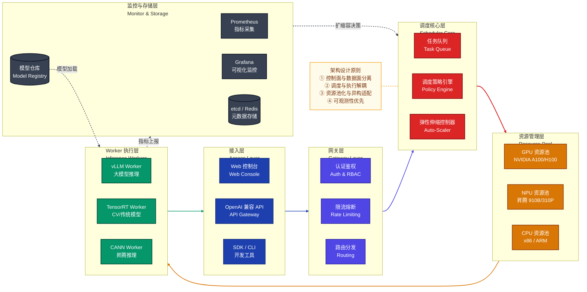

### 6.3 核心模块设计

#### 6.3.1 调度策略引擎

调度策略引擎是算力调度平台的核心大脑，负责将推理任务分配到最优的计算节点上执行。

**多维调度因子：**

$$
\text{Score}(task_i, node_j) = \sum_{k=1}^{K} w_k \cdot f_k(task_i, node_j)
$$

其中 $w_k$ 是各因子权重，$f_k$ 是第 $k$ 个评分函数，常见因子包括：

| 调度因子 | 评分函数 | 说明 |
|---------|---------|------|
| 硬件亲和性 | $f_{\text{affinity}}$ | 任务对硬件类型的偏好（如 LLM 优先 GPU） |
| 负载均衡 | $f_{\text{load}} = 1 - \text{utilization}$ | 当前节点的资源利用率 |
| 数据局部性 | $f_{\text{locality}}$ | 模型权重是否已在本节点显存中 |
| 优先级 | $f_{\text{priority}}$ | 任务优先级（实时 > 离线） |
| 成本效率 | $f_{\text{cost}}$ | 单位算力成本 |
| SLA 约束 | $f_{\text{sla}}$ | 是否能满足延迟 SLA |

**调度算法选择：**

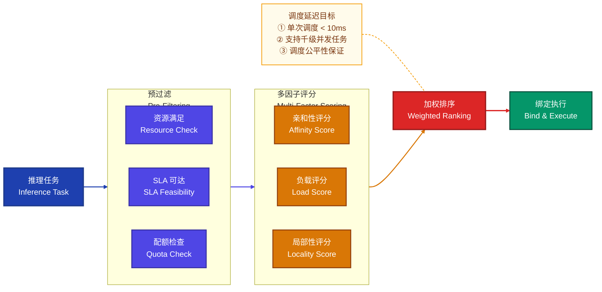

#### 6.3.2 弹性伸缩控制器

弹性伸缩控制器基于实时负载指标自动调整推理实例数量。

**扩缩容决策公式：**

$$
N_{\text{target}} = \left\lceil \frac{\text{QPM}_{\text{current}}}{\text{QPM}_{\text{per\_instance}} \times \eta_{\text{target}}} \right\rceil
$$

其中：
- $\text{QPM}_{\text{current}}$：当前每分钟请求数
- $\text{QPM}_{\text{per\_instance}}$：单实例每分钟可处理请求数
- $\eta_{\text{target}}$：目标利用率（通常 70%~80%）

**防抖动策略：**

- **扩容冷却期**：扩容后等待 60s 再评估，避免频繁扩容
- **缩容延迟**：低负载持续 5min 才触发缩容，避免抖动
- **预测性扩容**：基于历史流量模式提前扩容

```python
class AutoScaler:
    def __init__(self, min_replicas=1, max_replicas=32,
                 target_utilization=0.75, scale_up_cooldown=60,
                 scale_down_delay=300):
        self.min_replicas = min_replicas
        self.max_replicas = max_replicas
        self.target_util = target_utilization
        self.scale_up_cooldown = scale_up_cooldown
        self.scale_down_delay = scale_down_delay
        self.last_scale_up = 0
        self.low_util_since = None

    def compute_target_replicas(self, current_qpm, qpm_per_instance):
        raw_target = math.ceil(
            current_qpm / (qpm_per_instance * self.target_util)
        )
        return max(self.min_replicas, min(self.max_replicas, raw_target))

    def should_scale_up(self, current_replicas, target_replicas, now):
        if target_replicas <= current_replicas:
            return False
        if now - self.last_scale_up < self.scale_up_cooldown:
            return False
        return True

    def should_scale_down(self, current_replicas, target_replicas, now):
        if target_replicas >= current_replicas:
            self.low_util_since = None
            return False
        if self.low_util_since is None:
            self.low_util_since = now
        return (now - self.low_util_since) >= self.scale_down_delay
```

#### 6.3.3 模型仓库管理

模型仓库（Model Registry）是算力调度平台管理模型生命周期的核心组件。

**模型元数据结构：**

```yaml
model_registry:
  - model_id: "llama-70b-awq-int4"
    model_name: "LLaMA-2-70B"
    version: "v2.1"
    format: "awq"
    precision: "int4"
    framework: "vllm"
    hardware_requirements:
      min_gpu_memory: 35GB
      recommended_gpu: ["A100-80G", "H100"]
      tensor_parallel_size: 2
      supported_chips: ["nvidia_gpu", "ascend_910b"]
    performance_profile:
      throughput: 1200      # tokens/s per instance
      latency_p50: 45ms     # TTFT
      latency_p99: 120ms
      max_concurrent: 64
    serving_config:
      max_model_len: 4096
      gpu_memory_utilization: 0.9
      enable_prefix_caching: true
```

#### 6.3.4 多租户资源隔离

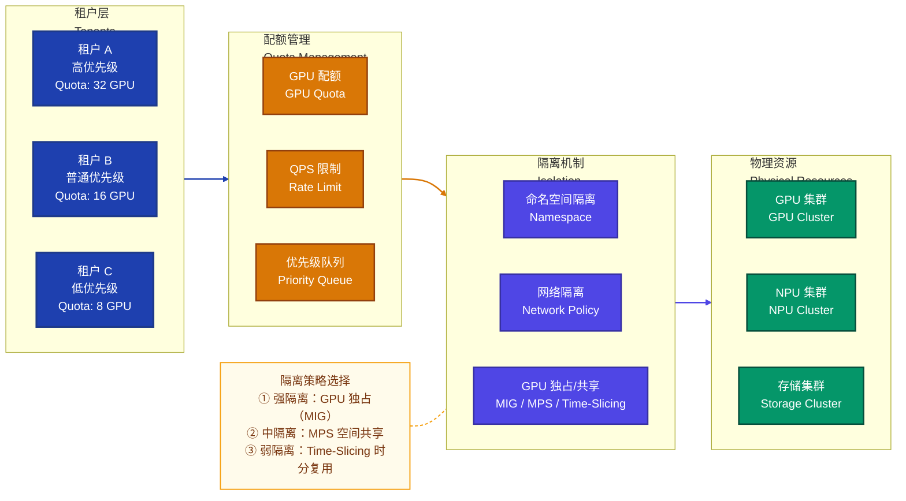

### 6.4 基于 Kubernetes 的算力调度实现

在工程实践中，算力调度平台通常基于 Kubernetes 构建，利用 K8s 原生的编排能力并进行扩展。

**技术栈组合：**

| 组件 | 技术选型 | 职责 |
|------|---------|------|
| 容器编排 | Kubernetes | 容器生命周期管理 |
| GPU 调度 | NVIDIA GPU Operator / Device Plugin | GPU 设备发现与分配 |
| NPU 调度 | Ascend Device Plugin（华为） | NPU 设备发现与分配 |
| 服务网格 | Istio / Envoy | 流量治理、灰度发布 |
| 弹性伸缩 | KEDA（Kubernetes Event-Driven Autoscaler） | 基于自定义指标的 HPA |
| 模型服务 | KServe / Seldon Core | 模型部署与推理路由 |
| 监控 | Prometheus + Grafana + DCGM Exporter | GPU 级指标监控 |
| 日志 | EFK（Elasticsearch + Fluentd + Kibana） | 日志采集与分析 |
| 配置中心 | etcd / Consul | 服务发现与配置管理 |

**自定义调度器示例（K8s Scheduler Extender）：**

```python
from flask import Flask, request, jsonify

app = Flask(__name__)

@app.route('/filter', methods=['POST'])
def filter_nodes():
    """预过滤：筛选满足 GPU/NPU 要求的节点"""
    data = request.json
    pod = data['pod']
    nodes = data['nodes']['items']

    required_gpu_type = pod['metadata']['annotations'].get(
        'scheduling.ai-platform/gpu-type', 'any'
    )
    required_gpu_mem = int(pod['metadata']['annotations'].get(
        'scheduling.ai-platform/gpu-memory-gb', '0'
    ))

    feasible_nodes = []
    for node in nodes:
        gpu_type = node['metadata']['labels'].get('gpu-type', '')
        gpu_mem = int(node['metadata']['labels'].get('gpu-memory-gb', '0'))

        if required_gpu_type != 'any' and gpu_type != required_gpu_type:
            continue
        if gpu_mem < required_gpu_mem:
            continue
        feasible_nodes.append(node)

    return jsonify({
        'nodes': {'items': feasible_nodes}
    })

@app.route('/prioritize', methods=['POST'])
def prioritize_nodes():
    """优先级评分：多因子加权"""
    data = request.json
    nodes = data['nodes']['items']

    scores = []
    for node in nodes:
        gpu_util = float(node['status'].get('gpu_utilization', 0.5))
        has_model_cache = node['metadata']['labels'].get('model-cached', 'false')

        score = (1 - gpu_util) * 60       # 负载均衡分（满分 60）
        score += (30 if has_model_cache == 'true' else 0)  # 数据局部性分
        score += 10                        # 基础分

        scores.append({
            'Host': node['metadata']['name'],
            'Score': int(score)
        })

    return jsonify(scores)
```

---

## 7. 全流程示例

### 7.1 场景描述

假设某企业需要构建一个支持多租户的 AI 推理服务平台，部署 LLaMA-70B 和 Qwen-14B 两个大模型，底层硬件包含 NVIDIA A100 集群和华为昇腾 910B 集群，服务日均请求量 100 万次。

### 7.2 端到端全流程

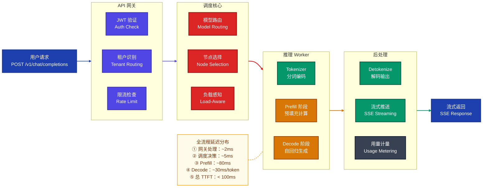

### 7.3 详细流程分步解析

#### Step 1：请求接入与鉴权

```python
# API 请求示例
import openai

client = openai.OpenAI(
    base_url="https://ai-platform.example.com/v1",
    api_key="sk-tenant-a-xxxx"
)

response = client.chat.completions.create(
    model="llama-70b",
    messages=[
        {"role": "system", "content": "你是一个专业的技术顾问"},
        {"role": "user", "content": "请解释 Transformer 中的注意力机制"}
    ],
    stream=True,
    max_tokens=1024,
    temperature=0.7
)

for chunk in response:
    if chunk.choices[0].delta.content:
        print(chunk.choices[0].delta.content, end="")
```

#### Step 2：调度决策过程

```python
class SchedulerCore:
    def schedule(self, request: InferenceRequest) -> WorkerNode:
        model_config = self.model_registry.get(request.model)

        candidates = self.resource_pool.filter(
            gpu_type=model_config.recommended_gpu,
            min_memory=model_config.min_gpu_memory,
            chip_type=model_config.supported_chips
        )

        candidates = [n for n in candidates
                       if n.available_slots > 0
                       and n.gpu_utilization < 0.95]

        scored = []
        for node in candidates:
            score = (
                0.4 * (1 - node.gpu_utilization) +    # 负载均衡
                0.3 * node.has_model_cached(request.model) +  # 数据局部性
                0.2 * node.network_locality_score +     # 网络亲和性
                0.1 * (1 - node.cost_factor)            # 成本因子
            )
            scored.append((node, score))

        scored.sort(key=lambda x: x[1], reverse=True)
        return scored[0][0]
```

#### Step 3：推理执行（Prefill + Decode）

推理执行分为两个核心阶段：

**Prefill 阶段（预填充）**：一次性处理所有输入 token，计算它们的 KV Cache，是计算密集型（Compute-Bound）操作。

$$
\text{FLOPs}_{\text{prefill}} = 2 \times L \times S \times H^2 \times 4
$$

其中 $L$ 是模型层数，$S$ 是输入序列长度，$H$ 是隐藏维度。

**Decode 阶段（自回归解码）**：逐 token 生成，每步只处理一个新 token，是访存密集型（Memory-Bound）操作。

$$
\text{FLOPs}_{\text{decode\_step}} = 2 \times L \times 1 \times H^2 \times 4
$$

两阶段的计算特性差异巨大，Prefill 的计算量是 Decode 单步的 $S$ 倍，但 Decode 阶段的瓶颈在于 KV Cache 的显存带宽。

#### Step 4：流式返回与计量

```python
async def stream_response(request_id: str, worker: WorkerNode):
    token_count = 0
    start_time = time.time()

    async for token in worker.generate_stream(request_id):
        token_count += 1
        yield {
            "id": request_id,
            "object": "chat.completion.chunk",
            "choices": [{
                "index": 0,
                "delta": {"content": token},
                "finish_reason": None
            }]
        }

    elapsed = time.time() - start_time
    await metering_service.record(
        tenant_id=request.tenant_id,
        model=request.model,
        input_tokens=request.input_token_count,
        output_tokens=token_count,
        latency_ms=elapsed * 1000,
        gpu_seconds=worker.gpu_time_used
    )
```

### 7.4 部署架构示例

```yaml
# Kubernetes Deployment 示例
apiVersion: apps/v1
kind: Deployment
metadata:
  name: llama-70b-vllm
  namespace: ai-inference
spec:
  replicas: 4
  selector:
    matchLabels:
      app: llama-70b-vllm
  template:
    metadata:
      labels:
        app: llama-70b-vllm
        model: llama-70b
        framework: vllm
    spec:
      nodeSelector:
        gpu-type: "a100-80g"
      containers:
      - name: vllm-server
        image: vllm/vllm-openai:latest
        args:
        - "--model=/models/llama-70b-awq-int4"
        - "--quantization=awq"
        - "--tensor-parallel-size=2"
        - "--max-model-len=4096"
        - "--gpu-memory-utilization=0.9"
        - "--port=8000"
        resources:
          limits:
            nvidia.com/gpu: 2
            memory: "64Gi"
          requests:
            nvidia.com/gpu: 2
            memory: "32Gi"
        ports:
        - containerPort: 8000
        readinessProbe:
          httpGet:
            path: /health
            port: 8000
          initialDelaySeconds: 120
          periodSeconds: 10
        volumeMounts:
        - name: model-storage
          mountPath: /models
      volumes:
      - name: model-storage
        persistentVolumeClaim:
          claimName: model-pvc
---
apiVersion: autoscaling/v2
kind: HorizontalPodAutoscaler
metadata:
  name: llama-70b-hpa
  namespace: ai-inference
spec:
  scaleTargetRef:
    apiVersion: apps/v1
    kind: Deployment
    name: llama-70b-vllm
  minReplicas: 2
  maxReplicas: 16
  metrics:
  - type: Pods
    pods:
      metric:
        name: gpu_utilization
      target:
        type: AverageValue
        averageValue: "75"
  - type: Pods
    pods:
      metric:
        name: request_queue_length
      target:
        type: AverageValue
        averageValue: "10"
  behavior:
    scaleUp:
      stabilizationWindowSeconds: 60
      policies:
      - type: Pods
        value: 2
        periodSeconds: 60
    scaleDown:
      stabilizationWindowSeconds: 300
      policies:
      - type: Pods
        value: 1
        periodSeconds: 120
```

---

## 8. 面试常见问题 FAQ

### Q1：什么是算力调度？为什么需要算力调度平台？

**答：** 算力调度是指将异构计算资源（GPU/NPU/CPU）与计算任务进行智能匹配和分配的过程。需要算力调度平台的核心原因：

1. **资源异构性**：企业环境中通常混合部署了 NVIDIA GPU、华为昇腾 NPU、CPU 等异构硬件，不同模型对硬件有不同的适配要求
2. **资源利用率低**：无调度平台时，GPU 利用率通常仅 20%~40%，大量算力被浪费
3. **弹性需求**：AI 推理服务的流量具有时间波动性（如白天高峰、夜间低谷），需要弹性伸缩
4. **多租户隔离**：多个业务团队共享算力池，需要配额管理和资源隔离
5. **运维效率**：统一管理模型部署、版本更新、故障恢复，降低运维复杂度

### Q2：PagedAttention 的核心原理是什么？相比传统 KV Cache 管理有何优势？

**答：** PagedAttention 借鉴操作系统虚拟内存的分页管理机制，将 KV Cache 分割为固定大小的 Block（类比内存页），通过 Block Table（类比页表）维护逻辑到物理的映射。

**核心优势：**

- **消除显存碎片**：物理 Block 无需连续分配，避免了预分配最大长度导致的内部碎片
- **提升利用率**：显存利用率从传统方式的 20%~40% 提升到 90%+
- **支持更大并发**：相同显存下可同时服务更多请求
- **零拷贝共享**：多个请求共享相同前缀时（如 System Prompt），可共享物理 Block，进一步节省显存

传统方式每个请求预留 `max_seq_len × num_layers × 2 × hidden_dim × dtype_size` 的连续显存，70B 模型单请求 4096 长度的 KV Cache 占用约 5GB。PagedAttention 按需分配，实际使用多少分配多少。

### Q3：张量并行（Tensor Parallelism）与流水线并行（Pipeline Parallelism）的区别是什么？推理时如何选择？

**答：**

| 维度 | 张量并行（TP） | 流水线并行（PP） |
|------|-------------|---------------|
| 切分方式 | 将单层的权重矩阵按列/行切分到多卡 | 将模型的不同层分配到不同卡 |
| 通信模式 | 每层前向需 AllReduce 通信 | 层间通过 P2P 传递激活值 |
| 通信频率 | 高（每层每次推理都通信） | 低（层间传递一次） |
| 通信量 | 较小（Hidden Dim 大小） | 较大（Batch×SeqLen×Hidden） |
| 延迟影响 | 增加每步推理延迟 | 引入 Pipeline Bubble |
| 适用场景 | 单机多卡、NVLink 高带宽互联 | 跨机多卡、模型超大无法单机放下 |

**推理时的选择策略：**
- 单机内优先使用 TP（NVLink 带宽 600GB/s 远高于网络带宽）
- 跨机使用 PP + TP 混合并行
- 对延迟敏感的在线推理优先 TP，对吞吐优先的离线推理可加 PP

### Q4：如何评估一个推理加速方案的效果？关键指标有哪些？

**答：** 推理加速效果评估需要从多维度综合衡量：

**性能指标：**
- **TTFT（Time To First Token）**：首 token 延迟，反映用户感知的响应速度
- **ITL（Inter-Token Latency）**：token 间延迟，影响流式输出的流畅度
- **Throughput（tokens/s）**：系统吞吐量，反映整体处理能力
- **Latency P50/P95/P99**：延迟分位数，P99 尤为重要

**资源指标：**
- **GPU 利用率**：目标 70%~90%
- **显存利用率**：目标 85%~95%
- **能效比（tokens/s/W）**：每瓦算力产出

**质量指标：**
- **精度损失**：量化前后在基准测试集上的精度差异（如 MMLU、HumanEval 分数变化）
- **一致性**：加速前后输出的语义一致性

### Q5：国产芯片（如昇腾 910B）与 NVIDIA A100 相比，在 LLM 推理方面有哪些差异和挑战？

**答：**

**硬件差异：**
- **算力**：910B 约 320 TFLOPS FP16 vs A100 约 312 TFLOPS FP16，纸面算力相当
- **显存带宽**：910B 约 1.6TB/s vs A100 约 2.0TB/s，昇腾略低
- **互联带宽**：HCCS（昇腾）vs NVLink（NVIDIA），NVLink 带宽更高
- **多卡扩展**：910B 集群通常通过 HCCS 互联，延迟略高于 NVLink

**软件生态挑战：**
- **算子覆盖率**：CANN 算子库虽已覆盖 1000+，但部分长尾算子仍需自定义开发
- **框架适配**：PyTorch 的昇腾适配（torch_npu）在部分高级特性上有延迟
- **优化工具**：TensorRT 生态成熟度远高于 CANN，调试工具链差距明显
- **社区支持**：NVIDIA 拥有庞大的开源社区和丰富的最佳实践，国产芯片社区仍在建设中

**应对策略：**
- 利用 ONNX 作为中间格式实现跨平台模型转换
- 在算力调度平台中抽象硬件差异，提供统一的推理 API
- 根据模型和负载特征选择最适合的硬件后端

### Q6：Continuous Batching 和 Static Batching 有什么区别？为什么大模型推理要用 Continuous Batching？

**答：**

**Static Batching（静态批处理）**：
- 收集固定数量的请求组成一个 Batch
- 所有请求必须等到 Batch 中最长的请求完成才能返回
- 短请求被迫等待长请求，造成 **"Batch 对齐浪费"**

**Continuous Batching（连续批处理）**：
- 在每个 Decode Step 级别动态管理 Batch
- 某请求完成后立即从 Batch 移除，新请求立即加入
- 真正做到 **Iteration-Level** 的动态调度

**为什么大模型必须使用 Continuous Batching：**

大模型自回归生成的特点是每个请求的输出长度不可预知（可能 10 个 token 也可能 2000 个 token）。Static Batching 下，一个 Batch 中有一个长请求就会拖慢所有请求。Continuous Batching 使吞吐量提升 2~4 倍，同时降低平均延迟。

### Q7：GPTQ 和 AWQ 两种量化方法各有什么优缺点？实际应用中如何选择？

**答：**

| 维度 | GPTQ | AWQ |
|------|------|-----|
| **原理** | 基于海森矩阵的逐层最优量化 + 误差补偿 | 保护 1% 重要通道 + 等效缩放 |
| **校准数据需求** | 需要 128~1024 条校准数据 | 需要少量校准数据（~128 条） |
| **量化速度** | 较慢（海森矩阵逆运算） | 较快 |
| **INT4 精度** | 优秀 | 优秀，部分场景略优 |
| **推理速度** | 快（GPTQ Kernel 优化） | 快（GEMM Kernel 优化） |
| **显存占用** | 相同 | 相同 |
| **与 vLLM 集成** | 支持 | 支持 |

**选择建议：**
- 追求最高精度且不在意量化耗时：GPTQ
- 需要快速量化且精度要求高：AWQ
- 需要与 vLLM 生产部署集成：两者均可，AWQ 社区活跃度略高
- 边缘设备部署：考虑 GGUF（llama.cpp 生态）

### Q8：如何设计算力调度平台的高可用架构？

**答：** 高可用（HA）设计需要从多个层面考虑：

**调度器高可用：**
- 调度器主备模式 + Leader Election（基于 etcd）
- 无状态调度器多副本 + 负载均衡
- 调度决策幂等性保证

**推理 Worker 高可用：**
- 健康检查（Liveness + Readiness Probe）
- 故障自动剔除与重调度
- 优雅关闭（Graceful Shutdown）：完成进行中的请求再退出
- 多副本冗余部署

**数据面高可用：**
- 模型权重多副本存储（分布式存储 + 本地缓存）
- KV Cache 的 Checkpoint 与恢复（长对话场景）
- 请求级别的自动重试与超时熔断

**整体策略：**
- 故障域隔离：按机架/机房分散部署
- 灰度发布：模型更新时灰度验证
- 降级策略：大模型不可用时降级到小模型

### Q9：FlashAttention 为什么能大幅减少显存占用？其与标准 Attention 的计算结果是否完全一致？

**答：**

**显存优化原理：**
标准 Attention 需要在 HBM 中显式存储 $S = QK^T$（大小为 $N \times N$ 的注意力矩阵），对于长序列（如 $N = 8192$），仅注意力矩阵就占用 $8192^2 \times 2 \text{Bytes} \approx 128\text{MB}$（FP16），多层多头叠加后显存消耗巨大。

FlashAttention 通过 **分块计算 + 在线 Softmax** 避免存储完整的 $N \times N$ 矩阵：
- 将 $Q, K, V$ 分成小块（Block），逐块加载到 SRAM 中计算
- 利用在线算法（Online Softmax）在不知道全局最大值的情况下正确计算 Softmax
- 只需要 $O(N)$ 的额外显存（用于存储每行的 max 和 sum）

**计算结果一致性：**
FlashAttention 的输出与标准 Attention **数学上完全等价**（精确到浮点数精度），不是近似算法。在线 Softmax 通过维护和更新 `(max, sum)` 统计量，保证了数值上的精确性。唯一的微小差异来自浮点运算的计算顺序不同导致的舍入误差（约 $10^{-6}$ 量级），这在实践中可忽略不计。

### Q10：在异构芯片环境下，如何实现模型的跨平台部署？

**答：** 跨平台部署的核心策略是 **"一次训练，多平台推理"**，实现路径：

**模型中间格式方案：**
1. **ONNX（Open Neural Network Exchange）**：最广泛支持的跨平台中间格式
   - PyTorch → ONNX → TensorRT（NVIDIA）/ CANN（昇腾）/ MagicMind（寒武纪）
   - 优点：生态成熟，大多数推理引擎原生支持
   - 缺点：部分自定义算子需额外注册

2. **自定义 IR（中间表示）**：部分平台定义自有 IR
   - MindSpore IR → 昇腾 CANN
   - Relay IR → TVM → 多后端

**算力调度平台的抽象层设计：**

```python
class InferenceBackend(ABC):
    @abstractmethod
    def load_model(self, model_path: str, config: dict) -> None: ...

    @abstractmethod
    def inference(self, inputs: dict) -> dict: ...

class NVIDIABackend(InferenceBackend):
    def load_model(self, model_path, config):
        self.engine = vllm.LLM(model=model_path, **config)

class AscendBackend(InferenceBackend):
    def load_model(self, model_path, config):
        self.engine = mindie.LLMEngine(model=model_path, **config)
```

通过 Backend 抽象层，调度平台可透明地将请求路由到不同硬件的推理引擎，上层 API 完全一致。

### Q11：如何对推理服务进行性能调优？有哪些常用的排查思路？

**答：** 推理性能调优遵循 **"定位瓶颈 → 针对优化"** 的方法论：

**第一步：确定瓶颈类型**

- **计算瓶颈（Compute-Bound）**：GPU 计算单元利用率高（>80%），增加算力或优化计算效率
- **访存瓶颈（Memory-Bound）**：显存带宽饱和，GPU 计算单元空闲等待数据，优化内存访问模式
- **通信瓶颈（Communication-Bound）**：多卡通信（AllReduce/P2P）占比高，优化并行策略或提升互联带宽

**第二步：常用排查工具**

| 工具 | 用途 | 示例 |
|------|------|------|
| NVIDIA Nsight Systems | 端到端性能分析 | 查看 Kernel 耗时分布 |
| NVIDIA Nsight Compute | Kernel 级性能分析 | 分析 SM 利用率、带宽 |
| torch.profiler | PyTorch 层面性能分析 | 定位热点函数 |
| nvidia-smi / dcgm-exporter | GPU 实时监控 | 利用率、显存、温度 |
| msprof（昇腾） | 昇腾芯片性能分析 | AI Core 利用率分析 |

**第三步：常见优化手段**

1. **Prefill 过慢**：启用 FlashAttention、增大 TP 度、使用 CUDA Graph
2. **Decode 吞吐低**：增大 Batch Size（通过 Continuous Batching）、启用 PagedAttention
3. **显存不足**：INT4 量化、减小 max_model_len、启用 KV Cache 量化
4. **多卡通信慢**：检查 NVLink 是否正常、调整 TP/PP 比例

### Q12：Speculative Decoding 在实际生产中的应用效果如何？有哪些注意事项？

**答：**

**实际效果：**
- 典型加速比 1.5~3 倍，取决于 Draft Model 的质量和任务类型
- 代码生成、格式化输出等 **可预测性高** 的任务加速比更高（接受率 $\alpha > 0.8$）
- 开放式创意写作等 **不确定性高** 的任务加速比较低（接受率 $\alpha < 0.6$）

**注意事项：**

1. **Draft Model 选择**：
   - 与 Target Model 同系列的小模型效果最佳（如 LLaMA-7B 辅助 LLaMA-70B）
   - Draft Model 不宜过大（否则 overhead 过高）也不宜过小（否则接受率低）
   - 经验法则：Draft Model 参数量为 Target 的 1/5~1/10

2. **推测长度 $\gamma$ 的选择**：
   - 过长：多数 token 被拒绝，浪费计算
   - 过短：加速效果有限
   - 自适应策略：根据历史接受率动态调整 $\gamma$

3. **输出一致性保证**：
   - 使用拒绝采样时，Speculative Decoding 的输出分布与标准解码 **数学上完全一致**
   - 但如果使用 Greedy Decoding（$\text{temperature} = 0$），需确保 Draft Model 和 Target Model 的 Logits 精度一致

4. **生产环境部署考虑**：
   - 需要额外的显存来加载 Draft Model
   - Batch 化 Speculative Decoding（SpecInfer）可进一步提升吞吐

### Q13：如何设计算力调度平台的监控告警体系？

**答：** 监控告警体系是保障推理服务 SLA 的关键基础设施，需要覆盖 **硬件层、系统层、应用层** 三个维度。

**监控指标体系：**

| 层级 | 指标 | 采集方式 | 告警阈值 |
|------|------|---------|---------|
| 硬件层 | GPU 温度 | DCGM Exporter | > 85°C |
| 硬件层 | GPU 功耗 | DCGM Exporter | > 95% TDP |
| 硬件层 | 显存 ECC 错误 | DCGM Exporter | > 0（单次） |
| 系统层 | GPU 利用率 | DCGM Exporter | < 20%（资源浪费）或 > 95%（过载） |
| 系统层 | 显存使用率 | DCGM Exporter | > 95% |
| 系统层 | 请求队列长度 | 应用埋点 | > 100（单实例） |
| 应用层 | TTFT P99 | 应用埋点 | > SLA 阈值（如 500ms） |
| 应用层 | 错误率 | 应用埋点 | > 1% |
| 应用层 | 吞吐量 | 应用埋点 | < 预期的 50% |

**告警策略：**
- **分级告警**：P0（生产中断）→ 电话 + 短信；P1（性能降级）→ 企微/钉钉；P2（预警）→ 邮件
- **告警收敛**：相同告警在 5 分钟内只发一次，避免告警风暴
- **自动修复**：GPU 单卡故障自动重调度、实例 OOM 自动重启

### Q14：大模型推理的 Prefill 和 Decode 分离架构（PD 分离）是什么？有什么优势？

**答：** PD 分离（Prefill-Decode Disaggregation）是将推理服务的 Prefill 阶段和 Decode 阶段部署到不同的 GPU 实例上执行的架构。

**核心动机：**

Prefill 和 Decode 两个阶段的计算特性截然不同：
- Prefill：**计算密集型**，GPU Compute 利用率高，单次处理所有输入 token
- Decode：**访存密集型**，受限于显存带宽（HBM Bandwidth），逐 token 生成

将两者混合在同一 GPU 上会导致 **相互干扰**：
- Decode 的小计算量无法充分利用 GPU 算力
- Prefill 的大计算量会阻塞 Decode 的实时性，导致 ITL 抖动

**PD 分离优势：**

1. **资源适配**：Prefill 节点可选高算力 GPU（如 H100），Decode 节点可选高带宽 GPU 或配置更多实例
2. **延迟稳定**：Decode 不被 Prefill 干扰，ITL 更加稳定
3. **独立扩缩容**：Prefill 和 Decode 节点可根据各自负载独立伸缩
4. **成本优化**：不同阶段可使用不同规格的 GPU，避免 Decode 阶段浪费高算力资源

**挑战：**
- Prefill 完成后需要通过高速网络将 KV Cache 传输到 Decode 节点
- 增加了网络通信开销和系统复杂度
- 需要高效的 KV Cache 传输协议（如 RDMA）

---

> **文档版本**：v1.0  
> **适用范围**：AI 推理服务平台架构设计与技术选型参考  
> **关键词**：算力调度、推理加速、国产芯片、异构计算、大模型推理
