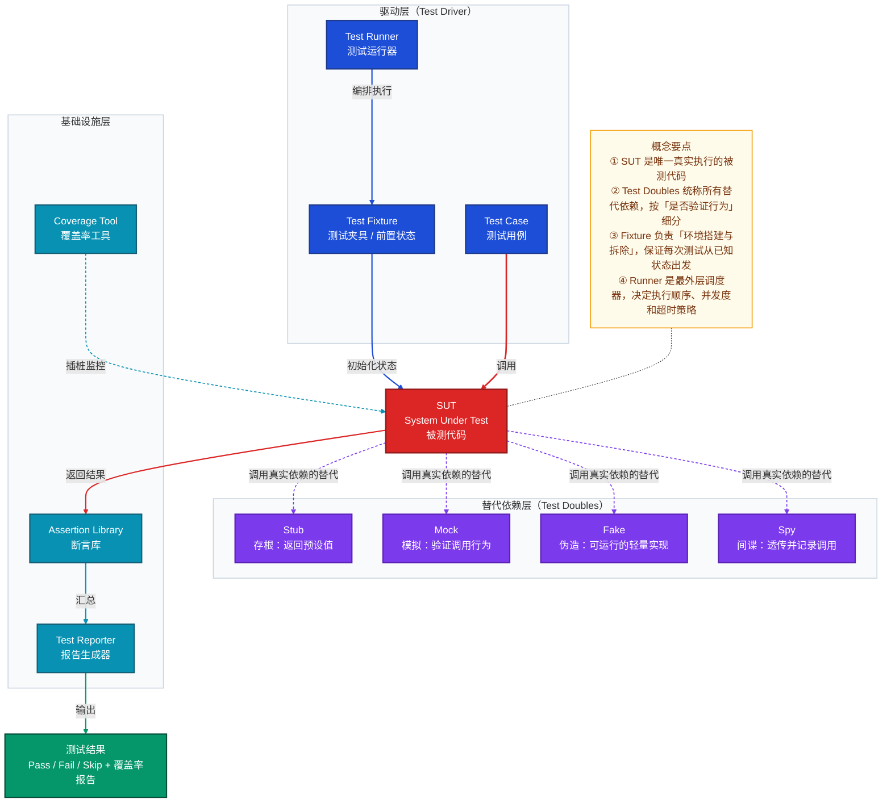
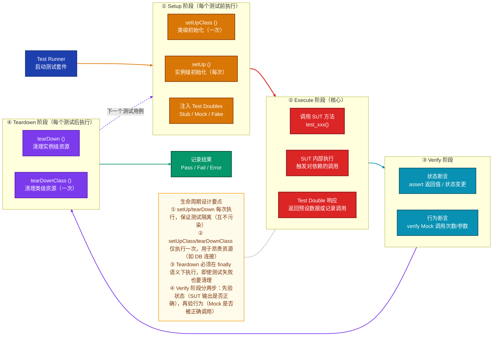
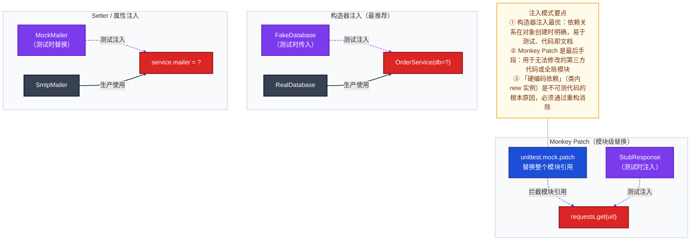
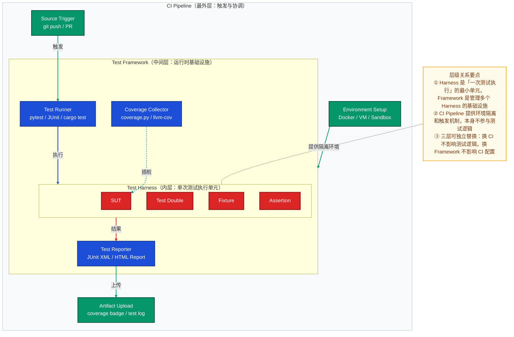

# Harness 架构 · 学习笔记

> 适合反复查阅的深度技术笔记，覆盖概念、原理、用法、误区与 FAQ

---

## 一、是什么

**一句话定义**：Test Harness（测试线束架构）是一套将「被测代码」与「测试驱动器 + 替代依赖」组合在一起、在受控环境中自动执行并验证结果的基础设施。

| 维度 | 说明 |
|------|------|
| **解决的问题** | 被测代码存在外部依赖（数据库、网络、第三方服务），无法在隔离环境中单独运行和验证 |
| **适用场景** | 单元测试、集成测试、端到端测试；CI/CD 流水线中的自动化回归；嵌入式/硬件系统的软件仿真测试 |
| **核心价值** | 把「人工手动验证」替换为「机器自动执行 + 结构化报告」，使测试可重复、可追溯、可规模化 |

---

## 二、核心概念

下图展示 Harness 架构的核心概念全景，重点关注「驱动器→被测单元→替代依赖」三角关系，以及各概念与测试生命周期的对应位置。



**四类 Test Double 辨析**：

| 类型 | 核心特征 | 是否验证交互 | 典型用途 |
|------|----------|------------|---------|
| **Stub** | 返回预设的固定数据 | 否 | 屏蔽外部 IO，提供测试所需的输入数据 |
| **Mock** | 预期调用行为，测后验证 | **是** | 验证 SUT 是否按预期调用了依赖（次数、参数） |
| **Fake** | 可运行的轻量实现（如内存数据库） | 否 | 集成测试中替代重型依赖，保留业务逻辑 |
| **Spy** | 透传真实调用并记录 | 部分 | 观察 SUT 行为而不改变其结果 |

---

## 三、工作原理（重点）

### 3.1 执行生命周期全流程

下图展示一次完整测试用例的端到端执行流程，重点关注「Fixture 生命周期钩子」与「SUT 调用→断言→清理」的边界划分。



**各阶段「为什么这样设计」**：

1. **为什么要有 setUp/tearDown**：测试间的状态污染是最难排查的 Bug 根源。每次从已知的干净状态出发，失败时才能精确定位到单个用例，而不是被历史状态干扰。

2. **为什么 setUpClass 只执行一次**：启动真实数据库连接、加载大型模型权重等操作耗时可达秒级。把昂贵操作提升到类级别，可以在保证同类用例共享资源的同时，避免重复初始化开销。

3. **为什么 Teardown 要在 finally 语义下执行**：测试失败时抛出异常，若不保证清理，临时文件、数据库记录、端口占用会在 CI 机器上积累，导致后续测试用例在「脏环境」中运行，制造假阳性/假阴性。

4. **为什么 Verify 分「状态验证」和「行为验证」**：状态验证检查 SUT 的输出（对外可见效果）；行为验证检查 SUT 是否按协议调用了依赖（副作用）。二者互补，只有状态验证会放过「调用了错误的依赖」，只有行为验证会放过「返回了正确结果但路径错误」。

### 3.2 依赖注入与 Test Double 替换机制

Test Double 能生效的前提是：SUT 的依赖必须是「可替换的」。下图展示三种依赖注入模式及其与 Harness 的配合方式。



---

## 四、使用方法

### 4.1 Python unittest + Mock（标准库）

```python
import unittest
from unittest.mock import MagicMock, patch

# 被测代码
class OrderService:
    def __init__(self, db, mailer):
        self.db = db
        self.mailer = mailer

    def place_order(self, user_id: int, item_id: int) -> dict:
        item = self.db.get_item(item_id)
        if item["stock"] <= 0:
            raise ValueError("Out of stock")
        order = self.db.create_order(user_id, item_id)
        self.mailer.send(user_id, f"Order {order['id']} confirmed")
        return order


class TestOrderService(unittest.TestCase):
    def setUp(self):
        # 注入 Test Doubles
        self.mock_db = MagicMock()
        self.mock_mailer = MagicMock()
        self.service = OrderService(db=self.mock_db, mailer=self.mock_mailer)

    def test_place_order_success(self):
        # Arrange: 设置 Stub 返回值
        self.mock_db.get_item.return_value = {"id": 1, "stock": 10, "price": 99}
        self.mock_db.create_order.return_value = {"id": 42, "user_id": 7, "item_id": 1}

        # Act: 调用 SUT
        result = self.service.place_order(user_id=7, item_id=1)

        # Assert 状态验证
        self.assertEqual(result["id"], 42)

        # Assert 行为验证：确认 mailer 被正确调用
        self.mock_mailer.send.assert_called_once_with(7, "Order 42 confirmed")

    def test_place_order_out_of_stock(self):
        self.mock_db.get_item.return_value = {"id": 1, "stock": 0}

        with self.assertRaises(ValueError, msg="Out of stock"):
            self.service.place_order(user_id=7, item_id=1)

        # 库存不足时不应发送邮件
        self.mock_mailer.send.assert_not_called()
```

### 4.2 pytest + pytest-mock（推荐生产实践）

```python
import pytest

# conftest.py（共享 Fixture）
@pytest.fixture
def mock_db(mocker):
    db = mocker.MagicMock()
    db.get_item.return_value = {"id": 1, "stock": 10, "price": 99}
    db.create_order.return_value = {"id": 42}
    return db

@pytest.fixture
def order_service(mock_db, mocker):
    mailer = mocker.MagicMock()
    return OrderService(db=mock_db, mailer=mailer), mailer

# test_order.py
def test_place_order_success(order_service):
    service, mock_mailer = order_service
    result = service.place_order(user_id=7, item_id=1)

    assert result["id"] == 42
    mock_mailer.send.assert_called_once()

@pytest.mark.parametrize("stock,should_raise", [(0, True), (1, False), (100, False)])
def test_stock_boundary(order_service, stock):
    service, _ = order_service
    service.db.get_item.return_value = {"id": 1, "stock": stock}
    if should_raise:
        with pytest.raises(ValueError):
            service.place_order(7, 1)
    else:
        service.place_order(7, 1)
```

### 4.3 Rust 内置测试线束

Rust 的测试线束（test harness）是语言原生支持的，编译器直接介入生成测试可执行文件：

```rust
// src/lib.rs
pub fn divide(a: f64, b: f64) -> Result<f64, String> {
    if b == 0.0 {
        Err("Division by zero".to_string())
    } else {
        Ok(a / b)
    }
}

#[cfg(test)]                          // 仅在测试编译时包含
mod tests {
    use super::*;

    #[test]
    fn test_divide_normal() {
        assert_eq!(divide(10.0, 2.0), Ok(5.0));
    }

    #[test]
    fn test_divide_by_zero() {
        assert!(divide(10.0, 0.0).is_err());
    }

    #[test]
    #[should_panic(expected = "overflow")]   // 期望 panic
    fn test_should_panic() {
        panic!("overflow");
    }
}
```

```toml
# Cargo.toml：关闭默认线束，使用自定义线束（如 libtest-mimic）
[[test]]
name = "integration"
harness = false        # 禁用标准 harness，自己管理 main 函数
```

### 4.4 集成测试中的 Fake（内存数据库示例）

```python
# 生产实现
class PostgresUserRepository:
    def find_by_id(self, user_id: int) -> dict | None:
        return self.db.execute("SELECT * FROM users WHERE id = %s", [user_id])

# 测试用 Fake（保留业务逻辑，使用内存存储）
class InMemoryUserRepository:
    def __init__(self):
        self._store: dict[int, dict] = {}

    def find_by_id(self, user_id: int) -> dict | None:
        return self._store.get(user_id)

    def save(self, user: dict) -> None:
        self._store[user["id"]] = user

# 集成测试中直接使用 Fake，避免真实 DB 依赖
def test_user_registration():
    repo = InMemoryUserRepository()
    service = UserService(repo=repo)

    service.register({"id": 1, "email": "a@b.com"})
    user = repo.find_by_id(1)
    assert user["email"] == "a@b.com"
```

---

## 五、常见误区与对比

### 5.1 与相关概念的边界对比

下图并排对比「Test Harness、Test Framework、CI Pipeline」三个层次，重点关注各自职责边界和组合关系——它们是包含关系，而非替代关系。



### 5.2 常见误区

| 误区 | 正确认知 |
|------|---------|
| **「Mock 越多测试越好」** | Mock 越多，测试离真实行为越远。过度 Mock 会让测试通过但生产崩溃。应优先使用 Fake（保留业务逻辑）而非 Mock |
| **「Mock 和 Stub 是同一回事」** | Stub 只提供数据，不验证行为；Mock 预设期望并在测试后验证调用（次数、参数）。混用会导致测试意图不清晰 |
| **「测试线束只用于单元测试」** | Harness 同样适用于集成测试（用 Fake 替代重型依赖）和 E2E 测试（用 TestContainer 起真实服务） |
| **「setUp 很耗时可以省略」** | 省略 setUp 意味着测试间共享状态，一旦某个测试修改了共享对象，后续测试的失败原因将极难追查 |
| **「断言越多覆盖越全面」** | 每个测试用例应只验证一个行为（Single Assert Principle）。多个断言的测试失败时，你不知道是哪个断言先失败、原因是什么 |
| **「Harness.io 平台 = Test Harness 概念」** | Harness.io 是一个 CI/CD 商业平台，借用了 harness（驾驭/控制）的比喻义，与软件测试中的 Test Harness 架构是不同层次的概念 |

---

## 六、FAQ

### 基本原理类

**Q1：Test Double 这个术语从哪里来？为什么不直接叫「Mock」？**

「Test Double」由 Gerard Meszaros 在《xUnit Test Patterns》中系统化，借用电影中「替身演员」（Stunt Double）的概念——替代真实对象参与测试，但行为受控。直接叫「Mock」是口语化误用：Mock 只是 Test Double 的一种，专指「预设期望并验证行为」的替代对象。Stub、Fake、Spy 各有精确语义，混称 Mock 会让代码意图模糊，也会导致团队沟通中的理解偏差。

---

**Q2：为什么有了 Mock 还需要 Fake？**

Mock 替换的是「接口契约」，内部没有真实逻辑。当业务逻辑本身依赖多个方法的组合行为时（如：先 `save()`，再 `find_by_id()` 应返回刚保存的数据），Mock 需要为每个调用预设返回值，维护成本极高且脆弱。Fake 提供一个「可运行的轻量实现」（如 InMemoryRepository），保留了业务语义，测试代码更接近真实场景，对重构的抵抗力也更强。经验法则：集成测试优先用 Fake，纯单元测试（只验证一次调用）才用 Mock。

---

**Q3：测试覆盖率 100% 意味着代码没有 Bug 吗？**

不。覆盖率只衡量「哪些代码行被执行了」，不衡量「被正确地测试了」。常见的覆盖率陷阱：① 执行了代码但没有断言；② 只覆盖了正常路径，边界条件（空输入、溢出、并发）没覆盖；③ 行覆盖率 100% 但分支组合（MC/DC）没有全部覆盖。覆盖率是必要条件而非充分条件，应与变异测试（Mutation Testing）结合使用。

---

**Q4：Harness 如何处理异步代码（如 async/await、Celery 任务）？**

异步代码需要事件循环支持：
- **Python asyncio**：pytest-asyncio 提供 `@pytest.mark.asyncio` 标记，在测试内运行事件循环；Mock 异步依赖需使用 `AsyncMock`（Python 3.8+）。
- **Celery 任务**：单元测试时用 `task.apply()` 同步执行（绕过 broker）；集成测试时用 `CELERY_TASK_ALWAYS_EAGER = True` 配置，或用 `TestContainer` 启动真实 Redis broker。
- **Rust tokio**：使用 `#[tokio::test]` 属性宏，测试函数可以是 `async fn`，tokio 运行时自动启动。

---

### 设计决策类

**Q5：为什么建议「每个测试只有一个断言」？实际项目中经常需要验证多个字段。**

「单一断言原则」的真实含义不是字面上只能一行 `assert`，而是「每个测试只验证一个行为/场景」。对于同一对象的多个字段断言（如验证 Order 的 id、user_id、status 同时正确），可以在一个测试中断言——因为它们都是同一行为的输出。真正需要拆分的是「正常路径」vs「异常路径」vs「边界条件」，这些是不同行为，应独立为测试用例。拆分的好处：失败时立即知道是哪种场景失败，而不是从一大堆断言中猜测。

---

**Q6：Fixture 的 scope（范围）应该怎么选择？**

以 pytest 为例：

| Scope | 每次创建时机 | 适合的资源 |
|-------|------------|---------|
| `function`（默认） | 每个测试函数 | 内存对象、轻量 Mock |
| `class` | 每个测试类 | 类内共享的轻量服务 |
| `module` | 每个模块文件 | 单文件内共享的重型资源 |
| `session` | 整个测试会话 | DB 连接池、启动容器、加载模型权重 |

原则：**用最宽的 scope 包住最昂贵的资源**，但确保该 scope 内的测试不会修改共享状态（如果会修改，就必须用更小的 scope + 每次重置）。

---

### 实际应用类

**Q7：如何测试「有随机性」的代码（如 UUID 生成、时间戳、随机算法）？**

关键是让随机性「可控」，有三种策略：

1. **注入时钟/随机源**：把 `datetime.now()` 或 `random.random()` 作为依赖注入，测试时传入固定值的 Stub。
2. **固定种子**：对于可重现随机性（蒙特卡洛模拟等），测试时固定 `random.seed(42)`，验证在固定种子下的输出。
3. **验证属性而非值**：不验证 UUID 的具体值，验证它「符合 UUID 格式」、「每次调用不同」、「长度为 36」等属性。

```python
# 方案一：注入时钟
class OrderService:
    def __init__(self, db, clock=None):
        self.clock = clock or datetime.utcnow  # 生产默认使用真实时钟

def test_order_timestamp():
    fixed_time = datetime(2024, 1, 1, 12, 0)
    service = OrderService(db=mock_db, clock=lambda: fixed_time)
    order = service.place_order(7, 1)
    assert order["created_at"] == fixed_time
```

---

**Q8：什么时候应该写集成测试而不是单元测试？**

单元测试擅长验证「业务逻辑」（条件分支、计算、状态机），集成测试擅长验证「协作关系」（ORM 查询是否正确生成 SQL、API 路由是否正确解析参数）。以下情况优先写集成测试：

- 验证 ORM 模型与数据库 Schema 的一致性（字段类型、约束）
- 验证 HTTP 请求序列化/反序列化（JSON 格式、状态码）
- 验证消息队列的生产-消费完整链路
- 验证第三方 SDK 的真实行为（而非 Mock 版本）

实践中常用「测试金字塔」：大量单元测试（快、稳）+ 少量集成测试（慢、真实）+ 极少 E2E 测试（最慢、最真实）。

---

### 边界情况类

**Q9：如何测试「私有方法」？**

测试私有方法是一个设计信号，而不是技术问题。私有方法应通过公共接口间接测试——如果一个私有方法逻辑复杂到需要独立测试，通常意味着它应该被提取为一个新的类或模块（单一职责原则）。强行测试私有方法的方式（如 Python 的 `_name mangling` 绕过、Java 的反射）会让测试与实现细节强耦合，重构时测试先挂。

---

**Q10：Harness 在微服务架构下如何处理跨服务依赖？**

三种策略，按隔离程度递增：

1. **Contract Testing（契约测试）**：用 Pact 等工具定义服务间 API 契约，消费者和提供者各自独立验证契约，无需启动对方服务。适合微服务团队独立部署的场景。
2. **TestContainer**：在测试中用 Docker 启动真实的依赖服务（Redis、Postgres、Kafka），测试完成后自动销毁。提供真实行为，但增加启动时间（通常 5-30 秒）。
3. **WireMock / HTTP Stub Server**：启动一个本地 HTTP 服务器，返回预设的响应体，模拟下游 API。比完整 Mock 更真实（走真实 HTTP 协议），比 TestContainer 更快。

---

**Q11：测试套件运行太慢（>10 分钟），如何优化 Harness 性能？**

| 优化手段 | 效果 | 适用条件 |
|---------|------|---------|
| **并行执行**（pytest-xdist `-n auto`） | 线性加速（核数倍数） | 测试间无共享可变状态 |
| **提升 Fixture scope**（function → session） | 减少昂贵初始化次数 | 共享资源在 session 内不会被修改 |
| **测试分层 + 按需运行** | 快速反馈 | 单元/集成/E2E 分开 tag，PR 只跑单元测试 |
| **替换 TestContainer 为 Fake** | 单次省 5-30 秒 | 业务逻辑不依赖数据库特有行为 |
| **测试数据最小化** | 减少 setUp 准备时间 | 只创建当前测试必需的最少数据 |

---

**Q12：Rust 的 `harness = false` 什么时候应该使用？**

当你需要完全控制测试的入口点（`main` 函数）时：① 编写需要自定义输出格式的测试（如将结果写入 JSON 文件给 CI 消费）；② 集成 `libtest-mimic` 或 `criterion`（性能基准测试框架）作为替代线束；③ 测试需要复杂的全局初始化（如初始化日志、加载配置文件）且默认 harness 的 `main` 不够灵活。默认保持 `harness = true`，它提供了并行执行、过滤（`cargo test my_func`）、输出捕获等开箱即用能力。
