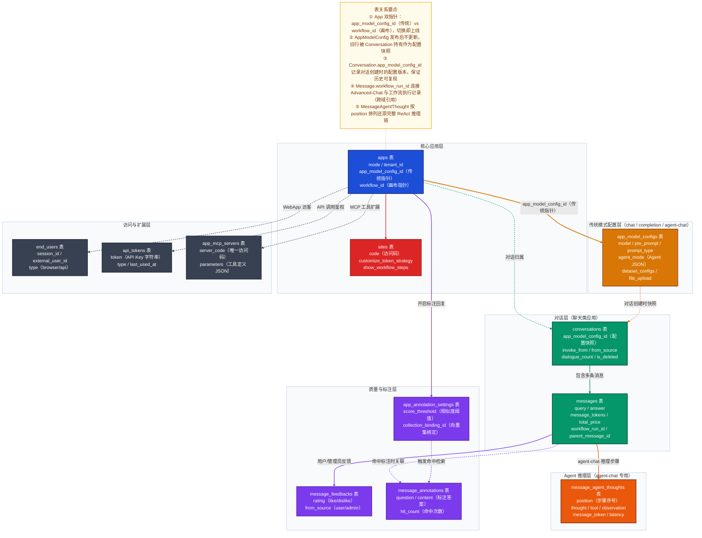
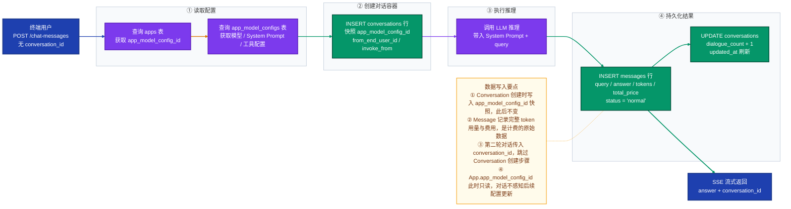
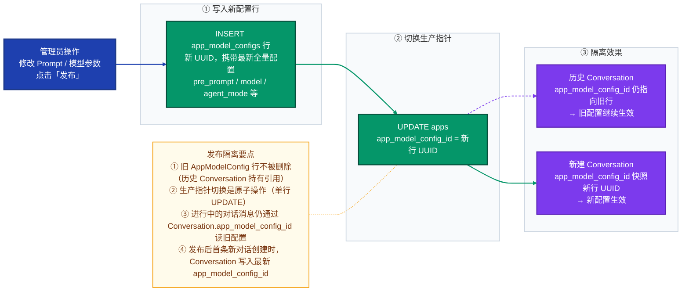

# Dify 数据域深度分析 —— 应用域（App & Config）

> 源文件：`api/models/model.py`（2200+ 行）
> 覆盖表数：核心表 6 张 + 辅助表 10 张

---

## 一、域总览

### 表清单

| 表名 | Python 类名 | 一句话职责 |
|---|---|---|
| `apps` | `App` | 应用实体根节点，持有模式标识与两条生产指针 |
| `app_model_configs` | `AppModelConfig` | 传统模式（chat/completion/agent-chat）的完整配置行，发布即覆盖 |
| `sites` | `Site` | WebApp 公开访问站点配置（访问码、域名、Token 策略） |
| `conversations` | `Conversation` | 聊天类应用的会话容器，创建时快照当时的配置版本 |
| `messages` | `Message` | 单轮对话的完整记录（query/answer/token 用量/费用） |
| `message_agent_thoughts` | `MessageAgentThought` | Agent-Chat 专用：记录每步 ReAct/FunctionCall 推理过程 |
| `message_feedbacks` | `MessageFeedback` | 消息点赞/踩反馈，区分用户端（user）和管理端（admin） |
| `message_annotations` | `MessageAnnotation` | 标注问答对（由管理员维护的 ground-truth 回答） |
| `app_annotation_settings` | `AppAnnotationSetting` | 标注回复功能的开关与向量检索阈值配置 |
| `app_annotation_hit_histories` | `AppAnnotationHitHistory` | 标注命中历史（哪条消息命中了哪条标注） |
| `end_users` | `EndUser` | WebApp 匿名/识别访客，通过 session_id 追踪 |
| `api_tokens` | `ApiToken` | 应用级 API Key（type = 'app' 或 'dataset'） |
| `tags` | `Tag` | 应用/知识库标签，type 字段区分归属 |
| `tag_bindings` | `TagBinding` | 标签与目标（应用或知识库）的多对多绑定关系 |
| `installed_apps` | `InstalledApp` | 探索页应用安装到租户工作区的记录 |
| `app_mcp_servers` | `AppMCPServer` | 应用绑定的 MCP 服务端配置（1.13 新增） |

> **注**：画布模式的执行层表（`workflows`、`workflow_runs`、`workflow_node_executions`）定义在 `api/models/workflow.py`，属于工作流域，本文侧重应用域核心结构。

### 核心结论

**决策一：双轨发布机制**

Dify 将六种应用模式分为两条发布轨道：
- **传统轨（chat / completion / agent-chat）**：发布单位是 `AppModelConfig` 行，每次发布覆盖同一行，`App.app_model_config_id` 始终指向最新配置，无历史版本。
- **画布轨（advanced-chat / workflow / rag-pipeline）**：发布单位是 `Workflow` 行，每次发布新建一行（版本快照），`App.workflow_id` 指针切换即完成上线，旧版本行永久保留可回溯。

**决策二：对话快照绑定**

`Conversation.app_model_config_id` 在会话创建时写入当时的配置 ID，此后即便应用多次发布，该会话中的历史消息始终可以追溯到创建时的配置状态，保证了对话上下文的一致性。

---

## 二、核心数据模型详解

### 2.1 `apps` 表（App）

> **文件**：`api/models/model.py` → `class App`

| 字段 | 类型 | 设计意图 |
|---|---|---|
| `id` | UUID | 应用主键，全局唯一 |
| `tenant_id` | UUID | 所属工作区（多租户隔离边界） |
| `mode` | varchar(255) | 应用模式枚举：`chat`/`completion`/`agent-chat`/`advanced-chat`/`workflow`/`rag-pipeline` |
| `app_model_config_id` | UUID（可空） | **传统模式生产指针**，指向当前生效的 AppModelConfig 行 |
| `workflow_id` | UUID（可空） | **画布模式生产指针**，指向当前生效的 Workflow 发布行 |
| `enable_site` | bool | 是否开启 WebApp 公开访问 |
| `enable_api` | bool | 是否开启 API 调用 |
| `max_active_requests` | int（可空） | 最大并发请求数，NULL 表示不限 |
| `tracing` | text（可空） | 链路追踪配置 JSON（接入 LangFuse 等） |
| `status` | varchar(255) | 应用状态，默认 `normal` |

**关键设计**：`app_model_config_id` 和 `workflow_id` 是互斥的双指针，对应两条发布轨道。切换任意一个指针，即完成零停机线上版本更新——这是整个应用管理域最核心的设计。

---

### 2.2 `app_model_configs` 表（AppModelConfig）

> **文件**：`api/models/model.py` → `class AppModelConfig`
>
> **适用模式**：`chat`、`completion`、`agent-chat`

| 字段 | 类型 | 设计意图 |
|---|---|---|
| `app_id` | UUID | 所属应用（逻辑外键） |
| `model` | text | 模型配置 JSON（`provider`/`name`/`mode`/`completion_params`） |
| `pre_prompt` | text | System Prompt 预置提示词 |
| `prompt_type` | varchar(255) | 提示词类型：`simple`（直接写）/ `advanced`（Jinja2 模板） |
| `agent_mode` | text | Agent 配置 JSON（`enabled`/`strategy`/`tools`/`prompt`） |
| `dataset_configs` | text | 知识库检索配置 JSON（`retrieval_model`/`datasets`） |
| `file_upload` | text | 文件上传策略配置 JSON |
| `user_input_form` | text | 用户输入表单字段定义 JSON（completion 模式的变量声明） |

**关键设计**：传统模式无历史版本。每次"发布"实质是 `INSERT` 一条新的 `AppModelConfig` 行，再将 `App.app_model_config_id` 指向新行。旧行仍留在库中（被 `Conversation.app_model_config_id` 引用作为历史快照），但不再是活跃配置。

`agent_mode` 字段用 JSON 内嵌 Agent 全部配置，结构如下：

```json
{
  "enabled": true,
  "strategy": "function_call",
  "tools": [
    { "provider_type": "builtin", "provider_id": "calculator", "tool_name": "calculate" }
  ],
  "prompt": null
}
```

---

### 2.3 `sites` 表（Site）

> **文件**：`api/models/model.py` → `class Site`

| 字段 | 类型 | 设计意图 |
|---|---|---|
| `app_id` | UUID | 所属应用（1:1 关系） |
| `code` | varchar(255) | **随机访问码**（用于生成公开 URL，全局唯一） |
| `customize_domain` | varchar(255) | 用户自定义域名（可覆盖默认访问码 URL） |
| `customize_token_strategy` | varchar(255) | WebApp Token 策略：`must`（必须 / 收费）/ `allow`（允许匿名）/ `""` |
| `prompt_public` | bool | 是否在 WebApp 中公开 System Prompt |
| `show_workflow_steps` | bool | Workflow 应用是否展示节点执行步骤 |
| `status` | varchar(255) | 站点状态（`normal` / 关闭） |

**关键设计**：`sites` 与 `apps` 是 1:1 关系，应用创建时自动生成 Site 行。`code` 字段保证 WebApp 独立访问路径，公开 URL 格式为 `{APP_WEB_URL}/chat/{site.code}`。

---

### 2.4 `conversations` 表（Conversation）

> **文件**：`api/models/model.py` → `class Conversation`
>
> **适用模式**：`chat`、`agent-chat`、`advanced-chat`

| 字段 | 类型 | 设计意图 |
|---|---|---|
| `app_id` | UUID | 所属应用 |
| `app_model_config_id` | UUID（可空） | **创建时配置快照指针**（传统模式），与 App 当前指针解耦 |
| `mode` | varchar(255) | 会话模式（与 App.mode 一致） |
| `invoke_from` | varchar(255) | 调用来源：`web-app`/`api`/`explore`/`debugger` |
| `from_source` | varchar(255) | 发起来源：`api`（终端用户）/ `console`（管理员调试） |
| `from_end_user_id` | UUID（可空） | WebApp 访客 ID（→ end_users） |
| `from_account_id` | UUID（可空） | 控制台账户 ID（→ accounts） |
| `dialogue_count` | int | 累计对话轮次 |
| `is_deleted` | bool | 软删除标记 |

**关键设计**：`app_model_config_id` 在会话创建时快照，此后即便应用配置更新，该会话的历史消息仍能通过此字段追溯到创建时的完整配置（模型、System Prompt、工具列表等），确保对话的历史可复现性。

---

### 2.5 `messages` 表（Message）

> **文件**：`api/models/model.py` → `class Message`

| 字段 | 类型 | 设计意图 |
|---|---|---|
| `conversation_id` | UUID | 所属会话（FK 强约束 → conversations.id） |
| `query` | text | 用户输入内容 |
| `answer` | text | 模型回复内容 |
| `message_tokens` / `answer_tokens` | int | 输入/输出 token 用量（计费基础） |
| `total_price` | decimal(10,7) | 本条消息总费用 |
| `status` | varchar(255) | 消息状态：`normal`/`error`/`stopped` |
| `workflow_run_id` | UUID（可空） | **Advanced-Chat 专用**，关联执行记录 |
| `agent_based` | bool | 是否为 Agent 消息（agent-chat 模式） |
| `parent_message_id` | UUID（可空） | 父消息 ID（支持分支对话树） |
| `message_metadata` | text | 扩展元数据 JSON（RAG 检索资源引用等） |

**关键设计**：`workflow_run_id` 是 Advanced-Chat 与普通 Chat 的分叉点——有此字段即表示该消息由 Workflow 引擎驱动执行，可通过它关联到完整的节点执行明细；`parent_message_id` 支持对话树结构，用于"重新生成回答"后创建分支消息的场景。

---

### 2.6 `message_agent_thoughts` 表（MessageAgentThought）

> **文件**：`api/models/model.py` → `class MessageAgentThought`
>
> **专用于** `agent-chat` 模式

| 字段 | 类型 | 设计意图 |
|---|---|---|
| `message_id` | UUID | 所属消息（逻辑外键） |
| `position` | int | 推理步骤序号（从 1 递增） |
| `thought` | text | LLM 推理内容（Thought 阶段文本） |
| `tool` | text | 调用工具名称（多个工具以 `;` 分隔） |
| `tool_input` | text | 工具调用输入参数 JSON |
| `observation` | text | 工具执行结果（Observation 阶段文本） |
| `message_token` / `answer_token` | int | 本步骤 token 用量 |
| `latency` | float | 本步骤执行延迟（秒） |

**关键设计**：一条 `Message` 对应 N 条 `MessageAgentThought`，通过 `position` 排序还原完整的 ReAct 推理链。`tool` 字段用 `;` 分隔多个工具名，`tool_input` / `observation` 按同样顺序存储各工具的入参和结果，实现了紧凑存储。

---

## 三、完整数据模型关系图



---

## 四、关键设计决策

### 决策一：双轨发布机制（单版本覆盖 vs 多版本快照）

**场景**：Dify 同时支持低代码的传统聊天应用和可视化编排的画布工作流应用，两者的发布频率、回溯需求和配置复杂度差异巨大。

**选择方案**：
- **传统轨**：`AppModelConfig` 行被每次发布新建并替换指针（"insert + pointer update"），旧行自然沉寂，无需清理机制。
- **画布轨**：`Workflow` 行每次新建（"append-only"），旧行永久保留，`App.workflow_id` 指针切换完成上线。

**设计理由**：传统模式配置简单（Prompt + 模型参数），无需历史版本，覆盖语义直观；画布模式的 `graph` JSON 可能包含数十个节点和复杂连线，用户需要版本历史来对比和回滚，append-only 天然提供了无成本的版本历史。

**代价与权衡**：`app_model_configs` 表会累积未被引用的旧行（旧行仍被历史 Conversation 持有，不能随意删除）；`workflows` 表则持续增长，需要通过索引 `(tenant_id, app_id, version)` 保证草稿查询性能。

---

### 决策二：对话快照与配置解耦

**场景**：用户在进行一段对话的同时，管理员发布了新版应用配置。这两个动作应该互不干扰：历史对话不应受到新配置影响，新对话应使用最新配置。

**选择方案**：对话创建时将当前 `App.app_model_config_id` 写入 `Conversation.app_model_config_id`，此后该对话的消息始终通过 `Conversation → AppModelConfig` 链获取配置，而非从 `App` 实体实时读取。

**设计理由**：避免了"配置更新导致进行中对话行为突变"的问题，同时使历史对话记录成为可独立复现的完整单元。

**代价与权衡**：`Conversation` 持有对旧 `AppModelConfig` 行的引用，意味着旧配置行不能被级联删除；应用层需要理解"当前配置"和"对话绑定配置"的语义差异。

---

### 决策三：Agent 推理步骤独立存表而非内嵌 JSON

**场景**：`agent-chat` 模式下，LLM 可能经过多轮 Thought → Tool → Observation 循环才产出最终答案，需要持久化每一步用于调试和审计。

**选择方案**：用独立的 `message_agent_thoughts` 表按 `position` 序号存储每步推理，与 `messages` 表 1:N 关联，而非将推理链内嵌为 `messages.message_metadata` 中的 JSON 数组。

**设计理由**：独立存储便于按步骤查询（`WHERE message_id = ? ORDER BY position`）、统计工具调用次数（`WHERE tool IS NOT NULL`）、以及流式推送（每步推理完成即 INSERT，无需等待全部完成后批量写入）。

**代价与权衡**：多轮推理会产生大量细粒度行，表规模增长快；`tool` 字段用 `;` 分隔多工具名是紧凑但不规范的设计，后续如需精确按工具名查询需要 `LIKE` 操作。

---

## 五、典型业务场景数据流

### 场景一：用户首次发起 Chat 对话

**涉及应用类型**：`chat`（传统模式）



**数据写入时序**：

| 阶段 | 操作 | 写入表 | 关键字段变化 |
|---|---|---|---|
| 请求到达 | 读取应用配置 | `apps` / `app_model_configs` | （只读） |
| 会话初始化 | 新建对话 | `conversations` | `app_model_config_id` 快照写入，`dialogue_count = 0` |
| 推理完成 | 记录消息 | `messages` | `query`/`answer`/`status = normal`/`total_price` |
| 收尾 | 更新会话 | `conversations` | `dialogue_count + 1`、`updated_at` 刷新 |

---

### 场景二：管理员为 Chat 应用发布新配置

**背景**：管理员修改了 System Prompt 并点击「发布」，此时正在进行的对话不受影响，新对话使用新配置。



**数据写入时序**：

| 阶段 | 操作 | 写入表 | 关键字段变化 |
|---|---|---|---|
| 点击发布 | 新建配置行 | `app_model_configs` | 全量配置字段写入，新 UUID |
| 指针切换 | 更新应用实体 | `apps` | `app_model_config_id` 指向新行 UUID |
| 隔离生效 | 无额外写入 | — | 历史 Conversation 的 `app_model_config_id` 不变 |

---

## 六、辅助表快速参考

| 表名 | 核心字段 | 使用场景 |
|---|---|---|
| `message_feedbacks` | `rating`（like/dislike）、`from_source`（user/admin）| 终端用户和管理员对消息质量评分，驱动应用质量统计 |
| `message_annotations` | `question`、`content`（标注答案）、`hit_count` | 管理员维护 ground-truth 问答对，启用标注回复功能时，相似问题直接返回标注答案 |
| `app_annotation_settings` | `score_threshold`、`collection_binding_id` | 控制标注回复的向量相似度阈值与使用哪个向量集合 |
| `end_users` | `session_id`、`type`（browser/api）| WebApp 匿名访客身份追踪，`session_id` 是用户的持久化身份标识 |
| `api_tokens` | `token`（API Key 字符串）、`type` | 应用 API 调用鉴权，`type = 'app'` 表示应用级 API Key |
| `tags` / `tag_bindings` | `type`（knowledge/app）、`target_id` | 知识库和应用的多对多标签打标，`type` 字段区分作用域 |
| `installed_apps` | `app_owner_tenant_id`、`is_pinned` | 探索页模板应用安装到工作区，支持跨租户应用分发 |
| `app_mcp_servers` | `server_code`（唯一访问码）、`parameters` | 将应用能力封装为 MCP 服务端（1.13 新增），使应用可被外部 MCP 客户端调用 |

---

## 七、关键文件索引

| 功能 | 路径 |
|---|---|
| App / AppModelConfig / Conversation / Message 等全部模型 | `api/models/model.py` |
| Workflow / WorkflowRun / WorkflowNodeExecution 模型 | `api/models/workflow.py` |
| 应用创建与删除 Service | `api/services/app_service.py` |
| 传统模式配置保存 Service | `api/services/app_model_config_service.py` |
| 对话创建与消息处理 Service | `api/services/conversation_service.py` |
| 消息反馈 Service | `api/services/message_service.py` |
| 标注回复 Service | `api/services/annotation_service.py` |
| WebApp 站点配置 Controller | `api/controllers/console/app/site.py` |
| API Token 管理 Controller | `api/controllers/console/app/api_key.py` |
| Chat 对话执行入口 Controller | `api/controllers/service_api/app/chat.py` |
