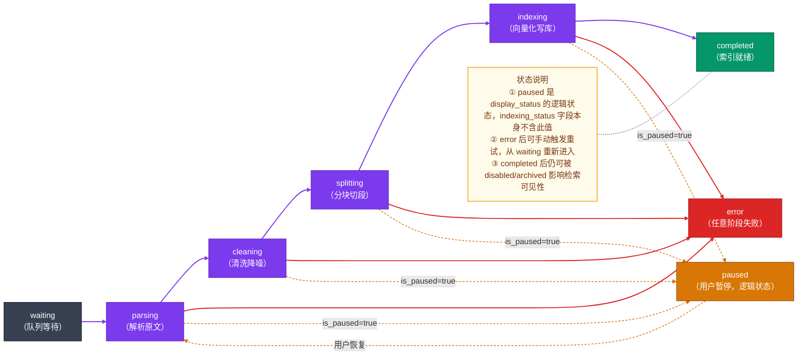

# Dify RAG 知识库域数据模型深度解析

> 基于 Dify 1.13.0 源码（`api/models/dataset.py`）分析，覆盖 Document → Segment → Index 三层落库结构、向量/关键词双索引体系、Pipeline 处理流水线，以及外部知识库对接机制。

---

## 一、域总览

### 表清单

| 表名 | Python 类名 | 一句话职责 |
|------|-------------|-----------|
| `datasets` | `Dataset` | 知识库根实体，持有索引策略、嵌入模型、检索配置 |
| `dataset_process_rules` | `DatasetProcessRule` | 文档处理规则快照（分块方式、预处理规则），每次上传独立记录 |
| `documents` | `Document` | 知识库内单个文档，携带完整的索引状态机 |
| `document_segments` | `DocumentSegment` | 文档切分后的单个片段（Chunk），是向量检索的最小单元 |
| `child_chunks` | `ChildChunk` | 层次分块模式下的子 Chunk，用于"小块检索、大块上下文"策略 |
| `document_segment_summaries` | `DocumentSegmentSummary` | LLM 生成的 Chunk 摘要，用于 Summary Index 二次检索 |
| `dataset_keyword_tables` | `DatasetKeywordTable` | 经济模式的关键词倒排索引（BM25），存于 Postgres 或对象存储 |
| `dataset_collection_bindings` | `DatasetCollectionBinding` | 嵌入模型 ↔ 向量集合名称的映射，多知识库共享集合时的路由表 |
| `embeddings` | `Embedding` | 向量缓存表，按内容 Hash 去重，避免重复调用 Embedding API |
| `app_dataset_joins` | `AppDatasetJoin` | App 与 Dataset 的多对多关联（应用绑定知识库） |
| `dataset_queries` | `DatasetQuery` | 检索查询日志，记录每次检索的 Query、来源 App、创建者 |
| `dataset_permissions` | `DatasetPermission` | 细粒度成员权限（`partial_members` 模式下的授权白名单） |
| `dataset_metadatas` | `DatasetMetadata` | 知识库级元数据字段定义（Schema，如 "作者"、"来源" 等） |
| `dataset_metadata_bindings` | `DatasetMetadataBinding` | 元数据字段与具体文档的绑定关系（赋值） |
| `segment_attachment_bindings` | `SegmentAttachmentBinding` | Segment 与附件文件的绑定（多模态知识库场景） |
| `external_knowledge_apis` | `ExternalKnowledgeApis` | 外部知识库 API 配置（endpoint、密钥等） |
| `external_knowledge_bindings` | `ExternalKnowledgeBindings` | Dataset 与外部知识库 API 的绑定关系 |
| `pipelines` | `Pipeline` | 文档处理流水线定义（新一代 Pipeline 架构） |
| `pipeline_built_in_templates` | `PipelineBuiltInTemplate` | 内置 Pipeline 模板（系统预置，不可修改） |
| `pipeline_customized_templates` | `PipelineCustomizedTemplate` | 用户自定义 Pipeline 模板 |
| `document_pipeline_execution_logs` | `DocumentPipelineExecutionLog` | Pipeline 对文档执行的明细日志 |

### 核心结论

**决策一：元数据在 Postgres，向量在外部向量数据库。**
`DocumentSegment` 的 `index_node_id` 是两个世界的桥接键——Postgres 只存 Chunk 的文本内容、状态和该 ID，向量数据库（Weaviate/Qdrant/Milvus 等）以 `index_node_id` 为主键存储浮点向量。删除 Chunk 时必须双写（先删向量库，再删 Postgres 记录），否则向量孤儿永远不会被清理。

**决策二：层次分块（Hierarchical Chunking）用"子检索、父上下文"策略。**
`DocumentSegment`（父块，较大）→ `ChildChunk`（子块，较小）形成父子树。检索阶段匹配 `ChildChunk` 的向量（精准），召回后用父块 `DocumentSegment` 的完整内容注入 LLM 上下文（丰富），两个粒度各司其职。

---

## 二、核心数据模型详解

### 2.1 datasets 表（Dataset）

| 字段 | 类型 | 设计含义 |
|------|------|---------|
| `tenant_id` | UUID | 多租户隔离的顶层键，所有查询必须带此条件 |
| `provider` | string | `"vendor"`（内置向量库）/ `"external"`（外部知识库 API） |
| `indexing_technique` | string | `"high_quality"`（向量嵌入）/ `"economy"`（关键词 BM25）/ `null` |
| `embedding_model` / `embedding_model_provider` | string | 绑定的嵌入模型，一旦创建不建议变更（变更需全量重建索引） |
| `collection_binding_id` | UUID | 指向 `dataset_collection_bindings`，确定该 Dataset 在向量库的集合名称 |
| `retrieval_model` | JSON | 检索配置快照：搜索方法、top_k、重排模型、分数阈值 |
| `chunk_structure` | string | 新 Pipeline 架构下的分块结构类型（与 `pipeline_id` 配套） |
| `pipeline_id` | UUID | 关联 Pipeline 流水线（新架构），替代 `DatasetProcessRule` 的静态规则 |
| `runtime_mode` | string | `"general"`（传统模式）/ pipeline 模式，控制文档处理路径 |
| `permission` | string | `"only_me"` / `"all_team_members"` / `"partial_members"` |
| `built_in_field_enabled` | bool | 是否启用内置元数据字段（文档名、上传者、上传日期、来源） |
| `is_multimodal` | bool | 是否启用多模态支持（允许 Segment 携带图片附件） |

**关键设计**：`Dataset.gen_collection_name_by_id()` 将 `dataset_id` 转为向量集合名，格式为 `{prefix}_{dataset_id}_Node`，确保集合名全局唯一且可从 Dataset ID 反推。

---

### 2.2 documents 表（Document）

文档的字段按**索引流水线阶段**分组，字段本身就是时间轴：

```
waiting → parsing → cleaning → splitting → indexing → completed
```

| 字段 | 阶段 | 设计含义 |
|------|------|---------|
| `data_source_type` | 初始 | `"upload_file"` / `"notion_import"` / `"website_crawl"` |
| `data_source_info` | 初始 | JSON，不同来源的元信息（upload_file_id、notion page id 等） |
| `dataset_process_rule_id` | 初始 | 关联本次上传使用的处理规则快照 |
| `batch` | 初始 | 批次标识，同一批次上传的文档共享相同批次号 |
| `indexing_status` | 贯穿全程 | 状态机当前状态，6 个阶段枚举值 |
| `file_id` | parsing | 关联对象存储中的原始文件 |
| `word_count` / `tokens` | splitting/indexing | 文档字数和 token 用量（计费、限额依据） |
| `doc_form` | 切分 | `"text_model"` / `"qa_model"` / `"hierarchical_model"` |
| `need_summary` | 切分 | 是否需要为每个 Chunk 生成 LLM 摘要（Summary Index） |
| `is_paused` / `paused_at` | 运行时 | 用户主动暂停标志，Celery 任务轮询此字段决定是否继续 |
| `enabled` / `archived` | 生命周期 | 禁用（临时隐藏）vs 归档（永久下线），检索时过滤这两个标志 |
| `error` / `stopped_at` | 错误 | 任意阶段失败时记录原因和时间 |

**关键设计**：`display_status` 属性是状态机的门面封装，将 `indexing_status + is_paused + enabled + archived` 四个字段合并为用户可见的 7 个状态（queuing / indexing / paused / error / available / disabled / archived）。

---

### 2.3 document_segments 表（DocumentSegment）

| 字段 | 设计含义 |
|------|---------|
| `dataset_id` / `document_id` | 双层归属，查询时可按知识库或文档过滤 |
| `position` | Chunk 在文档内的顺序号，支持展示原文顺序 |
| `content` | Chunk 原始文本（LongText），检索命中后原文注入 LLM |
| `answer` | Q&A 模式专用：`content` 存 Question，`answer` 存 Answer |
| `index_node_id` | 向量数据库中对应向量的节点 ID（两个存储系统的桥接键） |
| `index_node_hash` | 内容 Hash，用于判断 Chunk 内容是否变化（增量更新决策依据） |
| `keywords` | JSON 数组，关键词索引模式下的关键词列表 |
| `hit_count` | 被检索命中的累计次数，用于热度排序 |
| `status` | Chunk 自身的索引状态（`waiting` / `indexing` / `completed`） |

---

### 2.4 child_chunks 表（ChildChunk）

| 字段 | 设计含义 |
|------|---------|
| `segment_id` | 关联父 `DocumentSegment`，父子关系核心外键 |
| `position` | 子块在父块内的顺序 |
| `content` | 子块文本（比父块更小的粒度） |
| `index_node_id` | 子块在向量库的节点 ID（检索命中的是此 ID） |
| `type` | `"automatic"`（系统自动切分）/ 未来支持手动 |

**父子块协作逻辑**：检索时向量匹配 `ChildChunk.index_node_id`，找到命中 `ChildChunk` 后，通过 `segment_id` 上溯到 `DocumentSegment`，用父块完整内容组装 LLM Context，兼顾精准召回与丰富上下文。

---

### 2.5 dataset_collection_bindings 表（DatasetCollectionBinding）

| 字段 | 设计含义 |
|------|---------|
| `provider_name` / `model_name` | 嵌入模型标识 |
| `type` | `"dataset"` / `"query"` 区分不同用途的集合 |
| `collection_name` | 向量数据库中实际的集合名称（全局唯一） |

**关键设计**：多个 Dataset 可能共用同一个向量集合（相同嵌入模型下），通过集合内的 `dataset_id` 字段过滤。这张表是 Dify 抽象向量数据库厂商差异的关键中间层。

---

## 三、完整数据模型关系图

```mermaid
flowchart TB
    classDef datasetStyle  fill:#1d4ed8,stroke:#1e3a8a,stroke-width:2.5px,color:#fff
    classDef docStyle      fill:#7c3aed,stroke:#5b21b6,stroke-width:2px,color:#fff
    classDef segStyle      fill:#0891b2,stroke:#155e75,stroke-width:2px,color:#fff
    classDef indexStyle    fill:#059669,stroke:#064e3b,stroke-width:2px,color:#fff
    classDef metaStyle     fill:#d97706,stroke:#92400e,stroke-width:2px,color:#fff
    classDef extStyle      fill:#dc2626,stroke:#991b1b,stroke-width:2px,color:#fff
    classDef pipeStyle     fill:#ea580c,stroke:#7c2d12,stroke-width:2px,color:#fff
    classDef logStyle      fill:#374151,stroke:#111827,stroke-width:2px,color:#fff
    classDef noteStyle     fill:#fffbeb,stroke:#f59e0b,stroke-width:1.5px,color:#78350f
    classDef layerStyle    fill:#f8fafc,stroke:#cbd5e0,stroke-width:1.5px

    subgraph CORE["核心知识库层"]
        DS["datasets 表<br>indexing_technique / provider<br>embedding_model / collection_binding_id<br>retrieval_model / pipeline_id"]:::datasetStyle
        DPR["dataset_process_rules 表<br>mode: automatic/custom/hierarchical<br>rules: JSON 分块参数快照"]:::metaStyle
    end
    class CORE layerStyle

    subgraph DOCLAY["文档层"]
        DOC["documents 表<br>indexing_status 状态机<br>data_source_type / doc_form<br>dataset_process_rule_id"]:::docStyle
    end
    class DOCLAY layerStyle

    subgraph SEGLAY["分段层（Chunk）"]
        direction LR
        SEG["document_segments 表<br>content / index_node_id<br>index_node_hash / hit_count<br>status / keywords"]:::segStyle
        CC["child_chunks 表<br>segment_id（父块 FK）<br>content / index_node_id<br>position / type"]:::segStyle
        DSS["document_segment_summaries 表<br>chunk_id / summary_content<br>summary_index_node_id / status"]:::segStyle
    end
    class SEGLAY layerStyle

    subgraph IDXLAY["索引层"]
        direction LR
        DCB["dataset_collection_bindings 表<br>provider_name + model_name<br>collection_name（向量集合路由）"]:::indexStyle
        DKT["dataset_keyword_tables 表<br>keyword_table: JSON 倒排索引<br>data_source_type: database/file"]:::indexStyle
        EMB["embeddings 表<br>model_name / hash / embedding<br>provider_name（向量缓存去重）"]:::indexStyle
        VDB[("外部向量数据库<br>Weaviate/Qdrant/Milvus<br>index_node_id 为主键")]:::logStyle
    end
    class IDXLAY layerStyle

    subgraph METALAY["元数据 & 权限层"]
        direction LR
        DM["dataset_metadatas 表<br>name / type（字段 Schema 定义）"]:::metaStyle
        DMB["dataset_metadata_bindings 表<br>metadata_id + document_id<br>（字段与文档的赋值绑定）"]:::metaStyle
        DP["dataset_permissions 表<br>account_id / has_permission<br>（partial_members 细粒度授权）"]:::metaStyle
        SAB["segment_attachment_bindings 表<br>segment_id + attachment_id<br>（多模态附件绑定）"]:::metaStyle
    end
    class METALAY layerStyle

    subgraph EXTLAY["外部知识库层"]
        direction LR
        EKA["external_knowledge_apis 表<br>name / settings: endpoint+密钥<br>（外部 API 配置）"]:::extStyle
        EKB["external_knowledge_bindings 表<br>dataset_id + external_knowledge_api_id<br>external_knowledge_id"]:::extStyle
    end
    class EXTLAY layerStyle

    subgraph PIPELAY["Pipeline 流水线层（新架构）"]
        direction LR
        PL["pipelines 表<br>workflow_id / is_published<br>is_public / tenant_id"]:::pipeStyle
        DPEL["document_pipeline_execution_logs 表<br>pipeline_id + document_id<br>datasource_type / input_data"]:::pipeStyle
    end
    class PIPELAY layerStyle

    subgraph RELLAY["关联 & 日志层"]
        direction LR
        ADJ["app_dataset_joins 表<br>app_id + dataset_id<br>（应用绑定知识库）"]:::logStyle
        DQ["dataset_queries 表<br>content / source / source_app_id<br>（检索查询日志）"]:::logStyle
    end
    class RELLAY layerStyle

    DS -->|"dataset_id"| DOC
    DS -->|"dataset_id"| DPR
    DS -->|"collection_binding_id"| DCB
    DS -->|"dataset_id（1:1）"| DKT
    DS -->|"pipeline_id"| PL
    DOC -->|"dataset_process_rule_id"| DPR
    DOC -->|"document_id"| SEG
    SEG -->|"segment_id"| CC
    SEG -->|"chunk_id"| DSS
    DCB -.->|"集合路由"| VDB
    SEG -.->|"index_node_id 写入"| VDB
    CC -.->|"index_node_id 写入"| VDB
    DSS -.->|"summary_index_node_id 写入"| VDB
    DS -->|"dataset_id"| DM
    DM -->|"metadata_id"| DMB
    DOC -->|"document_id"| DMB
    DS -->|"dataset_id"| DP
    SEG -->|"segment_id"| SAB
    DS -.->|"provider=external"| EKB
    EKB -->|"external_knowledge_api_id"| EKA
    DS -->|"dataset_id"| ADJ
    DS -->|"dataset_id"| DQ
    PL -->|"pipeline_id"| DPEL

    NOTE["表关系要点<br>① Dataset.collection_binding_id 决定向量存在哪个集合，是向量 DB 路由的唯一入口<br>② DocumentSegment.index_node_id 是 Postgres ↔ 向量库的桥接键，两边必须同步<br>③ ChildChunk 检索命中后需上溯 segment_id 取父块全文注入 LLM 上下文<br>④ Dataset.provider=external 时走 ExternalKnowledgeBindings，不走内部索引管线<br>⑤ DocumentSegmentSummary 的 summary_index_node_id 支持 Summary Index 二次检索"]:::noteStyle
    NOTE -.- DS

    %% 边索引：0-24，共 25 条
    linkStyle 0 stroke:#7c3aed,stroke-width:2.5px
    linkStyle 1 stroke:#d97706,stroke-width:2px
    linkStyle 2 stroke:#059669,stroke-width:2px
    linkStyle 3 stroke:#059669,stroke-width:2px
    linkStyle 4 stroke:#ea580c,stroke-width:2px
    linkStyle 5 stroke:#d97706,stroke-width:2px
    linkStyle 6 stroke:#7c3aed,stroke-width:2px
    linkStyle 7 stroke:#0891b2,stroke-width:2px
    linkStyle 8 stroke:#0891b2,stroke-width:2px
    linkStyle 9 stroke:#059669,stroke-width:1.5px,stroke-dasharray:4 3
    linkStyle 10 stroke:#0891b2,stroke-width:1.5px,stroke-dasharray:4 3
    linkStyle 11 stroke:#0891b2,stroke-width:1.5px,stroke-dasharray:4 3
    linkStyle 12 stroke:#0891b2,stroke-width:1.5px,stroke-dasharray:4 3
    linkStyle 13 stroke:#d97706,stroke-width:2px
    linkStyle 14 stroke:#d97706,stroke-width:2px
    linkStyle 15 stroke:#d97706,stroke-width:2px
    linkStyle 16 stroke:#d97706,stroke-width:2px
    linkStyle 17 stroke:#d97706,stroke-width:2px
    linkStyle 18 stroke:#dc2626,stroke-width:1.5px,stroke-dasharray:4 3
    linkStyle 19 stroke:#dc2626,stroke-width:2px
    linkStyle 20 stroke:#374151,stroke-width:2px
    linkStyle 21 stroke:#374151,stroke-width:2px
    linkStyle 22 stroke:#ea580c,stroke-width:2px
    linkStyle 23 stroke:#f59e0b,stroke-width:1px,stroke-dasharray:2 2
```



---

## 四、关键设计决策

### 决策一：向量数据存外部，Postgres 只存元数据

**场景**：Dify 需要支持十几种向量数据库（Weaviate、Qdrant、Milvus、Pinecone、PGVector 等），且向量数据量可能达到亿级。

**选择方案**：Postgres `document_segments` 表存文本内容和元数据，`index_node_id` 字段持有外部向量库的节点 ID，向量本体完全在外部。

**设计理由**：向量数据结构高度专业化（高维浮点数组 + ANN 索引），用关系数据库存储性能极差，抽象到外部允许租户自选最优向量库。Postgres 负责事务一致性（知道"有没有"这条 Chunk），向量库负责高性能近邻搜索（知道"找谁最相似"）。

**代价与权衡**：删除 Chunk 时必须双写两个存储（先删向量库，再删 Postgres），若中途失败会产生向量孤儿。`index_node_hash` 字段是增量更新的判断依据——内容没变就不重算向量，避免重复计费。

---

### 决策二：ProcessRule 快照 vs Pipeline 流水线的双轨架构

**场景**：早期 Dify 的文档处理规则（分块大小、预处理规则）是静态配置，随产品演进需要支持可视化编排的多步处理流程（OCR、翻译、自定义分块逻辑等）。

**选择方案**：传统路径保留 `DatasetProcessRule`（静态 JSON 规则快照），新 Pipeline 路径新增 `pipelines` / `Pipeline` 表（与 Workflow 引擎对接），由 `Dataset.runtime_mode` 和 `Dataset.pipeline_id` 决定走哪条路径。

**设计理由**：兼容存量数据（大量已有知识库走传统路径），同时为新能力（流水线处理）预留扩展点，`DatasetProcessRule.mode` 也已扩展支持 `"hierarchical"` 模式作为过渡。

**代价与权衡**：两条路径并存增加了代码复杂度，需要在服务层检查 `runtime_mode` 分叉处理，长期需要逐步迁移到 Pipeline 路径统一。

---

### 决策三：层次分块用"子检索-父上下文"双粒度设计

**场景**：小粒度 Chunk 提升向量检索精准度，但注入 LLM 时上下文太短；大粒度 Chunk 上下文丰富，但向量匹配噪音大。

**选择方案**：`DatasetProcessRule.mode = "hierarchical"` 时，父 `DocumentSegment`（大块，保存完整段落）→ 子 `ChildChunk`（小块，精准语义单元），两层各有独立的 `index_node_id` 写入向量库。

**设计理由**：检索阶段用子块向量精准匹配，命中后通过 `segment_id` 上溯父块，用父块 `content` 拼装 LLM 上下文——精准召回与丰富上下文兼得，不牺牲任何一方。

**代价与权衡**：索引阶段需同时向量化父块和子块，存储和计算成本翻倍；删除/更新时需同步处理父子两层的向量和 Postgres 记录，维护复杂度更高。

---

## 五、典型业务场景数据流

### 场景一：上传一个 PDF 文档到知识库

```
用户上传 PDF
    │
    ├─① UploadFile 记录写入（文件元数据，存于对象存储）
    │
    ├─② Document 记录创建
    │     indexing_status = "waiting"
    │     data_source_type = "upload_file"
    │     data_source_info = {"upload_file_id": "xxx"}
    │     dataset_process_rule_id = 新建的 DatasetProcessRule.id
    │
    ├─③ Celery 任务触发：DocumentIndexingTask
    │
    ├─④ Parsing 阶段
    │     Document.indexing_status → "parsing"
    │     Document.processing_started_at = now()
    │     抽取 PDF 文本 → 写回 file_id、word_count
    │     Document.parsing_completed_at = now()
    │
    ├─⑤ Cleaning 阶段
    │     Document.indexing_status → "cleaning"
    │     按 DatasetProcessRule 去噪、过滤
    │     Document.cleaning_completed_at = now()
    │
    ├─⑥ Splitting 阶段
    │     Document.indexing_status → "splitting"
    │     批量创建 DocumentSegment（status="waiting"）
    │     若 hierarchical 模式同时创建 ChildChunk
    │     Document.splitting_completed_at = now()
    │
    ├─⑦ Indexing 阶段
    │     Document.indexing_status → "indexing"
    │     对每个 DocumentSegment：
    │       - 调用 Embedding API，写 Embeddings 缓存表（按 hash 去重）
    │       - 写入外部向量库，获取 index_node_id
    │       - DocumentSegment.index_node_id = xxx
    │       - DocumentSegment.status = "completed"
    │     若启用 keyword 索引，更新 DatasetKeywordTable
    │     若启用 Summary，生成 DocumentSegmentSummary 并写入 summary_index_node_id
    │
    └─⑧ 完成
          Document.indexing_status → "completed"
          Document.completed_at = now()
          Document.tokens = 累计 token 数
```

---

### 场景二：应用调用知识库执行检索

```
用户在应用中发送消息："Dify 如何配置 OpenAI？"
    │
    ├─① 应用配置读取 AppDatasetJoin，获取绑定的 dataset_id 列表
    │
    ├─② 对用户 Query 文本调用 Embedding API
    │     先查 Embeddings 缓存表（by hash），命中则直接取缓存向量
    │
    ├─③ 确定检索集合：Dataset.collection_binding_id → DatasetCollectionBinding.collection_name
    │
    ├─④ 向量检索：用 Query 向量在外部向量库搜索 Top-K 相似 index_node_id
    │
    ├─⑤ 元数据回填：
    │     SELECT * FROM document_segments WHERE index_node_id IN (...)
    │     获取 content、document_id、dataset_id、hit_count 等
    │
    ├─⑥ 若为层次分块模式（parent_mode != FULL_DOC）：
    │     通过 ChildChunk.segment_id 查 DocumentSegment 父块 content
    │     用父块内容替代子块内容注入上下文
    │
    ├─⑦ 过滤：排除 enabled=False 或 status!="completed" 的 Segment
    │
    ├─⑧ 重排序（若 retrieval_model.reranking_enable=True）：
    │     调用 Reranker 模型对候选 Chunk 打分排序
    │
    ├─⑨ 写入检索日志：
    │     DatasetQuery: dataset_id / content=Query / source_app_id
    │
    └─⑩ 返回 Top-K Chunk 内容，注入 LLM Prompt
          DocumentSegment.hit_count += 1（异步更新）
```

---

## 六、附：indexing_status 状态机完整图


