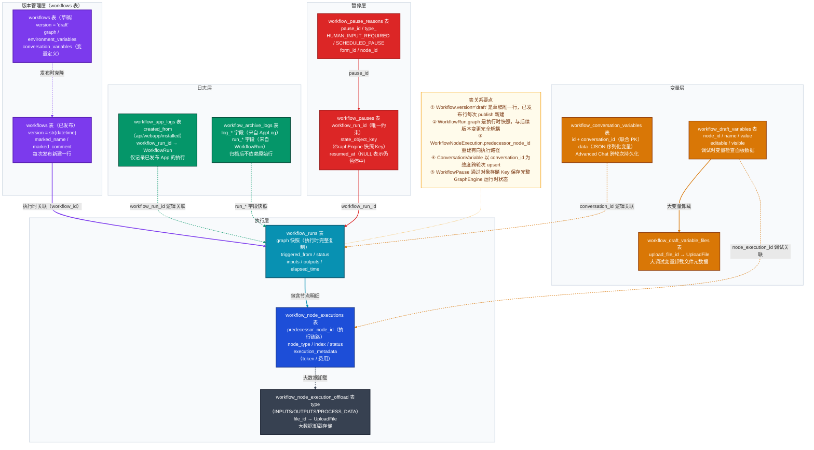

# Dify 工作流域数据模型深度解析

> 覆盖 `api/models/workflow.py` 全部 11 张表，重点剖析：执行历史 graph 快照机制、节点执行链路追踪、大数据卸载设计、对话变量跨轮次持久化与工作流暂停/恢复机制。

---

## 一、域总览

### 1.1 表清单

| 表名 | Python 类名 | 一句话职责 |
|---|---|---|
| `workflows` | `Workflow` | 工作流定义画布（草稿行 + 已发布快照行共存于同一张表） |
| `workflow_runs` | `WorkflowRun` | 每次工作流执行记录，内嵌 graph 快照，完整保留历史 |
| `workflow_node_executions` | `WorkflowNodeExecutionModel` | 每个节点在单次运行中的执行明细（输入/输出/耗时/状态） |
| `workflow_node_execution_offload` | `WorkflowNodeExecutionOffload` | 超大 inputs/outputs/process_data 的卸载存储记录 |
| `workflow_app_logs` | `WorkflowAppLog` | 用户可见的应用执行日志（过滤掉 canvas 调试记录） |
| `workflow_archive_logs` | `WorkflowArchiveLog` | 归档快照，合并 WorkflowRun + WorkflowAppLog 的关键字段 |
| `workflow_conversation_variables` | `ConversationVariable` | Advanced Chat 模式下对话变量的跨轮次持久化存储 |
| `workflow_draft_variables` | `WorkflowDraftVariable` | 调试执行时产生的变量快照（用于变量检查面板） |
| `workflow_draft_variable_files` | `WorkflowDraftVariableFile` | 超大调试变量的卸载文件元数据 |
| `workflow_pauses` | `WorkflowPause` | 工作流暂停状态记录（与 WorkflowRun 一对一） |
| `workflow_pause_reasons` | `WorkflowPauseReason` | 具体暂停原因（人工输入等待 / 调度暂停） |

### 1.2 核心设计结论

1. **graph 快照不可变原则**：`WorkflowRun.graph` 在执行触发时完整复制 `Workflow.graph`，此后与源 Workflow 版本完全解耦——即使后续发布新版本，历史执行记录始终反映当时的画布状态。

2. **草稿行与发布行共存**：`workflows` 表通过 `version` 字段区分草稿（`"draft"`）与已发布快照（`str(datetime)`），两类行共存于同一张表，草稿行每个 App 唯一，已发布行可无限累积。

---

## 二、核心数据模型详解

### 2.1 `workflows` 表（Workflow 类）

**核心字段：**

| 字段 | 类型 | 设计含义 |
|---|---|---|
| `version` | String(255) | `"draft"` 表示草稿行；`str(datetime)` 表示已发布快照，每次发布新建一行 |
| `graph` | LongText | 完整画布 JSON（nodes + edges）。序列化存储，读取时解析为 `graph_dict` |
| `environment_variables` | LongText（`_environment_variables`） | 工作流级环境变量，Secret 类型字段加密存储 |
| `conversation_variables` | LongText（`_conversation_variables`） | 对话变量初始定义（Advanced Chat 模式）。运行时实例化为 `ConversationVariable` 行 |
| `rag_pipeline_variables` | LongText（`_rag_pipeline_variables`） | RAG Pipeline 模式下的用户输入变量定义 |
| `type` | String(255) | `WorkflowType` 枚举：`workflow` / `chat` / `rag-pipeline` |
| `marked_name` | String(255) | 已发布版本的标注名称（版本备注） |
| `app_id` | StringUUID | 关联的 App（逻辑外键，无 FK 约束） |

**设计要点：**
- `graph` 字段是 JSON 大文本，而非规范化的节点/边表。理由：画布拓扑频繁整体变动，规范化拆分会导致大量批量写入，JSON 存储更自然且发布时克隆代价低。
- `environment_variables` 中的 `SecretVariable` 在 setter 时自动调用 `encrypter.encrypt_token` 加密，getter 时解密，外界透明。
- `unique_hash` 属性用于检测 draft 与线上版本是否有实质性变化（`graph + features` 的 MD5）。

---

### 2.2 `workflow_runs` 表（WorkflowRun 类）

**核心字段：**

| 字段 | 类型 | 设计含义 |
|---|---|---|
| `workflow_id` | StringUUID | 执行时关联的 Workflow 版本（逻辑外键） |
| `graph` | LongText | **执行时从 Workflow.graph 完整复制的快照**，历史不可变 |
| `triggered_from` | String(255) | 触发来源：`debugging`（Canvas 调试）/ `app-run`（已发布应用执行） |
| `status` | EnumText | `WorkflowExecutionStatus`：`running / succeeded / failed / stopped` |
| `inputs` | LongText | 执行入参（JSON），Start 节点变量值 |
| `outputs` | LongText | 最终输出（JSON），End 节点变量值 |
| `elapsed_time` | Float | 总耗时（秒） |
| `total_tokens` | BigInteger | 累计消耗 token 数 |
| `created_by_role` | EnumText | `account`（Console 用户）/ `end_user`（终端用户） |
| `exceptions_count` | Integer | 执行过程中异常节点计数（允许部分异常） |

**设计要点：**
- `graph` 快照的存在使得即使 Workflow 发布新版本，`workflow_runs` 仍能准确还原当时的执行拓扑用于 Trace 展示。
- `triggered_from = "debugging"` 的记录不写入 `workflow_app_logs`，仅供 Canvas 调试面板查看，不污染用户可见的执行日志。

---

### 2.3 `workflow_node_executions` 表（WorkflowNodeExecutionModel 类）

**核心字段：**

| 字段 | 类型 | 设计含义 |
|---|---|---|
| `workflow_run_id` | StringUUID | 父执行记录 ID（单步调试时为 NULL） |
| `triggered_from` | String(255) | `single-step`（单节点调试）/ `workflow-run`（完整运行）/ `rag-pipeline-run` |
| `predecessor_node_id` | String(255) | **前置节点 ID**，用于前端重建执行路径（有向链） |
| `index` | Integer | 节点执行序号（全局递增），用于 Tracing 时排序 |
| `node_id` | String(255) | 画布中的节点 ID（与 graph JSON 中 node.id 对应） |
| `node_type` | String(255) | 节点类型（llm / code / knowledge-retrieval / tool 等） |
| `inputs` | LongText | 该节点的输入变量快照 |
| `outputs` | LongText | 该节点的输出变量快照 |
| `execution_metadata` | LongText | 元数据（总 token、费用、工具信息、触发器信息等） |
| `process_data` | LongText | 节点中间过程数据（如 LLM 节点的 prompt messages） |

**设计要点：**
- `predecessor_node_id` 实现了执行链路的有向图重建，前端 Trace 视图通过该字段将节点执行记录连接成树/链。
- 当 `triggered_from = "single-step"` 时，`workflow_run_id` 为 NULL，是孤立的单节点调试记录。
- `inputs/outputs/process_data` 超大时触发 `WorkflowNodeExecutionOffload` 卸载机制。

---

### 2.4 `workflow_conversation_variables` 表（ConversationVariable 类）

**核心字段：**

| 字段 | 类型 | 设计含义 |
|---|---|---|
| `id` + `conversation_id` | StringUUID（联合 PK） | 变量 ID + 对话 ID 构成联合主键 |
| `app_id` | StringUUID | 所属 App（逻辑外键） |
| `data` | LongText | 变量内容（JSON 序列化的 `VariableBase` 对象） |

**设计要点：**
- `ConversationVariable` 是 Advanced Chat 模式的核心持久化机制：`Workflow.conversation_variables` 定义变量的初始值和类型，每次对话创建时按定义实例化，后续轮次对该表进行 upsert。
- 每个变量的完整状态（类型 + 值）都序列化进 `data` 字段，读取时通过 `variable_factory.build_conversation_variable_from_mapping` 反序列化。

---

### 2.5 `workflow_pauses` 表（WorkflowPause 类）

**核心字段：**

| 字段 | 类型 | 设计含义 |
|---|---|---|
| `workflow_run_id` | StringUUID（唯一约束） | 关联的运行记录（一对一关系，通过唯一约束而非 FK 指针实现） |
| `workflow_id` | StringUUID | 关联的工作流版本 ID（恢复时确定加载哪个版本） |
| `state_object_key` | String(255) | 序列化的 GraphEngine 运行时状态的对象存储 Key |
| `resumed_at` | DateTime（可 NULL） | 恢复时间戳；NULL 表示仍处于暂停中 |

**设计要点：**
- `WorkflowPause` 与 `WorkflowRun` 是一对一关系，但设计上从 `WorkflowPause` 侧引用 `WorkflowRun`（而非在 `workflow_runs` 表加 `pause_id` 字段），避免对可能存在大量数据的 `workflow_runs` 表执行迁移。
- `state_object_key` 指向对象存储中完整的 GraphEngine 快照，包含所有节点状态和变量池——这是工作流可恢复的核心数据。
- 恢复时仅将 `resumed_at` 设为非 NULL，不立即删除记录，保留暂停历史。

---

## 三、完整数据模型关系图



---

## 四、关键设计决策

### 决策 1：graph 字段存 JSON 快照而非外键引用

**场景描述**：工作流执行历史需要保留执行当时的完整画布拓扑，用于 Trace 回溯和错误定位。

**选择方案**：`WorkflowRun.graph` 在执行触发时，从 `Workflow.graph` 做全量 JSON 复制并写入自身，不存 Workflow 的外键引用。

**设计理由**：若只存外键，一旦发布新版本，历史执行记录在 UI 展示时会渲染错误版本的节点，导致 Trace 信息失真；JSON 快照彻底隔离历史与当前版本，任何时刻都能准确还原当时的执行画面。

**代价与权衡**：每次执行会写入冗余的 graph JSON（可能数十KB），磁盘占用随执行次数线性增长。工程上通过 `WorkflowArchiveLog` 归档机制，将老旧 `WorkflowRun` 的压缩快照写入归档表后清理原始行，以控制表大小。

---

### 决策 2：大数据卸载（Offload）机制

**场景描述**：工作流节点的 inputs/outputs 可能包含大文件、长文本、数组等超大数据，直接存入 `workflow_node_executions` 行会导致单行超过数据库限制或读取性能下降。

**选择方案**：引入 `WorkflowNodeExecutionOffload` 表 + UploadFile 对象存储。当某个字段超过阈值时，写入对象存储并在 offload 表记录元数据（`type`、`file_id`）；`workflow_node_executions` 对应字段保留截断版本，通过 `inputs_truncated` / `outputs_truncated` 属性标识。

**设计理由**：inputs 和 outputs 分为两条 offload 记录而非合并，原因是节点执行分两个时间点写入（启动时写 inputs，完成时写 outputs），合并存储会使执行状态在完成前不可见，损害可观测性。

**代价与权衡**：读取完整数据需要额外查询对象存储（`load_full_inputs / load_full_outputs`），在仅需元数据的场景（列表展示）可忽略此开销，仅在详情页按需加载完整内容。

---

### 决策 3：ConversationVariable 跨轮次持久化

**场景描述**：Advanced Chat（Chatflow）模式允许在画布中定义"对话变量"（如用户偏好、累计计数），这些变量需要在同一对话的多个轮次间保持状态，类似有状态的 Session。

**选择方案**：`Workflow.conversation_variables` 存变量的类型定义和默认值；对话发生时，运行时从 `workflow_conversation_variables` 表加载当前对话的变量实例，执行结束后 upsert 更新；联合主键 `(id, conversation_id)` 确保每个对话独立持有一份变量状态。

**设计理由**：变量定义（schema）和变量值（state）分离：schema 随 Workflow 版本管理，state 随 Conversation 生命周期管理，两者正交，互不干扰。

**代价与权衡**：变量更新需要额外的 upsert 操作；当对话轮次极多时，`workflow_conversation_variables` 表行数随对话数线性增长，需要定期清理已结束对话的变量数据。

---

## 五、典型业务场景数据流

### 场景 1：用户通过 WebApp 触发工作流执行

**步骤一：触发执行**
1. API 层接收请求，校验 App 的 `workflow_id`（指向当前线上 Workflow 版本）
2. 服务层读取 `Workflow` 行（已发布版本），将 `graph` JSON 完整复制到 `WorkflowRun.graph`
3. 写入 `workflow_runs` 行，`status = running`，`triggered_from = "app-run"`

**步骤二：节点逐一执行**
4. GraphEngine 按拓扑顺序执行每个节点，每个节点开始时写入 `workflow_node_executions` 行（`status = running`，记录 `inputs`）
5. 节点完成后更新同一行（`status = succeeded`，补写 `outputs`、`elapsed_time`、`execution_metadata`）
6. `predecessor_node_id` 设为上一个执行节点的 `node_id`，构成执行链路

**步骤三：完成收尾**
7. 所有节点执行完毕，更新 `workflow_runs`：`status = succeeded`，写入 `outputs` 和 `finished_at`
8. 写入 `workflow_app_logs` 行（`created_from = "web-app"`），作为用户可见日志

**字段状态变化追踪：**
```
workflow_runs.status:  running → succeeded
workflow_runs.finished_at: NULL → timestamp
workflow_node_executions.status（各行）: running → succeeded/failed
workflow_app_logs: 新增一行
```

---

### 场景 2：工作流执行遇到人工输入节点暂停

**步骤一：触发暂停**
1. GraphEngine 执行到 Human Input 节点，判断需要等待用户输入
2. 将当前完整运行时状态序列化，写入对象存储，获得 `state_object_key`
3. 写入 `workflow_pauses` 行：`workflow_run_id`、`state_object_key`、`resumed_at = NULL`
4. 写入 `workflow_pause_reasons` 行：`type_ = HUMAN_INPUT_REQUIRED`、`form_id`（表单 ID）、`node_id`
5. 更新 `workflow_runs.status = paused`

**步骤二：用户提交表单，工作流恢复**
6. API 层接收用户表单提交，根据 `workflow_run_id` 查找 `workflow_pauses` 行
7. 从 `state_object_key` 读取对象存储中的 GraphEngine 状态，重建执行上下文
8. 将用户输入注入变量池，继续执行后续节点
9. 更新 `workflow_pauses.resumed_at = now()`（记录恢复时间，但不删除记录）
10. 后续节点执行完毕后，更新 `workflow_runs.status = succeeded`

**字段状态变化追踪：**
```
workflow_runs.status: running → paused → succeeded
workflow_pauses: 新增一行（resumed_at: NULL → timestamp）
workflow_pause_reasons: 新增一行（不可变，记录原始暂停原因）
```
