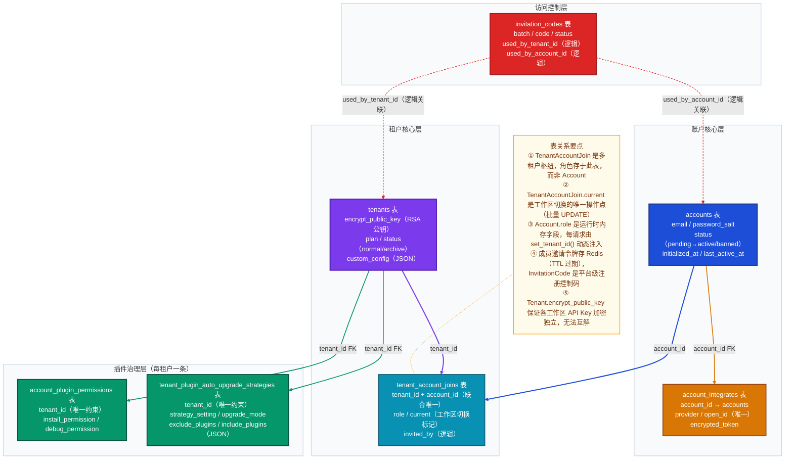

# Dify 账户/租户域数据模型深度解析

> 基于 Dify 1.13.0 源码（`api/models/account.py`、`api/services/account_service.py`）分析

---

## 一、域总览

### 表清单

| 表名 | Python 类名 | 一句话职责 |
|------|------------|-----------|
| `accounts` | `Account` | 全局用户账户，存储认证凭据与个人偏好 |
| `tenants` | `Tenant` | 工作区（租户），每个工作区是独立的资源隔离边界 |
| `tenant_account_joins` | `TenantAccountJoin` | 用户-工作区多对多关联表，同时承载角色与当前工作区标记 |
| `account_integrates` | `AccountIntegrate` | 第三方 OAuth 账号绑定记录（GitHub / Google 等） |
| `invitation_codes` | `InvitationCode` | 平台级邀请码，控制是否允许新用户访问注册入口 |
| `account_plugin_permissions` | `TenantPluginPermission` | 租户插件安装与调试权限配置（每租户一条） |
| `tenant_plugin_auto_upgrade_strategies` | `TenantPluginAutoUpgradeStrategy` | 租户插件自动升级策略配置（每租户一条） |

### 核心结论

1. **角色不属于账户，属于"账户在某工作区的成员关系"**：`TenantAccountJoin.role` 存储角色，同一用户在不同工作区可以有完全不同的角色。`Account.role` 是 Python 内存字段，通过请求生命周期内的 `set_tenant_id()` 动态注入，不落数据库。

2. **邀请令牌存 Redis 而非数据库**：工作区成员邀请的有效期管理完全在 Redis（TTL 自动过期）中完成，数据库的 `invitation_codes` 表是一套独立的、用于控制平台入口访问权限的邀请码机制，两者互不干涉。

---

## 二、核心数据模型详解

### 2.1 Account（accounts 表）

| 字段 | 类型 | 设计意图 |
|------|------|---------|
| `id` | UUID | 全局唯一用户标识，跨工作区共享 |
| `email` | String(255) | 登录凭据，建有 `account_email_idx` 索引；大小写兼容查询（历史遗留） |
| `password` / `password_salt` | String(255) | 盐值分离的哈希密码；OAuth 登录用户此两字段为 NULL |
| `status` | String(16) | 状态机：`pending` → `active` / `banned` / `closed` |
| `initialized_at` | DateTime | 首次激活时间；NULL 表示"已注册但未初始化"（如被邀请但未设置密码） |
| `last_active_at` | DateTime | 每 10 分钟更新一次，用于活跃度统计（在 `load_user()` 中驱动） |
| `interface_language` / `interface_theme` / `timezone` | String | 用户个人 UI 偏好，随账户全局保留，工作区切换后不变 |

**关键设计**：`role` 字段是 `dataclass field(default=None, init=False)`，不映射任何数据库列。每次请求通过 `account.set_tenant_id(tenant_id)` 查询 `TenantAccountJoin` 后注入。这意味着角色鉴权逻辑（如 `account.is_admin_or_owner`）依赖于请求上下文中"当前工作区"的正确绑定。

**AccountStatus 状态机**：

```
invited → [创建账户] → PENDING
                          ↓ 首次登录/激活
                        ACTIVE ──→ BANNED（被管理员封禁）
                          ↓ 主动注销
                        CLOSED
```

### 2.2 Tenant（tenants 表）

| 字段 | 类型 | 设计意图 |
|------|------|---------|
| `id` | UUID | 工作区唯一标识，是整个系统多租户隔离的根键（Apps、Datasets、Workflows 均含此外键） |
| `encrypt_public_key` | LongText | RSA 公钥，每个工作区独立生成，用于加密该租户下的 API Key 等敏感凭据 |
| `plan` | String(255) | 订阅套餐（默认 `basic`），付费版扩展此字段驱动功能限制 |
| `status` | String(255) | `normal` / `archive`（归档后不可加入新成员，不影响现有资源） |
| `custom_config` | LongText（JSON） | 扩展配置，通过 `custom_config_dict` 属性以 dict 形式访问/修改 |

**关键设计**：`encrypt_public_key` 是租户级密钥隔离的核心。`TenantService.create_tenant()` 在创建工作区后立即调用 `generate_key_pair(tenant.id)` 生成 RSA 密钥对，私钥由调用方安全保存，公钥存入此字段。不同租户的加密凭据无法互相解密，实现了数据层面的多租户隔离。

### 2.3 TenantAccountJoin（tenant_account_joins 表）

| 字段 | 类型 | 设计意图 |
|------|------|---------|
| `tenant_id` + `account_id` | UUID | 联合唯一约束（`unique_tenant_account_join`），一个用户在一个工作区只有一条成员记录 |
| `role` | String(16) | 成员角色：`owner` / `admin` / `editor` / `normal` / `dataset_operator` |
| `current` | Boolean | 标记这是用户当前活跃的工作区（默认 `false`）；是工作区切换的操作点 |
| `invited_by` | UUID | 邀请人的 account_id（逻辑关联，无 FK 约束） |

**关键设计**：`current` 字段是工作区切换的实现机制。`TenantService.switch_tenant()` 将指定 `tenant_id` 对应的记录设为 `current=True`，同时批量将该用户其他所有记录置为 `False`。`load_user()` 在每次请求时通过 `current=True` 查询确定当前工作区，实现了"登录状态跨请求保持工作区上下文"。

**TenantAccountRole 权限层级**：

| 角色 | 权限范围 |
|------|---------|
| `owner` | 最高权限，每个工作区唯一，可转让（旧 owner 降为 admin） |
| `admin` | 可邀请/移除成员（不能移除 owner），可执行大多数管理操作 |
| `editor` | 可编辑 Apps / Workflows / Datasets，不能管理成员 |
| `normal` | 只读访问，不能编辑核心资源 |
| `dataset_operator` | 仅有知识库（Dataset）的操作权限 |

### 2.4 AccountIntegrate（account_integrates 表）

| 字段 | 类型 | 设计意图 |
|------|------|---------|
| `account_id` + `provider` | UUID + String | 联合唯一（`unique_account_provider`），每个账户在每个 OAuth 提供商只能绑定一个 open_id |
| `provider` | String(16) | OAuth 提供商标识（如 `github`、`google`） |
| `open_id` | String(255) | OAuth 提供商返回的用户唯一标识，是第三方登录的关联键 |
| `encrypted_token` | String(255) | OAuth access token（当前代码标注了 `todo`，暂存空字符串） |

**关键设计**：`provider` + `open_id` 组合也有唯一约束（`unique_provider_open_id`），防止同一第三方账户被绑定到多个 Dify 账户。`Account.get_by_openid()` 通过此表实现"第三方登录 → 查找 Dify Account"的映射。

### 2.5 InvitationCode（invitation_codes 表）

| 字段 | 类型 | 设计意图 |
|------|------|---------|
| `batch` | String(255) | 批次标识，同一批次可生成多个邀请码（建有索引） |
| `code` | String(32) | 邀请码字符串（建有复合索引：code + status） |
| `status` | String(16) | `unused` / `used` / `deprecated` |
| `used_by_tenant_id` / `used_by_account_id` | UUID | 记录使用方（逻辑关联，无 FK 约束） |
| `deprecated_at` | DateTime | 废弃时间，批量废弃某批次邀请码时使用 |

**注意**：这是**平台级邀请码**，用于控制 Dify 平台入口的注册访问（类似"内测码"）。与工作区成员邀请完全是两套独立机制——工作区成员邀请令牌存在 Redis（`member_invite:token:{token}`），通过 TTL 自动过期，不使用此表。

---

## 三、完整数据模型关系图



---

## 四、关键设计决策

**决策1：角色存储于中间表，而非账户表**

- **场景**：同一个邮箱用户可能是 A 工作区的 Owner、B 工作区的 Normal Member
- **选择**：将 `role` 字段存储在 `TenantAccountJoin`，`Account` 本身不携带角色字段
- **设计理由**：角色是"账户与工作区的关系属性"而非账户固有属性，中间表天然适合多对多语义，避免了多租户下的角色歧义
- **代价与权衡**：每次请求鉴权都需要关联查询 `TenantAccountJoin`，且 `Account.role` 是会话内存字段，若未调用 `set_tenant_id()` 则鉴权结果不可信

**决策2：当前工作区用数据库 `current` 字段持久化，而非 Session/Cookie**

- **场景**：用户登录后需要确定"当前在哪个工作区操作"，且需要跨请求保持
- **选择**：在 `TenantAccountJoin` 上用 boolean `current` 字段标记，`switch_tenant()` 触发批量 UPDATE
- **设计理由**：持久化到数据库使得工作区选择在服务重启、Token 刷新后仍然保留，不依赖 Session 存储
- **代价与权衡**：工作区切换需要对同一 `account_id` 的所有记录执行批量更新，在用户加入大量工作区时有轻微写放大；`current` 字段若出现多条为 True（数据异常），会取第一条兜底

**决策3：工作区成员邀请令牌存 Redis，不落数据库表**

- **场景**：向成员发送邀请邮件，邀请链接需要有过期时间（`INVITE_EXPIRY_HOURS`），过期后自动失效
- **选择**：`generate_invite_token()` 将 `{account_id, email, workspace_id}` 存入 Redis，Key 为 `member_invite:token:{uuid}`，TTL 由配置驱动
- **设计理由**：TTL 自动过期无需定时任务清理，不引入额外数据库表，实现简单
- **代价与权衡**：Redis 宕机或数据丢失会导致所有未使用的邀请令牌失效；无法从数据库查询历史邀请记录或审计邀请行为

---

## 五、典型业务场景数据流

### 场景1：新用户注册并自动创建工作区

```
用户提交注册表单（email, name, password）
    │
    ├─ AccountService.create_account()
    │   └─ 写入 accounts（status=active, initialized_at=now）
    │
    ├─ TenantService.create_tenant(f"{name}'s Workspace")
    │   ├─ 写入 tenants（plan=basic, status=normal）
    │   ├─ 写入 tenant_plugin_auto_upgrade_strategies（默认策略）
    │   └─ 生成 RSA 密钥对 → 更新 tenants.encrypt_public_key
    │
    ├─ TenantService.create_tenant_member(tenant, account, role="owner")
    │   └─ 写入 tenant_account_joins（role=owner, current=false）
    │
    ├─ account.current_tenant = tenant
    │   └─ 查询 TenantAccountJoin → 注入 Account.role = "owner"（内存）
    │      更新 tenant_account_joins.current = true
    │
    └─ tenant_was_created.send(tenant)（Celery 异步：初始化默认资源）
```

**涉及表**：`accounts`（1次写入）、`tenants`（2次写入）、`tenant_account_joins`（1次写入+1次更新）、`tenant_plugin_auto_upgrade_strategies`（1次写入）

**关键状态变化**：`TenantAccountJoin.current` 从默认 `false` 变为 `true`，`Account.role`（内存）从 `None` 变为 `"owner"`

---

### 场景2：邀请已有用户加入工作区

```
管理员（owner/admin）发起邀请（tenant, email, role）
    │
    ├─ check_workspace_member_invite_permission()（权限前置校验）
    │
    ├─ [查找账户] AccountService.get_account_by_email_with_case_fallback()
    │
    ├─ [账户已存在]
    │   ├─ TenantService.check_member_permission(tenant, inviter, account, "add")
    │   ├─ 若未加入：TenantService.create_tenant_member() → 写入 tenant_account_joins
    │   └─ 若已是 PENDING：允许重新发送邀请邮件
    │
    ├─ [账户不存在]
    │   ├─ RegisterService.register(email, status=PENDING) → 写入 accounts（status=PENDING）
    │   └─ TenantService.create_tenant_member() → 写入 tenant_account_joins
    │
    ├─ RegisterService.generate_invite_token(tenant, account)
    │   └─ 写入 Redis：member_invite:token:{uuid} = {account_id, email, workspace_id}
    │      TTL = INVITE_EXPIRY_HOURS × 3600 秒
    │
    └─ send_invite_member_mail_task.delay()（Celery 异步发送邮件）

被邀请人点击邮件链接
    │
    ├─ RegisterService.get_invitation_if_token_valid()（验证 Redis token）
    ├─ AccountService.authenticate(email, password, invite_token)
    │   └─ 若 account.password 为 NULL → 设置密码（首次激活）
    │      若 account.status == PENDING → 更新为 ACTIVE
    └─ RegisterService.revoke_token()（删除 Redis 中的邀请令牌）
```

**涉及表**：`accounts`（可能新增或更新 status）、`tenant_account_joins`（新增成员记录）
**Redis 状态变化**：邀请令牌从"存在（有 TTL）"变为"已删除"
**accounts.status 变化**：`PENDING` → `ACTIVE`（首次激活时）

---

## 六、附：与其他域的关联边界

| 关联域 | 关联方式 | 说明 |
|--------|---------|------|
| 应用域（Apps） | `apps.tenant_id → tenants.id`（逻辑关联） | App 通过 `tenant_id` 归属到工作区，账户域不反向引用 |
| 知识库域（Dataset） | `datasets.tenant_id → tenants.id`（逻辑关联） | 同上，Dataset 以 `tenant_id` 实现多租户隔离 |
| 工作流域（Workflow） | `workflows.tenant_id → tenants.id`（逻辑关联） | 同上 |
| 模型供应商域（Provider） | `providers.tenant_id → tenants.id`（逻辑关联） | 每个工作区独立配置 API Key，密钥用 `Tenant.encrypt_public_key` 加密 |
| 工具域（Tools/Plugin） | `account_plugin_permissions.tenant_id`、`tenant_plugin_auto_upgrade_strategies.tenant_id` | 插件治理配置直接内嵌于账户/租户域 |

> 账户/租户域是整个 Dify 数据层的**隔离根**：几乎所有业务表都通过 `tenant_id` 外键引用 `tenants.id`，所有权限检查最终归结为"当前 Account 在当前 Tenant 中的 TenantAccountJoin.role 是否满足要求"。
