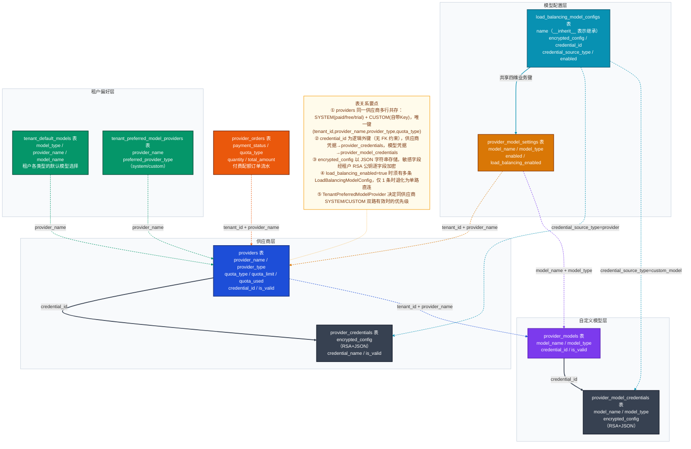

# Dify 模型供应商域数据模型深度解析

> 版本：Dify 1.13.0 | 主要源文件：`api/models/provider.py` | 服务层：`api/core/provider_manager.py`、`api/core/entities/provider_configuration.py`

---

## 一、域总览

### 表清单

| 表名 | Python 类 | 一句话职责 |
|------|-----------|-----------|
| `providers` | `Provider` | 租户维度的供应商实例；区分系统托管（SYSTEM）与自定义（CUSTOM）两路，每路按配额类型独立存行 |
| `provider_credentials` | `ProviderCredential` | 供应商级加密凭据存储（整个供应商共用一个 API Key 的场景） |
| `provider_models` | `ProviderModel` | 租户在某供应商下手动添加的**自定义模型**列表（如私有部署的 Ollama 模型） |
| `provider_model_credentials` | `ProviderModelCredential` | 自定义模型级加密凭据存储（每个模型独立持有凭据的场景） |
| `provider_model_settings` | `ProviderModelSetting` | 模型维度的运行开关：`enabled`（是否启用）和 `load_balancing_enabled`（是否开启负载均衡） |
| `load_balancing_model_configs` | `LoadBalancingModelConfig` | 负载均衡候选配置，每行一条候选 Key/端点，`name='__inherit__'` 表示继承主凭据 |
| `tenant_default_models` | `TenantDefaultModel` | 租户在各模型类型（LLM、Embedding 等）下的默认模型选择 |
| `tenant_preferred_model_providers` | `TenantPreferredModelProvider` | 租户对某供应商优先使用 SYSTEM 托管还是 CUSTOM 自带 Key 的偏好记录 |
| `provider_orders` | `ProviderOrder` | 托管配额的付费订单记录（purchased quota 购买流水，边缘表） |

### 核心结论

**设计决策一：同一供应商可存多行，以唯一键区分路线**

`providers` 表唯一约束为 `(tenant_id, provider_name, provider_type, quota_type)`。同一租户的同一供应商（如 `openai`）可同时存在：
- `provider_type=system, quota_type=trial`（官方试用配额）
- `provider_type=system, quota_type=paid`（付费托管配额）
- `provider_type=custom, quota_type=''`（用户自带 API Key）

三行共存，运行时由 `TenantPreferredModelProvider` + 配额剩余量动态决策走哪路。

**设计决策二：凭据不存 ORM 外键，通过 `credential_id` 逻辑解耦**

`Provider.credential_id` 和 `ProviderModel.credential_id` 均为逻辑外键（无 `ForeignKey` 约束），通过 `@cached_property` 在运行时查询 `ProviderCredential` / `ProviderModelCredential`。凭据本体以 RSA 加密 JSON 存在独立表中，与业务元数据彻底隔离。

---

## 二、核心数据模型详解

### 2.1 `providers` 表（Provider）

供应商域的**主表**，一行代表租户对某供应商的一种接入方式。

| 核心字段 | 类型 | 设计含义 |
|---------|------|---------|
| `tenant_id` | UUID | 多租户隔离的根键，所有查询必带 |
| `provider_name` | String(255) | 供应商标识符，如 `"openai"`、`"anthropic"`（小写 slug） |
| `provider_type` | String(40) | `"system"`（官方托管）/ `"custom"`（用户自带 Key），对应 `ProviderType` 枚举 |
| `quota_type` | String(40) | 托管路专用：`"paid"` / `"free"` / `"trial"`；自定义路为空字符串 |
| `quota_limit` | BigInteger | 配额上限（Token 数），SYSTEM 路有意义，CUSTOM 路为 NULL |
| `quota_used` | BigInteger | 已消耗配额，服务层原子更新，防超额 |
| `credential_id` | UUID | 逻辑外键，指向 `provider_credentials.id`；CUSTOM 路必填，SYSTEM 路为 NULL |
| `is_valid` | Boolean | 凭据有效性标志，最近一次调用失败会置 `false` |

**为什么 `quota_type` 不是枚举类型？** 历史上曾扩展过配额种类，字符串类型保留了向后扩展空间；运行时通过 `ProviderQuotaType` Python 枚举做值验证。

### 2.2 `provider_credentials` / `provider_model_credentials` 表

两张表结构高度相似，职责不同：

| 字段 | `ProviderCredential`（供应商级） | `ProviderModelCredential`（模型级） |
|------|------|------|
| 核心业务键 | `provider_name` | `provider_name` + `model_name` + `model_type` |
| `encrypted_config` | LongText（必填）：完整凭据 JSON，各敏感字段已 RSA 加密 | 同左 |
| `credential_name` | String，可空，用于前端显示 | 同左 |

**加密流程**：写入时，凭据 dict 中每个敏感字段（如 `api_key`）调用 `encrypter.encrypt_token(tenant_id, value)` ——用该租户的 RSA 公钥加密后 base64 编码——再将整个 dict 序列化为 JSON 字符串存入 `encrypted_config`。读取时逐字段解密。

### 2.3 `provider_model_settings` 表（ProviderModelSetting）

以 `(tenant_id, provider_name, model_name, model_type)` 为业务主键，控制**单个模型**在租户下的运行行为。

| 字段 | 设计含义 |
|------|---------|
| `enabled` | 是否允许调用；`false` 时即使有凭据也拒绝路由 |
| `load_balancing_enabled` | `true` 时激活 `load_balancing_model_configs` 中的多路候选 |

`model_type` 写入值来自 `ModelType.to_origin_model_type()`，不是 Python 枚举名：

| Python `ModelType` | 数据库存储值 |
|-------------------|-------------|
| `LLM` | `"text-generation"` |
| `TEXT_EMBEDDING` | `"embeddings"` |
| `RERANK` | `"rerank"` |
| `SPEECH2TEXT` | `"speech2text"` |
| `TTS` | `"tts"` |
| `MODERATION` | `"moderation"` |

### 2.4 `load_balancing_model_configs` 表（LoadBalancingModelConfig）

每行代表负载均衡池中的**一个候选凭据**，与 `ProviderModelSetting` 共享 `(tenant_id, provider_name, model_name, model_type)` 复合维度。

| 字段 | 设计含义 |
|------|---------|
| `name` | 候选配置的人类可读名称；特殊值 `"__inherit__"` 表示复用当前供应商/模型的主凭据 |
| `encrypted_config` | 同供应商凭据，RSA 加密 JSON；`name='__inherit__'` 时可为 NULL |
| `credential_id` | 指向 `provider_credentials` 或 `provider_model_credentials`；通过 `credential_source_type` 区分 |
| `credential_source_type` | `"provider"`（来自供应商凭据）/ `"custom_model"`（来自模型级凭据）/ NULL（直接存在 `encrypted_config`） |
| `enabled` | 单条候选开关；未删除但可暂停单路 |

**路由逻辑**：`ProviderManager` 装配时，仅当某模型的 `LoadBalancingModelConfig` **超过 1 条**才启用负载均衡路由，否则退化为单路直连。

### 2.5 `tenant_preferred_model_providers` 表（TenantPreferredModelProvider）

记录租户对某供应商的**SYSTEM vs CUSTOM 路线偏好**。

当系统托管（SYSTEM）和用户自带 Key（CUSTOM）同时有效时，`preferred_provider_type` 决定优先走哪路。运行时 `ProviderManager` 读取此字段后，结合各路有效性最终确定 `using_provider_type`（实际调用走哪路）。

---

## 三、完整数据模型关系图



---

## 四、关键设计决策

### 决策一：供应商多行共存，以四元唯一键区分路线

**场景描述**：Dify 同时支持官方托管模型（用户无需自备 Key，消耗平台配额）和用户自带 API Key 两种接入方式，同一供应商需两路并存。

**选择方案**：`providers` 表的唯一约束为 `(tenant_id, provider_name, provider_type, quota_type)`，允许同一供应商在同一租户下写入多行。

**设计理由**：
- `provider_type=system` 的行由平台批量写入，无需用户操作；`provider_type=custom` 的行由用户配置触发。
- `quota_type` 进一步区分 `paid`/`free`/`trial` 三档托管配额，每档配额上限不同，独立计量。
- 运行时 `ProviderManager._choice_current_using_quota_type()` 按 **paid → free → trial** 优先级选择当前有效配额行。

**代价与权衡**：查询供应商配置需聚合多行（而非单行 JOIN），服务层 `ProviderManager.get_configurations()` 承担了较重的内存聚合逻辑，增加了代码复杂度。

---

### 决策二：凭据独立表 + 逻辑外键 + RSA 加密

**场景描述**：凭据（API Key、Secret 等）属于高敏感数据，需要与业务元数据隔离存储，且在多租户环境下每个租户的密钥应相互不可见。

**选择方案**：凭据单独存入 `provider_credentials` / `provider_model_credentials` 表，通过**逻辑外键**（`credential_id`，无 DB 层 `ForeignKey` 约束）与 `providers` / `provider_models` 关联；`encrypted_config` 字段存储整个凭据 JSON，其中每个敏感字段用**租户专属 RSA 公钥**逐字段加密后再序列化。

**设计理由**：
- ORM 层解耦：凭据表可单独授权、单独备份，主表查询不自动 JOIN 凭据内容（防止日志泄漏）。
- 租户级 RSA 密钥对：平台只持有私钥，即使数据库被拖库，攻击者无法批量解密跨租户凭据。
- `@cached_property` 懒加载：`Provider.credential` 属性仅在业务代码主动访问时才查询凭据行，正常列表接口路径不触发解密。

**代价与权衡**：无 FK 约束意味着孤儿凭据行需要靠业务逻辑（删除供应商时手动清理 `credential_id`）而非数据库级联来维护，增加了数据一致性的维护成本。

---

### 决策三：负载均衡采用"候选行列表 + 开关分离"模型

**场景描述**：高并发场景下需要对同一模型配置多个 API Key 轮转调用（规避单 Key 的 RPM 限制），同时要支持单路/多路的灵活切换。

**选择方案**：
- `ProviderModelSetting.load_balancing_enabled` 作为开关（Boolean）；
- `load_balancing_model_configs` 存储候选配置列表，每行一条；
- 特殊名称 `__inherit__` 允许其中一条复用主凭据，无需重复填写。
- 服务层仅当候选行**超过 1 条**时才激活轮转，否则退化为单路直连。

**设计理由**：开关与候选列表分离，使得"配置好多路但暂时关闭"和"启用负载均衡"成为两个独立操作，降低误操作风险。`__inherit__` 占位行让"主凭据也参与轮转"的语义可表达，而不需要在主凭据表冗余写一份。

**代价与权衡**：`credential_source_type` 字段需要与 `credential_id` 配合才能确定凭据来源，多了一层间接性；`NULL` 的 `credential_source_type` 也是合法状态（凭据直接在 `encrypted_config`），三种凭据来源方式增加了读取逻辑的分支。

---

## 五、典型业务场景数据流

### 场景一：用户首次配置 OpenAI 自定义 API Key

**触发操作**：用户在「模型供应商」页面输入 OpenAI API Key 并点击保存。

**数据写入流程**：

```
1. 校验凭据（调用 OpenAI 接口验证 Key 有效性）
   │
2. 写入 provider_credentials 表
   ├── encrypted_config = JSON{ "openai_api_key": RSA_encrypt(api_key) }
   └── 返回新生成的 credential_id（UUID）
   │
3. 写入或更新 providers 表
   ├── provider_name = "openai"
   ├── provider_type = "custom"（ProviderType.CUSTOM）
   ├── quota_type = ""（自定义路无配额概念）
   ├── credential_id = 上步返回的 credential_id
   └── is_valid = True
   │
4. （可选）若为首次配置该供应商，写入 tenant_preferred_model_providers
   └── preferred_provider_type = "custom"
```

**状态变化**：`providers.is_valid` 从 `False`（或新建行）变为 `True`；此后 `ProviderManager` 查询该租户配置时，`using_provider_type` 将优先选择 CUSTOM 路。

---

### 场景二：为 GPT-4o 开启负载均衡（双 Key 轮转）

**触发操作**：用户在模型设置页面为 `gpt-4o (LLM)` 开启负载均衡，并添加两个候选 Key 配置。

**数据写入流程**：

```
1. 写入/更新 provider_model_settings 表
   ├── model_name = "gpt-4o"
   ├── model_type = "text-generation"（ModelType.LLM.to_origin_model_type()）
   └── load_balancing_enabled = True
   │
2. 写入第一条 load_balancing_model_configs 行
   ├── name = "__inherit__"（复用主供应商 API Key 参与轮转）
   ├── encrypted_config = NULL
   ├── credential_id = providers.credential_id（主凭据 ID）
   └── credential_source_type = "provider"
   │
3. 写入第二条 load_balancing_model_configs 行
   ├── name = "备用Key-1"（用户自命名）
   ├── encrypted_config = JSON{ "openai_api_key": RSA_encrypt(second_key) }
   ├── credential_id = NULL
   └── credential_source_type = NULL
   │
4. 运行时 ProviderManager 装配
   └── 读取该模型的 LoadBalancingModelConfig 列表（2 条 > 1 条）
       → 激活轮转路由，按轮询或加权策略分发请求
```

**状态变化**：`provider_model_settings.load_balancing_enabled` 置 `True`；后续对该模型的调用请求在两条候选配置间轮转，`providers.quota_used` 分别累加各路实际消耗。

---

## 六、域边界与跨域关联

| 关联方向 | 关联方式 | 说明 |
|---------|---------|------|
| → **应用域**（`apps`） | 逻辑关联（无 FK） | `AppModelConfig.model` JSON 字段存储 `provider_name + model_id + model_type`，运行时从供应商域读取实际凭据 |
| → **工作流域**（`workflow_runs`） | 逻辑关联 | 工作流节点执行时调用 LLM，通过 `ProviderManager` 查凭据，执行结果写回工作流域，不反向写供应商表 |
| → **账户/租户域**（`tenants`） | `tenant_id` 逻辑外键 | 所有供应商表均以 `tenant_id` 隔离；加密使用 `Tenant.encrypt_public_key` |
| ← **知识库域**（`datasets`） | 逻辑关联 | 向量化/重排需要调用 Embedding/Rerank 模型，经供应商域路由，无反向写入 |
