# Dify 数据域深度分析 —— 工具域（Tools & Plugin）

> 基于 Dify 1.13.0 源码分析，覆盖 `api/models/tools.py` 全部模型类及相关服务层逻辑。

---

## 一、域总览

### 表清单

| 表名 | Python 类名 | 一句话职责 |
|------|------------|-----------|
| `tool_builtin_providers` | `BuiltinToolProvider` | 内置工具供应商的**租户级凭据配置**（存储每个租户配置的 API Key） |
| `tool_api_providers` | `ApiToolProvider` | 用户**自定义 API 工具供应商**，通过 OpenAPI/Swagger Schema 定义 |
| `tool_workflow_providers` | `WorkflowToolProvider` | 将 Workflow **发布为可复用工具**，供 Agent 节点或其他 App 调用 |
| `tool_mcp_providers` | `MCPToolProvider` | **MCP（Model Context Protocol）**外部服务器工具供应商（2025年新增） |
| `tool_label_bindings` | `ToolLabelBinding` | 工具**分类标签**绑定，支持搜索/图片/天气/金融等多维标签 |
| `tool_model_invokes` | `ToolModelInvoke` | 工具调用大模型的**计费日志**（token 消耗与费用记录） |
| `tool_files` | `ToolFile` | 工具和工作流执行中产生的**文件元数据**（非文件本体，文件存对象存储） |
| `tool_oauth_system_clients` | `ToolOAuthSystemClient` | **平台级** OAuth 客户端参数（系统统一配置，经过验证的插件可用） |
| `tool_oauth_tenant_clients` | `ToolOAuthTenantClient` | **租户级** OAuth 客户端参数（租户自定义 OAuth 应用配置） |
| `tool_conversation_variables` | `ToolConversationVariables` | **已废弃** — 原工具跨调用会话变量存储，已被 ConversationVariable 取代 |
| `tool_published_apps` | `DeprecatedPublishedAppTool` | **已废弃** — 旧版 App 发布为工具的记录，已被 WorkflowToolProvider 取代 |

### 核心结论

**决策一：4 种供应商类型 × 独立表存储**
Dify 工具域同时维护 4 张独立的供应商表（builtin / api / workflow / mcp），每种类型有差异巨大的字段结构，选择独立表而非单表多态，体现了"宁可冗余，不要强行统一"的数据建模哲学。

**决策二：工具定义内嵌 JSON，不单独建表**
`ApiToolProvider.tools_str`、`MCPToolProvider.tools`、`WorkflowToolProvider.parameter_configuration` 均将工具详细定义序列化为 JSON 字段，而非拆分为独立的 `tool_definitions` 表。这是有意为之的"文档存储"模式——工具定义是供应商的附属物，生命周期完全绑定，无需独立索引和查询。

---

## 二、核心数据模型详解

### 2.1 BuiltinToolProvider — 内置工具供应商凭据

**表名**：`tool_builtin_providers`

内置工具（如 Google Search、Bing、DALL-E）在代码中已有完整实现，不需要用户定义行为逻辑。该表仅存储每个租户对这些内置工具**配置了几套凭据**。

| 核心字段 | 类型 | 设计含义 |
|---------|------|---------|
| `tenant_id` | UUID | 租户隔离键；同一工具可被不同租户各自配置 |
| `provider` | String(256) | 内置工具名称，格式为 `organization/plugin_name/provider_name`（如 `langgenius/google/google`）|
| `name` | String(256) | 凭据实例名称（同一租户可配多套，如"API KEY 1"、"API KEY 2"） |
| `encrypted_credentials` | LongText | JSON 加密存储的凭据（如 `{"api_key": "sk-xxx"}`）|
| `credential_type` | String(32) | 凭据类型：`api-key`（默认）或 `oauth2` |
| `expires_at` | BigInteger | OAuth Token 过期时间戳；`-1` 表示永不过期（API Key 模式）|
| `is_default` | Boolean | 是否为该供应商的默认凭据实例 |

**设计意图**：`name` + `tenant_id` + `provider` 的联合唯一约束，允许同一租户为同一工具注册多套凭据（多账号轮换使用），而不是覆盖。

---

### 2.2 ApiToolProvider — 自定义 API 工具供应商

**表名**：`tool_api_providers`

用户上传 OpenAPI/Swagger/OpenAI Plugin 格式的 Schema，Dify 解析后生成工具供 Agent 调用。整个工具集作为一个"供应商"整体管理。

| 核心字段 | 类型 | 设计含义 |
|---------|------|---------|
| `tenant_id` | UUID | 租户隔离，工具只在本租户可用 |
| `schema` | LongText | 原始 Schema 文本（完整保留，方便用户后续编辑）|
| `schema_type_str` | String(40) | Schema 格式类型：`openapi` / `swagger` / `openai_plugin` / `openai_actions` |
| `tools_str` | LongText | 解析后的工具定义 JSON 数组（`ApiToolBundle` 的序列化）|
| `credentials_str` | LongText | 认证凭据 JSON（`auth_type`, `api_key` 等）|
| `description` | LongText | 供应商描述，展示给用户和 LLM |
| `privacy_policy` | String(255) | 隐私政策 URL（可选）|

**设计意图**：`schema`（原文）与 `tools_str`（解析结果）双写，前者用于展示/再编辑，后者用于运行时调用。解析结果不是懒加载，而是在创建/更新时预计算并持久化，避免每次运行时重新解析 Schema。

---

### 2.3 WorkflowToolProvider — 工作流即工具

**表名**：`tool_workflow_providers`

核心设计：将一个 Workflow 类型的 App **包装为可复用工具**，其他 Agent/Workflow 可以像调用内置工具一样调用它，实现工具的模块化组合。

| 核心字段 | 类型 | 设计含义 |
|---------|------|---------|
| `app_id` | UUID | 关联 `apps` 表，指向被封装的 Workflow App |
| `version` | String(255) | **绑定工作流版本**，记录发布时的 workflow version 字符串 |
| `name` | String(255) | 工具名称（对外暴露的标识符） |
| `label` | String(255) | 工具展示名（供 UI 和 LLM 理解）|
| `parameter_configuration` | LongText | JSON：工具参数配置数组（`WorkflowToolParameterConfiguration` 列表）|
| `description` | LongText | 工具功能描述，直接暴露给 LLM 做 tool selection |
| `tenant_id` | UUID | 租户隔离键，工具只在本租户可用 |

**设计意图**：`app_id` 与 `tenant_id` 的双唯一约束（`unique_workflow_tool_provider_app_id`）保证**一个 App 只能发布一次工具**。`version` 记录发布时刻的快照版本，但工具调用时实际执行的是 App 的**当前生产版本**（非版本锁定），`version` 更多是用于检测"工具定义是否需要同步更新"的版本对齐检查。

---

### 2.4 MCPToolProvider — MCP 协议工具

**表名**：`tool_mcp_providers`（2025年6月新增）

支持 [Model Context Protocol](https://modelcontextprotocol.io/) 标准，通过 SSE 或 Streamable HTTP 连接外部 MCP 服务器，动态获取工具能力。

| 核心字段 | 类型 | 设计含义 |
|---------|------|---------|
| `server_url` | LongText | MCP 服务器地址（加密存储，防止 SSRF 攻击）|
| `server_url_hash` | String(64) | URL 的 SHA 哈希，用于唯一性校验（不能直接在加密字段上建唯一索引）|
| `server_identifier` | String(64) | 服务器唯一标识（用于工具调用路由，而非 URL）|
| `authed` | Boolean | 是否已完成 OAuth 认证，未认证的 MCP 服务器不可调用 |
| `tools` | LongText | JSON：从 MCP 服务器同步的工具列表（缓存快照）|
| `encrypted_credentials` | LongText | OAuth Token 等认证凭据（加密存储）|
| `encrypted_headers` | LongText | 自定义 HTTP 请求头（加密存储，如 Bearer Token）|
| `timeout` | Float | 工具调用超时时间（默认 30s）|
| `sse_read_timeout` | Float | SSE 流读取超时（默认 300s，处理长时间运行的工具）|

**设计意图**：`server_url_hash` 作为唯一性约束代理字段是典型的"加密字段唯一性"解法——加密字段的密文不同（即使明文相同），无法直接建唯一索引，改用对**明文 URL**的哈希值建唯一约束。`tools` 字段是远程工具列表的本地缓存，通过"连接时刷新"保持同步，避免每次调用都需要先 List Tools。

---

### 2.5 ToolFile — 工具/工作流执行文件元数据

**表名**：`tool_files`

> 注：代码注释原文："This table stores file metadata generated in workflows, **not only files created by agent**." 

该表在命名上属于"工具域"，但实际上已成为**整个平台的工作流文件元数据存储**，文件本体存对象存储（S3/OSS），此表存文件引用与属主信息。

| 核心字段 | 类型 | 设计含义 |
|---------|------|---------|
| `file_key` | String(255) | 对象存储中的文件路径 Key |
| `mimetype` | String(255) | 文件 MIME 类型（决定前端渲染方式）|
| `conversation_id` | UUID（可空）| 归属的会话 ID；工作流任务场景下可为 NULL |
| `original_url` | String(2048) | 原始来源 URL（如通过 URL 输入的文件）|
| `tenant_id` | UUID | 租户隔离键 |
| `size` | Integer | 文件大小（字节，-1 表示未知）|

---

## 三、完整数据模型关系图

```mermaid
flowchart TB
    classDef builtinStyle fill:#1d4ed8,stroke:#1e3a8a,stroke-width:2.5px,color:#fff
    classDef apiStyle     fill:#7c3aed,stroke:#5b21b6,stroke-width:2px,color:#fff
    classDef wfStyle      fill:#0891b2,stroke:#155e75,stroke-width:2px,color:#fff
    classDef mcpStyle     fill:#059669,stroke:#064e3b,stroke-width:2px,color:#fff
    classDef oauthStyle   fill:#d97706,stroke:#92400e,stroke-width:2px,color:#fff
    classDef utilStyle    fill:#374151,stroke:#111827,stroke-width:2px,color:#fff
    classDef extStyle     fill:#6b7280,stroke:#374151,stroke-width:1.5px,color:#fff
    classDef noteStyle    fill:#fffbeb,stroke:#f59e0b,stroke-width:1.5px,color:#78350f
    classDef layerStyle   fill:#f8fafc,stroke:#cbd5e0,stroke-width:1.5px
    classDef deprecStyle  fill:#e5e7eb,stroke:#9ca3af,stroke-width:1px,color:#6b7280

    subgraph BUILTIN["内置工具层（Builtin Tool）"]
        direction LR
        BTP["tool_builtin_providers<br>tenant_id / provider<br>name / encrypted_credentials<br>credential_type / expires_at"]:::builtinStyle
    end
    class BUILTIN layerStyle

    subgraph CUSTOM["自定义 API 工具层（Custom API Tool）"]
        ATP["tool_api_providers<br>tenant_id / name<br>schema / schema_type_str<br>tools_str / credentials_str"]:::apiStyle
    end
    class CUSTOM layerStyle

    subgraph WORKFLOW["工作流即工具层（Workflow as Tool）"]
        WTP["tool_workflow_providers<br>tenant_id / app_id<br>name / version<br>parameter_configuration"]:::wfStyle
    end
    class WORKFLOW layerStyle

    subgraph MCP["MCP 协议工具层（Model Context Protocol）"]
        direction LR
        MCPTP["tool_mcp_providers<br>tenant_id / server_identifier<br>server_url / server_url_hash<br>authed / tools / encrypted_credentials"]:::mcpStyle
    end
    class MCP layerStyle

    subgraph OAUTH["OAuth 认证层"]
        direction LR
        OASYS["tool_oauth_system_clients<br>plugin_id / provider<br>encrypted_oauth_params"]:::oauthStyle
        OATEN["tool_oauth_tenant_clients<br>tenant_id / plugin_id / provider<br>encrypted_oauth_params / enabled"]:::oauthStyle
    end
    class OAUTH layerStyle

    subgraph UTIL["辅助层"]
        direction LR
        LBD["tool_label_bindings<br>tool_id / tool_type<br>label_name"]:::utilStyle
        TMI["tool_model_invokes<br>tenant_id / provider / tool_name<br>prompt_tokens / total_price"]:::utilStyle
        TF["tool_files<br>tenant_id / file_key<br>conversation_id / mimetype"]:::utilStyle
    end
    class UTIL layerStyle

    subgraph DEPRECATED["已废弃（Deprecated）"]
        direction LR
        TCV["tool_conversation_variables<br>@deprecated"]:::deprecStyle
        TPAT["tool_published_apps<br>@deprecated"]:::deprecStyle
    end
    class DEPRECATED layerStyle

    APPS["apps 表<br>（工具域外）"]:::extStyle
    TENANT["tenants 表<br>（工具域外）"]:::extStyle

    WTP -->|"app_id"| APPS
    BTP -.->|"tenant_id（逻辑关联）"| TENANT
    ATP -.->|"tenant_id（逻辑关联）"| TENANT
    WTP -.->|"tenant_id（逻辑关联）"| TENANT
    MCPTP -.->|"tenant_id（逻辑关联）"| TENANT

    BTP -.->|"OAuth 供应商 lookup"| OASYS
    BTP -.->|"OAuth 供应商 lookup"| OATEN
    MCPTP -.->|"认证状态写回"| OATEN

    BTP -.->|"tool_id（工具标签）"| LBD
    ATP -.->|"tool_id（工具标签）"| LBD
    WTP -.->|"tool_id（工具标签）"| LBD

    TMI -.->|"tenant_id + tool_name 关联"| BTP
    TF -.->|"conversation_id（可空）"| APPS

    NOTE["表关系要点<br>① WTP.app_id 是唯一的跨域强外键，将工具域与 App 域强绑定<br>② 四种供应商表无统一父表，通过 tool_type 字符串区分类型（扁平多态）<br>③ tool_label_bindings.tool_id 是跨表的逻辑 ID，不是数据库外键<br>④ server_url_hash 代替加密 server_url 作为唯一性约束代理字段<br>⑤ ToolFile 已超出 Agent 文件范畴，成为全平台工作流文件元数据表"]:::noteStyle
    NOTE -.- WTP

    %% 边索引：0-14，共 15 条
    linkStyle 0  stroke:#0891b2,stroke-width:2.5px
    linkStyle 1  stroke:#1d4ed8,stroke-width:1.5px,stroke-dasharray:4 3
    linkStyle 2  stroke:#7c3aed,stroke-width:1.5px,stroke-dasharray:4 3
    linkStyle 3  stroke:#0891b2,stroke-width:1.5px,stroke-dasharray:4 3
    linkStyle 4  stroke:#059669,stroke-width:1.5px,stroke-dasharray:4 3
    linkStyle 5  stroke:#d97706,stroke-width:1.5px,stroke-dasharray:4 3
    linkStyle 6  stroke:#d97706,stroke-width:1.5px,stroke-dasharray:4 3
    linkStyle 7  stroke:#059669,stroke-width:1.5px,stroke-dasharray:4 3
    linkStyle 8  stroke:#374151,stroke-width:1.5px,stroke-dasharray:4 3
    linkStyle 9  stroke:#374151,stroke-width:1.5px,stroke-dasharray:4 3
    linkStyle 10 stroke:#374151,stroke-width:1.5px,stroke-dasharray:4 3
    linkStyle 11 stroke:#374151,stroke-width:1px,stroke-dasharray:2 2
    linkStyle 12 stroke:#374151,stroke-width:1px,stroke-dasharray:2 2
    linkStyle 13 stroke:#f59e0b,stroke-width:1px,stroke-dasharray:2 2
```



---

## 四、关键设计决策

### 决策一：4 种供应商类型各用独立表，而非单表多态

**场景**：系统需要支持 builtin / api / workflow / mcp 四种差异极大的工具供应商类型，字段集合几乎没有重叠（builtin 关注凭据类型与过期，api 关注 Schema，workflow 关注 app_id 与参数映射，mcp 关注 SSE 连接参数）。

**选择方案**：每种类型独立建表，`ToolProviderType` 枚举在运行时区分类型，数据库层无统一父表。

**设计理由**：强行统一为单表会产生大量 nullable 字段（每行至少有 60% 字段为 NULL），违反范式且可读性差。查询时总是按单一类型查询，分表不存在跨表聚合的代价。

**代价与权衡**：管理层（`ToolManager.list_providers_from_api`）需要分别查询四张表再合并，增加了代码复杂度；新增第五种供应商类型需要迁移 + 新建表。

---

### 决策二：工具定义内嵌 JSON，不单独建 tool_definitions 表

**场景**：ApiToolProvider 的一个供应商对应多个工具端点（如一个 OpenAPI Spec 内含 20 个 endpoint），需要持久化所有工具定义。

**选择方案**：将解析后的工具定义序列化为 `tools_str`（JSON 数组）存入供应商行，而非拆分为独立 `tool_definitions` 表（每行一个工具）。

**设计理由**：工具定义的生命周期完全依附于供应商——供应商删除时全部工具同时删除，没有独立索引的业务需求。JSON 内嵌减少了 JOIN 操作，单次查询即可获取完整工具集。

**代价与权衡**：`tools_str` 可能存储大量数据（大型 Spec 可能有数十个工具），无法对单个工具做精确查询（只能加载全部工具后在内存中过滤）；更新单个工具定义需要反序列化整个数组、修改、再序列化写回。

---

### 决策三：server_url_hash 作为加密字段的唯一性约束代理

**场景**：MCPToolProvider 的 `server_url` 需要加密存储（防 SSRF，防日志泄露），同时需要保证同一租户不能重复添加同一 URL 的 MCP 服务器。

**选择方案**：额外存储 `server_url_hash`（SHA-256 哈希），在 `server_url_hash` 上建唯一约束，`server_url` 本身加密存储。

**设计理由**：对加密后的 ciphertext 建唯一索引无意义（相同明文每次加密结果不同）；对明文 URL 的哈希建索引，既保证唯一性，又不泄露明文内容（哈希不可逆）。

**代价与权衡**：系统需要在写入前对明文 URL 计算哈希，增加了一次哈希计算；如果哈希算法未来需要迁移，需要全表重算 `server_url_hash`。

---

## 五、典型业务场景数据流

### 场景一：租户配置并启用 Google Search 内置工具

```
1. 用户在界面输入 Google API Key
   └── POST /console/api/workspaces/current/tool-provider/builtin/{provider}/credentials
       └── BuiltinToolManageService.update_builtin_tool_provider()

2. 加密凭据并写入 tool_builtin_providers
   └── INSERT tool_builtin_providers
       ├── tenant_id = 当前租户
       ├── provider = "langgenius/google/google"
       ├── name = "API KEY 1"（或自动生成）
       ├── encrypted_credentials = encrypt({"api_key": "AIza..."})
       ├── credential_type = "api-key"
       └── expires_at = -1（永不过期）

3. 工具可被 Agent 节点发现并调用
   └── ToolManager.list_providers_from_api() 查询 tool_builtin_providers
       └── Agent 执行时通过 BuiltinToolProviderController 加载凭据
```

### 场景二：将 Workflow 发布为工具并在 Agent 中调用

```
1. 用户在工作流页面点击"发布为工具"
   └── POST /console/api/workspaces/current/tool-provider/workflow/create
       └── WorkflowToolManageService.create_workflow_tool()

2. 写入 tool_workflow_providers
   └── INSERT tool_workflow_providers
       ├── app_id = 被封装的 Workflow App ID    ← 跨域强外键
       ├── name = "my_workflow_tool"            ← Agent 调用时使用的工具标识
       ├── version = workflow.version           ← 记录发布时的工作流版本
       ├── parameter_configuration = JSON[...] ← 参数映射配置
       └── description = "工具功能描述"

3. Agent 调用此工具时
   └── WorkflowToolProviderController.get_tools() 读取 tool_workflow_providers
       └── 执行时加载 app.workflow（生产版本）运行
           └── 执行结果写入 tool_files（若有文件输出）

4. 工作流更新后，tool_workflow_providers.version 与 app.workflow.version 不一致
   └── 系统检测版本差异，提示用户更新工具参数配置
```

### 场景三：添加并认证 MCP 服务器

```
1. 用户添加 MCP Server URL
   └── POST /console/api/workspaces/current/tool-provider/mcp
       └── MCPToolManageService.create_provider()

2. 系统验证 URL 并连接 MCP 服务器
   └── MCPClientWithAuthRetry 尝试连接
       ├── 若服务器需要 OAuth → authed = false，引导用户授权
       └── 若直接连接成功   → 调用 MCP tools/list 获取工具列表

3. 写入 tool_mcp_providers
   └── INSERT tool_mcp_providers
       ├── server_url = encrypt(原始 URL)
       ├── server_url_hash = sha256(原始 URL)  ← 唯一性约束
       ├── server_identifier = "my-mcp-server"
       ├── authed = true（若认证完成）
       ├── tools = JSON[{name, description, inputSchema}]  ← 工具缓存
       └── encrypted_credentials = encrypt(oauth_tokens)

4. Agent 调用 MCP 工具时
   └── MCPToolProvider 读取 encrypted_credentials 解密
       └── 携带 Token 发起 SSE 请求到 server_url
           └── 工具调用结果返回 Agent
```

---

## 六、域边界说明

工具域与其他域的交互关系：

| 关联方向 | 关联内容 | 关联方式 |
|---------|---------|---------|
| 工具域 → App 域 | `WorkflowToolProvider.app_id` 引用 `apps.id` | 数据库外键强约束 |
| 工具域 ← 工作流域 | WorkflowNodeExecution 中的 tool 节点读取工具供应商 | 运行时逻辑关联，无 FK |
| 工具域 ← 对话域 | `ToolFile.conversation_id` 引用 `conversations.id` | 逻辑关联，无 FK 约束 |
| 工具域 ← 模型供应商域 | `ToolModelInvoke` 记录工具调用大模型的费用，不引用 provider 表 | 无关联 |
| 工具域 ← Plugin 系统 | Builtin 工具的 `provider` 字段格式遵循 `organization/plugin_name/provider_name` 路由规则 | 运行时约定，无表关联 |
