# Dify 边缘域数据模型深度解析

> 覆盖范围：`oauth.py` / `source.py` / `task.py` / `web.py` / `api_based_extension.py` / `trigger.py` / `human_input.py`
> 版本：Dify 1.13.0

---

## 一、域总览

### 表清单

| 子域 | 表名 | Python 类名 | 一句话职责 |
|------|------|-------------|-----------|
| 数据源授权 | `datasource_oauth_params` | `DatasourceOauthParamConfig` | 数据源插件的**系统级** OAuth 客户端参数 |
| 数据源授权 | `datasource_oauth_tenant_params` | `DatasourceOauthTenantParamConfig` | 数据源插件的**租户级** OAuth 客户端参数 |
| 数据源授权 | `datasource_providers` | `DatasourceProvider` | 租户已配置的数据源提供者实例（含加密凭据） |
| 数据源授权 | `data_source_oauth_bindings` | `DataSourceOauthBinding` | OAuth 访问令牌与数据源的绑定关系 |
| 数据源授权 | `data_source_api_key_auth_bindings` | `DataSourceApiKeyAuthBinding` | API Key 与数据源的绑定关系 |
| 异步任务 | `celery_taskmeta` | `CeleryTask` | Celery 任务的状态与执行结果快照 |
| 异步任务 | `celery_tasksetmeta` | `CeleryTaskSet` | Celery TaskSet（任务组）的聚合结果 |
| WebApp 交互 | `saved_messages` | `SavedMessage` | 终端用户收藏的消息记录 |
| WebApp 交互 | `pinned_conversations` | `PinnedConversation` | 终端用户置顶的对话记录 |
| API 扩展 | `api_based_extensions` | `APIBasedExtension` | 租户配置的外部 API 扩展端点（外部数据工具/内容审核） |
| 触发器 | `app_triggers` | `AppTrigger` | 应用触发器的统一管理入口（Webhook / 定时 / 插件） |
| 触发器 | `workflow_webhook_triggers` | `WorkflowWebhookTrigger` | Webhook 触发节点的 URL 绑定关系 |
| 触发器 | `workflow_plugin_triggers` | `WorkflowPluginTrigger` | 插件触发节点的订阅绑定关系 |
| 触发器 | `workflow_schedule_plans` | `WorkflowSchedulePlan` | 定时触发计划（Cron 表达式 + 时区 + 下次执行时间） |
| 触发器 | `trigger_subscriptions` | `TriggerSubscription` | 触发器插件的订阅实例（含凭证 + 端点） |
| 触发器 | `trigger_oauth_system_clients` | `TriggerOAuthSystemClient` | 触发器系统级 OAuth 客户端参数 |
| 触发器 | `trigger_oauth_tenant_clients` | `TriggerOAuthTenantClient` | 触发器租户级 OAuth 客户端参数 |
| 触发器 | `workflow_trigger_logs` | `WorkflowTriggerLog` | 触发器每次执行的完整记录（含 Celery 任务 ID） |
| 人工输入 | `human_input_forms` | `HumanInputForm` | 工作流 Human Input 节点的表单实例 |
| 人工输入 | `human_input_form_deliveries` | `HumanInputDelivery` | 表单的通知投递配置（邮件 / WebApp / 控制台） |
| 人工输入 | `human_input_form_recipients` | `HumanInputFormRecipient` | 每个投递对应的接收人及 access_token |

### 核心结论

**决策一：系统配置 + 租户覆盖的双层 OAuth 结构**
数据源和触发器都采用「系统级参数（`system_credentials` / `encrypted_oauth_params`）+ 租户级参数（`client_params` / `tenant_encrypted_oauth_params`）」的双层设计，系统层提供默认凭据，租户层可覆盖，两者通过 `(plugin_id, provider)` 或 `(tenant_id, plugin_id, provider)` 联合键区分。

**决策二：触发器类型的统一入口 + 专表扩展**
`app_triggers` 作为统一管理表，通过 `trigger_type` 区分三种触发类型（webhook / schedule / plugin），各类型对应独立的专表（`workflow_webhook_triggers` / `workflow_schedule_plans` / `workflow_plugin_triggers`），实现统一管理与差异化存储的平衡。

---

## 二、核心数据模型详解

### 2.1 数据源提供者：`datasource_providers`

| 字段 | 类型 | 设计含义 |
|------|------|---------|
| `tenant_id` | UUID | 多租户隔离，每个租户独立配置 |
| `provider` | String(128) | 数据源提供者标识（如 `notion`、`google_drive`） |
| `plugin_id` | String(255) | 所属插件，将数据源授权纳入插件体系 |
| `auth_type` | String(255) | 授权类型（`oauth` 或 `api_key`），决定凭证结构 |
| `encrypted_credentials` | JSON | 加密存储的完整凭据（Token / Key） |
| `expires_at` | Integer | Token 过期时间戳（-1 表示永不过期） |
| `is_default` | Boolean | 是否为该提供者的默认配置 |

**设计要点**：`(tenant_id, plugin_id, provider, name)` 四字段联合唯一约束，允许同一租户对同一提供者配置多个命名实例（如配置多个 Notion 账号）。

---

### 2.2 OAuth 绑定：`data_source_oauth_bindings` + `data_source_api_key_auth_bindings`

**`data_source_oauth_bindings`**：
- `access_token`：OAuth 访问令牌，明文存储
- `source_info`：JSON 结构的数据源元信息（如账号 ID、空间 ID），建有 JSON 索引
- `disabled`：软删除标志，Token 失效后设为 true 而不删除，保留历史

**`data_source_api_key_auth_bindings`**：
- `category`：分类标签（区分不同用途的 API Key）
- `credentials`：JSON 字符串（非加密），存储 API Key 的结构化信息
- 同样使用 `disabled` 软删除

---

### 2.3 Celery 任务：`celery_taskmeta`

| 字段 | 类型 | 设计含义 |
|------|------|---------|
| `task_id` | String(155) | Celery 原生任务 UUID，全局唯一 |
| `status` | String(50) | Celery 状态机（PENDING / STARTED / SUCCESS / FAILURE / RETRY） |
| `result` | BinaryData | 序列化的任务返回值（pickle / json），可为 NULL |
| `traceback` | LongText | 失败时的异常堆栈，用于排错 |
| `queue` | String(155) | 任务所在队列名，支持多队列路由 |
| `worker` | String(155) | 执行该任务的 Worker 标识 |

**设计要点**：该表是 Celery 框架的原生后端表（`django-celery-results` 风格），Dify 直接复用，不含任何业务字段——业务层通过 `celery_task_id` 字段与该表关联。

---

### 2.4 WebApp 交互：`saved_messages` + `pinned_conversations`

两张表结构高度对称，均包含：
- `app_id`：应用隔离
- `created_by_role`：操作人角色（`account` 或 `end_user`）
- `created_by`：操作人 UUID

**设计要点**：`created_by_role` 字段揭示了一个重要设计——同一张表同时服务内部用户（控制台账号）和外部终端用户（WebApp 访客），两类身份共用结构但语义不同，通过角色字段区分，避免建两套平行表。

---

### 2.5 应用触发器：`app_triggers` + 三个专表

**`app_triggers`** 是统一入口：
- `trigger_type`：枚举（`webhook` / `schedule` / `plugin`）
- `status`：枚举（`enabled` / `disabled` / `unauthorized` / `error`）
- `node_id`：关联到工作流的具体节点，触发后从该节点开始执行

三个专表通过 `(app_id, node_id)` 唯一约束与 `app_triggers` 对应：
- `workflow_webhook_triggers`：维护 `webhook_id` → URL 映射
- `workflow_schedule_plans`：存储 Cron 表达式 + 时区 + `next_run_at`
- `workflow_plugin_triggers`：存储 `provider_id` + `event_name` + `subscription_id`

---

### 2.6 触发器执行日志：`workflow_trigger_logs`

| 字段 | 类型 | 设计含义 |
|------|------|---------|
| `trigger_type` | EnumText | 触发类型，便于按类型聚合分析 |
| `trigger_data` | LongText(JSON) | 完整触发数据（含 inputs），用于回溯 |
| `inputs` | LongText(JSON) | 仅 inputs 字段，方便快速查看 |
| `status` | EnumText | 状态机（pending / running / succeeded / failed） |
| `celery_task_id` | String(255) | 关联 `celery_taskmeta` 的任务 ID，可追踪异步状态 |
| `retry_count` | Integer | 重试次数，支持幂等重试设计 |
| `workflow_run_id` | UUID | 关联工作流执行记录，可为 NULL（触发成功才有值） |

---

### 2.7 人工输入表单：`human_input_forms` → `human_input_form_deliveries` → `human_input_form_recipients`

三层结构：
- **Form（表单）**：绑定到 `workflow_run_id` 和 `node_id`，有 `expiration_time` 过期控制
- **Delivery（投递）**：一个 Form 可有多个投递渠道（邮件成员 / 外部邮件 / WebApp / 控制台）
- **Recipient（接收人）**：每个投递对应具体接收人，持有唯一 `access_token` 用于安全访问

**设计要点**：`access_token` 生成采用 22 字节随机字符串（base62，180+ bits 熵），提供足够的安全强度，接收人通过 Token 链接填写表单，无需登录。

---

## 三、完整数据模型关系图

```mermaid
flowchart TB
    classDef oauthStyle  fill:#1d4ed8,stroke:#1e3a8a,stroke-width:2.5px,color:#fff
    classDef taskStyle   fill:#d97706,stroke:#92400e,stroke-width:2px,color:#fff
    classDef webStyle    fill:#059669,stroke:#064e3b,stroke-width:2px,color:#fff
    classDef trigStyle   fill:#7c3aed,stroke:#5b21b6,stroke-width:2px,color:#fff
    classDef humanStyle  fill:#dc2626,stroke:#991b1b,stroke-width:2px,color:#fff
    classDef extStyle    fill:#0891b2,stroke:#155e75,stroke-width:2px,color:#fff
    classDef noteStyle   fill:#fffbeb,stroke:#f59e0b,stroke-width:1.5px,color:#78350f
    classDef layerStyle  fill:#f8fafc,stroke:#cbd5e0,stroke-width:1.5px

    subgraph OAUTH["数据源授权子域（oauth.py + source.py）"]
        direction LR
        OAUTH_PARAM["datasource_oauth_params<br>plugin_id / provider<br>system_credentials（系统级）"]:::oauthStyle
        OAUTH_TENANT["datasource_oauth_tenant_params<br>tenant_id / plugin_id<br>client_params / enabled（租户级）"]:::oauthStyle
        DS_PROVIDER["datasource_providers<br>tenant_id / provider / auth_type<br>encrypted_credentials / expires_at"]:::oauthStyle
        DS_OAUTH_BIND["data_source_oauth_bindings<br>tenant_id / provider<br>access_token / source_info"]:::oauthStyle
        DS_APIKEY_BIND["data_source_api_key_auth_bindings<br>tenant_id / provider / category<br>credentials / disabled"]:::oauthStyle
    end
    class OAUTH layerStyle

    subgraph TASK["异步任务子域（task.py）"]
        direction LR
        CELERY_TASK["celery_taskmeta<br>task_id / status / result<br>name / queue / worker"]:::taskStyle
        CELERY_TASKSET["celery_tasksetmeta<br>taskset_id / result<br>date_done"]:::taskStyle
    end
    class TASK layerStyle

    subgraph WEB["WebApp 交互子域（web.py）"]
        direction LR
        SAVED_MSG["saved_messages<br>app_id / message_id<br>created_by_role / created_by"]:::webStyle
        PINNED_CONV["pinned_conversations<br>app_id / conversation_id<br>created_by_role / created_by"]:::webStyle
    end
    class WEB layerStyle

    subgraph EXT["API 扩展子域（api_based_extension.py）"]
        API_EXT["api_based_extensions<br>tenant_id / name<br>api_endpoint / api_key"]:::extStyle
    end
    class EXT layerStyle

    subgraph TRIG["触发器子域（trigger.py）"]
        direction TB
        APP_TRIGGER["app_triggers<br>tenant_id / app_id / node_id<br>trigger_type / status"]:::trigStyle
        WEBHOOK_TRIG["workflow_webhook_triggers<br>app_id / node_id<br>webhook_id → 生成 URL"]:::trigStyle
        PLUGIN_TRIG["workflow_plugin_triggers<br>app_id / node_id / provider_id<br>event_name / subscription_id"]:::trigStyle
        SCHEDULE_PLAN["workflow_schedule_plans<br>app_id / node_id / cron_expression<br>timezone / next_run_at"]:::trigStyle
        TRIG_SUB["trigger_subscriptions<br>tenant_id / provider_id<br>endpoint_id / credential_type"]:::trigStyle
        TRIG_OAUTH_SYS["trigger_oauth_system_clients<br>plugin_id / provider<br>encrypted_oauth_params（系统级）"]:::trigStyle
        TRIG_OAUTH_TENANT["trigger_oauth_tenant_clients<br>tenant_id / plugin_id<br>encrypted_oauth_params / enabled（租户级）"]:::trigStyle
        WF_TRIG_LOG["workflow_trigger_logs<br>app_id / workflow_run_id<br>trigger_type / status / celery_task_id"]:::trigStyle
    end
    class TRIG layerStyle

    subgraph HUMAN["人工输入子域（human_input.py）"]
        direction LR
        HUMAN_FORM["human_input_forms<br>workflow_run_id / node_id<br>status / form_kind / expiration_time"]:::humanStyle
        HUMAN_DELIVERY["human_input_form_deliveries<br>form_id / delivery_method_type<br>delivery_config_id"]:::humanStyle
        HUMAN_RECIP["human_input_form_recipients<br>form_id / delivery_id<br>recipient_type / access_token"]:::humanStyle
    end
    class HUMAN layerStyle

    %% 数据源授权子域内部关系
    OAUTH_PARAM -.->|"系统级 OAuth 参数"| DS_PROVIDER
    OAUTH_TENANT -.->|"租户级 OAuth 参数"| DS_PROVIDER
    DS_OAUTH_BIND -.->|"OAuth Token 绑定"| DS_PROVIDER
    DS_APIKEY_BIND -.->|"API Key 绑定"| DS_PROVIDER

    %% 异步任务子域
    CELERY_TASKSET -.->|"包含多个任务"| CELERY_TASK

    %% 触发器子域内部关系
    APP_TRIGGER -->|"webhook 类型"| WEBHOOK_TRIG
    APP_TRIGGER -->|"plugin 类型"| PLUGIN_TRIG
    APP_TRIGGER -->|"schedule 类型"| SCHEDULE_PLAN
    TRIG_SUB -.->|"endpoint_id 关联"| WEBHOOK_TRIG
    TRIG_OAUTH_SYS -.->|"系统凭证供给"| TRIG_SUB
    TRIG_OAUTH_TENANT -.->|"租户凭证覆盖"| TRIG_SUB
    WF_TRIG_LOG -.->|"webhook 触发记录"| WEBHOOK_TRIG
    WF_TRIG_LOG -.->|"plugin 触发记录"| PLUGIN_TRIG
    WF_TRIG_LOG -.->|"schedule 触发记录"| SCHEDULE_PLAN

    %% 人工输入子域内部关系
    HUMAN_FORM -->|"包含投递渠道"| HUMAN_DELIVERY
    HUMAN_DELIVERY -->|"包含接收人"| HUMAN_RECIP

    %% 设计注记
    NOTE["表关系要点<br>① 数据源授权采用「系统级 + 租户级」双层结构，encrypted_credentials 加密存储，-1 表示永不过期<br>② Celery 任务表是框架原生表，不含业务字段，业务层通过 celery_task_id 字符串关联<br>③ WebApp 交互表（saved_messages / pinned_conversations）用 created_by_role 同时服务 account 和 end_user<br>④ 触发器子域以 app_triggers 为统一入口，trigger_type 分流到 3 张专表，WF_TRIG_LOG 记录每次执行<br>⑤ 人工输入 Form→Delivery→Recipient 三层结构支持多渠道通知（邮件/WebApp/控制台）并发分发"]:::noteStyle
    NOTE -.- APP_TRIGGER

    %% 边索引：0-16，共 17 条
    linkStyle 0,1,2,3 stroke:#1d4ed8,stroke-width:1.5px,stroke-dasharray:4 3
    linkStyle 4       stroke:#d97706,stroke-width:1.5px,stroke-dasharray:4 3
    linkStyle 5,6,7   stroke:#7c3aed,stroke-width:2.5px
    linkStyle 8       stroke:#7c3aed,stroke-width:1.5px,stroke-dasharray:4 3
    linkStyle 9,10    stroke:#7c3aed,stroke-width:1.5px,stroke-dasharray:4 3
    linkStyle 11,12,13 stroke:#7c3aed,stroke-width:1.5px,stroke-dasharray:4 3
    linkStyle 14,15   stroke:#dc2626,stroke-width:2.5px
    linkStyle 16      stroke:#f59e0b,stroke-width:1px,stroke-dasharray:2 2
```



---

## 四、关键设计决策

**决策一：系统 / 租户双层 OAuth 参数分离**

场景：数据源插件（如 Notion）需要 OAuth 接入，平台部署者拥有系统级 OAuth 应用，但各租户可能希望使用自己的 OAuth 应用（Client ID / Secret）。

选择方案：`datasource_oauth_params`（系统级）+ `datasource_oauth_tenant_params`（租户级）独立存表，通过 `(plugin_id, provider)` 联合键对应，`enabled` 字段控制是否启用租户自定义覆盖。

设计理由：分层存储避免系统配置被租户操作污染，且使租户可选择性覆盖，灵活兼顾 SaaS 多租户和私有部署场景。

代价与权衡：查询时需要合并两层配置（先看租户级、再兜底系统级），增加了服务层逻辑复杂度。

---

**决策二：触发器统一入口 + 专表扩展的分治结构**

场景：工作流支持 Webhook、定时（Cron）、插件三种触发方式，各自的配置数据差异巨大（URL vs Cron 表达式 vs 订阅 ID），无法统一字段。

选择方案：`app_triggers` 作为统一管理表，仅存共性字段（`trigger_type`、`status`、`node_id`），三种类型各维护一张专表，通过 `(app_id, node_id)` 唯一约束隐式关联。

设计理由：统一入口使 App 管理界面只需查一张表即可展示所有触发器状态；专表扩展保持各类型配置的清晰结构，避免大量 NULL 字段。

代价与权衡：查询触发器详情需 JOIN 或二次查询，`(app_id, node_id)` 的隐式关联而非 FK 约束，删除时需业务层维护一致性。

---

**决策三：Human Input 表单的三层通知架构**

场景：工作流执行到 Human Input 节点时，需要暂停等待人工审批，并通过多种渠道（邮件、WebApp、控制台）通知相关人员，不同渠道接收人不同。

选择方案：`HumanInputForm`（表单主体）→ `HumanInputDelivery`（每种渠道一条投递记录）→ `HumanInputFormRecipient`（每个接收人一条记录，持有独立 `access_token`）。

设计理由：三层分离使每个接收人持有独立 Token，实现单人唯一的安全访问链接，且支持多渠道并发投递，后续可扩展新通知渠道而不修改 Form 结构。

代价与权衡：三表 JOIN 增加查询复杂度；`access_token` 的生命周期管理与 Form 的 `expiration_time` 需同步，业务层须保证过期后 Token 失效。

---

## 五、典型业务场景数据流

### 场景一：配置并触发一次 Webhook 工作流

**准备阶段**（用户在控制台配置）：
1. 在工作流画布的触发节点，选择「Webhook 触发」，系统写入 `app_triggers`（`trigger_type=webhook`，`status=enabled`）
2. 同时生成唯一 `webhook_id`，写入 `workflow_webhook_triggers`，并通过 `webhook_id` 生成对外暴露的 URL

**触发阶段**（外部系统调用 Webhook URL）：
1. API 收到请求，查询 `workflow_webhook_triggers` 找到对应 `(app_id, node_id)`
2. 创建 `workflow_trigger_logs` 记录（`status=pending`，记录完整 `trigger_data`）
3. 将工作流执行任务投入 Celery 队列，`celery_task_id` 写回 `workflow_trigger_logs`
4. Celery Worker 开始执行，在 `celery_taskmeta` 中更新任务状态
5. 工作流执行完成后，`workflow_trigger_logs` 更新 `workflow_run_id`、`status=succeeded`、`elapsed_time`、`total_tokens`

**涉及的表写入顺序**：
```
workflow_webhook_triggers（配置时写入，不变）
  → workflow_trigger_logs（触发时写入，status: pending → running → succeeded）
  → celery_taskmeta（任务入队时写入，status: PENDING → STARTED → SUCCESS）
```

---

### 场景二：工作流 Human Input 节点等待人工审批（邮件通知）

**节点暂停阶段**：
1. 工作流执行到 Human Input 节点，暂停执行
2. 写入 `human_input_forms`（`status=waiting`，`form_kind=runtime`，设置 `expiration_time`，关联 `workflow_run_id` 和 `node_id`）

**通知分发阶段**：
1. 写入 `human_input_form_deliveries`（一条邮件投递记录，`delivery_method_type=email`）
2. 为每个收件人写入 `human_input_form_recipients`（生成唯一 `access_token`，`recipient_type=email_member` 或 `email_external`）
3. 发送邮件，附带包含 `access_token` 的链接

**提交阶段**（审批人点击链接）：
1. 系统用 `access_token` 查询 `human_input_form_recipients`，验证身份和表单有效期
2. 审批人提交表单，`human_input_forms` 更新：`status=completed`、`submitted_data`、`submitted_at`、`submission_user_id`、`completed_by_recipient_id`
3. 工作流恢复执行

**涉及的表写入顺序**：
```
human_input_forms（节点暂停时写入，status: waiting → completed）
  → human_input_form_deliveries（通知配置写入）
  → human_input_form_recipients（每个接收人独立写入，access_token 唯一）
```
