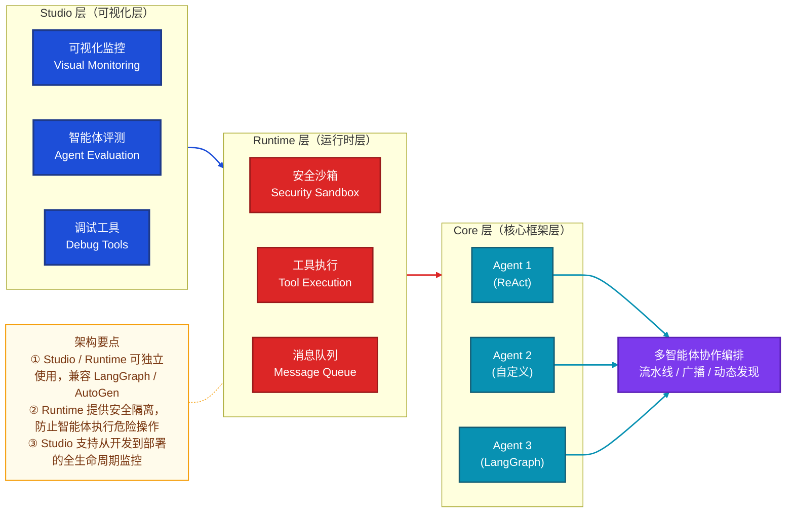
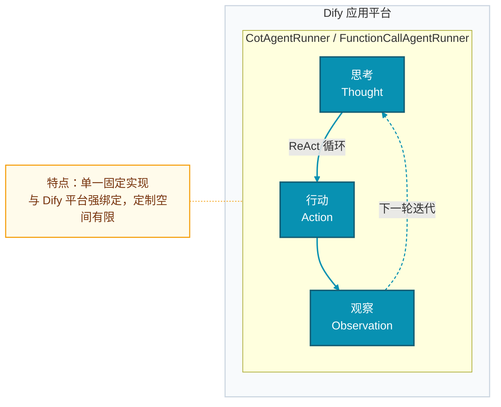
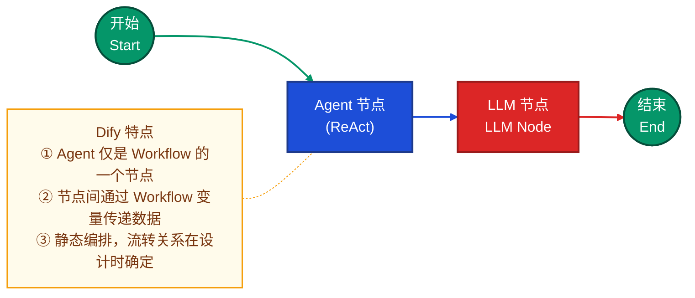
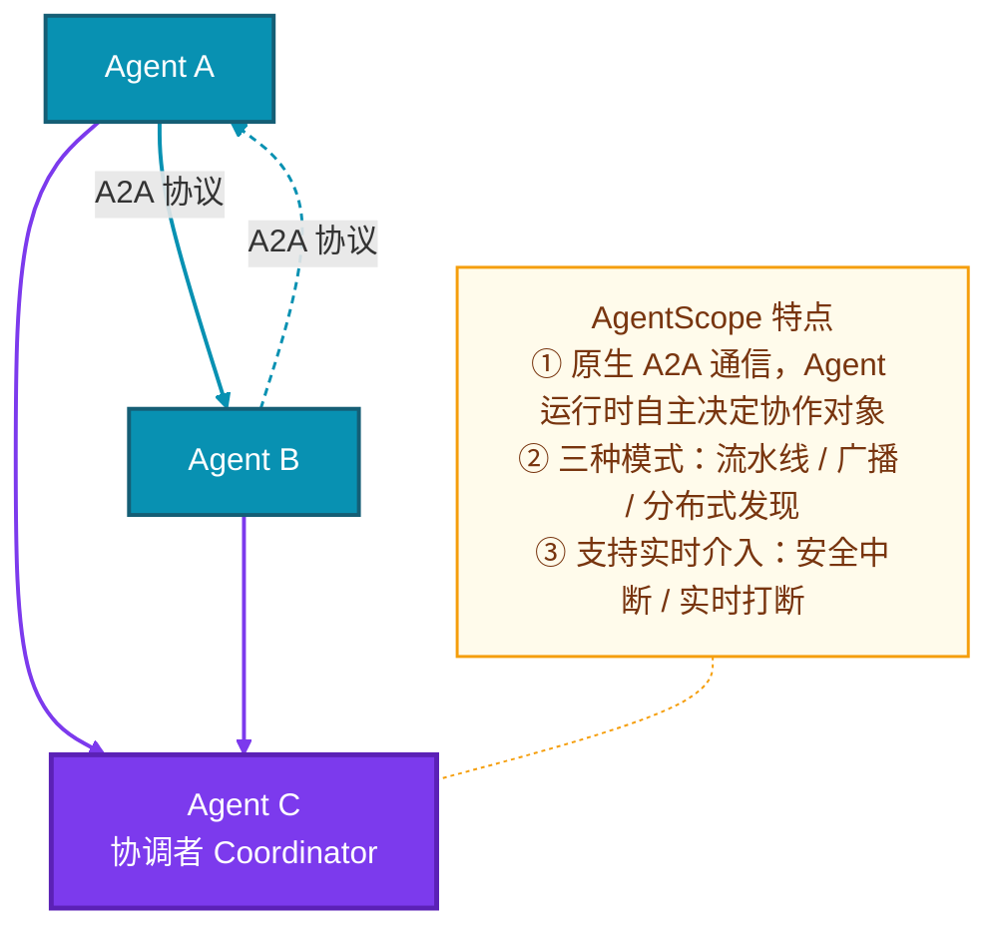

# AgentScope vs Dify 深度对比分析

> 面试视角的系统性梳理：为什么在多智能体场景下选择 AgentScope 而非 Dify，以及二者的核心架构差异。

---

## 一、为什么选择 AgentScope 而非 Dify

### 1.1 定位差异：多智能体协作 vs 低代码应用平台

| 维度 | Dify | AgentScope |
|------|------|------------|
| **核心定位** | 低代码 LLM 应用构建平台 | 企业级多智能体开发框架 |
| **设计目标** | 快速构建 AI 应用（聊天、工作流） | 解决多智能体协作的工程化难题 |
| **优势场景** | 单 Agent 应用、可视化工作流 | 多 Agent 协作、复杂任务分解 |

> **面试话术：**"Dify 是一个优秀的低代码应用平台，适合快速构建聊天机器人或简单工作流。但如果我们的目标是构建一个**多智能体协作平台**，AgentScope 是更合适的选择——它从设计之初就是为了解决多智能体间的通信、协作和管控问题。"

---

### 1.2 架构优势：三层可扩展架构

AgentScope 的三层技术架构自上而下分工明确，每层均可独立使用：

**关键优势：**
- **模块可独立使用**：Runtime 和 Studio 兼容 LangGraph、AutoGen 等主流框架
- **不是黑盒**：与 Dify 的"一键式"体验不同，AgentScope 给开发者更多控制权
- **企业级设计**：从开发到部署的全生命周期支持

> **面试话术：**"AgentScope 的三层架构非常适合作为智能体平台的基础。核心框架负责智能体逻辑，Runtime 提供安全运行环境，Studio 做可视化监控。而且这三层可以独立使用，甚至可以和 LangGraph、AutoGen 等其他框架混用，这给了我们极大的架构灵活性。"

---

### 1.3 多智能体协作能力

这是 AgentScope 最核心的差异化优势。Dify 的工作流是**静态编排**的，节点间关系在设计时就确定了；而 AgentScope 支持**动态协作**，Agent 可以在运行时自主决定与谁通信、如何协作。

**三大核心协作能力：**

1. **A2A (Agent-to-Agent) 通信协议**：标准化的 Agent 间通信机制，可结合 RocketMQ 等消息队列实现高可靠通信
2. **多种协作模式**：流水线协作、广播模式、分布式发现与调用
3. **实时介入控制**：安全中断、实时打断、灵活定制中断处理逻辑

> **面试话术：**"Dify 的工作流是静态的，节点流转在设计时就固定了。但在真正的多智能体场景中，我们需要 Agent 能够动态协作——比如一个任务分解 Agent 自主决定调用哪些子 Agent。AgentScope 的 A2A 协议和实时介入控制正是为这种场景设计的。"

---

### 1.4 记忆与上下文管理

| 维度 | Dify | AgentScope |
|------|------|------------|
| **记忆类型** | 主要是对话历史 | 短期记忆 + 长期记忆（ReMe） |
| **记忆范围** | 单 Agent 内部 | 个人、任务、工具级别的记忆分层 |
| **跨会话** | 有限（依赖 Dify 会话管理） | 原生支持跨会话记忆 |

AgentScope 的记忆体系：
- **短期记忆**：当前会话上下文高效管理
- **长期记忆（ReMe）**：解决"失忆"和"归零重启"问题，支持个人、任务、工具级别的记忆分层

> **面试话术：**"智能体平台的一个核心难题是记忆管理。Dify 主要依赖对话历史，而 AgentScope 集成了 ReMe 长期记忆实现，支持个人、任务、工具级别的记忆分层，这对构建有'长期记忆'的智能体至关重要。"

---

### 1.5 安全与可控性

| 能力 | 说明 |
|------|------|
| **安全工具沙箱** | 基于容器技术，确保智能体在隔离环境中运行 |
| **实时监控** | AgentScope Studio 提供实时监控和智能体评测 |
| **可观测性** | 完整的执行链路追踪 |

> **面试话术：**"企业级智能体平台必须考虑安全和可控性。AgentScope 的安全工具沙箱可以防止智能体执行危险操作，实时监控让我们随时了解每个 Agent 在做什么。这比 Dify 更适合生产环境。"

---

### 1.6 决策总结

**AgentScope 更适合的场景：**

| 需求 | 说明 |
|------|------|
| ✅ 多智能体协作 | 需要多个 Agent 分工协作 |
| ✅ 动态任务分解 | Agent 自主决定如何拆分和执行任务 |
| ✅ 企业级安全 | 需要安全沙箱、权限管控、实时监控 |
| ✅ 灵活架构 | 希望框架层、运行时、监控层可以独立演进 |
| ✅ 长期记忆 | 需要跨会话的记忆管理 |

**Dify 更适合的场景：**
- 快速构建单 Agent 聊天应用
- 可视化工作流编排
- 低代码、开箱即用的体验

> **一句话总结：**"我们选择 AgentScope 而非 Dify，是因为我们要构建的是一个**多智能体协作平台**，而不是一个低代码应用构建工具。AgentScope 在多智能体通信、记忆管理、安全可控性方面的设计，更符合我们对智能体平台的长期规划。"

---

## 二、Dify ReAct Agent vs AgentScope 深度对比

### 2.1 定位与范围

**类比说明：**
- Dify 的 ReAct Agent ≈ **一辆特定型号的汽车**（已经造好，直接开）
- AgentScope ≈ **汽车制造平台**（可以造各种车，还能组合成车队）

| 维度 | Dify 的 ReAct Agent | AgentScope |
|------|---------------------|------------|
| **本质定位** | 一个具体的 Agent 实现（ReAct 模式） | 一个多智能体开发框架 |
| **包含关系** | 是 Dify 平台中的一个功能模块 | 完整的框架，可独立使用，也可集成其他框架 |
| **使用场景** | 单 Agent 任务（推理-行动循环） | 多 Agent 协作、复杂任务编排 |

---

### 2.2 架构设计对比

#### Dify 的 ReAct Agent 架构

单一 ReAct 循环，固定嵌入 Dify 应用平台：

#### AgentScope 完整架构

三层可组合架构，支持多 Agent 并发协作（参见[第 1.2 节](#12-架构优势三层可扩展架构)的架构图）。

**关键区别：**
- Dify 的 ReAct Agent 是**单一、固定**的实现
- AgentScope 是**可组合、可扩展**的框架，同一运行时内可托管多种 Agent 实现并让它们相互协作

---

### 2.3 多智能体协作方式对比

#### Dify：通过 Workflow 静态编排

Agent 仅作为 Workflow 中的一个节点存在，协作关系在设计时静态确定：

#### AgentScope：原生 A2A 动态协作

Agent 之间通过标准化 A2A 协议直接通信，运行时自主决定协作对象：

---

### 2.4 灵活性与可控性

**Dify 的 ReAct Agent：**
- ✅ **优点**：开箱即用，简单易用
- ❌ **限制**：实现方式固定（CoT 或 Function Call）；难以深度定制 ReAct 循环逻辑；与 Dify 平台强绑定

**AgentScope：**
- ✅ **优点**：灵活（可使用 ReAct、LangGraph、AutoGen 或完全自定义 Agent）；可控（三层架构独立演进）；兼容（Runtime 和 Studio 可与其他框架混用）
- ❌ **门槛**：需要更多开发工作

---

### 2.5 记忆管理对比

| 维度 | Dify 的 ReAct Agent | AgentScope |
|------|---------------------|------------|
| **记忆类型** | 主要是对话历史 | 短期记忆 + 长期记忆（ReMe） |
| **记忆范围** | 单 Agent 内部 | 支持个人、任务、工具级别的记忆分层 |
| **跨会话** | 有限（依赖 Dify 的会话管理） | 原生支持跨会话记忆 |

---

### 2.6 核心结论

> **Dify 的 ReAct Agent 是一个具体的、开箱即用的 Agent 实现；而 AgentScope 是一个可以构建各种 Agent（包括但不限于 ReAct）并让它们协作的框架。**

---

### 2.7 面试回答示例

**面试官：AgentScope 和 Dify 的 ReAct Agent 有什么区别？**

> "这是个很好的问题。简单来说，两者不在同一个维度上：
>
> 1. **Dify 的 ReAct Agent** 是一个**具体的 Agent 实现**——它就是一个封装好的 ReAct 循环，你可以直接用，但定制空间有限。
>
> 2. **AgentScope** 是一个**多智能体开发框架**——它不仅能实现 ReAct Agent，还能实现其他类型的 Agent，更重要的是，它解决了多智能体协作的问题（A2A 通信、动态协作、安全沙箱等）。
>
> 打个比方：Dify 的 ReAct Agent 就像一辆已经造好的汽车，你可以直接开；而 AgentScope 是一个汽车制造平台，你可以造各种车，还能把它们组成车队。
>
> 如果我们的需求只是单 Agent 任务，Dify 的 ReAct Agent 足够；但如果要做多智能体协作平台，AgentScope 是更合适的基础。"
