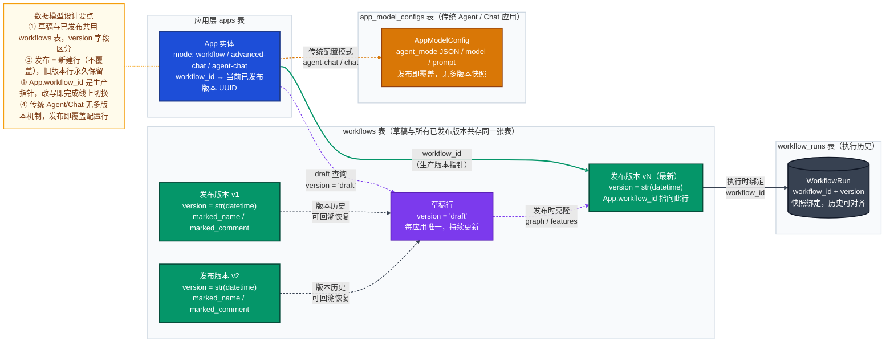

现在我有了足够的信息来撰写完整分析。让我整合成一篇带有 Mermaid 图表的深度文档。

这是完整分析：

---

## Dify Agent / Workflow 版本管理机制深度解析

---

### 一、两种应用类型的版本管理差异

Dify 在版本管理上根据应用类型分为**两套完全不同的机制**：

| 应用类型 | 模式标识 | 版本管理方式 | 核心表 |
|------|------|------|------|
| **工作流（Workflow）** | `workflow` | 多版本快照，发布即新建行 | `workflows` |
| **高级聊天（Chatflow）** | `advanced-chat` | 多版本快照，发布即新建行 | `workflows` |
| **传统 Agent Chat** | `agent-chat` | 单版本覆盖，无历史快照 | `app_model_configs` |
| **普通 Chat / Completion** | `chat` / `completion` | 单版本覆盖，无历史快照 | `app_model_configs` |

Workflow 和 Chatflow 是重点——它们使用了完整的**草稿 + 多版本快照**机制。

---

### 二、版本管理数据模型架构



**核心模型字段解析**（`api/models/workflow.py`）：

```102:168:api/models/workflow.py
class Workflow(Base):
    __tablename__ = "workflows"
    __table_args__ = (
        sa.PrimaryKeyConstraint("id", name="workflow_pkey"),
        sa.Index("workflow_version_idx", "tenant_id", "app_id", "version"),
    )

    id: Mapped[str] = mapped_column(StringUUID, default=lambda: str(uuid4()))
    tenant_id: Mapped[str] = mapped_column(StringUUID, nullable=False)
    app_id: Mapped[str] = mapped_column(StringUUID, nullable=False)
    type: Mapped[str] = mapped_column(String(255), nullable=False)
    version: Mapped[str] = mapped_column(String(255), nullable=False)
    marked_name: Mapped[str] = mapped_column(String(255), default="", server_default="")
    marked_comment: Mapped[str] = mapped_column(String(255), default="", server_default="")
    graph: Mapped[str] = mapped_column(LongText)

    VERSION_DRAFT = "draft"
```

草稿行与已发布行**同表存储**，用 `version` 字段区分：
- `version = "draft"` → 草稿（每应用唯一，不断被覆写）
- `version = str(datetime.utcnow())` → 已发布快照（每次发布新建，永不覆盖）

---

### 三、草稿自动同步流程

用户在画布上的每一次编辑都会自动同步到草稿行，这是发布的前提。

```mermaid
flowchart LR
    classDef userStyle   fill:#1e40af,stroke:#1e3a8a,stroke-width:2.5px,color:#fff
    classDef feStyle     fill:#4f46e5,stroke:#3730a3,stroke-width:2px,color:#fff
    classDef apiStyle    fill:#0891b2,stroke:#155e75,stroke-width:2px,color:#fff
    classDef svcStyle    fill:#7c3aed,stroke:#5b21b6,stroke-width:2px,color:#fff
    classDef dbStyle     fill:#059669,stroke:#064e3b,stroke-width:2px,color:#fff
    classDef noteStyle   fill:#fffbeb,stroke:#f59e0b,stroke-width:1.5px,color:#78350f
    classDef layerStyle  fill:#f8fafc,stroke:#cbd5e0,stroke-width:1.5px

    USER_EDIT["用户编辑画布<br>拖拽 / 配置节点与边"]:::userStyle

    subgraph FE["前端层（ReactFlow + Zustand）"]
        direction LR
        CANVAS["ReactFlow 状态<br>节点 / 连线实时变更"]:::feStyle
        STORE["Zustand Store<br>nodes / edges 全局状态<br>version-slice 时间戳"]:::feStyle
        DEBOUNCE["useSaveWorkflowDraft<br>防抖序列化<br>生成 graph JSON + unique_hash"]:::apiStyle
    end
    class FE layerStyle

    subgraph BE["后端处理层（Flask）"]
        direction LR
        DRAFT_API["DraftWorkflowApi<br>POST .../workflows/draft<br>乐观锁 unique_hash 防并发冲突"]:::apiStyle
        SVC_SYNC["WorkflowService<br>sync_draft_workflow()"]:::svcStyle
    end
    class BE layerStyle

    subgraph DB["数据库层（workflows 表）"]
        direction LR
        CHECK{"草稿行<br>已存在？"}:::svcStyle
        CREATE["INSERT<br>新建草稿行<br>version = 'draft'"]:::dbStyle
        UPDATE["UPDATE<br>更新 graph / features<br>刷新 updated_at"]:::dbStyle
    end
    class DB layerStyle

    TS_UPDATE["前端时间戳同步<br>setDraftUpdatedAt<br>界面显示「最近编辑」"]:::feStyle

    USER_EDIT --> CANVAS
    CANVAS --> STORE
    STORE -->|"变更触发"| DEBOUNCE
    DEBOUNCE -->|"HTTP POST"| DRAFT_API
    DRAFT_API --> SVC_SYNC
    SVC_SYNC --> CHECK
    CHECK -->|"不存在（首次）"| CREATE
    CHECK -->|"已存在"| UPDATE
    CREATE --> TS_UPDATE
    UPDATE --> TS_UPDATE

    NOTE["草稿同步设计要点<br>① 每个应用仅保存一条草稿行（version = 'draft'）<br>② unique_hash 乐观锁防止并发写入覆盖<br>③ 草稿变更完全不影响已发布版本（物理隔离）<br>④ draftUpdatedAt 与 publishedAt 对比驱动「未发布变更」提示"]:::noteStyle
    NOTE -.- SVC_SYNC

    %% 边索引：0-10，共 11 条
    linkStyle 0 stroke:#1e40af,stroke-width:2px
    linkStyle 1 stroke:#4f46e5,stroke-width:2px
    linkStyle 2 stroke:#4f46e5,stroke-width:2px
    linkStyle 3 stroke:#0891b2,stroke-width:2px
    linkStyle 4 stroke:#0891b2,stroke-width:2px
    linkStyle 5 stroke:#7c3aed,stroke-width:2px
    linkStyle 6 stroke:#059669,stroke-width:2px
    linkStyle 7 stroke:#059669,stroke-width:2px
    linkStyle 8 stroke:#059669,stroke-width:1.5px
    linkStyle 9 stroke:#059669,stroke-width:1.5px
    linkStyle 10 stroke:#f59e0b,stroke-width:1px,stroke-dasharray:2 2
```



---

### 四、发布（Publish）完整流程

点击「发布」按钮到线上生效的完整链路：

```mermaid
flowchart LR
    classDef userStyle   fill:#1e40af,stroke:#1e3a8a,stroke-width:2.5px,color:#fff
    classDef feStyle     fill:#4f46e5,stroke:#3730a3,stroke-width:2px,color:#fff
    classDef apiStyle    fill:#0891b2,stroke:#155e75,stroke-width:2px,color:#fff
    classDef svcStyle    fill:#7c3aed,stroke:#5b21b6,stroke-width:2px,color:#fff
    classDef dbStyle     fill:#059669,stroke:#064e3b,stroke-width:2px,color:#fff
    classDef eventStyle  fill:#d97706,stroke:#92400e,stroke-width:2px,color:#fff
    classDef errStyle    fill:#dc2626,stroke:#991b1b,stroke-width:2px,color:#fff
    classDef noteStyle   fill:#fffbeb,stroke:#f59e0b,stroke-width:1.5px,color:#78350f
    classDef layerStyle  fill:#f8fafc,stroke:#cbd5e0,stroke-width:1.5px

    USER["用户操作<br>点击「发布」按钮"]:::userStyle

    subgraph FE["前端层（Next.js / Zustand）"]
        direction LR
        FEAT["FeaturesTrigger<br>AppPublisher 下拉展开<br>输入版本名 + 发布说明"]:::feStyle
        CHKFE["前端发布前校验<br>useChecklistBeforePublish<br>节点完整性 / Start 节点检查"]:::feStyle
        CALL["usePublishWorkflow<br>POST /apps/{id}/workflows/publish<br>body: marked_name + marked_comment"]:::apiStyle
        UPDATE["前端状态同步<br>setPublishedAt(res.created_at)<br>resetWorkflowVersionHistory()"]:::feStyle
    end
    class FE layerStyle

    subgraph BE["后端控制层（Flask Controller）"]
        direction LR
        CTRL["PublishedWorkflowApi.post()<br>controllers/console/app/workflow.py<br>权限校验 / 模式限制 advanced-chat+workflow"]:::apiStyle
    end
    class BE layerStyle

    subgraph SVC["服务层（WorkflowService）"]
        direction LR
        D1["① 读取草稿<br>SELECT WHERE version = 'draft'"]:::svcStyle
        D2["② 图结构校验<br>validate_graph_structure<br>节点类型 / 连线合法性"]:::svcStyle
        D3["③ 创建发布快照<br>Workflow.new()<br>version = str(datetime.utcnow())"]:::dbStyle
        D4["④ 切换生产指针<br>App.workflow_id = new_workflow.id<br>session.commit()"]:::dbStyle
    end
    class SVC layerStyle

    subgraph EVENTS["事件层（异步副作用）"]
        direction LR
        E1["发布事件<br>app_published_workflow_was_updated"]:::eventStyle
        E2["数据集关联更新<br>update_app_dataset_join<br>同步 RAG 知识库绑定"]:::eventStyle
    end
    class EVENTS layerStyle

    FAIL["校验失败<br>Toast 提示 / 阻断发布"]:::errStyle
    RESP["发布完成<br>返回 created_at 时间戳"]:::userStyle

    USER --> FEAT
    FEAT --> CHKFE
    CHKFE -->|"校验通过"| CALL
    CHKFE -->|"校验失败"| FAIL
    CALL --> CTRL
    CTRL --> D1
    D1 --> D2
    D2 --> D3
    D3 --> D4
    D4 --> E1
    E1 --> E2
    D4 --> RESP
    RESP --> UPDATE

    NOTE["发布流程设计要点<br>① 发布 = 新建行，原草稿行保留（草稿不销毁）<br>② App.workflow_id 切换即完成「线上版本更新」<br>③ 校验在前端（节点完整性）和后端（图结构）双重执行<br>④ 事件异步处理数据集关联等副作用，主流程不阻塞"]:::noteStyle
    NOTE -.- D3

    %% 边索引：0-13，共 14 条
    linkStyle 0 stroke:#1e40af,stroke-width:2px
    linkStyle 1 stroke:#4f46e5,stroke-width:2px
    linkStyle 2 stroke:#059669,stroke-width:2px
    linkStyle 3 stroke:#dc2626,stroke-width:1.5px,stroke-dasharray:4 3
    linkStyle 4 stroke:#0891b2,stroke-width:2px
    linkStyle 5 stroke:#7c3aed,stroke-width:2px
    linkStyle 6 stroke:#7c3aed,stroke-width:2px
    linkStyle 7 stroke:#7c3aed,stroke-width:2px
    linkStyle 8 stroke:#059669,stroke-width:2px
    linkStyle 9 stroke:#059669,stroke-width:2.5px
    linkStyle 10 stroke:#d97706,stroke-width:2px
    linkStyle 11 stroke:#d97706,stroke-width:1.5px
    linkStyle 12 stroke:#059669,stroke-width:2.5px
    linkStyle 13 stroke:#f59e0b,stroke-width:1px,stroke-dasharray:2 2
```



**后端发布核心代码**（`api/services/workflow_service.py`）：

```275:340:api/services/workflow_service.py
    def publish_workflow(
        self,
        *,
        session: Session,
        app_model: App,
        account: Account,
        marked_name: str = "",
        marked_comment: str = "",
    ) -> Workflow:
        draft_workflow_stmt = select(Workflow).where(
            Workflow.tenant_id == app_model.tenant_id,
            Workflow.app_id == app_model.id,
            Workflow.version == Workflow.VERSION_DRAFT,
        )
        draft_workflow = session.scalar(draft_workflow_stmt)
        if not draft_workflow:
            raise ValueError("No valid workflow found.")
        ...
        self.validate_graph_structure(graph=draft_workflow.graph_dict)
        ...
        workflow = Workflow.new(
            tenant_id=app_model.tenant_id,
            app_id=app_model.id,
            type=draft_workflow.type,
            version=Workflow.version_from_datetime(naive_utc_now()),
            graph=draft_workflow.graph,
            created_by=account.id,
            environment_variables=draft_workflow.environment_variables,
            conversation_variables=draft_workflow.conversation_variables,
            marked_name=marked_name,
            marked_comment=marked_comment,
            features=draft_workflow.features,
        )
        session.add(workflow)
        app_published_workflow_was_updated.send(app_model, published_workflow=workflow)
        return workflow
```

**Controller 层完成指针切换**（`api/controllers/console/app/workflow.py`）：

```826:858:api/controllers/console/app/workflow.py
    def post(self, app_model: App):
        ...
        with Session(db.engine) as session:
            workflow = workflow_service.publish_workflow(
                session=session,
                app_model=app_model,
                account=current_user,
                marked_name=args.marked_name or "",
                marked_comment=args.marked_comment or "",
            )
            app_model_in_session = session.get(App, app_model.id)
            if app_model_in_session:
                app_model_in_session.workflow_id = workflow.id
                app_model_in_session.updated_by = current_user.id
                app_model_in_session.updated_at = naive_utc_now()
            ...
            session.commit()
```

---

### 五、六个关键设计决策详解

**1. 草稿与已发布共存于同一张 `workflows` 表**

通过 `version` 字段区分，而非分表存储。优势：查询简单，草稿与已发布的结构完全一致（相同字段），发布时直接 `Workflow.new()` 复制所有字段，无需跨表数据迁移。索引 `(tenant_id, app_id, version)` 保证草稿查询性能。

**2. 发布 = 新建行而非覆盖**

每次发布后 `workflows` 表多一条记录。历史版本自然保留，支持版本列表浏览、任意版本回滚（将旧版本的 `graph` 恢复到草稿行），无需额外的历史归档机制。

**3. `App.workflow_id` 作为生产指针**

这是"切换上线版本"的唯一操作——修改 `App.workflow_id` 指向哪个 `Workflow.id`，线上流量就用哪个版本的 `graph` 执行。零停机切换，可瞬间回滚（指针指回旧版本 ID）。

**4. 版本号用时间戳字符串 `str(datetime)`**

```556:558:api/models/workflow.py
    @staticmethod
    def version_from_datetime(d: datetime) -> str:
        return str(d)
```

非语义化 semver，而是时间戳。优势是无需维护计数器，无并发冲突，天然可排序（版本列表按时间倒序即可）。

**5. Agent Chat 不走 `workflows` 表**

传统 `agent-chat` 模式的配置（模型选择、System Prompt、工具列表、`agent_mode` JSON）存储在 `app_model_configs` 表，发布时直接覆盖同一行，没有多版本快照。这是历史遗留设计——旧 Agent 基于 EasyUI 编排，新的"工作流型 Agent"（Advanced Chat）才使用画布多版本机制。

**6. 前后端双重校验**

- **前端**：`useChecklistBeforePublish` 检查节点完整性（是否有 Start 节点、是否超出节点数量限制、未连接的节点）
- **后端**：`validate_graph_structure` 检查图结构合法性（DAG 拓扑、节点类型约束）

前端快速反馈用户体验，后端保证数据安全，两者互补。

---

### 六、关键文件索引

| 功能 | 路径 |
|------|------|
| Workflow 数据模型 | `api/models/workflow.py` |
| 发布/草稿同步 Service | `api/services/workflow_service.py` |
| 发布 Controller（API 路由） | `api/controllers/console/app/workflow.py` |
| 发布事件定义 | `api/events/app_event.py` |
| 数据集关联副作用 | `api/events/event_handlers/update_app_dataset_join_when_app_published_workflow_updated.py` |
| 发布按钮组件 | `web/app/components/workflow-app/components/workflow-header/features-trigger.tsx` |
| 通用发布 UI | `web/app/components/app/app-publisher/index.tsx` |
| 发布 API mutation | `web/service/use-workflow.ts` |
| 版本 Zustand Slice | `web/app/components/workflow/store/workflow/version-slice.ts` |
| 版本历史面板 | `web/app/components/workflow/panel/version-history-panel/index.tsx` |