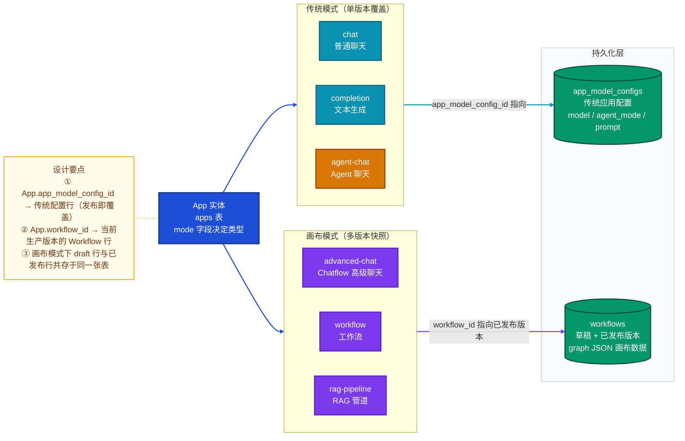
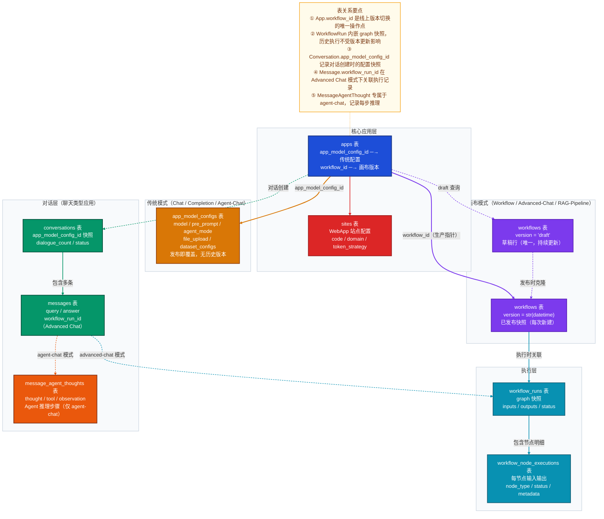
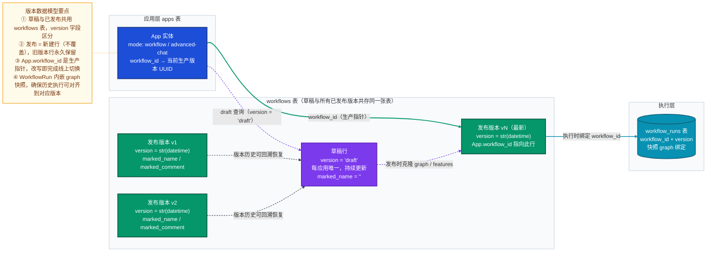
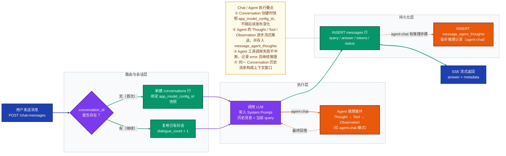

# Dify 应用管理与发布机制完整解析

> 涵盖 Chat、Agent Chat、Workflow、Advanced Chat（Chatflow）四种应用类型的完整数据模型、版本管理、草稿同步与发布机制。

---

## 一、应用类型总览与发布单位

### 1.1 应用模式（AppMode）

Dify 共支持六种应用模式，分布在 `AppMode` 枚举中（`api/models/model.py`）：

| 模式标识 | 中文名 | 发布机制 | 发布单位 | 核心配置表 |
|---|---|---|---|---|
| `chat` | 普通聊天 | 单版本覆盖 | `AppModelConfig` 行 | `app_model_configs` |
| `completion` | 文本生成 | 单版本覆盖 | `AppModelConfig` 行 | `app_model_configs` |
| `agent-chat` | Agent 聊天 | 单版本覆盖 | `AppModelConfig` 行 | `app_model_configs` |
| `advanced-chat` | 高级聊天（Chatflow） | 多版本快照 | `Workflow` 行 | `workflows` |
| `workflow` | 工作流 | 多版本快照 | `Workflow` 行 | `workflows` |
| `rag-pipeline` | RAG 管道 | 多版本快照 | `Workflow` 行 | `workflows` |

**核心结论：Dify 的发布基本单位有两种：**
- **传统模式（chat / completion / agent-chat）**：发布单位为 `AppModelConfig`，发布时覆盖同一行
- **画布模式（advanced-chat / workflow / rag-pipeline）**：发布单位为 `Workflow`，每次发布新建一行，保留历史快照

### 1.2 应用类型架构图



---

## 二、核心数据表结构详解

### 2.1 `apps` 表（App 实体）

> 文件：`api/models/model.py` → `class App`

| 字段 | 类型 | 说明 |
|---|---|---|
| `id` | UUID | 应用唯一标识（PK） |
| `tenant_id` | UUID | 所属工作区 |
| `name` | varchar(255) | 应用名称 |
| `description` | text | 应用描述 |
| `mode` | varchar(255) | 应用类型（`chat`/`completion`/`agent-chat`/`advanced-chat`/`workflow`/`rag-pipeline`） |
| `icon_type` | varchar(255) | 图标类型（`image`/`emoji`/`link`） |
| `icon` | varchar(255) | 图标内容 |
| `icon_background` | varchar(255) | 图标背景色 |
| `app_model_config_id` | UUID | **传统模式**当前配置指针（`app_model_configs.id`） |
| `workflow_id` | UUID | **画布模式**当前已发布版本指针（`workflows.id`） |
| `status` | varchar(255) | 状态（`normal`） |
| `enable_site` | bool | 是否开启 WebApp |
| `enable_api` | bool | 是否开启 API |
| `api_rpm` | int | API 每分钟请求限制 |
| `api_rph` | int | API 每小时请求限制 |
| `max_active_requests` | int | 最大并发请求数 |
| `tracing` | text | 追踪配置 JSON |
| `created_by` | UUID | 创建人 ID |
| `created_at` | datetime | 创建时间 |
| `updated_by` | UUID | 最后更新人 ID |
| `updated_at` | datetime | 最后更新时间 |

**索引**：`(tenant_id)` — 按工作区查询应用列表

**关键设计**：`app_model_config_id` 和 `workflow_id` 是两条互斥的"生产指针"，分别对应传统模式和画布模式。修改对应指针即完成线上版本切换，零停机。

---

### 2.2 `app_model_configs` 表（传统模式配置）

> 文件：`api/models/model.py` → `class AppModelConfig`

> **适用类型**：`chat`、`completion`、`agent-chat`

| 字段 | 类型 | 说明 |
|---|---|---|
| `id` | UUID | 配置唯一标识（PK） |
| `app_id` | UUID | 所属应用 |
| `provider` | varchar(255) | 模型提供商（冗余，已被 `model` JSON 覆盖） |
| `model_id` | varchar(255) | 模型 ID（冗余） |
| `model` | text | 模型配置 JSON（`provider` / `name` / `mode` / `completion_params`） |
| `pre_prompt` | text | System Prompt（预置提示词） |
| `prompt_type` | varchar(255) | 提示词类型（`simple` / `advanced`） |
| `chat_prompt_config` | text | 高级聊天提示词配置 JSON |
| `completion_prompt_config` | text | 高级补全提示词配置 JSON |
| `user_input_form` | text | 用户输入表单定义 JSON |
| `dataset_query_variable` | varchar(255) | RAG 查询变量名 |
| `dataset_configs` | text | 知识库检索配置 JSON |
| `agent_mode` | text | **Agent 配置 JSON**（`enabled`/`strategy`/`tools`/`prompt`）|
| `opening_statement` | text | 开场白 |
| `suggested_questions` | text | 建议问题列表 JSON |
| `suggested_questions_after_answer` | text | 回答后建议问题配置 JSON |
| `speech_to_text` | text | 语音转文字配置 JSON |
| `text_to_speech` | text | 文字转语音配置 JSON |
| `retriever_resource` | text | 检索资源引用配置 JSON |
| `sensitive_word_avoidance` | text | 敏感词过滤配置 JSON |
| `external_data_tools` | text | 外部数据工具配置 JSON |
| `file_upload` | text | 文件上传配置 JSON |
| `more_like_this` | text | 相似推荐配置 JSON |
| `configs` | JSON | 兼容旧字段 |
| `created_by` | UUID | 创建人 |
| `created_at` | datetime | 创建时间 |
| `updated_by` | UUID | 更新人 |
| `updated_at` | datetime | 更新时间 |

**索引**：`(app_id)` — 按应用查询配置

**关键设计**：传统模式无版本历史，每次保存都覆盖同一行（`update`）。`App.app_model_config_id` 始终指向最新的那一行。

---

### 2.3 `workflows` 表（画布模式版本管理）

> 文件：`api/models/workflow.py` → `class Workflow`

> **适用类型**：`advanced-chat`、`workflow`、`rag-pipeline`

| 字段 | 类型 | 说明 |
|---|---|---|
| `id` | UUID | 版本唯一标识（PK） |
| `tenant_id` | UUID | 所属工作区 |
| `app_id` | UUID | 所属应用 |
| `type` | varchar(255) | Workflow 类型（`workflow` / `chat` / `rag-pipeline`） |
| `version` | varchar(255) | **版本标识**：`"draft"` 为草稿，`str(datetime)` 时间戳为已发布版本 |
| `marked_name` | varchar(255) | 发布时的版本名称（由用户填写） |
| `marked_comment` | varchar(255) | 发布时的版本说明（由用户填写） |
| `graph` | longtext | **画布配置 JSON**（`nodes` 数组 + `edges` 数组） |
| `features` | longtext | 功能配置 JSON（文件上传、语音、开场白等） |
| `environment_variables` | longtext | 环境变量 JSON（支持 Secret 加密） |
| `conversation_variables` | longtext | 对话变量定义 JSON |
| `rag_pipeline_variables` | longtext | RAG 管道变量定义 JSON |
| `created_by` | UUID | 创建人 |
| `created_at` | datetime | 创建时间 |
| `updated_by` | UUID | 更新人（草稿持续更新） |
| `updated_at` | datetime | 更新时间 |

**索引**：`(tenant_id, app_id, version)` — 核心复合索引，快速定位草稿或特定版本

**版本区分规则**：
- `version = "draft"` → 草稿行，每应用唯一，持续被覆写
- `version = str(datetime.utcnow())` → 已发布快照，每次发布新建，永不覆盖

---

### 2.4 `conversations` 表（对话管理）

> 文件：`api/models/model.py` → `class Conversation`

> **适用类型**：所有聊天类型（`chat` / `agent-chat` / `advanced-chat`）

| 字段 | 类型 | 说明 |
|---|---|---|
| `id` | UUID | 对话唯一标识（PK） |
| `app_id` | UUID | 所属应用 |
| `app_model_config_id` | UUID | 对话创建时绑定的配置版本快照 ID（传统模式） |
| `override_model_configs` | text | 调试模式下的临时配置覆盖 JSON |
| `model_provider` | varchar(255) | 使用的模型提供商 |
| `model_id` | varchar(255) | 使用的模型 ID |
| `mode` | varchar(255) | 对话模式（同 AppMode） |
| `name` | varchar(255) | 对话名称（自动生成或用户命名） |
| `summary` | text | 对话摘要 |
| `inputs` | JSON | 用户输入变量 |
| `introduction` | text | 开场白 |
| `system_instruction` | text | System Prompt 快照 |
| `system_instruction_tokens` | int | System Prompt token 数 |
| `status` | varchar(255) | 对话状态（`normal`） |
| `invoke_from` | varchar(255) | 调用来源（`web-app`/`api`/`explore`/`debugger`） |
| `from_source` | varchar(255) | 发起来源（`api` / `console`） |
| `from_end_user_id` | UUID | 发起的终端用户 ID |
| `from_account_id` | UUID | 发起的控制台账户 ID |
| `dialogue_count` | int | 对话轮次数 |
| `is_deleted` | bool | 软删除标记 |
| `created_at` | datetime | 创建时间 |
| `updated_at` | datetime | 更新时间 |

**索引**：`(app_id, from_source, from_end_user_id)` — 按用户查询对话历史

---

### 2.5 `messages` 表（消息记录）

> 文件：`api/models/model.py` → `class Message`

| 字段 | 类型 | 说明 |
|---|---|---|
| `id` | UUID | 消息唯一标识（PK） |
| `app_id` | UUID | 所属应用 |
| `conversation_id` | UUID | 所属对话（FK → conversations.id） |
| `model_provider` | varchar(255) | 模型提供商 |
| `model_id` | varchar(255) | 模型 ID |
| `override_model_configs` | text | 调试模式配置覆盖 |
| `inputs` | JSON | 本条消息的输入变量 |
| `query` | text | 用户输入内容 |
| `message` | JSON | 发送给 LLM 的完整消息（含 System/User/Assistant） |
| `message_tokens` | int | 输入 token 数 |
| `message_unit_price` | decimal | 输入 token 单价 |
| `answer` | text | 模型回复内容 |
| `answer_tokens` | int | 输出 token 数 |
| `answer_unit_price` | decimal | 输出 token 单价 |
| `total_price` | decimal | 总费用 |
| `currency` | varchar(255) | 计价货币（USD / RMB） |
| `provider_response_latency` | float | 模型响应延迟（秒） |
| `status` | varchar(255) | 消息状态（`normal` / `error` / `stopped`） |
| `error` | text | 错误信息 |
| `message_metadata` | text | 扩展元数据 JSON（检索资源、引用等） |
| `invoke_from` | varchar(255) | 调用来源 |
| `from_source` | varchar(255) | 发起来源 |
| `from_end_user_id` | UUID | 发起终端用户 |
| `from_account_id` | UUID | 发起控制台账户 |
| `agent_based` | bool | 是否为 Agent 消息 |
| `workflow_run_id` | UUID | 关联的 Workflow 运行 ID（Advanced Chat 模式） |
| `app_mode` | varchar(255) | 消息所属应用模式 |
| `parent_message_id` | UUID | 父消息 ID（分支对话） |
| `created_at` | datetime | 创建时间 |
| `updated_at` | datetime | 更新时间 |

**索引**：7 个复合索引，覆盖按应用、对话、用户、模式、时间等多维度查询

---

### 2.6 `message_agent_thoughts` 表（Agent 推理过程）

> 文件：`api/models/model.py` → `class MessageAgentThought`

> **专用于**：`agent-chat` 模式，记录每一步 ReAct / FunctionCall 推理过程

| 字段 | 类型 | 说明 |
|---|---|---|
| `id` | UUID | 记录唯一标识（PK） |
| `message_id` | UUID | 所属消息（FK → messages.id） |
| `message_chain_id` | UUID | 所属消息链（可选） |
| `position` | int | 推理步骤序号 |
| `thought` | text | LLM 推理内容（Thought） |
| `tool` | text | 调用的工具名称（多个以 `;` 分隔） |
| `tool_input` | text | 工具调用输入 JSON |
| `observation` | text | 工具执行结果（Observation） |
| `tool_process_data` | text | 工具执行过程数据 |
| `tool_labels_str` | text | 工具标签 JSON |
| `tool_meta_str` | text | 工具元数据 JSON |
| `message` | text | 发送给 LLM 的消息内容 |
| `message_token` | int | 输入 token 数 |
| `answer` | text | LLM 回复内容 |
| `answer_token` | int | 输出 token 数 |
| `tokens` | int | 总 token 数 |
| `total_price` | decimal | 本步骤费用 |
| `currency` | varchar(255) | 计价货币 |
| `latency` | float | 本步骤延迟（秒） |
| `created_by_role` | varchar(255) | 创建者角色 |
| `created_by` | UUID | 创建者 ID |
| `created_at` | datetime | 创建时间 |

---

### 2.7 `workflow_runs` 表（Workflow 执行记录）

> 文件：`api/models/workflow.py` → `class WorkflowRun`

> **适用于**：`advanced-chat` 和 `workflow` 模式的每次执行

| 字段 | 类型 | 说明 |
|---|---|---|
| `id` | UUID | 运行唯一标识（PK） |
| `tenant_id` | UUID | 所属工作区 |
| `app_id` | UUID | 所属应用 |
| `workflow_id` | UUID | 执行的 Workflow 版本 ID（含版本快照） |
| `type` | varchar(255) | Workflow 类型（`workflow` / `chat`） |
| `triggered_from` | varchar(255) | 触发来源（`debugging` / `app-run`） |
| `version` | varchar(255) | 执行时的版本号字符串 |
| `graph` | text | **执行时的画布快照 JSON**（防止版本回滚影响历史） |
| `inputs` | text | 执行输入参数 JSON |
| `status` | varchar(255) | 执行状态（`running`/`succeeded`/`failed`/`stopped`/`partial-succeeded`/`paused`） |
| `outputs` | text | 执行输出 JSON |
| `error` | text | 错误信息 |
| `elapsed_time` | float | 执行时长（秒） |
| `total_tokens` | int | 总 token 数 |
| `total_steps` | int | 总步骤数 |
| `created_by_role` | varchar(255) | 执行者角色（`account` / `end_user`） |
| `created_by` | UUID | 执行者 ID |
| `created_at` | datetime | 开始时间 |
| `finished_at` | datetime | 结束时间 |
| `exceptions_count` | int | 异常节点数（Partial-Succeeded 时非零） |

---

### 2.8 `workflow_node_executions` 表（节点执行明细）

> 文件：`api/models/workflow.py` → `class WorkflowNodeExecutionModel`

| 字段 | 类型 | 说明 |
|---|---|---|
| `id` | UUID | 节点执行唯一标识（PK） |
| `tenant_id` | UUID | 所属工作区 |
| `app_id` | UUID | 所属应用 |
| `workflow_id` | UUID | 所属 Workflow 版本 |
| `workflow_run_id` | UUID | 所属运行记录（单步调试时为 NULL） |
| `triggered_from` | varchar(255) | 触发来源（`single-step` / `workflow-run` / `rag-pipeline-run`） |
| `index` | int | 执行顺序序号 |
| `predecessor_node_id` | varchar(255) | 前驱节点 ID |
| `node_execution_id` | varchar(255) | 节点执行 ID（SSE 推流标识） |
| `node_id` | varchar(255) | 节点 ID（画布中的节点唯一标识） |
| `node_type` | varchar(255) | 节点类型（`llm`/`tool`/`code`/`start`/`end` 等） |
| `title` | varchar(255) | 节点标题 |
| `inputs` | text | 节点输入变量 JSON |
| `process_data` | text | 节点处理过程数据 JSON |
| `outputs` | text | 节点输出变量 JSON |
| `status` | varchar(255) | 节点执行状态（`running`/`succeeded`/`failed`） |
| `error` | text | 错误信息 |
| `elapsed_time` | float | 节点执行时长（秒） |
| `execution_metadata` | text | 执行元数据 JSON（token 数、费用、工具信息等） |
| `created_at` | datetime | 执行开始时间 |
| `finished_at` | datetime | 执行结束时间 |

---

### 2.9 `workflow_app_logs` 表（Workflow 应用日志）

> 文件：`api/models/workflow.py` → `class WorkflowAppLog`

> 记录应用级别（非调试）的 Workflow 执行日志

| 字段 | 类型 | 说明 |
|---|---|---|
| `id` | UUID | 日志唯一标识（PK） |
| `tenant_id` | UUID | 所属工作区 |
| `app_id` | UUID | 所属应用 |
| `workflow_id` | UUID | 关联 Workflow 版本 |
| `workflow_run_id` | UUID | 关联运行记录 |
| `created_from` | varchar(255) | 创建来源（`service-api`/`web-app`/`installed-app`） |
| `created_by_role` | varchar(255) | 创建者角色 |
| `created_by` | UUID | 创建者 ID |
| `created_at` | datetime | 创建时间 |

---

### 2.10 `sites` 表（WebApp 站点配置）

> 文件：`api/models/model.py` → `class Site`

| 字段 | 类型 | 说明 |
|---|---|---|
| `id` | UUID | 站点唯一标识（PK） |
| `app_id` | UUID | 所属应用 |
| `title` | varchar(255) | 站点标题 |
| `code` | varchar(255) | 站点访问码（用于生成公开访问 URL） |
| `default_language` | varchar(255) | 默认语言 |
| `customize_domain` | varchar(255) | 自定义域名 |
| `customize_token_strategy` | varchar(255) | Token 策略（`must` / `allow` / `不填`） |
| `prompt_public` | bool | 是否公开 System Prompt |
| `show_workflow_steps` | bool | 是否展示 Workflow 执行步骤 |
| `chat_color_theme` | varchar(255) | 聊天界面颜色主题 |
| `description` | text | 站点描述 |
| `copyright` | varchar(255) | 版权信息 |
| `privacy_policy` | varchar(255) | 隐私政策 URL |
| `status` | varchar(255) | 站点状态（`normal`） |
| `created_at` | datetime | 创建时间 |
| `updated_at` | datetime | 更新时间 |

---

### 2.11 关联辅助表一览

| 表名 | 说明 | 关联关系 |
|---|---|---|
| `workflow_conversation_variables` | Chatflow 运行时对话变量存储 | `conversation_id + app_id` |
| `workflow_draft_variables` | 画布调试时的变量面板数据 | `app_id + node_id + name` |
| `workflow_pauses` | 工作流暂停状态（人工审核等） | `workflow_run_id`（唯一） |
| `workflow_pause_reasons` | 暂停原因详情 | `pause_id` |
| `workflow_archive_logs` | 归档的运行日志快照 | `workflow_run_id` |
| `workflow_node_execution_offload` | 节点大数据卸载（超限写 UploadFile） | `node_execution_id` |
| `message_feedbacks` | 消息点赞/踩反馈 | `message_id + conversation_id` |
| `message_files` | 消息附件文件 | `message_id` |
| `message_annotations` | 消息标注（问答对） | `message_id + conversation_id` |
| `app_annotation_settings` | 标注回复功能配置 | `app_id` |
| `api_tokens` | API Key | `app_id + type` |
| `end_users` | 终端用户（WebApp 访客） | `tenant_id + session_id` |

---

## 三、完整数据模型关系图



---

## 四、传统模式（Chat / Completion / Agent-Chat）发布机制

### 4.1 设计特点

传统模式的"发布"实质是**配置保存**：将 UI 上的所有参数序列化写入 `app_model_configs` 表，然后将 `App.app_model_config_id` 指向新的配置行。

- **无历史版本**：每次保存覆盖，旧配置被替代
- **无草稿**：保存即生效
- **Agent 能力内嵌**：`agent_mode` JSON 字段记录工具列表与推理策略

### 4.2 Agent Mode 数据结构

`app_model_configs.agent_mode` 字段存储的 JSON 示例：

```json
{
  "enabled": true,
  "strategy": "function_call",
  "tools": [
    {
      "provider_type": "builtin",
      "provider_id": "calculator",
      "tool_name": "calculate",
      "tool_parameters": {}
    },
    {
      "provider_type": "api",
      "provider_id": "uuid-of-api-tool",
      "tool_name": "search",
      "tool_parameters": {
        "api_key": "HIDDEN_VALUE"
      }
    }
  ],
  "prompt": null
}
```

`strategy` 支持两种 Agent 推理策略：
- `function_call`：基于 Function Calling 能力（需模型支持）
- `react`：ReAct（Reasoning + Acting）循环

### 4.3 传统模式发布流程

```mermaid
flowchart LR
    classDef userStyle  fill:#1e40af,stroke:#1e3a8a,stroke-width:2.5px,color:#fff
    classDef feStyle    fill:#4f46e5,stroke:#3730a3,stroke-width:2px,color:#fff
    classDef apiStyle   fill:#0891b2,stroke:#155e75,stroke-width:2px,color:#fff
    classDef svcStyle   fill:#7c3aed,stroke:#5b21b6,stroke-width:2px,color:#fff
    classDef dbStyle    fill:#059669,stroke:#064e3b,stroke-width:2px,color:#fff
    classDef noteStyle  fill:#fffbeb,stroke:#f59e0b,stroke-width:1.5px,color:#78350f
    classDef layerStyle fill:#f8fafc,stroke:#cbd5e0,stroke-width:1.5px

    USER["用户保存配置<br>调整模型 / Prompt /<br>工具列表等"]:::userStyle

    subgraph FE["前端层（Next.js）"]
        direction LR
        FORM["配置表单<br>AppConfig / AgentConfig"]:::feStyle
        CALL["HTTP POST<br>/apps/{id}/model-config"]:::apiStyle
    end
    class FE layerStyle

    subgraph BE["后端处理层（Flask）"]
        direction LR
        CTRL["ModelConfigApi.post()<br>权限校验 / 参数验证"]:::apiStyle
        SVC["AppModelConfigService<br>create_app_model_config()"]:::svcStyle
    end
    class BE layerStyle

    subgraph DB["数据库层"]
        direction LR
        INSERT["INSERT 新 AppModelConfig 行<br>序列化所有配置字段"]:::dbStyle
        UPDATE["UPDATE apps SET<br>app_model_config_id = new_config.id"]:::dbStyle
    end
    class DB layerStyle

    RESP["配置生效<br>后续对话使用新配置"]:::userStyle

    USER --> FORM
    FORM --> CALL
    CALL --> CTRL
    CTRL --> SVC
    SVC --> INSERT
    INSERT --> UPDATE
    UPDATE --> RESP

    NOTE["传统模式设计要点<br>① 实质上每次'发布'都是新建 AppModelConfig 行，而非更新<br>② App.app_model_config_id 切换到新行即生效<br>③ 旧 AppModelConfig 行仍存在于 DB，但不再被引用<br>④ Conversation.app_model_config_id 保留创建时的配置快照"]:::noteStyle
    NOTE -.- UPDATE

    %% 边索引：0-7，共 8 条
    linkStyle 0 stroke:#1e40af,stroke-width:2px
    linkStyle 1 stroke:#0891b2,stroke-width:2px
    linkStyle 2 stroke:#0891b2,stroke-width:2px
    linkStyle 3 stroke:#7c3aed,stroke-width:2px
    linkStyle 4 stroke:#059669,stroke-width:2px
    linkStyle 5 stroke:#059669,stroke-width:2.5px
    linkStyle 6 stroke:#059669,stroke-width:2px
    linkStyle 7 stroke:#f59e0b,stroke-width:1px,stroke-dasharray:2 2
```



---

## 五、画布模式（Workflow / Advanced-Chat）版本管理机制

### 5.1 草稿同步流程

用户在画布上的每一次编辑都会自动同步到草稿行，这是发布的前提。

```mermaid
flowchart LR
    classDef userStyle   fill:#1e40af,stroke:#1e3a8a,stroke-width:2.5px,color:#fff
    classDef feStyle     fill:#4f46e5,stroke:#3730a3,stroke-width:2px,color:#fff
    classDef apiStyle    fill:#0891b2,stroke:#155e75,stroke-width:2px,color:#fff
    classDef svcStyle    fill:#7c3aed,stroke:#5b21b6,stroke-width:2px,color:#fff
    classDef dbStyle     fill:#059669,stroke:#064e3b,stroke-width:2px,color:#fff
    classDef noteStyle   fill:#fffbeb,stroke:#f59e0b,stroke-width:1.5px,color:#78350f
    classDef layerStyle  fill:#f8fafc,stroke:#cbd5e0,stroke-width:1.5px

    USER_EDIT["用户编辑画布<br>拖拽 / 配置节点与边"]:::userStyle

    subgraph FE["前端层（ReactFlow + Zustand）"]
        direction LR
        CANVAS["ReactFlow 状态<br>节点 / 连线实时变更"]:::feStyle
        STORE["Zustand Store<br>nodes / edges 全局状态<br>version-slice 时间戳"]:::feStyle
        DEBOUNCE["useSaveWorkflowDraft<br>防抖序列化<br>生成 graph JSON + unique_hash"]:::apiStyle
    end
    class FE layerStyle

    subgraph BE["后端处理层（Flask）"]
        direction LR
        DRAFT_API["DraftWorkflowApi<br>POST .../workflows/draft<br>乐观锁 unique_hash 防并发冲突"]:::apiStyle
        SVC_SYNC["WorkflowService<br>sync_draft_workflow()"]:::svcStyle
    end
    class BE layerStyle

    subgraph DB["数据库层（workflows 表）"]
        direction LR
        CHECK{"草稿行<br>已存在？"}:::svcStyle
        CREATE["INSERT<br>新建草稿行<br>version = 'draft'"]:::dbStyle
        UPDATE["UPDATE<br>更新 graph / features<br>刷新 updated_at"]:::dbStyle
    end
    class DB layerStyle

    TS_UPDATE["前端时间戳同步<br>setDraftUpdatedAt<br>界面显示「最近编辑」"]:::feStyle

    USER_EDIT --> CANVAS
    CANVAS --> STORE
    STORE -->|"变更触发"| DEBOUNCE
    DEBOUNCE -->|"HTTP POST"| DRAFT_API
    DRAFT_API --> SVC_SYNC
    SVC_SYNC --> CHECK
    CHECK -->|"不存在（首次）"| CREATE
    CHECK -->|"已存在"| UPDATE
    CREATE --> TS_UPDATE
    UPDATE --> TS_UPDATE

    NOTE["草稿同步设计要点<br>① 每个应用仅保存一条草稿行（version = 'draft'）<br>② unique_hash 乐观锁防止并发写入覆盖<br>③ 草稿变更完全不影响已发布版本（物理隔离）<br>④ draftUpdatedAt 与 publishedAt 对比驱动「未发布变更」提示"]:::noteStyle
    NOTE -.- SVC_SYNC

    %% 边索引：0-10，共 11 条
    linkStyle 0 stroke:#1e40af,stroke-width:2px
    linkStyle 1 stroke:#4f46e5,stroke-width:2px
    linkStyle 2 stroke:#4f46e5,stroke-width:2px
    linkStyle 3 stroke:#0891b2,stroke-width:2px
    linkStyle 4 stroke:#0891b2,stroke-width:2px
    linkStyle 5 stroke:#7c3aed,stroke-width:2px
    linkStyle 6 stroke:#059669,stroke-width:2px
    linkStyle 7 stroke:#059669,stroke-width:2px
    linkStyle 8 stroke:#059669,stroke-width:1.5px
    linkStyle 9 stroke:#059669,stroke-width:1.5px
    linkStyle 10 stroke:#f59e0b,stroke-width:1px,stroke-dasharray:2 2
```



### 5.2 版本数据模型



### 5.3 发布（Publish）完整流程

```mermaid
flowchart LR
    classDef userStyle   fill:#1e40af,stroke:#1e3a8a,stroke-width:2.5px,color:#fff
    classDef feStyle     fill:#4f46e5,stroke:#3730a3,stroke-width:2px,color:#fff
    classDef apiStyle    fill:#0891b2,stroke:#155e75,stroke-width:2px,color:#fff
    classDef svcStyle    fill:#7c3aed,stroke:#5b21b6,stroke-width:2px,color:#fff
    classDef dbStyle     fill:#059669,stroke:#064e3b,stroke-width:2px,color:#fff
    classDef eventStyle  fill:#d97706,stroke:#92400e,stroke-width:2px,color:#fff
    classDef errStyle    fill:#dc2626,stroke:#991b1b,stroke-width:2px,color:#fff
    classDef noteStyle   fill:#fffbeb,stroke:#f59e0b,stroke-width:1.5px,color:#78350f
    classDef layerStyle  fill:#f8fafc,stroke:#cbd5e0,stroke-width:1.5px

    USER["用户操作<br>点击「发布」按钮"]:::userStyle

    subgraph FE["前端层（Next.js / Zustand）"]
        direction LR
        FEAT["AppPublisher 下拉展开<br>输入版本名 + 发布说明"]:::feStyle
        CHKFE["前端发布前校验<br>useChecklistBeforePublish<br>节点完整性 / Start 节点检查"]:::feStyle
        CALL["usePublishWorkflow<br>POST /apps/{id}/workflows/publish<br>body: marked_name + marked_comment"]:::apiStyle
        UPDATE["前端状态同步<br>setPublishedAt(res.created_at)<br>resetWorkflowVersionHistory()"]:::feStyle
    end
    class FE layerStyle

    subgraph BE["后端控制层（Flask）"]
        direction LR
        CTRL["PublishedWorkflowApi.post()<br>controllers/console/app/workflow.py<br>权限校验 / 模式限制（advanced-chat + workflow）"]:::apiStyle
    end
    class BE layerStyle

    subgraph SVC["服务层（WorkflowService）"]
        direction LR
        D1["① 读取草稿<br>SELECT WHERE version = 'draft'"]:::svcStyle
        D2["② 图结构校验<br>validate_graph_structure<br>DAG 拓扑 / 节点类型约束"]:::svcStyle
        D3["③ 创建发布快照<br>Workflow.new()<br>version = str(datetime.utcnow())"]:::dbStyle
        D4["④ 切换生产指针<br>App.workflow_id = new_workflow.id<br>session.commit()"]:::dbStyle
    end
    class SVC layerStyle

    subgraph EVENTS["事件层（异步副作用）"]
        direction LR
        E1["发布事件<br>app_published_workflow_was_updated"]:::eventStyle
        E2["数据集关联更新<br>update_app_dataset_join<br>同步 RAG 知识库绑定"]:::eventStyle
    end
    class EVENTS layerStyle

    FAIL["校验失败<br>Toast 提示 / 阻断发布"]:::errStyle
    RESP["发布完成<br>返回 created_at 时间戳"]:::userStyle

    USER --> FEAT
    FEAT --> CHKFE
    CHKFE -->|"校验通过"| CALL
    CHKFE -->|"校验失败"| FAIL
    CALL --> CTRL
    CTRL --> D1
    D1 --> D2
    D2 --> D3
    D3 --> D4
    D4 --> E1
    E1 --> E2
    D4 --> RESP
    RESP --> UPDATE

    NOTE["发布流程设计要点<br>① 发布 = 新建行，原草稿行保留（草稿不销毁）<br>② App.workflow_id 切换即完成「线上版本更新」<br>③ 校验在前端（节点完整性）和后端（图结构）双重执行<br>④ 事件异步处理数据集关联等副作用，主流程不阻塞"]:::noteStyle
    NOTE -.- D3

    %% 边索引：0-13，共 14 条
    linkStyle 0 stroke:#1e40af,stroke-width:2px
    linkStyle 1 stroke:#4f46e5,stroke-width:2px
    linkStyle 2 stroke:#059669,stroke-width:2px
    linkStyle 3 stroke:#dc2626,stroke-width:1.5px,stroke-dasharray:4 3
    linkStyle 4 stroke:#0891b2,stroke-width:2px
    linkStyle 5 stroke:#7c3aed,stroke-width:2px
    linkStyle 6 stroke:#7c3aed,stroke-width:2px
    linkStyle 7 stroke:#7c3aed,stroke-width:2px
    linkStyle 8 stroke:#059669,stroke-width:2px
    linkStyle 9 stroke:#059669,stroke-width:2.5px
    linkStyle 10 stroke:#d97706,stroke-width:2px
    linkStyle 11 stroke:#d97706,stroke-width:1.5px
    linkStyle 12 stroke:#059669,stroke-width:2.5px
    linkStyle 13 stroke:#f59e0b,stroke-width:1px,stroke-dasharray:2 2
```



---

## 六、对话执行链路

### 6.1 Chat / Agent-Chat 执行链路



### 6.2 Advanced-Chat（Chatflow）执行链路

```mermaid
flowchart LR
    classDef userStyle   fill:#1e40af,stroke:#1e3a8a,stroke-width:2.5px,color:#fff
    classDef feStyle     fill:#4f46e5,stroke:#3730a3,stroke-width:2px,color:#fff
    classDef apiStyle    fill:#0891b2,stroke:#155e75,stroke-width:2px,color:#fff
    classDef svcStyle    fill:#7c3aed,stroke:#5b21b6,stroke-width:2px,color:#fff
    classDef dbStyle     fill:#059669,stroke:#064e3b,stroke-width:2px,color:#fff
    classDef noteStyle   fill:#fffbeb,stroke:#f59e0b,stroke-width:1.5px,color:#78350f
    classDef layerStyle  fill:#f8fafc,stroke:#cbd5e0,stroke-width:1.5px

    USER["用户发送消息<br>POST /chat-messages"]:::userStyle

    subgraph PREP["准备层"]
        direction LR
        CONV["创建 / 复用 Conversation<br>加载对话变量（conversation_variables）"]:::svcStyle
        WF_LOAD["加载 App.workflow_id<br>指向的 Workflow 版本"]:::svcStyle
    end
    class PREP layerStyle

    subgraph WFRUN["Workflow 执行层"]
        direction LR
        RUN_NEW["INSERT workflow_runs 行<br>快照 graph / workflow_id / version"]:::dbStyle
        GRAPH["GraphEngine 执行画布<br>按拓扑顺序驱动节点"]:::svcStyle
        NODE["每个节点执行<br>INSERT workflow_node_executions"]:::dbStyle
    end
    class WFRUN layerStyle

    subgraph PERSIST["持久化层"]
        direction LR
        MSG_NEW["INSERT messages 行<br>workflow_run_id 关联执行记录"]:::dbStyle
        CONV_VAR["更新对话变量<br>workflow_conversation_variables"]:::dbStyle
        LOG["INSERT workflow_app_logs<br>非调试模式执行日志"]:::dbStyle
    end
    class PERSIST layerStyle

    RESP["SSE 流式返回<br>节点事件 + 最终答案"]:::userStyle

    USER --> CONV
    CONV --> WF_LOAD
    WF_LOAD --> RUN_NEW
    RUN_NEW --> GRAPH
    GRAPH --> NODE
    NODE --> MSG_NEW
    MSG_NEW --> CONV_VAR
    MSG_NEW --> LOG
    GRAPH --> RESP

    NOTE["Chatflow 执行要点<br>① workflow_id 取 App.workflow_id（当前生产版本）<br>② WorkflowRun 内嵌画布 graph 快照，与执行结果永久绑定<br>③ 对话变量（conversation_variables）在同一 Conversation 内持久化<br>④ 节点执行明细支持单步调试（triggered_from = 'single-step'）"]:::noteStyle
    NOTE -.- RUN_NEW

    %% 边索引：0-8，共 9 条
    linkStyle 0 stroke:#7c3aed,stroke-width:2px
    linkStyle 1 stroke:#7c3aed,stroke-width:2px
    linkStyle 2 stroke:#059669,stroke-width:2px
    linkStyle 3 stroke:#7c3aed,stroke-width:2px
    linkStyle 4 stroke:#059669,stroke-width:2px
    linkStyle 5 stroke:#059669,stroke-width:2px
    linkStyle 6 stroke:#059669,stroke-width:2px
    linkStyle 7 stroke:#059669,stroke-width:2px
    linkStyle 8 stroke:#7c3aed,stroke-width:2.5px
```



---

## 七、关键设计决策解析

### 7.1 为什么草稿与已发布共存于同一张 `workflows` 表？

通过 `version` 字段区分，而非分表存储。优势：
- 查询简单，草稿与已发布结构完全一致
- 发布时直接 `Workflow.new()` 复制所有字段，无需跨表迁移
- 索引 `(tenant_id, app_id, version)` 保证草稿查询性能

### 7.2 为什么发布 = 新建行而非覆盖？

每次发布后 `workflows` 表多一条记录：
- 历史版本自然保留，支持版本列表浏览
- 支持任意版本回滚（将旧版本的 `graph` 恢复到草稿行）
- 无需额外的历史归档机制

### 7.3 `App.workflow_id` 作为生产指针

这是"切换上线版本"的唯一操作——修改 `App.workflow_id` 指向哪个 `Workflow.id`，线上流量就用哪个版本的 `graph` 执行。零停机切换，可瞬间回滚（指针指回旧版本 ID）。

### 7.4 版本号用时间戳字符串

```python
# api/models/workflow.py
@staticmethod
def version_from_datetime(d: datetime) -> str:
    return str(d)
```

非语义化 semver，而是时间戳。优势：无需维护计数器，无并发冲突，天然可排序（版本列表按时间倒序即可）。

### 7.5 Agent-Chat 不走 `workflows` 表

传统 `agent-chat` 模式的配置（模型选择、System Prompt、工具列表、`agent_mode` JSON）存储在 `app_model_configs` 表，发布时直接覆盖同一行，没有多版本快照。这是历史遗留设计——旧 Agent 基于 EasyUI 编排，新的"工作流型 Agent"（Advanced Chat）才使用画布多版本机制。

### 7.6 WorkflowRun 内嵌画布快照

`workflow_runs.graph` 字段存储执行时的完整画布 JSON，而非只存版本 ID。这确保：
- 即使用户后续更新并发布新版本，历史执行记录仍能准确展示当时的画布状态
- 执行记录可独立回放，不受版本迭代影响

### 7.7 前后端双重校验

- **前端**：`useChecklistBeforePublish` 检查节点完整性（是否有 Start 节点、未连接的节点）
- **后端**：`validate_graph_structure` 检查图结构合法性（DAG 拓扑、节点类型约束）

前端快速反馈用户体验，后端保证数据安全，两者互补。

---

## 八、关键文件索引

### 后端文件

| 功能 | 路径 |
|---|---|
| App / AppModelConfig / Conversation / Message 模型 | `api/models/model.py` |
| Workflow / WorkflowRun / WorkflowNodeExecution 模型 | `api/models/workflow.py` |
| App 创建 Service | `api/services/app_service.py` |
| Workflow 发布 / 草稿同步 Service | `api/services/workflow_service.py` |
| 发布 Controller（API 路由） | `api/controllers/console/app/workflow.py` |
| 发布事件定义 | `api/events/app_event.py` |
| 数据集关联副作用处理 | `api/events/event_handlers/update_app_dataset_join_when_app_published_workflow_updated.py` |
| Agent 工具运行时 | `api/core/tools/tool_manager.py` |

### 前端文件

| 功能 | 路径 |
|---|---|
| 发布按钮组件（Workflow） | `web/app/components/workflow-app/components/workflow-header/features-trigger.tsx` |
| 通用发布 UI（AppPublisher） | `web/app/components/app/app-publisher/index.tsx` |
| 发布 API mutation | `web/service/use-workflow.ts` |
| 版本 Zustand Slice | `web/app/components/workflow/store/workflow/version-slice.ts` |
| 版本历史面板 | `web/app/components/workflow/panel/version-history-panel/index.tsx` |
| Agent 配置组件 | `web/app/components/app/configuration/config/index.tsx` |

---

## 九、核心流程速查总结

| 应用类型 | 发布单位 | 发布机制 | 版本历史 | 对话层 | Agent 推理记录 |
|---|---|---|---|---|---|
| `chat` | AppModelConfig | 覆盖旧行 | 无 | conversations + messages | 无 |
| `completion` | AppModelConfig | 覆盖旧行 | 无 | （无对话，直接返回） | 无 |
| `agent-chat` | AppModelConfig | 覆盖旧行 | 无 | conversations + messages | message_agent_thoughts |
| `advanced-chat` | Workflow 行 | 新建快照行 | **有（草稿 + N 个发布版本）** | conversations + messages + workflow_runs | workflow_node_executions |
| `workflow` | Workflow 行 | 新建快照行 | **有（草稿 + N 个发布版本）** | workflow_runs（无 Conversation） | workflow_node_executions |
| `rag-pipeline` | Workflow 行 | 新建快照行 | **有（草稿 + N 个发布版本）** | workflow_runs（无 Conversation） | workflow_node_executions |
