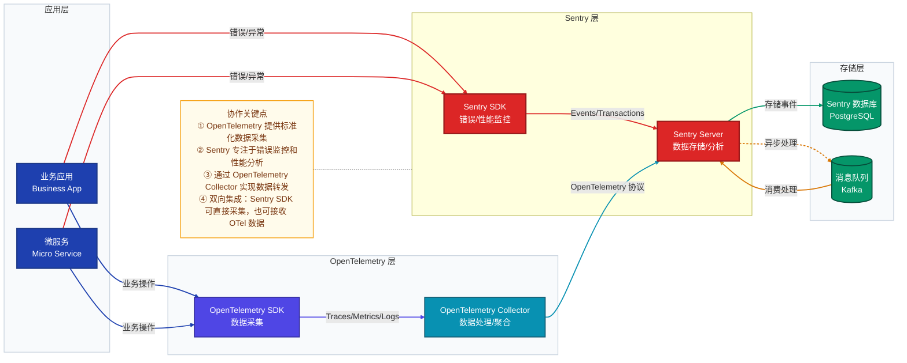

# OpenTelemetry + Sentry 协作流程

> 展示从应用代码到 Sentry 的完整可观测性数据流转过程

## 流程说明

1. **应用层**：业务应用和微服务产生各种操作和事件
2. **OpenTelemetry 层**：
   - OpenTelemetry SDK 采集应用的 Traces、Metrics 和 Logs
   - OpenTelemetry Collector 对数据进行处理和聚合
3. **Sentry 层**：
   - Sentry SDK 直接捕获应用的错误和异常
   - Sentry Server 接收来自 Sentry SDK 和 OpenTelemetry Collector 的数据
4. **存储层**：
   - PostgreSQL 存储 Sentry 的事件数据
   - Kafka 用于异步处理和消息队列

## 协作优势

- **标准化数据**：OpenTelemetry 提供统一的数据采集标准
- **专业分析**：Sentry 专注于错误监控和性能分析
- **灵活集成**：支持多种数据流转路径
- **全面可观测性**：结合 OpenTelemetry 的广泛采集和 Sentry 的深度分析