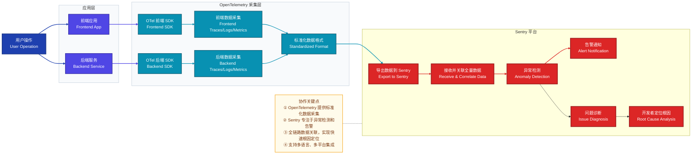

```mermaid
flowchart LR
    %% ── 配色定义：按职责分色 ──────────────────────────────
    classDef userStyle     fill:#1e40af,stroke:#1e3a8a,stroke-width:2.5px,color:#fff
    classDef appStyle      fill:#4f46e5,stroke:#3730a3,stroke-width:2px,color:#fff
    classDef otelStyle     fill:#0891b2,stroke:#155e75,stroke-width:2px,color:#fff
    classDef sentryStyle   fill:#dc2626,stroke:#991b1b,stroke-width:2.5px,color:#fff
    classDef noteStyle     fill:#fffbeb,stroke:#f59e0b,stroke-width:1.5px,color:#78350f
    classDef layerStyle    fill:#f8fafc,stroke:#cbd5e0,stroke-width:1.5px

    %% ── 起始节点 ──────────────────────────────────────────
    A["用户操作<br>User Operation"]:::userStyle

    %% ── 应用层 ────────────────────────────────────────────
    subgraph Application["应用层"]
        direction LR
        B["前端应用<br>Frontend App"]:::appStyle
        C["后端服务<br>Backend Service"]:::appStyle
    end
    class Application layerStyle

    %% ── OpenTelemetry 采集层 ──────────────────────────────
    subgraph OpenTelemetry["OpenTelemetry 采集层"]
        direction LR
        D["OTel 前端 SDK<br>Frontend SDK"]:::otelStyle
        E["OTel 后端 SDK<br>Backend SDK"]:::otelStyle
        F["前端数据采集<br>Frontend Traces/Logs/Metrics"]:::otelStyle
        G["后端数据采集<br>Backend Traces/Logs/Metrics"]:::otelStyle
        H["标准化数据格式<br>Standardized Format"]:::otelStyle
    end
    class OpenTelemetry layerStyle

    %% ── Sentry 平台层 ─────────────────────────────────────
    subgraph Sentry["Sentry 平台"]
        direction LR
        I["导出数据到 Sentry<br>Export to Sentry"]:::sentryStyle
        J["接收并关联全量数据<br>Receive & Correlate Data"]:::sentryStyle
        K["异常检测<br>Anomaly Detection"]:::sentryStyle
        L["告警通知<br>Alert Notification"]:::sentryStyle
        M["问题诊断<br>Issue Diagnosis"]:::sentryStyle
        N["开发者定位根因<br>Root Cause Analysis"]:::sentryStyle
    end
    class Sentry layerStyle

    %% ── 主流程数据流 ─────────────────────────────────────
    A --> B
    A --> C
    
    B --> D
    C --> E
    D --> F
    E --> G
    F --> H
    G --> H
    
    H --> I
    I --> J
    J --> K
    K --> L
    K --> M
    M --> N

    %% ── 设计注记 ─────────────────────────────────────────
    NOTE["协作关键点<br>① OpenTelemetry 提供标准化数据采集<br>② Sentry 专注于异常检测和告警<br>③ 全链路数据关联，实现快速根因定位<br>④ 支持多语言、多平台集成"]:::noteStyle
    NOTE -.- Sentry

    %% 边索引：0-11，共 12 条
    linkStyle 0 stroke:#1e40af,stroke-width:2px
    linkStyle 1 stroke:#1e40af,stroke-width:2px
    linkStyle 2 stroke:#4f46e5,stroke-width:2px
    linkStyle 3 stroke:#4f46e5,stroke-width:2px
    linkStyle 4 stroke:#0891b2,stroke-width:2px
    linkStyle 5 stroke:#0891b2,stroke-width:2px
    linkStyle 6 stroke:#0891b2,stroke-width:2px
    linkStyle 7 stroke:#0891b2,stroke-width:2px
    linkStyle 8 stroke:#0891b2,stroke-width:2px
    linkStyle 9 stroke:#dc2626,stroke-width:2px
    linkStyle 10 stroke:#dc2626,stroke-width:2px
    linkStyle 11 stroke:#dc2626,stroke-width:2px
```