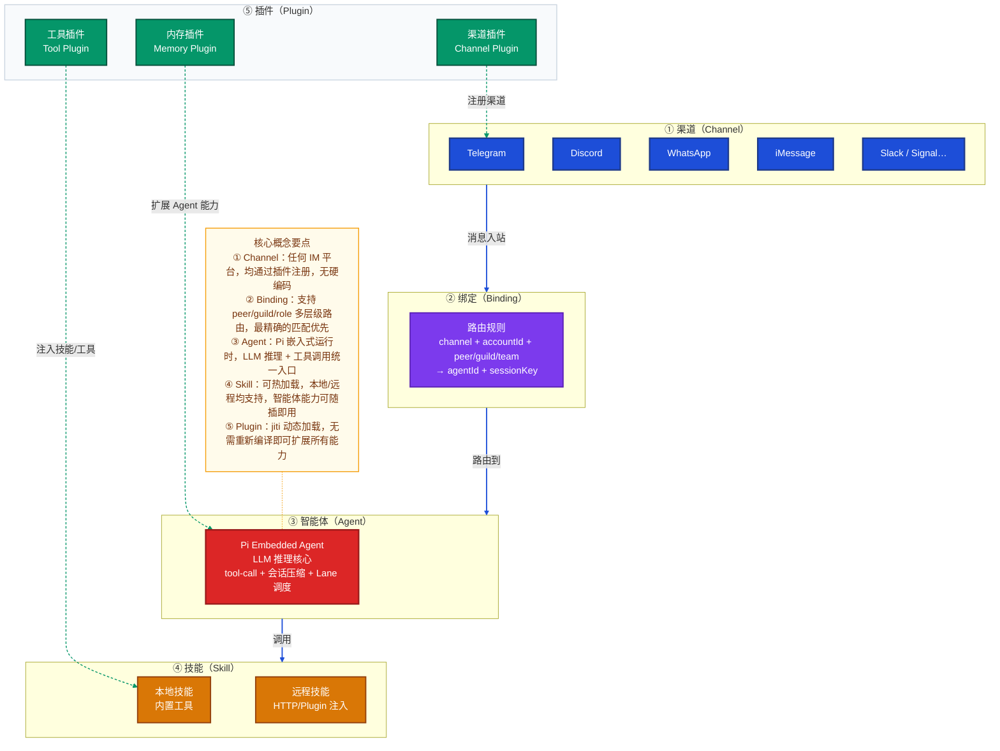
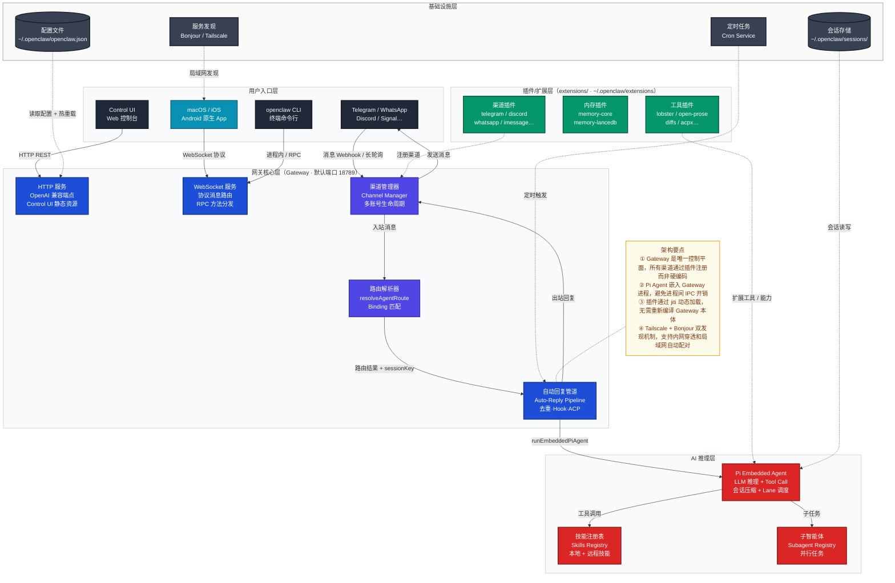
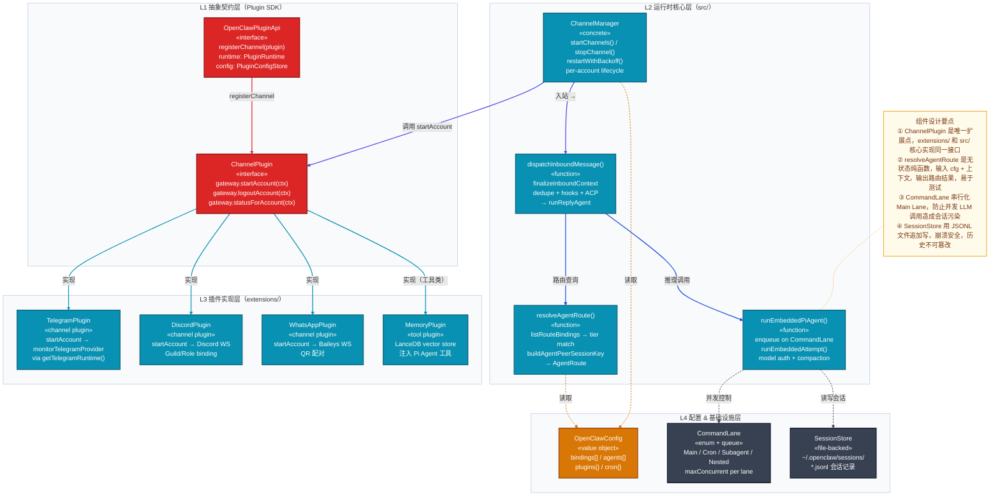
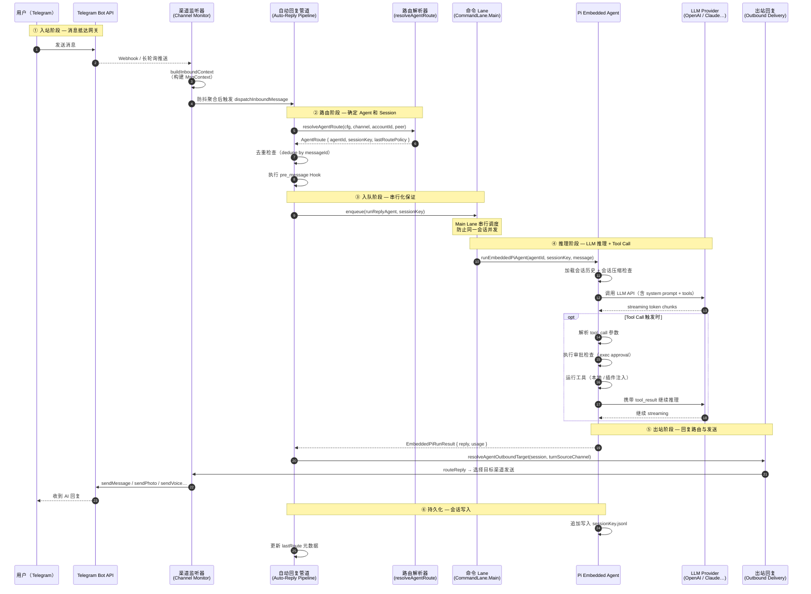
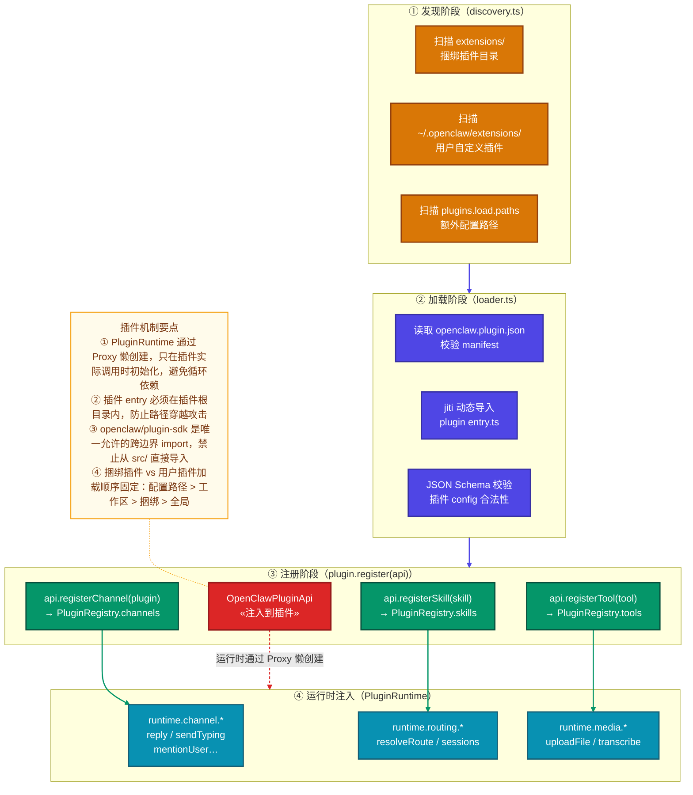
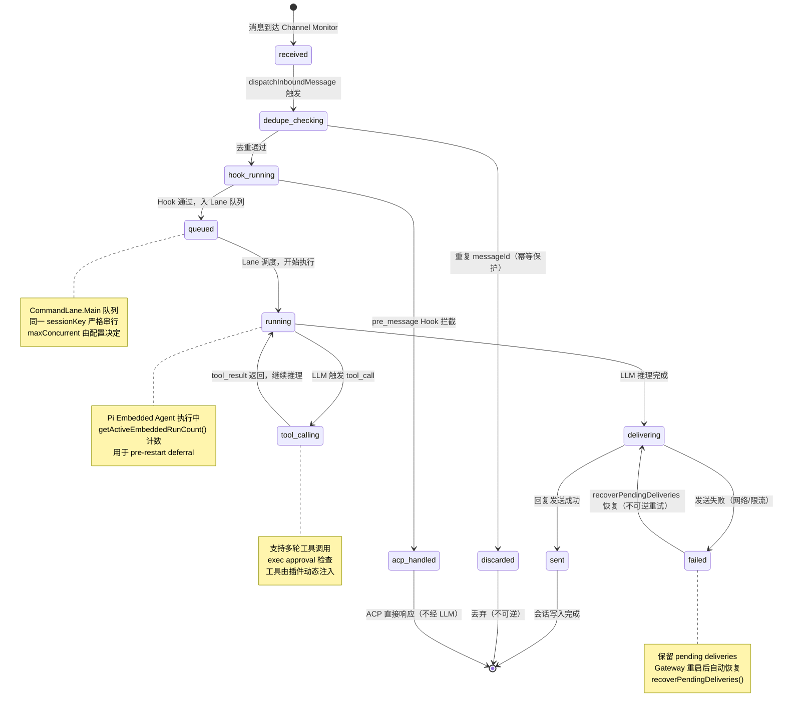
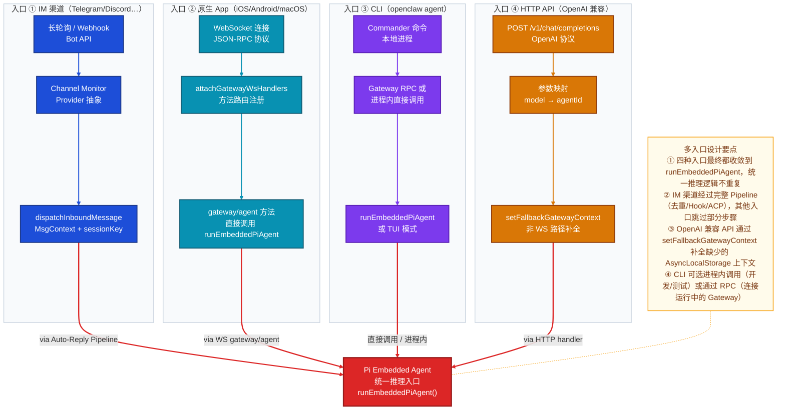

# OpenClaw 技术分析文档

> 版本：2026.3.7 · 分析时间：2026-03-26

---

## 目录

1. [项目定位](#1-项目定位)
2. [核心概念](#2-核心概念)
3. [整体架构](#3-整体架构)
4. [核心组件结构](#4-核心组件结构)
5. [功能模块协作](#5-功能模块协作)
6. [核心执行链路](#6-核心执行链路)
7. [关键设计决策](#7-关键设计决策)
8. [补充图：插件扩展机制](#8-补充图插件扩展机制)
9. [补充图：消息路由状态机](#9-补充图消息路由状态机)
10. [补充图：多入口协议对比](#10-补充图多入口协议对比)
11. [FAQ（12 题详解）](#11-faq12-题详解)

---

## 1. 项目定位

**OpenClaw 是一个个人 AI 助手网关（Personal AI Assistant Gateway）**——它将大语言模型智能体（Agent）接入用户已在使用的各种即时通讯渠道（Telegram、Discord、Slack、WhatsApp、iMessage、Signal 等），让用户无需切换 App，直接在现有聊天界面中与 AI 对话、执行任务、控制设备。

---

## 2. 核心概念

下图展示 OpenClaw 中最重要的五个核心概念及其层级关系，阅读时从上到下：**渠道**收到消息 → **绑定**决定路由 → **智能体**处理请求 → **技能**扩展能力 → **插件**动态注入一切。



**要点说明：**
- **渠道** 是消息的物理入口，每条渠道由对应插件实现，通过统一的 `ChannelPlugin` 接口注册到网关。
- **绑定** 是路由的核心配置，支持从"特定用户（peer）"到"整个频道（channel-wide）"的分层匹配，最精确优先。
- **Pi Agent** 不是一个独立进程，而是嵌入网关进程的 LLM 推理运行时，通过命令 Lane 实现并发控制。

---

## 3. 整体架构

下图展示 OpenClaw 的系统整体架构：从用户侧的各类客户端（IM App + 原生 App）到网关核心，再到 AI 推理和基础设施层。重点关注**网关（Gateway）** 作为中枢的作用——所有入站消息和出站回复都通过它中转。



**要点说明：**
- **Gateway 单进程多职责**：HTTP、WebSocket、渠道管理、路由、AI 推理全部在同一 Node.js 进程中，通过异步事件循环和 Lane 并发控制共享资源，避免微服务拆分带来的运维复杂度。
- **原生 App 是"哑终端"**：iOS/Android/macOS App 不含业务逻辑，通过 WebSocket 协议与 Gateway 通信，Gateway 才是真正的大脑。
- **插件是"一等公民"**：即使是官方支持的 Telegram、Discord 也以插件形式注册，Extension 与 Core 之间边界清晰。

---

## 4. 核心组件结构

下图展示 Gateway 内部核心组件的代码层级关系（类层级视角），重点关注 `ChannelPlugin` 抽象基类和 `EmbeddedPiAgent` 的职责边界。



---

## 5. 功能模块协作

下图展示各功能模块的职责划分与协作关系，采用横向流程视角：从消息接收到最终回复发出，各模块如何分工。重点关注**自动回复管道**这一核心协调器。

```mermaid
flowchart LR
    classDef inStyle    fill:#1e40af,stroke:#1e3a8a,stroke-width:2.5px,color:#fff
    classDef routeStyle fill:#7c3aed,stroke:#5b21b6,stroke-width:2px,color:#fff
    classDef pipeStyle  fill:#4f46e5,stroke:#3730a3,stroke-width:2px,color:#fff
    classDef agentStyle fill:#dc2626,stroke:#991b1b,stroke-width:2.5px,color:#fff
    classDef outStyle   fill:#059669,stroke:#064e3b,stroke-width:2px,color:#fff
    classDef infraStyle fill:#374151,stroke:#111827,stroke-width:2px,color:#fff
    classDef noteStyle  fill:#fffbeb,stroke:#f59e0b,stroke-width:1.5px,color:#78350f
    classDef layerStyle fill:#f8fafc,stroke:#cbd5e0,stroke-width:1.5px

    MSG_IN["消息入站<br>Inbound Message<br>（Telegram / Discord…）"]:::inStyle

    subgraph MODULE_A["模块 A：渠道接收层"]
        direction LR
        A1["Channel Monitor<br>长轮询 / Webhook"]:::inStyle
        A2["消息上下文构建<br>buildInboundContext<br>Provider / Surface / Peer"]:::inStyle
        A3["防抖聚合<br>inboundDebouncer<br>多消息合并"]:::inStyle
    end
    class MODULE_A layerStyle

    subgraph MODULE_B["模块 B：路由层"]
        direction LR
        B1["resolveAgentRoute<br>Binding 分层匹配<br>peer → guild → account"]:::routeStyle
        B2["SessionKey 构建<br>buildAgentPeerSessionKey<br>确保会话唯一性"]:::routeStyle
    end
    class MODULE_B layerStyle

    subgraph MODULE_C["模块 C：自动回复管道"]
        direction LR
        C1["去重检查<br>Dedupe Guard<br>防止重复处理"]:::pipeStyle
        C2["钩子执行<br>Hook Runner<br>pre_message hooks"]:::pipeStyle
        C3["ACP 分支<br>Agent Control Protocol<br>特殊指令处理"]:::pipeStyle
        C4["runReplyAgent<br>进入 Lane 队列"]:::pipeStyle
    end
    class MODULE_C layerStyle

    subgraph MODULE_D["模块 D：AI 推理层"]
        direction LR
        D1["Pi Embedded Agent<br>LLM 推理核心"]:::agentStyle
        D2["Tool Call 处理<br>工具调用 + 执行审批"]:::agentStyle
        D3["会话压缩<br>Compaction<br>超长上下文处理"]:::agentStyle
    end
    class MODULE_D layerStyle

    subgraph MODULE_E["模块 E：出站回复层"]
        direction LR
        E1["AgentDeliveryPlan<br>目标渠道解析<br>防跨渠道污染"]:::outStyle
        E2["Channel Send<br>渠道发送适配<br>媒体 / 文本 / 语音"]:::outStyle
        E3["持久化<br>Session JSONL<br>会话记录写入"]:::infraStyle
    end
    class MODULE_E layerStyle

    MSG_IN --> A1
    A1 --> A2
    A2 --> A3
    A3 --> B1
    B1 --> B2
    B2 --> C1
    C1 --> C2
    C2 --> C3
    C3 --> C4
    C4 --> D1
    D1 --> D2
    D1 --> D3
    D1 --> E1
    E1 --> E2
    E1 --> E3

    NOTE["模块协作要点<br>① 防抖聚合：连续快速输入合并为一次 Agent 调用，降低 LLM 成本<br>② 去重检查：幂等保护，同一消息 ID 不会被处理两次<br>③ ACP 分支：优先于 LLM 处理，响应延迟更低<br>④ AgentDeliveryPlan：显式追踪消息来源渠道，避免多渠道会话串扰"]:::noteStyle
    NOTE -.- C4

    %% 边索引：0-15，共 16 条（勿超出 15：会触发 undefined.style）
    linkStyle 0,1,2 stroke:#1e40af,stroke-width:2px
    linkStyle 3,4 stroke:#7c3aed,stroke-width:2px
    linkStyle 5,6,7,8 stroke:#4f46e5,stroke-width:2px
    linkStyle 9,10,11 stroke:#dc2626,stroke-width:2px
    linkStyle 12,13,14 stroke:#059669,stroke-width:2px
    linkStyle 15 stroke:#f59e0b,stroke-width:1px,stroke-dasharray:2 2
```



---

## 6. 核心执行链路

### 6.1 消息处理完整时序

下图展示一条 Telegram 消息从用户发出，到 AI 回复送达的完整异步时序链路。重点关注 **Gateway 内部各组件的调用顺序**，以及 Pi Agent 与外部 LLM 提供商之间的流式交互。



**阶段说明：**
- **步骤 1-4（入站）**：Telegram 通过长轮询或 Webhook 将消息推送给 Channel Monitor，后者构建 `MsgContext` 并经过防抖聚合交给管道。防抖设计使快速连续输入只触发一次 LLM 调用。
- **步骤 5-9（路由）**：`resolveAgentRoute` 是无状态纯函数，根据 `channel + accountId + peer` 查找最精确的 Binding 匹配，构建唯一 `sessionKey`，保证多渠道同一用户的会话连续性。
- **步骤 10-11（入队）**：Main Lane 的串行队列是关键设计——同一会话的消息严格排队，避免并发 LLM 调用导致回复乱序。
- **步骤 12-19（推理）**：Pi Agent 支持多轮 Tool Call 循环，每次工具调用结果作为新上下文继续推理，直到没有新的 tool_call 为止。
- **步骤 20-23（出站）**：`AgentDeliveryPlan` 追踪消息来源渠道，确保 AI 的回复发回到消息来源渠道（而非配置的默认渠道），防止多渠道会话串扰。

### 6.2 网关启动序列

下图展示 Gateway 的完整启动流程（端到端流程视角）。重点关注启动过程中的依赖顺序——插件必须在渠道管理器之前加载，会话恢复必须在渠道启动之后执行。

```mermaid
flowchart LR
    classDef startStyle  fill:#1e40af,stroke:#1e3a8a,stroke-width:2.5px,color:#fff
    classDef configStyle fill:#d97706,stroke:#92400e,stroke-width:2px,color:#fff
    classDef pluginStyle fill:#059669,stroke:#064e3b,stroke-width:2px,color:#fff
    classDef svcStyle    fill:#0891b2,stroke:#155e75,stroke-width:2px,color:#fff
    classDef chanStyle   fill:#4f46e5,stroke:#3730a3,stroke-width:2px,color:#fff
    classDef doneStyle   fill:#059669,stroke:#064e3b,stroke-width:2.5px,color:#fff
    classDef noteStyle   fill:#fffbeb,stroke:#f59e0b,stroke-width:1.5px,color:#78350f
    classDef layerStyle  fill:#f8fafc,stroke:#cbd5e0,stroke-width:1.5px

    START["openclaw gateway run<br>CLI 入口"]:::startStyle

    subgraph INIT["① 初始化阶段"]
        direction LR
        I1["读取 & 验证配置<br>loadConfig + validate"]:::configStyle
        I2["迁移遗留配置<br>legacy migrate"]:::configStyle
        I3["密钥解锁<br>prepareSecretsRuntimeSnapshot"]:::configStyle
        I4["网关 Token 生成<br>ensureGatewayStartupAuth"]:::configStyle
    end
    class INIT layerStyle

    subgraph PLUGINS["② 插件加载阶段"]
        direction LR
        P1["发现插件<br>discoverOpenClawPlugins"]:::pluginStyle
        P2["加载清单<br>loadPluginManifestRegistry"]:::pluginStyle
        P3["jiti 动态导入<br>plugin register(api)"]:::pluginStyle
        P4["激活注册表<br>setActivePluginRegistry"]:::pluginStyle
    end
    class PLUGINS layerStyle

    subgraph SERVICES["③ 服务启动阶段"]
        direction LR
        S1["HTTP + WS 服务器<br>Express + ws"]:::svcStyle
        S2["渠道管理器<br>createChannelManager"]:::chanStyle
        S3["Cron 服务<br>buildGatewayCronService"]:::svcStyle
        S4["服务发现<br>Bonjour / Tailscale"]:::svcStyle
        S5["远程技能注册<br>Skills Registry"]:::svcStyle
    end
    class SERVICES layerStyle

    subgraph SIDECARS["④ 边车任务阶段"]
        direction LR
        SC1["启动各渠道账号<br>startChannels()"]:::chanStyle
        SC2["恢复待处理回复<br>recoverPendingDeliveries"]:::svcStyle
        SC3["内存后端初始化<br>Memory Backend"]:::svcStyle
        SC4["gateway:startup Hook<br>插件钩子触发"]:::pluginStyle
    end
    class SIDECARS layerStyle

    DONE["🟢 Gateway Ready<br>端口 18789 监听中"]:::doneStyle

    START --> I1 --> I2 --> I3 --> I4
    I4 --> P1 --> P2 --> P3 --> P4
    P4 --> S1 --> S2 --> S3 --> S4 --> S5
    S5 --> SC1 --> SC2 --> SC3 --> SC4
    SC4 --> DONE

    NOTE["启动顺序要点<br>① 配置验证失败立即 abort，不进入服务阶段<br>② 插件必须在服务启动前加载，渠道管理器依赖插件提供的 ChannelPlugin<br>③ 渠道账号在所有服务就绪后才启动，保证消息不会在服务未就绪时涌入<br>④ gateway:startup Hook 最后触发，允许插件在 Gateway 完全就绪后执行初始化"]:::noteStyle
    NOTE -.- P1

    %% 边索引：0-18，共 19 条（NOTE 连到具体节点 P1，避免 NOTE -.- subgraph 导致边对象缺失）
    linkStyle 0,1,2,3 stroke:#d97706,stroke-width:2px
    linkStyle 4,5,6,7 stroke:#059669,stroke-width:2px
    linkStyle 8,9,10,11,12 stroke:#0891b2,stroke-width:2px
    linkStyle 13,14,15,16 stroke:#4f46e5,stroke-width:2px
    linkStyle 17 stroke:#059669,stroke-width:2.5px
    linkStyle 18 stroke:#f59e0b,stroke-width:1px,stroke-dasharray:2 2
```



---

## 7. 关键设计决策

### 7.1 为什么选择单进程 Gateway 而非微服务？

**决策**：所有功能（HTTP、WebSocket、渠道管理、路由、AI 推理、Cron）集中在单个 Node.js 进程中运行。

**原因**：
1. **目标用户场景**：OpenClaw 是个人自托管工具，运行在普通 PC/Mac/树莓派上，不需要水平扩展。微服务会带来巨大运维负担（服务发现、网络延迟、配置同步）。
2. **Pi Agent 嵌入设计**：LLM 推理通过 `@mariozechner/pi-agent-core` 嵌入进程，避免跨进程 IPC 和序列化开销，工具调用延迟更低。
3. **Lane 替代线程**：通过命令 Lane（有界并发队列）实现并发控制，Main Lane 默认串行，Subagent Lane 可配置并发数，无需多进程协调。
4. **简化部署**：用户只需 `npm install -g openclaw` 一个命令，无需 Docker Compose、Kubernetes 等基础设施。

### 7.2 为什么渠道实现通过插件注册而非硬编码？

**决策**：即使是官方支持的 Telegram、Discord 也以 `ChannelPlugin` 接口注册，不在 Gateway 核心中硬编码渠道逻辑。

**原因**：
1. **关注点分离**：渠道 API 变化（例如 Telegram Bot API 升级）只影响对应扩展包，不触及 Gateway 核心代码。
2. **用户自定义**：用户可以在 `~/.openclaw/extensions/` 放置私有渠道插件，无需 fork 主仓库。
3. **按需加载**：未启用的渠道插件不加载，降低内存占用；通过 `OPENCLAW_PLUGIN_DISCOVERY_CACHE_MS` 控制发现缓存 TTL。
4. **测试隔离**：插件注册机制使渠道实现可以独立测试，不依赖 Gateway 全量启动。

### 7.3 为什么路由使用分层 Binding 匹配而非简单的 agentId 映射？

**决策**：`resolveAgentRoute` 实现 peer → parent peer → guild+roles → guild → team → account → channel 七层匹配，最精确优先。

**原因**：
1. **细粒度控制**：允许同一个 Discord 服务器中，不同频道、不同身份组路由到不同 AI 助手（例如：`#coding` 频道路由到编程助手，`#general` 路由到通用助手）。
2. **渐进配置**：用户可以从"整个渠道用同一个 Agent"开始，逐步细化到"某个群组的特定成员用专属 Agent"，无需重新配置整个路由表。
3. **会话连续性**：`sessionKey` 由 channel + accountId + peer 唯一确定，同一用户无论通过 Telegram DM 还是群聊发消息，session 隔离精准。

### 7.4 为什么 Pi Agent 使用 JSONL 文件而非数据库存储会话？

**决策**：会话历史以追加方式写入 `~/.openclaw/sessions/*.jsonl`，不使用 SQLite 或 PostgreSQL。

**原因**：
1. **崩溃安全**：追加写是原子操作，进程崩溃不会导致会话文件损坏（不会有半写记录）。
2. **零依赖**：不需要启动数据库进程，降低部署门槛，符合个人工具定位。
3. **可检查性**：用户可以直接用文本编辑器查看、搜索会话历史，透明度高。
4. **会话压缩（Compaction）**：当 JSONL 超过上下文窗口时，Pi Agent 内置压缩机制自动摘要旧会话，压缩结果同样以 JSONL 格式写入，保持格式统一。

### 7.5 为什么使用 jiti 动态加载插件而非 Node.js 原生 `import()`？

**决策**：插件加载通过 jiti（TypeScript 即时编译运行时）实现，支持用 TypeScript 编写插件而无需预编译。

**原因**：
1. **开发体验**：插件作者无需配置 `tsc`，直接写 `.ts` 文件放到扩展目录即可使用。
2. **路径别名**：jiti 配置了 `openclaw/plugin-sdk → src/plugin-sdk` 的别名，使插件可以在开发模式（指向 src/）和生产模式（指向 dist/）下使用同一个 import 路径。
3. **隔离性**：动态导入 + 边界检查（entry file 必须在插件根目录内），防止插件越权访问系统文件。

---

## 8. 补充图：插件扩展机制

插件系统是 OpenClaw 最核心的扩展点。下图展示插件从磁盘发现到注入 Gateway 的完整链路，重点关注**插件注册 API** 的挂载时机和**运行时注入**的设计。



---

## 9. 补充图：消息路由状态机

下图描述一条消息在 Auto-Reply Pipeline 中的完整状态生命周期，状态名与源码枚举值一致。



---

## 10. 补充图：多入口协议对比

OpenClaw 支持多种客户端接入方式，协议和处理路径各有差异。下图对比四种主要入口的处理差异，重点关注它们在 Gateway 内部的收敛点。



---

## 11. FAQ（12 题详解）

### 基本原理类

---

#### Q1：OpenClaw 和直接使用 ChatGPT App 有什么本质区别？

**本质区别在于"控制权"和"集成深度"。**

ChatGPT App 是一个封闭的 SaaS 服务：用户只能在 ChatGPT 界面中交互，模型固定（GPT-4），数据存储在 OpenAI 服务器，无法集成自定义工具或连接到自己的即时通讯渠道。

OpenClaw 是一个**自托管 AI 网关**：
1. **渠道集成**：AI 回复直接出现在你的 Telegram/Discord/iMessage 等日常通讯工具中，无需切换 App。
2. **模型自选**：通过配置绑定到任意支持的 LLM 提供商（OpenAI、Anthropic Claude、本地 Ollama 等）。
3. **数据自主**：会话历史存储在本地 `~/.openclaw/sessions/`，用户完全控制。
4. **工具扩展**：可以通过插件接入本地命令、浏览器控制、文件系统、日历等个人数据源。
5. **跨设备连续**：同一个渠道的会话通过 `sessionKey` 保持连续，AI 记得上次对话内容。

---

#### Q2：Gateway 是什么？它和 CLI 是什么关系？

**Gateway 是 OpenClaw 的"大脑"，CLI 是它的"遥控器"。**

**Gateway** 是一个长期运行的后台 Node.js 进程（默认端口 18789），负责：
- 保持与 Telegram/Discord 等渠道的持久连接（长轮询/WebSocket）
- 接收消息 → 路由 → 调用 AI → 发送回复
- 管理多账号、多渠道、多 Agent 的并发

**CLI**（`openclaw` 命令）是一个短暂运行的命令行工具，可以：
- 启动/停止/重载 Gateway（`openclaw gateway run/stop/reload`）
- 查询状态（`openclaw status`）
- 直接发送消息（`openclaw message send`）
- 运行一次性 Agent 对话（`openclaw agent --message "..."`)

两者关系：CLI 可以直接在进程内调用 Pi Agent（无需 Gateway 运行），也可以通过 WebSocket RPC 与运行中的 Gateway 通信。macOS 用户通常通过菜单栏 App 管理 Gateway，CLI 主要用于脚本和调试场景。

---

#### Q3：Pi Agent 是什么？为什么叫"Pi"？

**Pi Agent 是 OpenClaw 内置的 LLM 推理运行时，基于 `@mariozechner/pi-*` 开源包。**

"Pi" 来自 Mario Zechner（libGDX 作者）开发的个人 AI 助手框架项目（`pi-agent-core`、`pi-ai`、`pi-coding-agent`），该框架提供了：
- **工具调用循环**：自动处理 `tool_call` → `tool_result` → 继续推理的多轮循环
- **会话压缩**：当会话历史超过 LLM 上下文窗口时，自动压缩旧会话（Compaction）
- **流式输出**：支持 streaming token 逐步推送给用户
- **多模型支持**：通过统一接口对接不同 LLM 提供商

在 OpenClaw 中，Pi Agent 以"嵌入式"方式运行（`runEmbeddedPiAgent`）——它不是一个独立进程，而是在 Gateway 主进程中通过 `CommandLane` 串行调度，共享进程内存和工具注册表。

---

#### Q4：消息路由的"绑定（Binding）"是如何工作的？举个例子。

**Binding 是 OpenClaw 中将"消息来源"映射到"AI Agent"的路由规则，支持七层精细化匹配。**

**配置示例**（`~/.openclaw/openclaw.json`）：
```json
{
  "bindings": [
    {
      "type": "route",
      "match": { "channel": "telegram", "accountId": "mybot", "peer": { "kind": "direct", "id": "123456" } },
      "agentId": "coding-assistant"
    },
    {
      "type": "route",
      "match": { "channel": "discord", "accountId": "mybot", "guildId": "789", "roles": ["developer"] },
      "agentId": "coding-assistant"
    },
    {
      "type": "route",
      "match": { "channel": "telegram", "accountId": "*" },
      "agentId": "default-assistant"
    }
  ]
}
```

**匹配顺序**（精确度从高到低）：
1. `peer`（特定用户/群组）→ 匹配用户 `123456` → 路由到 `coding-assistant`
2. `parentPeer`（线程父级）
3. `guild + roles`（Discord 服务器 + 角色）→ 有 `developer` 角色的成员 → 路由到 `coding-assistant`
4. `guild`（Discord 服务器所有成员）
5. `team`（Slack 工作区）
6. `accountId`（特定 Bot 账号）
7. `channel`（渠道通配 `"*"`）→ 兜底规则

第一个匹配成功的规则生效，未匹配则使用配置的默认 Agent。

---

### 设计决策类

---

#### Q5：为什么使用 CommandLane 而不是直接并发处理消息？

**CommandLane 解决的核心问题是"会话一致性"——同一个会话的消息必须串行处理，否则 AI 上下文会混乱。**

假设用户在 1 秒内发了两条消息："帮我写一个排序算法" 和 "用 Python 写"。如果并发处理：
- 两个 LLM 调用同时发出，每个都只有第一条消息的上下文
- AI 不知道第二条消息是对第一条的补充
- 两个回复同时写入 session JSONL，顺序不确定

**CommandLane 的设计**：
- `Main Lane` 默认 `maxConcurrent=1`，同一 `sessionKey` 的消息严格排队
- `Subagent Lane` 可配置更高并发数（子任务彼此独立，不共享 session）
- `Cron Lane` 定时任务独立队列，不阻塞用户消息

代码中 `setPreRestartDeferralCheck` 检查 `getTotalQueueSize() + getTotalPendingReplies() + getActiveEmbeddedRunCount()`——Gateway 重启时会等待正在执行的 Lane 任务完成，保证不丢消息。

---

#### Q6：插件系统为何用 jiti 而非 Node.js 原生 ESM import()？

**jiti 解决了三个 Node.js 原生 ESM 无法解决的问题：**

1. **TypeScript 直接执行**：用户用 TypeScript 写插件，无需预编译。jiti 在运行时即时转译（Babel/esbuild），开发体验接近 `ts-node`。

2. **路径别名注入**：jiti 实例配置了 `openclaw/plugin-sdk → src/plugin-sdk`（开发）或 `dist/plugin-sdk`（生产）的别名。这个别名在 Node.js 原生 `import()` 中需要复杂的 `--import` 钩子才能实现。

3. **CJS/ESM 互操作**：插件可能使用 CommonJS 格式（老包），jiti 透明处理混合模块格式，而 Node.js ESM 对 `require()` 有严格限制。

**安全考量**：`loader.ts` 中包含边界检查——插件的 entry 文件必须在插件根目录内，防止插件声明一个指向系统目录的 entry 路径。

---

#### Q7：会话压缩（Compaction）是如何工作的？为什么需要它？

**会话压缩是 OpenClaw 处理"LLM 上下文窗口限制"的核心机制。**

**问题**：GPT-4 的上下文窗口约 128K tokens，长期对话（如几天的 Telegram 历史）会远超这个限制。如果直接截断，AI 会忘记早期重要信息。

**压缩机制**（在 `src/agents/pi-embedded-runner/` 中实现）：
1. **检测触发**：每次对话前检查当前 session JSONL 的 token 估算值是否接近上下文窗口阈值。
2. **分段摘要**：将早期对话历史分段，调用 LLM 生成结构化摘要（保留关键事实、决策、用户偏好）。
3. **压缩写入**：摘要以特殊格式写入 session JSONL，替代原始多轮对话。
4. **增量累积**：新对话只追加到压缩后的基础上，避免再次超限。

这个设计的关键是：**摘要和原始记录共用同一个 JSONL 格式**，Gateway 无需区分"是否压缩过的会话"，加载逻辑统一。

---

#### Q8：多渠道会话（同一个人在 Telegram 和 Discord 都联系我）是如何处理的？

**OpenClaw 通过 `sessionKey` 设计支持会话隔离和会话共享两种模式。**

**默认行为（隔离）**：`sessionKey` 由 `channel + accountId + peer.id` 唯一确定，所以同一个用户在 Telegram 发的消息和在 Discord 发的消息是两个独立 session，AI 不会混淆两边的对话。

**共享模式（dmScope: main）**：通过配置 `dmScope: "main"`，可以将多个渠道的同一用户（通过 identity link 关联）共享同一个主会话（`mainSessionKey`）。AI 在任何渠道都能看到完整的对话历史。

**防串扰机制**：`AgentDeliveryPlan` 中的 `turnSourceChannel` 追踪每条消息的来源渠道——即使两个渠道共享 session，AI 的回复也只发回到消息来源的渠道，不会"跨频道回复"。

---

### 实际应用类

---

#### Q9：如何添加一个新的 IM 渠道支持？开发者需要做什么？

**添加新渠道需要实现 `ChannelPlugin` 接口并通过 OpenClaw Plugin API 注册。**

**步骤一：创建扩展包**
```
extensions/my-channel/
├── package.json           # 声明 openclaw 为 peerDependencies
├── openclaw.plugin.json   # 插件清单：{ "id": "my-channel", "channels": ["my-channel"] }
└── index.ts               # 注册入口
```

**步骤二：实现 `index.ts`**
```typescript
import type { OpenClawPlugin } from "openclaw/plugin-sdk";

const plugin: OpenClawPlugin = {
  register(api) {
    api.registerChannel({
      id: "my-channel",
      gateway: {
        async startAccount({ accountId, config, signal, runtime }) {
          // 建立与 IM 平台的连接（WebSocket/长轮询）
          // 收到消息时调用 runtime.channel.dispatchInboundMessage(ctx)
          // 注册 signal.onabort 处理退出
        },
        async logoutAccount({ accountId }) { /* 断开连接 */ },
      }
    });
  }
};
export default plugin;
```

**步骤三：启用插件**
```bash
openclaw plugins enable my-channel
openclaw gateway reload
```

**注意**：`runtime.channel` 提供了 `sendMessage`、`sendTypingIndicator`、`resolveRoute` 等通用 API，新渠道插件**只需关注 IM 平台 API 差异**，路由、会话管理、AI 推理均由 Gateway 统一处理。

---

#### Q10：OpenClaw 的 Cron 定时任务系统是如何工作的？

**Cron 是 Gateway 内置的定时任务调度器，允许 AI 在没有用户消息时主动执行任务。**

**配置示例**：
```json
{
  "cron": {
    "jobs": [
      {
        "id": "daily-summary",
        "schedule": "0 9 * * *",
        "agentId": "assistant",
        "message": "生成今日计划摘要并发送到 Telegram"
      }
    ],
    "maxConcurrentRuns": 2
  }
}
```

**工作流程**：
1. `buildGatewayCronService`（`src/cron/`）在 Gateway 启动时初始化 croner 调度器
2. 触发时，Cron Job 以指定的 `message` 作为"虚拟用户消息"，调用 `dispatchInboundMessage` 进入 Cron Lane 队列
3. Pi Agent 处理后，通过 `AgentDeliveryPlan` 将回复发送到配置的目标渠道
4. `Cron Lane` 独立于 `Main Lane`，不阻塞实时用户消息

**设计亮点**：Cron Job 和普通用户消息走**完全相同的 Auto-Reply Pipeline**，AI 拥有完整的工具调用能力，可以在定时任务中调用浏览器、文件系统等工具。

---

### 性能优化类

---

#### Q11：当多个用户同时发消息时，Gateway 如何保证性能？

**OpenClaw 通过分层并发控制实现高效资源利用。**

**并发策略**：

| 维度 | 策略 | 原因 |
|------|------|------|
| **同一 sessionKey** | Main Lane 严格串行（maxConcurrent=1） | 保证 session 一致性，不丢上下文 |
| **不同 sessionKey** | 各自独立 Lane 队列，可并发 | 不同用户互不影响 |
| **Subagent** | 独立 Subagent Lane，maxConcurrent 可配置 | 并行执行子任务，提高吞吐 |
| **Cron** | 独立 Cron Lane，maxConcurrent 由 cfg.cron.maxConcurrentRuns 控制 | 定时任务不阻塞实时消息 |

**防抖聚合**（`inboundDebouncer`）：连续快速输入合并为一次 Agent 调用，降低 LLM API 调用次数，节省成本。

**会话压缩**：超长 session 压缩后 token 数大幅减少，每次 LLM 调用 token 成本可降低 60~80%（取决于压缩效果）。

**重启延迟**（`setPreRestartDeferralCheck`）：Gateway 重启时等待正在执行的 Lane 任务完成（最多等待配置时间），保证消息不丢失，不需要消息持久化队列。

---

#### Q12：OpenClaw 的安全模型是怎样的？用户数据如何保护？

**OpenClaw 采用"本地优先、明确授权"的安全模型。**

**核心安全设计**：

1. **Gateway Token 认证**：每个 Gateway 实例生成唯一 Token（`ensureGatewayStartupAuth`），WebSocket 连接和 HTTP 请求需要携带 Token，防止局域网内其他设备未授权访问。

2. **DM 配对机制（Pairing）**：与 AI 对话之前，用户需要通过 DM 配对（类似 2FA）。未配对的账号发来的消息会被丢弃，防止陌生人触发 AI。

3. **工具执行审批（Exec Approval）**：Pi Agent 执行系统命令、文件操作等高风险工具前，会暂停等待用户明确批准（`src/infra/exec-approvals.ts`），防止 Prompt Injection 导致意外系统操作。

4. **插件安全检查**：
   - 插件 entry 文件必须在插件根目录内（路径边界检查）
   - 非 Windows 系统检测 world-writable 目录，拒绝加载不安全权限的插件
   - `openclaw/plugin-sdk` 是唯一允许的跨边界 import，插件无法直接 import core 内部模块

5. **数据本地化**：所有会话历史（`~/.openclaw/sessions/`）、凭据（`~/.openclaw/credentials/`）、配置（`~/.openclaw/openclaw.json`）均存储在用户本地，不上传到 OpenClaw 服务器。

6. **密钥快照机制**（`prepareSecretsRuntimeSnapshot`）：API 密钥在 Gateway 启动时读取并存入内存快照，运行期间不重新读取磁盘，减少密钥文件被并发读取的时间窗口。

7. **Tailscale 网络隔离**：Gateway 可配置仅通过 Tailscale 网络暴露，原生 App 通过私有 VPN 连接，不暴露公网端口。

---

> **文档维护**：本文基于 OpenClaw `2026.3.7` 版本代码分析编写，核心源码路径参考 `src/gateway/server.impl.ts`、`src/routing/resolve-route.ts`、`src/agents/pi-embedded-runner/`、`src/plugins/loader.ts`。
