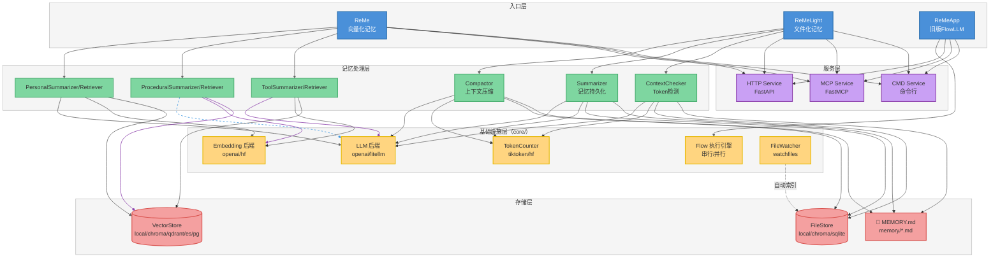
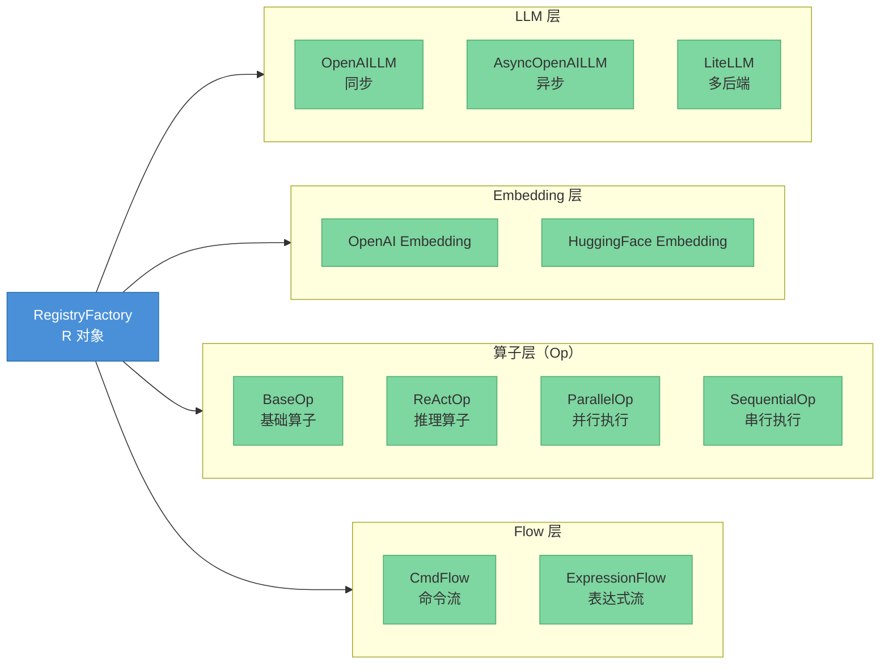
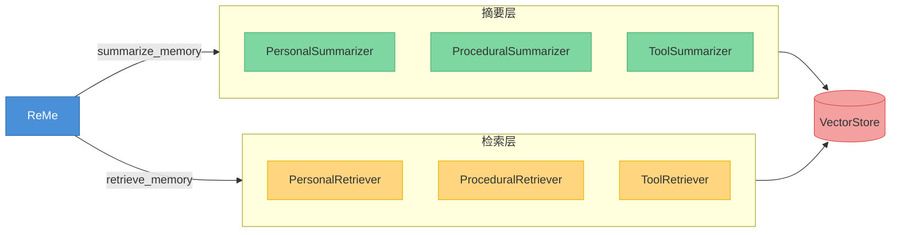
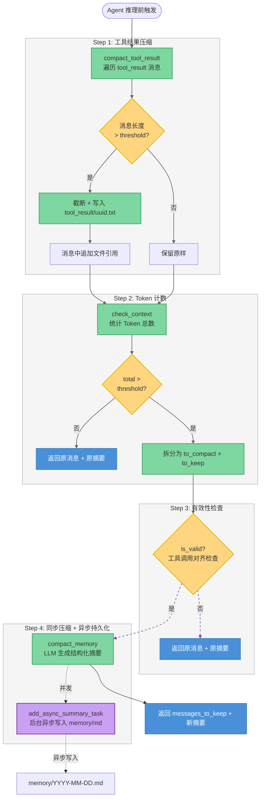
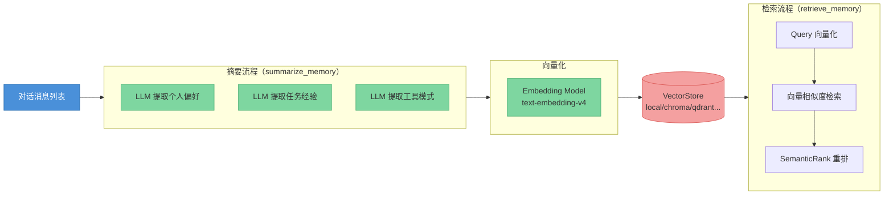
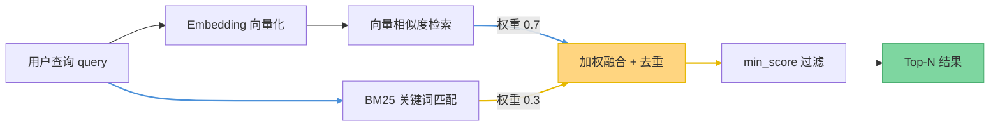
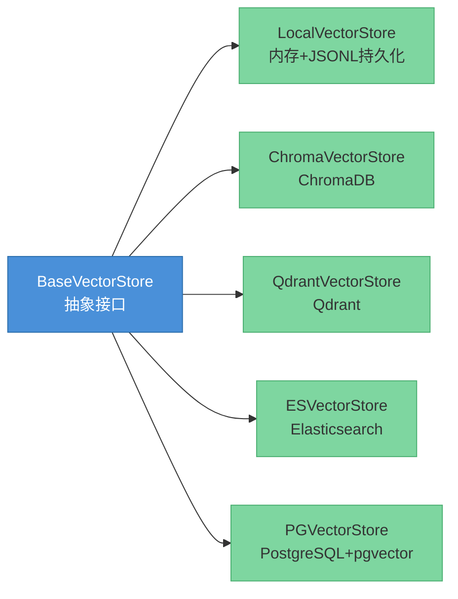
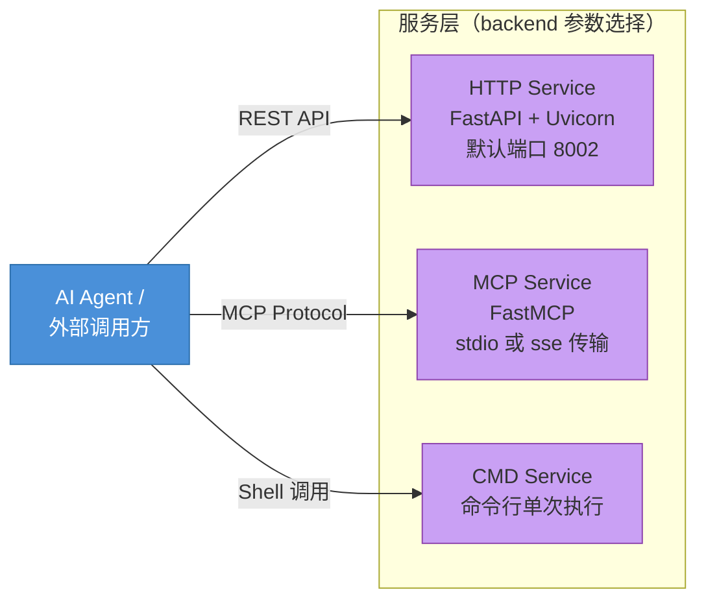

# ReMe 项目架构分析文档

> **版本**：v0.3.0.6b3　|　**作者**：架构分析团队　|　**更新日期**：2026-03-16
>
> **适用人群**：希望深入了解 ReMe 内部设计与实现的开发者、架构师、以及准备参与项目贡献的工程师。

---

## 目录

1. [项目概览](#一项目概览)
2. [模块详细拆解](#二模块详细拆解)
3. [核心业务流程与数据流](#三核心业务流程与数据流)
4. [数据层设计](#四数据层设计)
5. [接口与 API 设计](#五接口与-api-设计)
6. [配置与部署](#六配置与部署)
7. [安全性设计](#七安全性设计)
8. [异常处理与可观测性](#八异常处理与可观测性)
9. [测试策略](#九测试策略)
10. [设计亮点与潜在关注点](#十设计亮点与潜在关注点)
11. [面试常见问题 FAQ](#十一面试常见问题-faq)

---

## 一、项目概览

### 1.1 项目定位

**ReMe**（Remember Me, Refine Me）是由阿里云 AgentScope AI 团队开发的**面向 AI 智能体的记忆管理框架**，开源协议为 Apache 2.0。

它聚焦解决智能体记忆的两类核心痛点：

| 痛点 | 描述 | ReMe 的解法 |
|------|------|-------------|
| **上下文窗口有限** | 长对话时 LLM 早期信息被截断丢失 | 自动压缩 + 结构化摘要，将 223,838 tokens 压缩至 1,105 tokens（压缩率 99.5%） |
| **会话无状态** | 新会话无法继承历史，每次从零开始 | 持久化记忆到文件/向量库，下次对话自动检索注入 |

**典型应用场景**：
- 个人助理（如 CoPaw）：记住用户偏好和历史对话
- 编程助手：跨会话保持一致的代码风格偏好
- 客服机器人：提供个性化服务历史
- 任务自动化：从历史任务中学习成功/失败模式

### 1.2 技术栈概览

```
核心语言：Python 3.10+
Web 框架：FastAPI + Uvicorn
MCP 协议：FastMCP + mcp
LLM 接入：litellm（多后端统一接口）、openai、dashscope
向量数据库：ChromaDB / Qdrant / Elasticsearch / pgvector / SQLite-vec（本地）
Embedding：OpenAI 兼容接口 + HuggingFace transformers
数据验证：Pydantic v2
日志：Loguru
CLI：rich + prompt_toolkit
构建/发布：setuptools + twine + GitHub Actions
```

### 1.3 项目结构

```
ReMe-0.3.0.6b3/
├── reme/                    # 新版核心包（主力开发方向）
│   ├── reme.py              # ReMe（向量化记忆系统）入口
│   ├── reme_light.py        # ReMeLight（文件化记忆系统）入口
│   ├── reme_cli.py          # CLI 交互模式入口
│   ├── config/              # YAML 配置文件 + 解析器
│   ├── core/                # 基础设施层（LLM/Embedding/存储/算子/Flow/Schema）
│   ├── memory/              # 记忆系统实现
│   │   ├── file_based/      # 文件化记忆（ReMeLight 使用）
│   │   └── vector_based/    # 向量化记忆（ReMe 使用）
│   └── extension/           # 扩展功能（流式对话等）
│
├── reme_ai/                 # 旧版 FlowLLM 封装（向后兼容）
│   ├── main.py              # ReMeApp 入口（继承 FlowLLM Application）
│   ├── config/default.yaml  # 完整 Flow 定义与 API 配置
│   ├── agent/               # ReAct Agent 实现
│   ├── summary/             # 记忆摘要算子（personal/task/tool/working）
│   ├── retrieve/            # 记忆检索算子
│   ├── service/             # HTTP 服务层
│   ├── schema/              # 记忆数据模型
│   └── utils/               # 工具函数
│
├── benchmark/               # 5 套评测基准（AppWorld/BFCL/HaluMem/LocOMo/LongMemEval）
├── tests/                   # 自动化测试套件（pytest）
├── test/                    # 脚本式示例测试
├── docs/                    # Jupyter Book 文档（reme.agentscope.io）
├── pyproject.toml           # 构建/依赖/入口点配置
├── example.env              # 环境变量示例
└── .github/workflows/       # CI/CD（pre-commit 检查 + PyPI 自动发布）
```

**组织方式**：单体 Python 包（Monorepo 风格），两套并行架构（新版 `reme` + 旧版 `reme_ai`）共存，通过不同 CLI 命令区分。

### 1.4 核心模块关系



### 1.5 快速上手

**安装**：
```bash
git clone https://github.com/agentscope-ai/ReMe.git
cd ReMe
pip install -e ".[light]"    # 文件化记忆系统（ReMeLight）
# 或
pip install -e "."           # 完整安装（含向量化记忆系统）
```

**环境变量**（复制 `example.env` 为 `.env`）：
```ini
LLM_API_KEY=sk-xxxx
LLM_BASE_URL=https://dashscope.aliyuncs.com/compatible-mode/v1
```

**三种启动方式**：

| 命令 | 场景 |
|------|------|
| `reme2 backend=http http.port=8002 ...` | 启动 HTTP 服务（新版） |
| `remecli` | 本地 CLI 交互模式 |
| `reme backend=http ...` | 启动旧版 FlowLLM HTTP 服务 |

### 1.6 记忆类型体系

ReMe 定义了 6 种标准化记忆类型，覆盖智能体记忆的完整生命周期：

| 类型 | 枚举值 | 含义 |
|------|--------|------|
| IDENTITY | `"identity"` | 身份记忆：用户名、角色等稳定属性 |
| PERSONAL | `"personal"` | 个人偏好：用户习惯、偏好、个性化上下文 |
| PROCEDURAL | `"procedural"` | 程序记忆：操作流程、Step-by-Step 知识 |
| TOOL | `"tool"` | 工具记忆：工具使用经验、API 调用模式 |
| SUMMARY | `"summary"` | 摘要记忆：记忆集合的压缩摘要 |
| HISTORY | `"history"` | 历史记忆：原始交互记录 |

---

## 二、模块详细拆解

### 2.1 新版核心架构（`reme/`）

#### 2.1.1 基础设施层（`reme/core/`）

这是整个系统的"地基"，通过注册工厂（`registry_factory.py`）统一管理所有组件的注册与实例化：



**核心设计**：`R`（RegistryFactory）对象是全局单例，所有组件通过 `R.register()` 注册，通过 `R.create()` 实例化。这使得后端替换（如换向量数据库）只需修改配置，无需改动业务代码。

#### 2.1.2 Flow 执行引擎

Flow 是 ReMe 的**工作流编排核心**，采用「算子表达式语言」定义数据处理管道：

```
# 任务记忆摘要 Flow（来自 reme_ai/config/default.yaml）
TrajectoryPreprocessOp()
  >> (SuccessExtractionOp() | FailureExtractionOp() | ComparativeExtractionOp())
  >> MemoryValidationOp()
  >> MemoryDeduplicationOp()
  >> UpdateVectorStoreOp()
```

| 操作符 | 语义 | 实现类 |
|--------|------|--------|
| `>>` | 串行执行（前者输出作为后者输入） | `SequentialOp` |
| `\|` | 并行执行（独立运行，结果合并） | `ParallelOp` |

**Expression Flow 的优势**：
- 配置即代码：Flow 逻辑直接写在 YAML 中，无需重新部署
- 并行提效：多路提取 (`|`) 不阻塞彼此，显著降低延迟
- 可观测：每个算子输入/输出均可独立记录

#### 2.1.3 文件化记忆系统（ReMeLight）

**核心类**：`reme/reme_light.py::ReMeLight`，继承 `Application` 基类。

内部组件与职责：

| 组件 | 文件 | 职责 |
|------|------|------|
| `ContextChecker` | `memory/file_based/components/context_checker.py` | Token 计数，判断超限，拆分消息 |
| `Compactor` | `memory/file_based/components/compactor.py` | ReActAgent 将历史消息压缩为结构化摘要 |
| `Summarizer` | `memory/file_based/components/summarizer.py` | ReActAgent + 文件工具，持久化记忆到 Markdown |
| `ToolResultCompactor` | `memory/file_based/components/tool_result_compactor.py` | 截断超长工具输出，转存到 `tool_result/` 目录 |
| `MemorySearch` | `memory/file_based/tools/memory_search.py` | 向量 + BM25 混合检索（权重 0.7:0.3） |
| `FileWatcher` | `core/file_watcher/` | 监听 `.md` 文件变更，自动更新 FileStore 索引 |
| `ReMeInMemoryMemory` | `memory/file_based/reme_in_memory_memory.py` | Token 感知的会话内存，支持排除已压缩消息 |

**文件存储布局**：

```
working_dir/
├── MEMORY.md              # 长期记忆（用户偏好等持久信息）
├── memory/
│   └── YYYY-MM-DD.md      # 每日日记（对话结束后异步写入）
└── tool_result/
    └── <uuid>.txt         # 超长工具输出缓存（自动清理过期文件）
```

#### 2.1.4 向量化记忆系统（ReMe）

**核心类**：`reme/reme.py::ReMe`，继承 `Application` 基类。

内部组件架构：



**记忆 CRUD 接口**：`add_memory / get_memory / update_memory / delete_memory / list_memory`

### 2.2 旧版 FlowLLM 架构（`reme_ai/`）

旧版架构以 `FlowLLM` 框架为基础，将记忆处理逻辑全部定义在 `reme_ai/config/default.yaml` 中。每个 Flow 通过表达式引擎自动注册为 HTTP 端点，提供了完整的 REST API 服务能力。

---

## 三、核心业务流程与数据流

### 3.1 ReMeLight 推理前预处理（`pre_reasoning_hook`）

这是文件化记忆系统的**主干流程**，在每轮 Agent 推理前执行：



**关键设计决策**：
- **同步压缩 + 异步持久化**：`compact_memory` 同步返回摘要以不阻塞当前推理；`summary_memory`（写文件）在后台异步执行，彻底解耦。
- **工具调用对齐**：`is_valid` 检查确保不会拆散 `tool_use/tool_result` 配对，避免 LLM 收到不完整的工具上下文。

### 3.2 向量化记忆的摘要与检索流程



### 3.3 记忆检索混合搜索（文件化系统）



---

## 四、数据层设计

### 4.1 核心数据模型

#### MemoryNode（记忆节点）

```python
class MemoryNode(BaseModel):
    memory_id: str          # SHA-256 哈希前16位（自动生成）
    memory_type: MemoryType # personal/procedural/tool/history/summary/identity
    memory_target: str      # 所属用户名 / 任务名 / 工具名
    when_to_use: str        # 检索触发条件（用于 Embedding 向量化）
    content: str            # 记忆内容正文
    message_time: str       # 原始消息时间戳
    ref_memory_id: str      # 关联的原始历史记忆 ID
    time_created: str       # 节点创建时间
    time_modified: str      # 节点最后修改时间
    author: str             # 来源标识
    score: float            # 重要性/质量分数
    vector: list[float]     # 向量嵌入（存储时填入）
    metadata: dict          # 扩展元数据（任意 KV）
```

> **设计亮点**：`when_to_use` 字段专门用于 Embedding，而非直接对 `content` 做向量化。这使得检索语义更聚焦——"什么情况下该用这条记忆"比"记忆说了什么"更适合作为检索锚点。

#### VectorNode（向量节点，存储层模型）

从 `MemoryNode` 派生，在插入向量数据库时补充 `vector` 字段。不同的 VectorStore 后端各自实现序列化/反序列化逻辑。

### 4.2 向量存储后端

系统通过 `BaseVectorStore` 抽象接口统一管理 5 种向量存储后端：



**统一接口**：`list_collections / create_collection / delete_collection / copy_collection / insert / search / delete / delete_all / update / get / list / start / close`

**选型建议**：

| 场景 | 推荐后端 | 理由 |
|------|----------|------|
| 开发/调试 | `local` | 零依赖，JSONL 文件可直接查看 |
| 生产小规模 | `chroma` | 轻量，支持持久化 |
| 生产大规模 | `qdrant` 或 `elasticsearch` | 高性能，支持分布式 |
| 已有 PostgreSQL | `pgvector` | 与业务数据库共享基础设施 |

### 4.3 文件存储后端（FileStore）

专供 ReMeLight 使用，实现了 3 种后端：

| 后端 | 特点 |
|------|------|
| `LocalFileStore` | 内存索引 + JSONL 持久化，支持向量检索 + BM25 全文检索 |
| `ChromaFileStore` | 基于 ChromaDB，支持向量检索 |
| `SQLiteFileStore` | 基于 SQLite + sqlite-vec，本地轻量方案 |

### 4.4 缓存机制

- **Embedding 缓存**：`reme.start()` 时加载，`reme.close()` 时保存，避免重复调用 Embedding API
- **工具结果缓存**：超长工具输出落盘到 `tool_result/<uuid>.txt`，过期文件自动清理（可配置 `retention_days`）

---

## 五、接口与 API 设计

### 5.1 API 设计风格

ReMe 的 HTTP API 采用 **REST 风格**，全部使用 `POST` 方法（即使是查询操作也统一使用 POST，以便传递复杂 JSON 请求体），端点命名采用「动词_记忆类型」格式：

```
POST /retrieve_personal_memory    → 检索个人记忆
POST /summary_personal_memory     → 生成个人记忆摘要
POST /retrieve_task_memory        → 检索任务记忆
POST /summary_task_memory         → 生成任务记忆摘要
POST /retrieve_tool_memory        → 检索工具记忆
POST /summary_tool_memory         → 生成工具记忆摘要
```

### 5.2 完整 API 端点列表

| 端点 | 功能 | 模块 |
|------|------|------|
| `POST /retrieve_task_memory` | 检索任务记忆（Top-K 语义搜索） | 任务记忆 |
| `POST /summary_task_memory` | 从对话轨迹提取任务记忆 | 任务记忆 |
| `POST /retrieve_task_memory_simple` | 简化版任务记忆检索 | 任务记忆 |
| `POST /summary_task_memory_simple` | 简化版任务记忆摘要 | 任务记忆 |
| `POST /record_task_memory` | 更新任务记忆的 freq/utility 属性 | 任务记忆 |
| `POST /delete_task_memory` | 按质量阈值批量删除任务记忆 | 任务记忆 |
| `POST /retrieve_personal_memory` | 检索个人记忆 | 个人记忆 |
| `POST /summary_personal_memory` | 从对话中提炼用户个人记忆 | 个人记忆 |
| `POST /retrieve_tool_memory` | 按工具名检索工具记忆 | 工具记忆 |
| `POST /add_tool_call_result` | 将工具调用结果添加到记忆库 | 工具记忆 |
| `POST /summary_tool_memory` | 汇总工具使用模式 | 工具记忆 |
| `POST /summary_working_memory` | 工作记忆压缩（compact/compress/auto） | 工作记忆 |
| `POST /grep_working_memory` | Grep 工作记忆文件内容 | 工作记忆 |
| `POST /read_working_memory` | 读取工作记忆文件 | 工作记忆 |
| `POST /vector_store` | 向量数据库直接操作（copy/delete/dump/load/list） | 基础设施 |
| `POST /react` | 执行 ReAct Agent | 基础设施 |
| `POST /agentic_retrieve` | Agentic 自主检索 | 基础设施 |
| `POST /use_mock_search` | 模拟搜索工具（演示用） | 基础设施 |
| `GET /health` | 健康检查端点 | 基础设施 |

### 5.3 服务部署模式

系统支持三种服务后端，通过 `backend` 配置参数选择：



**MCP 服务的特殊价值**：MCP（Model Context Protocol）是 Anthropic 提出的标准化协议，允许 Claude 等 LLM 直接调用 ReMe 的记忆能力，无需额外的 HTTP 层适配。

### 5.4 流式响应

HTTP 服务支持 Server-Sent Events（SSE）流式响应，通过 FastAPI 的 `StreamingResponse` 实现，`media_type="text/event-stream"`，适用于需要实时输出的 ReAct Agent 场景。

---

## 六、配置与部署

### 6.1 配置层次结构

ReMe 采用**三层配置体系**：

```
优先级（高 → 低）：
1. 命令行参数     reme2 backend=http http.port=8003
2. 环境变量       LLM_API_KEY / LLM_BASE_URL
3. YAML 配置文件  reme/config/service.yaml（默认）
```

### 6.2 YAML 配置文件体系

| 配置文件 | 用途 |
|----------|------|
| `reme/config/service.yaml` | 服务模式（HTTP/MCP/CMD）完整配置 |
| `reme/config/vector.yaml` | 向量化记忆系统默认配置 |
| `reme/config/light.yaml` | 文件化记忆系统默认配置 |
| `reme/config/cli.yaml` | CLI 交互模式配置 |
| `reme_ai/config/default.yaml` | 旧版 FlowLLM 服务完整 Flow 定义 |

### 6.3 ServiceConfig 核心配置结构

```python
class ServiceConfig(BasicConfig):
    backend: str                        # "http" | "mcp" | "cmd"
    working_dir: str                    # 工作目录（默认 .reme）
    thread_pool_max_workers: int        # 线程池大小
    ray_max_workers: int                # Ray 分布式 worker 数
    flows: dict[str, FlowConfig]        # Flow 定义集合
    llms: dict[str, LLMConfig]          # LLM 后端配置
    embedding_models: dict[str, EmbeddingModelConfig]
    vector_stores: dict[str, VectorStoreConfig]
    file_stores: dict[str, FileStoreConfig]
    token_counters: dict[str, TokenCounterConfig]
    file_watchers: dict[str, FileWatcherConfig]
```

### 6.4 部署与 CI/CD

**GitHub Actions 工作流**：

| 工作流文件 | 触发条件 | 功能 |
|------------|---------|------|
| `pre-commit.yml` | Push/PR | 运行 pre-commit 钩子（代码格式、linting） |
| `python-publish.yml` | Release 创建 | 自动构建并发布到 PyPI |

**构建命令**：
```bash
python -m build         # 构建 wheel 和 sdist
twine upload dist/*     # 上传到 PyPI
```

**可选分布式部署**（`ray` 可选依赖）：
```bash
pip install "reme_ai[ray]"
# 启动时配置 ray_max_workers=N 即可启用 Ray 并行
```

### 6.5 环境区分

项目通过环境变量实现环境区分（开发/测试/生产），无内置的 `dev/prod` 配置文件切换机制，建议通过不同的 `.env` 文件或 CI/CD 变量注入来管理。

---

## 七、安全性设计

### 7.1 API 密钥管理

- LLM API Key 通过环境变量注入（`LLM_API_KEY`），不硬编码在代码中
- `example.env` 作为模板，实际 `.env` 文件在 `.gitignore` 中排除
- 支持独立配置 Embedding API Key（`EMBEDDING_API_KEY`），允许 LLM 和 Embedding 使用不同的密钥和服务商

### 7.2 输入校验

全面采用 **Pydantic v2** 进行数据验证：
- 所有 API 请求体均有对应的 Pydantic Schema
- `MemoryNode`、`ServiceConfig` 等核心模型均通过 Pydantic 约束字段类型和格式
- 枚举类型（`MemoryType`、`Role`）防止非法值传入

### 7.3 CORS 配置

HTTP 服务（FastAPI）启用了 CORS 中间件，允许跨域访问，适用于前端或其他服务直接调用 ReMe API 的场景。生产环境建议限制 `allow_origins` 白名单。

### 7.4 数据隔离

向量存储通过 `memory_target`（用户名/任务名）字段实现逻辑隔离，查询时必须指定 `user_name` 或 `task_name`，不同用户/任务的记忆在物理集合层面也可隔离（`collection_name` 区分）。

> **注意**：当前版本无鉴权机制（无 JWT/OAuth），部署时建议在 API 网关层添加身份认证，或限制网络访问范围（如仅内网可访问）。

---

## 八、异常处理与可观测性

### 8.1 日志系统

项目统一使用 **Loguru** 作为日志框架，相比标准库 `logging` 的优势：
- 开箱即用的彩色输出和格式化
- 自动包含文件名、行号、函数名
- 异步日志支持
- 结构化日志（JSON 格式可选）

关键日志位置：
- 每个 Flow 执行的输入/输出均有日志记录
- LLM 调用前后记录 token 用量
- FileWatcher 变更事件日志

### 8.2 错误处理策略

| 场景 | 处理方式 |
|------|---------|
| LLM API 调用失败 | 通过 `litellm` 统一处理，支持重试 |
| 向量数据库连接失败 | `start()` 阶段抛出异常，快速失败 |
| 工具调用超长 | `ToolResultCompactor` 自动截断，不抛异常 |
| Token 超限 | `ContextChecker` 检测并触发压缩流程 |
| 文件读写失败 | 记录错误日志，异步任务失败不影响主流程 |

### 8.3 可观测性手段

- **健康检查端点**：`GET /health` 用于外部监控系统探活
- **Token 统计**：`ReMeInMemoryMemory.estimate_tokens()` 提供精细的 token 用量报告，包含 `context_usage_ratio`、`messages_tokens`、`estimated_tokens`
- **压缩日志**：`compact_memory` 记录压缩前后的 token 数量（如 223,838 → 1,105）

---

## 九、测试策略

### 9.1 测试目录结构

```
tests/                          # 主测试套件（pytest 管理）
├── light/
│   ├── test_reme_light.py      # ReMeLight 集成测试
│   └── test_reme_light_log.txt # 测试运行日志（含压缩效果数据）
└── ...

test/                           # 脚本式示例测试（手动运行）
benchmark/                      # 基准评测套件
├── appworld/                   # AppWorld 环境评测
├── bfcl/                       # BFCL-V3 函数调用评测
├── halumem/                    # 记忆幻觉评测
├── locomo/                     # 对话记忆评测
└── longmemeval/                # 长期记忆评测
```

### 9.2 测试框架与配置

- **框架**：pytest + pytest-asyncio
- **异步测试**：`asyncio_default_fixture_loop_scope = "function"`（每个测试函数独立事件循环）
- **排除项**：部分需要真实 Embedding 服务的测试被排除出自动运行（`--ignore=tests/test_embedding.py` 等）

### 9.3 基准测试结果

| 评测集 | 模型 | 无 ReMe | 使用 ReMe | 提升 |
|--------|------|---------|-----------|------|
| AppWorld (Pass@4) | Qwen3-8B | 0.3285 | 0.3631 | **+3.46%** |
| BFCL-V3 (Pass@4) | Qwen3-8B（思考模式） | 0.5955 | 0.6577 | **+6.22%** |

---

## 十、设计亮点与潜在关注点

### 10.1 设计亮点

#### ① 双记忆系统并存，满足不同场景需求

| 维度 | ReMeLight（文件化） | ReMe（向量化） |
|------|---------------------|----------------|
| 存储介质 | Markdown 文件 | 向量数据库 |
| 可读性 | 高（直接阅读/编辑） | 低（向量不可读） |
| 检索能力 | 向量 + BM25 混合 | 纯向量语义检索 |
| 迁移成本 | 极低（复制文件夹） | 中等（需导出/导入） |
| 适用规模 | 小到中型个人场景 | 中到大型多用户场景 |

#### ② `when_to_use` 字段的语义检索设计

将记忆的「使用场景描述」与记忆「内容」分离：
- `when_to_use`：何时、在什么情况下应该检索这条记忆（用于 Embedding）
- `content`：记忆的实际内容（用于注入 LLM 上下文）

这使得语义检索更精准，避免了直接对内容 Embedding 时语义发散的问题。

#### ③ Flow 算子表达式语言

通过 `>>` 和 `|` 两个操作符，将复杂的工作流定义在 YAML 配置中，实现了**配置即代码**的工作流编排，类似 Airflow 的 DAG 但更简洁。

#### ④ 同步摘要 + 异步持久化的双轨并发

`compact_memory`（同步，LLM 调用）与 `summary_memory`（异步后台，文件写入）解耦，确保推理主路径不被文件 IO 阻塞。

#### ⑤ 多后端存储抽象

VectorStore 和 FileStore 均通过抽象基类统一接口，切换存储后端只需修改配置参数，业务逻辑零改动。

### 10.2 潜在关注点

1. **双包架构的维护成本**：`reme/` 和 `reme_ai/` 两套并行架构存在功能重叠，长期维护需要明确迁移路径。
2. **无内置鉴权**：HTTP API 当前无认证机制，生产部署需在外层补充。
3. **异步任务管理**：`add_async_summary_task` 的后台任务队列在进程退出时需要调用 `await_summary_tasks()` 等待完成，否则可能丢失记忆写入。
4. **Embedding 缓存一致性**：本地 Embedding 缓存在多进程/多实例部署时可能产生缓存不一致问题。
5. **配置分散**：旧版 `reme_ai/config/default.yaml` 和新版 `reme/config/*.yaml` 的配置体系不统一，初次接触时需要区分。

---

## 十一、面试常见问题 FAQ

### 基础概念类

**Q1：ReMe 解决了什么核心问题？为什么 AI 智能体需要记忆管理框架？**

A：LLM 本身是无状态的，每次调用独立，不保留上下文。智能体在长对话或多会话场景下面临两个问题：（1）单次上下文窗口有限（如 128K tokens），早期消息会被截断；（2）会话结束后历史信息丢失，下次需要从头开始。ReMe 通过对话压缩（减少当前上下文占用）和记忆持久化（跨会话保留重要信息）两种机制，让智能体拥有"真正的记忆力"。

---

**Q2：ReMeLight 和 ReMe（向量化）有什么区别？该如何选择？**

A：ReMeLight 将记忆存储为 Markdown 文件，人类可读可编辑，适合个人助理、编程助手等单用户场景，迁移简单（复制文件夹即可）。向量化 ReMe 将记忆存入向量数据库，支持纯语义检索，适合多用户、大规模记忆管理场景。选择依据：需要透明度/可编辑性选 Light；需要高并发/大规模语义检索选向量化。

---

**Q3：MemoryNode 中 `when_to_use` 字段的作用是什么？**

A：这是 ReMe 检索设计的关键创新。传统方案直接对记忆内容（`content`）做 Embedding，但内容描述的"是什么"而非"何时用"，导致检索时语义不匹配。`when_to_use` 描述"在什么情况下应该想到这条记忆"，与用户的查询意图更接近，从而提升检索精准度。

---

### 技术实现类

**Q4：`pre_reasoning_hook` 的执行顺序是什么？为什么要这样设计？**

A：执行顺序为：① `compact_tool_result`（压缩过长工具输出）→ ② `check_context`（统计 token 总数）→ ③ `compact_memory`（同步生成摘要）→ ④ `add_async_summary_task`（异步持久化到文件）。设计思路：先解决"单条消息过长"问题，再评估"整体是否超限"，若超限则同步压缩（不阻塞推理）并异步落盘（不影响响应速度）。

---

**Q5：`check_context` 如何保证不拆散工具调用对？**

A：`is_valid` 校验机制会检查拆分边界是否落在 `tool_use/tool_result` 配对的中间。若发现拆分点会切断配对，则不进行压缩（返回原消息），因为 LLM 收到没有对应 `tool_result` 的 `tool_use` 消息会产生错误或幻觉。

---

**Q6：向量化记忆的摘要流程中，为什么要同时运行 PersonalSummarizer、ProceduralSummarizer 和 ToolSummarizer？**

A：三种记忆类型的提取关注点不同：PersonalSummarizer 关注用户偏好/习惯，ProceduralSummarizer 关注任务执行步骤/经验，ToolSummarizer 关注工具调用模式。从同一段对话中并行提取（通过 `|` 操作符），既全面覆盖又节省时间，各 Summarizer 的输出互不干扰。

---

**Q7：混合检索（向量 + BM25）为什么权重设置为 0.7:0.3？**

A：向量检索（语义相似）权重高是因为 ReMe 的检索场景以"语义相近"为主（如"Python 偏好"能匹配"喜欢用 Pythonic 风格"）。BM25（关键词匹配）权重低但不可或缺，能精确匹配特定术语（如工具名、函数名、配置项），弥补向量检索对低频专有名词的不足。0.7:0.3 是经验值，可通过实验调整。

---

**Q8：Flow 表达式中 `>>` 和 `|` 是如何实现的？**

A：两个操作符通过 Python 的运算符重载实现：`__rshift__` 方法对应 `>>`（串行，返回 `SequentialOp`），`__or__` 方法对应 `|`（并行，返回 `ParallelOp`）。`SequentialOp` 将前一个算子的输出作为下一个算子的输入；`ParallelOp` 使用线程池并发执行多个算子，最后合并结果。

---

**Q9：VectorStore 的抽象设计如何实现后端无关性？**

A：`BaseVectorStore` 定义了统一接口（`insert/search/get/update/delete` 等），各后端继承并实现这些抽象方法。`RegistryFactory`（R 对象）根据配置参数（如 `backend=chroma`）自动实例化对应的实现类。业务代码只依赖 `BaseVectorStore` 接口，完全不感知具体后端，切换时只需修改配置文件中的 `backend` 字段。

---

**Q10：Embedding 缓存是如何工作的？**

A：系统在 `reme.start()` 时从磁盘加载历史 Embedding 缓存（key 为文本内容的哈希，value 为向量），在 `reme.close()` 时将新产生的缓存持久化到磁盘。这样同一段文本只会被 Embedding API 处理一次，大幅减少 API 调用费用和延迟。注意：多进程部署时需要注意缓存一致性，建议单进程或使用共享缓存（如 Redis）。

---

### 架构设计类

**Q11：为什么项目同时维护 `reme/` 和 `reme_ai/` 两套架构？**

A：这是项目演进过程中的历史遗留。`reme_ai/` 是依赖 `FlowLLM` 框架的旧版实现，提供完整的 REST API 服务（通过 `reme` 命令启动）。`reme/` 是新版重构，更轻量、依赖更少，提供了更灵活的 Python API 和新版 CLI（`reme2`、`remecli`）。两者并存是为了向后兼容，未来预期会逐步迁移到 `reme/`。

---

**Q12：MCP 服务有什么独特价值？和 HTTP 服务有什么区别？**

A：MCP（Model Context Protocol）是让 LLM 直接调用外部工具的标准化协议。HTTP 服务需要外部系统通过 REST API 手动调用 ReMe 并将结果注入 LLM 上下文；而 MCP 服务让 LLM（如 Claude）在推理过程中自主决定何时调用 ReMe 工具，类似"原生工具调用"。对于支持 MCP 的 Agent 框架，使用 MCP 模式可以减少中间层，让记忆管理更自然地融入推理过程。

---

**Q13：如何在生产环境中保障 ReMe 的高可用性？**

A：当前版本需要用户自行处理，建议：（1）向量数据库选择支持高可用的 Qdrant 或 Elasticsearch 集群部署；（2）在 API 网关层（如 Nginx、Kong）添加负载均衡和限流；（3）使用多副本部署时注意 Embedding 缓存的共享方案；（4）异步任务建议使用持久化队列（如 Redis 队列）替代当前的内存任务队列，防止进程重启丢失；（5）`GET /health` 端点可直接接入 Kubernetes 的 readinessProbe。

---

**Q14：ReMe 如何与 AgentScope（CoPaw）等框架集成？**

A：ReMeLight 的设计就是为集成而生的。以 CoPaw 为例，`CoPaw MemoryManager` 继承 `ReMeLight`，在 Agent 每轮推理前调用 `pre_reasoning_hook(messages)` 获取压缩后的消息列表，在用户主动搜索时调用 `memory_search(query)` 检索相关记忆并注入 system prompt。集成只需两步：① 继承 `ReMeLight`；② 在推理 pipeline 的适当位置插入 hook 调用。

---

**Q15：`summary_memory` 中为什么选择让 AI（ReActAgent）自主决定写什么？而不是用规则提取？**

A：记忆价值判断是主观且上下文相关的。基于规则的提取（如"提取所有名词/实体"）会产生大量噪声；而让 AI 扮演"记忆整理者"角色，通过 ReAct（推理+行动）模式读取已有记忆文件、对比新对话、决定增量更新什么，能产生更高质量、更具语义连贯性的记忆内容。代价是每次 `summary_memory` 会消耗额外的 LLM 调用，这也是为什么它被放在异步后台执行。

---

> 本文档基于 ReMe v0.3.0.6b3 版本分析，如有疑问或发现内容偏差，欢迎参照源码校验。
> 官方文档：[https://reme.agentscope.io](https://reme.agentscope.io)　|　GitHub：[https://github.com/agentscope-ai/ReMe](https://github.com/agentscope-ai/ReMe)
