# ReMe 记忆模块深度解析：类型区分、存储读取时机与全生命周期

> **版本**：v0.3.0.6b3　|　**更新日期**：2026-03-16
>
> **适用人群**：需要深入理解 ReMe 记忆系统内部运作机制的开发者、架构师，以及准备在实际项目中落地 AI 记忆管理方案的工程师。

---

## 目录

1. [记忆类型体系全景](#一记忆类型体系全景)
2. [记忆存储时机与触发条件](#二记忆存储时机与触发条件)
3. [记忆读取时机与检索策略](#三记忆读取时机与检索策略)
4. [记忆全生命周期：一次对话的完整旅程](#四记忆全生命周期一次对话的完整旅程)
5. [场景剖析：用户编造多个身份时的记忆处理](#五场景剖析用户编造多个身份时的记忆处理)
6. [双系统架构对比：向量化 vs 文件化](#六双系统架构对比向量化-vs-文件化)
7. [关键技术细节](#七关键技术细节)
8. [面试常见问题 FAQ](#八面试常见问题-faq)

---

## 一、记忆类型体系全景

### 1.1 六种标准记忆类型

ReMe 在 `reme/core/enumeration/memory_type.py` 中定义了 6 种枚举类型，覆盖智能体记忆的完整语义空间：

| 类型 | 枚举值 | 语义定位 | 存储方式 | 典型示例 |
|------|--------|---------|---------|---------|
| **IDENTITY** | `"identity"` | 稳定身份属性 | 向量库 + Profile 本地缓存 | 用户名"小明"、角色"后端工程师" |
| **PERSONAL** | `"personal"` | 偏好与习惯 | 向量库 + Profile 本地缓存 | "喜欢用 Python"、"偏好暗色主题" |
| **PROCEDURAL** | `"procedural"` | 操作流程经验 | 向量库 | "部署时先跑测试再合并"、"数据库迁移 3 步法" |
| **TOOL** | `"tool"` | 工具使用模式 | 向量库 | "curl 加 -k 跳过证书验证"、"API 需要 Bearer Token" |
| **SUMMARY** | `"summary"` | 记忆集合的压缩 | 向量库 / 文件 | 对话摘要、多条记忆的聚合概述 |
| **HISTORY** | `"history"` | 原始交互记录 | 向量库 | 未经提炼的原始对话片段 |

### 1.2 记忆类型映射机制

系统通过 `memory_target_type_mapping` 将 **记忆目标**（target）映射到 **记忆类型**（type），在 `ReMe.__init__()` 中建立：

```python
# reme/reme.py 第 94-109 行
memory_target_type_mapping: dict[str, MemoryType] = {}
if target_user_names:
    for name in target_user_names:
        memory_target_type_mapping[name] = MemoryType.PERSONAL
if target_task_names:
    for name in target_task_names:
        memory_target_type_mapping[name] = MemoryType.PROCEDURAL
if target_tool_names:
    for name in target_tool_names:
        memory_target_type_mapping[name] = MemoryType.TOOL
```

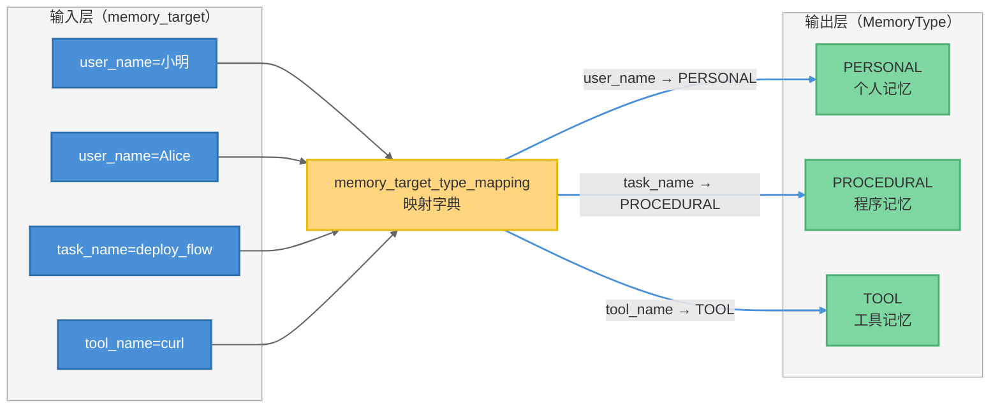

### 1.3 记忆节点数据结构（MemoryNode）

每条记忆以 `MemoryNode` 为核心数据模型，包含 13 个字段：

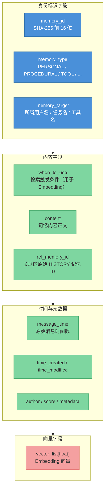

**关键设计**：`when_to_use` 与 `content` 分离——`when_to_use` 描述"何时应该想到这条记忆"，用于 Embedding 向量化检索；`content` 存储实际内容，注入 LLM 上下文。转换为 `VectorNode` 时，`when_to_use` 作为向量内容，`content` 存入 metadata。

---

## 二、记忆存储时机与触发条件

### 2.1 向量化记忆系统（ReMe）的存储时机

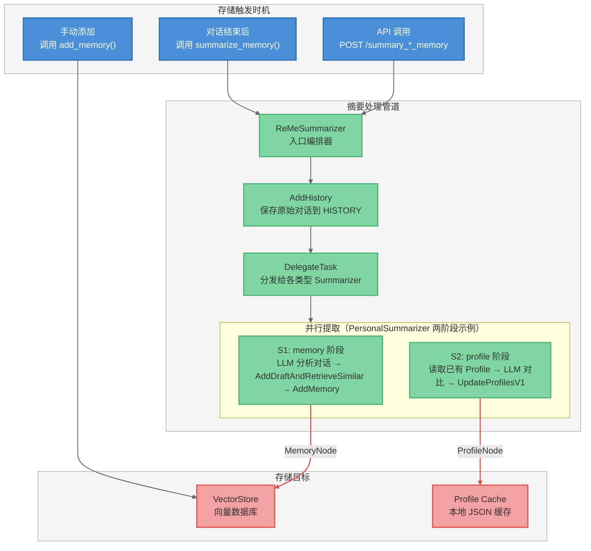

#### 存储时机详解

| 时机 | 触发方式 | 存储内容 | 代码入口 |
|------|---------|---------|---------|
| **对话结束** | 调用 `reme.summarize_memory(messages, user_name="小明")` | 从对话中提取 Personal/Procedural/Tool 记忆 | `reme/reme.py::summarize_memory()` |
| **手动添加** | 调用 `reme.add_memory(content, user_name="小明")` | 直接写入指定类型的记忆 | `reme/reme.py::add_memory()` |
| **API 触发** | `POST /summary_personal_memory` 等 | 通过 HTTP/MCP 服务触发摘要流程 | `reme_ai/service/` |

### 2.2 文件化记忆系统（ReMeLight）的存储时机

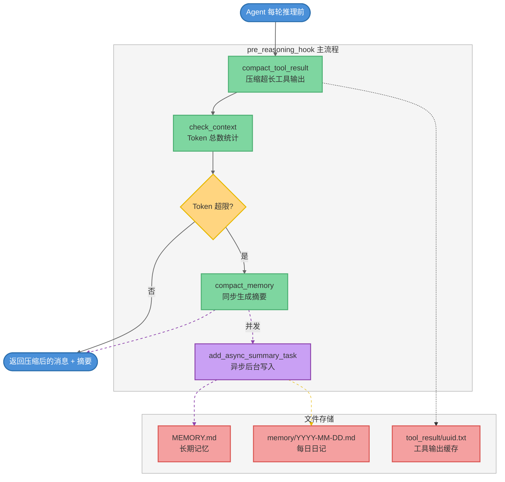

**核心区别**：ReMeLight 的存储是**被动触发**（Token 超限时自动压缩），而向量化 ReMe 的存储是**主动调用**（对话结束后显式触发摘要）。

### 2.3 PersonalSummarizer 两阶段存储流程

PersonalSummarizer 是处理用户身份与偏好信息的核心组件，采用两阶段设计：

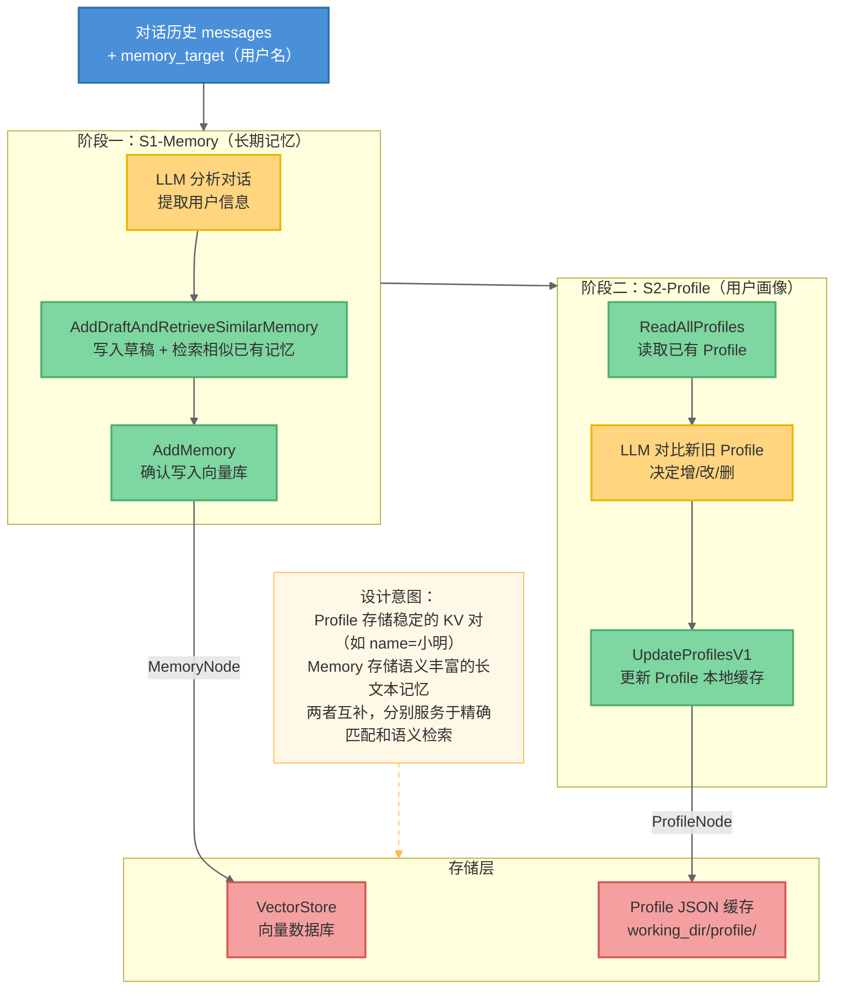

---

## 三、记忆读取时机与检索策略

### 3.1 向量化记忆的检索时机

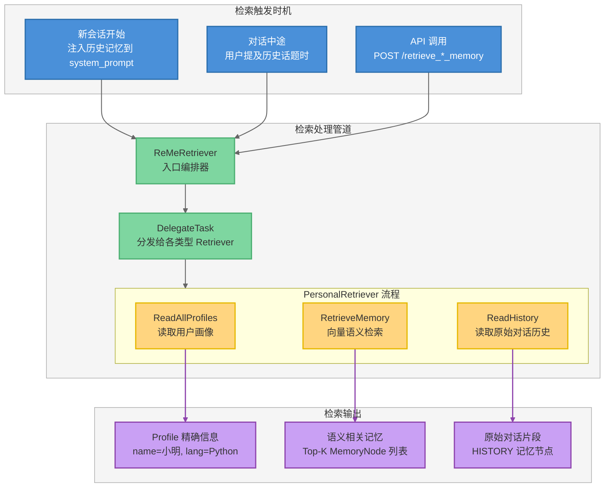

### 3.2 文件化记忆的检索时机

ReMeLight 通过 `memory_search()` 方法提供混合检索，由用户或 Agent 主动触发：

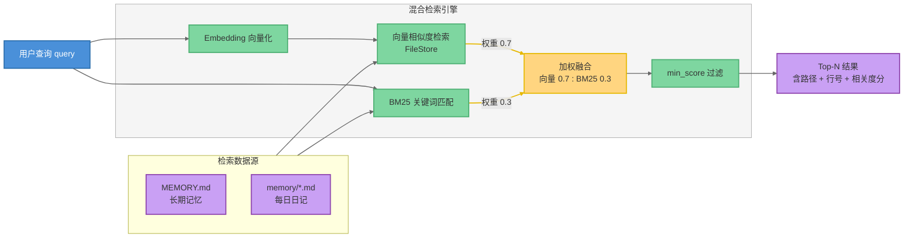

### 3.3 检索时机对照表

| 时机 | 向量化 ReMe | 文件化 ReMeLight |
|------|------------|-----------------|
| **新会话开始** | `retrieve_memory(query, user_name)` 注入 system_prompt | `memory_search(query)` 按需触发 |
| **每轮推理前** | 不自动触发（需外部编排） | `pre_reasoning_hook` 自动压缩上下文 |
| **用户主动搜索** | `retrieve_memory(query)` | `memory_search(query)` |
| **摘要过程中** | `AddDraftAndRetrieveSimilarMemory` 检索相似记忆以去重 | 无（Summarizer 通过文件 IO 工具读取） |

---

## 四、记忆全生命周期：一次对话的完整旅程

### 4.1 向量化 ReMe 的完整生命周期

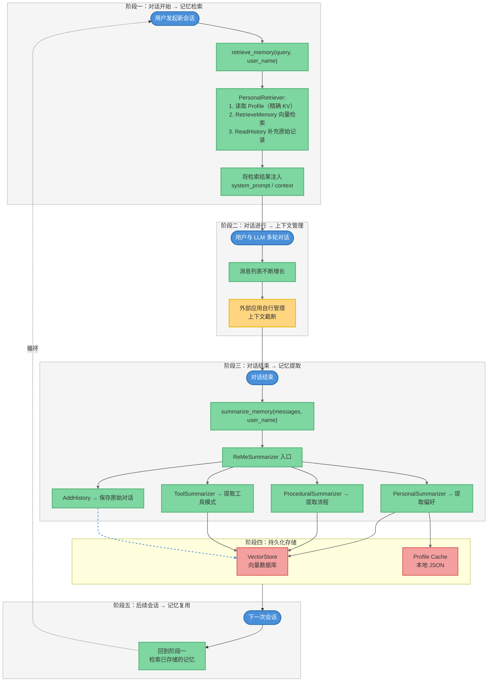

### 4.2 文件化 ReMeLight 的完整生命周期

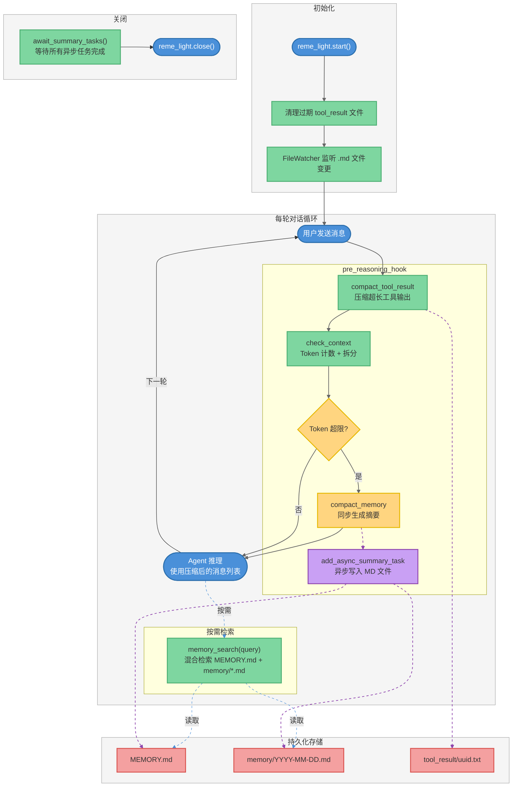

---

## 五、场景剖析：用户编造多个身份时的记忆处理

### 5.1 场景描述

假设用户在对话中依次声明了多个身份：

- 第 1 轮："我叫小明，是一名后端工程师"
- 第 5 轮："其实我叫小红，我是一名设计师"
- 第 10 轮："我真名叫张伟，在腾讯做产品经理"

系统如何处理这些矛盾的身份信息？

### 5.2 处理流程全景

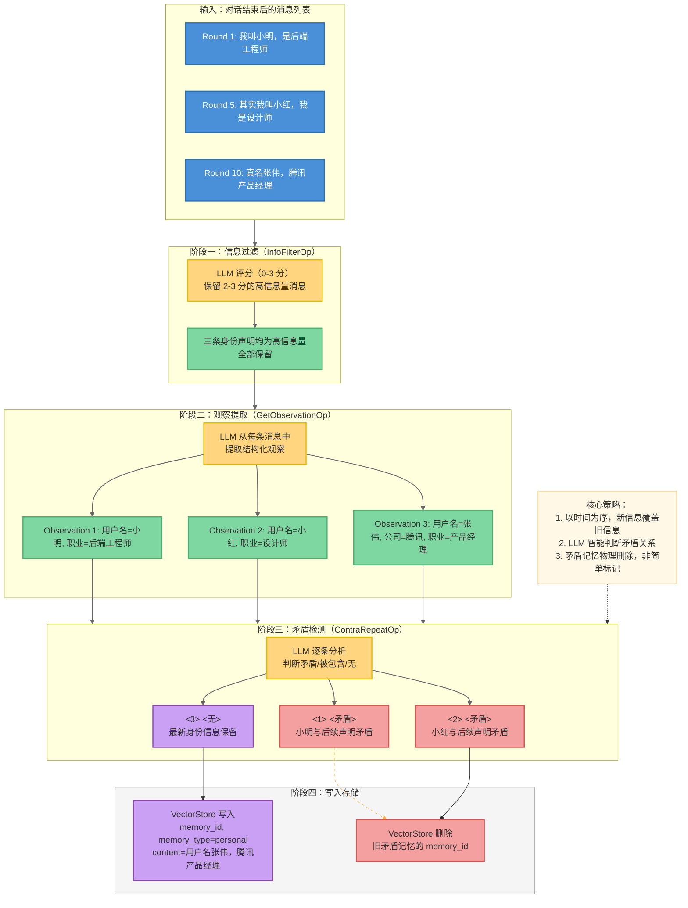

### 5.3 各环节详细处理机制

#### 5.3.1 信息过滤（InfoFilterOp）

位于 `reme_ai/summary/personal/info_filter_op.py`，负责**第一道筛选**：

- **输入**：原始对话消息列表
- **处理**：LLM 为每条用户消息打分（0-3 分），只保留分数为 2 或 3 的高信息量消息
- **过滤条件**：跳过已标记 `memorized=True` 的消息、只处理 `role=user` 的消息
- **身份场景**：三条身份声明都包含用户关键信息，均会获得高分并保留

#### 5.3.2 观察提取（GetObservationOp）

位于 `reme_ai/summary/personal/get_observation_op.py`，负责**结构化提取**：

- **输入**：过滤后的消息列表
- **处理**：LLM 从每条消息中提取 `{index, content, keywords}` 结构化观察
- **输出**：`PersonalMemory` 对象列表，每个包含 `when_to_use`（检索关键词）和 `content`（观察内容）
- **身份场景**：每条身份声明生成独立的 Observation，关键词可能为"用户名"、"职业"等

#### 5.3.3 矛盾检测（ContraRepeatOp）

位于 `reme_ai/summary/personal/contra_repeat_op.py`，是**身份冲突处理的核心**：

```python
# 解析 LLM 判定结果，标记为 矛盾/被包含/无
pattern = r"<(\d+)>\s*<(矛盾|被包含|无|Contradiction|Contained|None)>"
matches = re.findall(pattern, response_text, re.IGNORECASE)

for idx_str, judgment in matches:
    judgment_lower = judgment.lower()
    if judgment_lower in ["矛盾", "contradiction", "被包含", "contained"]:
        indices_to_remove.add(idx)
        deleted_memory_ids.append(memories[idx].memory_id)
```

- **矛盾（Contradiction）**：两条记忆内容互相排斥 → 删除旧的
- **被包含（Contained）**：新记忆已涵盖旧记忆 → 删除旧的
- **无（None）**：两条记忆无冲突 → 全部保留

#### 5.3.4 Profile 更新（UpdateProfilesV1）

在 PersonalSummarizer 的第二阶段中，Profile 处理通过 `ProfileHandler` 实现**精确 KV 覆盖**：

```python
# reme/memory/vector_tools/profiles/profile_handler.py
def add(self, message_time, profile_key, profile_value, ref_memory_id=""):
    nodes = self._load_nodes()
    new_node = MemoryNode(
        memory_type=MemoryType.PERSONAL,
        when_to_use=profile_key,   # 如 "用户名"
        content=profile_value,      # 如 "张伟"
    )
    # 同一 profile_key 自动覆盖旧值
    nodes = [n for n in nodes if n.when_to_use != profile_key]
    nodes.append(new_node)
    self._save_nodes(nodes)
```

**关键机制**：相同 `profile_key` 的旧 Profile 会被自动删除，新值直接覆盖。因此：
- "用户名=小明" → 被覆盖为 "用户名=小红" → 最终变为 "用户名=张伟"

### 5.4 最终存储状态

经过完整处理流程后，系统中的记忆状态如下：

| 存储位置 | 内容 | 状态 |
|---------|------|------|
| **Profile 缓存** | `用户名: 张伟` | 最新值（旧值已被覆盖） |
| **Profile 缓存** | `职业: 产品经理` | 最新值 |
| **Profile 缓存** | `公司: 腾讯` | 新增 |
| **VectorStore** | "用户名张伟，腾讯产品经理" | 保留（最新记忆） |
| **VectorStore** | "用户名小明，后端工程师" | **已删除**（矛盾记忆） |
| **VectorStore** | "用户名小红，设计师" | **已删除**（矛盾记忆） |
| **VectorStore（HISTORY）** | 完整原始对话记录 | 保留（不受矛盾检测影响） |

### 5.5 下次对话的检索结果

当用户在下一次会话中问"你知道我是谁吗？"时：

1. **Profile 精确匹配**：返回 `用户名: 张伟, 职业: 产品经理, 公司: 腾讯`
2. **向量语义检索**：返回 "用户名张伟，腾讯产品经理" 的记忆节点
3. **HISTORY 回溯**（如需要）：可追溯到包含所有身份声明的原始对话

---

## 六、双系统架构对比：向量化 vs 文件化

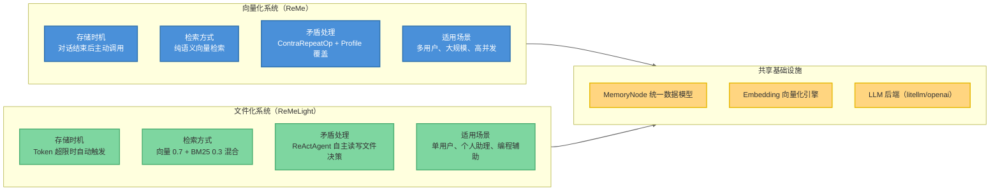

| 维度 | 向量化 ReMe | 文件化 ReMeLight |
|------|------------|-----------------|
| **存储介质** | 向量数据库（local/chroma/qdrant/es/pg） | Markdown 文件 + FileStore 索引 |
| **身份记忆** | MemoryNode + ProfileHandler（双重存储） | Summarizer 写入 MEMORY.md |
| **矛盾检测** | ContraRepeatOp（LLM 判定 + 物理删除） | Summarizer Agent 自行决策更新 |
| **检索精度** | 纯语义检索（依赖 Embedding 质量） | 混合检索（语义 + 关键词，互补性更强） |
| **可读性** | 低（向量不可直接阅读） | 高（直接查看 Markdown 文件） |
| **数据隔离** | `memory_target` 字段逻辑隔离 | 文件目录物理隔离 |

---

## 七、关键技术细节

### 7.1 memory_id 生成机制

```python
# reme/core/schema/memory_node.py
def _update_memory_id(self) -> "MemoryNode":
    hash_obj = hashlib.sha256(self.content.encode("utf-8"))
    hex_dig = hash_obj.hexdigest()
    self.memory_id = hex_dig[:16]  # 取 SHA-256 前 16 位
```

**设计含义**：相同内容生成相同 ID，天然去重；内容修改自动更新 ID 和 `time_modified`。

### 7.2 when_to_use → VectorNode 转换

```python
# reme/core/schema/memory_node.py::to_vector_node()
if self.when_to_use:
    vector_content = self.when_to_use    # 用 when_to_use 做 Embedding
    metadata["content"] = self.content   # 实际内容存入 metadata
else:
    vector_content = self.content         # 无 when_to_use 时直接用 content
```

### 7.3 Profile 容量管理

```python
# reme/memory/vector_tools/profiles/profile_handler.py
def _save_nodes(self, nodes, apply_limits=True):
    if apply_limits:
        nodes = deduplicate_memories(nodes)
        if len(nodes) > self.max_capacity:  # 默认 50
            sorted_nodes = sorted(nodes, key=lambda n: n.message_time)
            nodes = sorted_nodes[removed_count:]  # 移除最早的
```

**容量策略**：去重 → 容量检查 → 超限则移除最早的 Profile → 保证最新信息不丢失。

### 7.4 向量检索过滤机制

```python
# reme/memory/vector_tools/record/memory_handler.py::search()
filters = filters or {}
filters["memory_type"] = self.memory_type.value    # 按记忆类型过滤
filters["memory_target"] = self.memory_target      # 按目标用户/任务过滤
vector_nodes = await self.vector_store.search(query, limit=limit, filters=filters)
```

检索时**必须指定** `memory_type` 和 `memory_target`，确保不同用户/类型的记忆严格隔离。

### 7.5 异步摘要的安全保障

```python
# reme/reme_light.py::pre_reasoning_hook()
self.add_async_summary_task(messages=messages_to_compact)  # 后台异步
compressed_summary = await self.compact_memory(messages)    # 同步返回

# 应用关闭前必须调用
await reme_light.await_summary_tasks()  # 等待所有后台任务完成
```

---

## 八、面试常见问题 FAQ

### 记忆类型与分类

**Q1：ReMe 的 6 种记忆类型分别用于什么场景？如何决定一条信息属于哪种类型？**

A：6 种类型覆盖了智能体记忆的完整语义空间：IDENTITY 和 PERSONAL 用于用户相关信息（身份 vs 偏好），PROCEDURAL 用于操作流程知识，TOOL 用于工具使用经验，SUMMARY 用于大块记忆的压缩，HISTORY 用于原始记录保存。类型的判定不依赖规则匹配，而是通过 `memory_target_type_mapping` 配置映射——初始化时声明 `target_user_names` 映射到 PERSONAL，`target_task_names` 映射到 PROCEDURAL 等。具体内容的提取则交由 LLM 完成（PersonalSummarizer / ProceduralSummarizer / ToolSummarizer）。

---

**Q2：IDENTITY 和 PERSONAL 有什么区别？代码中如何处理两者的边界？**

A：从枚举定义看，IDENTITY 指"长期稳定的身份属性"（如姓名、角色），PERSONAL 指"偏好、习惯、个人上下文"（如编程语言偏好）。但在当前实现中，两者的边界由 LLM 在摘要阶段自行判断。Profile 系统实际上同时服务于两者——`profile_key` 为 "用户名" 属于 IDENTITY，为 "偏好语言" 属于 PERSONAL。代码中 `ProfileHandler` 统一使用 `MemoryType.PERSONAL`，不做细粒度区分，这是一个可以扩展的设计空间。

---

**Q3：when_to_use 和 content 为什么要分离？这样做有什么实际好处？**

A：这是 ReMe 检索设计的核心创新。直接对 content 做 Embedding 时，语义是"记忆说了什么"，但检索时用户的查询表达的是"我需要什么"。两者的语义空间不对齐。`when_to_use` 描述"在什么场景下应该想到这条记忆"，与用户查询的语义空间更接近。例如：一条记忆的 content 是 "用户习惯在 MacOS 上用 iTerm2 终端"，when_to_use 是 "当用户问到终端工具推荐或开发环境配置时"。用户问"推荐个终端工具"时，和 when_to_use 的语义匹配度远高于直接匹配 content。

---

### 存储与检索机制

**Q4：向量化 ReMe 和文件化 ReMeLight 的存储时机为什么不同？各自适合什么场景？**

A：向量化 ReMe 的存储是**主动调用**（对话结束后调用 `summarize_memory()`），因为向量化摘要涉及多轮 LLM 调用（提取 → 去重 → 矛盾检测 → 写入），成本较高，适合在对话结束后批量处理。文件化 ReMeLight 的存储是**被动触发**（Token 超限时自动压缩），因为文件写入的成本低、延迟小，适合在对话过程中实时管理上下文。前者适合多用户大规模场景，后者适合个人助理等实时交互场景。

---

**Q5：混合检索（向量 + BM25）为什么权重是 0.7:0.3？可以调整吗？**

A：0.7:0.3 是经验值。向量检索擅长语义匹配（如 "Python 偏好" 能匹配 "喜欢 Pythonic 风格"），权重高合理。BM25 擅长精确匹配专有名词（如函数名、工具名），权重低但不可或缺。可以通过 `ReMeLight.__init__(vector_weight=0.8)` 自定义调整。建议对特定领域（如代码辅助场景关键词多）适当提高 BM25 权重。

---

**Q6：`AddDraftAndRetrieveSimilarMemory` 工具的作用是什么？为什么在添加记忆前先检索？**

A：这是摘要阶段的去重机制。LLM 在提取新记忆前，先将"草稿"写入临时存储，然后检索向量库中与草稿相似的已有记忆（Top-K）。如果发现高度相似的记忆已存在，LLM 可以决定：①跳过（完全重复）、②更新已有记忆（补充新信息）、③写入新记忆（有新的独立信息）。这避免了记忆库中大量语义重复的条目，保持记忆库的信噪比。

---

### 身份冲突处理

**Q7：用户在对话中编造了多个矛盾的身份，系统如何判断哪个是"真实"的？**

A：系统**不判断真假**，而是采用"**后到者优先**"策略。ContraRepeatOp 按时间排序（`sorted by time_created, reverse=True`）后让 LLM 逐条分析矛盾关系。较新的声明被视为"当前有效信息"，较旧的矛盾声明被标记为"矛盾"并删除。同时，Profile 系统对相同 `profile_key` 直接覆盖（`nodes = [n for n in nodes if n.when_to_use != profile_key]`），天然保留最新值。原始 HISTORY 记忆不受影响，始终保留完整对话记录以供追溯。

---

**Q8：ContraRepeatOp 的 LLM 判定可能出错吗？如何保障记忆质量？**

A：LLM 判定确实可能出错（如将两条不矛盾的记忆误判为矛盾）。ReMe 的多层防护机制包括：①`InfoFilterOp` 先过滤低信息量消息，减少噪声输入；②`contra_repeat_max_count` 限制单次分析的记忆数量（默认 50），避免 LLM 上下文过长导致判断失误；③`enable_contra_repeat` 配置开关，可在不需要时关闭矛盾检测；④ HISTORY 类型记忆始终保留原始记录，即使提炼后的记忆出错，也可追溯原始对话。

---

**Q9：Profile 的 max_capacity=50 限制是怎么考虑的？超限了怎么办？**

A：50 是一个平衡精度和效率的经验值。Profile 用于存储稳定的 KV 属性，50 条足以覆盖大多数用户画像维度。超限时系统按 `message_time` 排序，移除最早的 Profile（`sorted_nodes[removed_count:]`），保留最新信息。这基于"越新的信息越可能反映当前状态"的假设。如果业务需要更大容量，可通过 `ProfileHandler(max_capacity=100)` 调整。

---

### 架构与性能

**Q10：pre_reasoning_hook 中为什么同步压缩和异步持久化要分开？能否全部异步？**

A：不能全部异步。`compact_memory`（同步）生成的摘要需要**立即返回**给下一轮推理使用——Agent 需要知道"之前聊了什么"才能继续回答。而 `summary_memory`（异步）将详细记忆写入 Markdown 文件是为了长期存储，当前推理不依赖它。如果全部异步，Agent 在推理时会丢失上下文历史。如果全部同步，文件写入的延迟（涉及 LLM 调用 + 文件 IO）会阻塞用户交互。"同步摘要 + 异步持久化"是延迟和完整性的最优平衡。

---

**Q11：check_context 的 is_valid 校验如何保证不拆散工具调用对？**

A：LLM 的消息中 `tool_use`（工具调用请求）和 `tool_result`（工具返回结果）必须成对出现。`ContextChecker` 在拆分消息时检查拆分边界：如果 `to_keep` 列表中有 `tool_result` 但对应的 `tool_use` 在 `to_compact` 中（或反之），则 `is_valid=False`。此时系统不进行压缩，直接返回原消息。这避免了 LLM 收到不完整的工具上下文后产生幻觉。

---

**Q12：Embedding 缓存在多实例部署时如何保证一致性？**

A：当前版本的 Embedding 缓存是**进程内的**（`reme.start()` 加载，`reme.close()` 保存），多实例部署时确实可能出现缓存不一致。解决方案有：①单实例部署（小规模场景）；②使用外部缓存（如 Redis）替换本地缓存；③使用支持内置缓存的向量数据库后端（如 Qdrant），直接跳过应用层缓存。生产环境建议方案②或③。

---

**Q13：向量化记忆的 batch_search 中 hybrid_threshold 有什么作用？**

A：`hybrid_threshold` 用于多查询场景的质量控制。当同时用多个 query 检索时（如从对话中提取多个关键问题），系统对每个结果计算"在所有 query 上的平均相似度"。低于 `hybrid_threshold` 的结果被过滤掉。这确保返回的记忆不是只和某一个 query 相关，而是对整体上下文都有价值。没有设置 `hybrid_threshold` 时退化为简单的多查询去重合并。

---

**Q14：如何在生产环境中监控记忆系统的健康状态？**

A：当前版本提供的监控手段：①`GET /health` 健康检查端点，可接入 Kubernetes readinessProbe；②`ReMeInMemoryMemory.estimate_tokens()` 返回 `context_usage_ratio`，可监控上下文占用率；③ Loguru 日志记录每次压缩前后的 Token 数量（如 `before_token_count=223838 after_token_count=1105`），可用于统计压缩效率。建议补充：①记忆库条目数量监控；②向量检索延迟监控；③ LLM 调用成功率和 Token 消耗监控。

---

**Q15：ReMe 如何防止"记忆幻觉"——系统错误地记住了用户没说过的信息？**

A：ReMe 通过多个环节降低记忆幻觉风险：①`InfoFilterOp` 只保留高信息量消息（评分 2-3），过滤噪声；②`GetObservationOp` 提取观察时要求 LLM 引用原始消息索引，可追溯；③`ContraRepeatOp` 检测并删除矛盾记忆；④`ref_memory_id` 字段将提炼后的记忆关联到原始 HISTORY 记录，支持溯源验证；⑤ HaluMem 评测基准专门用于测量记忆幻觉率，ReMe 在该基准上的 Hallucination rate 为 11.59%（可通过模型选择和 Prompt 优化进一步降低）。

---

> 本文档基于 ReMe v0.3.0.6b3 源码分析编写。如需验证具体实现细节，请参照对应源码文件。
> 相关文档：[ReMe 架构分析文档](./ReMe_架构分析文档.md)
