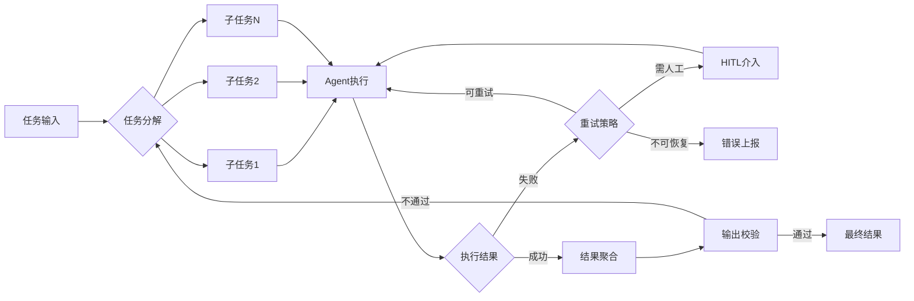

# Agent Harness 工程学习指南

> 基于 [Harness-工程架构图](./Harness-工程架构图.md) 的深度延伸学习文档

---

## 一、什么是 Agent Harness 工程？

**Harness**（线束/驾驭）工程是三层 AI 工程体系的**最外层保障层**，它解决的核心问题是：

> **"怎么让模型在真实执行中，持续地做对事情？"**

与 Prompt Engineering（讲清楚任务）、Context Engineering（给对信息）不同，Harness Engineering 关注的是**系统执行层面的可靠性、安全性与可控性**。

```
Harness Engineering（系统边界 / 执行保障）
  └── Context Engineering（信息供给 / 知识检索）
        └── Prompt Engineering（意图表达 / 任务设定）
```

---

## 二、Harness 工程核心能力域

### 2.1 执行安全与沙箱隔离
- **工具调用沙箱**：限制 Agent 可调用的工具范围，防止越权操作
- **代码执行隔离**：使用容器/VM 隔离 Agent 生成的代码执行环境
- **资源限制**：CPU、内存、网络访问的硬性约束

### 2.2 状态管理与持久化
- **会话状态（Session State）**：跨 turn 的记忆与上下文传递
- **任务状态机（Task State Machine）**：pending → running → success/failed 流转
- **检查点机制（Checkpoint）**：长任务的中断恢复能力

### 2.3 多 Agent 编排
- **任务分解（Task Decomposition）**：将复杂任务拆分给不同专家 Agent
- **协作协议（Collaboration Protocol）**：Agent 间的消息传递与结果聚合
- **角色定义（Role Definition）**：Orchestrator、Executor、Critic 等角色划分

### 2.4 可观测性与监控
- **执行轨迹追踪（Trace）**：记录每一步的输入/输出/工具调用
- **指标采集（Metrics）**：成功率、延迟、Token 消耗、重试次数
- **日志结构化（Structured Logging）**：便于问题复盘与分析

### 2.5 错误处理与重试
- **失败分类**：模型幻觉 / 工具调用失败 / 超时 / 权限拒绝
- **重试策略**：指数退避、最大重试次数、fallback 模型
- **人类反馈介入（HITL）**：关键节点暂停等待人工确认

### 2.6 评估与测试（Eval）
- **行为基准测试**：给定输入，验证 Agent 的行为是否符合预期
- **回归测试**：防止模型/提示词升级后引发行为退化
- **对抗测试**：模拟恶意输入验证 Agent 健壮性

---

## 三、学习路径建议

### 阶段 1：基础概念（1-2 周）
- [ ] 理解 LLM Agent 基本架构（ReAct、Plan-and-Execute）
- [ ] 掌握 Tool Calling / Function Calling 机制
- [ ] 了解 Agent 的典型失败模式（幻觉、循环、偏移）

**推荐资料：**
- [LLM Powered Autonomous Agents - Lilian Weng](https://lilianweng.github.io/posts/2023-06-23-agent/)
- [ReAct: Synergizing Reasoning and Acting in Language Models](https://arxiv.org/abs/2210.03629)

### 阶段 2：框架实践（2-4 周）
- [ ] 使用 LangGraph 或 AutoGen 跑通一个多 Agent 示例
- [ ] 自己实现一个带工具调用 + 重试机制的简单 Agent
- [ ] 阅读至少一个开源项目的 Harness 层源码

### 阶段 3：工程深化（1-2 月）
- [ ] 搭建 Agent 可观测性体系（Trace + Metrics）
- [ ] 设计并实现 Agent 评估流水线（Eval Pipeline）
- [ ] 研究沙箱隔离方案（E2B、Modal、Docker）
- [ ] 实践 Human-in-the-loop 控制流

### 阶段 4：生产实战
- [ ] 设计多 Agent 系统的错误传播与熔断机制
- [ ] 进行负载测试与并发 Agent 调度优化
- [ ] 建立 Agent 行为的 A/B 测试能力

---

## 四、优秀开源项目推荐

### 🏗️ 多 Agent 编排框架

#### 1. LangGraph
> **定位**：基于图（Graph）的有状态多 Agent 编排框架，LangChain 生态核心
> **亮点**：状态机 + 循环图支持、人类介入节点、持久化检查点、流式输出
> **适合**：需要复杂控制流、长任务、HITL 场景

**GitHub**：[https://github.com/langchain-ai/langgraph](https://github.com/langchain-ai/langgraph)

---

#### 2. Microsoft AutoGen
> **定位**：多 Agent 对话框架，Agent 之间通过"对话"协作完成任务
> **亮点**：支持人类代理角色、代码执行沙箱、群聊模式、工具使用
> **适合**：研究多 Agent 协作、代码生成场景

**GitHub**：[https://github.com/microsoft/autogen](https://github.com/microsoft/autogen)

---

#### 3. CrewAI
> **定位**：角色扮演式多 Agent 框架，每个 Agent 有明确职责与目标
> **亮点**：Crew（团队）概念、任务依赖关系、Agent 角色内存
> **适合**：业务流程自动化、内容生产流水线

**GitHub**：[https://github.com/crewAIInc/crewAI](https://github.com/crewAIInc/crewAI)

---

#### 4. Semantic Kernel（微软）
> **定位**：企业级 AI 编排 SDK，支持 Python / C# / Java
> **亮点**：Plugin 体系、Plan 生成、Memory 管理、与 Azure 深度集成
> **适合**：企业 .NET 生态、生产级 Agent 应用

**GitHub**：[https://github.com/microsoft/semantic-kernel](https://github.com/microsoft/semantic-kernel)

---

### 🧪 Agent 评估与基准测试

#### 5. AgentBench
> **定位**：系统性评估 LLM 作为 Agent 能力的基准测试框架
> **亮点**：8 类真实环境任务（OS、DB、Web、游戏等）、标准化评测流程
> **适合**：研究 Agent 能力边界、对比不同模型 Agent 表现

**GitHub**：[https://github.com/THUDM/AgentBench](https://github.com/THUDM/AgentBench)

---

#### 6. EvalPlus
> **定位**：代码生成 Agent 的严格评估框架
> **亮点**：比 HumanEval 更难的测试集、自动生成边界测试用例
> **适合**：评估编程 Agent 的真实代码质量

**GitHub**：[https://github.com/evalplus/evalplus](https://github.com/evalplus/evalplus)

---

### 🤖 软件工程 Agent（最接近 Harness 实践）

#### 7. SWE-agent（普林斯顿）
> **定位**：让 LLM 自主解决 GitHub Issue 的端到端 Agent 系统
> **亮点**：Agent-Computer Interface（ACI）设计、完整的执行沙箱、基准测试集 SWE-bench
> **适合**：深度学习 Harness 工程设计（工具接口、执行隔离、任务评估）

**GitHub**：[https://github.com/princeton-nlp/SWE-agent](https://github.com/princeton-nlp/SWE-agent)

---

#### 8. OpenHands（原 OpenDevin）
> **定位**：面向软件开发的开放 Agent 平台
> **亮点**：沙箱 Docker 执行环境、多 Agent 运行时、Web UI、完整工具链
> **适合**：学习生产级 Agent 平台架构，Harness 层最佳实践

**GitHub**：[https://github.com/All-Hands-AI/OpenHands](https://github.com/All-Hands-AI/OpenHands)

---

#### 9. Agentless
> **定位**：无 Agent 框架依赖的极简软件工程 Agent
> **亮点**：三阶段流程（定位→编辑→验证）、思路清晰、易于理解 Harness 设计
> **适合**：理解最小化 Harness 设计原则

**GitHub**：[https://github.com/OpenAutoCoder/Agentless](https://github.com/OpenAutoCoder/Agentless)

---

### 🔒 沙箱执行环境

#### 10. E2B
> **定位**：专为 AI Agent 设计的云端代码执行沙箱
> **亮点**：毫秒级启动、安全隔离、支持 Python/Node.js/Bash、API 友好
> **适合**：给 Agent 提供安全可靠的代码执行能力

**GitHub**：[https://github.com/e2b-dev/e2b](https://github.com/e2b-dev/e2b)

---

### 📊 可观测性工具

#### 11. LangSmith（LangChain）
> **定位**：LLM 应用的全链路追踪与评估平台
> **亮点**：Trace 可视化、数据集管理、在线评估、与 LangChain/LangGraph 原生集成
> **适合**：为 Agent 系统添加观测能力

**GitHub（SDK）**：[https://github.com/langchain-ai/langsmith-sdk](https://github.com/langchain-ai/langsmith-sdk)

---

#### 12. Langfuse
> **定位**：开源 LLM 可观测性平台（可自托管）
> **亮点**：Trace/Span 追踪、Prompt 版本管理、评估指标、成本追踪
> **适合**：不想依赖 LangChain 生态的团队

**GitHub**：[https://github.com/langfuse/langfuse](https://github.com/langfuse/langfuse)

---

## 五、项目推荐速查表

| 项目 | 类型 | 难度 | 学习价值 | GitHub |
|------|------|------|----------|--------|
| LangGraph | 编排框架 | ⭐⭐⭐ | 状态机/控制流 | [链接](https://github.com/langchain-ai/langgraph) |
| AutoGen | 多Agent对话 | ⭐⭐ | 协作协议 | [链接](https://github.com/microsoft/autogen) |
| CrewAI | 角色编排 | ⭐⭐ | 角色/任务设计 | [链接](https://github.com/crewAIInc/crewAI) |
| Semantic Kernel | 企业SDK | ⭐⭐⭐ | 企业级架构 | [链接](https://github.com/microsoft/semantic-kernel) |
| AgentBench | 评估基准 | ⭐⭐⭐ | 评估体系 | [链接](https://github.com/THUDM/AgentBench) |
| SWE-agent | 软件工程Agent | ⭐⭐⭐⭐ | ACI设计 | [链接](https://github.com/princeton-nlp/SWE-agent) |
| OpenHands | Agent平台 | ⭐⭐⭐⭐ | 全栈Harness | [链接](https://github.com/All-Hands-AI/OpenHands) |
| Agentless | 极简Agent | ⭐⭐ | 核心流程 | [链接](https://github.com/OpenAutoCoder/Agentless) |
| E2B | 沙箱环境 | ⭐⭐ | 执行隔离 | [链接](https://github.com/e2b-dev/e2b) |
| Langfuse | 可观测性 | ⭐⭐ | 监控追踪 | [链接](https://github.com/langfuse/langfuse) |

---

## 六、Harness 工程关键设计模式



---

## 七、快速上手代码示例

### LangGraph 最简状态机 Agent

```python
from langgraph.graph import StateGraph, END
from typing import TypedDict, Annotated
import operator

class AgentState(TypedDict):
    messages: Annotated[list, operator.add]
    retry_count: int

def agent_node(state: AgentState):
    # 调用 LLM，获取下一步行动
    ...
    return {"messages": [response]}

def tool_node(state: AgentState):
    # 执行工具调用
    ...
    return {"messages": [tool_result]}

def should_retry(state: AgentState):
    if state["retry_count"] > 3:
        return "end"
    return "agent"

# 构建图
graph = StateGraph(AgentState)
graph.add_node("agent", agent_node)
graph.add_node("tools", tool_node)
graph.add_edge("tools", "agent")
graph.add_conditional_edges("agent", should_retry, {"agent": "agent", "end": END})
graph.set_entry_point("agent")

app = graph.compile()
```

---

*文档创建时间：2026-04-04*
*关联架构图：[Harness-工程架构图.md](./Harness-工程架构图.md)*
