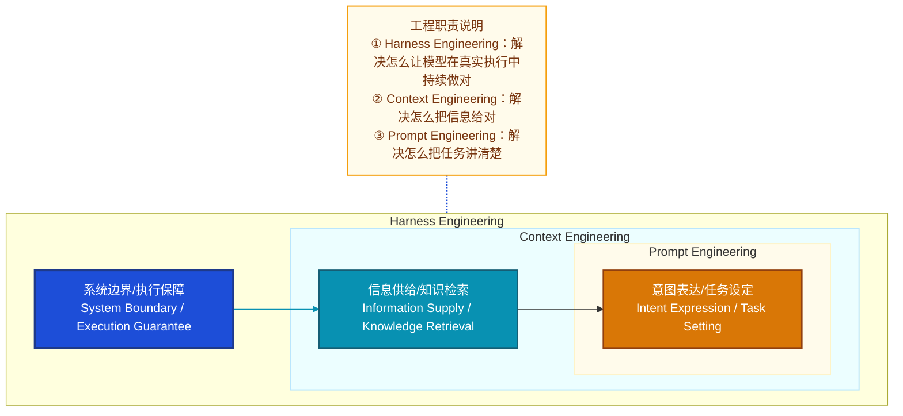

# Harness-工程架构图

```mermaid
flowchart TB
    %% ── 配色主题：现代渐变紫蓝，按职责区分层次 ─────────────────────
    classDef harnessStyle fill:#1d4ed8,stroke:#1e3a8a,stroke-width:2.5px,color:#fff
    classDef contextStyle fill:#0891b2,stroke:#155e75,stroke-width:2px,color:#fff
    classDef promptStyle fill:#d97706,stroke:#92400e,stroke-width:2px,color:#fff
    classDef harnessLayerStyle fill:#eff6ff,stroke:#bfdbfe,stroke-width:1.5px
    classDef contextLayerStyle fill:#ecfeff,stroke:#bae6fd,stroke-width:1.5px
    classDef promptLayerStyle fill:#fffbeb,stroke:#fef3c7,stroke-width:1.5px
    classDef noteStyle fill:#fffbeb,stroke:#f59e0b,stroke-width:1.5px,color:#78350f

    %% ── Harness Engineering 层（最外层） ─────────────────────────────
    subgraph Harness["Harness Engineering"]
        direction LR
        HARNESS["系统边界/执行保障<br>System Boundary / Execution Guarantee"]:::harnessStyle
        
        %% ── Context Engineering 层 ───────────────────────────────────
        subgraph Context["Context Engineering"]
            direction LR
            CONTEXT["信息供给/知识检索<br>Information Supply / Knowledge Retrieval"]:::contextStyle
            
            %% ── Prompt Engineering 层 ───────────────────────────────
            subgraph Prompt["Prompt Engineering"]
                direction LR
                PROMPT["意图表达/任务设定<br>Intent Expression / Task Setting"]:::promptStyle
            end
            class Prompt promptLayerStyle
        end
        class Context contextLayerStyle
    end
    class Harness harnessLayerStyle

    %% ── 设计注记 ─────────────────────────────────────────────────────
    NOTE["工程职责说明<br>① Harness Engineering：解决怎么让模型在真实执行中持续做对<br>② Context Engineering：解决怎么把信息给对<br>③ Prompt Engineering：解决怎么把任务讲清楚"]:::noteStyle
    NOTE -.- Harness

    %% ── 数据流 ───────────────────────────────────────────────────────
    HARNESS --> CONTEXT
    CONTEXT --> PROMPT

    %% 边索引：0-1，共 2 条
    linkStyle 0 stroke:#1d4ed8,stroke-width:2px
    linkStyle 1 stroke:#0891b2,stroke-width:2px
```