# AgentScope Agent 类型与编排方式深度解析

> 基于 `examples/` 目录下的完整示例，系统梳理 AgentScope 支持的 Agent 类型、配置方法、编排模式，以及在复杂任务场景中的实战用法。

---

## 一、全局架构概览

AgentScope 的 Agent 体系由**核心类层次**、**能力模块**和**编排管道**三部分共同构成。

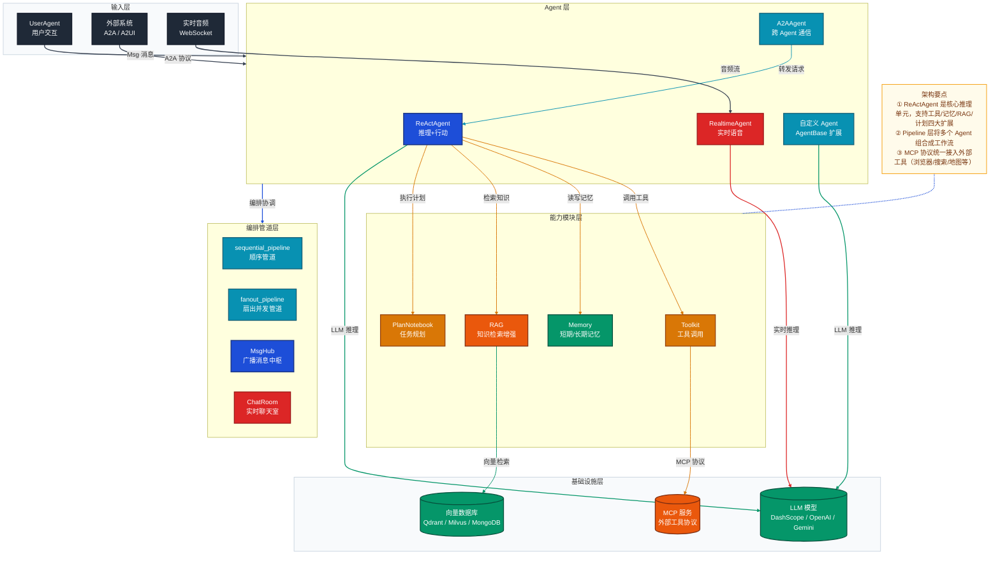

---

## 二、Agent 类型详解

### 2.1 类层次结构

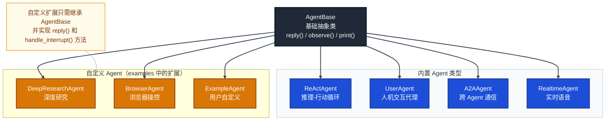

---

### 2.2 ReActAgent — 核心推理 Agent

`ReActAgent` 是 AgentScope 中最核心的 Agent，实现了 **ReAct（Reasoning + Acting）** 循环——在每个迭代步骤中，Agent 先通过 LLM 进行推理，再决定是否调用工具，直到任务完成。

#### 配置参数一览

| 参数 | 类型 | 说明 |
|------|------|------|
| `name` | `str` | Agent 的显示名称 |
| `sys_prompt` | `str` | 系统提示词，定义 Agent 的角色和行为约束 |
| `model` | `ChatModelBase` | 绑定的 LLM 模型实例 |
| `formatter` | `FormatterBase` | 消息格式化器，适配不同 LLM API |
| `toolkit` | `Toolkit` | 工具集，包含可调用的函数和 MCP 工具 |
| `memory` | `MemoryBase` | 短期记忆（默认 `InMemoryMemory`） |
| `plan_notebook` | `PlanNotebook` | 任务规划本，支持多步骤分解 |
| `max_iters` | `int` | ReAct 循环最大迭代次数，防止无限循环 |
| `enable_meta_tool` | `bool` | 是否启用元工具（`finish` 等内置工具） |

#### 最小配置示例

```python
from agentscope.agent import ReActAgent
from agentscope.formatter import DashScopeChatFormatter
from agentscope.model import DashScopeChatModel
from agentscope.tool import Toolkit, execute_shell_command, execute_python_code

toolkit = Toolkit()
toolkit.register_tool_function(execute_shell_command)
toolkit.register_tool_function(execute_python_code)

agent = ReActAgent(
    name="Friday",
    sys_prompt="You are a helpful assistant named Friday.",
    model=DashScopeChatModel(
        api_key=os.environ["DASHSCOPE_API_KEY"],
        model_name="qwen-max",
        stream=True,
    ),
    formatter=DashScopeChatFormatter(),
    toolkit=toolkit,
)
```

> 来源：`examples/agent/react_agent/main.py`

---

### 2.3 UserAgent — 人机交互代理

`UserAgent` 封装了人类用户的输入逻辑，通常作为对话循环的另一端存在，使 Agent 与用户交互保持统一的消息格式。

```python
from agentscope.agent import UserAgent

user = UserAgent(name="User")

# 对话循环
msg = None
while True:
    msg = await user(msg)           # 等待用户在终端输入
    if msg.get_text_content() == "exit":
        break
    msg = await agent(msg)
```

> 来源：`examples/agent/react_agent/main.py`

---

### 2.4 A2AAgent — Agent-to-Agent 通信代理

`A2AAgent` 基于 **Google A2A 协议**，允许 AgentScope Agent 与其他框架（LangChain、CrewAI 等）或远程 Agent 进行标准化通信。其核心是 `AgentCard`，描述 Agent 的能力和接入方式。

#### AgentCard 配置

```python
from a2a.types import AgentCard, AgentCapabilities, AgentSkill

agent_card = AgentCard(
    name="Friday",
    description="A simple ReAct agent that handles input queries",
    url="http://localhost:8000",
    version="1.0.0",
    capabilities=AgentCapabilities(
        push_notifications=False,
        state_transition_history=True,
        streaming=True,
    ),
    default_input_modes=["text/plain"],
    default_output_modes=["text/plain"],
    skills=[
        AgentSkill(
            name="execute_python_code",
            id="execute_python_code",
            description="Execute Python code snippets.",
            tags=["code_execution"],
        ),
    ],
)
```

#### A2A 调用方式

```python
from agentscope.agent import A2AAgent

agent = A2AAgent(agent_card=agent_card)
msg = await agent(user_msg)
```

> 来源：`examples/agent/a2a_agent/`

---

### 2.5 RealtimeAgent — 实时语音 Agent

`RealtimeAgent` 专为**实时音频流**设计，配合 `ChatRoom` 管道实现多 Agent 实时语音对话场景。支持 DashScope、Gemini、OpenAI 三家实时语音模型。

```python
from agentscope.agent import RealtimeAgent
from agentscope.realtime import DashScopeRealtimeModel

agent1 = RealtimeAgent(
    name="Alice",
    sys_prompt="You are a helpful assistant.",
    model=DashScopeRealtimeModel(
        model_name="qwen3-omni-flash-realtime",
        api_key=os.getenv("DASHSCOPE_API_KEY"),
        voice="Dylan",
        enable_input_audio_transcription=False,
    ),
)
```

> 来源：`examples/workflows/multiagent_realtime/run_server.py`

---

### 2.6 自定义 Agent — AgentBase 扩展

通过继承 `AgentBase` 并实现 `reply()` 方法，可创建完全自定义的 Agent 行为。

```python
from agentscope.agent import AgentBase
from agentscope.message import Msg

class MyCustomAgent(AgentBase):

    def __init__(self, name: str) -> None:
        super().__init__()
        self.name = name

    async def reply(self, *args, **kwargs) -> Msg:
        # 自定义逻辑：处理消息、调用外部服务等
        return Msg(self.name, "custom response", "assistant")

    async def handle_interrupt(self, *args, **kwargs) -> Msg:
        pass  # 处理中断信号

    async def observe(self, *args, **kwargs) -> None:
        pass  # 观察外部消息（不回复）
```

> 来源：`examples/workflows/multiagent_concurrent/main.py`

**examples 中的扩展示例：**

| 自定义 Agent | 所在路径 | 扩展内容 |
|---|---|---|
| `DeepResearchAgent` | `examples/agent/deep_research_agent/` | 集成 Tavily 搜索 MCP，支持深度研究流程 |
| `BrowserAgent` | `examples/agent/browser_agent/` | 集成 Playwright MCP，驱动浏览器操作 |
| `ExampleAgent` | `examples/workflows/multiagent_concurrent/` | 模拟并发任务，记录执行时间 |

---

## 三、能力模块配置详解

### 3.1 模型（Model）配置

AgentScope 通过统一的 `ChatModelBase` 接口适配多家 LLM。

| 模型类 | 适用平台 | 典型 model_name |
|--------|----------|-----------------|
| `DashScopeChatModel` | 阿里云百炼 | `qwen-max`, `qwen3-max` |
| `OpenAIChatModel` | OpenAI / 兼容接口 | `gpt-4o`, `qwen3-omni-flash` |
| `DashScopeRealtimeModel` | 阿里云实时语音 | `qwen3-omni-flash-realtime` |
| `GeminiRealtimeModel` | Google Gemini | `gemini-2.5-flash-native-audio-preview` |
| `OpenAIRealtimeModel` | OpenAI 实时 | `gpt-4o-realtime-preview` |

**高级模型参数示例：**

```python
DashScopeChatModel(
    api_key=os.environ["DASHSCOPE_API_KEY"],
    model_name="qwen3-max",
    enable_thinking=False,   # 关闭思维链（加速响应）
    stream=True,             # 流式输出
)
```

---

### 3.2 消息格式化器（Formatter）配置

Formatter 负责将 AgentScope 内部的 `Msg` 对象转换为各 LLM API 所需的请求格式。

| 格式化器 | 适用场景 |
|---------|----------|
| `DashScopeChatFormatter` | 单 Agent 对话（DashScope API） |
| `DashScopeMultiAgentFormatter` | 多 Agent 对话，提示词中出现多个实体时使用 |
| `OpenAIChatFormatter` | OpenAI 兼容 API |

---

### 3.3 工具包（Toolkit）配置

`Toolkit` 是 AgentScope 的工具管理中心，支持三种工具接入方式：

#### 方式一：注册普通 Python 函数

```python
from agentscope.tool import Toolkit, execute_shell_command, execute_python_code, view_text_file

toolkit = Toolkit()
toolkit.register_tool_function(execute_shell_command)
toolkit.register_tool_function(execute_python_code)
toolkit.register_tool_function(view_text_file)
```

#### 方式二：注册 MCP 客户端（外部工具服务）

```python
from agentscope.mcp import HttpStatefulClient, HttpStatelessClient, StdIOStatefulClient

# HTTP SSE 模式（有状态）
add_client = HttpStatefulClient(name="add_mcp", transport="sse", url="http://127.0.0.1:8001/sse")
await add_client.connect()
await toolkit.register_mcp_client(add_client)

# HTTP Streamable 模式（无状态）
multiply_client = HttpStatelessClient(
    name="multiply_mcp", transport="streamable_http", url="http://127.0.0.1:8002/mcp"
)
await toolkit.register_mcp_client(multiply_client)

# stdio 模式（本地进程）
browser_client = StdIOStatefulClient(
    name="playwright-mcp", command="npx", args=["@playwright/mcp@latest"]
)
await browser_client.connect()
await toolkit.register_mcp_client(browser_client)
```

#### 方式三：注册 Agent Skill（知识型技能文件）

```python
toolkit.register_agent_skill("./skill/analyzing-agentscope-library")
```

#### 工具分组管理

```python
toolkit.create_tool_group(group_name="browser_tools", description="Web browsing related tools.")
await toolkit.register_mcp_client(browser_client, group_name="browser_tools")
```

---

### 3.4 记忆（Memory）配置

AgentScope 支持短期记忆和长期记忆两种模式。

| 记忆类型 | 类名 | 存储位置 | 适用场景 |
|---------|------|---------|---------|
| 短期记忆 | `InMemoryMemory` | 进程内存 | 单次会话，轻量对话 |
| SQLite 持久化 | `session_with_sqlite` | 本地文件 | 多次会话，本地存储 |
| 长期记忆（Reme） | `RemeMemory` | 外部存储 | 个人画像、任务历史 |
| 长期记忆（Mem0） | `Mem0Memory` | Mem0 服务 | 云端持久化记忆 |

```python
from agentscope.memory import InMemoryMemory

agent = ReActAgent(
    ...,
    memory=InMemoryMemory(),
)
```

---

### 3.5 知识增强（RAG）配置

通过 `SimpleKnowledge` + 向量数据库实现检索增强生成：

```python
from agentscope.rag import SimpleKnowledge, QdrantStore, TextReader
from agentscope.embedding import DashScopeTextEmbedding

knowledge = SimpleKnowledge(
    embedding_store=QdrantStore(
        location=":memory:",
        collection_name="my_collection",
        dimensions=1024,
    ),
    embedding_model=DashScopeTextEmbedding(
        api_key=os.environ["DASHSCOPE_API_KEY"],
        model_name="text-embedding-v4",
    ),
)

# 将 RAG 工具注册到 Toolkit 供 Agent 调用
toolkit.register_tool_function(
    knowledge.retrieve_knowledge,
    func_description="Retrieve relevant documents from the knowledge base.",
)
```

**支持的向量数据库：**

| 向量库 | 类名 | 部署方式 |
|--------|------|---------|
| Qdrant | `QdrantStore` | 内存 / 本地 / 云端 |
| Milvus Lite | `MilvusLiteStore` | 本地文件 |
| MongoDB Atlas | `MongoDBVectorStore` | 云端托管 |
| 阿里云 MySQL 向量 | `AlibabaCloudMySQLVectorStore` | 云端 |
| OceanBase | `OceanBaseVectorStore` | 云端 |

---

### 3.6 任务规划（PlanNotebook）配置

`PlanNotebook` 赋予 Agent 任务分解和进度追踪能力，支持手动指定和 Agent 自动生成两种模式。

#### 模式一：手动创建计划

```python
from agentscope.plan import PlanNotebook, SubTask

plan_notebook = PlanNotebook()
await plan_notebook.create_plan(
    name="Comprehensive Report on AgentScope",
    description="Study the code and write a report.",
    expected_outcome="A markdown report.",
    subtasks=[
        SubTask(name="Clone the repository", description="...", expected_outcome="..."),
        SubTask(name="View the documentation", description="...", expected_outcome="..."),
        SubTask(name="Summarize the findings", description="...", expected_outcome="..."),
    ],
)

agent = ReActAgent(..., plan_notebook=plan_notebook)
```

#### 模式二：Agent 自主规划（Meta Planner）

```python
agent = ReActAgent(
    ...,
    plan_notebook=PlanNotebook(),
    enable_meta_tool=True,   # 启用元工具，Agent 可自主创建和更新计划
)
```

> 来源：`examples/functionality/plan/`

---

## 四、编排管道详解

### 4.1 四种编排模式对比

| 编排模式 | API | 消息流向 | 适用场景 |
|---------|-----|---------|---------|
| 顺序管道 | `sequential_pipeline` | A→B→C 链式传递 | 流水线处理、多步骤串行任务 |
| 扇出并发管道 | `fanout_pipeline` | A → [B, C, D] 并行 | 多视角分析、并行投票、批量处理 |
| 消息广播中枢 | `MsgHub` | 任意成员 → 全体广播 | 多 Agent 辩论、圆桌讨论 |
| 实时聊天室 | `ChatRoom` | 音频双向流 | 实时语音多 Agent 对话 |

---

### 4.2 顺序管道（Sequential Pipeline）

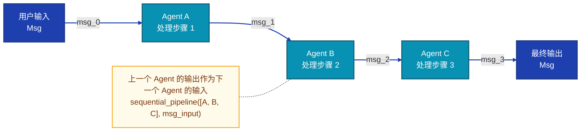

**使用方式：**

```python
from agentscope.pipeline import sequential_pipeline

result = await sequential_pipeline([alice, bob, charlie], initial_msg)
```

---

### 4.3 扇出并发管道（Fanout Pipeline）

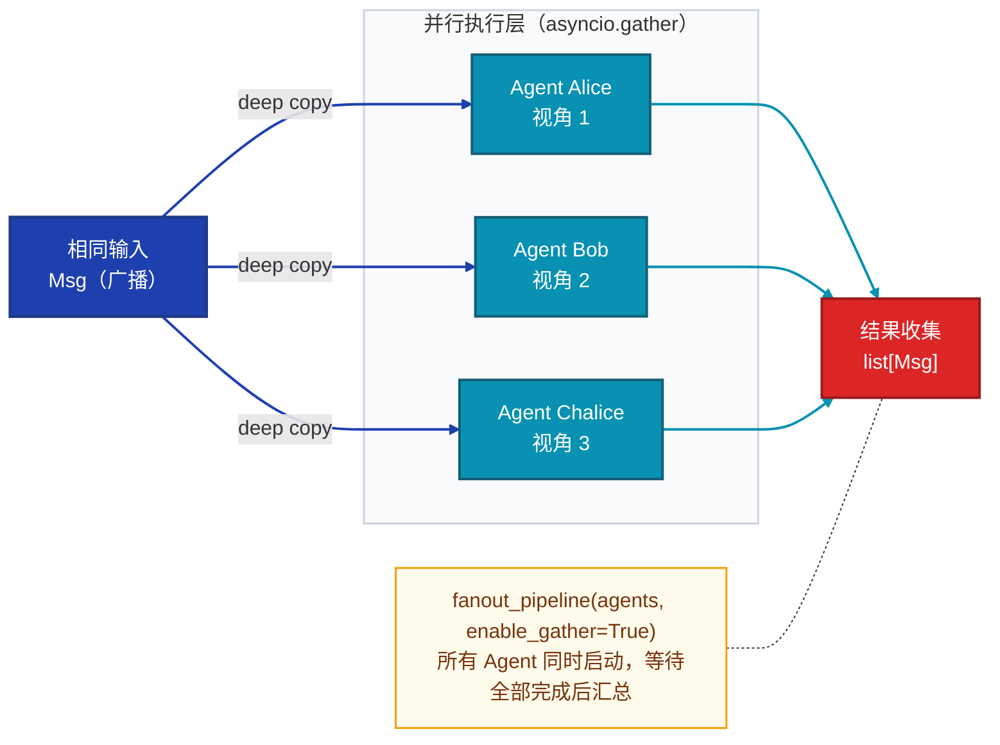

**使用方式：**

```python
from agentscope.pipeline import fanout_pipeline

results = await fanout_pipeline(
    agents=[alice, bob, chalice],
    enable_gather=True,   # True=并发，False=顺序
)
```

> 来源：`examples/workflows/multiagent_concurrent/main.py`

---

### 4.4 消息广播中枢（MsgHub）

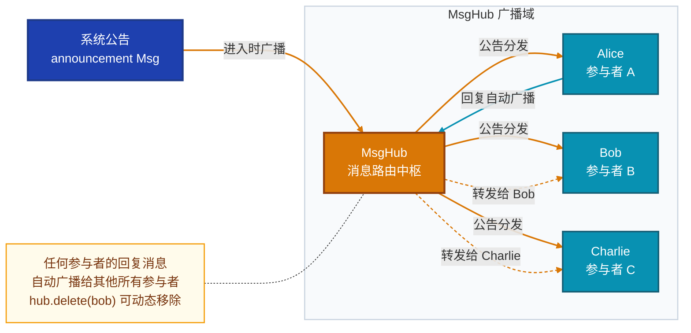

**使用方式：**

```python
from agentscope.pipeline import MsgHub, sequential_pipeline

async with MsgHub(
    participants=[alice, bob, charlie],
    announcement=Msg("system", "Please introduce yourself.", "system"),
) as hub:
    await sequential_pipeline([alice, bob, charlie])

    # 动态移除参与者
    hub.delete(bob)
    await hub.broadcast(Msg("bob", "See you later!", "assistant"))
```

> 来源：`examples/workflows/multiagent_conversation/main.py`

---

### 4.5 实时聊天室（ChatRoom）

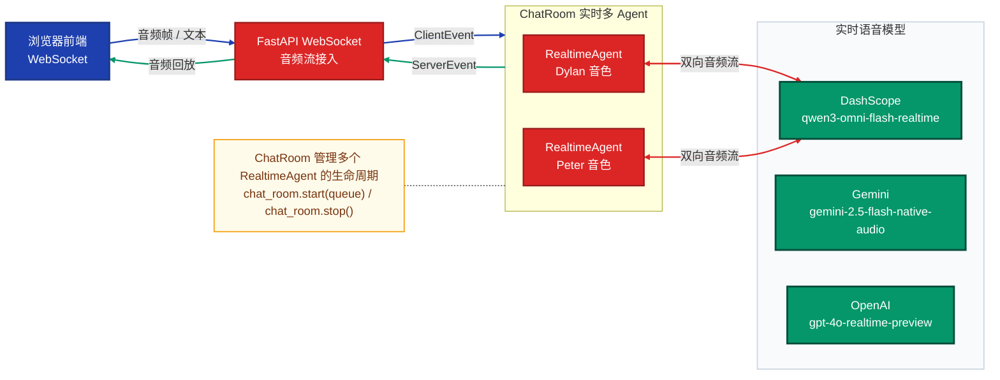

**使用方式：**

```python
from agentscope.pipeline import ChatRoom

chat_room = ChatRoom(agents=[agent1, agent2])
await chat_room.start(frontend_queue)
# ... 处理客户端事件 ...
await chat_room.stop()
```

> 来源：`examples/workflows/multiagent_realtime/run_server.py`

---

## 五、复杂任务场景实战

### 场景一：单 Agent 工具调用（ReAct 基础用法）

**适用任务：** 代码执行、文件操作、Shell 命令等需要工具辅助的单轮任务。

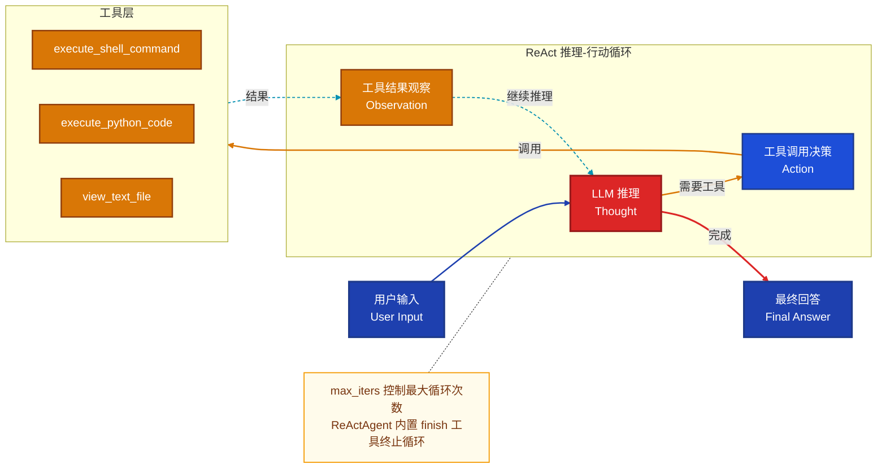

> **示例代码：** `examples/agent/react_agent/main.py`

---

### 场景二：RAG 知识增强问答

**适用任务：** 基于私有知识库（文档、个人信息、企业数据）的智能问答。

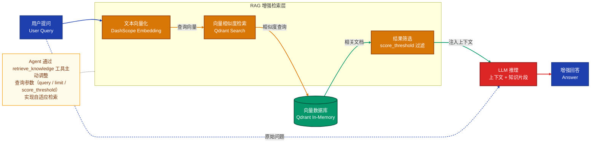

> **示例代码：** `examples/functionality/rag/agentic_usage.py`

---

### 场景三：多 Agent 辩论（MsgHub + 结构化输出）

**适用任务：** 集体决策、答案验证、多视角论证（如数学推理、事实核查）。

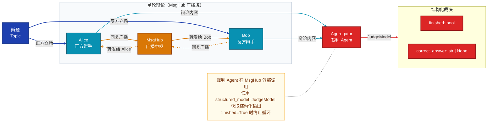

> **示例代码：** `examples/workflows/multiagent_debate/main.py`

---

### 场景四：Meta Planner — 元规划 Agent 编排子 Agent

**适用任务：** 复杂长任务自动分解 → 创建专属子 Worker → 协调执行（旅行规划、深度调研等）。

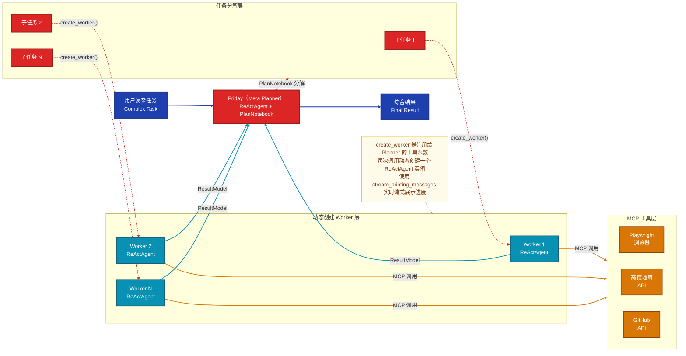

> **示例代码：** `examples/agent/meta_planner_agent/`

---

### 场景五：Deep Research Agent — 深度研究

**适用任务：** 需要网络搜索 + 文件读写 + 多步推理的研究型任务（如文献调研、数据收集分析）。

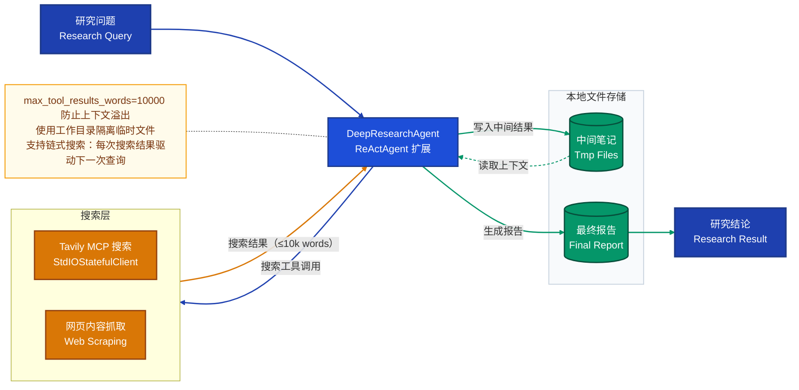

> **示例代码：** `examples/agent/deep_research_agent/`

---

### 场景六：Browser Agent — 浏览器自动化

**适用任务：** 网页操作、表单填写、数据采集、UI 自动化测试。

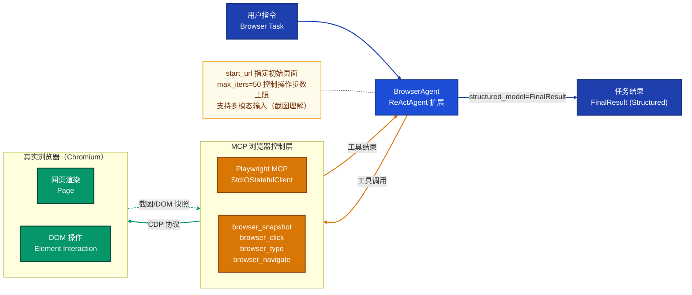

> **示例代码：** `examples/agent/browser_agent/`

---

## 六、结构化输出（Structured Output）

任何 `ReActAgent` 调用时均可传入 `structured_model` 参数，强制 Agent 输出符合 Pydantic 模型定义的 JSON 结构，结果存入 `msg.metadata`。

```python
from pydantic import BaseModel, Field

class JudgeModel(BaseModel):
    finished: bool = Field(description="Whether the debate is finished.")
    correct_answer: str | None = Field(default=None)

# 调用时传入结构化模型
msg = await moderator(
    Msg("user", "Is the debate finished?", "user"),
    structured_model=JudgeModel,
)

# 结果在 metadata 中
if msg.metadata.get("finished"):
    print(msg.metadata.get("correct_answer"))
```

---

## 七、MCP 工具接入模式对比

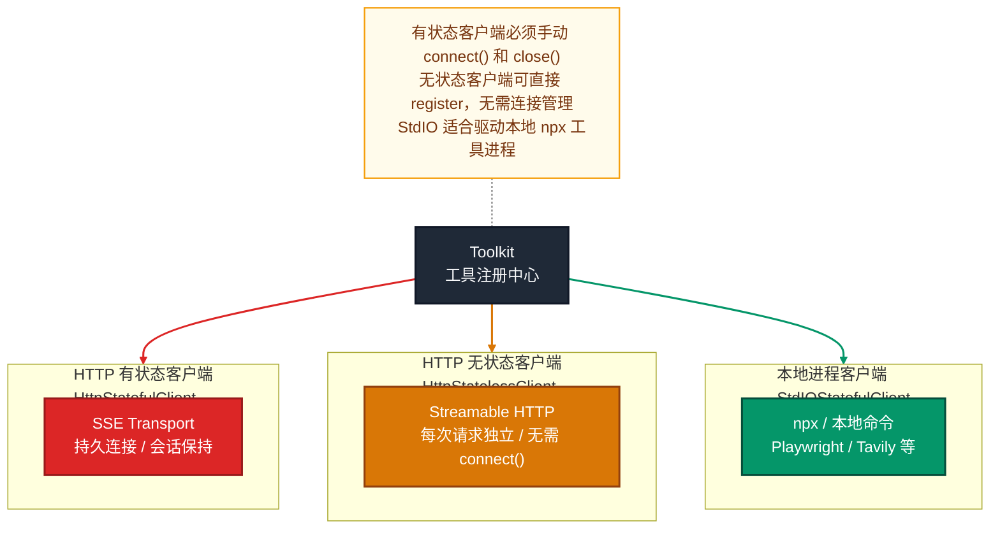

| 客户端类型 | 连接方式 | 状态管理 | 典型使用场景 |
|---|---|---|---|
| `HttpStatefulClient` | HTTP SSE / 持久连接 | 需手动 `connect()` / `close()` | 需要会话状态的服务（如计算上下文） |
| `HttpStatelessClient` | HTTP Streamable / 无连接 | 无需管理 | 无状态 REST-like 工具（地图 API、搜索 API） |
| `StdIOStatefulClient` | 本地进程 stdio | 需手动 `connect()` / `close()` | 本地 npx 工具（Playwright、Tavily MCP 等） |

---

## 八、最佳实践速查

| 场景 | 推荐方案 |
|------|---------|
| 单 Agent + 工具调用 | `ReActAgent` + `Toolkit`（注册内置工具函数） |
| 需要联网搜索 | `ReActAgent` + `StdIOStatefulClient`（Tavily MCP） |
| 需要操作浏览器 | `BrowserAgent` + `StdIOStatefulClient`（Playwright MCP） |
| 多 Agent 轮流对话 | `MsgHub` + `sequential_pipeline` |
| 多 Agent 同时并行 | `fanout_pipeline(enable_gather=True)` |
| 多 Agent 辩论/投票 | `MsgHub` + 结构化输出（`JudgeModel`）控制终止条件 |
| 复杂任务自动分解 | `ReActAgent` + `PlanNotebook` + `create_worker` 动态创建子 Agent |
| 实时语音多 Agent | `RealtimeAgent` + `ChatRoom` + WebSocket 服务 |
| 跨框架 Agent 调用 | `A2AAgent` + `AgentCard`（Google A2A 协议） |
| 私有知识库问答 | `ReActAgent` + `SimpleKnowledge`（Qdrant / Milvus）+ RAG 工具 |
| 需要持久化记忆 | `InMemoryMemory`（短期）或 `RemeMemory` / `Mem0Memory`（长期） |
| 需要强制结构化输出 | 调用时传入 `structured_model=YourPydanticModel` |

---

> **文档版本：** 基于 AgentScope v1.0.16 `examples/` 目录分析生成
> **参考示例目录：**
> - `examples/agent/` — 各类专用 Agent 实现
> - `examples/workflows/` — 多 Agent 编排工作流
> - `examples/functionality/` — 工具/记忆/RAG/规划等功能模块
