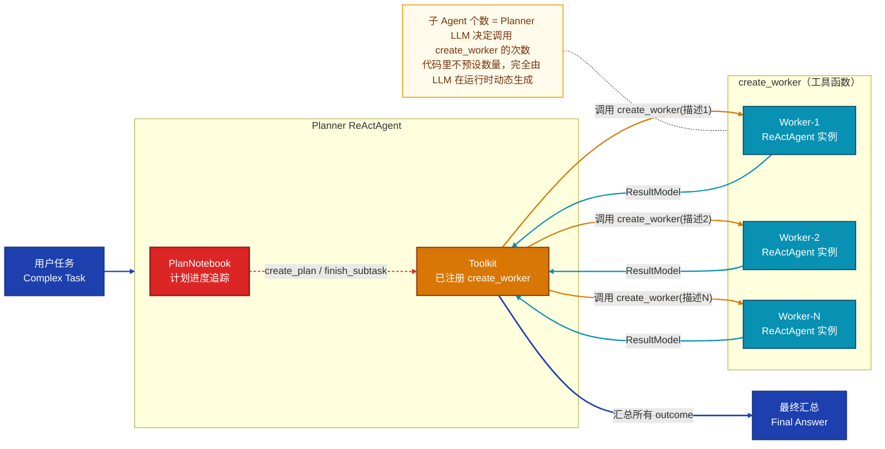
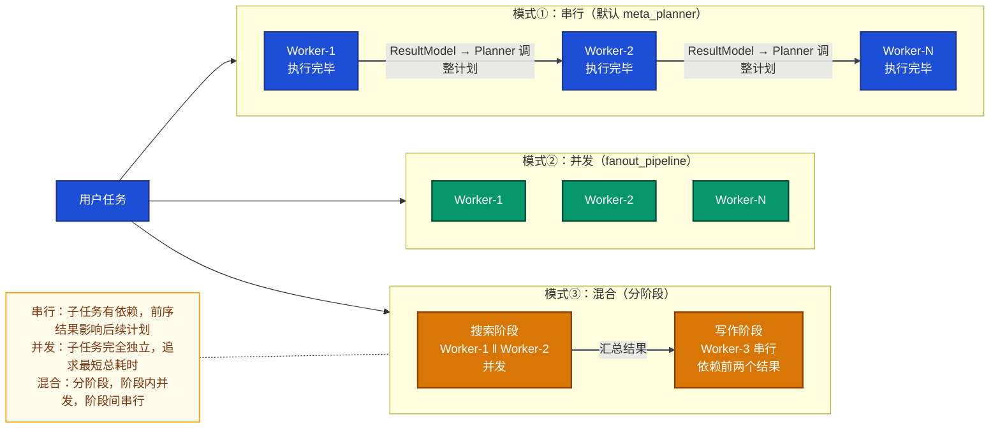
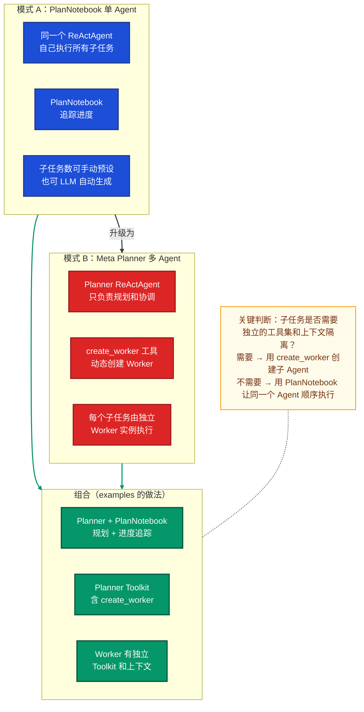

# AgentScope 任务拆解模式与 PlanNotebook 深度解析

> 基于 `examples/agent/meta_planner_agent/` 与 `examples/functionality/plan/` 完整源码，系统说明 PlanNotebook 的职责边界、任务拆解的动态机制、子 Agent 的定义与配置方式。

---

## 一、先把三个概念分清楚

在 AgentScope 的任务拆解体系中，有三个容易混淆的概念，职责完全独立：

| 概念 | 本质 | 有无子 Agent |
|------|------|------------|
| **PlanNotebook** | 给同一个 Agent 提供计划管理工具（进度追踪本） | 无 |
| **create_worker** | 普通工具函数，调用一次创建一个子 Agent | 有 |
| **Meta Planner 模式** | 两者组合：Planner 用 PlanNotebook 规划，用 create_worker 分派 | 有 |

一句话总结：**PlanNotebook 不创建子 Agent，create_worker 才创建子 Agent，两者可以单独使用，也可以组合使用。**

---

## 二、PlanNotebook 详解

### 2.1 它是什么

`PlanNotebook` 是一个**任务进度管理本**，本质上是向绑定的 `ReActAgent` 注入一组**计划管理工具函数**，让这个 Agent 能有条不紊地完成多步骤复杂任务。

它向 Agent 暴露的工具函数（来自 `_plan_notebook.py` 的 `list_tools()` 方法）：

```python
# 子任务操作
view_subtasks(subtask_idx)                         # 查看子任务详情
update_subtask_state(subtask_idx, state)           # 更新状态 → "in_progress"
finish_subtask(subtask_idx, subtask_outcome)       # 完成子任务，记录结果

# 计划操作
create_plan(name, description, expected_outcome, subtasks)  # 创建计划
revise_current_plan(subtask_idx, action, subtask)           # 增/改/删 子任务
finish_plan(state, outcome)                                 # 结束整个计划

# 历史计划
view_historical_plans()                            # 查看历史计划列表
recover_historical_plan(plan_id)                   # 恢复某个历史计划
```

### 2.2 它如何引导 Agent 执行

每个 ReAct 迭代步骤开始时，PlanNotebook 会向 Agent 的上下文注入一段 `<system-hint>` 提示，根据当前计划状态告诉 Agent 下一步应该做什么：

```
无计划时    → "如果任务复杂，请先调用 create_plan 创建计划"
刚创建计划  → "请将第 0 个子任务标记为 in_progress 并开始执行"
执行中      → "当前子任务 [名称] 正在进行，完成后调用 finish_subtask"
无进行中    → "第 N 个子任务已完成，请继续下一个"
全部完成    → "所有子任务已完成，请调用 finish_plan 汇总结果"
```

### 2.3 PlanNotebook 的两种使用模式

#### 模式一：手动创建计划（开发者预设步骤）

```python
# examples/functionality/plan/main_manual_plan.py
plan_notebook = PlanNotebook()

# 开发者在代码里静态定义所有步骤
await plan_notebook.create_plan(
    name="Comprehensive Report on AgentScope",
    description="Study the code and write a comprehensive report.",
    expected_outcome="A markdown format report.",
    subtasks=[
        SubTask(name="Clone the repository", description="...", expected_outcome="..."),
        SubTask(name="View the documentation", description="...", expected_outcome="..."),
        SubTask(name="Study the code", description="...", expected_outcome="..."),
        SubTask(name="Summarize the findings", description="...", expected_outcome="..."),
    ],
)

agent = ReActAgent(
    name="Friday",
    sys_prompt="You're a helpful assistant. Finish the given task by the plan.",
    model=...,
    toolkit=toolkit,
    plan_notebook=plan_notebook,   # 注入预设计划
)
```

**这种模式：同一个 Agent 自己执行所有子任务，步骤由开发者预先定义，没有子 Agent。**

#### 模式二：Agent 自主规划（LLM 动态生成步骤）

```python
# examples/functionality/plan/main_agent_managed_plan.py
agent = ReActAgent(
    name="Friday",
    sys_prompt="""You're a helpful assistant.
    Your target is to finish the given task with careful planning.
    You can equip yourself with plan related tools to help you plan and execute.""",
    model=...,
    toolkit=toolkit,
    plan_notebook=PlanNotebook(),   # 空计划本，让 Agent 自己创建计划
    enable_meta_tool=True,          # 允许 Agent 调用 finish 工具主动结束
)
```

**这种模式：Agent 收到任务后自己决定拆成几个步骤，然后逐一执行，仍然没有子 Agent。**

### 2.4 PlanNotebook 数据结构

```
Plan（计划）
├── id / name / description / expected_outcome
├── state: "todo" | "in_progress" | "done" | "abandoned"
└── subtasks: list[SubTask]
    └── SubTask（子任务）
        ├── name / description / expected_outcome
        ├── state: "todo" | "in_progress" | "done" | "abandoned"
        └── outcome: str | None   ← finish_subtask 时填入实际结果
```

---

## 三、任务拆解模式（Meta Planner）

### 3.1 核心机制

"拆解任务 → 子 Agent 执行 → 汇总结果"这个能力，**不是 PlanNotebook 提供的**，而是通过把 `create_worker` 函数注册为工具实现的。

`create_worker` 是一个普通 Python 异步函数：每次被调用时，在函数内部动态创建一个全新的 `ReActAgent` 实例（即 Worker），驱动它执行指定任务，返回结构化结果。



### 3.2 Planner 的配置

```python
# examples/agent/meta_planner_agent/main.py
from tool import create_worker   # 导入 Worker 工厂函数

toolkit = Toolkit()
toolkit.register_tool_function(create_worker)   # ← 关键：注册为工具

planner = ReActAgent(
    name="Friday",
    sys_prompt="""You are Friday, a meta planner.
    Your mission: decompose tasks, create worker agents via create_worker,
    and coordinate their execution.

    Important Constraints:
    1. DO NOT solve subtasks directly yourself.
    2. Always follow the plan sequence.
    3. DO NOT finish the plan until all subtasks are finished.
    """,
    model=DashScopeChatModel(model_name="qwen3-max", api_key=...),
    formatter=DashScopeChatFormatter(),
    toolkit=toolkit,               # 含 create_worker
    plan_notebook=PlanNotebook(),  # 可选：辅助进度追踪
    max_iters=20,
)
```

**让 Planner 具备拆解能力的核心只有两点：**
1. `toolkit.register_tool_function(create_worker)` — 把 Worker 工厂函数注册为工具
2. `sys_prompt` 里告诉 LLM"你是规划者，不要自己执行，要通过 create_worker 分派"

`PlanNotebook` 是可选的进度追踪辅助，去掉它 Planner 仍然可以拆解任务并调用子 Agent，只是没有可视化的计划状态追踪。

### 3.3 子 Agent（Worker）的定义

Worker 在 `create_worker` 函数内部定义，**每次调用都是一个全新的独立实例**：

```python
# examples/agent/meta_planner_agent/tool.py（精简版）
async def create_worker(
    task_description: str,          # Planner 传入的子任务描述
) -> AsyncGenerator[ToolResponse, None]:

    # ── 1. 为这个 Worker 创建独立的 Toolkit ──────────────────
    toolkit = Toolkit()
    toolkit.register_tool_function(write_text_file)
    toolkit.register_tool_function(view_text_file)

    browser_client = StdIOStatefulClient(
        name="playwright-mcp", command="npx", args=["@playwright/mcp@latest"]
    )
    await browser_client.connect()
    await toolkit.register_mcp_client(browser_client, group_name="browser_tools")

    # ── 2. 创建 Worker ReActAgent 实例 ───────────────────────
    sub_agent = ReActAgent(
        name="Worker",
        sys_prompt="你是 Worker，用工具完成交给你的任务，完成后调用 finish 工具。",
        model=DashScopeChatModel(model_name="qwen3-max", api_key=...),
        formatter=DashScopeChatFormatter(),
        toolkit=toolkit,
        enable_meta_tool=True,   # 允许调用内置 finish() 工具主动终止
        max_iters=20,
    )
    sub_agent.set_console_output_enabled(False)  # 关闭子 Agent 的控制台输出

    # ── 3. 驱动 Worker 执行，强制返回结构化结果 ──────────────
    result = await sub_agent(
        Msg("user", content=task_description, role="user"),
        structured_model=ResultModel,   # {success: bool, message: str}
    )

    yield ToolResponse(content=..., is_last=True)
    await browser_client.close()
```

**子 Agent 的"个性"来自 `task_description`，代码模板是固定的**。所有 Worker 使用相同的模型、相同的工具集模板，只有 Planner 传入的任务描述不同。

### 3.4 子 Agent 个数如何决定

**没有代码层面的静态配置**，子 Agent 的数量完全由 Planner LLM 在运行时动态决定：

```
子 Agent 个数 = Planner 调用 create_worker 的次数
             = Planner 在 create_plan 里定义的 SubTask 数量
             = LLM 根据任务复杂度自主判断的结果
```

唯一的间接约束：`max_iters=20` 限制了 Planner 的 ReAct 总循环次数，极端情况下超过这个次数会停止。

---

## 四、完整执行时序

```mermaid
flowchart LR
    classDef userStyle    fill:#1e40af,stroke:#1e3a8a,stroke-width:2.5px,color:#fff
    classDef planStyle    fill:#dc2626,stroke:#991b1b,stroke-width:2.5px,color:#fff
    classDef toolStyle    fill:#d97706,stroke:#92400e,stroke-width:2px,color:#fff
    classDef workerStyle  fill:#0891b2,stroke:#155e75,stroke-width:2px,color:#fff
    classDef storeStyle   fill:#059669,stroke:#064e3b,stroke-width:2px,color:#fff
    classDef noteStyle    fill:#fffbeb,stroke:#f59e0b,stroke-width:1.5px,color:#78350f
    classDef layerStyle   fill:#f8fafc,stroke:#cbd5e0,stroke-width:1.5px

    INPUT["用户输入<br>复杂任务"]:::userStyle

    subgraph PLANNER_LOOP["Planner ReAct 循环（max_iters=20）"]
        direction LR
        CP["create_plan<br>生成子任务列表"]:::planStyle
        CW1["create_worker<br>子任务 1"]:::toolStyle
        FS1["finish_subtask(0)<br>记录结果 1"]:::storeStyle
        CW2["create_worker<br>子任务 2"]:::toolStyle
        FS2["finish_subtask(1)<br>记录结果 2"]:::storeStyle
        FP["finish_plan<br>汇总全部 outcome"]:::planStyle
    end
    class PLANNER_LOOP layerStyle

    subgraph W1_BOX["Worker-1 ReAct 循环"]
        direction TB
        W1A["LLM 推理"]:::workerStyle
        W1B["工具调用<br>浏览器/搜索/文件"]:::toolStyle
    end
    class W1_BOX layerStyle

    subgraph W2_BOX["Worker-2 ReAct 循环"]
        direction TB
        W2A["LLM 推理"]:::workerStyle
        W2B["工具调用<br>浏览器/搜索/文件"]:::toolStyle
    end
    class W2_BOX layerStyle

    OUTPUT["最终回复<br>用户"]:::userStyle

    INPUT --> CP
    CP    --> CW1
    CW1   -->|"task_description"| W1A
    W1A   --> W1B
    W1B   -->|"继续推理"| W1A
    W1A   -->|"ResultModel"| CW1
    CW1   --> FS1
    FS1   --> CW2
    CW2   -->|"task_description"| W2A
    W2A   --> W2B
    W2B   -->|"继续推理"| W2A
    W2A   -->|"ResultModel"| CW2
    CW2   --> FS2
    FS2   --> FP
    FP    --> OUTPUT

    NOTE["PlanNotebook 在每步 ReAct 迭代开始时<br>注入 system-hint 提示 Planner 当前状态<br>Worker 执行过程对 Planner 完全透明（流式输出）"]:::noteStyle
    NOTE -.- PLANNER_LOOP

    %% 边索引：0-14，共 15 条
    linkStyle 0 stroke:#1e40af,stroke-width:2px
    linkStyle 1 stroke:#dc2626,stroke-width:2px
    linkStyle 2 stroke:#d97706,stroke-width:2px
    linkStyle 3,4 stroke:#0891b2,stroke-width:1.5px,stroke-dasharray:4 3
    linkStyle 5 stroke:#0891b2,stroke-width:2px
    linkStyle 6,7 stroke:#059669,stroke-width:2px
    linkStyle 8 stroke:#d97706,stroke-width:2px
    linkStyle 9 stroke:#d97706,stroke-width:2px
    linkStyle 10,11 stroke:#0891b2,stroke-width:1.5px,stroke-dasharray:4 3
    linkStyle 12 stroke:#0891b2,stroke-width:2px
    linkStyle 13,14 stroke:#059669,stroke-width:2px
```



---

## 五、子 Agent 执行顺序

### 5.1 默认行为：严格串行

meta_planner 示例中，多个 Worker 之间是**严格顺序执行**的，由两个独立机制共同保证，缺一不可。

**机制一：ReAct 工具调用循环本身是串行的**

`create_worker` 被注册为 Planner 的普通工具函数，ReAct 循环里每轮只能发出一次工具调用，必须等工具返回结果后才进入下一轮：

```
ReAct 第1轮 → 调用 create_plan(...)              → 等结果
ReAct 第2轮 → 调用 create_worker("子任务1描述")   → 阻塞等待 Worker-1 完全执行完毕
ReAct 第3轮 → 调用 finish_subtask(0, ...)         → 等结果
ReAct 第4轮 → 调用 create_worker("子任务2描述")   → 阻塞等待 Worker-2 完全执行完毕
...
```

**Worker-1 不结束，Planner 永远不会启动 Worker-2。** 这是 ReAct 框架的天然特性，不需要额外配置。

**机制二：PlanNotebook 在代码层硬性拒绝乱序**

源码中 `update_subtask_state` 方法包含明确的校验逻辑，前序子任务未完成时直接返回错误拒绝操作：

```python
# src/agentscope/plan/_plan_notebook.py
# Only one subtask can be in_progress at a time
if state == "in_progress":
    for idx, subtask in enumerate(self.current_plan.subtasks):
        if idx < subtask_idx and subtask.state not in ["done", "abandoned"]:
            return ToolResponse(content=[TextBlock(
                text=f"Subtask '{subtask.name}' is not done yet. "
                     "You should finish the previous subtasks first."
            )])
```

即使 LLM 想跳过顺序直接激活第 3 个子任务，PlanNotebook 也会用工具返回值明确告知拒绝原因，LLM 读到后会重新回到正确顺序。

### 5.2 串行执行的价值

串行不是限制，而是有意为之的设计——**Planner 可以根据前一个 Worker 的实际结果动态调整后续子任务**：

```
Worker-1 搜索结果 → Planner 读取 outcome → 根据结果调整 Worker-2 的任务描述
Worker-2 结果不理想 → Planner 决定 revise_current_plan 增加一个补充子任务
```

这种"根据实时结果动态调整计划"的能力，并发模式做不到。

### 5.3 如何改为并发执行

如果子任务之间完全独立（互不依赖），可以**绕开 ReAct 工具调用循环**，在代码层面用 `asyncio.gather` 或 `fanout_pipeline` 预先创建多个 Worker 并同时启动：

```python
from agentscope.pipeline import fanout_pipeline

# 预先为每个子任务创建 Worker 实例
workers = [
    ReActAgent(name=f"Worker-{i}", sys_prompt=f"完成子任务{i}。", model=..., toolkit=...)
    for i in range(3)
]

# fanout_pipeline：同一个输入广播给所有 Worker，并发执行
results = await fanout_pipeline(
    agents=workers,
    enable_gather=True,   # True = asyncio.gather 真并发，False = 顺序
)

# 或者直接用 asyncio.gather
results = await asyncio.gather(
    worker_0(Msg("user", "子任务0描述", "user")),
    worker_1(Msg("user", "子任务1描述", "user")),
    worker_2(Msg("user", "子任务2描述", "user")),
)
```

**注意**：并发方案中子任务数量、内容和工具集需要在代码里提前写好，无法与 PlanNotebook 动态规划结合。

### 5.4 三种执行模式对比



| 维度 | 串行（默认） | 并发 | 混合 |
|------|------------|------|------|
| 实现方式 | ReAct 工具调用 | `fanout_pipeline` / `asyncio.gather` | 代码分组控制 |
| 子任务数量 | LLM 动态决定 | 代码预设 | 代码预设 |
| 前序结果影响后续？ | ✅ 完全依赖 | ❌ 互相独立 | 阶段间依赖 |
| 能与 PlanNotebook 结合？ | ✅ | ❌ | 部分 |
| 总耗时 | 各 Worker 耗时之和 | 最长 Worker 耗时 | 取决于分组 |
| 适用场景 | 任务间有依赖、需动态调整 | 独立并行分析、多视角验证 | 调研→写作等分阶段流程 |

---

## 六、结构化返回：汇总的实现方式

Worker 执行完毕后，通过 `ResultModel` 压缩为结构化结果返回给 Planner：

```python
class ResultModel(BaseModel):
    success: bool   # 执行是否成功
    message: str    # 具体结果（文件路径、数据摘要、错误信息等）
```

Planner 收到后：
1. 把 `message` 作为该子任务的 `outcome` 写入 `PlanNotebook`
2. 继续下一个子任务
3. 全部完成后，LLM 读取所有子任务的 `outcome` 字段，综合生成最终回复

**汇总不是代码逻辑，而是 Planner LLM 读取所有 outcome 后的自然语言综合。**

---

## 七、两种模式的核心区别



---

## 八、最小实现模板

如果要自己搭一套任务拆解 + 子 Agent 体系，最小结构如下：

```python
# ── Step 1：定义 Worker 工厂函数 ──────────────────────────────
async def create_worker(task_description: str):
    """每次调用创建一个新的 Worker ReActAgent"""
    sub_agent = ReActAgent(
        name="Worker",
        sys_prompt="完成交给你的任务，完成后调用 finish。",
        model=your_model,
        toolkit=your_worker_toolkit,   # Worker 专属工具集
        enable_meta_tool=True,
    )
    result = await sub_agent(
        Msg("user", task_description, "user"),
        structured_model=ResultModel,
    )
    return result.metadata   # {success: bool, message: str}


# ── Step 2：把工厂函数注册给 Planner ──────────────────────────
planner_toolkit = Toolkit()
planner_toolkit.register_tool_function(create_worker)


# ── Step 3：创建 Planner，sys_prompt 明确角色 ─────────────────
planner = ReActAgent(
    name="Planner",
    sys_prompt=(
        "你是规划者，负责把用户任务分解为子任务，"
        "调用 create_worker 逐一执行，不要自己直接解决子任务。"
    ),
    model=your_model,
    toolkit=planner_toolkit,
    plan_notebook=PlanNotebook(),   # 可选：追踪计划进度
    max_iters=20,
)
```

---

## 九、速查对比表

| 问题 | 答案 |
|------|------|
| PlanNotebook 会创建子 Agent 吗？ | **不会**，它只是给同一个 Agent 提供计划管理工具 |
| 每个 ReActAgent 都有拆解子 Agent 的能力吗？ | **不是**，只有 Toolkit 里注册了 create_worker 工具的才有 |
| 子 Agent 个数是静态配置的吗？ | **不是**，由 Planner LLM 在运行时动态决定 |
| 子 Agent 个数有上限吗？ | 受 `max_iters` 约束，没有硬编码个数上限 |
| 所有 Worker 用同一份模板吗？ | **是**，区分靠 `task_description` 的内容不同 |
| PlanNotebook 在 Meta Planner 里必须有吗？ | **可选**，去掉后 Planner 仍能拆解任务，只是少了进度追踪 |
| Worker 的结果如何汇总？ | Worker 返回 `ResultModel`，Planner LLM 读取所有 outcome 综合生成最终回复 |
| 多个 Worker 默认是串行还是并发？ | **严格串行**：ReAct 循环单次只调用一个工具，且 PlanNotebook 代码层拒绝乱序 |
| PlanNotebook 如何强制串行？ | `update_subtask_state` 校验前序任务必须 done/abandoned，否则返回错误拒绝 |
| 串行有什么优势？ | Planner 可根据前一个 Worker 的实际结果动态调整后续子任务内容 |
| 如何实现并发执行？ | 绕开 ReAct 循环，用 `fanout_pipeline(enable_gather=True)` 或 `asyncio.gather` 预先启动所有 Worker |
| 并发方案的代价是什么？ | 子任务数量和内容需在代码里预设，无法动态规划，且无法与 PlanNotebook 结合 |

---

> **参考源码路径：**
> - `examples/agent/meta_planner_agent/main.py` — Meta Planner 完整示例
> - `examples/agent/meta_planner_agent/tool.py` — create_worker 工厂函数实现
> - `examples/functionality/plan/main_manual_plan.py` — 手动计划模式
> - `examples/functionality/plan/main_agent_managed_plan.py` — Agent 自主规划模式
> - `src/agentscope/plan/_plan_notebook.py` — PlanNotebook 源码
> - `src/agentscope/plan/_plan_model.py` — Plan / SubTask 数据模型
