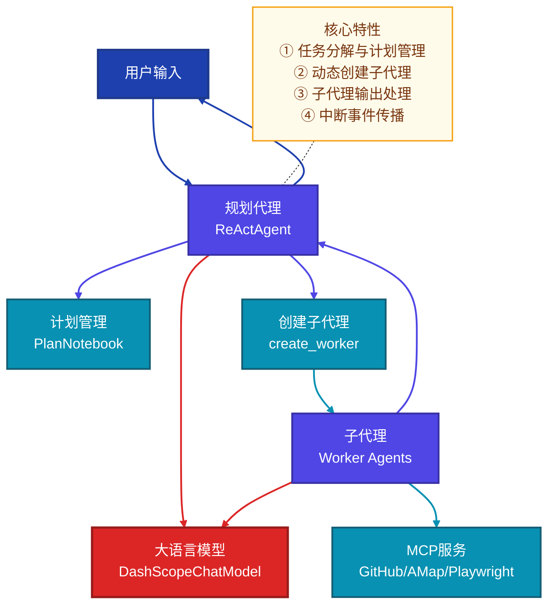
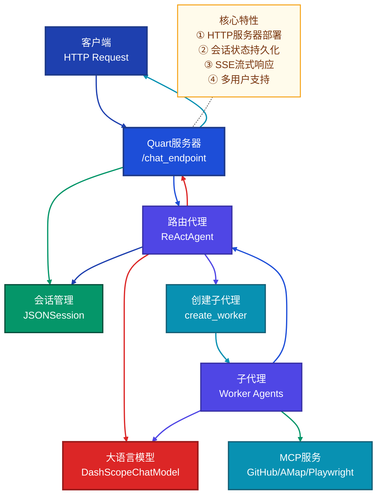

# Meta Planner Agent vs Planning Agent 对比分析

## 一、核心功能对比

| 维度 | Meta Planner Agent | Planning Agent |
|------|-------------------|----------------|
| **主要用途** | 本地演示规划代理的任务分解与子代理协调能力 | 部署为HTTP服务的路由代理系统 |
| **运行环境** | 本地控制台交互式运行 | Quart服务器部署运行 |
| **会话管理** | 无持久化会话管理 | 使用JSONSession保存和加载会话状态 |
| **输出方式** | 控制台直接输出 | SSE流式响应 |
| **核心特性** | 任务分解、子代理协调、中断事件传播 | 服务器部署、会话持久化、API接口 |
| **技术栈** | AgentScope核心库 | AgentScope + Quart |

## 二、系统架构对比

### 2.1 Meta Planner Agent 架构



### 2.2 Planning Agent 架构



## 三、实现细节对比

### 3.1 启动方式

**Meta Planner Agent**:
- 直接在控制台运行 `python main.py`
- 交互式命令行界面
- 支持通过 AgentScope-Studio 可视化代理交互

**Planning Agent**:
- 启动 Quart 服务器 `python main.py`
- 通过 HTTP POST 请求访问 `/chat_endpoint` 端点
- 提供 `test_post.py` 脚本用于测试

### 3.2 核心实现差异

| 特性 | Meta Planner Agent | Planning Agent |
|------|-------------------|----------------|
| **会话管理** | 无会话管理，每次运行都是新会话 | 使用 JSONSession 持久化会话状态 |
| **计划管理** | 使用 PlanNotebook 管理任务计划 | 无计划管理功能 |
| **输出处理** | 子代理输出作为工具流式响应返回 | 子代理输出转换为 SSE 流式响应 |
| **部署方式** | 本地运行，无网络服务 | 部署为 HTTP 服务，支持远程访问 |
| **并发处理** | 单用户交互式 | 支持多用户并发请求 |

### 3.3 代码结构对比

**Meta Planner Agent**:
```
meta_planner_agent/
    ├── assets/           # 截图资源
    ├── README.md         # 说明文档
    ├── main.py           # 主入口，创建规划代理
    └── tool.py           # 工具函数，创建子代理
```

**Planning Agent**:
```
planning_agent/
    ├── README.md         # 说明文档
    ├── main.py           # 主入口，启动Quart服务器
    ├── tool.py           # 工具函数，创建子代理
    └── test_post.py      # 测试脚本，发送HTTP请求
```

## 四、适用场景

**Meta Planner Agent** 适用于：
- 本地开发和测试规划代理功能
- 学习任务分解和子代理协调的实现
- 演示 AgentScope 的核心能力
- 不需要持久化会话的场景

**Planning Agent** 适用于：
- 生产环境部署多代理系统
- 需要通过 API 接口访问代理功能
- 要求会话状态持久化的场景
- 多用户并发访问的场景

## 五、技术要点

### 5.1 子代理创建与管理

两个示例都使用 `create_worker` 工具函数动态创建子代理，但实现细节有所不同：

- **Meta Planner Agent**：通过 PlanNotebook 管理任务计划，按计划顺序执行子任务
- **Planning Agent**：作为路由代理，根据用户请求动态创建子代理处理特定任务

### 5.2 输出处理

- **Meta Planner Agent**：子代理输出通过工具函数的流式响应返回给规划代理，再由规划代理展示给用户
- **Planning Agent**：子代理输出转换为 SSE 流式响应，通过 HTTP 连接实时返回给客户端

### 5.3 会话管理

- **Meta Planner Agent**：无会话管理，每次运行都是独立的会话
- **Planning Agent**：使用 JSONSession 保存和加载会话状态，支持会话持久化

## 六、总结

**Meta Planner Agent** 是一个本地演示示例，重点展示了 AgentScope 中规划代理的核心能力，包括任务分解、子代理协调和中断事件传播。它适合用于学习和测试 AgentScope 的基本功能。

**Planning Agent** 是一个部署示例，展示了如何将多代理系统部署为 HTTP 服务，支持会话持久化和 SSE 流式响应。它适合用于生产环境部署和通过 API 接口访问代理功能。

两个示例互补，分别展示了 AgentScope 在不同场景下的应用方式，为开发者提供了从本地开发到生产部署的完整参考。