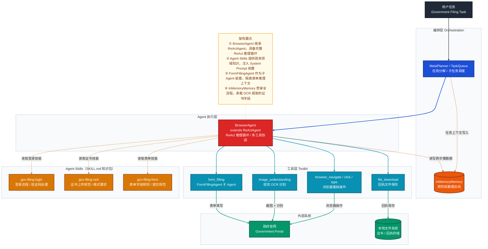

# 政务备案办理：ReActAgent 复杂任务编排方案

> 目标任务：登录政府官网 → 上传备案证 → 识别备案证内容 → 填写申报表单 → 收取办理回执
>
> 本文围绕 AgentScope 的 `BrowserAgent`（继承自 `ReActAgent`）展开，结合 `Agent Skills`、`Toolkit` 工具层与 `InMemoryMemory`，给出可落地的编排方案。

---

## 一、任务分析与核心挑战

| 子任务 | 技术挑战 | AgentScope 解法 |
|--------|---------|----------------|
| 登录政府官网 | 验证码、页面结构多变 | BrowserAgent + browser_snapshot 感知页面状态 |
| 上传备案证 | 文件路径定位、上传控件交互 | playwright-MCP `browser_file_upload` 工具 |
| 识别备案证内容 | 图像 OCR、关键字段抽取 | `image_understanding` 内置 skill 工具 |
| 填写申报表单 | 字段多、校验规则复杂 | `FormFillingAgent` 子 Agent + `form_filling` 工具 |
| 收取回执 | 异步等待、PDF/图片下载 | `file_download` 工具 + image_understanding 验证 |

**核心约束**：
- 五个阶段**严格顺序**执行，前一阶段的输出是后一阶段的输入（证书字段 → 表单数据）
- `InMemoryMemory` 必须贯穿全流程，充当跨阶段的「数据总线」
- `FormFillingAgent` 作为独立子 Agent，嵌套在 BrowserAgent 内处理复杂表单，隔离推理上下文

---

## 二、系统架构图

> 静态结构视图：各组件构成、层级职责与依赖关系



---

## 三、端到端执行流程图

> 动态流程视图：任务从发起到完成，经过了哪些步骤、数据如何在各阶段流转

```mermaid
flowchart LR
    %% ── 配色定义：按流程阶段职责分色 ──────────────────────────────────────
    classDef userStyle    fill:#1e40af,stroke:#1e3a8a,stroke-width:2.5px,color:#fff
    classDef browserStyle fill:#dc2626,stroke:#991b1b,stroke-width:2px,color:#fff
    classDef ocrStyle     fill:#d97706,stroke:#92400e,stroke-width:2px,color:#fff
    classDef formStyle    fill:#0891b2,stroke:#155e75,stroke-width:2px,color:#fff
    classDef storeStyle   fill:#059669,stroke:#064e3b,stroke-width:2px,color:#fff
    classDef memStyle     fill:#ea580c,stroke:#7c2d12,stroke-width:2px,color:#fff
    classDef noteStyle    fill:#fffbeb,stroke:#f59e0b,stroke-width:1.5px,color:#78350f
    classDef layerStyle   fill:#f8fafc,stroke:#cbd5e0,stroke-width:1.5px

    %% ── 起始节点 ─────────────────────────────────────────────────────────
    START["用户发起任务<br>政务备案申请"]:::userStyle

    %% ── 阶段一：登录 ─────────────────────────────────────────────────────
    subgraph Phase1["① 登录阶段 Login Phase"]
        direction LR
        P1A["导航至登录页<br>browser_navigate"]:::browserStyle
        P1B["输入账号密码<br>browser_type"]:::browserStyle
        P1C["处理验证码 / 提交<br>image_understanding + click"]:::browserStyle
    end
    class Phase1 layerStyle

    %% ── 阶段二：上传备案证 ───────────────────────────────────────────────
    subgraph Phase2["② 上传备案证 Upload Phase"]
        direction LR
        P2A["导航至上传入口<br>browser_navigate"]:::browserStyle
        P2B["选择本地证书文件<br>browser_file_upload"]:::browserStyle
        P2C["确认上传状态<br>browser_snapshot"]:::browserStyle
    end
    class Phase2 layerStyle

    %% ── 阶段三：识别备案证 ───────────────────────────────────────────────
    subgraph Phase3["③ 识别备案证 OCR Phase"]
        direction LR
        P3A["截取证书区域截图<br>browser_take_screenshot"]:::ocrStyle
        P3B["视觉 OCR 识别<br>image_understanding"]:::ocrStyle
        P3C["提取关键字段<br>写入 Memory"]:::ocrStyle
    end
    class Phase3 layerStyle

    %% ── 阶段四：填写表单 ─────────────────────────────────────────────────
    subgraph Phase4["④ 填写表单 Form Phase"]
        direction LR
        P4A["导航至申报表页<br>browser_navigate"]:::formStyle
        P4B["读取 Memory 构建<br>填写指令集"]:::formStyle
        P4C["FormFillingAgent<br>子 Agent 逐字段填写"]:::formStyle
        P4D["校验 / 提交表单<br>browser_click"]:::formStyle
    end
    class Phase4 layerStyle

    %% ── 阶段五：收取回执 ─────────────────────────────────────────────────
    subgraph Phase5["⑤ 收取回执 Receipt Phase"]
        direction LR
        P5A["等待处理结果页<br>browser_snapshot"]:::storeStyle
        P5B["识别回执内容<br>image_understanding"]:::storeStyle
        P5C["下载保存回执<br>file_download"]:::storeStyle
    end
    class Phase5 layerStyle

    %% ── 终止节点 ─────────────────────────────────────────────────────────
    END["任务完成<br>回执已保存至本地"]:::userStyle

    %% ── 跨阶段数据总线 ───────────────────────────────────────────────────
    MEMORY[("InMemoryMemory<br>证书字段 / 上下文")]:::memStyle

    %% ── 主流程数据流 ─────────────────────────────────────────────────────
    START --> P1A
    P1A --> P1B
    P1B --> P1C
    P1C -->|"登录成功 Cookie"| P2A
    P2A --> P2B
    P2B --> P2C
    P2C -->|"上传完成 fileId"| P3A
    P3A --> P3B
    P3B --> P3C
    P3C -.->|"存储证书字段"| MEMORY
    P3C -->|"OCR 完成"| P4A
    P4A --> P4B
    P4B -.->|"读取证书数据"| MEMORY
    P4B --> P4C
    P4C --> P4D
    P4D -->|"提交成功"| P5A
    P5A --> P5B
    P5B --> P5C
    P5C --> END

    %% ── 设计注记 ─────────────────────────────────────────────────────────
    NOTE["关键路径说明<br>① 阶段间通过 InMemoryMemory 传递结构化证书数据<br>② Phase3 OCR 提取字段是 Phase4 填写的唯一依据<br>③ FormFillingAgent 独立 ReAct 循环，max_iters=20 处理复杂表单<br>④ 任一阶段失败，BrowserAgent 自动重试（max_iters 兜底）"]:::noteStyle
    NOTE -.- P4C

    %% 边索引：0-19，共 20 条
    linkStyle 0  stroke:#1e40af,stroke-width:2.5px
    linkStyle 1,2 stroke:#dc2626,stroke-width:2px
    linkStyle 3  stroke:#1e40af,stroke-width:2px
    linkStyle 4,5 stroke:#dc2626,stroke-width:2px
    linkStyle 6  stroke:#1e40af,stroke-width:2px
    linkStyle 7,8 stroke:#d97706,stroke-width:2px
    linkStyle 9  stroke:#d97706,stroke-width:1.5px,stroke-dasharray:4 3
    linkStyle 10 stroke:#1e40af,stroke-width:2px
    linkStyle 11 stroke:#0891b2,stroke-width:2px
    linkStyle 12 stroke:#0891b2,stroke-width:1.5px,stroke-dasharray:4 3
    linkStyle 13,14 stroke:#0891b2,stroke-width:2px
    linkStyle 15 stroke:#1e40af,stroke-width:2px
    linkStyle 16,17,18 stroke:#059669,stroke-width:2px
    linkStyle 19 stroke:#f59e0b,stroke-width:1px,stroke-dasharray:2 4
```



---

## 四、编排方案详解

### 4.1 Agent 角色设计

| 角色 | 类型 | 职责 | `max_iters` |
|------|------|------|-------------|
| `GovFilingAgent` | `BrowserAgent`（继承 `ReActAgent`） | 主执行者，协调全部五个阶段，持有所有工具 | `80` |
| `FormFillingAgent` | `ReActAgent`（嵌套子 Agent） | 专注表单操作，与主 Agent 共享 `Toolkit`，独立 Memory | `20` |

**为什么不用 MetaPlanner 拆成多个独立 Agent？**

政务办理的五个阶段存在**严格的状态依赖**（登录 Cookie → 上传状态 → OCR 字段 → 表单提交），用单一 BrowserAgent 维护浏览器会话上下文更安全，避免跨 Agent 传递 Cookie/Session 的复杂性。`FormFillingAgent` 作为内嵌子 Agent 只处理表单逻辑，是职责隔离的最小单元。

### 4.2 Agent Skill 设计

每个 SKILL 对应政务办理的一个知识域，注入 System Prompt，引导 BrowserAgent 在对应阶段采用正确策略：

```
skills/
├── gov-filing-login/
│   └── SKILL.md          # 登录流程、验证码识别策略、会话保持方法
├── gov-filing-cert/
│   └── SKILL.md          # 证书格式要求、上传控件类型、状态确认方式
└── gov-filing-form/
    └── SKILL.md          # 申报表字段说明、必填项规则、提交前校验清单
```

**`gov-filing-login/SKILL.md` 示例：**

```markdown
---
name: gov-filing-login
description: 政务系统登录策略，包含验证码处理与会话保持方法
---

# 政务系统登录指南

## 登录流程
1. 导航至登录页，等待页面完全加载（browser_snapshot 确认）
2. 定位账号和密码输入框（通常为 type=text 和 type=password）
3. 使用 browser_type 填入凭证
4. 若存在图形验证码，使用 image_understanding 识别验证码文本再填入
5. 点击登录按钮，通过 browser_snapshot 确认跳转成功

## 验证码策略
- 图形验证码：image_understanding + task="读取验证码文字"
- 短信验证码：等待用户输入后继续（可通过 UserAgent 交互）

## 失败处理
- 若登录失败，截图分析错误提示，最多重试 3 次
```

### 4.3 Toolkit 工具配置

```python
# 浏览器操作工具（来自 playwright-MCP）
browser_navigate, browser_click, browser_type,
browser_snapshot, browser_take_screenshot,
browser_file_upload, browser_wait_for

# 内置 Skill 工具（来自 build_in_helper）
image_understanding   # 视觉 OCR + 元素定位
form_filling          # FormFillingAgent 子 Agent 驱动
file_download         # 文件下载到本地
```

### 4.4 InMemoryMemory 跨阶段数据流

```
Phase 3 OCR 输出写入 Memory：
{
  "cert_no": "备案证号 XXXXXXXX",
  "company_name": "XX 科技有限公司",
  "valid_until": "2027-12-31",
  "domain": "example.com",
  "issued_by": "XX 管理局"
}

↓ Phase 4 读取并构建填写指令

form_filling(
  fill_information="""
  备案证编号字段填入：XXXXXXXX
  公司名称字段填入：XX 科技有限公司
  有效期字段选择：2027-12-31
  ...
  """
)
```

---

## 五、代码实现

### 5.1 目录结构

```
gov_filing_agent/
├── main.py                         # 主入口
├── gov_filing_agent.py             # GovFilingAgent 类定义
├── skills/
│   ├── gov-filing-login/
│   │   └── SKILL.md
│   ├── gov-filing-cert/
│   │   └── SKILL.md
│   └── gov-filing-form/
│       └── SKILL.md
└── certs/
    └── beian_cert.png              # 待上传的备案证文件
```

### 5.2 主程序 `main.py`

```python
# -*- coding: utf-8 -*-
"""政务备案办理 Agent 主入口"""
import asyncio
import os
from pydantic import BaseModel, Field

from agentscope.formatter import DashScopeChatFormatter
from agentscope.memory import InMemoryMemory
from agentscope.model import DashScopeChatModel
from agentscope.tool import Toolkit
from agentscope.mcp import StdIOStatefulClient
from agentscope.message import Msg

from gov_filing_agent import GovFilingAgent


class FilingResult(BaseModel):
    """结构化输出：办理结果"""
    status: str = Field(description="办理状态：success / failed / pending")
    receipt_path: str = Field(description="本地回执文件路径")
    summary: str = Field(description="办理过程摘要")


async def main() -> None:
    # ── 1. 初始化 Toolkit + MCP 浏览器工具 ──────────────────────────────
    toolkit = Toolkit()
    browser_client = StdIOStatefulClient(
        name="playwright-mcp",
        command="npx",
        args=["@playwright/mcp@latest"],
    )
    await browser_client.connect()
    await toolkit.register_mcp_client(browser_client)

    # ── 2. 注册 Agent Skills（领域知识包）────────────────────────────────
    toolkit.register_agent_skill("./skills/gov-filing-login")
    toolkit.register_agent_skill("./skills/gov-filing-cert")
    toolkit.register_agent_skill("./skills/gov-filing-form")

    # ── 3. 创建 GovFilingAgent ─────────────────────────────────────────
    agent = GovFilingAgent(
        name="GovFilingAgent",
        model=DashScopeChatModel(
            api_key=os.environ.get("DASHSCOPE_API_KEY"),
            model_name="qwen3-max",
            stream=False,
        ),
        formatter=DashScopeChatFormatter(),
        memory=InMemoryMemory(),
        toolkit=toolkit,
        max_iters=80,
        start_url="https://beian.miit.gov.cn",  # 替换为实际政务网址
    )

    # ── 4. 构造任务消息 ───────────────────────────────────────────────
    task_msg = Msg(
        name="user",
        role="user",
        content="""请完成以下政务备案办理任务：

1. 登录政务平台（账号：{USERNAME}，密码：{PASSWORD}）
2. 上传备案证文件：./certs/beian_cert.png
3. 识别备案证上的所有关键字段（证书编号、公司名称、有效期、域名等）
4. 根据识别结果填写申报表单并提交
5. 等待处理结果，下载并保存回执到 ./receipts/ 目录

完成后请返回结构化的办理结果。""",
    )

    # ── 5. 执行任务 ───────────────────────────────────────────────────
    try:
        result = await agent(task_msg, structured_model=FilingResult)
        print(f"办理结果：{result}")
    finally:
        await browser_client.close()


asyncio.run(main())
```

### 5.3 `GovFilingAgent` 类定义 `gov_filing_agent.py`

```python
# -*- coding: utf-8 -*-
"""GovFilingAgent：政务备案办理专用 BrowserAgent"""
from typing import Any

from agentscope.memory import MemoryBase
from agentscope.model import ChatModelBase
from agentscope.formatter import FormatterBase
from agentscope.tool import Toolkit

# 复用 examples/agent/browser_agent 中的 BrowserAgent
import sys
sys.path.append("../agentscope/examples/agent/browser_agent")
from browser_agent import BrowserAgent  # noqa: E402

_GOV_FILING_SYS_PROMPT = """你是一个专业的政务办理助手，负责在政务网站上完成备案证上传与申报的全流程操作。

## 工作原则
- 每一步操作前，先通过 browser_snapshot 确认当前页面状态
- 遇到验证码，使用 image_understanding 工具识别后再填写
- OCR 识别备案证时，提取所有可见字段并完整写入记忆（Memory）
- 调用 form_filling 时，将从记忆中读取的证书数据转化为完整的填写指令
- 下载回执时，优先使用 file_download 工具，保存至 ./receipts/ 目录

## 你拥有的 Agent Skills
在执行对应阶段前，务必先阅读对应 SKILL.md 获取领域知识。
"""


class GovFilingAgent(BrowserAgent):
    """政务备案办理专用 Agent，继承 BrowserAgent（继承自 ReActAgent）"""

    def __init__(
        self,
        name: str,
        model: ChatModelBase,
        formatter: FormatterBase,
        memory: MemoryBase,
        toolkit: Toolkit,
        max_iters: int = 80,
        start_url: str = "https://beian.miit.gov.cn",
        **kwargs: Any,
    ) -> None:
        super().__init__(
            name=name,
            sys_prompt=_GOV_FILING_SYS_PROMPT,
            model=model,
            formatter=formatter,
            memory=memory,
            toolkit=toolkit,
            max_iters=max_iters,
            start_url=start_url,
            **kwargs,
        )
```

---

## 六、关键设计决策

| 决策 | 选择 | 理由 |
|------|------|------|
| **Agent 数量** | 单主 Agent + 嵌套子 Agent | 浏览器会话不可跨进程共享，单 Agent 维护 Cookie/Session 最稳定 |
| **OCR 方案** | `image_understanding`（内置 Skill 工具） | 已内置截图 + 多模态模型识别链路，无需引入外部 OCR 服务 |
| **表单处理** | `FormFillingAgent` 子 Agent | 表单字段多、校验复杂，独立推理上下文避免污染主 Agent Memory |
| **跨阶段数据** | `InMemoryMemory` 作为数据总线 | 轻量、同进程，证书字段在 Phase3 写入后 Phase4 直接读取，无需序列化 |
| **领域知识** | Agent Skills（SKILL.md） | 将政务办理规范外置为可维护的知识包，与代码解耦，政策变更只需更新 SKILL.md |
| **失败兜底** | `max_iters=80` + ReAct 自动重试 | BrowserAgent 内置 ReAct 循环，页面加载慢/操作失败时自动推理重试 |

---

## 七、运行前置条件

```bash
# 1. 安装 AgentScope（最新版）
pip install agentscope --upgrade

# 2. 安装 Playwright MCP 服务
npx @playwright/mcp@latest

# 3. 设置模型 API Key
export DASHSCOPE_API_KEY=your_api_key

# 4. 准备备案证文件
cp /path/to/your/beian_cert.png ./certs/beian_cert.png

# 5. 创建回执保存目录
mkdir -p receipts

# 6. 运行
python main.py
```

> **模型选择建议**：复杂政务表单对指令遵循能力要求较高，推荐使用 `qwen3-max` 或 `claude-3-7-sonnet`；OCR 识别阶段需要多模态能力，确保所用模型支持图片输入。
