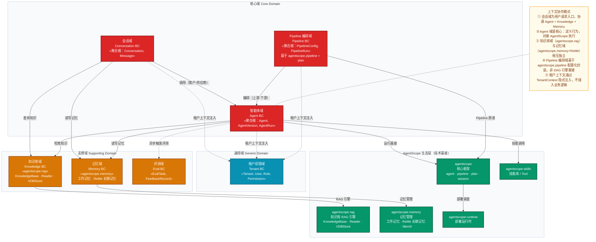
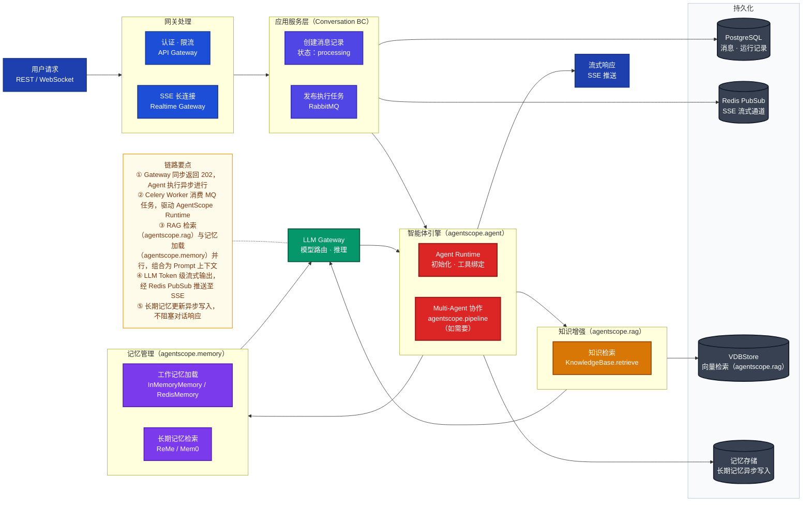
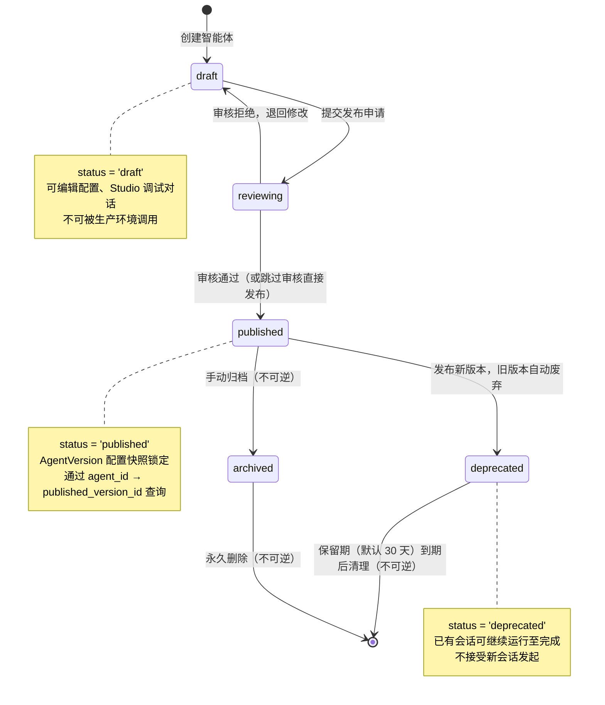
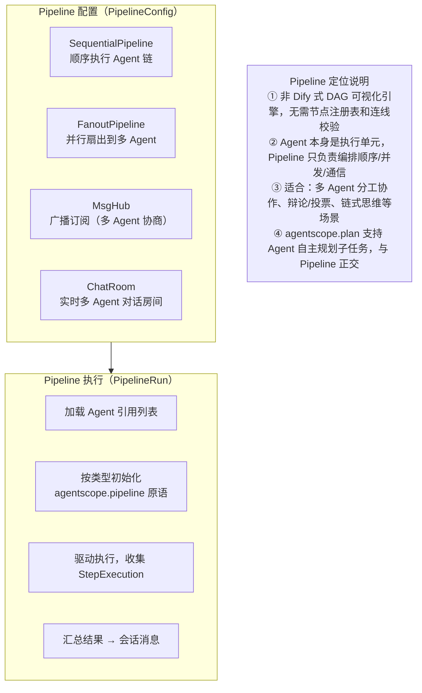

# 智能体平台架构设计方案（DDD）v1.1

> **文档版本**：v1.1（勘误修订版）
> **基于版本**：v1.0
> **参考基础**：AgentScope 1.0.16 源码实证分析、智能体平台项目架构设计文档 v0.1、后端架构设计文档 v1.0
> **定位**：以 DDD 为架构方法论的平台级设计方案，覆盖领域划分、系统架构、核心流程与分阶段实现计划

---

## 勘误说明（v1.0 → v1.1）

> 本次修订基于对 AgentScope 1.0.16 源码的实证分析，修正 v1.0 中与源码不符的架构描述。

| 编号 | 勘误位置 | v1.0 错误描述 | v1.1 修正说明 |
|------|---------|-------------|-------------|
| E-001 | 全文 | "ReMe 统一承接记忆管理与 RAG 检索" | RAG（`agentscope.rag`）与记忆（`agentscope.memory`）是两个独立模块；ReMe 是长期记忆的具体实现之一，不涉及 RAG |
| E-002 | §2.1、§2.2 | 工作流域（Workflow BC）定位为"DAG 工作流编排引擎，节点调度" | AgentScope 无 DAG 工作流引擎；编排能力来自 `agentscope.pipeline`（代码级 Pipeline 原语）；与 Dify 可视化画布定位不同，应调整为 **Pipeline 编排域** |
| E-003 | §4.2 | ReMe 集成描述混淆了 RAG 检索与记忆管理职责 | 重写为两个独立章节：RAG 知识库集成（`agentscope.rag`）+ 记忆管理集成（`agentscope.memory` + ReMe） |
| E-004 | §4.1 | `ECO_REME["ReMe\n记忆 + RAG 引擎"]` | 修正为：RAG 模块（`agentscope.rag`）与 ReMe 长期记忆（`agentscope.memory`）独立列示 |
| E-005 | ADR-002 | "ReMe 替代独立 RAG 框架" | AgentScope 已内置 RAG 模块（`agentscope.rag`），无需引入外部 RAG 框架；ReMe 承担长期记忆，与 RAG 职责互补而非替代 |
| E-006 | §4.2 | `ReMeLight` 类名 | 源码中无此类；短期记忆由 `InMemoryMemory`/`RedisMemory`/`AsyncSQLAlchemyMemory` 承担 |

---

## 一、设计目标与原则

### 1.1 定位与目标

以 **AgentScope 生态**（核心框架 / ReMe 长期记忆 / RAG 知识库 / Skills / Runtime）为技术底座，以 **DDD（领域驱动设计）** 为架构方法论，构建企业级智能体平台，提供智能体全生命周期管理能力，覆盖开发 → 调试 → 发布 → 运营全流程，支撑多租户、多业务场景下的智能体应用快速落地。

### 1.2 核心原则

| 原则 | 说明 |
|------|------|
| **领域优先** | 以业务语言划定限界上下文，代码结构跟随领域边界，而非按技术层切分 |
| **生态复用** | AgentScope 生态组件优先复用：`agentscope.rag` 承接知识库 RAG 检索；`agentscope.memory`（含 ReMe 长期记忆）承接记忆管理；两个模块职责互补，均无需引入独立外部框架 |
| **Pipeline 而非 DAG 引擎** | AgentScope 定位是**代码优先的多智能体框架**，不是 Dify 式可视化流程编排平台；多智能体编排基于 `agentscope.pipeline` 原语（Sequential/Fanout/MsgHub/ChatRoom）配置化实现，无需独立实现 DAG 节点引擎 |
| **模块化单体** | MVP 以模块化单体部署，模块边界对齐限界上下文，保留按域拆分为独立服务的通道 |
| **渐进演进** | 先闭环核心对话链路（Phase 1），再扩展 Pipeline 编排与多租户（Phase 2），最后完善评测与安全合规（Phase 3） |
| **可观测可治理** | 全链路追踪 / 指标 / 日志贯穿全层，多租户隔离与安全审计以横切关注点方式注入 |

---

## 二、领域划分（DDD）

### 2.1 核心域 / 支撑域 / 通用域

| 类型 | 限界上下文 | 核心职责 | 技术映射（AgentScope 源码） | 战略地位 |
|------|-----------|---------|--------------------------|---------|
| **核心域** | 智能体域（Agent BC） | 智能体定义、版本管理、运行调度 | `agentscope.agent`、`agentscope.session` | 平台核心竞争力，优先投入 |
| **核心域** | 会话域（Conversation BC） | 多轮对话生命周期、消息流管理 | `agentscope.message`、`agentscope.formatter` | 用户直接感知的体验入口 |
| **核心域** | Pipeline 编排域（Pipeline BC） | 多智能体 Pipeline 配置与调度（Sequential/Fanout/MsgHub/ChatRoom）；智能体任务规划（Plan/SubTask） | `agentscope.pipeline`、`agentscope.plan` | 支撑复杂多智能体协作场景；**注意**：不是 Dify 式 DAG 可视化引擎，是配置化的 Pipeline 编排 |
| **支撑域** | 知识库域（Knowledge BC） | 知识库管理、文档解析与索引（多格式 Reader）、向量存储、RAG 检索 | `agentscope.rag`（`KnowledgeBase`、`SimpleKnowledge`、`QdrantStore`、`TextReader`、`ImageReader` 等） | 增强智能体知识能力；AgentScope 原生 RAG，无需外部框架 |
| **支撑域** | 记忆域（Memory BC） | 工作记忆（会话上下文窗口）、长期记忆（个人/任务/工具）管理 | `agentscope.memory`（`InMemoryMemory`、`RedisMemory`、`AsyncSQLAlchemyMemory`、`ReMePersonalLongTermMemory`、`ReMeTaskLongTermMemory`、`ReMeToolLongTermMemory`、`Mem0LongTermMemory`） | 增强智能体记忆能力；ReMe 为长期记忆的核心实现 |
| **支撑域** | 评测域（Eval BC） | 智能体质量评测、反馈闭环优化 | `agentscope.evaluate` | 能力持续提升，Phase 2 引入 |
| **通用域** | 租户权限域（Tenant BC） | 多租户隔离、RBAC、配额管理 | 平台自建（Casbin + JWT） | 标准化通用能力，可复用成熟方案 |

> **架构决策说明（工作流域 vs Pipeline 编排域）**
>
> v1.0 将"工作流域"定位为"DAG 工作流编排引擎"（参考 Dify），但 AgentScope 的实际定位与 Dify 不同：
>
> | 对比项 | Dify | AgentScope |
> |--------|------|------------|
> | 目标用户 | 业务人员（无代码/低代码） | 开发者（代码优先） |
> | 编排方式 | 可视化 DAG 画布（节点拖拽） | 代码级 Pipeline 原语（Sequential/Fanout/MsgHub） |
> | 工作流引擎 | 独立 DAG 执行引擎 + 节点调度 | `agentscope.pipeline` + `agentscope.plan` |
> | 是否需要节点注册表 | 是（LLM节点/工具节点/条件节点等） | 否（Agent 本身即执行单元） |
>
> 因此，平台应基于 `agentscope.pipeline` 的**配置化封装**提供多智能体协作能力，而非重新实现 DAG 引擎。这显著降低了工程复杂度，也更符合 AgentScope 生态定位。

### 2.2 限界上下文地图



### 2.3 核心聚合根与不变量

| 限界上下文 | 聚合根 | 核心实体 / 值对象 | 关键不变量 |
|-----------|--------|-----------------|----------|
| 智能体域 | `Agent` | `AgentVersion`, `AgentConfig`, `ToolBinding` | 同一时刻只有一个「已发布版本」可接受新会话 |
| 智能体域 | `AgentRun` | `RunStep`, `ToolCall`, `TokenUsage` | 运行记录只追加，不可修改历史 |
| Pipeline 编排域 | `PipelineConfig` | `PipelineType`（Sequential/Fanout/MsgHub/ChatRoom）、`AgentRef[]`、`PipelineParam` | Pipeline 类型确定后不允许修改（需创建新版本）；AgentRef 引用的 Agent 必须处于已发布状态 |
| Pipeline 编排域 | `PipelineRun` | `StepExecution`, `AgentRunRef[]` | 运行快照与触发时的 PipelineConfig 版本绑定，版本更新不影响历史执行 |
| 会话域 | `Conversation` | `Message`, `ConversationConfig` | 消息严格有序，不允许乱序写入 |
| 知识库域 | `KnowledgeBase` | `Document`, `DocMetadata` | 向量索引与文档状态同步，删除文档必须同步清理向量；文档分块（Chunk）策略由 Reader 配置决定，建库后不可变更 |
| 记忆域 | `MemoryScope` | `WorkingMemory`, `LongTermMemoryEntry` | 工作记忆容量受 token 窗口约束；长期记忆写入异步进行，不阻塞对话响应 |
| 租户权限域 | `Tenant` | `User`, `Role`, `Permission` | 所有业务资源操作必须归属于某租户，不允许跨租户访问 |

---

## 三、总体架构

### 3.1 系统架构图

```mermaid
flowchart TB
    %% ── 配色定义 ────────────────────────────────────────────────────
    classDef clientStyle  fill:#1f2937,stroke:#111827,stroke-width:2px,color:#f9fafb
    classDef gatewayStyle fill:#1d4ed8,stroke:#1e3a8a,stroke-width:2.5px,color:#fff
    classDef appStyle     fill:#0891b2,stroke:#155e75,stroke-width:2px,color:#fff
    classDef domainStyle  fill:#dc2626,stroke:#991b1b,stroke-width:2.5px,color:#fff
    classDef ecoStyle     fill:#059669,stroke:#064e3b,stroke-width:2px,color:#fff
    classDef infraStyle   fill:#374151,stroke:#111827,stroke-width:2px,color:#fff
    classDef crossStyle   fill:#7c3aed,stroke:#5b21b6,stroke-width:1.5px,color:#fff
    classDef noteStyle    fill:#fffbeb,stroke:#f59e0b,stroke-width:1.5px,color:#78350f
    classDef layerStyle   fill:#f8fafc,stroke:#cbd5e0,stroke-width:1.5px

    %% ── 用户接入层 ───────────────────────────────────────────────────
    subgraph CLIENT["用户接入层"]
        direction LR
        C1["Web 控制台<br>Spark-Design"]:::clientStyle
        C2["Studio 交互界面<br>agentscope-studio"]:::clientStyle
        C3["Open API / SDK"]:::clientStyle
    end
    class CLIENT layerStyle

    %% ── 网关层 ──────────────────────────────────────────────────────
    subgraph GATEWAY["网关层"]
        direction LR
        G1["API Gateway<br>路由 · 认证 · 限流"]:::gatewayStyle
        G2["LLM Gateway<br>模型路由 · 配额 · 降级"]:::gatewayStyle
        G3["Realtime Gateway<br>WebSocket · SSE"]:::gatewayStyle
    end
    class GATEWAY layerStyle

    %% ── 应用服务层（按限界上下文组织） ───────────────────────────────
    subgraph APP["应用服务层（限界上下文）"]
        direction LR
        A1["智能体应用服务<br>Agent BC"]:::appStyle
        A2["Pipeline 编排服务<br>Pipeline BC"]:::appStyle
        A3["会话应用服务<br>Conversation BC"]:::appStyle
        A4["租户权限服务<br>Tenant BC"]:::appStyle
    end
    class APP layerStyle

    %% ── 领域层（AgentScope 核心）────────────────────────────────────
    subgraph DOMAIN["领域层（AgentScope 核心）"]
        direction LR
        D1["Agent Runtime<br>agentscope.agent · session"]:::domainStyle
        D2["Multi-Agent 编排<br>agentscope.pipeline · plan<br>Sequential/Fanout/MsgHub/ChatRoom"]:::domainStyle
        D3["知识库<br>agentscope.rag<br>KnowledgeBase · Reader · VDBStore"]:::domainStyle
        D4["记忆管理<br>agentscope.memory<br>工作记忆 · ReMe/Mem0 长期记忆"]:::domainStyle
    end
    class DOMAIN layerStyle

    %% ── 能力生态层 ───────────────────────────────────────────────────
    subgraph ECO["AgentScope 能力生态层"]
        direction LR
        E1["agentscope-skills<br>预制技能库"]:::ecoStyle
        E2["agentscope.tool<br>Toolkit · MCP"]:::ecoStyle
        E3["Eval & Optimize<br>评测优化（Eval BC）"]:::ecoStyle
        E4["Guardrails<br>安全护栏"]:::ecoStyle
    end
    class ECO layerStyle

    %% ── 基础设施层 ───────────────────────────────────────────────────
    subgraph INFRA["基础设施层"]
        direction LR
        I1[("PostgreSQL<br>主数据库")]:::infraStyle
        I2[("Redis<br>缓存 · 限流 · PubSub<br>工作记忆（RedisMemory）")]:::infraStyle
        I3[("RabbitMQ<br>异步消息")]:::infraStyle
        I4[("Qdrant / pgvector<br>向量存储<br>agentscope.rag VDBStore")]:::infraStyle
        I5[("MinIO<br>文件存储<br>知识库文档原文")]:::infraStyle
    end
    class INFRA layerStyle

    %% ── 横切关注点 ───────────────────────────────────────────────────
    subgraph CROSS["横切关注点（贯穿全层）"]
        direction LR
        X1["可观测性<br>OTel · Prometheus · Loki<br>agentscope.tracing"]:::crossStyle
        X2["安全合规<br>TLS · 审计 · 脱敏"]:::crossStyle
        X3["agentscope-runtime<br>部署 · 调度 · 弹性"]:::crossStyle
    end
    class CROSS layerStyle

    %% ── 层间调用关系 ─────────────────────────────────────────────────
    CLIENT --> GATEWAY
    GATEWAY --> APP
    APP --> DOMAIN
    DOMAIN --> ECO
    APP --> INFRA
    DOMAIN --> INFRA
    ECO --> INFRA
    CROSS -.->|"贯穿全层"| GATEWAY
    CROSS -.->|"贯穿全层"| APP
    CROSS -.->|"贯穿全层"| DOMAIN

    %% ── 注记 ─────────────────────────────────────────────────────────
    NOTE["架构要点<br>① 网关层统一处理认证/限流/路由，应用层不含流量治理逻辑<br>② 应用层按限界上下文划分，模块间通过领域事件/应用接口交互<br>③ 领域层 D3（agentscope.rag）与 D4（agentscope.memory）职责独立，禁止混用<br>④ Pipeline BC 基于 agentscope.pipeline 配置化封装，无需重建 DAG 引擎<br>⑤ Eval / Guardrails 在能力生态层，由应用层按需接入<br>⑥ 横切关注点以 Middleware / Decorator 方式嵌入，不侵入领域层"]:::noteStyle
    NOTE -.- APP
```



### 3.2 DDD 四层架构说明

各限界上下文内部按 DDD 四层组织代码，以**智能体域（Agent BC）**为例：

| DDD 层次 | 对应代码组件 | 核心职责 | 关键约束 |
|---------|------------|---------|---------|
| **接口层** | FastAPI Router、Pydantic Schema | HTTP 接口定义、请求/响应映射、参数校验 | 不含业务逻辑，仅做协议转换 |
| **应用层** | Application Service、Command/Query Handler | 用例编排、事务边界、领域事件发布 | 依赖领域层接口，不直接访问基础设施 |
| **领域层** | Aggregate Root、Domain Service、领域事件 | 业务规则与不变量、核心计算逻辑 | 不依赖任何外部框架，纯粹业务代码 |
| **基础设施层** | Repository 实现、外部适配器 | 持久化实现、AgentScope / RAG / Memory / MQ 集成 | 实现领域层定义的接口，隔离技术细节 |

> **目录结构约定**：`src/{bounded_context}/{interface,application,domain,infrastructure}/`，每个限界上下文独立分包，严禁跨包直接调用内部实现。

---

## 四、AgentScope 生态集成方案

### 4.1 生态组件与平台层次映射

| AgentScope 组件 | 平台层次 | 集成方式 |
|----------------|---------|---------|
| **agentscope**（核心框架） | 领域层 | Agent Runtime 执行基座；`agentscope.agent`、`agentscope.session`、`agentscope.message` |
| **agentscope.pipeline**（多智能体编排） | 领域层 | Pipeline BC 技术底座；`SequentialPipeline`、`FanoutPipeline`、`MsgHub`、`ChatRoom` 封装为配置化 Pipeline 类型 |
| **agentscope.plan**（任务规划） | 领域层 | Pipeline BC 的任务规划子能力；`Plan`、`SubTask`、`PlanNotebook` 支持 ReAct 风格的规划执行 |
| **agentscope.rag**（RAG 知识库） | 领域层 / 基础设施层 | 知识库域（Knowledge BC）唯一技术底座；`KnowledgeBase`、`SimpleKnowledge`、多格式 Reader、多后端 VDBStore |
| **agentscope.memory**（记忆管理） | 领域层 / 基础设施层 | 记忆域（Memory BC）技术底座；工作记忆（`InMemoryMemory`/`RedisMemory`）+ 长期记忆（ReMe/Mem0） |
| **agentscope.tool / MCP**（工具层） | 能力生态层 | `Toolkit` 统一管理工具；`agentscope.mcp` 支持 MCP 协议工具接入 |
| **agentscope.evaluate**（评测） | 能力生态层 | 评测域（Eval BC）的执行引擎 |
| **agentscope.tracing**（追踪） | 横切关注点 | 全链路追踪，对接 OpenTelemetry |
| **agentscope-skills**（技能库） | 能力生态层 | 基础设施层 `ToolRegistry` 统一注册，智能体配置时绑定 |
| **agentscope-runtime**（运行时） | 横切 / 运维 | 智能体应用部署调度、弹性伸缩、故障恢复 |
| **agentscope-studio**（可视化） | 用户接入层 | 扩展为智能体交互界面和多 Agent 可视化调试工具 |
| **agentscope-spark-design**（设计体系） | 用户接入层 | Web 控制台统一 UI 组件库 |

### 4.2 RAG 知识库集成（agentscope.rag）

`agentscope.rag` 是 AgentScope 框架原生内置的 RAG 模块，**与记忆管理模块相互独立**，专门负责知识库的文档管理与检索增强。

```
agentscope.rag
├── Document / DocMetadata          # 文档块与元数据模型
├── KnowledgeBase                   # 知识库抽象：绑定 VDBStore + EmbeddingModel
├── SimpleKnowledge                 # KnowledgeBase 的即用实现
├── _reader/                        # 文档解析（切块）层
│   ├── TextReader                  # 纯文本
│   ├── PDFReader                   # PDF
│   ├── ImageReader                 # 图像（多模态 RAG）
│   ├── WordReader / ExcelReader / PowerPointReader
│   └── ReaderBase                  # 扩展自定义 Reader 的基类
└── _store/                         # 向量数据库适配层
    ├── QdrantStore                 # Qdrant（推荐生产环境）
    ├── MilvusLiteStore             # Milvus Lite
    ├── MongoDBStore / OceanBaseStore / AlibabaCloudMySQLStore
    └── VDBStoreBase                # 扩展自定义 Store 的基类
```

| 能力 | 技术方案 | 说明 |
|------|---------|------|
| **文档解析** | 多格式 Reader（Text/PDF/Image/Word/Excel/PPT） | 自动切块，产出 `Document` 对象列表 |
| **向量索引** | VDBStore 多后端（Qdrant/Milvus/MongoDB 等） | `KnowledgeBase` 统一接口，切换后端无需改业务代码 |
| **检索增强** | `KnowledgeBase.retrieve(query, top_k)` | 向量相似度检索，支持元数据过滤 |
| **多租户隔离** | Collection / Namespace 级隔离 | 每租户独立向量集合，防止知识泄漏 |
| **MVP 选型** | pgvector（起步）→ Qdrant（扩展） | `agentscope.rag` 支持多后端，迁移无需改业务代码 |

### 4.3 记忆管理集成（agentscope.memory + ReMe）

`agentscope.memory` 是 AgentScope 框架原生内置的记忆管理模块，**与 RAG 知识库模块相互独立**，专门负责智能体的工作记忆（短期）和长期记忆管理。

```
agentscope.memory
├── _working_memory/                # 工作记忆（会话级短期记忆）
│   ├── MemoryBase                  # 工作记忆抽象基类
│   ├── InMemoryMemory              # 内存实现（开发/测试）
│   ├── RedisMemory                 # Redis 实现（生产推荐）
│   └── AsyncSQLAlchemyMemory       # DB 持久化实现
└── _long_term_memory/              # 长期记忆（跨会话持久记忆）
    ├── LongTermMemoryBase          # 长期记忆抽象基类
    ├── _reme/                      # ReMe 长期记忆实现
    │   ├── ReMePersonalLongTermMemory   # 个人偏好/画像记忆
    │   ├── ReMeTaskLongTermMemory       # 任务知识记忆
    │   └── ReMeToolLongTermMemory       # 工具使用经验记忆
    └── _mem0/                      # Mem0 长期记忆实现（备选）
        └── Mem0LongTermMemory
```

| 能力 | 技术方案 | 说明 |
|------|---------|------|
| **工作记忆** | `InMemoryMemory` / `RedisMemory` / `AsyncSQLAlchemyMemory` | 会话上下文窗口管理，控制发送给 LLM 的 token 量 |
| **个人长期记忆** | `ReMePersonalLongTermMemory` | 跨会话的用户偏好、习惯、画像积累 |
| **任务长期记忆** | `ReMeTaskLongTermMemory` | 特定任务领域的知识经验积累 |
| **工具长期记忆** | `ReMeToolLongTermMemory` | 工具调用经验、参数偏好记忆 |
| **备选实现** | `Mem0LongTermMemory` | Mem0 框架集成，可作为 ReMe 的替代选项 |
| **异步写入** | 后台任务（不阻塞对话响应） | 长期记忆写入不在关键路径上，保证低延迟响应 |

> **RAG vs 记忆的职责边界**
>
> | 维度 | RAG 知识库（agentscope.rag） | 记忆管理（agentscope.memory） |
> |------|---------------------------|--------------------------|
> | 数据来源 | 用户上传的文档/知识文件 | 智能体的对话历史、用户行为 |
> | 写入时机 | 人工触发（导入/更新知识库） | 对话过程中自动积累 |
> | 检索方式 | 向量相似度检索（`KnowledgeBase.retrieve`） | 结构化查询 + 向量检索（`LongTermMemoryBase.search`） |
> | 典型场景 | 企业知识问答、文档助手 | 个性化对话、跨会话上下文延续 |

---

## 五、核心流程设计

### 5.1 智能体对话端到端链路



### 5.2 对话异步执行时序

```mermaid
sequenceDiagram
    autonumber
    participant U as 用户客户端
    participant GW as API Gateway
    participant CONV as 会话应用服务
    participant MQ as RabbitMQ
    participant CELERY as Celery Worker
    participant RT as Agent Runtime (agentscope.agent)
    participant RAG as RAG 知识库 (agentscope.rag)
    participant MEM as 记忆管理 (agentscope.memory)
    participant LLM as LLM Gateway

    Note over U,GW: ① 请求接入 — 同步，立即返回任务 ID

    U->>GW: POST /api/v1/conversations/{id}/messages
    GW->>GW: JWT 认证 · 限流 · 租户上下文注入
    GW->>CONV: 转发请求
    CONV->>MQ: 发布 AgentRunTask（message_id, agent_id）
    CONV-->>U: HTTP 202 { message_id }

    Note over U,MQ: ② 建立推流 — SSE 长连接保持打开

    U->>GW: GET /api/v1/messages/{id}/stream（EventSource）
    GW->>GW: 订阅 Redis channel:message_id

    Note over MQ,LLM: ③ 异步执行 — Celery Worker 独立进程

    MQ->>CELERY: 消费任务（BRPOP）
    CELERY->>RT: 初始化 AgentScope Agent（加载配置快照）
    par 并行加载上下文
        RT->>MEM: 加载工作记忆（InMemoryMemory/RedisMemory）
        RT->>MEM: 检索长期记忆（ReMePersonal/ReMeTask）
        RT->>RAG: KnowledgeBase.retrieve(query, top_k)
    end
    MEM-->>RT: 工作记忆 + 长期记忆召回结果
    RAG-->>RT: RAG 知识片段召回结果
    RT->>LLM: 构建 Prompt（工作记忆 + 长期记忆 + RAG 知识）→ 推理请求（stream=True）

    Note over RT,U: ④ 流式回传 — token 逐块推送

    loop 每个 token chunk
        LLM-->>RT: delta token
        RT->>GW: PUBLISH channel:message_id { token }
        GW-->>U: SSE: data: { token }
    end

    Note over RT,U: ⑤ 结束处理 — 异步落库，关闭推流

    RT->>MEM: 异步更新长期记忆（后台写入，不阻塞响应）
    RT->>CONV: 更新消息状态 → completed，写入 token 用量
    GW-->>U: SSE: data: [DONE]
```



### 5.3 智能体生命周期状态机



### 5.4 Pipeline 编排流程（多智能体协作）

> Pipeline BC 基于 `agentscope.pipeline` 原语，平台层面封装为可配置的 Pipeline 类型，用户通过 API/控制台配置，无需编写代码。



---

## 六、技术选型

| 领域 | 技术方案 | 选型理由 |
|------|---------|---------|
| **后端框架** | FastAPI + Python 3.11+ | 高性能异步，原生支持 SSE / WebSocket，与 AgentScope 生态同语言 |
| **数据校验** | Pydantic v2 + pydantic-settings | 强类型校验，Schema 与配置管理统一 |
| **ORM / 迁移** | SQLAlchemy 2.0 + Alembic | 异步 ORM 支持，版本化数据库迁移 |
| **任务队列** | Celery + RabbitMQ | 成熟稳定，支持优先级队列、重试、死信，与 Python 生态契合 |
| **缓存 / 限流** | Redis | 会话状态、SSE PubSub、限流计数；工作记忆 `RedisMemory` 直接复用 |
| **向量存储** | pgvector（MVP）→ Qdrant（扩展） | `agentscope.rag` 的 `VDBStoreBase` 支持多后端，`QdrantStore` 已内置；pgvector 降低初期运维复杂度 |
| **对象存储** | MinIO | 知识库文档原文、多模态附件，S3 兼容接口 |
| **鉴权** | JWT + OAuth2 + Casbin（RBAC） | 无状态认证，Casbin 管理细粒度权限策略 |
| **可观测性** | OpenTelemetry + Prometheus + Loki | 三遥统一；`agentscope.tracing` 原生支持 OTel |
| **前端** | React + TypeScript + Vite | 基于 AgentScope Spark-Design 组件库，Studio 可视化集成 |
| **容器化** | Docker Compose（开发）→ Kubernetes（生产） | 开发低门槛，生产弹性伸缩，agentscope-runtime 负责调度 |
| **智能体引擎** | agentscope（agent + pipeline + plan + rag + memory） | 生态原生，框架内置 RAG + 记忆 + 编排 + 工具四位一体 |

---

## 七、分阶段实现计划

### Phase 1：MVP 核心链路（1～2 月）

**目标**：单租户下完整跑通「创建智能体 → 发起对话 → 流式响应」核心链路，形成可演示的 MVP。

| 模块 | 实现内容 |
|------|---------|
| **用户接入层** | Web 控制台基础页面（Spark-Design）、Open API / OpenAI 兼容接口 |
| **网关层** | API Gateway（JWT 认证、基础限流）、SSE 实时推流通道 |
| **会话域** | 多轮对话创建、消息管理、SSE 流式推送、会话历史查询 |
| **智能体域** | 智能体 CRUD、版本快照、Chat Agent 类型、状态流转（draft → published）|
| **领域层** | AgentScope Agent Runtime 集成、LLM Gateway（多模型路由、配额基础控制）|
| **记忆域** | 工作记忆（`InMemoryMemory`/`RedisMemory`）会话上下文窗口管理 |
| **基础设施** | PostgreSQL + pgvector + Redis + RabbitMQ + Docker Compose |

**交付标准**：能通过 API 创建 Agent、发起对话、收到流式响应；核心链路 P99 端到端延迟 < 5s（不含 LLM 首 Token 时间）。

---

### Phase 2：能力增强（3～4 月）

**目标**：多租户隔离、知识库 RAG、长期记忆、Pipeline 多智能体编排、Studio 集成、评测闭环。

| 模块 | 实现内容 |
|------|---------|
| **租户权限域** | 多租户隔离（资源 namespace 隔离）、RBAC（Casbin）、配额管理与账单归属 |
| **知识库域** | `agentscope.rag` 集成：知识库 CRUD、多格式文档导入（TextReader/PDFReader 等）、向量检索；Qdrant/pgvector 多后端；多租户知识库 namespace 隔离 |
| **记忆域** | ReMe 长期记忆接入（`ReMePersonalLongTermMemory`/`ReMeTaskLongTermMemory`）；长期记忆异步写入；Mem0 备选支持 |
| **Pipeline 编排域** | `agentscope.pipeline` 封装：SequentialPipeline / FanoutPipeline / MsgHub 配置化；PipelineRun 状态管理；多 Agent 协作场景支持 |
| **评测域** | 基础评测任务（离线指标评估）、在线反馈采集（点赞 / 差评），简版评测报告 |
| **智能体域** | Task Agent、Pipeline Agent 类型扩展；工具（Tool / MCP）绑定增强 |
| **安全护栏** | 输入 / 输出内容过滤（Guardrails）、工具调用白名单 |
| **Studio 集成** | agentscope-studio 可视化调试集成，多 Agent 消息流可视化 |

**交付标准**：多租户隔离验证通过；Pipeline 能跑通 3 种以上协作模式（Sequential/Fanout/MsgHub）；RAG 检索相关性 > 80%；长期记忆跨会话验证通过；Studio 可调试 Multi-Agent 场景。

---

### Phase 3：生产就绪（5～6 月）

**目标**：全链路可观测、安全合规、性能调优、弹性部署，达到生产级 SLO。

| 模块 | 实现内容 |
|------|---------|
| **可观测性** | OpenTelemetry 全链路追踪（`agentscope.tracing`）、Prometheus + Grafana 指标看板、Loki 日志聚合、SLO 告警 |
| **安全合规** | TLS 全链路加密、PII 脱敏、密钥管理（Vault / 云 KMS）、全链路审计日志、数据生命周期管理 |
| **多模态** | 多模态消息支持（图像/语音），`agentscope.rag` 的 `ImageReader` 支持多模态 RAG |
| **弹性部署** | Kubernetes + agentscope-runtime，弹性伸缩、蓝绿 / 金丝雀发布，Helm Chart 交付 |
| **评测优化** | 离线基准评测、长期记忆质量评测（LoCoMo 等基准）、Prompt / 模型策略自动调优 |
| **性能** | 热点接口 Redis 缓存、向量索引优化（HNSW 参数调优）、LLM 语义相似度响应缓存 |

**交付标准**：P99 对话延迟 < 3s（不含模型首 Token）；全链路可观测，告警响应 < 5min；通过安全审计；支持 100 QPS 峰值稳定运行。

---

## 八、架构决策记录（ADR）

| 编号 | 决策 | 选型 | 核心理由 |
|------|------|------|---------|
| ADR-001 | 部署架构 | 模块化单体（Modular Monolith） | 中小团队 / 用户规模（~5000）不需微服务；模块边界对齐限界上下文，保留服务化拆分通道 |
| ADR-002 | RAG 方案 | **agentscope.rag 原生 RAG 模块**（修正 v1.0） | AgentScope 1.0.16 已内置完整 RAG 模块（`KnowledgeBase`/`SimpleKnowledge`/多格式 Reader/多后端 VDBStore），无需引入外部 RAG 框架；**ReMe 承担长期记忆，与 RAG 职责互补，而非替代关系** |
| ADR-003 | 异步通信 | Celery + RabbitMQ | 成熟稳定，支持优先级队列和死信，Python 生态天然契合 |
| ADR-004 | 向量存储 | pgvector 起步 → Qdrant 扩展 | MVP 降低运维复杂度；`agentscope.rag` 的 `VDBStoreBase` 抽象支持多后端，`QdrantStore` 已内置实现，迁移无需改业务代码 |
| ADR-005 | 多租户 | 应用层逻辑隔离 + Schema 隔离 | 单部署单元下折中方案；资源 namespace 隔离防止跨租户数据泄漏 |
| ADR-006 | 状态机驱动 | Agent / PipelineRun 显式状态机 | 异步链路中保证状态可查、可重入；支持断线重连后补发进度 |
| ADR-007 | Pipeline vs DAG 工作流（新增） | **基于 agentscope.pipeline 封装的 Pipeline BC**，而非 DAG 工作流引擎 | AgentScope 定位是代码优先的多智能体框架，不是 Dify 式可视化流程平台；`agentscope.pipeline` 提供 Sequential/Fanout/MsgHub/ChatRoom 四种编排原语，覆盖主流多智能体场景；实现 DAG 引擎（节点注册表/连线校验/可视化画布）工程量是 Pipeline 配置化的 5~10 倍，与 AgentScope 定位不符 |
| ADR-008 | 记忆长期化方案（新增） | ReMe 为主（`ReMePersonal/Task/ToolLongTermMemory`），Mem0 为备选 | ReMe 是 AgentScope 生态原生的长期记忆实现，分类细（个人/任务/工具）、与框架深度集成；Mem0 作为备选，两者共享 `LongTermMemoryBase` 接口，切换无需改业务代码 |
