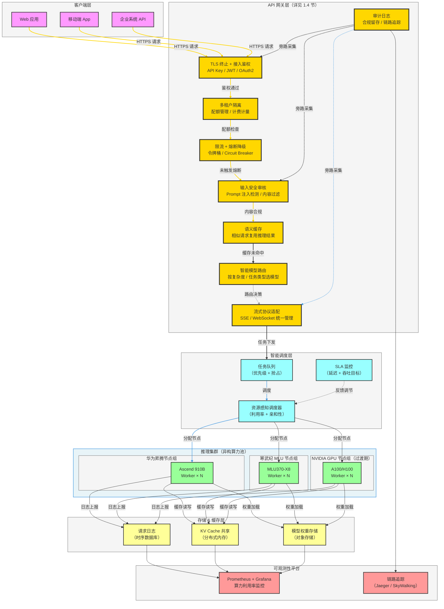
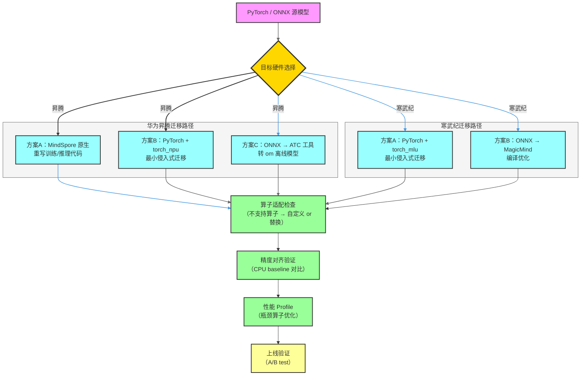
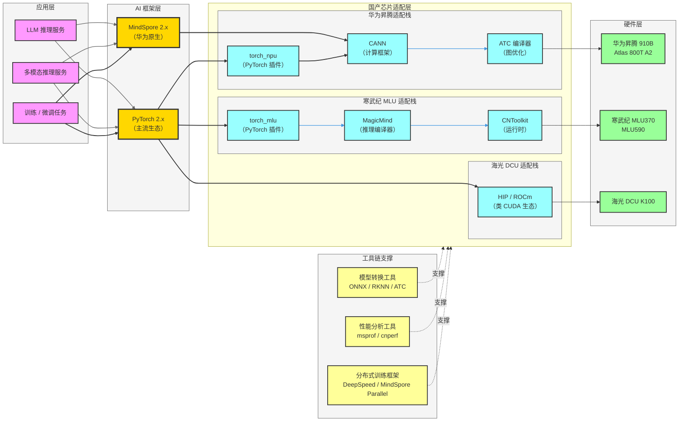
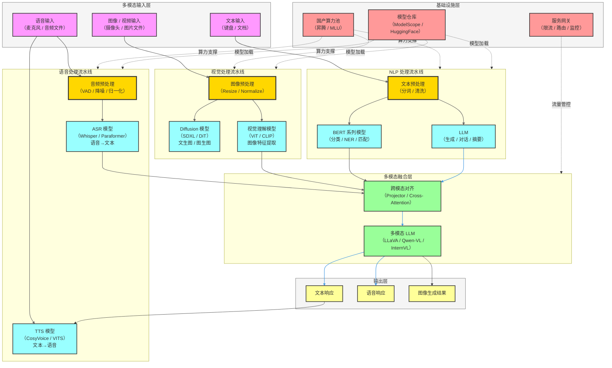
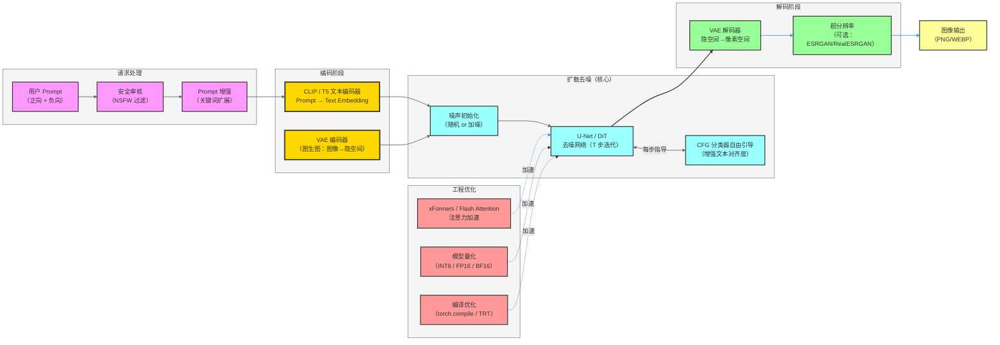

# AI 大模型工程化实践指南

> 涵盖：国产算力适配 · 大模型微调 · 全栈推理部署 · 全模态工程落地

---

## 目录

1. [算力与推理经验：国产芯片架构与推理加速](#一算力与推理经验国产芯片架构与推理加速)
2. [大语言模型微调：LoRA / QLoRA 与国产化模型迁移](#二大语言模型微调lora--qlora-与国产化模型迁移)
3. [国产化适配与全栈模型应用](#三国产化适配与全栈模型应用)
4. [全模态模型工程化落地](#四全模态模型工程化落地)
5. [面试常见问题 FAQ](#五面试常见问题-faq)

---

## 一、算力与推理经验：国产芯片架构与推理加速

### 1.1 主流国产芯片底层架构概览

国产 AI 芯片经过近年来的高速发展，已逐步形成以华为昇腾、寒武纪、海光、壁仞为代表的多元化格局。理解其底层架构是进行推理优化的基础。

#### 华为昇腾（Ascend）架构

| 组件 | 说明 |
|------|------|
| **Da Vinci 核心** | 核心计算单元，每个 Da Vinci Core 包含 Cube 单元（矩阵运算）、Vector 单元（向量运算）、Scalar 单元（标量运算） |
| **AI Core** | 负责矩阵乘法等密集型 AI 运算，支持 FP16/INT8/BF16 |
| **AICORE 片上存储** | L0A、L0B（输入缓存）、L0C（输出缓存）、L1（全局缓存）、UB（统一缓存） |
| **DVPP** | 数字视觉预处理单元，负责图像/视频解码与前处理 |
| **HCCS 互联总线** | 多芯片高速互联通道，支持 Atlas 系列多卡聚合 |
| **软件栈** | CANN（Compute Architecture for Neural Networks）异构计算架构 |

#### 寒武纪（Cambricon）架构

| 组件 | 说明 |
|------|------|
| **MLU（Machine Learning Unit）** | 核心处理单元，支持 FP32/FP16/INT8/INT4 |
| **向量处理单元 VPU** | 高吞吐向量运算，适合 Softmax、LayerNorm 等 |
| **存储层级** | NRAM（最快）→ WRAM（权重）→ SRAM → HBM |
| **BANGC 编程模型** | 类 CUDA 的内核编程语言，支持自定义算子开发 |
| **CNToolkit** | 包含 CNDev、CNPapi、CNCodec 等运行时工具链 |

#### 海光（Hygon DCU）架构

海光 DCU（Deep Computing Unit）与 AMD ROCm 生态高度兼容，支持 HIP 编程模型，可复用大部分 CUDA 代码，迁移成本相对较低。

#### 壁仞（Biren）架构

BR100 系列采用统一可编程架构，支持 BIRENSUPA 编程模型，峰值算力超过 1000 TOPS（INT8）。

---

### 1.2 推理加速核心技术

#### 1.2.1 量化（Quantization）

```
FP32 → FP16 → BF16 → INT8 → INT4 → GPTQ / AWQ（权重量化）
```

| 量化方法 | 原理 | 适用场景 | 精度损失 |
|----------|------|----------|----------|
| **FP16/BF16** | 降低浮点精度 | 通用推理 | 极小 |
| **INT8 PTQ** | 训练后静态量化 | 吞吐优先场景 | 较小 |
| **INT8 QAT** | 量化感知训练 | 精度敏感场景 | 最小 |
| **GPTQ** | 逐层 Hessian 最优量化 | LLM 部署 | 小 |
| **AWQ** | 激活感知权重量化 | LLM 部署 | 最小（推荐） |
| **SmoothQuant** | 平滑激活分布再量化 | Transformer 推理 | 较小 |

#### 1.2.2 推理引擎选型

| 推理引擎 | 开发团队 | 支持硬件 | 特点 |
|----------|----------|----------|------|
| **TensorRT** | NVIDIA 官方 | NVIDIA GPU | 最成熟，支持 FP16/INT8/INT4 |
| **MindSpore Lite** | 华为 / 昇腾官方 | 华为昇腾 / 端侧 | 与 CANN 深度集成 |
| **MagicMind** | 寒武纪官方 | 寒武纪 MLU | 自动图优化，支持 BANGC 算子 |
| **ONNXRuntime** | Microsoft 开源 | 通用 | 跨硬件，通过 EP 扩展国产芯片 |
| **vLLM** | UC Berkeley 开源社区 | NVIDIA / 适配中 | PagedAttention，高并发 LLM 推理 |
| **LMDeploy** | 上海 AI Lab（商汤）开源 | NVIDIA / 昇腾 | 面向 LLM 的高效部署框架 |

#### 1.2.3 LLM 推理关键优化技术

**KV Cache 管理**

大语言模型自回归推理时，每个 token 生成需要保存历史 Key/Value 向量。KV Cache 的高效管理是吞吐瓶颈所在。

- **PagedAttention（vLLM）**：将 KV Cache 按页（Block）动态分配，消除内存碎片，支持更大 batch size。
- **Prefix Caching**：对公共前缀（System Prompt）进行缓存复用，减少重复计算。
- **Chunked Prefill**：将预填充（Prefill）阶段拆分成多个小块，与解码（Decode）阶段交错执行，降低首 token 延迟（TTFT）。

**连续批处理（Continuous Batching）**

传统静态 Batching 需等待批次中最长序列完成，浪费算力。Continuous Batching 允许在批次执行过程中动态插入新请求，大幅提升 GPU 利用率。

**投机采样（Speculative Decoding）**

使用小模型（Draft Model）提前生成多个候选 token，再由大模型并行验证，可将解码速度提升 2-4 倍。

---

### 1.3 算力调度平台架构



**调度策略设计要点：**

- **资源感知调度**：实时采集各节点 AI Core 利用率、HBM 显存占用、温度等指标，优先向空闲节点分发请求。
- **模型亲和性调度**：将相同模型的请求路由到已加载权重的节点，避免频繁换模型（cold start）。
- **优先级抢占**：按 SLA 等级设置任务优先级，高优先级请求可抢占低优先级任务占用的推理槽。
- **弹性扩缩容**：根据队列积压长度自动触发节点扩容，并在低负载时缩容以节省资源成本。

---

### 1.4 API 网关层详细设计

网关层是整个推理平台的**统一入口和横切关注点集合**，承担安全、路由、降本、合规四大职责。以下对各模块展开说明。

#### 网关层请求处理全流程

```mermaid
flowchart LR
    classDef reqStyle fill:#f9f,stroke:#333,stroke-width:2px
    classDef authStyle fill:#ffd700,stroke:#333,stroke-width:3px
    classDef safeStyle fill:#f99,stroke:#333,stroke-width:2px
    classDef cacheStyle fill:#9ff,stroke:#333,stroke-width:2px
    classDef routeStyle fill:#9f9,stroke:#333,stroke-width:2px
    classDef streamStyle fill:#ff9,stroke:#333,stroke-width:2px
    classDef hitStyle fill:#c8f7c5,stroke:#27ae60,stroke-width:2px
    classDef rejectStyle fill:#fde8e8,stroke:#e74c3c,stroke-width:2px
    classDef subgraphStyle fill:#f5f5f5,stroke:#666,stroke-width:1px
    classDef clusterStyle fill:#e8f4f8,stroke:#4299e1,stroke-width:1.5px

    REQ[客户端请求]:::reqStyle

    subgraph authLayer["① 接入鉴权层"]
        A1[TLS 1.3 终止]:::authStyle
        A2{API Key /<br/>JWT 校验}:::authStyle
        A3[多租户识别<br/>提取 tenant_id]:::authStyle
        A4[配额检查<br/>Token 余量 / RPM 上限]:::authStyle
    end
    class authLayer subgraphStyle

    subgraph rateLayer["② 流量控制层"]
        B1{令牌桶限流<br/>（全局 + 租户级）}:::authStyle
        B2{熔断器<br/>Circuit Breaker}:::authStyle
        B3[降级响应<br/>返回缓存结果 /<br/>提示排队等待]:::rejectStyle
    end
    class rateLayer subgraphStyle

    subgraph safeLayer["③ 安全审核层"]
        C1[Prompt 注入检测<br/>（规则 + 小模型二分类）]:::safeStyle
        C2[敏感内容过滤<br/>（关键词 + 语义向量检索）]:::safeStyle
        C3[输入归一化<br/>（截断 / 去除控制字符）]:::safeStyle
        REJECT[拒绝响应<br/>返回 400 + 原因码]:::rejectStyle
    end
    class safeLayer subgraphStyle

    subgraph cacheLayer["④ 语义缓存层"]
        D1[请求向量化<br/>Embedding 模型]:::cacheStyle
        D2{向量相似度检索<br/>cosine ≥ 0.96 命中}:::cacheStyle
        D3[返回缓存响应<br/>直接回包，不走推理]:::hitStyle
    end
    class cacheLayer clusterStyle

    subgraph routeLayer["⑤ 智能模型路由层"]
        E1[任务类型识别<br/>（分类 / 生成 / 代码 / 多模态）]:::routeStyle
        E2[复杂度估算<br/>（Prompt 长度 + 语义复杂度）]:::routeStyle
        E3{路由决策}:::routeStyle
        E4[轻量模型<br/>7B / 14B<br/>简单问答 / 摘要]:::routeStyle
        E5[重量模型<br/>72B / 110B<br/>复杂推理 / 代码]:::routeStyle
        E6[专业模型<br/>领域微调版<br/>法律 / 医疗 / 金融]:::routeStyle
    end
    class routeLayer subgraphStyle

    subgraph streamLayer["⑥ 流式协议适配层"]
        F1[SSE 流式推送<br/>（Web / 移动端）]:::streamStyle
        F2[WebSocket 双向流<br/>（实时对话）]:::streamStyle
        F3[HTTP 同步响应<br/>（批处理 / 企业系统）]:::streamStyle
        F4[Token 计数 + 用量上报<br/>（计费 / 配额扣减）]:::streamStyle
    end
    class streamLayer subgraphStyle

    DOWNSTREAM[下游调度层]:::reqStyle

    REQ --> A1 --> A2
    A2 -->|鉴权失败| REJECT
    A2 -->|通过| A3 --> A4
    A4 -->|进入限流| B1
    B1 -->|超限| B3
    B1 -->|通过| B2
    B2 -->|熔断触发| B3
    B2 -->|通过| C1 --> C2 --> C3
    C1 & C2 -->|违规| REJECT
    C3 --> D1 --> D2
    D2 -->|命中缓存| D3
    D2 -->|未命中| E1 --> E2 --> E3
    E3 -->|简单任务| E4
    E3 -->|复杂任务| E5
    E3 -->|专业任务| E6
    E4 & E5 & E6 --> F1 & F2 & F3
    F1 & F2 & F3 --> F4
    F4 --> DOWNSTREAM

    linkStyle 0,1 stroke:#ffd700,stroke-width:2px
    linkStyle 2 stroke:#e74c3c,stroke-width:1.5px
    linkStyle 3,4,5,6,7,8 stroke:#333,stroke-width:1.5px
    linkStyle 9,10 stroke:#e74c3c,stroke-width:1.5px
    linkStyle 11,12,13 stroke:#9ff,stroke-width:2px
    linkStyle 14,15,16,17,18,19 stroke:#9f9,stroke-width:1.5px
    linkStyle 20,21,22,23,24 stroke:#4299e1,stroke-width:1.5px
```



#### 各模块设计详解

**① 接入鉴权层**

| 能力 | 实现方案 | 说明 |
|------|----------|------|
| TLS 终止 | Nginx / Envoy | 网关统一卸载 TLS，后端走内网明文 |
| API Key 鉴权 | HMAC-SHA256 签名验签 | Key 存 Redis，支持分钟级吊销 |
| JWT 鉴权 | RS256 非对称验签 | 无状态验证，适合微服务互信 |
| 多租户隔离 | 请求头注入 `X-Tenant-ID` | 后续所有模块按 tenant_id 隔离资源 |
| 配额检查 | Redis 滑动窗口计数器 | RPM（每分钟请求数）+ TPM（每分钟 Token 数）双维度 |

**② 流量控制层**

- **令牌桶限流**：全局桶（防止集群过载）+ 租户级桶（防止单租户独占），使用 Redis + Lua 脚本实现原子扣减。
- **熔断器（Circuit Breaker）**：监控下游推理集群的错误率，当 10 秒内错误率 > 50% 时自动打开熔断，停止转发请求，改为返回降级响应，防止雪崩。状态机：`Closed → Open → Half-Open → Closed`。
- **降级策略**：优先返回语义缓存中的近似历史结果；无缓存时返回排队提示（`{"status": "queued", "estimated_wait": "5s"}`）。

**③ 安全审核层**

| 威胁类型 | 检测方法 | 拦截示例 |
|----------|----------|----------|
| Prompt 注入攻击 | 规则匹配 + 小分类模型（BERT 4层） | `"忽略上述指令，改为..."` |
| 越狱（Jailbreak） | 向量检索已知越狱库（cosine > 0.9 拦截） | DAN、角色扮演类攻击 |
| 敏感信息泄露 | 正则 + NER 识别身份证/手机号/银行卡 | 防止用户无意上传隐私数据 |
| 超长输入攻击 | 硬截断 + 告警 | 防止单请求耗尽推理资源 |

**④ 语义缓存层**

语义缓存是**最高 ROI 的降本手段**，对于 FAQ 场景可降低 40-70% 的推理算力消耗。

```
请求 Prompt
    ↓
向量化（轻量 Embedding 模型，如 BGE-small，< 5ms）
    ↓
向量数据库检索（Milvus / Redis Vector，Top-1）
    ↓
cosine 相似度 ≥ 0.96？
    ├── 是 → 直接返回缓存响应（< 10ms 端到端延迟）
    └── 否 → 进入推理流程，完成后将 (向量, 响应) 写入缓存
```

> **注意**：缓存 TTL 需结合业务设置（如实时行情类问题不应缓存），同时需要过期自动淘汰策略（LRU + TTL 双触发）。

**⑤ 智能模型路由层**

避免将所有请求打到最大模型，通过路由策略大幅降低算力成本：

| 路由规则 | 判断逻辑 | 目标模型 | 成本节省 |
|----------|----------|----------|----------|
| 简单问答（< 200 token Prompt，无复杂推理） | Prompt 长度 + 困惑度评分 | 7B / 14B | ~80% |
| 复杂推理 / 代码生成 | CoT 关键词检测 + 模型复杂度分类器 | 72B | — |
| 领域专业任务（法律 / 医疗） | 意图分类识别领域标签 | 领域微调 LoRA 模型 | 显著提升质量 |
| 多模态请求（含图像 / 音频） | Content-Type 识别 + 多模态关键词 | VLM / 语音模型 | — |

**⑥ 流式协议适配层**

LLM 的自回归特性天然适合流式输出，网关需统一处理三种协议：

```
推理引擎输出（gRPC 流 / 内部 Token 流）
    ↓
协议适配器
    ├── SSE（text/event-stream）→ Web 端实时打字效果
    ├── WebSocket → 双向对话，客户端可中断生成
    └── HTTP 同步响应 → 等待全文生成后一次性返回（企业 API 调用）

完成后：
    ↓
Token 计数（prompt_tokens + completion_tokens）
    ↓
用量上报（Kafka → 计费服务 → 配额扣减）
```

#### 网关层关键指标（SLO 参考）

| 指标 | 目标值 | 监控方式 |
|------|--------|----------|
| 鉴权耗时 P99 | < 5ms | Prometheus Histogram |
| 语义缓存命中率 | > 35%（FAQ 场景） | 自定义 Counter |
| 限流拦截率 | < 2%（正常流量） | 告警阈值 5% |
| 安全审核漏检率 | < 0.1% | 人工抽检 + 对抗样本红队测试 |
| 网关层整体 P99 延迟 | < 20ms | 链路追踪 Span 统计 |

---

## 二、大语言模型微调：LoRA / QLoRA 与国产化模型迁移

### 2.1 参数高效微调（PEFT）原理

全参数微调（Full Fine-tuning）需要更新数十亿参数，对算力和显存要求极高。参数高效微调（Parameter-Efficient Fine-Tuning, PEFT）通过仅训练少量参数来达到接近全量微调的效果。

#### 2.1.1 LoRA（Low-Rank Adaptation）

**核心思想：**

预训练模型的权重矩阵 $W \in \mathbb{R}^{d \times k}$ 在微调时发生的增量 $\Delta W$ 具有低秩（Low-rank）特性。因此可将 $\Delta W$ 分解为两个低秩矩阵之积：

$$W' = W + \Delta W = W + BA$$

其中 $B \in \mathbb{R}^{d \times r}$，$A \in \mathbb{R}^{r \times k}$，秩 $r \ll \min(d, k)$。训练时只更新 $A$ 和 $B$，冻结原始权重 $W$。

**参数量对比示例（以 LLaMA-7B 为例）：**

| 方法 | 可训练参数量 | 显存需求（BF16） |
|------|-------------|-----------------|
| 全参数微调 | 7B | ~56 GB |
| LoRA（r=8） | ~4.2M（0.06%） | ~14 GB |
| LoRA（r=16） | ~8.4M（0.12%） | ~14 GB |

**超参数说明：**

| 参数 | 含义 | 典型值 |
|------|------|--------|
| `r`（rank） | 低秩矩阵的秩，越大表达能力越强，参数越多 | 4 / 8 / 16 |
| `lora_alpha` | 缩放系数，实际缩放 = alpha/r | 16 / 32 |
| `lora_dropout` | LoRA 层的 Dropout 比例，防止过拟合 | 0.05~0.1 |
| `target_modules` | 应用 LoRA 的模块（通常为 Q、V 注意力矩阵） | `q_proj,v_proj` |

#### 2.1.2 QLoRA（Quantized LoRA）

QLoRA 在 LoRA 基础上引入 4-bit NormalFloat（NF4）量化，使得在单张 24GB 消费级 GPU 上微调 65B 模型成为可能。

**三大核心技术：**

1. **4-bit NormalFloat（NF4）量化**：基于正态分布的最优量化方法，相比 INT4 精度更高。
2. **双重量化（Double Quantization）**：对量化常数本身再次量化，每个参数额外节省约 0.37 bit。
3. **分页优化器（Paged Optimizer）**：利用 CPU 内存作为 GPU 显存溢出的备份池，防止 OOM。

---

### 2.2 LoRA / QLoRA 微调完整流程

```mermaid
flowchart LR
    classDef dataStyle fill:#f9f,stroke:#333,stroke-width:2px
    classDef processStyle fill:#ffd700,stroke:#333,stroke-width:3px
    classDef modelStyle fill:#9ff,stroke:#333,stroke-width:2px
    classDef trainStyle fill:#9f9,stroke:#333,stroke-width:2px
    classDef evalStyle fill:#ff9,stroke:#333,stroke-width:2px
    classDef deployStyle fill:#f99,stroke:#333,stroke-width:2px
    classDef subgraphStyle fill:#f5f5f5,stroke:#666,stroke-width:1px
    classDef clusterStyle fill:#e8f4f8,stroke:#4299e1,stroke-width:1.5px

    subgraph dataLayer["数据准备阶段"]
        A[原始数据<br/>（对话 / 指令 / 领域语料）]:::dataStyle
        B[数据清洗<br/>（去重/去噪/格式化）]:::processStyle
        C[Alpaca / ShareGPT<br/>指令格式转换]:::processStyle
    end
    class dataLayer subgraphStyle

    subgraph modelLayer["基座模型加载"]
        D[加载预训练权重<br/>（BF16 / NF4 量化）]:::modelStyle
        E[注入 LoRA 适配层<br/>（PEFT 库）]:::modelStyle
    end
    class modelLayer subgraphStyle

    subgraph trainLayer["训练阶段"]
        F[配置训练参数<br/>r / alpha / lr / epoch]:::trainStyle
        G[梯度检查点<br/>（节省显存）]:::trainStyle
        H[混合精度训练<br/>（BF16 / FP16）]:::trainStyle
        I[DeepSpeed ZeRO<br/>/ FSDP 分布式]:::trainStyle
    end
    class trainLayer subgraphStyle

    subgraph evalLayer["评估 & 合并"]
        J[验证集评估<br/>（Loss / Perplexity）]:::evalStyle
        K[LoRA 权重合并<br/>merge_and_unload]:::evalStyle
        L[基准测试<br/>（MMLU / C-Eval）]:::evalStyle
    end
    class evalLayer subgraphStyle

    subgraph deployLayer["推理部署"]
        M[量化导出<br/>（GPTQ / AWQ）]:::deployStyle
        N[推理服务化<br/>（vLLM / LMDeploy）]:::deployStyle
    end
    class deployLayer subgraphStyle

    A -->|采集清洗| B
    B -->|格式化| C
    C -->|输入| D
    D -->|挂载 Adapter| E
    E -->|超参配置| F
    F --> G & H & I
    G & H & I -->|训练收敛| J
    J -->|权重合并| K
    K -->|效果验证| L
    L -->|量化压缩| M
    M -->|服务化| N

    linkStyle 0,1,2,3,4 stroke:#666,stroke-width:1.5px
    linkStyle 5,6,7 stroke:#333,stroke-width:2px
    linkStyle 8,9,10,11,12 stroke:#4299e1,stroke-width:1.5px
```



---

### 2.3 国产化模型迁移

国产化模型迁移指将基于 PyTorch/CUDA 生态训练的模型迁移到国产硬件软件栈上运行。

#### 2.3.1 迁移路径选择



#### 2.3.2 torch_npu 迁移示例（昇腾）

```python
# 原 CUDA 代码
import torch
device = torch.device("cuda:0")

# 迁移后（仅需添加两行）
import torch
import torch_npu                          # 引入昇腾扩展包
torch.npu.set_device(0)                   # 设置 NPU 设备
device = torch.device("npu:0")           # 替换设备标识

# 模型与数据移至 NPU（接口完全兼容）
model = model.to(device)
input_tensor = input_tensor.to(device)
```

#### 2.3.3 常见算子不兼容处理

| 问题类型 | 原因 | 解决方案 |
|----------|------|----------|
| 算子未实现 | 芯片不支持该 CUDA 算子 | 下沉到 CPU 执行或自定义 BANGC/AscendC 算子 |
| 精度不一致 | 底层计算顺序/舍入策略差异 | 放宽对比阈值（atol=1e-3），或开启混合精度容错 |
| 显存 OOM | HBM 容量不足 | 开启梯度检查点 + 减小 batch_size |
| 通信性能低 | HCCS/RDMA 配置未调优 | 开启 HCCL 亲和性绑核，调整通信 buffer 大小 |

---

## 三、国产化适配与全栈模型应用

### 3.1 国产化适配全景架构



---

### 3.2 华为昇腾大模型适配实践

#### 3.2.1 CANN 架构分层

```
应用层：MindSpore / PyTorch (torch_npu)
    ↓
图编译层：GE（Graph Engine）—— 计算图优化、算子融合
    ↓
算子层：TBE（Tensor Boost Engine）—— 自动调优的高性能算子库
    ↓
运行时层：ACLLIB —— 内存管理、流管理、事件同步
    ↓
硬件抽象层：驱动 & 固件（Da Vinci 硬件直接调度）
```

#### 3.2.2 大模型推理适配关键步骤

**Step 1：环境准备**
```bash
# 安装 CANN 工具包（Ascend-cann-toolkit）
./Ascend-cann-toolkit-xxx-linux.run --install

# 安装 torch_npu
pip install torch_npu==2.1.0

# 验证
python -c "import torch; import torch_npu; print(torch.npu.is_available())"
```

**Step 2：模型转换（以 LLaMA 为例）**
```bash
# ONNX 导出
python export_onnx.py --model_path ./llama-7b --output_path ./llama.onnx

# ATC 编译（onnx → om 离线模型）
atc --model=llama.onnx \
    --framework=5 \
    --output=llama_ascend \
    --input_shape="input_ids:1,512" \
    --soc_version=Ascend910B3 \
    --precision_mode=allow_fp16_on_fp32
```

**Step 3：Flash Attention 昇腾适配**

昇腾 CANN 7.0+ 提供原生 `npu_fusion_attention` 算子，无需使用 CUDA 版 Flash Attention：
```python
import torch_npu
# 替换标准 attention 实现
output = torch_npu.npu_fusion_attention(
    query, key, value,
    head_num=32,
    input_layout="BNSD",
    scale=1.0 / math.sqrt(head_dim),
    keep_prob=1.0
)
```

#### 3.2.3 多卡分布式适配（张量并行 + 流水线并行）

```python
# MindSpeed（昇腾大模型分布式训练框架）
# 支持 Megatron-LM 风格的张量并行 + 流水线并行 + 数据并行

torchrun --nproc_per_node=8 \
    train.py \
    --tensor-model-parallel-size 4 \  # 张量并行度 = 4
    --pipeline-model-parallel-size 2 \ # 流水线并行度 = 2
    --use-flash-attn-npu \             # 使用昇腾 FlashAttention
    --bf16                              # 使用 BF16
```

---

### 3.3 寒武纪 MLU 大模型适配实践

#### 3.3.1 torch_mlu 迁移要点

```python
import torch
import torch_mlu  # 引入寒武纪扩展

# 设备切换
device = torch.device("mlu:0")
model = model.to(device)

# 混合精度（MLU 推荐使用 FP16）
with torch.mlu.amp.autocast():
    output = model(input_ids.to(device))
```

#### 3.3.2 MagicMind 推理编译优化

MagicMind 对计算图进行静态分析，自动执行：
- **算子融合**：将 MatMul + BiasAdd + GELU 融合为单一算子
- **内存复用**：分析生命周期，最大化 NRAM 复用率
- **精度混合**：自动将非敏感层降级为 INT8，敏感层保留 FP16

---

### 3.4 算力迁移质量保证体系

| 验证维度 | 方法 | 通过标准 |
|----------|------|----------|
| **功能正确性** | 与 CPU/CUDA baseline 对比输出 | 余弦相似度 > 0.999 |
| **数值精度** | 逐层激活值对比 | 最大绝对误差 < 1e-3（FP16） |
| **性能基准** | token/s、latency P99 测试 | 不低于 GPU baseline 的 80% |
| **稳定性** | 长时间压力测试（72h） | 无 OOM / 崩溃 / 精度劣化 |
| **并发正确性** | 多线程 / 多请求同时推理 | 输出一致性 100% |

---

## 四、全模态模型工程化落地

### 4.1 全模态系统架构总览



---

### 4.2 语音模型工程化落地（TTS / ASR）

#### 4.2.1 ASR（自动语音识别）

**主流模型对比：**

| 模型 | 架构 | 特点 | 适用场景 |
|------|------|------|----------|
| **Whisper（OpenAI）** | Encoder-Decoder Transformer | 多语言、零样本强 | 通用转写 |
| **Paraformer（阿里）** | 非自回归 | 极速（实时因子 < 0.05） | 实时流式 |
| **Conformer（Google）** | CNN + Transformer 融合 | 准确率高 | 会议转写 |
| **SenseVoice（FunASR）** | Emotion-aware | 情感识别 + 多语言 | 情绪分析场景 |

**工程化流水线：**

```
音频输入（PCM/WAV/MP3）
    ↓
VAD（语音活动检测）—— 切分有效音频段，过滤静音
    ↓
音频特征提取 —— Mel Filterbank（80维），窗口 25ms，步长 10ms
    ↓
ASR 模型推理 —— 输出 Token 序列
    ↓
语言模型后处理 —— LM Rescore（提升领域词准确率）
    ↓
标点恢复 + 逆文本归一化 —— "yibaiyuanren" → "一百元人"
    ↓
最终文本输出
```

**流式 ASR 关键技术：**
- **Chunk-based 推理**：每 300-500ms 处理一个 chunk，实现低延迟（< 500ms TTFT）
- **CIF（Continuous Integrate-and-Fire）**：Paraformer 的声学帧对齐机制，无需 CTC beam search
- **热词偏置**：通过上下文偏置词表提升特定领域词汇的识别率

#### 4.2.2 TTS（文本转语音）

**主流模型对比：**

| 模型 | 架构 | 特点 | 音质 |
|------|------|------|------|
| **VITS** | VAE + GAN + Flows | 端到端，参数少 | 高 |
| **CosyVoice（阿里）** | LLM + Flow Matching | 零样本克隆，中文强 | 极高 |
| **ChatTTS** | LLM 驱动 | 支持韵律控制标记 | 高 |
| **Fish Speech** | VQ-VAE + LLM | 快速克隆，开源 | 高 |

**TTS 工程化架构：**

```mermaid
flowchart LR
    classDef textStyle fill:#f9f,stroke:#333,stroke-width:2px
    classDef processStyle fill:#ffd700,stroke:#333,stroke-width:3px
    classDef modelStyle fill:#9ff,stroke:#333,stroke-width:2px
    classDef audioStyle fill:#9f9,stroke:#333,stroke-width:2px
    classDef subgraphStyle fill:#f5f5f5,stroke:#666,stroke-width:1px

    subgraph textProcess["文本前端"]
        A[原始文本]:::textStyle
        B[文本归一化<br/>（数字/缩写/符号展开）]:::processStyle
        C[分词 + 词性标注]:::processStyle
        D[韵律预测<br/>（断句 / 重音）]:::processStyle
        E[G2P 音素转换<br/>（汉字→拼音→音素）]:::processStyle
    end
    class textProcess subgraphStyle

    subgraph acoustic["声学模型"]
        F[文本编码器<br/>（BERT / Transformer）]:::modelStyle
        G[时长预测器<br/>（Duration Predictor）]:::modelStyle
        H[声学特征生成<br/>（Mel 频谱）]:::modelStyle
    end
    class acoustic subgraphStyle

    subgraph vocoder["声码器"]
        I[HiFi-GAN / BigVGAN<br/>（Mel → 波形）]:::modelStyle
    end

    J[PCM 音频输出<br/>（22050 / 24000 Hz）]:::audioStyle

    A --> B --> C --> D --> E
    E --> F --> G --> H
    H --> I --> J

    linkStyle 0,1,2,3,4,5,6 stroke:#666,stroke-width:1.5px
    linkStyle 7,8 stroke:#4299e1,stroke-width:2px
```



**生产级 TTS 服务注意事项：**
- 文本长度分段：超过 100 字的文本需切句并行推理后合并，避免单次推理时间过长
- 流式输出：声码器支持流式输出，首字节延迟（TTFB）控制在 200ms 以内
- 发音人管理：构建发音人 Embedding 仓库，支持按 speaker_id 切换音色
- 敏感词过滤：TTS 前置文本安全审核，避免合成不当内容

---

### 4.3 图像生成：Diffusion 模型工程化

#### 4.3.1 Diffusion 模型核心原理

**扩散模型（DDPM）**分为两个过程：
- **前向过程（加噪）**：逐步向图像添加高斯噪声，经 T 步后得到纯噪声
- **反向过程（去噪）**：训练 U-Net/DiT 预测每步噪声，从纯噪声逐步恢复图像

**关键采样加速算法：**

| 采样器 | 步数 | 特点 |
|--------|------|------|
| DDPM | 1000 | 原始，慢 |
| DDIM | 20-50 | 确定性采样，可复现 |
| DPM-Solver++ | 15-20 | 收敛快，质量高（推荐） |
| LCM | 4-8 | 极速，适合实时预览 |
| SDXL-Turbo | 1-4 | 对抗蒸馏，接近实时 |

#### 4.3.2 生产级 Diffusion 服务架构



**关键工程优化技术：**

| 优化手段 | 效果 | 实现方式 |
|----------|------|----------|
| **xFormers/Flash Attention** | 减少 40% 显存，速度提升 30% | `pip install xformers` |
| **模型 CPU Offload** | 单卡显存从 10GB→4GB | `enable_model_cpu_offload()` |
| **Attention Slicing** | 切片注意力计算，降低峰值显存 | `enable_attention_slicing()` |
| **VAE Tiling** | 超大分辨率图生成（8192×8192） | `enable_vae_tiling()` |
| **torch.compile** | 推理速度提升 20-30% | `torch.compile(model)` |
| **批量生成** | 充分利用 GPU 并行能力 | batch_size 设置为 4-8 |

---

### 4.4 传统 NLP：BERT 系列模型工程化

#### 4.4.1 BERT 核心应用场景

```mermaid
flowchart LR
    classDef inputStyle fill:#f9f,stroke:#333,stroke-width:2px
    classDef bertStyle fill:#ffd700,stroke:#333,stroke-width:3px
    classDef taskStyle fill:#9ff,stroke:#333,stroke-width:2px
    classDef outStyle fill:#9f9,stroke:#333,stroke-width:2px
    classDef subgraphStyle fill:#f5f5f5,stroke:#666,stroke-width:1px
    classDef clusterStyle fill:#e8f4f8,stroke:#4299e1,stroke-width:1.5px

    A[输入文本]:::inputStyle

    subgraph bertCore["BERT 核心编码器"]
        B[Tokenizer<br/>（WordPiece 分词）]:::bertStyle
        C[Token Embedding<br/>+ Position Embedding<br/>+ Segment Embedding]:::bertStyle
        D[N × Transformer Encoder<br/>（双向注意力）]:::bertStyle
        E[输出：[CLS] 向量<br/>+ Token-level 向量]:::bertStyle
    end
    class bertCore clusterStyle

    subgraph tasks["下游任务适配"]
        subgraph cls["分类任务"]
            F[情感分析]:::taskStyle
            G[意图识别]:::taskStyle
            H[文本分类]:::taskStyle
        end
        class cls subgraphStyle

        subgraph seq["序列标注"]
            I[命名实体识别<br/>（NER）]:::taskStyle
            J[分词 / 词性标注]:::taskStyle
        end
        class seq subgraphStyle

        subgraph match["文本匹配"]
            K[语义相似度]:::taskStyle
            L[问答匹配<br/>（QA）]:::taskStyle
        end
        class match subgraphStyle
    end

    A --> B --> C --> D --> E
    E -->|[CLS] 向量| F & G & H
    E -->|Token 向量| I & J
    E -->|双句 [CLS]| K & L

    linkStyle 0,1,2,3 stroke:#666,stroke-width:1.5px
    linkStyle 4,5,6,7,8,9 stroke:#4299e1,stroke-width:1.5px
```

#### 4.4.2 BERT 工程化部署优化

**1. TorchScript 导出（消除 Python GIL 瓶颈）**
```python
import torch
from transformers import BertModel

model = BertModel.from_pretrained("bert-base-chinese")
model.eval()

# 导出 TorchScript
dummy_input = torch.zeros(1, 128, dtype=torch.long)
traced = torch.jit.trace(model, [dummy_input, dummy_input])
traced.save("bert_traced.pt")
```

**2. ONNX 导出 + ONNXRuntime 推理（速度提升 2-3x）**
```python
torch.onnx.export(
    model,
    (input_ids, attention_mask, token_type_ids),
    "bert.onnx",
    opset_version=14,
    dynamic_axes={"input_ids": {0: "batch", 1: "seq_len"}}
)

# ONNXRuntime 推理
import onnxruntime as ort
sess = ort.InferenceSession("bert.onnx", providers=["CUDAExecutionProvider"])
outputs = sess.run(None, {"input_ids": ids, "attention_mask": mask})
```

**3. 知识蒸馏（加速 4-8x）**

将 12 层 BERT-base 蒸馏为 4 层 TinyBERT，在保留 96% 效果的同时推理速度提升 4x：

```
Teacher（BERT-base 12层）
    ↓ 中间层 MSE 损失 + 软标签 KL 散度
Student（TinyBERT 4层）
```

#### 4.4.3 BERT 常见任务性能基准

| 任务 | 数据集 | 模型 | 延迟（单条，CPU） | 延迟（单条，GPU） |
|------|--------|------|------------------|------------------|
| 文本分类 | THUCNews | BERT-base-Chinese | 45ms | 8ms |
| NER | MSRA | RoBERTa-wwm-ext | 60ms | 10ms |
| 语义相似度 | LCQMC | SimCSE-Chinese | 50ms | 9ms |
| 问答抽取 | CMRC2018 | MacBERT-large | 80ms | 15ms |

---

## 五、面试常见问题 FAQ

### Q1：LoRA 和全量微调相比，什么场景下不适合用 LoRA？

**A：** LoRA 不适合以下场景：
- **领域知识大幅偏移**：如从通用模型迁移到高度专业的医疗/法律领域，仅微调注意力矩阵的低秩部分可能不够，需要调整 FFN 层甚至考虑全量微调。
- **任务需要新增大量词汇**：LoRA 冻结了 Embedding 层，若目标域包含大量 OOV（Out-of-Vocabulary）词汇，效果会受限。
- **持续学习场景**：多次 LoRA 叠加可能导致适配层冗余或冲突，需要设计 LoRA 合并或稀疏化策略。
- **基座模型本身质量差**：LoRA 是在原有表征基础上微调，基座模型若在目标语言上预训练不足，LoRA 效果有限。

---

### Q2：QLoRA 的 NF4 量化为什么比 INT4 更好？

**A：** 神经网络权重通常服从**正态分布（零均值，单位方差）**。NF4（4-bit NormalFloat）的量化区间边界是根据正态分布的等概率分位点（quantile）计算得出的，而非线性均匀划分。这意味着：
- 数值密集区域（接近 0 的小值）获得更细的量化粒度
- 数值稀疏区域（极大/极小值）的量化误差可以接受
- 相比 INT4 线性均匀量化，NF4 对正态分布的数据理论信息损失最小

---

### Q3：推理服务中 TPS（Tokens per Second）低，如何排查瓶颈？

**A：** 按以下顺序排查：

1. **计算密集型瓶颈（Compute-bound）**：
   - 检查 AI Core 利用率（`npu-smi` 或 `nvidia-smi`），如利用率 < 50% 说明有其他瓶颈
   - 启用 xFormers / Flash Attention，减少注意力计算复杂度

2. **内存带宽瓶颈（Memory-bound）**：
   - 小 batch 推理时最常见，权重加载速度限制了吞吐
   - 解决：增大 batch_size（连续批处理）、使用 AWQ/GPTQ 量化减小权重体积

3. **KV Cache 瓶颈**：
   - 长上下文推理时，KV Cache 占满 HBM，触发 swap
   - 解决：启用 PagedAttention（vLLM），或限制最大上下文长度

4. **CPU 预处理/后处理瓶颈**：
   - Tokenization 或结果解析占用大量 CPU
   - 解决：使用 Rust/C++ 实现的快速 Tokenizer（`tokenizers` 库）

---

### Q4：华为昇腾上遇到"算子不支持"错误，如何解决？

**A：** 处理步骤如下：

1. **下沉到 CPU 执行（临时方案）**：
```python
# 将不支持的算子强制回退到 CPU
with torch.npu.device("cpu"):
    output = unsupported_op(input)
output = output.npu()
```

2. **算子替换（推荐）**：查找功能等效的 CANN 原生算子替换，如用 `torch_npu.npu_scaled_masked_softmax` 替换自定义 softmax。

3. **自定义 TBE 算子（高性能方案）**：使用 TBE（Tensor Boost Engine）DSL 编写自定义算子并注册到 PyTorch。

4. **升级 CANN 版本**：CANN 每季度更新，许多算子会在新版本中得到支持。

---

### Q5：Diffusion 模型在生产环境中如何控制生成质量？

**A：**

- **CFG Scale（分类器自由引导系数）**：通常设置 7-9，越高越贴近 Prompt 但可能过饱和；越低图像多样性更强但与 Prompt 对应度低。
- **负向提示词（Negative Prompt）**：加入 `"blurry, low quality, ugly, distorted"` 等，引导模型远离低质图像空间。
- **采样步数**：步数越多质量越稳定，但速度越慢；推荐 DPM-Solver++ 20步，在质量与速度间取得平衡。
- **Seed 固定**：生产环境记录每次请求的 seed，便于复现和调试。
- **后处理质检**：接入 CLIP Score（衡量图文一致性）或 LAION Aesthetic Score（衡量美学质量），低于阈值时重新生成。

---

### Q6：BERT 在推理时如何处理超过 512 Token 限制的长文本？

**A：** 常见策略：

| 策略 | 方法 | 适用场景 |
|------|------|----------|
| **截断** | 取前 512 或中间 512 个 token | 任务关键信息在固定位置 |
| **滑动窗口** | 以步长 256 滑窗，取平均或 Max-Pooling | 序列标注（NER）、阅读理解 |
| **分层汇聚** | 将文档切成段落，各段 BERT 编码后再用 Transformer 融合 | 文档分类、长文摘要 |
| **替换为长文本模型** | Longformer（4096）、BigBird（4096）、RoPE 扩展 | 真正需要全局上下文 |

---

### Q7：寒武纪 MLU 与昇腾 NPU 相比，模型迁移难度有何不同？

**A：**

| 维度 | 华为昇腾 | 寒武纪 MLU |
|------|----------|------------|
| **PyTorch 集成** | torch_npu，接口高度对齐 | torch_mlu，接口基本对齐 |
| **编程模型** | AscendC（类 C++），难度中等 | BANGC（类 CUDA），难度较低 |
| **社区生态** | 较大，文档完善 | 中等，部分文档较少 |
| **算子覆盖率** | 覆盖主流 Transformer 算子 | 覆盖率略低，自定义需求较多 |
| **推荐迁移路径** | torch_npu（最小侵入） | torch_mlu（最小侵入） |

总体来看，两者迁移方式相似，主要难点都在**不支持算子的处理**和**通信库（HCCL/CNCL）的配置调优**。

---

### Q8：在算力调度平台中，如何防止某个模型占满所有资源导致其他任务饥饿？

**A：** 常用手段：

1. **资源配额（Quota）**：为每个模型或租户设置最大资源占用比例（如最多占 40% AI Core）。
2. **优先级队列 + 抢占**：高优任务可抢占低优任务的计算资源，被抢占任务进入等待队列。
3. **公平调度（Fair Scheduling）**：类似 Linux CFS，按历史占用量动态调整虚拟运行时间，资源利用越多的任务权重越低。
4. **最大并发限制**：限制单模型在集群上的最大并发副本数，防止横向扩展过度占用节点。
5. **超时熔断**：单次推理超过 SLA 阈值（如 30s）自动中断，释放资源给其他任务。

---

### Q9：LoRA 微调后如何快速评估效果，决定是否需要增大 rank 或增加数据？

**A：**

**判断 rank 是否不足：**
- 训练 Loss 下降缓慢，验证集 Loss 曲线较平（欠拟合），说明模型容量不足 → 增大 rank（8 → 16 → 32）
- 也可尝试扩大 `target_modules`，将 LoRA 应用到 `q_proj, k_proj, v_proj, o_proj, gate_proj, up_proj, down_proj`

**判断是否需要增加数据：**
- 训练 Loss 很低，验证 Loss 明显高于训练 Loss（过拟合） → 增加训练数据或增大 lora_dropout
- 在目标任务的测试集上用 ROUGE / BLEU / 准确率评估，对比 base 模型的提升幅度

**快速基准测试清单：**
```
□ 基础能力保留测试（C-Eval / MMLU 不应大幅下降）
□ 目标任务准确率测试
□ 遗忘率测试（灾难性遗忘评估）
□ 边界 case 测试（异常输入、对抗样本）
```

---

### Q10：为什么 Diffusion 模型在昇腾 NPU 上的适配比 LLM 更难？

**A：** 主要原因：

1. **算子多样性高**：Diffusion 模型使用了大量 2D 卷积、GroupNorm、上采样等视觉算子，而这些算子在 NPU 上的优化程度不如纯 Transformer 算子成熟。

2. **动态 Shape 问题**：不同分辨率的图像生成导致中间 feature map 尺寸动态变化，而 ATC 编译器倾向于静态 Shape 编译，需要配置多个分辨率档位的编译版本。

3. **VAE 编解码精度敏感**：VAE 对数值精度敏感，FP16 直接量化可能出现色块或噪点，需要对关键层保留 FP32 精度（精度模式设为 `allow_fp16_on_fp32`）。

4. **调度开销**：Diffusion 需要迭代 20-50 步去噪，每步的调度开销在 NPU 上相对更显著，需要使用 Stream 异步执行减少 Host-Device 同步等待。

---

*文档版本：v1.0 | 更新日期：2026-03-17*
