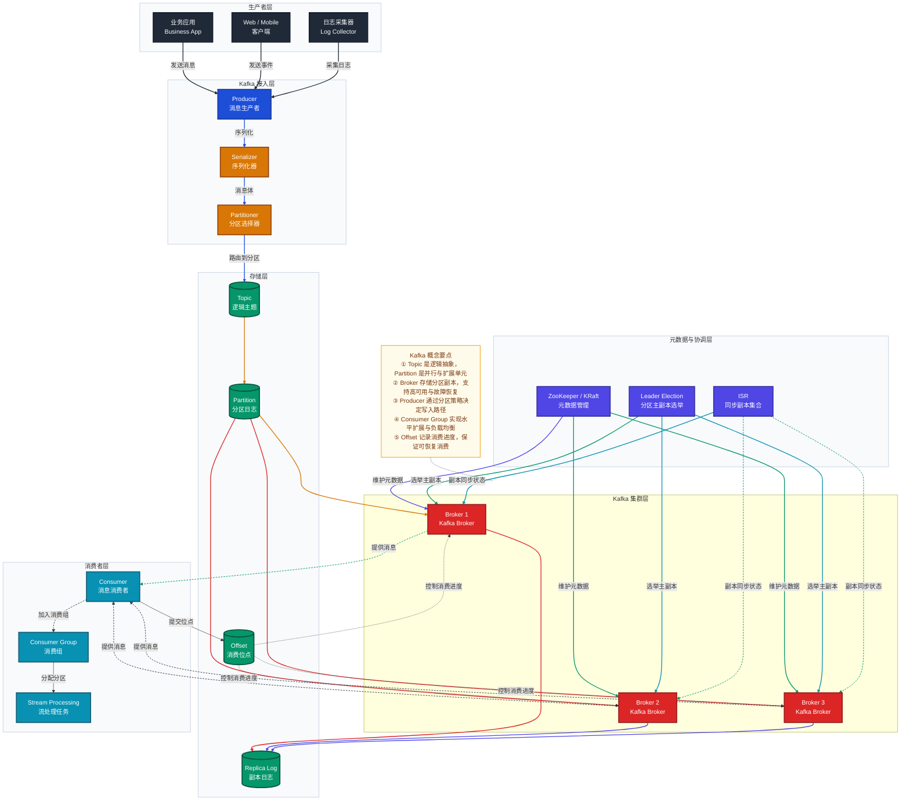
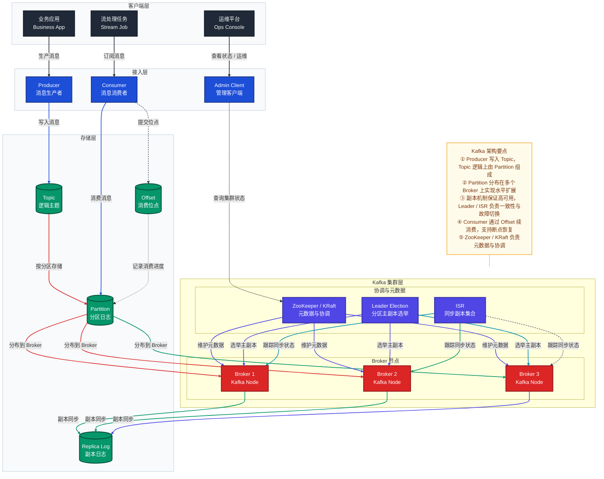

下面给你一份**符合你提供的 Mermaid 风格指南**的 Kafka 概念架构图，采用 `flowchart TB`、分层 `subgraph`、语义配色、双语节点、`NOTE` 注记和清晰的连接线标注，适合用于**初探 Kafka 架构 / 架构评审 / 认知梳理**。

如果你愿意，我还可以继续帮你补两种版本：

1. **Kafka 单机/集群部署架构图**（更偏基础设施视角）
2. **Kafka 消息流转流程图**（Producer → Broker → Consumer 的端到端流程）

如果你要，我可以直接继续给你画第二张。
下面给你两张图，分别对应你要的两种视角：

- **① Kafka 单机 / 集群部署架构图**：回答“Kafka 由哪些组件构成、如何部署、如何高可用”
- **② Kafka 消息流转流程图**：回答“一条消息从生产到消费，经历了哪些步骤”

都沿用你给的 Mermaid 风格：`subgraph` 分层、语义配色、双语节点、`NOTE` 注记、清晰箭头标签。

---

## ① Kafka 单机 / 集群部署架构图

> 适合做系统认知、部署说明、组件职责梳理

---

## ② Kafka 消息流转流程图

> 适合讲清楚“消息如何从生产到消费”

```mermaid
flowchart LR
    %% ── 配色定义：按流程阶段职责分色 ──────────────────────────────
    classDef userStyle     fill:#1e40af,stroke:#1e3a8a,stroke-width:2.5px,color:#fff
    classDef prodStyle     fill:#1d4ed8,stroke:#1e3a8a,stroke-width:2.5px,color:#fff
    classDef routeStyle    fill:#4f46e5,stroke:#3730a3,stroke-width:2px,color:#fff
    classDef brokerStyle   fill:#dc2626,stroke:#991b1b,stroke-width:2.5px,color:#fff
    classDef storeStyle    fill:#059669,stroke:#064e3b,stroke-width:2.5px,color:#fff
    classDef consStyle     fill:#0891b2,stroke:#155e75,stroke-width:2.5px,color:#fff
    classDef noteStyle     fill:#fffbeb,stroke:#f59e0b,stroke-width:1.5px,color:#78350f
    classDef layerStyle    fill:#f8fafc,stroke:#cbd5e0,stroke-width:1.5px

    %% ── 起始节点 ─────────────────────────────────────────────────
    APP["业务系统<br>Business App"]:::userStyle

    %% ── 生产阶段 ───────────────────────────────────────────────
    subgraph PRODUCE["生产阶段"]
        direction LR
        P1["构造消息<br>Build Record"]:::prodStyle
        P2["序列化<br>Serialize"]:::routeStyle
        P3["选择分区<br>Partitioning"]:::routeStyle
    end
    class PRODUCE layerStyle

    %% ── 传输与写入阶段 ──────────────────────────────────────────
    subgraph WRITE["写入阶段"]
        direction LR
        W1["发送到 Broker<br>Send to Broker"]:::brokerStyle
        W2["Leader 分区写入<br>Write to Leader Partition"]:::brokerStyle
        W3["副本同步<br>Replica Replication"]:::storeStyle
        W4["提交确认<br>Ack Response"]:::routeStyle
    end
    class WRITE layerStyle

    %% ── 存储阶段 ───────────────────────────────────────────────
    subgraph STORAGE["存储阶段"]
        direction LR
        T1[("Topic")]:::storeStyle
        T2[("Partition Log")]:::storeStyle
        T3[("Replica Log")]:::storeStyle
    end
    class STORAGE layerStyle

    %% ── 消费阶段 ───────────────────────────────────────────────
    subgraph CONSUME["消费阶段"]
        direction LR
        C1["Consumer 拉取消息<br>Pull Messages"]:::consStyle
        C2["反序列化<br>Deserialize"]:::consStyle
        C3["业务处理<br>Process"]:::consStyle
        C4["提交 Offset<br>Commit Offset"]:::consStyle
    end
    class CONSUME layerStyle

    %% ── 终止节点 ───────────────────────────────────────────────
    DONE["消费完成<br>Done"]:::userStyle

    %% ── 主流程 ─────────────────────────────────────────────────
    APP --> P1
    P1 --> P2
    P2 --> P3
    P3 --> W1
    W1 --> W2
    W2 --> T1
    T1 --> T2
    T2 --> W3
    W3 --> T3
    W2 --> W4
    W4 --> C1
    C1 --> C2
    C2 --> C3
    C3 --> C4
    C4 --> DONE

    %% ── 说明性旁路 ─────────────────────────────────────────────
    OFFSET["Offset<br>消费位点"]:::routeStyle
    C4 -.->|"记录消费进度"| OFFSET
    OFFSET -.->|"支持断点续消费"| C1

    NOTE["Kafka 消息流转要点<br>① Producer 先序列化并按分区策略路由<br>② Broker 的 Leader Partition 接收写入请求<br>③ 副本机制保证消息可靠性与容灾<br>④ Consumer 通过 Pull 模式主动拉取<br>⑤ Offset 使消费具备可恢复性"]:::noteStyle
    NOTE -.- W2

    %% 边索引：0-16，共 17 条
    linkStyle 0,1,2 stroke:#1e40af,stroke-width:2px
    linkStyle 3,4 stroke:#d97706,stroke-width:2px
    linkStyle 5,6 stroke:#dc2626,stroke-width:2px
    linkStyle 7,8 stroke:#059669,stroke-width:2px
    linkStyle 9,10,11,12 stroke:#0891b2,stroke-width:2px
    linkStyle 13 stroke:#374151,stroke-width:1.5px,stroke-dasharray:4 3
    linkStyle 14 stroke:#374151,stroke-width:1.5px,stroke-dasharray:4 3
    linkStyle 15 stroke:#f59e0b,stroke-width:1.5px,stroke-dasharray:4 3
    linkStyle 16 stroke:#f59e0b,stroke-width:1.5px,stroke-dasharray:4 3
```

---

## 怎么选用

- **如果你想先讲 Kafka 是什么、由什么组成、怎么部署**  
  用第一张：**Kafka 单机 / 集群部署架构图**

- **如果你想讲消息从生产到消费的完整链路**  
  用第二张：**Kafka 消息流转流程图**

---

如果你愿意，我还可以继续帮你补一版更贴近生产实践的：

1. **Kafka 高可用与故障切换架构图**  
2. **Kafka ISR / Leader / Follower 机制图**  
3. **Kafka Producer 幂等 + 事务图**  
4. **Kafka Consumer Group Rebalance 机制图**

你要的话我可以直接继续画。