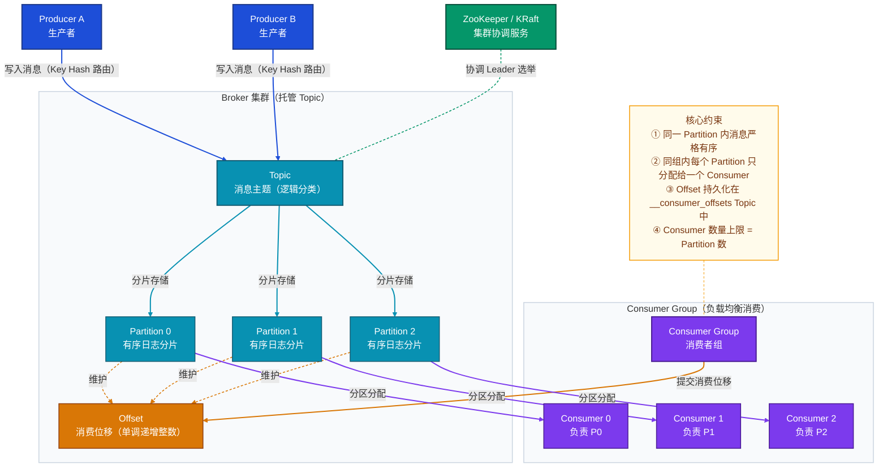
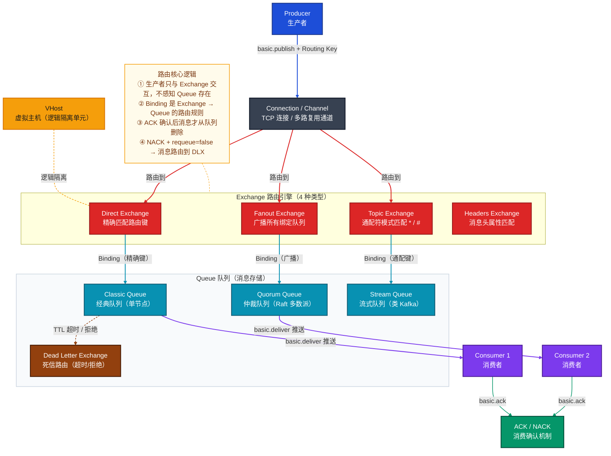
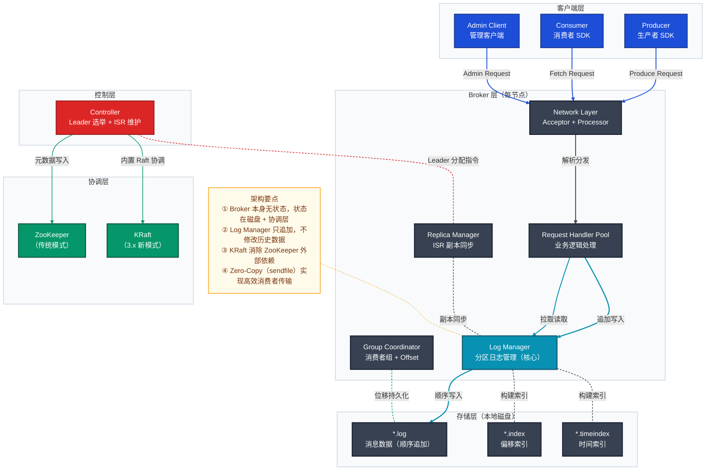
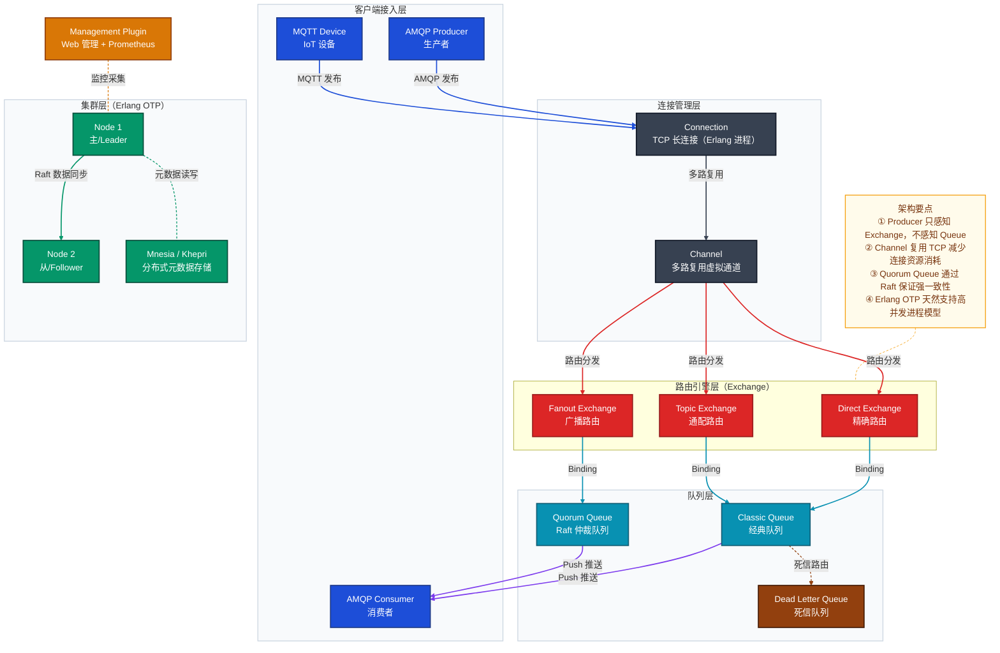
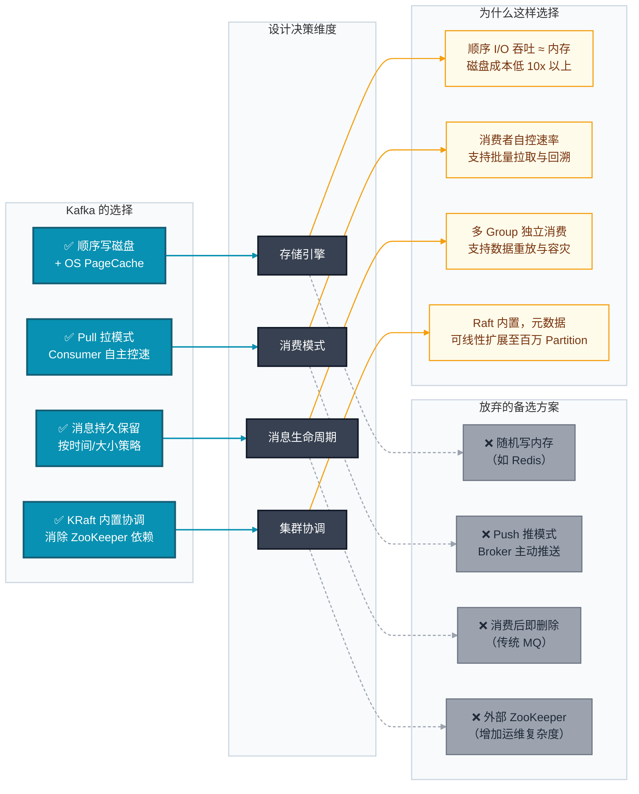
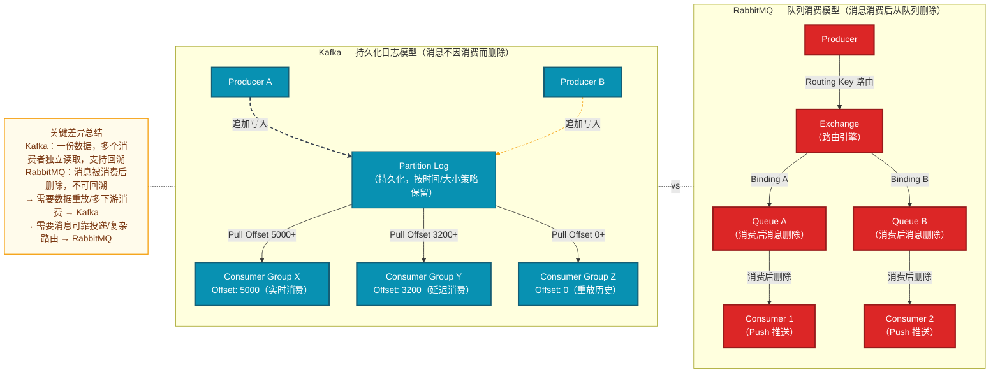

# Kafka 与 RabbitMQ 技术分析文档

> **文档版本**：v1.0 ｜ **分析日期**：2026-03-24 ｜ **技术版本**：Kafka 3.x / RabbitMQ 3.13+

---

## 一、技术定位

### 1.1 Kafka — 分布式事件流平台

**一句话定位**：Kafka 是分布式事件流平台，解决海量数据流的高吞吐持久化传输与实时处理问题，属于**事件流处理（Event Streaming）**领域，核心设计思想是「**日志即数据（Log is Data）**」——把所有事件视为不可变的追加日志，消费者通过 Offset 自主拉取并可无限回溯。

| 维度 | 描述 |
|------|------|
| 技术领域 | 分布式事件流 / 分布式提交日志 |
| 解决痛点 | 海量数据的持久化传输、多消费者解耦、流批一体处理 |
| 核心能力 | 百万级 TPS、消息可回溯、水平无限扩展、流处理框架集成 |

### 1.2 RabbitMQ — 通用消息代理

**一句话定位**：RabbitMQ 是通用消息代理（Message Broker），解决服务间异步解耦与复杂消息路由问题，属于**消息队列（AMQP 协议）**领域，核心设计思想是「**智能代理，哑消费者（Smart Broker, Dumb Consumer）**」——Broker 全权负责消息路由、状态跟踪与投递确认，消费者专注处理业务逻辑。

| 维度 | 描述 |
|------|------|
| 技术领域 | 消息代理 / AMQP 0-9-1 协议实现 |
| 解决痛点 | 复杂路由场景、消息可靠投递、服务间异步解耦 |
| 核心能力 | 灵活路由（4 种 Exchange 类型）、强可靠性保障、低延迟推送、多协议支持 |

---

## 二、核心概念

### 2.1 Kafka 核心概念体系

下图展示 Kafka 核心概念的层级关系，重点关注 **Topic → Partition → Offset** 三级嵌套结构，以及 Consumer Group 如何通过分区分配实现负载均衡消费。阅读路径：从上方生产端出发，经过 Broker 托管的分区存储，到达下方的消费端分组消费模式。



> **要点说明**：
> - **Partition 是并行单位**：Kafka 不保证全局有序，只保证 Partition 内严格有序。若需全局有序须用单 Partition，代价是丧失并行消费能力。
> - **Offset 是消费者的责任**：消费者提交 Offset 才代表消费完成，宕机后从上次提交的 Offset 续消费，这是「至少一次」语义的基础。
> - **Consumer 数量上限**：同一 Consumer Group 内有效消费者数 ≤ Partition 数，多余消费者会闲置。

**Kafka 核心术语速览**：

| 概念 | 一句话解释 |
|------|-----------|
| **Broker** | Kafka 服务器节点，每个 Partition 的 Leader 或 Follower 由 Broker 承载 |
| **Topic** | 消息的逻辑分类频道，一个 Topic 由多个 Partition 组成 |
| **Partition** | Topic 的物理分片，每个 Partition 是一个独立的有序日志文件 |
| **Offset** | 消息在 Partition 内的位置标识（单调递增整数），是消费进度的唯一标尺 |
| **Producer** | 消息生产者，决定将消息写入哪个 Partition（按 Key Hash 或轮询） |
| **Consumer Group** | 消费者组，同组内的消费者共同分担所有 Partition，互不重复消费 |
| **ISR** | In-Sync Replicas，与 Leader 保持同步的副本集合，写入需 ISR 全部确认（acks=all 时） |
| **Log Segment** | Partition 的物理存储单元，每个 Segment 由 `.log` / `.index` / `.timeindex` 三文件组成 |
| **Controller** | 从 Broker 中选举出的集群管理节点，负责 Leader 选举和 ISR 维护 |
| **KRaft** | Kafka 3.x 内置 Raft 协议，替代 ZooKeeper 做集群元数据协调 |

### 2.2 RabbitMQ 核心概念体系

下图展示 RabbitMQ 核心概念的层级关系，重点关注 **Exchange（路由引擎）→ Binding → Queue** 的路由链路，以及 ACK 机制如何保证消息不丢失。阅读路径：从左侧生产者发出消息，经 Channel 进入 Exchange，按 Binding 规则路由到 Queue，最终由消费者接收并确认。



> **要点说明**：
> - **Exchange 是核心设计哲学的体现**：Producer 不直接向 Queue 发消息，而是向 Exchange 发，由 Broker 决定路由到哪些 Queue，实现了生产者与消费者的彻底解耦。
> - **Channel 的存在是为了复用**：每个 TCP 连接（Connection）内可建立多个 Channel，每个线程使用独立 Channel，大幅降低连接开销。
> - **DLX 是可靠性的最后一道防线**：超时未处理、被拒绝或队列满溢的消息都可路由到 DLX，防止「毒消息」无限循环。

**RabbitMQ 核心术语速览**：

| 概念 | 一句话解释 |
|------|-----------|
| **VHost** | 虚拟主机，类似数据库中的 Schema，提供 Exchange/Queue/User 的逻辑隔离 |
| **Connection** | 客户端与 Broker 建立的 TCP 长连接，生命周期与客户端进程绑定 |
| **Channel** | Connection 内的多路复用虚拟通道，每个线程使用独立 Channel |
| **Exchange** | 消息路由引擎，根据 Routing Key 和 Binding 规则将消息投递到队列 |
| **Binding** | Exchange 与 Queue 之间的路由规则，由路由键（或通配符）定义匹配条件 |
| **Routing Key** | 消息携带的路由标识字符串，Exchange 据此匹配 Binding |
| **Quorum Queue** | 基于 Raft 的高可用队列，写入需多数节点确认，替代 Mirror Queue |
| **ACK / NACK** | 消费者确认（成功处理）/ 拒绝（处理失败），未 ACK 的消息会重新入队 |
| **Publisher Confirm** | 生产者确认模式，Broker 持久化后才回 ACK，防止生产侧消息丢失 |
| **DLX** | Dead Letter Exchange，死信交换机，处理超时/拒绝/溢出的消息 |

---

## 三、整体架构

### 3.1 Kafka 整体架构（ASCII 树形结构）

```
Kafka 分布式事件流平台
├── 客户端层（Client Layer）
│   ├── Producer API                  消息发布接口，支持同步/异步/批量发送
│   ├── Consumer API                  消息拉取接口，管理 Offset 与 Rebalance
│   ├── Admin Client API              集群管理：Topic 创建/扩容/配置变更
│   ├── Kafka Streams API             轻量级流处理框架，内嵌于应用
│   └── Kafka Connect API             数据集成框架，数百种 Source/Sink Connector
│
├── Broker 层（核心服务层，多节点水平扩展）
│   ├── Network Layer
│   │   ├── Acceptor Thread           接受客户端 TCP 连接（每节点1个）
│   │   └── Processor Thread Pool     处理网络 I/O，解析请求（可配置数量）
│   ├── Request Handler Pool          业务逻辑处理线程池，执行读写操作
│   ├── Log Manager（核心组件）
│   │   ├── Log（每个 Partition 一个）  分区日志对象，管理 Segment 文件
│   │   │   ├── LogSegment            分段存储单元（.log + .index + .timeindex）
│   │   │   ├── Leader Partition      接受 Producer 写入，向 Follower 同步
│   │   │   └── Follower Partition    主动 Fetch 复制 Leader 日志
│   │   └── Log Cleaner               后台清理线程：按时间/大小保留或压缩去重
│   ├── Replica Manager               管理 ISR 集合，协调 Leader/Follower 复制
│   ├── Group Coordinator             消费者组注册、Rebalance 触发、Offset 管理
│   └── Transaction Coordinator       幂等写入（PID + Sequence）与事务消息管理
│
├── 控制层（Controller，从 Broker 中选举产生）
│   ├── Partition Leader 选举          Broker 故障时触发重新选主
│   ├── ISR 集合动态维护               踢出落后副本，恢复后重新加入 ISR
│   └── 集群拓扑元数据广播             向所有 Broker 同步 Topic/Partition 变更
│
├── 协调层
│   ├── ZooKeeper（Kafka 2.x 传统模式）  外部存储 Broker/Topic/ISR 元数据
│   └── KRaft（Kafka 3.x 新模式）       内置 Raft 协议，Controller 直接参与共识
│
└── 存储层（每个 Broker 本地磁盘）
    ├── Partition 目录                  /data/kafka/<topic>-<partition>/
    │   ├── 000000000000.log            消息数据文件（顺序追加，不可修改）
    │   ├── 000000000000.index          稀疏偏移索引（O(logN) 查找指定 Offset）
    │   └── 000000000000.timeindex      时间戳索引（支持按时间点查找消息）
    └── __consumer_offsets              内置 Topic，持久化所有消费者位移
```

下图为 Kafka 整体架构的静态结构视图，展示客户端层、Broker 核心服务层、控制层和存储层的组件关系。重点关注 Log Manager 与存储层的顺序写路径，以及 Controller 与协调层的元数据同步关系。



### 3.2 RabbitMQ 整体架构（ASCII 树形结构）

```
RabbitMQ 通用消息代理
├── 接入层（多协议支持）
│   ├── AMQP 0-9-1（端口 5672）        主协议，生产/消费/管理标准接口
│   ├── AMQPS（端口 5671）             TLS 加密的 AMQP
│   ├── MQTT 插件（端口 1883）          IoT 设备轻量接入（QoS 0/1）
│   ├── STOMP 插件（端口 61613）        简单文本协议，Web 客户端友好
│   └── HTTP Management API（端口 15672）  REST 风格管理接口
│
├── 连接管理层
│   ├── Connection                     每个客户端的 TCP 长连接（Erlang 进程维护）
│   └── Channel                        Connection 内的多路复用虚拟通道
│                                      （单 Connection 可开数百 Channel）
│
├── 路由引擎层（Exchange）
│   ├── Direct Exchange                 Routing Key 精确字符串匹配
│   ├── Fanout Exchange                 忽略 Routing Key，广播所有绑定队列
│   ├── Topic Exchange                  通配符模式：* 匹配一个词，# 匹配零或多个词
│   ├── Headers Exchange                基于消息头键值对匹配（x-match: all/any）
│   └── Default Exchange（内置）        Queue 名即 Routing Key 的特殊直连交换机
│
├── 队列层（Queue）
│   ├── Classic Queue（经典队列）       传统持久化队列，单节点主存储
│   │   └── 可配置 durable / exclusive / auto-delete 属性
│   ├── Quorum Queue（仲裁队列，推荐）  基于 Raft 协议，多节点强一致高可用
│   │   └── 写入需多数节点（N/2+1）确认
│   ├── Stream Queue（流式队列 3.9+）   类 Kafka 持久化日志，支持 Offset 消费
│   └── Dead Letter Exchange（DLX）    死信处理：超时/拒绝/溢出消息转发
│
├── 可靠性保障层
│   ├── Publisher Confirm               发布者确认：Broker 落盘后回 ack
│   ├── Consumer ACK / NACK / Reject    消费确认：未 ACK 的消息重新投递
│   ├── TTL（Time To Live）             消息级（per-message）/ 队列级过期时间
│   ├── 消息持久化（durable + persistent）  Exchange/Queue/消息均可持久化
│   └── Prefetch Count / QoS            背压控制：限制单次预推消息数量
│
├── 集群层
│   ├── Erlang Distribution             基于 Erlang 节点互联，高效进程间通信
│   ├── Mnesia（传统元数据存储）         分布式内存数据库，存 Exchange/Queue/Binding
│   ├── Khepri（未来替代方向）           基于 Raft 的元数据存储，解决 Mnesia 一致性问题
│   └── Quorum Queue（队列高可用）        Raft 多数派写入，替代 Mirror Queue
│
└── 管理层
    ├── Management Plugin（Web UI）      可视化管理界面：队列深度/消费速率/连接监控
    ├── Prometheus Plugin               Metrics 暴露，集成 Grafana 监控
    ├── Shovel Plugin                   跨集群/跨数据中心消息迁移
    └── Federation Plugin               跨地域消息联邦（松散耦合多集群）
```

下图为 RabbitMQ 整体架构静态结构视图，展示多协议接入、Exchange 路由引擎、Queue 存储层和集群高可用的组件关系。重点关注 Exchange → Binding → Queue 的路由链路设计，以及 Quorum Queue 通过 Raft 实现高可用的集群层结构。



---

## 四、核心工作机制

### 4.1 场景一：Kafka 消息的生产与消费

**本质**：Producer 将消息追加到分布式日志末尾，Consumer 按 Offset 主动读取日志，两者完全解耦，互不感知对方的存在，Broker 只负责存储和复制。

下图展示 Kafka 一次完整的消息从生产到消费的流转路径，重点关注 **Producer 端的分区路由、Broker 端的顺序写磁盘与 ISR 副本同步、Consumer Group 的拉取与位移提交** 四个核心节点。阅读路径从左侧 Producer 出发，经过分区路由进入 Leader Broker，同步到 ISR 副本，最终被 Consumer Group 异步拉取。

```mermaid
flowchart LR
    classDef prodStyle    fill:#1d4ed8,stroke:#1e3a8a,stroke-width:2.5px,color:#fff
    classDef routeStyle   fill:#374151,stroke:#111827,stroke-width:2px,color:#fff
    classDef logStyle     fill:#0891b2,stroke:#155e75,stroke-width:2.5px,color:#fff
    classDef replicaStyle fill:#dc2626,stroke:#991b1b,stroke-width:2px,color:#fff
    classDef ackStyle     fill:#059669,stroke:#064e3b,stroke-width:2px,color:#fff
    classDef consStyle    fill:#7c3aed,stroke:#4c1d95,stroke-width:2.5px,color:#fff
    classDef noteStyle    fill:#fffbeb,stroke:#f59e0b,stroke-width:1.5px,color:#78350f
    classDef layerStyle   fill:#f8fafc,stroke:#cbd5e0,stroke-width:1.5px

    PROD["Producer<br>生产者"]:::prodStyle

    subgraph STEP1["① 分区路由（Producer 端）"]
        direction TB
        PSEL["分区选择器<br>· 指定 Key → Hash(Key) % N<br>· 无 Key → 轮询 / 粘性分区"]:::routeStyle
    end
    class STEP1 layerStyle

    subgraph STEP2["② Leader Broker 写入（顺序追加）"]
        direction TB
        RH["Request Handler<br>处理 Produce 请求"]:::routeStyle
        LM["Log Manager<br>顺序追加写磁盘"]:::logStyle
        DISK["*.log 文件<br>Offset N 写入成功"]:::logStyle
    end
    class STEP2 layerStyle

    subgraph STEP3["③ ISR 副本同步"]
        direction TB
        F1["Follower Broker 1<br>主动 Fetch 复制"]:::replicaStyle
        F2["Follower Broker 2<br>主动 Fetch 复制"]:::replicaStyle
    end
    class STEP3 layerStyle

    ACK_P["Producer ACK<br>acks=all: 等 ISR 全部确认<br>acks=1: Leader 确认即返回"]:::ackStyle

    subgraph STEP4["④ Consumer Group 拉取消费"]
        direction TB
        GC["Group Coordinator<br>分区分配 + Rebalance 管理"]:::consStyle
        CONSUMER["Consumer<br>Fetch Request（Pull 模式）"]:::consStyle
        OFF_COMMIT["Offset 提交<br>写入 __consumer_offsets"]:::ackStyle
    end
    class STEP4 layerStyle

    NOTE["关键路径要点<br>① PageCache 缓冲写入：写磁盘先写内存页，OS 异步 flush<br>② acks=all 时等全部 ISR 副本写入后才回 ACK<br>③ Consumer 以 Offset 为锚点按需拉取，速率完全自控<br>④ Zero-Copy（sendfile）：消费时数据不经用户态，直接内核传输"]:::noteStyle

    %% edge 0
    PROD -->|"发送消息<br>Key + Value"| PSEL
    %% edge 1
    PSEL -->|"路由到 Partition N"| RH
    %% edge 2
    RH -->|"写入日志"| LM
    %% edge 3
    LM -->|"顺序 append"| DISK
    %% edge 4
    DISK -->|"主动拉取（Fetch）"| F1
    %% edge 5
    DISK -->|"主动拉取（Fetch）"| F2
    %% edge 6
    F1 -->|"ISR 写入确认"| ACK_P
    %% edge 7
    F2 -->|"ISR 写入确认"| ACK_P
    %% edge 8
    GC -->|"分区分配结果"| CONSUMER
    %% edge 9
    CONSUMER -->|"Fetch Request"| DISK
    %% edge 10
    CONSUMER -->|"提交 Offset"| OFF_COMMIT
    %% edge 11
    NOTE -.- LM

    %% 边索引：0-11，共 12 条
    linkStyle 0 stroke:#1d4ed8,stroke-width:2px
    linkStyle 1 stroke:#1d4ed8,stroke-width:2px
    linkStyle 2 stroke:#374151,stroke-width:2px
    linkStyle 3 stroke:#0891b2,stroke-width:2.5px
    linkStyle 4 stroke:#dc2626,stroke-width:1.5px,stroke-dasharray:4 3
    linkStyle 5 stroke:#dc2626,stroke-width:1.5px,stroke-dasharray:4 3
    linkStyle 6 stroke:#059669,stroke-width:1.5px
    linkStyle 7 stroke:#059669,stroke-width:1.5px
    linkStyle 8 stroke:#7c3aed,stroke-width:2px
    linkStyle 9 stroke:#7c3aed,stroke-width:2px
    linkStyle 10 stroke:#059669,stroke-width:2px
    linkStyle 11 stroke:#f59e0b,stroke-width:1px,stroke-dasharray:4 3
```



> **要点说明**：
> - **Follower 主动 Fetch 而非 Leader 主动推**：这是 Kafka 复制设计的精髓——Leader 不需要追踪每个 Follower 的状态，Follower 自己决定何时来拉取。这简化了 Leader 的实现，且 Follower 故障不会阻塞 Leader 的写入。
> - **ISR 动态收缩**：若某 Follower 落后 Leader 超过 `replica.lag.time.max.ms`（默认 30s），会被自动踢出 ISR。这避免了慢副本拖累 `acks=all` 的写入延迟。

**逐步解析**：

**步骤一：分区路由（Producer 端）**

Producer 在发送消息时，首先决定消息写入哪个 Partition。若消息指定了 Key，则计算 `murmur2Hash(Key) % Partition数`，保证相同 Key 的消息始终进入同一 Partition，从而保证局部有序（如同一用户 ID 的操作序列必须有序）。无 Key 时默认轮询，实现各 Partition 负载均衡。Kafka 2.4+ 引入「粘性分区（Sticky Partitioner）」，在批次未满前将消息积累到同一 Partition，提升批量发送效率。

**步骤二：Leader Broker 顺序写磁盘**

Leader Broker 的 `Request Handler` 接收到 Produce 请求后，调用 `Log Manager` 将消息追加到对应 Partition 的 `.log` 文件末尾。这里的写入先写 OS PageCache（内存），再由操作系统择机 flush 到磁盘。同时在 `.index` 文件中写入稀疏索引（每隔 `index.interval.bytes` 写一条索引），便于按 Offset 快速定位消息。**顺序写的吞吐量远超随机写**，这是 Kafka 高性能的核心基础。

**步骤三：ISR 副本同步**

Follower 持续向 Leader 发送 Fetch 请求，将新增消息拉取并写入本地日志，然后向 Leader 上报同步进度。当 `acks=all`（或 `-1`）时，Producer 的写入 ACK 需等待 ISR 中所有 Follower 都确认写入后才返回，保证即使 Leader 立即宕机，消息也不会丢失。当 `acks=1` 时，只需 Leader 写入即可返回，吞吐更高但存在消息丢失风险（Leader 宕机且 Follower 尚未同步时）。

**步骤四：Consumer Group 拉取**

Consumer 启动后向 `Group Coordinator`（一个指定的 Broker）注册，由 Coordinator 触发分区分配（Rebalance），将所有 Partition 分配给组内活跃的 Consumer。每个 Consumer 周期性（默认 500ms）发送 Fetch Request，从 Leader Partition 拉取指定 `Offset` 之后的消息批次。处理完成后将新的 Offset 提交到 `__consumer_offsets` Topic，作为下次恢复的起点。

---

### 4.2 场景二：RabbitMQ 消息的路由与可靠投递

**本质**：Producer 把消息「投递」给 Exchange，由 Broker 的路由引擎决定消息去哪个 Queue，并通过 Publisher Confirm + Consumer ACK 的双向确认机制，保证每条消息都被至少处理一次。

下图展示 RabbitMQ 一条消息从发布到被消费者确认的完整流转路径，重点关注 **Publisher Confirm 防止生产侧丢失、Exchange 路由决策、Consumer ACK/NACK 与死信路由** 四个可靠性节点。

```mermaid
flowchart LR
    classDef prodStyle  fill:#1d4ed8,stroke:#1e3a8a,stroke-width:2.5px,color:#fff
    classDef chanStyle  fill:#374151,stroke:#111827,stroke-width:2px,color:#fff
    classDef exStyle    fill:#dc2626,stroke:#991b1b,stroke-width:2.5px,color:#fff
    classDef qStyle     fill:#0891b2,stroke:#155e75,stroke-width:2.5px,color:#fff
    classDef dlxStyle   fill:#92400e,stroke:#451a03,stroke-width:2px,color:#fff
    classDef consStyle  fill:#7c3aed,stroke:#4c1d95,stroke-width:2.5px,color:#fff
    classDef ackStyle   fill:#059669,stroke:#064e3b,stroke-width:2px,color:#fff
    classDef noteStyle  fill:#fffbeb,stroke:#f59e0b,stroke-width:1.5px,color:#78350f
    classDef layerStyle fill:#f8fafc,stroke:#cbd5e0,stroke-width:1.5px

    PROD["Producer<br>生产者"]:::prodStyle

    subgraph STEP1["① Publisher Confirm（防生产侧丢失）"]
        direction TB
        CHAN["Channel<br>basic.publish 发布"]:::chanStyle
        CONFIRM["Publisher Confirm<br>Broker 持久化后回 ack"]:::ackStyle
    end
    class STEP1 layerStyle

    subgraph STEP2["② Exchange 路由决策"]
        direction TB
        EX["Topic Exchange<br>路由键：order.#"]:::exStyle
        BIND["Binding 规则匹配<br>order.created → Queue A<br>order.* → Queue B"]:::chanStyle
    end
    class STEP2 layerStyle

    subgraph STEP3["③ Queue 持久化 + 推送"]
        direction TB
        QA["Queue A<br>持久化消息存储"]:::qStyle
        QB["Queue B<br>持久化消息存储"]:::qStyle
        DLX["Dead Letter Queue<br>死信消息"]:::dlxStyle
    end
    class STEP3 layerStyle

    subgraph STEP4["④ Consumer 处理 + ACK"]
        direction TB
        C1["Consumer 1<br>处理 order.created"]:::consStyle
        C2["Consumer 2<br>处理所有 order 事件"]:::consStyle
        ACK_OK["basic.ack<br>消息从 Queue 删除"]:::ackStyle
        ACK_FAIL["basic.nack<br>requeue=false → DLX"]:::dlxStyle
    end
    class STEP4 layerStyle

    NOTE["可靠性设计要点<br>① Publisher Confirm 解决生产侧消息丢失<br>② prefetch_count 限制预推数，防消费者压垮<br>③ NACK + requeue=false 送死信，防毒消息循环<br>④ Quorum Queue 保证 Queue 层数据不丢"]:::noteStyle

    %% edge 0
    PROD -->|"basic.publish<br>routing_key=order.created"| CHAN
    %% edge 1
    CHAN -->|"发布消息"| EX
    %% edge 2
    CHAN -.->|"channel confirm 模式"| CONFIRM
    %% edge 3
    EX -->|"路由键匹配"| BIND
    %% edge 4
    BIND -->|"精确匹配投递"| QA
    %% edge 5
    BIND -->|"通配匹配投递"| QB
    %% edge 6
    QA -->|"basic.deliver 推送"| C1
    %% edge 7
    QB -->|"basic.deliver 推送"| C2
    %% edge 8
    C1 -->|"处理成功"| ACK_OK
    %% edge 9
    C2 -->|"处理成功"| ACK_OK
    %% edge 10
    C1 -->|"处理失败"| ACK_FAIL
    %% edge 11
    ACK_FAIL -->|"死信路由"| DLX
    %% edge 12
    QA -->|"TTL 超时"| DLX
    %% edge 13
    NOTE -.- EX

    %% 边索引：0-13，共 14 条
    linkStyle 0 stroke:#1d4ed8,stroke-width:2px
    linkStyle 1 stroke:#dc2626,stroke-width:2px
    linkStyle 2 stroke:#059669,stroke-width:1.5px,stroke-dasharray:4 3
    linkStyle 3 stroke:#dc2626,stroke-width:2px
    linkStyle 4 stroke:#0891b2,stroke-width:2px
    linkStyle 5 stroke:#0891b2,stroke-width:2px
    linkStyle 6 stroke:#7c3aed,stroke-width:2px
    linkStyle 7 stroke:#7c3aed,stroke-width:2px
    linkStyle 8 stroke:#059669,stroke-width:2px
    linkStyle 9 stroke:#059669,stroke-width:2px
    linkStyle 10 stroke:#92400e,stroke-width:1.5px
    linkStyle 11 stroke:#92400e,stroke-width:1.5px,stroke-dasharray:4 3
    linkStyle 12 stroke:#92400e,stroke-width:1.5px,stroke-dasharray:4 3
    linkStyle 13 stroke:#f59e0b,stroke-width:1px,stroke-dasharray:4 3
```



**逐步解析**：

**步骤一：发布与 Publisher Confirm**

Producer 通过 `Channel.basicPublish()` 发送消息，默认情况下这是「即发即忘」——无法确认 Broker 是否收到。开启 Publisher Confirm 模式后，Broker 在消息落盘（或入队 Quorum Queue 达到多数确认）后才回 `basic.ack`；若路由失败无法投递到任何 Queue，回 `basic.nack`。这解决了网络闪断或 Broker 崩溃导致的生产侧消息丢失。

**步骤二：Exchange 路由决策**

Exchange 收到消息后，遍历所有 Binding 规则，用消息的 Routing Key 与 Binding Key 进行模式匹配。Topic Exchange 中，`.` 为词分隔符，`*` 匹配一个词，`#` 匹配零或多个词。同一条消息可同时匹配多条 Binding，被投递到多个 Queue（扇出），实现一对多广播。若无任何 Binding 匹配，消息默认丢弃（如配置 `mandatory=true` 则回 `basic.return`）。

**步骤三：Queue 持久化与推送**

消息落入 Queue 后，若 Queue 配置了 `durable=true` 且消息 `delivery_mode=2`（持久化），消息会写入磁盘，Broker 重启后不丢失。Broker 根据 Consumer 订阅关系，以 `basic.deliver` 主动推送消息。`prefetch_count`（`basic.qos`）控制每个 Consumer 最多预推多少未 ACK 的消息，是 RabbitMQ 的背压机制核心。

**步骤四：消费确认（ACK/NACK）**

Consumer 处理成功后调用 `basic.ack(deliveryTag)`，Broker 将该消息从 Queue 中删除。若处理失败调用 `basic.nack(deliveryTag, requeue=true)` 将消息重新入队，或 `requeue=false` 触发死信路由。Dead Letter Exchange 接收到死信后，根据其自身 Binding 将消息路由到「死信队列」，供后续人工处理或延迟重试。

---

## 五、关键设计决策

### 5.1 Kafka 关键设计决策

下图展示 Kafka 四个核心设计决策与其备选方案的结构对比，左列为 Kafka 的选择，右列为放弃的备选方案，阅读路径：从中间的「决策维度」出发，理解每个权衡的本质取舍。



**决策一：顺序写磁盘 + OS PageCache，而非内存随机写**

磁盘**顺序 I/O** 的吞吐量（500+ MB/s）远超内存**随机 I/O**（约 100 MB/s），甚至接近内存顺序 I/O（1+ GB/s）。Kafka 利用 OS PageCache 作为写入缓冲层：消息先写内存页，OS 在后台批量 flush 到磁盘；消费时若 PageCache 命中（消息刚写入不久），无需磁盘读取。同时 Kafka 使用 `sendfile()` 系统调用（Zero-Copy），消费时数据直接从内核 PageCache 传输到 Socket 缓冲区，不经用户态拷贝，大幅降低 CPU 和内存带宽消耗。

**决策二：Pull 拉模式，而非 Push 推模式**

Push 模式下，若 Broker 推送速率超过 Consumer 处理能力，Consumer 会被压垮，需要复杂的背压协议。Pull 模式将控制权完全交给 Consumer：可根据自身处理能力调整拉取频率，可批量拉取（单次拉取 1000 条比 1000 次各拉 1 条效率高 100 倍），还可以随时回溯历史 Offset 重新消费。代价是 Consumer 需要处理空闲时的轮询（通过 `fetch.max.wait.ms` 的 long polling 机制缓解，在有新消息前阻塞等待）。

**决策三：消息持久化保留（按策略），而非消费后立即删除**

传统 MQ（如早期 RabbitMQ）消息被消费后即删除，Kafka 按照时间（`retention.ms`）或大小（`retention.bytes`）保留消息，默认保留 7 天。这带来三个核心优势：① **多 Consumer Group 独立消费**：N 个不同业务系统消费同一 Topic，互不干扰；② **可回溯重放**：消费者通过重置 Offset 重新处理历史消息，支持 Bug 修复后的数据补偿；③ **流批一体**：同一份数据同时被 Flink（实时流处理）和 Spark（批处理）消费，无需存储两份数据。

**决策四：Partition 分区并行，放弃全局有序**

Kafka 以 Partition 为单位保证有序，放弃 Topic 全局有序，以此换取水平扩展能力。Partition 数量决定最大并行消费度——100 个 Partition 意味着最多 100 个 Consumer 并行消费。通过 Key Hash 路由，可以保证「局部有序」（如同一用户的所有订单事件在同一 Partition 内有序）。若业务必须全局有序，可使用单 Partition Topic，但并行度限制为 1。

**决策五：KRaft 内置 Raft，替代外部 ZooKeeper**

传统 Kafka 依赖外部 ZooKeeper 集群做元数据协调，存在三个核心问题：① 额外运维负担（需独立部署维护 ZooKeeper 集群）；② ZooKeeper 节点数量有上限（ZooKeeper 的 ZNode 数量影响 Kafka 的 Partition 数量上限，约百万级）；③ 元数据变更需跨两个系统传播，增加一致性复杂度。KRaft 将 Raft 协议内嵌进 Broker，部分节点充当 Controller（Raft 节点），元数据变更通过 Raft Log 同步，理论上支持数百万 Partition，且部署运维大幅简化。

### 5.2 RabbitMQ 关键设计决策

**决策一：Exchange + Binding 路由架构，而非 Producer 直接写 Queue**

若 Producer 直接往 Queue 发消息，则 Producer 需要知道目标 Queue 名，形成紧耦合：下游新增消费者需修改 Producer 代码。Exchange + Binding 设计将路由逻辑从 Producer 侧移到 Broker 侧：Producer 只声明 Exchange 名称和 Routing Key，Consumer 侧负责声明 Queue 并建立 Binding。这样可以在不修改 Producer 代码的情况下，动态增减消费者、改变路由规则，是真正意义上的生产消费解耦。

**决策二：Push 推模式，而非 Pull 轮询**

RabbitMQ 采用 Push 模式（Broker 主动推送到 Consumer），在消息到达 Queue 的瞬间即触发投递，延迟通常 < 1ms，适合任务队列、实时通知等场景。相比 Pull 轮询（需要 Consumer 定时查询 Queue 是否有消息），Push 减少了无效网络开销。背压通过 `prefetch_count`（`basic.qos`）实现：Consumer 最多持有 N 条未 ACK 的消息，达到上限后 Broker 暂停推送。

**决策三：Quorum Queue 采用 Raft，替代 Mirror Queue**

早期 RabbitMQ 的 Mirror Queue（镜像队列）通过主节点将所有写操作广播到镜像节点，存在两个致命问题：① 网络分区时可能出现「脑裂」，多个节点认为自己是主节点，数据不一致；② 主节点故障转移时，镜像数据可能不完整（广播时镜像节点尚未确认）。Quorum Queue 引入 Raft 共识协议，写入操作需要多数节点（`(N/2)+1`）确认后才返回成功，数据一致性有数学保证。代价是写入延迟略高于 Classic Queue（需多次网络 RTT），但对于需要强一致性的业务，这是正确的权衡。

**决策四：Channel 多路复用 TCP 连接**

每条消息建立独立 TCP 连接代价极高（内核资源、握手延迟、TCP 慢启动）。RabbitMQ 基于 Erlang 的 actor 模型设计了 Channel：一个 TCP 连接内可复用数百个 Channel，每个 Channel 作为独立的消息流，不同 Channel 之间互不干扰。推荐实践是每个进程建立 1 个 Connection，每个线程使用独立 Channel，既节省资源又避免并发问题。

---

## 六、典型应用场景

### 6.1 Kafka 适用场景

**场景一：大规模日志与事件聚合**

- **匹配点**：百个微服务将访问日志、业务审计事件写入 Kafka，Elasticsearch（搜索分析）、HDFS（存储归档）、监控系统三个下游系统独立消费同一 Topic，互不干扰。Kafka 的高吞吐（百万 TPS）和消息持久化完美匹配日志场景「写多、多下游消费、需要归档」的特征。
- **使用边界**：不适合单条消息需要毫秒级确认投递的场景（Kafka 端到端延迟通常 5~20ms）；不适合每天消息量仅数万条的低频场景（运维成本高于收益）。

**场景二：实时流处理数据管道**

- **匹配点**：风控系统需要对用户行为事件做实时特征提取，Kafka 提供有序、可回溯的数据流，Flink/Kafka Streams 消费并计算，结果写回 Kafka 或直接写 Redis。Kafka 的精确一次语义（EOS，Exactly-Once Semantics）保证流处理结果的准确性。
- **使用边界**：若只需批处理（T+1），直接用 Hive/Spark 更简单；若流处理逻辑极其简单（如纯过滤），考虑是否有必要引入 Kafka Streams 框架。

**场景三：微服务事件溯源（Event Sourcing）与 CQRS**

- **匹配点**：订单服务将每次状态变更（创建、支付、发货、完成）作为不可变事件写入 Kafka，其他服务订阅事件重建自己的物化视图。Kafka 的「日志即数据」与 Event Sourcing 的「以事件序列重建状态」天然契合，支持任意时间点的状态重建。
- **使用边界**：不适合需要精确路由到不同类型消费者的场景（Consumer Group 过滤能力弱于 RabbitMQ Exchange）；不适合需要 RPC 语义（等待回复）的请求-响应模式。

**场景四：数据集成与 CDC（Change Data Capture）**

- **匹配点**：Debezium（基于 Kafka Connect）捕获 MySQL/PostgreSQL binlog，将数据库变更实时同步到 Kafka，下游的数据仓库、搜索引擎、缓存即时更新。Kafka Connect 的 Source/Sink Connector 生态（数百种）大幅降低集成开发成本。
- **使用边界**：小数据量低频率的数据同步（如日报表），用 Airflow + SQL 更简单；Kafka 的运维复杂度（ZooKeeper/KRaft + Kafka 集群）不适合小团队小项目。

**场景五：多消费者广播（配置中心/领域事件扇出）**

- **匹配点**：配置变更事件写入 Kafka，每个微服务实例建立独立 Consumer Group，各自消费完整的配置事件序列，互不干扰，且新增服务无需修改发布端。
- **使用边界**：若需要将不同类型事件精确路由到不同消费者组（如按事件类型分发），Kafka 需要为每种路由创建独立 Topic，不如 RabbitMQ 的 Binding 灵活。

### 6.2 RabbitMQ 适用场景

**场景一：异步任务队列（Work Queue）**

- **匹配点**：用户触发的耗时任务（发邮件、生成报表、图片压缩），主线程将任务参数投入 Queue，多个 Worker 消费并处理。ACK 机制保证任务不丢失，Worker 宕机时任务自动重新入队；多 Worker 消费同一队列自动负载均衡。
- **使用边界**：日任务量超过千万条且需要任务历史回放时，考虑 Kafka；任务完全幂等且对可靠性要求低时，用 Redis List + RPOPLPUSH 更轻量。

**场景二：复杂事件路由与发布订阅**

- **匹配点**：电商订单状态变更需要同时通知：通知服务（order.created）、库存服务（order.paid）、物流服务（order.shipped），Topic Exchange 通配路由可精确控制每个服务接收哪类事件，一次发布按需分发。
- **使用边界**：若路由规则极其简单（所有消费者关注全量消息），Kafka 多 Consumer Group 方案吞吐更高；消息量超过 10 万/s 时 RabbitMQ 会成为瓶颈。

**场景三：同步 RPC（Request-Reply 模式）**

- **匹配点**：微服务 A 调用微服务 B 的某个计算服务，通过 RabbitMQ 实现：A 发请求消息到 B 的请求队列（附带 `reply_to` 和 `correlation_id`），B 处理后将结果发到 `reply_to` 指定的临时队列，A 阻塞等待。低延迟（< 5ms）且可跨网络隔离区。
- **使用边界**：高并发 RPC（> 1000 QPS）建议使用 gRPC 等专用 RPC 框架；大量临时回调队列会增加 RabbitMQ 的管理开销。

**场景四：IoT 设备消息接入（MQTT 插件）**

- **匹配点**：IoT 设备通过轻量级 MQTT 协议接入 RabbitMQ，消息自动转换为 AMQP 格式进入路由体系，复用已有的消费端基础设施（Java/Python AMQP Consumer）。无需为 IoT 设备单独部署消息系统。
- **使用边界**：设备量超过 100 万级时，专用 MQTT Broker（EMQ X/HiveMQ）的性能和设备管理能力更强；RabbitMQ MQTT 插件不支持 MQTT 5.0 高级特性。

---

## 七、横向对比

### 7.1 Kafka vs RabbitMQ：存储模型的根本差异

这不是全面功能对比表，而是聚焦于两个系统**最本质的结构差异**——存储模型的不同决定了两者在消费语义、扩展方式和适用场景上的一切差异。

下图对比 Kafka 的**持久化日志模型**与 RabbitMQ 的**队列消费模型**，重点关注：Kafka 允许多个 Consumer Group 独立读同一份日志，而 RabbitMQ 中消息被消费后即从队列删除。



> **要点说明**：
> - **Kafka 模型的本质是「共享日志」**：不同消费者各自维护自己的 Offset，相互独立，互不影响。这使得同一数据可被实时流处理、批处理、数据归档等多种系统同时消费。
> - **RabbitMQ 模型的本质是「工作分发」**：消息进入 Queue 后归属于该 Queue 的消费者组，被消费后即不存在。多个 Consumer 订阅同一 Queue 是负载均衡（分摊消息），而非各自消费全量消息。

### 7.2 核心取舍维度对比

| 取舍维度 | Kafka | RabbitMQ | 选型指导 |
|---------|-------|----------|---------|
| **消息是否可回溯** | ✅ 支持（按 Offset 任意回溯） | ❌ 不支持（消费后删除） | 需要重放 → Kafka |
| **路由灵活性** | ⚠️ 有限（Consumer Group 过滤） | ✅ 极灵活（4 种 Exchange） | 复杂路由 → RabbitMQ |
| **最高吞吐量** | ✅ 百万级 TPS/节点 | ⚠️ 数万~十万级 TPS/节点 | 超高吞吐 → Kafka |
| **端到端延迟** | ⚠️ 5~20ms（批量优化） | ✅ < 1ms（单条推送） | 极低延迟 → RabbitMQ |
| **消息可靠性** | ✅ ISR + acks=all | ✅ Quorum Queue + Confirm | 均可满足 |
| **多消费者独立消费** | ✅ 原生支持（多 Consumer Group） | ⚠️ 需为每个下游绑定独立 Queue | 多下游 → Kafka |
| **消息 TTL / 死信** | ⚠️ 有限支持 | ✅ 原生支持（DLX + TTL） | 死信处理 → RabbitMQ |
| **运维复杂度** | ⚠️ 较高（需 KRaft/ZK 集群） | ⚠️ 中等（Erlang 运维门槛） | 小团队 → 两者均有成本 |
| **协议生态** | Kafka 专有协议 | AMQP / MQTT / STOMP | IoT 接入 → RabbitMQ |
| **流处理集成** | ✅ 原生（Kafka Streams/Flink） | ❌ 不支持 | 流处理 → Kafka |

### 7.3 Kafka vs RabbitMQ vs Apache Pulsar

随着 Apache Pulsar 的成熟，越来越多场景会面临三方选型。Pulsar 的核心差异点：

| 维度 | Kafka | RabbitMQ | Pulsar |
|------|-------|----------|--------|
| **存储计算分离** | ❌ 计算+存储耦合在 Broker | ❌ 耦合 | ✅ Broker（计算）+ BookKeeper（存储）分离 |
| **多租户** | ⚠️ 靠 Topic 命名约定区分 | ✅ VHost 隔离 | ✅ 原生 Namespace + Tenant |
| **Geo-Replication** | ❌ 需 MirrorMaker | ❌ 需 Federation Plugin | ✅ 内置跨机房复制 |
| **消费模型** | Pull（Consumer Group） | Push（Queue） | 两者兼具（Subscription 类型可选） |
| **成熟度** | ✅ 最成熟，生态最丰富 | ✅ 成熟，企业广泛采用 | ⚠️ 较新，生态建设中 |

**简要结论**：Pulsar 在多租户 SaaS 和跨机房复制场景具有架构优势，但生态成熟度和社区活跃度仍不及 Kafka。大多数场景 Kafka vs RabbitMQ 的选择更为实际。

---

## 八、FAQ

### 基本原理类

---

**Q1：Kafka 为什么能实现极高吞吐？**

Kafka 高吞吐来自以下几个机制的叠加：

1. **顺序写磁盘**：Kafka 写入是追加到日志文件末尾，顺序 I/O 速度接近内存随机读写，且磁盘成本远低于内存。
2. **OS PageCache**：写入先进内存页缓存，批量异步 flush，避免同步磁盘 I/O 的高延迟。
3. **批量发送（Batch）**：Producer 在内存中积攒消息批次（`linger.ms` + `batch.size` 控制），一次 Produce 请求发送数百条消息，大幅减少网络往返次数。
4. **Zero-Copy（sendfile）**：消费时调用 Linux `sendfile()` 系统调用，数据从内核 PageCache 直接发到网卡，跳过用户态拷贝，CPU 开销接近零。
5. **并行分区**：多个 Partition 并行写入多个磁盘（或多台机器），I/O 带宽线性扩展。

实测中，单个 Kafka 节点可达 200~600 MB/s 的写入吞吐，集群可轻松达到 TB/h 级别。

---

**Q2：RabbitMQ 的 4 种 Exchange 类型各适用什么场景？**

| Exchange 类型 | 路由规则 | 典型场景 |
|--------------|---------|---------|
| **Direct** | Routing Key 完全相同才匹配 | 点对点任务分发，如"任务类型 A 只发给 Worker A" |
| **Fanout** | 忽略 Routing Key，广播到所有绑定 Queue | 系统通知广播，如"用户登录事件通知所有服务" |
| **Topic** | 通配符匹配（`*`=一个词，`#`=多个词） | 按事件类型精细路由，如"order.created"/"order.*.paid" |
| **Headers** | 匹配消息 Header 中的键值对 | 按消息属性路由（很少用，性能不如 Topic） |

实际开发中 **Topic Exchange** 使用最广泛，能覆盖绝大多数路由需求。Direct 适合 routing key 固定且简单的场景，Fanout 是最高效的广播方式。Headers Exchange 几乎很少在生产中见到。

---

**Q3：Kafka 的 Consumer Group Rebalance 是什么？如何影响系统可用性？**

**Rebalance** 是 Consumer Group 内部分区分配的重新计算过程，触发条件：
- Consumer 加入或离开 Group（包括 Consumer 崩溃、停止心跳超时）
- Topic 的 Partition 数量变化
- Consumer 订阅的 Topic 数量变化

**Rebalance 过程（Stop The World）**：
1. `Group Coordinator` 通知所有 Consumer 停止消费（进入 PrepareRebalance 状态）
2. 所有 Consumer 向 Coordinator 重新提交订阅信息
3. `Group Leader`（第一个加入组的 Consumer）执行分区分配算法
4. Coordinator 将分配结果下发给所有 Consumer
5. Consumer 从上次提交的 Offset 继续消费

**对可用性的影响**：Rebalance 期间整个 Consumer Group 暂停消费，可能持续数秒到数十秒，导致消息处理延迟积压。

**优化手段**：
- 设置较长的 `session.timeout.ms`（避免因短暂 GC 触发 Rebalance）
- 开启 `static group membership`（`group.instance.id`），Consumer 带固定 ID 重新上线时不触发 Rebalance
- 使用 `CooperativeStickyAssignor` 分配策略（Kafka 2.4+），实现增量 Rebalance，只移动必要的 Partition，不停止全局消费

---

**Q4：RabbitMQ 的 ACK 机制是如何工作的？消息在哪些环节可能丢失？**

RabbitMQ 的消息可靠性由三层保证：

**① 生产者侧：Publisher Confirm**
- 默认模式：消息发出即返回（发送即忘，无确认），网络异常时消息可能丢失
- Confirm 模式：Broker 将消息写入 Queue（且若配置了持久化则落盘）后，回 `basic.ack`
- 事务模式（不推荐）：用 `txSelect` / `txCommit`，性能比 Confirm 慢约 250 倍

**② Broker 侧：持久化**
- Exchange 和 Queue 需设置 `durable=true`（重启后元数据不丢失）
- 消息需设置 `delivery_mode=2`（persistent，重启后消息不丢失）
- Quorum Queue 通过 Raft 多数派写入保证节点故障时数据不丢

**③ 消费者侧：Consumer ACK**
- `auto_ack=true`（自动确认）：消息推送即确认，Consumer 崩溃时消息丢失
- `manual_ack`（手动确认，推荐）：Consumer 处理完成后手动 `basic.ack`，未 ACK 的消息在 Consumer 断线后重新入队

**消息可能丢失的三个窗口**：
1. 生产者发送到 Broker 的网络传输中（用 Publisher Confirm 解决）
2. Broker 消息在内存未 flush 到磁盘时 Broker 崩溃（用持久化 + Quorum Queue 解决）
3. Consumer 取到消息后、处理完成前 Consumer 崩溃（用手动 ACK 解决）

---

### 设计决策类

---

**Q5：Kafka 为何选择 Pull 模式，而 RabbitMQ 为何选择 Push 模式？两者如何处理背压？**

**Kafka 选择 Pull 的原因**：
1. **Consumer 速率差异大**：不同 Consumer 的处理能力差异可能达 100 倍，Pull 让每个 Consumer 按自身节奏消费
2. **批量拉取效率高**：Consumer 可在单次 Fetch 中拉取 1000 条消息，远比 1000 次 Push 高效
3. **消息可回溯**：Pull 天然支持从任意 Offset 开始消费，实现历史数据重放
4. **背压自然实现**：Consumer 不消费时不发 Fetch Request，Broker 无需感知 Consumer 的负载状态

**Kafka 的空轮询处理**：当没有新消息时，Consumer 不会立即空返回，而是等待 `fetch.max.wait.ms`（默认 500ms）超时后再返回空响应，避免 CPU 空转。

**RabbitMQ 选择 Push 的原因**：
1. **任务队列语义**：任务到达即处理，最小化延迟，Push 的响应速度优于 Pull 轮询
2. **消费语义不同**：RabbitMQ 消息消费后即删除，不存在「历史回放」的需求，Push 模型足够
3. **实现复杂度**：对于简单的 Work Queue 场景，Push 对消费者实现更简单

**RabbitMQ 的背压控制（prefetch_count）**：
```
channel.basicQos(prefetchCount=10)  // 最多预推 10 条未 ACK 的消息
```
当某 Consumer 已持有 10 条未 ACK 消息时，Broker 暂停向其推送，直到有消息被 ACK。这是 RabbitMQ 的核心背压机制。

---

**Q6：Kafka 的 ISR 机制是什么？为什么不用简单的多数派写入？**

**ISR（In-Sync Replicas）**：与 Leader 保持同步的 Follower 副本集合。「同步」的定义是：Follower 复制 Leader 的进度落后不超过 `replica.lag.time.max.ms`（默认 30s）。

**ISR vs 多数派写入（如 Raft）的差异**：

| 维度 | ISR 机制（Kafka） | 多数派写入（Raft，如 Quorum Queue） |
|------|----------------|--------------------------------|
| **写入条件** | ISR 中**所有**副本确认 | 多数（N/2+1）副本确认 |
| **灵活性** | ISR 大小动态变化（最少1个） | 固定多数派要求 |
| **慢节点处理** | 慢节点被踢出 ISR，不拖累写入 | 慢节点直接拖慢整体写入 |
| **数据丢失风险** | ISR 缩减为 1 时 Leader 宕机有风险 | 强一致保证，不丢数据 |

**Kafka 用 ISR 而非多数派写入的原因**：Kafka 面向超高吞吐场景，多数派写入要求固定节点数确认，在网络抖动或慢节点时会拖累整体延迟。ISR 机制通过动态调整同步副本集合，在高吞吐和数据安全性之间取得平衡：正常情况下 ISR 包含所有 Follower（`acks=all` 等同多数派）；节点故障时 ISR 收缩，但写入不受影响。

**风险点**：`min.insync.replicas` 参数设置 ISR 最小数量，若 ISR 数量低于此阈值，Produce 请求返回 `NotEnoughReplicasException`，防止 ISR 缩减到 1 时数据丢失。

---

**Q7：RabbitMQ 的 Quorum Queue 和 Classic Queue 有何本质区别？何时升级到 Quorum Queue？**

**Classic Queue（经典队列）**：
- 存储在单个节点本地，不复制（默认）
- 可通过 Mirror Queue 做镜像，但 Mirror Queue 存在脑裂风险
- 性能最高（无复制开销），适合非关键任务
- 支持 `x-message-ttl`、`x-max-length` 等所有队列参数

**Quorum Queue（仲裁队列）**：
- 基于 Raft 共识，写入需要多数节点（默认 3 个节点中 2 个）确认
- 数据安全性有数学保证，任何情况下不丢数据（只要多数节点存活）
- 性能略低（每次写入需要多次网络 RTT）
- 不支持部分 Classic Queue 参数（如 `x-message-ttl` 需队列级设置）

**升级条件**（任一满足即应升级）：
- 消息丢失代价高（金融交易、支付通知、订单消息）
- 集群曾发生过节点故障导致消息丢失
- 合规要求数据强一致性
- 使用了 Mirror Queue 但遇到过脑裂问题

**注意**：Quorum Queue 要求奇数个节点（建议 3 或 5），且不能混用在单节点 RabbitMQ 上（Quorum Queue 在单节点上退化，失去高可用意义）。

---

### 实际应用类

---

**Q8：如何在 Kafka 中保证消息的幂等性和精确一次语义（Exactly-Once）？**

Kafka 提供三个层次的消息语义：

**① At-Most-Once（最多一次，消息可能丢失）**：
- `acks=0`，不等 Broker 确认，写入即认为成功
- Consumer 在处理前提交 Offset

**② At-Least-Once（至少一次，消息可能重复）**：
- `acks=all`，Broker 写入后确认；Consumer 处理后提交 Offset
- 网络重试可能导致重复写入

**③ Exactly-Once（精确一次，推荐于关键场景）**：

- **Producer 幂等**（解决 Producer 重试导致的重复写入）：
  ```
  enable.idempotence=true
  ```
  Broker 为每个 Producer 分配 PID（Producer ID），每条消息带 Sequence Number，Broker 去重相同 `<PID, Partition, Sequence>` 的消息。

- **事务 API**（跨 Partition 原子写入）：
  ```java
  producer.initTransactions();
  producer.beginTransaction();
  producer.send(record1);
  producer.send(record2);
  producer.commitTransaction(); // 原子提交
  ```
  事务消息在 Broker 上以「待提交」状态暂存，仅在 `commitTransaction()` 后对消费者可见。

- **Kafka Streams EOS**（端到端精确一次）：
  读取 → 处理 → 写入的整个链路，通过事务 API 和 Consumer Offset 原子提交，保证端到端精确一次。

**实践建议**：幂等性开销极小，建议生产环境始终开启 `enable.idempotence=true`；事务 API 有约 30% 性能开销，仅在确实需要跨 Partition 原子写入时使用。

---

**Q9：如何选择 Kafka 还是 RabbitMQ？**

以下决策树可覆盖 80% 的选型场景：

```
问题一：消息量是否超过 10 万/s？
  → 是：倾向 Kafka
  → 否：继续

问题二：是否需要消息回溯/重放历史数据？
  → 是：选 Kafka
  → 否：继续

问题三：是否需要毫秒级端到端延迟？
  → 是：选 RabbitMQ
  → 否：继续

问题四：是否需要复杂消息路由（不同消费者关注不同类型消息）？
  → 是：选 RabbitMQ（Topic Exchange）
  → 否：继续

问题五：是否需要结合流处理（Flink/Spark/Kafka Streams）？
  → 是：选 Kafka
  → 否：继续

问题六：消息是否需要按业务类型精确路由到不同队列（且消费后删除）？
  → 是：选 RabbitMQ
  → 否：两者均可，根据团队熟悉度选择
```

**同时使用两者**：实际上很多大型系统会同时使用 Kafka + RabbitMQ：Kafka 承担大数据量的事件流水线，RabbitMQ 负责业务微服务间的任务调度和通知路由，两者互补。

---

**Q10：Kafka Partition 数量如何设置？扩容 Partition 有什么限制？**

**初始 Partition 数设置原则**：

1. **吞吐量计算**：`Partition数 = max(Producer吞吐/单Partition写入上限, Consumer并发度)`。单 Partition 写入上限约 10~30 MB/s（受 Broker 硬件影响），消费并发度决定同组 Consumer 数量上限。
2. **Consumer 并发度优先**：若预计需要 20 个 Consumer 并行处理，则至少设 20 个 Partition。
3. **不要过多**：过多 Partition 会增加 Controller 选主开销、增加文件描述符数量、增加端到端延迟（Leader 汇聚批次的时间）。经验值：单 Broker 的 Partition 数不超过 2000~4000 个。

**扩容 Partition 的限制（重要！）**：

- **Key 路由会变化**：若消息使用 Key Hash 路由，扩容 Partition 后相同 Key 的新消息可能路由到不同 Partition，破坏同一 Key 的消息顺序性。
- **扩容不可缩容**：Kafka 只支持增加 Partition，不支持减少。
- **历史消息不迁移**：扩容后原有消息仍在原 Partition，新消息按新分区数路由。

**建议实践**：对于 Key 顺序性要求高的 Topic，初始 Partition 数设大（一次性设到预期最大值），避免后期扩容带来的顺序问题。

---

**Q11：RabbitMQ 出现消息堆积怎么处理？死信队列的最佳实践是什么？**

**消息堆积的诊断与处理**：

1. **临时扩容消费者**：最快速的解决方案，启动更多 Consumer 实例分摊堆积消息（Consumer 数 ≤ Queue 绑定的 Channel 数，无并发上限限制）。
2. **检查消费者处理速率**：用 Management UI 查看 `consumer utilisation`，若接近 100% 说明消费者本身是瓶颈，需优化处理逻辑。
3. **临时提升 prefetch_count**：适当放大（如从 10 提到 50），让单个消费者处理更多消息，但注意不能过大（导致消费者处理队列膨胀）。
4. **紧急情况**：若消息可以丢弃，临时删除 Queue（重建后消费者重新绑定）或通过 Management API 清空 Queue。

**死信队列（DLX）最佳实践**：

```
正常队列配置：
  x-dead-letter-exchange: dlx.exchange    // 指定死信路由到哪个 Exchange
  x-dead-letter-routing-key: dlx.orders   // 死信的 Routing Key
  x-message-ttl: 30000                    // 30s 超时变死信
  x-max-length: 10000                     // 队列满时新消息变死信

死信队列建议：
① 每个关键业务 Queue 配置对应的 DLX + 死信 Queue
② 死信 Queue 的消费者需报警（死信意味着业务处理异常）
③ 死信消息需人工或自动重试机制（记录原始 Queue 名和失败原因）
④ 禁止在死信队列的消费者中直接 requeue=true，避免死循环
⑤ 延迟队列（Delay Queue）可用 DLX 实现：消息先进 TTL 队列，过期后转入目标队列
```

---

### 性能与运维类

---

**Q12：Kafka 生产端和消费端分别有哪些关键调优参数？**

**Producer 端关键参数**：

| 参数 | 默认值 | 调优建议 | 作用 |
|------|--------|---------|------|
| `batch.size` | 16384（16KB） | 65536~131072 | 批次大小，越大吞吐越高，但延迟增加 |
| `linger.ms` | 0 | 5~100ms | 批次等待时间，与 batch.size 配合使用 |
| `compression.type` | none | lz4 / snappy | 压缩减少网络传输，CPU 换带宽 |
| `acks` | 1 | all（关键数据） | 写入可靠性级别 |
| `enable.idempotence` | false | true | 防止重试导致重复消息 |
| `max.in.flight.requests.per.connection` | 5 | 1（顺序敏感场景） | 限制未确认请求数 |
| `buffer.memory` | 32MB | 按内存调整 | Producer 内存缓冲大小 |
| `retries` | 2147483647 | 保持默认 | 搭配 idempotence 安全重试 |

**Consumer 端关键参数**：

| 参数 | 默认值 | 调优建议 | 作用 |
|------|--------|---------|------|
| `fetch.min.bytes` | 1 | 1024~65536 | 单次 Fetch 最小返回数据量，减少请求次数 |
| `fetch.max.wait.ms` | 500ms | 保持默认 | Long polling 等待时间 |
| `max.poll.records` | 500 | 按业务调整 | 单次 poll 返回最大消息数 |
| `max.poll.interval.ms` | 5分钟 | 根据处理时间调整 | 超过此时间未 poll 触发 Rebalance |
| `session.timeout.ms` | 45s | 10s~60s | 心跳超时，影响 Rebalance 触发速度 |
| `auto.offset.reset` | latest | earliest（新消费者） | 无 Offset 时从哪里开始消费 |
| `enable.auto.commit` | true | false（关键场景） | 手动控制 Offset 提交时机 |

---

**Q13：RabbitMQ 集群如何保证高可用？Quorum Queue 的部署要求是什么？**

**RabbitMQ 集群高可用架构**：

RabbitMQ 集群本身只同步元数据（Exchange/Queue/Binding 定义），不同步队列消息。消息的高可用需要 **Quorum Queue** 或（旧方案）Mirror Queue。

**Quorum Queue 部署要求**：
- **节点数**：必须为奇数（3、5、7），推荐 3 节点起步（容忍 1 节点故障）
- **副本数**（`x-quorum-initial-group-size`）：默认等于集群节点数，最少 3 个副本才有意义
- **写入条件**：`(副本数/2)+1` 个节点确认写入
- **故障容忍**：3 节点集群可容忍 1 节点故障；5 节点可容忍 2 节点故障

**完整高可用方案**：
```
[ 负载均衡器（HAProxy/Nginx）]
          ↓
[ RabbitMQ Node 1 ] ←→ [ RabbitMQ Node 2 ] ←→ [ RabbitMQ Node 3 ]
  Quorum Queue Leader      Follower               Follower
  Mnesia/Khepri 同步元数据

客户端连接任意节点，内部转发到 Queue 所在节点
```

**关键运维配置**：
- `cluster_partition_handling = pause_minority`：网络分区时少数派节点停止服务，防止脑裂
- 部署 Prometheus + Grafana 监控：重点关注 `rabbitmq_queue_messages`（堆积）、`rabbitmq_connections`（连接数）、`rabbitmq_consumer_utilisation`（消费者利用率）

---

**Q14：Kafka 和 RabbitMQ 的核心监控指标各是什么？线上出现问题如何快速定位？**

**Kafka 核心监控指标**：

| 指标 | 含义 | 告警阈值建议 |
|------|------|------------|
| `kafka.consumer.consumer-fetch-manager-metrics.records-lag` | Consumer 消费滞后消息数 | > 业务容忍值（如 10000 条）告警 |
| `kafka.server.BrokerTopicMetrics.MessagesInPerSec` | Broker 每秒接收消息数 | 接近硬件上限时扩容 |
| `kafka.server.ReplicaManager.UnderReplicatedPartitions` | 副本不足（未达到期望副本数）的 Partition 数 | > 0 立即告警 |
| `kafka.controller.KafkaController.ActiveControllerCount` | 集群中活跃 Controller 数量 | ≠ 1 立即告警（可能选主异常） |
| `kafka.server.ReplicaFetcherManager.MaxLag` | Follower 落后 Leader 的最大消息数 | > 阈值时 ISR 缩减风险 |
| `kafka.network.RequestMetrics.RequestQueueTimeMs` | 请求队列等待时间 | P99 > 10ms 时 Broker 可能过载 |

**RabbitMQ 核心监控指标**：

| 指标 | 含义 | 告警阈值建议 |
|------|------|------------|
| `rabbitmq_queue_messages` | 各队列当前消息堆积数 | 超过业务阈值告警 |
| `rabbitmq_queue_consumers` | 各队列消费者数量 | = 0 时告警（消费者掉线） |
| `rabbitmq_connections` | 当前 TCP 连接数 | 接近 `max_connections` 告警 |
| `rabbitmq_node_mem_used` / `rabbitmq_node_mem_limit` | 内存使用率 | > 70% 开始触发 flow control（影响生产者） |
| `rabbitmq_node_disk_free` | 磁盘剩余空间 | < 50MB 触发 flow control |
| `rabbitmq_queue_messages_unacknowledged` | 未确认消息数 | 持续增长说明 Consumer 处理卡死 |

**快速定位常见问题**：
- **Kafka 消费滞后飙升**：先看 `records-lag` 是否持续增长 → 检查 Consumer 日志是否有处理异常 → 检查 Rebalance 频率 → 检查 Consumer 处理耗时是否超 `max.poll.interval.ms`
- **RabbitMQ 消息堆积**：看 `queue_consumers` 是否为 0（消费者掉线）→ 看 `consumer_utilisation` 是否接近 100%（消费瓶颈）→ 看 Broker 内存/磁盘是否触发 flow control

---

**Q15：Kafka 和 RabbitMQ 各自的消息顺序性保证是怎样的？**

**Kafka 的顺序保证**：
- **Partition 内严格有序**：同一 Partition 内的消息按写入顺序消费，绝对保证
- **Topic 级别无序**：跨 Partition 的消息消费顺序不确定
- **保证同 Key 消息有序**：指定相同 Key 的消息通过 Hash 路由到同一 Partition，这些消息在 Partition 内有序
- **Consumer 端顺序**：单个 Consumer 处理同一 Partition 的消息是顺序的；多线程并行处理时需自行保序

**RabbitMQ 的顺序保证**：
- **单消费者时队列内有序**：单个 Consumer 接收同一 Queue 的消息，保证按入队顺序
- **多消费者竞争时无序**：多个 Consumer 并行消费同一 Queue 时，消息被随机分配，整体顺序无法保证
- **消息重新入队破坏顺序**：NACK + requeue=true 时消息可能插入到队列头部，破坏原有顺序

**选型指导**：若业务需要严格有序（如同一订单的操作序列），Kafka 通过 Key 路由保证有序更为可靠；RabbitMQ 需要通过「每个顺序流用独立 Queue + 单消费者」来保证，扩展性受限。

---

**Q16：什么是 Kafka 的「精确一次」（Exactly-Once）投递？在什么场景下真正需要它？**

**Exactly-Once 的三个层次**：

1. **Producer → Broker（幂等写入）**：通过 `enable.idempotence=true` 实现，Broker 根据 `<ProducerID, Partition, SequenceNumber>` 去重，确保 Producer 重试不产生重复消息。

2. **Broker → Consumer（消费侧一次）**：Consumer 在处理消息和提交 Offset 之间如果崩溃，会重新消费，这是「至少一次」。要实现「精确一次」，需要业务侧**幂等处理**（如数据库唯一键去重）。

3. **端到端 Exactly-Once（Kafka Streams）**：Kafka Streams 通过将消费 Offset 提交与写入结果**在同一事务内原子提交**，保证「读取-处理-写出」整体精确一次：
   ```java
   // Kafka Streams 内部实现示意
   producer.beginTransaction();
   producer.send(outputRecord);
   producer.sendOffsetsToTransaction(offsets, consumerGroupId); // 原子
   producer.commitTransaction();
   ```

**何时真正需要 Exactly-Once**：
- 金融扣款/转账（重复消费=重复扣款）
- 库存扣减（重复消费=超卖）
- 计数器/聚合统计（重复消费=数据错误）

**何时不需要 Exactly-Once**：
- 日志/埋点数据（少量重复可接受）
- 消息通知（重复发一次通知代价低）
- 数据库写入已有唯一键保护（业务层幂等）

> **注意**：Exactly-Once 会带来约 30% 的写入性能损耗，不要为了追求语义而过度使用。优先考虑业务幂等设计（更通用），必要时再开启 Kafka 事务 API。

---

*文档结束 ｜ 如需针对具体场景深入分析，请提出具体问题。*
