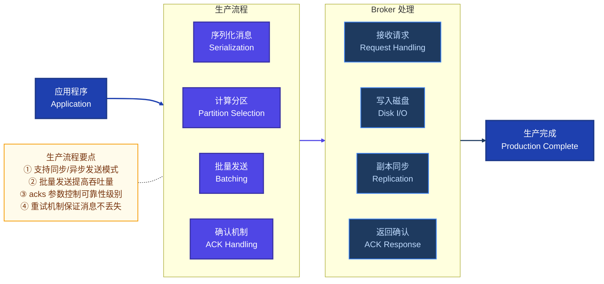
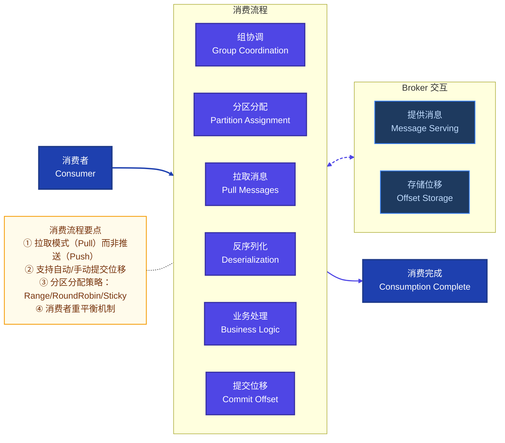
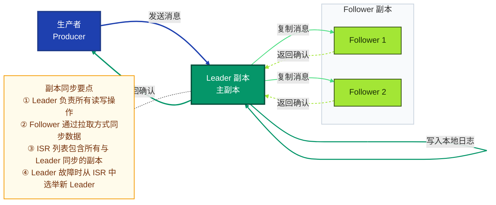

# Kafka 核心原理与应用指南

> 详细讲解 Kafka 核心概念、消息机制原理、应用方法及最佳实践

---

## 一、Kafka 核心概念

### 1.1 基础组件

| 组件 | 说明 | 作用 |
|------|------|------|
| **Producer** | 消息生产者 | 向 Kafka 集群发送消息的客户端 |
| **Consumer** | 消息消费者 | 从 Kafka 集群拉取并消费消息的客户端 |
| **Broker** | 服务节点 | 存储消息的服务器，构成 Kafka 集群 |
| **Topic** | 消息主题 | 消息的逻辑分类，每条消息都属于一个 Topic |
| **Partition** | 分区 | Topic 的物理存储单元，消息按 Partition 分布式存储 |
| **Consumer Group** | 消费者组 | 一组消费者，共同消费一个或多个 Topic 的消息 |
| **Offset** | 消费位移 | 记录消费者消费进度的指针，每个 Partition 独立维护 |
| **Replication** | 副本 | Partition 的备份，提高可用性和容错能力 |
| **Leader** | 主副本 | 每个 Partition 有一个 Leader，负责读写操作 |
| **Follower** | 从副本 | 跟随 Leader 同步数据，Leader 故障时可晋升 |
| **ISR** | 同步副本集合 | 与 Leader 保持同步的副本列表，用于故障转移 |

### 1.2 核心概念架构图

```mermaid
flowchart TB
    %% ── 配色主题：按职责区分层次 ──────────────────────────────
    classDef producerStyle fill:#7c3aed,stroke:#4c1d95,stroke-width:2px,color:#fff
    classDef brokerStyle fill:#1e3a5f,stroke:#3b82f6,stroke-width:1.5px,color:#bfdbfe
    classDef topicStyle fill:#0891b2,stroke:#155e75,stroke-width:2px,color:#fff
    classDef partitionStyle fill:#0891b2,stroke:#155e75,stroke-width:1.5px,color:#fff
    classDef consumerStyle fill:#dc2626,stroke:#991b1b,stroke-width:2px,color:#fff
    classDef zkStyle fill:#d97706,stroke:#92400e,stroke-width:2.5px,color:#fff
    classDef offsetStyle fill:#ea580c,stroke:#7c2d12,stroke-width:2px,color:#fff
    classDef noteStyle fill:#fffbeb,stroke:#f59e0b,stroke-width:1.5px,color:#78350f
    classDef layerStyle fill:#f8fafc,stroke:#cbd5e0,stroke-width:1.5px
    classDef infraStyle fill:#fafaf9,stroke:#a8a29e,stroke-width:1.5px

    %% ── 生产者层 ─────────────────────────────────────────────────
    subgraph PRODUCERS["生产者层 Producers"]
        direction LR
        P1["Producer A<br>业务服务"]:::producerStyle
        P2["Producer B<br>日志采集"]:::producerStyle
        P3["Producer C<br>IoT 设备"]:::producerStyle
    end
    class PRODUCERS layerStyle

    %% ── Kafka 集群层 ─────────────────────────────────────────────
    subgraph CLUSTER["Kafka 集群"]
        direction LR
        
        subgraph BROKER1["Broker 1"]
            P0L["Partition-0<br>★ Leader"]:::partitionStyle
            P2R["Partition-2<br>Follower"]:::partitionStyle
        end
        class BROKER1 brokerStyle
        
        subgraph BROKER2["Broker 2"]
            P1L["Partition-1<br>★ Leader"]:::partitionStyle
            P0R["Partition-0<br>Follower"]:::partitionStyle
        end
        class BROKER2 brokerStyle
        
        subgraph BROKER3["Broker 3"]
            P2L["Partition-2<br>★ Leader"]:::partitionStyle
            P1R["Partition-1<br>Follower"]:::partitionStyle
        end
        class BROKER3 brokerStyle
    end
    class CLUSTER infraStyle

    %% ── 协调层 ─────────────────────────────────────────────────
    ZK["(""ZooKeeper / KRaft<br>元数据管理 · 选举")"]:::zkStyle

    %% ── 消费者层 ─────────────────────────────────────────────────
    subgraph CONSUMERS["消费者组 Consumer Group"]
        direction LR
        C1["Consumer 1<br>消费 P0"]:::consumerStyle
        C2["Consumer 2<br>消费 P1"]:::consumerStyle
        C3["Consumer 3<br>消费 P2"]:::consumerStyle
        OS["(""__consumer_offsets<br>位移存储")"]:::offsetStyle
    end
    class CONSUMERS layerStyle

    %% ── 数据流 ─────────────────────────────────────────────────
    P1 -->|"Send<br>key-hash → P0"| P0L
    P2 -->|"Send<br>key-hash → P1"| P1L
    P3 -->|"Send<br>key-hash → P2"| P2L
    
    P0L -.->|"副本同步<br>ISR 复制"| P0R
    P1L -.->|"副本同步<br>ISR 复制"| P1R
    P2L -.->|"副本同步<br>ISR 复制"| P2R
    
    ZK <-->|"心跳检测 / 选主"| BROKER1
    ZK <-->|"心跳检测 / 选主"| BROKER2
    ZK <-->|"心跳检测 / 选主"| BROKER3
    
    P0L -->|"Poll 拉取"| C1
    P1L -->|"Poll 拉取"| C2
    P2L -->|"Poll 拉取"| C3
    
    C1 & C2 & C3 -->|"提交 Offset"| OS

    %% ── 设计注记 ─────────────────────────────────────────────────
    NOTE["Kafka 核心概念<br>① Topic 是逻辑分类，Partition 是物理存储<br>② 每个 Partition 仅 1 个 Leader 负责读写<br>③ 同组内每个 Partition 只被 1 个 Consumer 消费<br>④ Offset 记录消费进度，支持幂等性"]:::noteStyle
    NOTE -.- CLUSTER

    %% 边索引：0-14，共 15 条
    linkStyle 0,1,2 stroke:#7c3aed,stroke-width:2.5px
    linkStyle 3,4,5 stroke:#4ade80,stroke-width:1.5px,stroke-dasharray:5 3
    linkStyle 6,7,8 stroke:#f59e0b,stroke-width:1.5px,stroke-dasharray:3 3
    linkStyle 9,10,11 stroke:#dc2626,stroke-width:2px
    linkStyle 12,13,14 stroke:#ea580c,stroke-width:1.5px
```

---

## 二、Kafka 消息机制原理

### 2.1 消息生产流程



### 2.2 消息消费流程



### 2.3 分区与副本机制

#### 2.3.1 分区策略

| 策略 | 说明 | 适用场景 |
|------|------|----------|
| **Round Robin** | 轮询分配，均匀分布 | 无特定路由需求的场景 |
| **Hash** | 基于消息 Key 的哈希值 | 需要同 Key 消息有序的场景 |
| **Range** | 按范围分配分区 | 简单且易于理解的场景 |
| **Custom** | 自定义分区逻辑 | 特殊业务需求场景 |

#### 2.3.2 副本同步机制



---

## 三、Kafka 应用方法

### 3.1 生产者应用

#### 3.1.1 基本配置与示例

```java
// Kafka 生产者配置示例
Properties props = new Properties();
props.put("bootstrap.servers", "localhost:9092");
props.put("key.serializer", "org.apache.kafka.common.serialization.StringSerializer");
props.put("value.serializer", "org.apache.kafka.common.serialization.StringSerializer");
props.put("acks", "all"); // 最高可靠性
props.put("retries", 3); // 重试次数
props.put("batch.size", 16384); // 批处理大小
props.put("linger.ms", 1); // 等待时间

// 创建生产者
Producer<String, String> producer = new KafkaProducer<>(props);

// 发送消息
ProducerRecord<String, String> record = new ProducerRecord<>("orders", "order-1", "{\"id\": 1, \"amount\": 100}");
try {
    producer.send(record, (metadata, exception) -> {
        if (exception == null) {
            System.out.println("消息发送成功: " + metadata.topic() + "-" + metadata.partition() + "-" + metadata.offset());
        } else {
            System.err.println("消息发送失败: " + exception.getMessage());
        }
    });
} finally {
    producer.close();
}
```

#### 3.1.2 最佳实践

- **合理设置批处理参数**：根据业务场景调整 `batch.size` 和 `linger.ms`，平衡延迟和吞吐量
- **选择合适的确认级别**：`acks=all` 提供最高可靠性，适合金融交易等场景
- **实现幂等性**：启用 `enable.idempotence=true` 防止消息重复
- **使用事务**：对关键业务场景启用事务，确保消息的原子性

### 3.2 消费者应用

#### 3.2.1 基本配置与示例

```java
// Kafka 消费者配置示例
Properties props = new Properties();
props.put("bootstrap.servers", "localhost:9092");
props.put("group.id", "order-processors");
props.put("key.deserializer", "org.apache.kafka.common.serialization.StringDeserializer");
props.put("value.deserializer", "org.apache.kafka.common.serialization.StringDeserializer");
props.put("enable.auto.commit", "false"); // 手动提交
props.put("auto.offset.reset", "earliest"); // 从最早消息开始消费

// 创建消费者
Consumer<String, String> consumer = new KafkaConsumer<>(props);

// 订阅主题
consumer.subscribe(Collections.singletonList("orders"));

// 消费消息
try {
    while (true) {
        ConsumerRecords<String, String> records = consumer.poll(Duration.ofMillis(100));
        for (ConsumerRecord<String, String> record : records) {
            System.out.println("消费消息: " + record.key() + " -> " + record.value());
            // 处理业务逻辑
        }
        // 手动提交位移
        consumer.commitSync();
    }
} finally {
    consumer.close();
}
```

#### 3.2.2 最佳实践

- **手动提交位移**：对关键业务场景使用 `commitSync()` 或 `commitAsync()` 确保位移提交与业务处理一致
- **合理设置 `poll()` 超时**：根据业务处理速度调整，避免过长或过短
- **使用消费者组**：通过消费者组实现消息的负载均衡和故障转移
- **处理消费异常**：实现错误处理和重试机制，确保消息不丢失

### 3.3 Kafka 与 Spring Boot 集成

#### 3.3.1 依赖配置

```xml
<dependency>
    <groupId>org.springframework.kafka</groupId>
    <artifactId>spring-kafka</artifactId>
</dependency>
```

#### 3.3.2 生产者示例

```java
@Service
public class KafkaProducerService {
    
    private final KafkaTemplate<String, String> kafkaTemplate;
    
    @Autowired
    public KafkaProducerService(KafkaTemplate<String, String> kafkaTemplate) {
        this.kafkaTemplate = kafkaTemplate;
    }
    
    public void sendMessage(String topic, String key, String message) {
        ListenableFuture<SendResult<String, String>> future = kafkaTemplate.send(topic, key, message);
        future.addCallback(new ListenableFutureCallback<SendResult<String, String>>() {
            @Override
            public void onSuccess(SendResult<String, String> result) {
                System.out.println("消息发送成功: " + result.getRecordMetadata());
            }
            
            @Override
            public void onFailure(Throwable ex) {
                System.err.println("消息发送失败: " + ex.getMessage());
            }
        });
    }
}
```

#### 3.3.3 消费者示例

```java
@Service
public class KafkaConsumerService {
    
    @KafkaListener(topics = "orders", groupId = "order-processors")
    public void consumeMessage(ConsumerRecord<String, String> record) {
        System.out.println("消费消息: " + record.key() + " -> " + record.value());
        // 处理业务逻辑
    }
}
```

---

## 四、Kafka 实战示例

### 4.1 消息驱动的微服务架构

```mermaid
flowchart TB
    %% ── 配色主题：按职责区分层次 ──────────────────────────────
    classDef clientStyle fill:#1f2937,stroke:#111827,stroke-width:2px,color:#f9fafb
    classDef apiStyle fill:#1d4ed8,stroke:#1e3a8a,stroke-width:2.5px,color:#fff
    classDef serviceStyle fill:#0891b2,stroke:#155e75,stroke-width:2px,color:#fff
    classDef kafkaStyle fill:#d97706,stroke:#92400e,stroke-width:2px,color:#fff
    classDef dbStyle fill:#059669,stroke:#064e3b,stroke-width:2px,color:#fff
    classDef noteStyle fill:#fffbeb,stroke:#f59e0b,stroke-width:1.5px,color:#78350f
    classDef layerStyle fill:#f8fafc,stroke:#cbd5e0,stroke-width:1.5px

    %% ── 客户端层 ─────────────────────────────────────────────
    subgraph CLIENT["客户端层"]
        direction LR
        WEB["Web 应用"]:::clientStyle
        MOBILE["移动应用"]:::clientStyle
    end
    class CLIENT layerStyle

    %% ── API 层 ───────────────────────────────────────────────
    subgraph API["API 层"]
        API_GW["API Gateway"]:::apiStyle
        ORDER_API["订单 API"]:::apiStyle
        USER_API["用户 API"]:::apiStyle
    end
    class API layerStyle

    %% ── 服务层 ───────────────────────────────────────────────
    subgraph SERVICES["服务层"]
        direction LR
        ORDER_SVC["订单服务"]:::serviceStyle
        USER_SVC["用户服务"]:::serviceStyle
        PAYMENT_SVC["支付服务"]:::serviceStyle
        NOTIFY_SVC["通知服务"]:::serviceStyle
    end
    class SERVICES layerStyle

    %% ── Kafka 消息层 ─────────────────────────────────────────
    KAFKA["(""Kafka 消息队列")"]:::kafkaStyle

    %% ── 数据层 ───────────────────────────────────────────────
    subgraph DATA["数据层"]
        direction LR
        DB_ORDER["订单数据库"]:::dbStyle
        DB_USER["用户数据库"]:::dbStyle
        DB_PAYMENT["支付数据库"]:::dbStyle
    end
    class DATA layerStyle

    %% ── 数据流 ───────────────────────────────────────────────
    WEB --> API_GW
    MOBILE --> API_GW
    API_GW --> ORDER_API
    API_GW --> USER_API
    ORDER_API --> ORDER_SVC
    USER_API --> USER_SVC
    ORDER_SVC --> DB_ORDER
    USER_SVC --> DB_USER
    ORDER_SVC --> KAFKA
    KAFKA --> PAYMENT_SVC
    KAFKA --> NOTIFY_SVC
    PAYMENT_SVC --> DB_PAYMENT

    %% ── 设计注记 ─────────────────────────────────────────────
    NOTE["消息驱动架构要点<br>① 服务间通过 Kafka 解耦<br>② 异步处理提高系统吞吐量<br>③ 事件溯源便于系统扩展<br>④ 可靠的消息传递保证数据一致性"]:::noteStyle
    NOTE -.- KAFKA

    %% 边索引：0-10，共 11 条
    linkStyle 0,1 stroke:#374151,stroke-width:2px
    linkStyle 2,3 stroke:#1d4ed8,stroke-width:2px
    linkStyle 4,5 stroke:#1d4ed8,stroke-width:2px
    linkStyle 6,7,8 stroke:#0891b2,stroke-width:2px
    linkStyle 9,10 stroke:#d97706,stroke-width:2px,stroke-dasharray:4 3
```

### 4.2 日志收集与处理

#### 4.2.1 架构设计

- **采集层**：使用 Filebeat、Logstash 等工具采集应用日志
- **传输层**：Kafka 作为日志缓冲区，解耦采集和处理
- **处理层**：使用 Flink、Spark 等流处理框架分析日志
- **存储层**：Elasticsearch 存储日志，Kibana 可视化

#### 4.2.2 配置示例

```yaml
# Filebeat 配置示例
filebeat.inputs:
- type: log
  paths:
    - /var/log/app/*.log
  fields:
    service: my-app

output.kafka:
  hosts: ["localhost:9092"]
  topic: "app-logs"
  partition.round_robin:
    reachable_only: false
  required_acks: 1
  compression: gzip
  max_message_bytes: 1000000
```

---

## 五、面试常见问题（FAQ）

### 5.1 原理类问题

#### Q1: Kafka 为什么速度快？

**A:** Kafka 速度快的原因包括：
- **顺序读写**：消息追加到分区末尾，顺序 I/O 比随机 I/O 快
- **批量处理**：生产者批量发送，消费者批量拉取
- **零拷贝**：使用 sendfile 系统调用，减少数据拷贝次数
- **分区并行**：多分区并行处理，提高吞吐量
- **页缓存**：利用操作系统页缓存，减少磁盘 I/O

#### Q2: Kafka 如何保证消息不丢失？

**A:** 保证消息不丢失的措施：
- **生产者**：设置 `acks=all`，启用重试机制
- **Broker**：配置适当的副本数，确保数据冗余
- **消费者**：使用手动提交位移，确保消息处理完成后再提交
- **事务**：对于关键业务，使用 Kafka 事务保证消息的原子性

#### Q3: Kafka 的分区策略有哪些？

**A:** 常见的分区策略：
- **Round Robin**：轮询分配，均匀分布
- **Hash**：基于消息 Key 的哈希值，保证同 Key 消息进入同一分区
- **Range**：按范围分配分区
- **Custom**：自定义分区逻辑

### 5.2 应用类问题

#### Q4: 如何选择 Kafka 的分区数？

**A:** 分区数的选择考虑以下因素：
- **吞吐量需求**：每个分区的吞吐量约为 1000-5000 TPS，根据总吞吐量计算所需分区数
- **消费者数量**：消费者数量不超过分区数，否则部分消费者会空闲
- **存储需求**：每个分区对应一个日志文件，分区数过多会增加磁盘负担
- **可用性**：分区数越多，故障恢复时间越长

#### Q5: Kafka 与 RabbitMQ 的区别？

**A:** 主要区别：
- **设计理念**：Kafka 是分布式流处理平台，RabbitMQ 是消息队列
- **存储方式**：Kafka 基于日志文件，RabbitMQ 基于内存和磁盘
- **吞吐量**：Kafka 吞吐量更高，适合大数据场景
- **消息顺序**：Kafka 保证分区内顺序，RabbitMQ 保证队列内顺序
- **消息确认**：Kafka 是拉取模式，RabbitMQ 是推送模式
- **适用场景**：Kafka 适合日志收集、流处理，RabbitMQ 适合业务消息、任务队列

#### Q6: 如何处理 Kafka 消息积压？

**A:** 处理消息积压的方法：
- **增加消费者**：水平扩展消费者数量（不超过分区数）
- **优化消费逻辑**：提高消费者处理速度
- **临时扩容**：创建临时消费者组，快速消费积压消息
- **调整参数**：增加 `fetch.max.bytes`、`max.poll.records` 等参数
- **监控告警**：设置消息积压监控，及时发现问题

### 5.3 运维类问题

#### Q7: Kafka 集群如何扩容？

**A:** 集群扩容步骤：
- **添加新 Broker**：启动新的 Kafka 实例，加入现有集群
- **重新分配分区**：使用 `kafka-reassign-partitions.sh` 工具重新分配分区
- **监控状态**：确保新 Broker 正常加入，分区重分配完成

#### Q8: 如何监控 Kafka 集群？

**A:** 关键监控指标：
- **生产/消费速率**：监控消息生产和消费速度
- **分区分布**：确保分区均匀分布在各 Broker
- **副本同步**：监控 ISR 状态，确保副本同步正常
- **消费者滞后**：监控消费者消费进度，及时发现积压
- **Broker 状态**：监控 Broker 健康状态、磁盘使用情况

#### Q9: Kafka 常见故障及处理方法？

**A:** 常见故障及处理：
- **Broker 宕机**：等待自动故障转移，从 ISR 中选举新 Leader
- **网络分区**：等待网络恢复，Kafka 会自动处理分区一致性
- **磁盘故障**：更换磁盘，从副本恢复数据
- **ZooKeeper 故障**：确保 ZooKeeper 集群高可用，避免单点故障

---

## 六、总结

Kafka 作为一款高性能、高可靠的分布式消息系统，已经成为现代微服务架构和大数据处理的核心组件。通过本文的学习，您应该对 Kafka 的核心概念、消息机制原理、应用方法和最佳实践有了全面的了解。

Kafka 的设计理念和技术实现为我们构建可靠、高效的分布式系统提供了重要参考。在实际应用中，应根据业务场景和性能需求，合理配置 Kafka 集群，选择合适的生产和消费策略，以充分发挥 Kafka 的优势。

随着 Kafka 生态系统的不断发展，它不仅是一个消息队列，更是一个完整的流处理平台，为实时数据处理、事件驱动架构等场景提供了强大的支持。掌握 Kafka 技术，对于构建现代化的分布式系统具有重要意义。