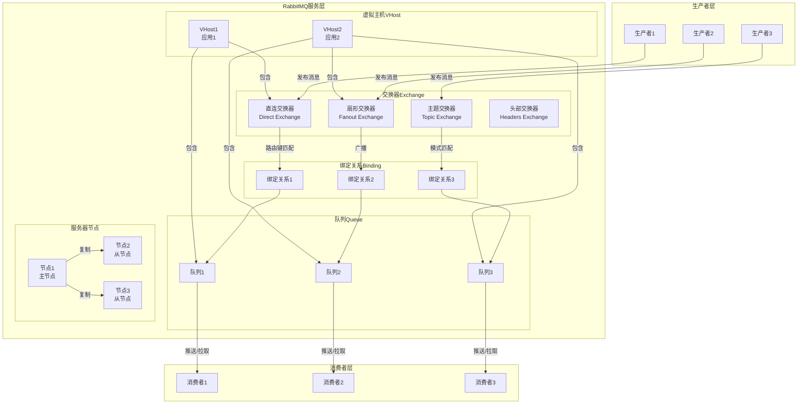
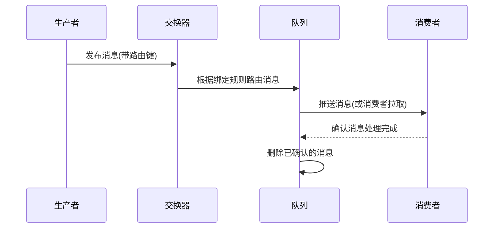

# RabbitMQ 架构图

## 核心架构组件

## 消息流转流程

## 核心组件说明

### 1. 生产者 (Producer)
- 负责将消息发送到RabbitMQ服务器
- 可以指定交换器、路由键和消息属性
- 支持事务和发布确认机制

### 2. 交换器 (Exchange)
- 接收生产者发送的消息
- 根据交换器类型和绑定规则路由消息到队列
- 四种类型：
  - Direct Exchange：根据精确路由键匹配
  - Fanout Exchange：广播到所有绑定的队列
  - Topic Exchange：根据模式匹配路由键
  - Headers Exchange：根据消息头部属性匹配

### 3. 队列 (Queue)
- 存储消息直到被消费者处理
- 支持持久化、优先级、过期时间等特性
- 可以设置最大长度和消息大小限制

### 4. 绑定 (Binding)
- 建立交换器和队列之间的关联
- 包含路由规则（如路由键、模式等）

### 5. 消费者 (Consumer)
- 从队列中获取并处理消息
- 支持推模式(Push)和拉模式(Pull)
- 可以设置消息确认机制（自动确认或手动确认）

### 6. 虚拟主机 (VHost)
- 逻辑隔离的消息空间
- 每个VHost有独立的交换器、队列和绑定
- 支持不同应用间的权限隔离

### 7. 节点 (Node)
- RabbitMQ服务器实例
- 支持集群部署，提供高可用性
- 主节点负责写入，从节点负责复制和故障转移

## 高级特性

### 消息持久化
- 交换器、队列和消息都可以设置持久化
- 确保服务器重启后消息不丢失

### 消息确认机制
- 发布确认：确保消息成功到达服务器
- 消费确认：确保消息被成功处理

### 死信队列
- 处理无法投递或处理失败的消息
- 支持消息过期、队列长度限制等场景

### 延迟队列
- 实现消息的延迟投递
- 基于消息过期和死信队列机制

### 集群和高可用
- 支持多节点集群
- 队列镜像确保高可用性
- 负载均衡和故障转移

## 应用场景

1. **异步处理**：将耗时操作异步化，提高系统响应速度
2. **应用解耦**：不同系统通过消息队列通信，减少直接依赖
3. **流量削峰**：缓冲瞬时高流量，保护后端系统
4. **日志处理**：收集和处理分布式系统的日志
5. **消息分发**：实现发布/订阅模式，向多个消费者分发消息

## 部署架构

### 单节点部署
- 简单部署，适合开发和测试环境
- 无高可用性保障

### 集群部署
- 多节点组成集群，提供高可用性
- 队列镜像确保数据冗余
- 负载均衡提高系统吞吐量

###  federation和shovel
- 跨数据中心的消息传递
- 实现地理分布式部署
