## Kafka 消息机制原理图

> 展示 Producer → Kafka Broker 集群 → Consumer Group 的完整消息流转机制，涵盖分区副本同步、Leader 选举与 Offset 管理

```mermaid
flowchart TB
    %% ── 配色主题：按角色职责区分层次 ──────────────────────────────────────
    classDef producerStyle fill:#7c3aed,stroke:#4c1d95,stroke-width:2px,color:#fff
    classDef leaderStyle   fill:#059669,stroke:#064e3b,stroke-width:2.5px,color:#fff
    classDef replicaStyle  fill:#a3e635,stroke:#365314,stroke-width:1.5px,color:#1a2e05
    classDef consumerStyle fill:#dc2626,stroke:#991b1b,stroke-width:2px,color:#fff
    classDef zkStyle       fill:#d97706,stroke:#92400e,stroke-width:2.5px,color:#fff
    classDef offsetStyle   fill:#ea580c,stroke:#7c2d12,stroke-width:2px,color:#fff
    classDef noteStyle     fill:#fffbeb,stroke:#f59e0b,stroke-width:1.5px,color:#78350f
    classDef layerStyle    fill:#f8fafc,stroke:#cbd5e0,stroke-width:1.5px
    classDef infraStyle    fill:#0f172a,stroke:#334155,stroke-width:2px,color:#94a3b8
    classDef brokerStyle   fill:#1e3a5f,stroke:#3b82f6,stroke-width:1.5px,color:#bfdbfe

    %% ── 生产者层 ─────────────────────────────────────────────────────────
    subgraph PROD["生产者层 Producers"]
        direction LR
        P1["Producer A<br>业务服务 / 日志采集"]:::producerStyle
        P2["Producer B<br>IoT 设备 / 数据管道"]:::producerStyle
        P3["Producer C<br>微服务事件发布"]:::producerStyle
    end
    class PROD layerStyle

    %% ── Kafka Broker 集群层 ───────────────────────────────────────────────
    subgraph CLUSTER["Kafka Broker 集群（Topic: order-events，Replication Factor = 2）"]
        direction LR

        subgraph B1["Broker 1"]
            P0L["Partition-0<br>★ Leader"]:::leaderStyle
            P2R["Partition-2<br>Follower"]:::replicaStyle
        end
        class B1 brokerStyle

        subgraph B2["Broker 2"]
            P1L["Partition-1<br>★ Leader"]:::leaderStyle
            P0R["Partition-0<br>Follower"]:::replicaStyle
        end
        class B2 brokerStyle

        subgraph B3["Broker 3"]
            P2L["Partition-2<br>★ Leader"]:::leaderStyle
            P1R["Partition-1<br>Follower"]:::replicaStyle
        end
        class B3 brokerStyle
    end
    class CLUSTER infraStyle

    %% ── 协调层 ───────────────────────────────────────────────────────────
    ZK[("控制器层（ZooKeeper 模式 / KRaft 模式，二选一）<br>元数据管理 · 分区 Leader 选举<br>Broker 注册 · 配置同步")]:::zkStyle

    %% ── 消费者层 ─────────────────────────────────────────────────────────
    subgraph CG["消费者组 Consumer Group（group-id: order-processor）"]
        direction LR
        C1["Consumer 1<br>消费 Partition-0"]:::consumerStyle
        C2["Consumer 2<br>消费 Partition-1"]:::consumerStyle
        C3["Consumer 3<br>消费 Partition-2"]:::consumerStyle
        OS[("__consumer_offsets<br>Offset 提交存储")]:::offsetStyle
    end
    class CG layerStyle

    %% ── 数据流 ───────────────────────────────────────────────────────────
    P1 -->|"Send<br>key-hash → P0"| P0L
    P2 -->|"Send<br>key-hash → P1"| P1L
    P3 -->|"Send<br>key-hash → P2"| P2L

    P0L -.->|"副本同步<br>ISR 复制"| P0R
    P1L -.->|"副本同步<br>ISR 复制"| P1R
    P2L -.->|"副本同步<br>ISR 复制"| P2R

    ZK <-->|"心跳检测 / 选主"| B1
    ZK <-->|"心跳检测 / 选主"| B2
    ZK <-->|"心跳检测 / 选主"| B3

    P0L -->|"Poll 拉取"| C1
    P1L -->|"Poll 拉取"| C2
    P2L -->|"Poll 拉取"| C3

    C1 & C2 & C3 -->|"提交 Offset"| OS

    %% ── 设计注记 ─────────────────────────────────────────────────────────
    NOTE["Kafka 核心机制要点<br>① Producer 按 Key Hash 路由到固定 Partition，保证同 Key 消息在同一 Partition 内有序（不保证跨 Partition 全局顺序）<br>② 每个 Partition 仅 1 个 Leader 负责读写；Follower 以拉取方式复制，acks=all 时 Leader 需等待 ISR 副本确认再应答<br>③ 同一 Consumer Group 中每个 Partition 只被 1 个 Consumer 消费（水平扩展）<br>④ Consumer 自管 Offset 支持 at-least-once；exactly-once 需额外启用幂等 Producer（enable.idempotence=true）与事务（transactional.id）"]:::noteStyle
    NOTE -.- CG

    linkStyle 0,1,2     stroke:#7c3aed,stroke-width:2.5px
    linkStyle 3,4,5     stroke:#4ade80,stroke-width:1.5px,stroke-dasharray:5 3
    linkStyle 6,7,8     stroke:#f59e0b,stroke-width:1.5px,stroke-dasharray:3 3
    linkStyle 9,10,11   stroke:#dc2626,stroke-width:2px
    linkStyle 12,13,14  stroke:#ea580c,stroke-width:1.5px
```

---

## 核心概念速查

| 概念 | 说明 |
|------|------|
| **Topic / Partition** | Topic 是逻辑消息分类；Partition 是物理存储单元，追加写入，不可修改，天然有序 |
| **Leader / Follower** | 每个 Partition 有且仅有 1 个 Leader 处理读写；Follower 持续从 Leader 同步，进入 ISR 列表 |
| **ISR（In-Sync Replica）** | 与 Leader 保持同步的副本集合；Leader 宕机时从 ISR 中重新选主以降低数据丢失风险（是否丢失取决于确认级别与副本状态） |
| **Producer Key 路由** | `hash(key) % partitionCount` 决定写入哪个 Partition，无 Key 则轮询（Round-Robin） |
| **Consumer Group** | 同组内每个 Partition 仅被一个 Consumer 消费；不同组之间独立消费互不影响（各组都能消费完整 Topic） |
| **消费读取路径** | 默认从 Leader 拉取；Kafka 2.4+ 可结合 `client.rack` 启用就近副本读取（Follower Fetching） |
| **Offset 管理** | Consumer 将位点提交到 `__consumer_offsets`；`auto.offset.reset=earliest/latest` 控制新组（或无有效位点时）从何处开始消费 |
| **acks 确认机制** | `acks=0`（不确认）/ `acks=1`（Leader 确认）/ `acks=all`（等待 ISR 副本确认，通常与 `min.insync.replicas` 搭配提升可靠性） |

---

## 生产可用参数建议（可直接落地）

| 侧 | 参数 | 推荐值 | 作用 / 说明 |
|---|---|---|---|
| **Producer** | `acks` | `all` | 等待 ISR 副本确认，提升可靠性 |
| **Producer** | `enable.idempotence` | `true` | 开启幂等写入，降低重试导致的重复消息 |
| **Producer** | `retries` | `Integer.MAX_VALUE`（或较大值） | 抖动场景下自动重试，配合幂等更安全 |
| **Producer** | `max.in.flight.requests.per.connection` | `1~5` | 追求严格顺序可设 `1`；吞吐与顺序折中可设 `5`（幂等开启时） |
| **Producer** | `delivery.timeout.ms` | 明确配置（如 `120000`） | 避免默认值不清晰导致超时行为不可控 |
| **Broker/Topic** | `replication.factor` | `>=3`（生产常见） | 增强副本冗余能力；示例图中为 2 仅用于演示 |
| **Broker/Topic** | `min.insync.replicas` | `2`（当副本数为 3） | 与 `acks=all` 联动，防止仅单副本可写仍成功确认 |
| **Broker** | `unclean.leader.election.enable` | `false` | 禁止非 ISR 副本强行选主，降低数据回退/丢失风险 |
| **Consumer** | `enable.auto.commit` | `false`（推荐） | 改为业务处理成功后手动提交，便于控制 at-least-once |
| **Consumer** | `auto.offset.reset` | `earliest`（回放）/ `latest`（实时） | 新组或无位点时的起始消费策略按业务选择 |
| **Consumer** | `isolation.level` | `read_committed`（事务场景） | 仅消费已提交事务消息，配合 EOS 流程 |

### 语义对照（最常用三档）

| 目标语义 | 最小建议配置 |
|---|---|
| **at-most-once**（可能丢，不重复） | 先提交位点再处理消息（通常不推荐） |
| **at-least-once**（不丢，可能重复） | `acks=all` + 幂等 Producer + 消费成功后手动提交 Offset |
| **exactly-once（端到端需业务配合）** | 幂等 Producer + 事务（`transactional.id`）+ 消费端 `read_committed` + 下游幂等/事务一致性设计 |
