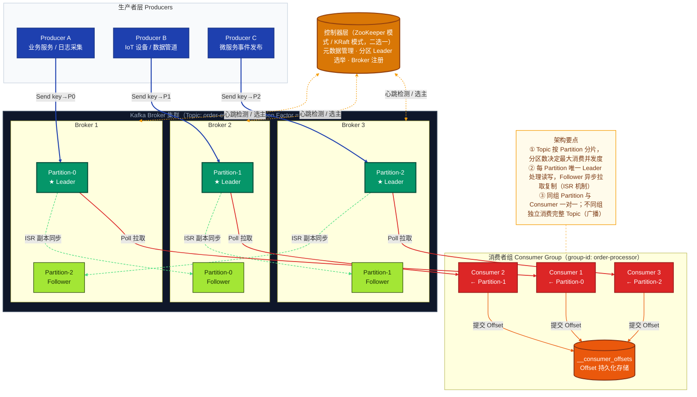
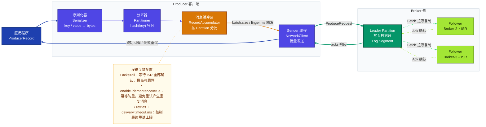
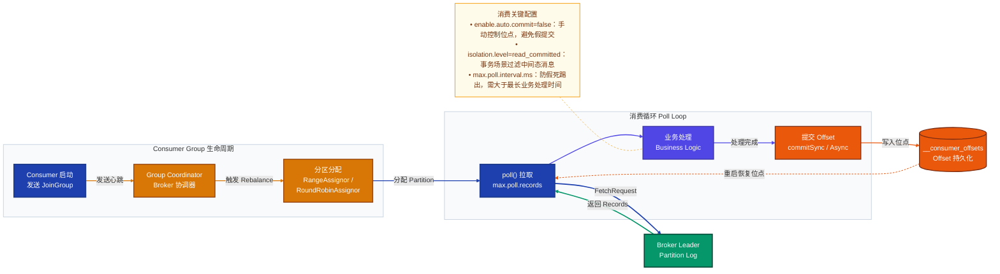
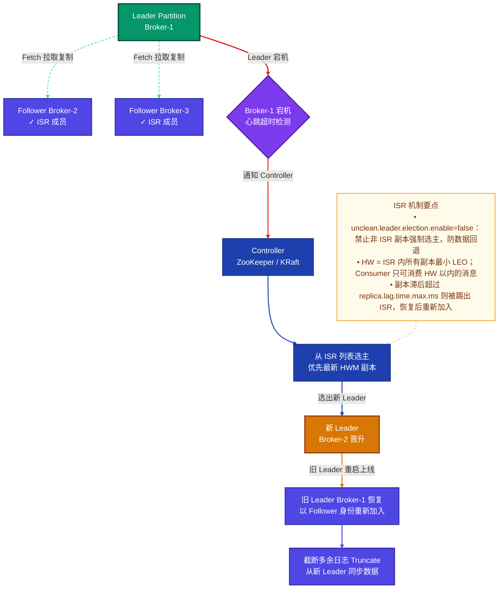
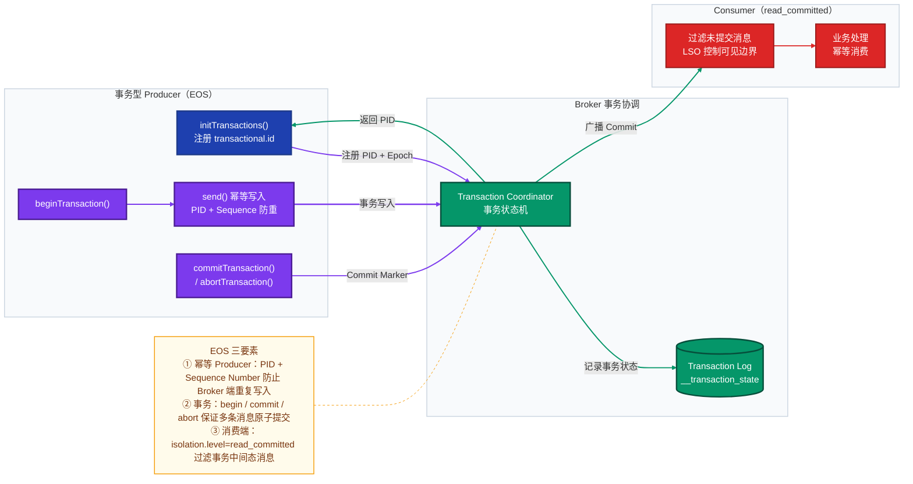

# Kafka 深度解析：原理、机制与实践指南

> 本文涵盖 Kafka 核心概念、消息机制原理、架构设计、生产参数建议与 Spring Boot 实战示例，适合初学者入门与工程师深入参考。
>
> 参考版本：**Apache Kafka 3.6+**（KRaft 模式生产稳定）

---

## 目录

1. [概述](#一概述)
2. [核心概念](#二核心概念)
3. [整体架构图](#三整体架构图)
4. [消息机制原理](#四消息机制原理)
5. [应用方法与示例（Spring Boot）](#五应用方法与示例spring-boot)
6. [生产参数建议](#六生产参数建议)
7. [面试常见问题（FAQ）](#七面试常见问题faq)

---

## 一、概述

### 1.1 什么是 Kafka

Apache Kafka 是由 LinkedIn 开源、后捐赠给 Apache 基金会的**分布式事件流平台**（Distributed Event Streaming Platform）。它以高吞吐、低延迟、持久化存储和水平扩展为核心设计目标，是现代数据架构中不可或缺的基础设施。

Kafka 将所有消息统一抽象为**事件（Event）**，写入后以日志（Log）形式持久化保存，支持多个消费方按各自速率独立消费，天然解耦了生产者与消费者。

### 1.2 核心优势

| 特性 | 说明 |
|---|---|
| **高吞吐** | 单 Broker 可达百万 QPS，顺序磁盘 I/O + 零拷贝（sendfile）极大减少 CPU 开销 |
| **持久化存储** | 消息写入磁盘，默认保留 7 天，支持任意时间点回放 |
| **水平扩展** | Partition 粒度分片，可线性扩展吞吐与存储容量 |
| **强序保证** | 同一 Partition 内消息严格按 Offset 有序 |
| **多消费者隔离** | Consumer Group 机制天然支持"队列"与"广播"两种模式 |
| **精准一次语义** | 结合幂等 Producer + 事务 API 实现端到端 EOS（Exactly-Once Semantics） |

### 1.3 典型应用场景

| 场景 | 说明 |
|---|---|
| **日志采集** | ELK 架构中 Kafka 作为缓冲层，削峰填谷，防止 Elasticsearch 过载 |
| **消息队列** | 替代 RabbitMQ，承载高并发业务事件（下单、支付、库存扣减） |
| **数据同步** | 配合 Debezium CDC 实时同步数据库变更到数仓 |
| **事件驱动架构** | 微服务异步解耦、Saga 事务编排 |
| **实时计算** | Kafka → Flink / Spark Streaming → 实时报表 / 风控 |

---

## 二、核心概念

### 2.1 Topic（主题）与 Partition（分区）

**Topic** 是消息的逻辑分类，类似数据库的表名。每个 Topic 被水平切分为若干 **Partition**（分区）。

Partition 的核心特征：

- **追加写入**（Append-only Log）：消息只增不改，写入后不可变，Offset 单调递增
- **物理存储**：以 `.log`（数据）、`.index`（偏移索引）、`.timeindex`（时间索引）文件段（Segment）存储在磁盘
- **顺序消费**：Consumer 按 Offset 递增顺序消费，同 Partition 内严格有序

> **分区数决定最大并发度**：Consumer Group 内有效消费的 Consumer 数不能超过 Partition 数，超出部分处于空闲状态。

### 2.2 Broker（服务节点）

Broker 是 Kafka 集群中的服务进程，核心职责：

- 接收 Producer 写入的消息并持久化到磁盘
- 响应 Consumer 的 Fetch（拉取）请求
- 维护 Partition 的 Leader / Follower 角色分配

一个 Kafka 集群由多个 Broker 组成，Topic 的各 Partition 分散部署在不同 Broker 上，实现负载均衡与高可用。

### 2.3 Producer（生产者）

Producer 负责将消息发送到指定 Topic，具有以下关键行为：

| 行为 | 说明 |
|---|---|
| **分区路由** | 有 Key 时：`hash(key) % partitionCount` 路由到固定 Partition，保证同 Key 消息在 Partition 内有序；无 Key 时：轮询或粘性分区（Sticky Partitioner，Kafka 2.4+） |
| **批量发送** | 消息先进入 `RecordAccumulator` 缓冲区，按 `batch.size` 或 `linger.ms` 触发批量发送，降低网络开销 |
| **acks 确认** | 通过 `acks` 参数控制可靠性等级：`0`（不确认）/ `1`（Leader 确认）/ `all`（ISR 全部确认） |
| **幂等写入** | 开启 `enable.idempotence=true` 后，Broker 按 PID + Sequence Number 去重，防止重试导致重复写入 |

### 2.4 Consumer（消费者）与 Consumer Group（消费者组）

**Consumer Group** 是一组协同消费同一 Topic 的 Consumer 实例集合，核心规则：

| 场景 | 行为 |
|---|---|
| **同 Group 内** | 每个 Partition 仅被 **1 个** Consumer 消费，实现负载均衡（队列模式） |
| **不同 Group 间** | 各组独立消费 Topic 全量消息，互不影响（广播 / 发布订阅模式） |

**Rebalance（再均衡）**：当 Consumer 数量变化或 Topic 分区数变化时，Group Coordinator（协调器 Broker）重新分配 Partition 与 Consumer 的对应关系。Rebalance 期间所有 Consumer 暂停消费，是影响稳定性的重要因素。

### 2.5 Offset（消费位点）

Offset 是 Consumer 在某个 Partition 中消费到的位置标记，持久化存储在 Broker 内部 Topic `__consumer_offsets` 中。

| 参数 | 说明 |
|---|---|
| `auto.offset.reset=earliest` | 无有效位点时从最早消息开始（适合数据回放） |
| `auto.offset.reset=latest` | 无有效位点时从最新消息开始（适合实时业务） |
| `enable.auto.commit=false` | 关闭自动提交，业务处理成功后手动提交，实现 at-least-once |

### 2.6 ISR（In-Sync Replica，同步副本集合）

为保证高可用，每个 Partition 的副本分为两种角色：

- **Leader**：唯一处理读写请求的副本（默认情况下 Consumer 也从 Leader 读取）
- **Follower**：通过 Fetch 请求从 Leader **异步拉取**消息进行复制

**ISR** 是与 Leader 保持同步的副本集合。只有副本的同步延迟在 `replica.lag.time.max.ms` 阈值内，才能留在 ISR 列表中。

关键概念：

| 术语 | 说明 |
|---|---|
| **LEO（Log End Offset）** | 副本日志的下一个待写入位置 |
| **HW（High Watermark）** | ISR 内所有副本最小 LEO；Consumer 只能消费 HW 以内的消息，HW 以外不可见 |
| **Leader 选举** | Leader 宕机时，Controller 仅从 ISR 中选出新 Leader，防止数据丢失 |

### 2.7 控制器层：ZooKeeper vs KRaft

| 模式 | 说明 |
|---|---|
| **ZooKeeper 模式**（Kafka < 2.8） | 依赖外部 ZooKeeper 集群管理元数据、Broker 注册、Leader 选举，架构复杂，运维成本高 |
| **KRaft 模式**（Kafka ≥ 3.3 生产稳定） | Kafka 内置 Raft 共识协议，去除 ZooKeeper 依赖，简化运维，选举延迟更低，支持百万级分区 |

> **新项目建议使用 Kafka 3.3+ KRaft 模式**，Kafka 4.0 已正式移除 ZooKeeper 支持。

---

## 三、整体架构图

> 系统静态结构视图：展示 Producer → Kafka Broker 集群 → Consumer Group 的组件构成与层级关系



---

## 四、消息机制原理

### 4.1 Producer 消息发送机制

Producer 发送一条消息到 Broker 经过以下完整链路：

1. **序列化**（Serializer）：将 key 和 value 序列化为字节数组
2. **分区路由**（Partitioner）：根据 key 或策略决定写入哪个 Partition
3. **批量缓冲**（RecordAccumulator）：消息进入按 Partition 分组的内存缓冲区
4. **网络发送**（Sender Thread）：`batch.size` 或 `linger.ms` 触发，Sender 线程批量发出
5. **Broker 写入**：Leader 将消息追加到 Log Segment，并等待 ISR 副本确认（取决于 `acks`）
6. **acks 响应**：Broker 返回确认；失败时 Producer 按策略重试



### 4.2 Broker 存储机制

Kafka 的存储设计是其高性能的根基：

| 机制 | 说明 |
|---|---|
| **顺序写入** | 消息追加到 Log Segment 末尾，充分利用磁盘顺序 I/O（速度接近内存随机读写） |
| **分段存储** | 超过 `log.segment.bytes`（默认 1GB）时滚动创建新 Segment，便于清理过期数据 |
| **稀疏索引** | `.index` 文件按 `log.index.interval.bytes` 间隔记录 Offset → 物理位置映射，支持二分查找快速定位 |
| **零拷贝** | 使用 `sendfile` 系统调用将数据从磁盘直接发送到网络，绕过用户空间，减少 CPU 拷贝次数 |
| **页缓存** | 利用 OS Page Cache 缓冲读写，热数据命中缓存时无磁盘 I/O |
| **日志保留策略** | 按时间（`log.retention.hours`）或大小（`log.retention.bytes`）清理；Compact 模式只保留每 Key 的最新值 |

### 4.3 Consumer 消费机制



**Consumer 拉取（Pull）模型的优势**：

- Consumer 自主控制消费速率，Broker 无需感知 Consumer 的处理能力
- Consumer 可按业务需要批量拉取，减少网络往返
- 对比 Push 模型，Consumer 不会因 Broker 推送过快而过载

> Kafka 2.4+ 支持 **Follower Fetching**：通过 `client.rack` 配置，Consumer 可就近从同机房的 Follower 副本拉取，降低跨机房延迟，默认仍从 Leader 拉取。

### 4.4 ISR 机制与 Leader 选举



### 4.5 消息语义保证（at-least-once / exactly-once）

Kafka 支持三种消息语义，通过不同配置组合实现：

| 语义 | 说明 | 典型风险 |
|---|---|---|
| **at-most-once** | 最多一次，先提交位点再处理消息 | 处理前崩溃会丢消息 |
| **at-least-once** | 至少一次，处理成功后再提交位点 | 失败重试可能产生重复消息 |
| **exactly-once（EOS）** | 精确一次，幂等 Producer + 事务 + read_committed | 配置最复杂，性能有一定开销 |



---

## 五、应用方法与示例（Spring Boot）

### 5.1 依赖与配置

**pom.xml**

```xml
<dependency>
    <groupId>org.springframework.kafka</groupId>
    <artifactId>spring-kafka</artifactId>
</dependency>
```

**application.yml**

```yaml
spring:
  kafka:
    bootstrap-servers: localhost:9092
    producer:
      key-serializer: org.apache.kafka.common.serialization.StringSerializer
      value-serializer: org.springframework.kafka.support.serializer.JsonSerializer
      acks: all
      retries: 2147483647          # Integer.MAX_VALUE，配合 delivery.timeout.ms 使用
      properties:
        enable.idempotence: true
        max.in.flight.requests.per.connection: 5
        delivery.timeout.ms: 120000
        linger.ms: 10
        batch.size: 65536          # 64KB
    consumer:
      group-id: order-processor
      key-deserializer: org.apache.kafka.common.serialization.StringDeserializer
      value-deserializer: org.springframework.kafka.support.serializer.JsonDeserializer
      auto-offset-reset: earliest
      enable-auto-commit: false
      properties:
        isolation.level: read_committed
        max.poll.interval.ms: 300000
        spring.json.trusted.packages: "com.example.dto"
    listener:
      ack-mode: MANUAL_IMMEDIATE   # 手动提交 Offset
```

### 5.2 消息 DTO

```java
@Data
@AllArgsConstructor
@NoArgsConstructor
public class OrderEvent {
    private String orderId;
    private String userId;
    private BigDecimal amount;
    private String status;
    private LocalDateTime createTime;
}
```

### 5.3 Producer 示例

```java
@Service
@RequiredArgsConstructor
@Slf4j
public class OrderEventProducer {

    private final KafkaTemplate<String, OrderEvent> kafkaTemplate;
    private static final String TOPIC = "order-events";

    /**
     * 发送订单事件（带 Key 保证同订单消息落到同一 Partition，实现分区内有序）
     */
    public void sendOrderEvent(OrderEvent event) {
        kafkaTemplate.send(TOPIC, event.getOrderId(), event)
            .whenComplete((result, ex) -> {
                if (ex != null) {
                    log.error("消息发送失败，orderId={}", event.getOrderId(), ex);
                } else {
                    RecordMetadata meta = result.getRecordMetadata();
                    log.info("消息发送成功，orderId={}，partition={}，offset={}",
                        event.getOrderId(), meta.partition(), meta.offset());
                }
            });
    }

    /**
     * 同步发送（适合需要立即确认结果的场景）
     */
    public void sendSync(OrderEvent event) throws ExecutionException, InterruptedException {
        SendResult<String, OrderEvent> result =
            kafkaTemplate.send(TOPIC, event.getOrderId(), event).get();
        log.info("同步发送成功，offset={}", result.getRecordMetadata().offset());
    }
}
```

### 5.4 Consumer 示例（手动提交 Offset，at-least-once）

```java
@Component
@Slf4j
public class OrderEventConsumer {

    @KafkaListener(
        topics = "order-events",
        groupId = "order-processor",
        concurrency = "3"           // 启动 3 个消费线程，对应 3 个 Partition
    )
    public void consume(ConsumerRecord<String, OrderEvent> record,
                        Acknowledgment ack) {
        try {
            OrderEvent event = record.value();
            log.info("消费消息 orderId={}，partition={}，offset={}",
                event.getOrderId(), record.partition(), record.offset());

            // 业务处理（需实现幂等，例如用 orderId 做唯一性校验）
            processOrder(event);

            // 处理成功后手动提交 Offset
            ack.acknowledge();

        } catch (Exception e) {
            log.error("消息处理失败，key={}，将不提交 Offset 等待重试", record.key(), e);
            // 不调用 ack.acknowledge()，该 Offset 不会提交，下次 poll 会重新拉取
        }
    }

    private void processOrder(OrderEvent event) {
        // 业务逻辑：使用 orderId 做幂等检查，防止重复处理
    }
}
```

### 5.5 事务型 Producer（exactly-once 场景）

**配置 Bean（开启事务）**

```java
@Configuration
public class KafkaTransactionConfig {

    @Bean
    public ProducerFactory<String, Object> producerFactory() {
        Map<String, Object> config = new HashMap<>();
        config.put(ProducerConfig.BOOTSTRAP_SERVERS_CONFIG, "localhost:9092");
        config.put(ProducerConfig.KEY_SERIALIZER_CLASS_CONFIG, StringSerializer.class);
        config.put(ProducerConfig.VALUE_SERIALIZER_CLASS_CONFIG, JsonSerializer.class);
        config.put(ProducerConfig.ENABLE_IDEMPOTENCE_CONFIG, true);
        config.put(ProducerConfig.TRANSACTIONAL_ID_CONFIG, "order-tx-");  // 唯一事务 ID 前缀
        return new DefaultKafkaProducerFactory<>(config);
    }

    @Bean
    public KafkaTemplate<String, Object> kafkaTemplate(ProducerFactory<String, Object> pf) {
        return new KafkaTemplate<>(pf);
    }

    @Bean
    public KafkaTransactionManager<String, Object> kafkaTransactionManager(
            ProducerFactory<String, Object> pf) {
        return new KafkaTransactionManager<>(pf);
    }
}
```

**事务性服务**

```java
@Service
@RequiredArgsConstructor
@Slf4j
public class TransactionalOrderService {

    private final KafkaTemplate<String, Object> kafkaTemplate;

    /**
     * 在单个 Kafka 事务中原子发送两条消息（要么全部提交，要么全部回滚）
     */
    @Transactional("kafkaTransactionManager")
    public void createOrderAndInitPayment(String orderId, String userId) {
        kafkaTemplate.send("order-events",
            orderId, new OrderCreatedEvent(orderId, userId));

        kafkaTemplate.send("payment-events",
            userId, new PaymentInitEvent(orderId, userId));

        log.info("事务消息已提交，orderId={}", orderId);
        // 方法正常返回 → commitTransaction()
        // 方法抛异常 → abortTransaction()，两条消息均不可见
    }
}
```

### 5.6 Topic 管理（Admin API）

```java
@Configuration
public class KafkaTopicConfig {

    @Bean
    public NewTopic orderEventsTopic() {
        return TopicBuilder.name("order-events")
            .partitions(6)      // 分区数建议 = 预期最大 Consumer 实例数
            .replicas(3)        // 副本数生产推荐 3
            .config(TopicConfig.RETENTION_MS_CONFIG,
                    String.valueOf(7 * 24 * 3600 * 1000L))  // 保留 7 天
            .config(TopicConfig.MIN_IN_SYNC_REPLICAS_CONFIG, "2")
            .build();
    }
}
```

---

## 六、生产参数建议

### 6.1 参数速查表

| 侧 | 参数 | 推荐值 | 说明 |
|---|---|---|---|
| **Producer** | `acks` | `all` | 等待 ISR 全部确认，最高可靠性 |
| **Producer** | `enable.idempotence` | `true` | 幂等写入，防止重试产生重复消息 |
| **Producer** | `retries` | `Integer.MAX_VALUE` | 配合 `delivery.timeout.ms` 控制最终超时 |
| **Producer** | `max.in.flight.requests.per.connection` | `5`（幂等开启时）/ `1`（严格顺序） | 吞吐与顺序的折中 |
| **Producer** | `linger.ms` | `5~20` | 批量等待时间，提升吞吐 |
| **Producer** | `batch.size` | `65536`（64KB） | 批次大小，按消息体积调整 |
| **Broker/Topic** | `replication.factor` | `≥ 3` | 生产集群副本冗余（3 为常见最小值） |
| **Broker/Topic** | `min.insync.replicas` | `2`（副本数为 3 时） | 与 `acks=all` 联动，防止仅单副本写入就确认 |
| **Broker** | `unclean.leader.election.enable` | `false` | 禁止非 ISR 副本强制选主，防数据回退 |
| **Consumer** | `enable.auto.commit` | `false` | 手动控制位点，at-least-once 标准配置 |
| **Consumer** | `auto.offset.reset` | `earliest` / `latest` | 回放场景用 `earliest`，实时业务用 `latest` |
| **Consumer** | `isolation.level` | `read_committed`（事务场景） | 仅消费已提交事务的消息 |
| **Consumer** | `max.poll.interval.ms` | 业务最长处理时间 × 2 | 超时未 poll 触发 Rebalance |

### 6.2 语义配置对照（三档模板）

| 目标语义 | 关键配置 |
|---|---|
| **at-most-once** | `acks=0` 或 `acks=1`，先提交位点再处理（通常不推荐） |
| **at-least-once** | `acks=all` + `enable.idempotence=true` + 手动提交位点 + **业务幂等** |
| **exactly-once（EOS）** | 幂等 Producer + `transactional.id` + Consumer 端 `isolation.level=read_committed` + 下游幂等 / 事务一致性设计 |

---

## 七、面试常见问题（FAQ）

### Q1：Kafka 为什么吞吐量这么高？

核心原因有四点：

1. **顺序磁盘 I/O**：消息追加写入，顺序 I/O 速度远高于随机 I/O，磁盘吞吐可达内存级别
2. **零拷贝（Zero-Copy）**：使用 `sendfile` 系统调用，数据从磁盘页缓存直接发送到网卡，减少用户态 / 内核态切换和内存拷贝次数
3. **批量发送与压缩**：Producer 端批量聚合消息，支持 GZIP / Snappy / LZ4 / ZSTD 压缩，减少网络带宽占用
4. **Partition 并行**：多 Partition 并发写入和消费，线性扩展吞吐

---

### Q2：Kafka 如何保证消息不丢失？

需要 Producer、Broker、Consumer 三侧协同配置：

- **Producer 侧**：`acks=all` + `enable.idempotence=true` + 合理配置 `retries` 和 `delivery.timeout.ms`
- **Broker 侧**：`replication.factor ≥ 3` + `min.insync.replicas=2` + `unclean.leader.election.enable=false`
- **Consumer 侧**：关闭自动提交，业务处理成功后再手动提交 Offset，避免"位点已提交但业务未处理"

---

### Q3：Kafka 消息会重复消费吗？如何解决？

**会**。`at-least-once` 语义下，Consumer 处理成功但提交 Offset 前崩溃，重启后会重新消费同一批消息。

**解决方案**：

1. **业务幂等**：数据库唯一键 / Redis `SETNX` / 乐观锁版本号，确保同一消息处理多次结果一致（最常用、最健壮）
2. **EOS（exactly-once）**：启用幂等 Producer + 事务 API + Consumer `read_committed`，从 Kafka 层面保证精确一次（配置复杂，有性能开销）

---

### Q4：什么是 Rebalance？如何减少其影响？

**Rebalance** 是 Consumer Group 内 Partition 与 Consumer 对应关系的重新分配，触发条件：

- Consumer 加入或退出（主动关闭、崩溃超时）
- Topic 分区数变化
- Consumer 订阅的 Topic 列表变化

**影响**：Rebalance 期间所有 Consumer **暂停消费**（Stop-The-World），可能引起消息堆积和延迟抖动。

**减少 Rebalance 的方法**：

1. 调大 `session.timeout.ms`，避免网络抖动误判为 Consumer 死亡
2. 调大 `max.poll.interval.ms`，给业务处理留足时间
3. 将耗时业务异步化，确保 `poll()` 循环频率足够高
4. 使用 **Incremental Cooperative Rebalance**（Kafka 2.4+），只迁移必要的 Partition，不暂停全组消费

---

### Q5：Kafka 与 RabbitMQ 的核心区别是什么？

| 维度 | Kafka | RabbitMQ |
|---|---|---|
| **消息模型** | 持久化日志，Consumer 主动拉取，支持回放 | 队列模型，消费后消息删除 |
| **吞吐** | 百万 QPS 级别 | 万 QPS 级别 |
| **消息顺序** | Partition 内严格有序 | 单队列有序 |
| **消费模式** | Pull（Consumer 拉取） | Push（Broker 推送） |
| **消息回放** | 支持（按 Offset 任意回放） | 不支持 |
| **路由灵活性** | 简单（Topic + Partition） | 灵活（Exchange / Binding / Routing Key） |
| **适合场景** | 日志流、大数据管道、事件驱动、实时计算 | 传统消息队列、任务调度、复杂路由、RPC |

---

### Q6：Kafka 如何保证分区内消息有序？

同一 Partition 内消息按 Offset 单调递增追加，Consumer 按 Offset 顺序消费，天然有序。

**保证同 Key 消息有序的关键**：

- Producer 指定相同 Key，通过 `hash(key) % partitionCount` 路由到同一 Partition
- 若未开启幂等：必须设置 `max.in.flight.requests.per.connection=1`，防止重试乱序
- 若开启幂等（`enable.idempotence=true`）：允许最多 5 个并发请求，Broker 端通过 Sequence Number 保序

> **不同 Partition 之间 Kafka 不保证全局顺序**。若业务需要全局有序，只能使用单 Partition Topic（牺牲并发性）。

---

### Q7：什么是 HW（High Watermark）？为什么重要？

**HW（High Watermark，高水位）** = ISR 集合中所有副本 LEO（Log End Offset）的最小值。

作用：

- **限制 Consumer 可见范围**：Consumer 只能消费 HW 以内的消息，HW 以外的消息对 Consumer 不可见（即使 Leader 已写入）
- **保证副本一致性**：HW 以内的消息已被 ISR 全体确认，Leader 宕机恢复时以 HW 为截断点，防止数据不一致
- **关联 acks=all**：只有 ISR 内所有副本都完成同步，HW 才会推进，Leader 才会向 Producer 返回成功

---

### Q8：KRaft 模式相比 ZooKeeper 模式有哪些优势？

| 维度 | ZooKeeper 模式 | KRaft 模式 |
|---|---|---|
| **架构复杂度** | 需维护独立 ZooKeeper 集群（奇数节点） | Kafka 自带 Raft，无外部依赖 |
| **选举速度** | ZooKeeper 选举耗时较长（秒级） | Raft 协议更快（毫秒级） |
| **元数据规模** | ZooKeeper 存储元数据有瓶颈（约 20 万分区上限） | 支持百万级分区 |
| **运维成本** | 两套系统独立监控维护 | 单一系统，简化运维 |
| **生产就绪** | 成熟稳定（已被移除） | Kafka 3.3+ 生产稳定；Kafka 4.0 已移除 ZK |

---

### Q9：Consumer 数量超过分区数会怎样？

多余的 Consumer 处于**空闲状态**，不消费任何 Partition。

因为 Consumer Group 内每个 Partition 只能被 1 个 Consumer 消费，若 Consumer 数 > Partition 数，多余的 Consumer 无 Partition 可分配，浪费资源。

**实际建议**：合理规划 Partition 数（通常 = 预期最大 Consumer 实例数的整数倍），按需扩容时同步扩 Partition 和 Consumer。

---

### Q10：Kafka 如何处理消息积压？

| 方案 | 说明 | 适用场景 |
|---|---|---|
| **扩容 Consumer** | 增加 Consumer 实例数（不超过 Partition 数） | 快速见效，优先尝试 |
| **扩分区** | 增加 Topic Partition 数，同步扩容 Consumer | 已达 Consumer 上限时 |
| **临时扩容 Topic** | 建新 Topic（更多分区），批量迁移未消费消息 | 现有 Partition 扩容影响大时 |
| **Consumer 优化** | 调大 `max.poll.records`，异步化耗时操作，减少 DB 交互 | 吞吐不足时 |
| **跳过历史积压** | 重置位点到 `latest`，从最新消息开始（丢弃积压） | 非重要消息、积压量极大时 |

---

### Q11：什么是 Compact（日志压实）模式？适用什么场景？

Compact 模式（`cleanup.policy=compact`）下，Kafka 会定期扫描 Log，**只保留每个 Key 的最新一条消息**，删除同 Key 的历史旧值。

**适用场景**：

- **状态快照存储**：只关心最新状态，如用户偏好设置、商品价格、配置信息
- **数据库 CDC 物化视图**：下游只需最新行状态，不需要完整变更历史

**对比**：

| 模式 | 说明 |
|---|---|
| `delete`（默认） | 按时间或大小保留，旧消息整段删除 |
| `compact` | 按 Key 保留最新值，适合状态存储 |
| `compact,delete` | 两者结合，先 Compact 再按时间清理 |

---

*文档版本：v1.0 | 参考 Apache Kafka 版本：3.6+*
