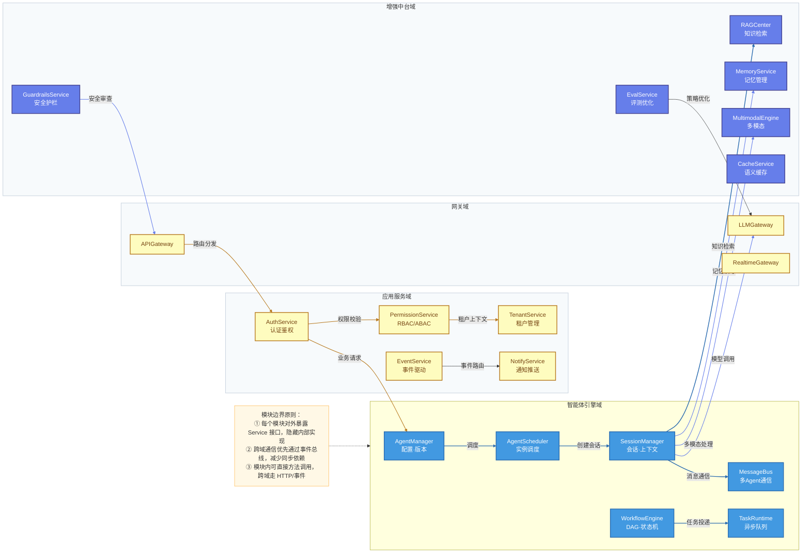
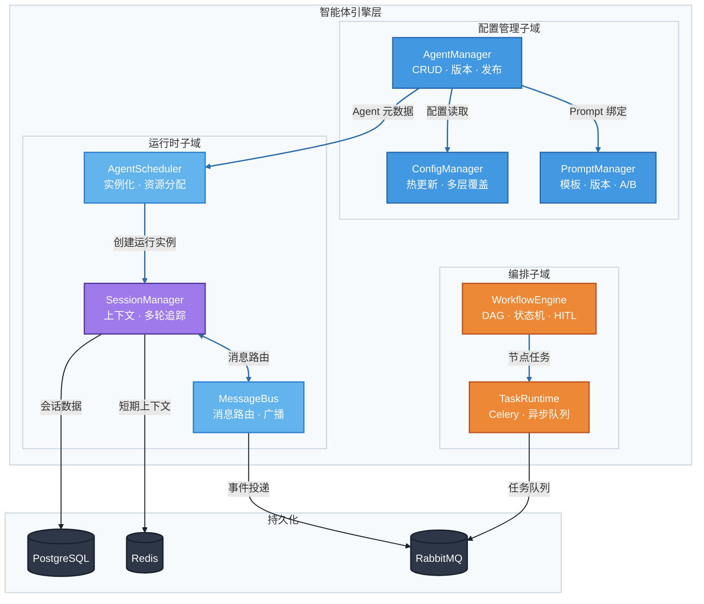
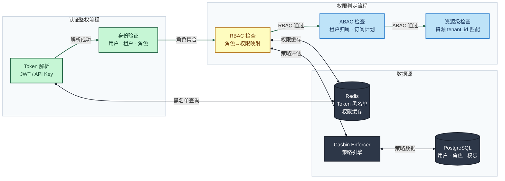
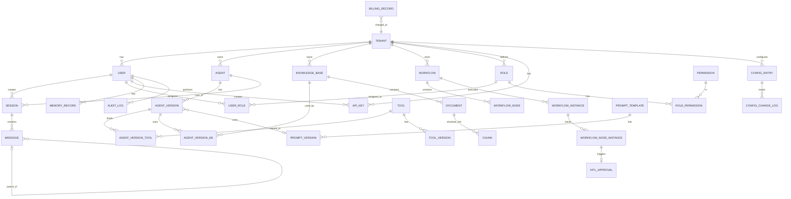
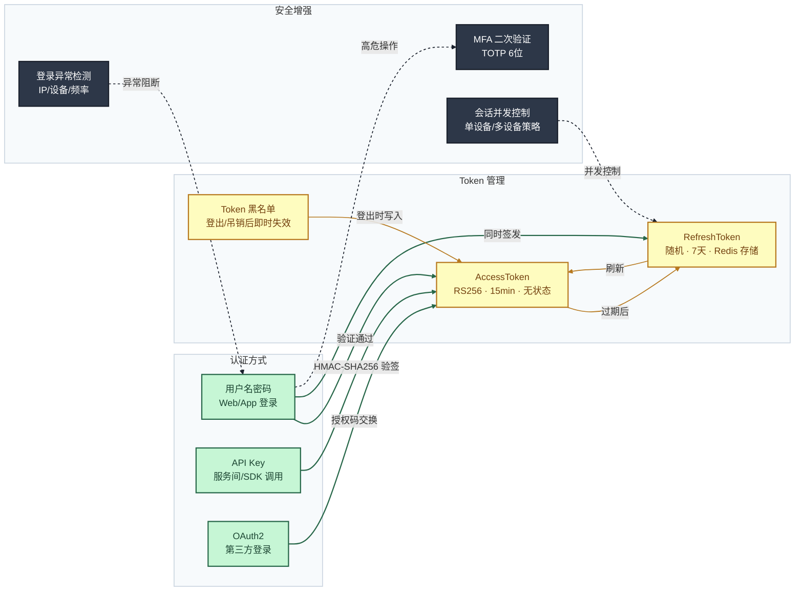
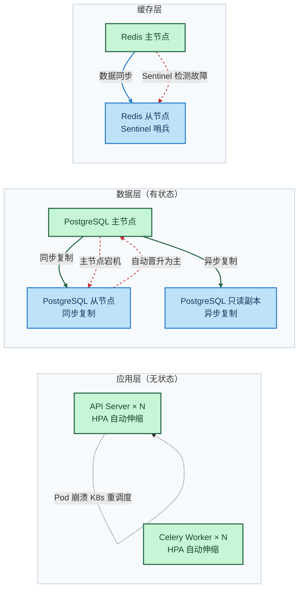
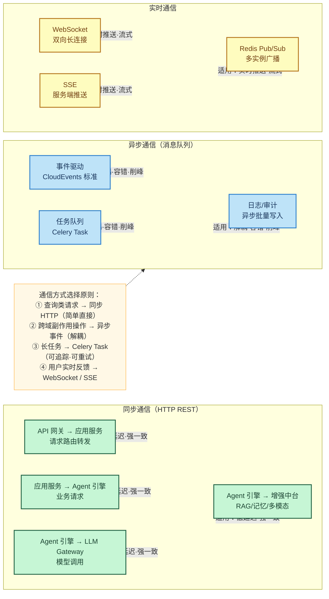
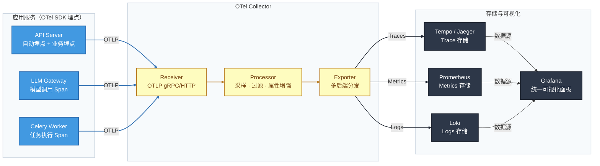

# 智能体平台后端架构设计文档（勘误与补全版）

> **版本**：v2.0 | **日期**：2026-03-17 | **基准**：基于 v1.3 初稿进行勘误与补全
>
> **定位**：本文档不修改初稿内容，而是以架构师视角对初稿进行系统性审查，补充遗漏设计、修正潜在问题、细化落地方案。所有补全内容可直接与初稿合并使用。

---

## 〇、初稿勘误摘要

在正式展开补全内容之前，先汇总初稿中识别到的待修正/待澄清事项，便于团队对照处理。

| 编号 | 所在章节 | 问题类型 | 问题描述 | 修正建议 |
|------|----------|----------|----------|----------|
| E-01 | 三、整体架构 | 缺失 | 未明确架构风格定性（模块化单体 vs 微服务），各层边界描述偏概念化 | 补充架构风格说明与各层调用约束（见第 1 章） |
| E-02 | 十、数据模型 | 设计风险 | `agent_versions.tool_ids UUID[]` 和 `knowledge_base_ids UUID[]` 使用 PostgreSQL 数组存储多对多关系，无法建立外键约束，级联删除/更新需业务层自行处理 | 建议引入 `agent_version_tools` 和 `agent_version_knowledge_bases` 关联表，保持引用完整性（见第 4 章） |
| E-03 | 十、数据模型 | 缺失 | 缺少系统级索引设计原则和分区策略统一说明，各表索引建议分散在表后注释中 | 补充统一索引设计原则章节（见第 4 章） |
| E-04 | 十一、API 规范 | 不完整 | 缺少请求幂等性实现方案、批量接口分页游标方案、限流响应头规范等细节 | 补充幂等性与分页设计（见第 3 章） |
| E-05 | 五、LLM Gateway | 潜在问题 | 流式响应场景下，后置输出安全审查（PII 脱敏）在流式 Chunk 已推送后执行，可能导致敏感信息先到达客户端再被过滤 | 建议改为流中实时审查：每个 Chunk 经过安全检查后再透传，延迟增加约 5-10ms（见第 5 章） |
| E-06 | 六、技术栈 | 遗漏 | 缺少 Python 版本、依赖管理工具（uv/poetry）、代码质量工具链的版本约束 | 补充技术栈版本矩阵（见第 1 章） |
| E-07 | 四.5 运行层 | 耦合风险 | Agent Manager 同时承担生命周期管理和实例调度两个职责，随智能体类型增多可能成为瓶颈 | 建议将实例调度独立为 Agent Scheduler 子模块，Agent Manager 专注配置与版本管理（见第 2 章） |
| E-08 | 十四、部署 | 缺失 | 缺少本地开发环境一键启动方案的具体 Docker Compose 编排说明 | 补充开发环境编排设计（见第 9 章） |
| E-09 | 十、数据模型 | 缺失 | `messages` 表缺少 `parent_message_id` 字段，无法支持消息树结构（分支对话/重试回溯） | 建议增加 `parent_message_id UUID FK NULLABLE`（见第 4 章） |
| E-10 | 五.2 RAG Center | 缺失 | 离线构建链路缺少增量更新机制，每次文档变更均全量重建索引，大规模知识库下不可行 | 建议补充增量索引方案（见第 2 章） |

---

## 一、整体架构设计

### 1.1 架构风格定性

**MVP 阶段采用「模块化单体」架构，生产阶段按域拆分为「有限微服务」。**

| 阶段 | 架构风格 | 部署方式 | 核心理由 |
|------|----------|----------|----------|
| MVP（第 1-2 周） | 模块化单体 | 单进程 FastAPI + Celery Worker | 减少分布式复杂度，快速验证核心链路 |
| 增强期（第 3-4 周） | 模块化单体 + 独立 LLM Gateway | API Server + LLM Gateway + Worker | LLM Gateway 流量模型独特，最先拆出 |
| 生产期（第 5-6 周+） | 有限微服务（5-7 个服务） | Kubernetes 多 Deployment | 按团队边界和伸缩需求拆分，避免过度微服务化 |

> **决策依据**：团队规模预估 3-5 人后端，过度微服务化将拖慢迭代速度。模块化单体通过 Python 包边界实现逻辑隔离，待某模块成为性能/部署瓶颈时再物理拆分。

### 1.2 系统分层架构图

```mermaid
flowchart TB
    %% 样式定义
    classDef accessStyle fill:#e2e8f0,stroke:#718096,stroke-width:2px,color:#2d3748
    classDef gwStyle fill:#c6f6d5,stroke:#276749,stroke-width:2px,color:#1c4532
    classDef bizStyle fill:#fefcbf,stroke:#b7791f,stroke-width:2px,color:#744210
    classDef agentStyle fill:#4299e1,stroke:#2b6cb0,stroke-width:2px,color:#fff
    classDef enhStyle fill:#667eea,stroke:#434190,stroke-width:2px,color:#fff
    classDef infraStyle fill:#2d3748,stroke:#1a202c,stroke-width:2px,color:#fff
    classDef govStyle fill:#ed8936,stroke:#c05621,stroke-width:2px,color:#fff
    classDef subgraphStyle fill:#f7fafc,stroke:#cbd5e0,stroke-width:1.5px
    classDef noteStyle fill:#fff8e6,stroke:#ffb74d,stroke-width:1px

    %% ── 接入层 ──────────────────────────────────────────
    subgraph L1["接入层（流量入口）"]
        A1[Web / Mobile]:::accessStyle
        A2[OpenAPI / SDK]:::accessStyle
        A3[Webhook / IM Bot]:::accessStyle
    end
    class L1 subgraphStyle

    %% ── 网关层 ──────────────────────────────────────────
    subgraph L2["网关层（统一治理）"]
        G1[API Gateway<br/>鉴权 · 限流 · 路由 · 熔断]:::gwStyle
        G2[LLM Gateway<br/>模型路由 · 配额 · 计费 · 降级]:::gwStyle
        G3[Realtime Gateway<br/>WebSocket · SSE · 多端同步]:::gwStyle
    end
    class L2 subgraphStyle

    %% ── 应用服务层 ─────────────────────────────────────
    subgraph L3["应用服务层（业务编排）"]
        S1[业务编排服务]:::bizStyle
        S2[权限服务<br/>RBAC + ABAC]:::bizStyle
        S3[租户与组织中心]:::bizStyle
        S4[事件服务]:::bizStyle
        S5[通知服务]:::bizStyle
    end
    class L3 subgraphStyle

    %% ── 智能体引擎层 ──────────────────────────────────
    subgraph L4["智能体引擎层（AgentScope 核心）"]
        R1[Agent Manager<br/>生命周期 · 版本]:::agentStyle
        R2[Agent Scheduler<br/>实例调度 · 扩缩]:::agentStyle
        R3[Session Manager<br/>会话 · 上下文]:::agentStyle
        R4[Message Bus<br/>多 Agent 通信]:::agentStyle
        R5[Workflow Engine<br/>DAG · 状态机 · HITL]:::agentStyle
        R6[Task Runtime<br/>异步队列 · 重试 · 死信]:::agentStyle
    end
    class L4 subgraphStyle

    %% ── 增强中台层 ─────────────────────────────────────
    subgraph L5["增强中台层（能力复用）"]
        E1[RAG Center<br/>索引 · 检索 · 重排]:::enhStyle
        E2[Memory Service<br/>短期 · 长期 · 情节]:::enhStyle
        E3[Multimodal Engine<br/>ASR · TTS · OCR · VLM]:::enhStyle
        E4[Eval & Optimize<br/>评测 · 反馈 · 优化闭环]:::enhStyle
        E5[Guardrails<br/>内容安全 · 策略 · 审计]:::enhStyle
        E6[Cache Layer<br/>语义缓存 · 工具缓存]:::enhStyle
    end
    class L5 subgraphStyle

    %% ── 基础设施层 ─────────────────────────────────────
    subgraph L6["基础设施层（存储 · 中间件）"]
        I1[PostgreSQL<br/>事务数据]:::infraStyle
        I2[pgvector / Milvus<br/>向量索引]:::infraStyle
        I3[Redis<br/>缓存 · 限流 · 会话]:::infraStyle
        I4[RabbitMQ / Kafka<br/>事件总线]:::infraStyle
        I5[MinIO / S3<br/>对象存储]:::infraStyle
        I6[Elasticsearch<br/>全文检索 · 日志]:::infraStyle
    end
    class L6 subgraphStyle

    %% ── 治理层（横向贯穿）─────────────────────────────
    subgraph L7["治理与可观测层（横向贯穿）"]
        V1[Metrics · Logs · Trace<br/>Prometheus + Loki + OTel]:::govStyle
        V2[SRE 基线<br/>SLO · Error Budget · 演练]:::govStyle
        V3[数据治理<br/>血缘 · 保留 · 合规]:::govStyle
        V4[安全合规<br/>KMS · TLS · PII 脱敏]:::govStyle
    end
    class L7 subgraphStyle

    %% ── 主链路连接 ─────────────────────────────────────
    A1 & A2 & A3 -->|HTTPS| G1
    G1 -->|API 路由| S1
    G1 -->|模型调用转发| G2
    G1 -->|实时连接| G3
    S1 <-->|权限校验| S2
    S1 <-->|租户上下文| S3
    S1 -->|事件发布| S4
    S4 -->|推送触发| S5
    S1 -->|业务请求| R1
    R1 -->|调度实例| R2
    R2 -->|创建 Agent| R3
    R4 -->|消息路由| R3
    R5 -->|节点投递| R6
    R3 <-->|知识增强| E1
    R3 <-->|记忆读写| E2
    R3 -->|多模态| E3
    E5 -->|安全拦截| G1
    E4 -->|策略优化| G2
    G2 -->|模型调用| L6
    E1 & E2 -->|向量检索| I2
    R3 & R1 -->|数据持久化| I1
    R4 & S4 -->|事件投递| I4
    E6 <-->|缓存读写| I3
    G3 -->|实时推送| A1

    %% 治理层虚线
    V1 -.->|全平台监控| L4
    V4 -.->|安全策略| L6

    %% 注释
    Note["层间调用约束：<br/>① 上层可调用下层，禁止下层反向调用上层<br/>② 同层模块间通过事件总线解耦，禁止直接依赖<br/>③ 治理层横向贯穿，任何层均可接入<br/>④ 增强中台层对上提供标准接口，对下屏蔽实现"]:::noteStyle
    Note -.-> L6

    linkStyle 0,1,2 stroke:#718096,stroke-width:2px
    linkStyle 3,4,5 stroke:#276749,stroke-width:2px
    linkStyle 6,7,8,9,10 stroke:#b7791f,stroke-width:1.5px
    linkStyle 11,12,13,14,15 stroke:#2b6cb0,stroke-width:2px
    linkStyle 16,17,18,19 stroke:#667eea,stroke-width:1.5px
```



### 1.3 各层职责与调用约束

| 层级 | 职责定义 | 可调用 | 禁止调用 |
|------|----------|--------|----------|
| **接入层** | 承接外部流量，协议适配 | 网关层 | 其他任何层 |
| **网关层** | 统一鉴权、限流、路由、协议转换 | 应用服务层、基础设施层（Redis 限流） | 智能体引擎层（必须经过应用服务层） |
| **应用服务层** | 业务编排、权限校验、租户隔离、事件分发 | 智能体引擎层、增强中台层、基础设施层 | 网关层、接入层 |
| **智能体引擎层** | Agent 生命周期管理、消息路由、工作流调度 | 增强中台层、基础设施层 | 应用服务层、网关层 |
| **增强中台层** | RAG/记忆/多模态/评测/安全/缓存中台化能力 | 基础设施层 | 智能体引擎层（通过回调/事件反向通知） |
| **基础设施层** | 数据持久化、消息投递、文件存储 | 无（被动提供服务） | 所有上层 |
| **治理层** | 可观测性、SRE、数据治理、安全合规 | 横向贯穿所有层（采集/策略注入） | — |

### 1.4 技术栈版本矩阵

> 初稿 E-06 勘误补全：明确版本约束，避免团队成员各自选型产生兼容问题。

| 类别 | 技术 | 版本约束 | 说明 |
|------|------|----------|------|
| **语言运行时** | Python | 3.11+ | 性能提升明显，asyncio 改进，`tomllib` 内置 |
| **Web 框架** | FastAPI | 0.115+ | 异步原生，Pydantic v2 集成 |
| **数据校验** | Pydantic | v2.6+ | 性能较 v1 提升 5-50x |
| **ORM** | SQLAlchemy | 2.0+ | 类型安全 + 异步 Session |
| **迁移工具** | Alembic | 1.13+ | 配合 SQLAlchemy 2.0 |
| **异步任务** | Celery | 5.4+ | 配合 Redis/RabbitMQ |
| **依赖管理** | uv | 0.5+ | 速度远快于 pip/poetry，lockfile 支持 |
| **代码格式化** | Ruff | 0.8+ | Lint + Format 一体化 |
| **类型检查** | Mypy | 1.11+ | strict 模式 |
| **测试框架** | pytest | 8.0+ | pytest-asyncio 配合异步测试 |
| **数据库** | PostgreSQL | 16+ | RLS、JSON 性能、逻辑复制 |
| **向量扩展** | pgvector | 0.7+ | HNSW 索引支持 |
| **缓存** | Redis | 7.2+ | Function、Stream 改进 |
| **消息队列** | RabbitMQ | 3.13+（MVP） | Quorum Queue 支持 |
| **对象存储** | MinIO | 最新稳定版 | S3 兼容 API |

---

## 二、分模块架构设计

### 2.1 模块总览与依赖关系图



### 2.2 智能体引擎域（核心域）

#### 模块职责

| 模块 | 职责 | 核心接口（输入 → 输出） |
|------|------|------------------------|
| **AgentManager** | Agent 配置管理、版本发布、元数据 CRUD | `create_agent(config) → Agent` / `publish_version(agent_id, version_id) → AgentVersion` |
| **AgentScheduler** | Agent 实例调度、资源分配、扩缩容（从 AgentManager 拆出，修正 E-07） | `schedule(agent_id, session_id) → AgentInstance` / `scale(agent_id, replicas)` |
| **SessionManager** | 会话创建/恢复、上下文组装、消息持久化 | `create_session(user, agent) → Session` / `get_context(session_id) → Context` |
| **MessageBus** | 多 Agent 间消息路由、广播、请求-响应模式 | `publish(topic, message)` / `subscribe(topic, handler)` |
| **WorkflowEngine** | DAG 定义、状态机驱动、HITL 暂停/恢复、补偿事务 | `execute(workflow_id, input) → WorkflowInstance` / `resume(instance_id, decision)` |
| **TaskRuntime** | 异步长任务队列、优先级调度、重试策略、死信处理 | `submit(task) → job_id` / `get_status(job_id) → JobStatus` |

#### 模块内部架构图



### 2.3 增强中台域

#### RAG Center 增量索引方案（E-10 补全）

初稿仅描述了全量索引构建链路，在文档频繁更新场景下全量重建不可行。补充增量索引方案：

```
文档变更检测
  → 变更类型判定：
      ├─ [新增文档] → 执行切片 + 向量化 → 增量写入向量库
      ├─ [更新文档] → 差异对比（内容哈希比对）
      │     ├─ 未变化 → 跳过
      │     └─ 有变化 → 删除旧向量 → 重新切片 + 向量化 → 写入
      └─ [删除文档] → 按 document_id 批量删除向量
  → 更新 documents 表状态为 indexed
  → 更新 knowledge_bases 表计数器
```

| 策略 | 触发时机 | 适用场景 |
|------|----------|----------|
| 增量索引 | 单文档上传/更新/删除 | 日常维护，延迟 < 30s |
| 批量增量 | 批量上传（> 10 篇） | 初始化导入，后台任务 |
| 全量重建 | 切片策略变更 / 嵌入模型升级 | 管理员手动触发 |

#### 各中台模块接口规范

| 中台模块 | 核心接口 | 输入 | 输出 |
|----------|----------|------|------|
| **RAG Center** | `retrieve(query, kb_ids, top_k)` | 查询文本 + 知识库范围 + 参数 | `[{chunk, score, source, metadata}]` |
| **Memory Service** | `recall(user_id, agent_id, context)` | 用户 + Agent + 当前上下文 | `{short_term, long_term, episodic}` |
| **Memory Service** | `memorize(user_id, record)` | 用户 + 记忆内容 | `memory_id` |
| **Multimodal** | `process(input, modality)` | 原始输入 + 模态类型 | `StructuredOutput` |
| **Guardrails** | `check_input(content)` | 用户输入内容 | `{safe: bool, violations: [], sanitized}` |
| **Guardrails** | `check_output(content)` | 模型输出内容 | `{safe: bool, violations: [], filtered}` |
| **Cache** | `get_or_compute(key, compute_fn)` | 缓存键 + 计算函数 | 缓存命中返回结果 / 未命中执行计算 |
| **Eval** | `evaluate(session_id, metrics)` | 会话 + 评估维度 | `{scores: {}, recommendations: []}` |

### 2.4 应用服务域

#### 权限校验模块内部架构



### 2.5 LLM Gateway 域

> 初稿 E-05 勘误：流式输出安全审查方案修正

**问题**：初稿中后置输出安全审查（PII 脱敏）在流式 Chunk 全部到达后才执行，存在敏感信息先到达客户端的风险。

**修正方案**：流中实时审查

```
模型返回 Chunk
  → 安全审查缓冲区（缓冲 3-5 个 Chunk，约 50-100 Token）
  → Guardrails 实时扫描缓冲区内容
      ├─ 通过 → 释放缓冲区，透传至客户端
      └─ 命中 → 脱敏/替换后释放，标记安全事件
  → 流结束后，执行最终完整性审查
```

**性能影响**：首 Token 延迟增加约 50-80ms（缓冲 3 个 Chunk 的时间），后续 Chunk 透传延迟 < 5ms（异步扫描不阻塞主路径），可接受。

---

## 三、API 设计规范

### 3.1 接口风格与 URL 规范

初稿已有良好覆盖，此处补充初稿未涉及的细节。

#### URL 命名补充规范

| 规范项 | 正确示例 | 错误示例 | 说明 |
|--------|----------|----------|------|
| 资源名使用复数 | `/api/v1/agents` | `/api/v1/agent` | RESTful 惯例 |
| 连字符分隔 | `/knowledge-bases` | `/knowledge_bases` | URL 使用连字符，代码使用下划线 |
| 最多 2 层嵌套 | `/agents/{id}/versions` | `/tenants/{tid}/agents/{aid}/versions/{vid}/nodes` | 超过 2 层使用查询参数或独立资源 |
| 动作用 POST | `POST /agents/{id}/publish` | `PUT /agents/{id}/publish` | 非 CRUD 操作统一 POST |
| 批量操作 | `POST /agents/batch-delete` | `DELETE /agents?ids=1,2,3` | 批量操作用 batch- 前缀 POST |

### 3.2 幂等性设计（E-04 补全）

初稿提到了 `X-Idempotency-Key` 请求头但未说明实现方案，此处补全。

#### 幂等性实现机制

```
客户端发送请求（携带 X-Idempotency-Key: {uuid}）
  → API Gateway 查询 Redis: idempotent:{tenant_id}:{key}
      ├─ 命中且状态为 completed → 直接返回缓存的响应（不执行业务逻辑）
      ├─ 命中且状态为 processing → 返回 409 Conflict（请求正在处理中）
      └─ 未命中 → 写入 Redis（status=processing, TTL=24h）
           → 执行业务逻辑
           → 成功 → 更新 Redis（status=completed, response=xxx）
           → 失败 → 删除 Redis Key（允许重试）
  → 返回响应
```

| 接口类型 | 是否要求幂等 Key | 说明 |
|----------|-----------------|------|
| `POST`（创建资源） | 推荐 | 防止网络抖动导致重复创建 |
| `PUT`（全量更新） | 天然幂等 | 同一请求多次执行结果一致 |
| `DELETE` | 天然幂等 | 删除已删除的资源返回 204 |
| `POST`（动作操作如 `/publish`） | 必须 | 发布/执行类操作必须防重 |
| `GET` | 不需要 | 只读操作 |

### 3.3 分页设计（E-04 补全）

平台同时支持**偏移分页**（适合管理后台列表）和**游标分页**（适合消息流/时间线）。

#### 偏移分页（Offset Pagination）

```
GET /api/v1/agents?page=2&page_size=20&sort=-created_at
```

响应：
```json
{
  "code": 0,
  "data": {
    "items": [],
    "total": 256,
    "page": 2,
    "page_size": 20,
    "has_more": true
  }
}
```

> **适用场景**：Agent 列表、用户列表、工作流列表等总量可控的管理类数据。

#### 游标分页（Cursor Pagination）

```
GET /api/v1/sessions/{id}/messages?cursor=eyJ0IjoiMjAyNi0wMy0xM1QxMDowMDowMFoiLCJpIjoiYWJjMTIzIn0&limit=50&direction=backward
```

响应：
```json
{
  "code": 0,
  "data": {
    "items": [],
    "next_cursor": "eyJ0IjoiMjAyNi0wMy0xM1QwOTozMDowMFoiLCJpIjoieHl6Nzg5In0",
    "has_more": true
  }
}
```

> **适用场景**：消息列表、审计日志、计费记录等高频写入的时序数据。游标基于 `(created_at, id)` 复合键编码（Base64），避免偏移分页在大数据集下的性能退化。

### 3.4 限流响应头规范（E-04 补全）

所有经过限流检查的响应均携带以下标准头：

| 响应头 | 说明 | 示例 |
|--------|------|------|
| `X-RateLimit-Limit` | 当前窗口限流上限 | `100` |
| `X-RateLimit-Remaining` | 当前窗口剩余次数 | `67` |
| `X-RateLimit-Reset` | 窗口重置时间戳（Unix） | `1710360000` |
| `Retry-After` | 被限流时，建议等待秒数 | `30` |
| `X-Quota-Limit` | 配额上限（日/月） | `1000000` |
| `X-Quota-Remaining` | 配额剩余量 | `750000` |
| `X-Quota-Reset` | 配额重置时间戳 | `1711929600` |

### 3.5 统一错误响应增强

初稿已定义错误码体系，此处补充错误响应的国际化和错误链路追踪规范。

```json
{
  "code": 50001,
  "message": "模型调用超时",
  "message_en": "LLM call timeout",
  "details": [
    {
      "model": "gpt-4o",
      "latency_ms": 30500,
      "timeout_ms": 30000,
      "fallback_attempted": true,
      "fallback_model": "claude-3-5-sonnet"
    }
  ],
  "doc_url": "https://docs.platform.com/errors/50001",
  "request_id": "req_550e8400-e29b-41d4",
  "trace_id": "trace_7b3c2d1e-8f4a-5b6c",
  "timestamp": "2026-03-17T10:00:00Z"
}
```

**增强点**：
- `message_en`：支持 `Accept-Language` 多语言错误提示
- `doc_url`：每个错误码关联文档链接，便于开发者自助排查
- `trace_id`：关联 OpenTelemetry Trace ID，运维可直接查询全链路日志

---

## 四、数据库设计

### 4.1 核心 ER 图增强版

> E-02 勘误：引入关联表替代数组字段；E-09 勘误：messages 增加 parent_message_id



### 4.2 勘误表结构补全

#### Agent 版本-工具关联表 `agent_version_tools`（E-02 新增）

替代 `agent_versions.tool_ids UUID[]`，提供外键约束保障。

| 字段名 | 类型 | 说明 |
|--------|------|------|
| `agent_version_id` | UUID FK | 关联 Agent 版本 |
| `tool_id` | UUID FK | 关联工具 |
| `sort_order` | INT | 排列顺序（影响 Function Calling 列表顺序） |
| **PK** | | `(agent_version_id, tool_id)` 联合主键 |

#### Agent 版本-知识库关联表 `agent_version_knowledge_bases`（E-02 新增）

| 字段名 | 类型 | 说明 |
|--------|------|------|
| `agent_version_id` | UUID FK | 关联 Agent 版本 |
| `knowledge_base_id` | UUID FK | 关联知识库 |
| `retrieval_priority` | INT | 检索优先级（多知识库按此排序检索） |
| **PK** | | `(agent_version_id, knowledge_base_id)` 联合主键 |

#### Messages 表增加 parent_message_id（E-09 修正）

在初稿 `messages` 表基础上新增：

| 字段名 | 类型 | 说明 |
|--------|------|------|
| `parent_message_id` | UUID FK NULLABLE | 父消息 ID，支持分支对话（重试/编辑后重新生成） |
| `generation_index` | INT DEFAULT 0 | 同一父消息下的生成序号（多次重试区分） |

> 当用户编辑历史消息重新生成时，新消息的 `parent_message_id` 指向被编辑的消息，`generation_index` 递增。前端通过消息树结构展示对话分支。

### 4.3 索引设计原则（E-03 补全）

#### 通用索引规范

| 原则 | 说明 | 示例 |
|------|------|------|
| **租户隔离索引** | 所有面向租户查询的表，`tenant_id` 必须出现在复合索引首位 | `INDEX idx_agents_tenant_status ON agents(tenant_id, status)` |
| **时序数据索引** | 时间序列查询使用 `(tenant_id, created_at DESC)` 复合索引 | `INDEX idx_messages_session_time ON messages(session_id, created_at DESC)` |
| **唯一约束索引** | 业务唯一性通过唯一索引保障，不依赖应用层检查 | `UNIQUE(tenant_id, slug)` on tenants |
| **部分索引** | 高选择性过滤条件使用部分索引，减少索引体积 | `INDEX idx_jobs_pending ON background_jobs(tenant_id, created_at) WHERE status = 'pending'` |
| **向量索引** | `embedding` 字段使用 HNSW 索引（优先）或 IVFFlat | `CREATE INDEX idx_chunks_embedding ON chunks USING hnsw(embedding vector_cosine_ops)` |
| **避免过度索引** | 每表索引数量建议 ≤ 6 个，写入密集型表（如 audit_logs）≤ 4 个 | — |

#### 分区策略

| 表 | 分区方式 | 分区键 | 保留策略 |
|------|----------|--------|----------|
| `audit_logs` | RANGE（按月） | `created_at` | 在线 12 个月 → 归档至对象存储 → 高危日志保留 3 年 |
| `billing_records` | RANGE（按月） | `timestamp` | 在线 6 个月 → 归档 → 保留 5 年 |
| `messages` | RANGE（按月） | `created_at` | 在线 6 个月 → 归档 → 用户可导出 |
| `tenant_quota_usage` | RANGE（按月） | `period_start` | 在线 3 个月 → 归档 |

### 4.4 数据迁移方案

#### Alembic 迁移执行流程

```
开发阶段：
  ① 开发者修改 SQLAlchemy Model
  ② 运行 alembic revision --autogenerate -m "add_xxx_table"
  ③ 审查生成的迁移脚本，确认 upgrade() 和 downgrade() 正确
  ④ 本地运行 alembic upgrade head 验证
  ⑤ 提交迁移文件至 Git（与 Model 变更同一 PR）

Staging 验证：
  ⑥ CI 自动在 Staging 执行 alembic upgrade head
  ⑦ 验证 downgrade 可逆：alembic downgrade -1
  ⑧ E2E 测试通过后标记迁移为已验证

生产执行：
  ⑨ 确认 RDS 自动备份可用（或手动快照）
  ⑩ 低峰期执行 alembic upgrade head
  ⑪ 大表 DDL 使用 CREATE INDEX CONCURRENTLY，避免锁表
  ⑫ 记录执行结果至变更工单
```

#### 不兼容变更的安全迁移模式

```
场景：需要将 agents.type 从 VARCHAR 改为 ENUM

阶段一（向后兼容）：
  → 新增 agents.type_new ENUM 列（允许 NULL）
  → 应用层双写 type 和 type_new

阶段二（数据迁移）：
  → 后台任务批量回填 type_new（每批 1000 行，sleep 100ms）
  → 验证数据一致性

阶段三（切换读取）：
  → 应用层改为读 type_new，仍双写
  → 监控验证无异常

阶段四（清理）：
  → 下个版本移除 type 列
  → 删除双写逻辑
```

---

## 五、安全设计

### 5.1 认证与授权方案

#### 认证机制全景



#### JWT Claims 标准结构

```json
{
  "sub": "user_uuid",
  "tid": "tenant_uuid",
  "roles": ["developer"],
  "plan": "pro",
  "iss": "agentplatform",
  "aud": "api",
  "iat": 1710660000,
  "exp": 1710660900,
  "jti": "unique_token_id"
}
```

> **关键安全设计**：
> - `jti` 用于登出后 Token 黑名单检查
> - `tid` 用于全链路租户上下文注入
> - `plan` 用于 ABAC 策略中的计划特性限制

### 5.2 数据加密策略

| 层级 | 加密方案 | 覆盖范围 |
|------|----------|----------|
| **传输层** | TLS 1.3（外部）/ mTLS（服务间） | 所有 HTTP/WebSocket 通信 |
| **存储层 — 字段级** | AES-256-GCM（通过 Vault Transit 引擎） | `password_hash`、`mfa_secret`、`api_key_hash`、Webhook `secret_hash` |
| **存储层 — 磁盘级** | PostgreSQL TDE / RDS 加密 | 全盘加密（静态数据保护） |
| **密钥管理** | HashiCorp Vault / 云 KMS | API Key、模型厂商凭证、加密密钥轮换 |
| **日志脱敏** | 自定义日志过滤器 | 日志中自动脱敏 `password`、`token`、`api_key` 等字段 |

### 5.3 接口安全

#### 限流策略分层

| 维度 | 算法 | 存储 | 配置示例 |
|------|------|------|----------|
| 全局 | 固定窗口 | Redis | 10,000 QPS（平台总容量保护） |
| 租户级 | 滑动窗口 | Redis | Free: 10 QPS / Pro: 100 QPS / Enterprise: 1000 QPS |
| 用户级 | 令牌桶 | Redis | 20 QPS / Burst 50 |
| 接口级 | 漏桶 | Redis | 高成本接口（如 `/llm/chat`）单独限流 |

#### 防重放攻击

```
请求签名方案（API Key 调用场景）：

签名串 = HTTP_METHOD + "\n"
       + CANONICAL_URI + "\n"
       + QUERY_STRING + "\n"
       + TIMESTAMP + "\n"
       + NONCE

Signature = HMAC-SHA256(api_secret, 签名串)

请求头携带：
  X-Timestamp: {unix_timestamp}     ← 与服务器时间差 > 5min 则拒绝
  X-Nonce: {uuid}                   ← Redis 存储已使用 Nonce（TTL 10min）
  X-Signature: {signature}
```

#### 参数校验规范

| 校验类型 | 实现方式 | 说明 |
|----------|----------|------|
| 类型校验 | Pydantic v2 Schema | 自动类型转换和校验 |
| 长度限制 | `Field(max_length=xxx)` | 防止超长输入 |
| 格式校验 | Pydantic Validator | UUID / Email / URL 格式 |
| 范围校验 | `Field(ge=0, le=100)` | 数值范围限制 |
| 白名单校验 | Literal / Enum | 枚举值限制 |
| SQL 注入防护 | SQLAlchemy 参数化查询 | 禁止字符串拼接 SQL |
| XSS 防护 | 输出编码 + CSP Header | 前端渲染安全 |

### 5.4 敏感数据处理规范

| 数据分级 | 示例 | 存储要求 | 日志要求 | 传输要求 |
|----------|------|----------|----------|----------|
| **L1 — 公开** | Agent 名称、文档标题 | 无特殊要求 | 可明文 | HTTPS |
| **L2 — 内部** | 用户名、邮箱 | 数据库 RLS 隔离 | 部分脱敏 | HTTPS |
| **L3 — 机密** | 会话内容、记忆数据 | 字段加密 + RLS | 完全脱敏 | TLS 1.3 |
| **L4 — 绝密** | 密码、API Key、模型厂商凭证 | Vault 托管 | 禁止出现 | mTLS |

---

## 六、非功能性需求

### 6.1 高可用设计

#### 故障转移方案



#### 健康检查机制

| 检查类型 | 端点 | 检查内容 | 超时 | 失败阈值 |
|----------|------|----------|------|----------|
| **Liveness** | `GET /healthz` | 进程存活 | 3s | 连续 3 次 → 重启 Pod |
| **Readiness** | `GET /readyz` | DB + Redis + MQ 连通性 | 5s | 连续 2 次 → 从负载均衡移除 |
| **Startup** | `GET /startupz` | 初始化完成（迁移/缓存预热） | 30s | 连续 10 次 → 放弃启动 |
| **Deep Health** | `GET /api/v1/health/deep` | 全部依赖详细状态 | 10s | 仅运维使用 |

`/readyz` 响应示例：
```json
{
  "status": "healthy",
  "checks": {
    "database": {"status": "up", "latency_ms": 2},
    "redis": {"status": "up", "latency_ms": 1},
    "rabbitmq": {"status": "up", "latency_ms": 3}
  },
  "version": "1.2.0",
  "uptime_seconds": 86400
}
```

### 6.2 可扩展性设计

#### 水平扩展策略

| 组件 | 扩展方式 | 扩展瓶颈 | 应对方案 |
|------|----------|----------|----------|
| API Server | 无状态多副本 + HPA | 无 | CPU/请求队列触发扩容 |
| LLM Gateway | 无状态多副本 + HPA | 下游模型厂商并发限制 | Key 池轮询 + 多厂商分流 |
| Celery Worker | 多副本 + 队列分组 | 任务倾斜（某类型任务堆积） | 按任务类型独立队列 + 独立 Worker 组 |
| PostgreSQL | 读写分离 + 只读副本 | 写入瓶颈 | 分区表 + 热表与冷表分离 |
| Redis | Redis Cluster | 热 Key | Key 分片 + 本地缓存兜底 |
| 向量库 | pgvector → Milvus 集群 | 数据量级 > 1000 万向量 | Milvus Partition + 分片 |

### 6.3 性能优化策略

#### 缓存策略矩阵

| 缓存对象 | 缓存类型 | TTL | 失效策略 | 缓存位置 |
|----------|----------|-----|----------|----------|
| 租户配置 | 读缓存 | 5min | 配置变更事件主动失效 | Redis + 本地内存 |
| 用户权限 | 读缓存 | 2min | 角色变更时主动失效 | Redis |
| 模型路由表 | 读缓存 | 1min | 配置变更事件失效 | 本地内存 |
| 语义缓存 | 计算缓存 | 1h | LRU 淘汰 | Redis（向量相似度匹配） |
| 工具结果缓存 | 计算缓存 | 按幂等性配置 | 工具定义变更时失效 | Redis |
| Session 上下文 | 会话缓存 | 随会话过期 | 会话结束清理 | Redis |

#### 异步处理策略

| 场景 | 同步/异步 | 实现方式 | 说明 |
|------|-----------|----------|------|
| 对话请求（非流式） | 同步 | FastAPI async handler | 30s 超时 |
| 对话请求（流式） | 异步流式 | SSE / WebSocket | 持续推送直到完成 |
| 文档上传处理 | 异步 | Celery Task → 轮询 Job 状态 | 返回 job_id |
| 知识库索引构建 | 异步 | Celery Task | 大任务分批次 |
| 审计日志写入 | 异步 | 消息队列 → 批量写入 | 不阻塞主请求 |
| 计费记录 | 异步 | Redis 预写 → 定时同步 DB | 实时性要求低 |

#### 数据库连接池配置

```python
# SQLAlchemy 异步连接池配置
SQLALCHEMY_POOL_CONFIG = {
    "pool_size": 20,              # 常驻连接数
    "max_overflow": 10,           # 突发额外连接数
    "pool_timeout": 30,           # 获取连接超时（秒）
    "pool_recycle": 1800,         # 连接回收周期（秒），防止数据库侧超时断开
    "pool_pre_ping": True,        # 使用前 ping 检测连接可用性
}
```

---

## 七、通信与集成

### 7.1 服务间通信方式



### 7.2 事件驱动设计

#### 事件拓扑架构

```mermaid
flowchart LR
    classDef producerStyle fill:#c6f6d5,stroke:#276749,stroke-width:2px,color:#1c4532
    classDef busStyle fill:#ffd700,stroke:#333,stroke-width:3px
    classDef consumerStyle fill:#bee3f8,stroke:#3182ce,stroke-width:2px,color:#1a365d
    classDef dlqStyle fill:#fed7d7,stroke:#c53030,stroke-width:2px,color:#742a2a
    classDef subgraphStyle fill:#f7fafc,stroke:#cbd5e0,stroke-width:1.5px

    subgraph producers["事件生产者"]
        P1[AgentManager<br/>agent.*]:::producerStyle
        P2[SessionManager<br/>session.*]:::producerStyle
        P3[WorkflowEngine<br/>workflow.*]:::producerStyle
        P4[LLMGateway<br/>llm.*]:::producerStyle
        P5[SecurityService<br/>security.*]:::producerStyle
    end
    class producers subgraphStyle

    EB[事件总线<br/>RabbitMQ / Kafka<br/>CloudEvents 标准]:::busStyle

    subgraph consumers["事件消费者"]
        C1[通知服务<br/>推送告警]:::consumerStyle
        C2[审计服务<br/>日志记录]:::consumerStyle
        C3[计费服务<br/>成本归因]:::consumerStyle
        C4[可观测性<br/>指标采集]:::consumerStyle
        C5[Webhook 分发<br/>外部回调]:::consumerStyle
    end
    class consumers subgraphStyle

    DLQ[死信队列<br/>3次重试后进入<br/>人工处理]:::dlqStyle

    P1 & P2 & P3 & P4 & P5 -->|发布事件| EB
    EB -->|订阅分发| C1 & C2 & C3 & C4 & C5
    EB -->|消费失败| DLQ

    linkStyle 0,1,2,3,4 stroke:#276749,stroke-width:2px
    linkStyle 5,6,7,8,9 stroke:#3182ce,stroke-width:1.5px
    linkStyle 10 stroke:#c53030,stroke-width:1.5px
```



#### 事件消费失败处理

```
消费失败
  → 第 1 次重试：延迟 1s
  → 第 2 次重试：延迟 5s
  → 第 3 次重试：延迟 30s
  → 仍失败 → 进入死信队列（DLQ）
       → 告警通知 On-Call 工程师
       → 人工排查后可：
           ├─ 修复后重放
           └─ 标记为已处理（跳过）
```

### 7.3 第三方服务集成方案

| 集成对象 | 集成方式 | 适配层 | 说明 |
|----------|----------|--------|------|
| LLM 厂商（OpenAI/Claude/…） | LLM Gateway 统一适配 | OpenAI 兼容协议 | 通过 LLM Gateway 路由，业务层无感 |
| 企业 IM（飞书/钉钉/Slack） | Webhook 双向 | 通知服务 + 事件服务 | 入站消息 → Agent 对话；出站 → 通知推送 |
| 邮件（SMTP/SendGrid） | 通知服务抽象层 | 可插拔 Provider | 统一 `EmailProvider` 接口 |
| 对象存储（MinIO/S3/OSS） | 存储适配层 | S3 兼容 API | 统一 `StorageProvider` 接口 |
| 密钥管理（Vault/云 KMS） | 安全基础设施层 | 统一 `SecretProvider` 接口 | 运行时动态获取密钥 |

---

## 八、可观测性设计

### 8.1 日志规范

#### 日志级别定义

| 级别 | 使用场景 | 示例 |
|------|----------|------|
| **ERROR** | 需要立即处理的异常，影响用户体验 | 数据库连接失败、LLM 调用超时 |
| **WARNING** | 潜在问题但不影响当前请求 | 配额使用率 > 80%、降级触发 |
| **INFO** | 关键业务事件，正常流程记录 | 会话创建、Agent 发布、用户登录 |
| **DEBUG** | 调试信息，生产环境默认关闭 | 请求参数详情、SQL 执行计划 |

#### 结构化日志格式

```json
{
  "timestamp": "2026-03-17T10:00:00.123Z",
  "level": "INFO",
  "logger": "app.services.agent_service",
  "message": "Agent published successfully",
  "request_id": "req_550e8400",
  "trace_id": "trace_7b3c2d1e",
  "span_id": "span_4a5b6c7d",
  "tenant_id": "tenant_abc123",
  "user_id": "user_xyz789",
  "agent_id": "agent_def456",
  "version": "1.2.0",
  "duration_ms": 45,
  "extra": {}
}
```

**强制字段**：`timestamp` · `level` · `logger` · `message` · `request_id` · `tenant_id`

**自动注入机制**：通过 FastAPI 中间件在请求开始时将 `request_id`、`tenant_id`、`user_id` 注入 Python `contextvars`，日志 Formatter 自动提取，开发者无需手动传递。

### 8.2 监控指标

#### 系统指标（基础设施）

| 指标 | 采集方式 | 告警阈值 |
|------|----------|----------|
| CPU 使用率 | cAdvisor / Node Exporter | > 80% 持续 5min |
| 内存使用率 | cAdvisor | > 85% 持续 3min |
| 磁盘使用率 | Node Exporter | > 85% |
| Pod 重启次数 | kube-state-metrics | > 3 次/小时 |
| 数据库连接池 | SQLAlchemy 指标 | 可用连接 < 5 |

#### 业务指标（平台特有）

| 指标 | 类型 | 标签维度 | 说明 |
|------|------|----------|------|
| `llm_call_total` | Counter | `tenant`, `model`, `status` | LLM 调用总数 |
| `llm_call_duration_seconds` | Histogram | `tenant`, `model` | LLM 调用延迟分布 |
| `llm_ttft_seconds` | Histogram | `tenant`, `model` | 首 Token 延迟 |
| `llm_tokens_total` | Counter | `tenant`, `model`, `direction(in/out)` | Token 消耗总量 |
| `llm_fallback_total` | Counter | `tenant`, `from_model`, `to_model` | 降级触发次数 |
| `rag_retrieval_duration_seconds` | Histogram | `tenant`, `kb_id` | RAG 检索延迟 |
| `rag_retrieval_score` | Histogram | `tenant` | 检索结果相关性分布 |
| `session_active_count` | Gauge | `tenant` | 活跃会话数 |
| `guardrails_block_total` | Counter | `tenant`, `stage(input/output)`, `reason` | 安全拦截次数 |
| `quota_usage_ratio` | Gauge | `tenant`, `metric_type` | 配额使用率 |

### 8.3 链路追踪方案

#### OpenTelemetry 集成架构



#### 关键链路 Span 定义

| Span 名称 | 所属服务 | 包含属性 |
|-----------|----------|----------|
| `http.request` | API Server | `http.method`, `http.url`, `http.status_code` |
| `auth.verify` | API Server | `auth.method`, `tenant.id`, `user.id` |
| `agent.invoke` | Agent Engine | `agent.id`, `agent.type`, `session.id` |
| `llm.call` | LLM Gateway | `llm.model`, `llm.tokens.in`, `llm.tokens.out`, `llm.ttft_ms` |
| `rag.retrieve` | RAG Center | `rag.kb_id`, `rag.top_k`, `rag.top_score` |
| `memory.recall` | Memory Service | `memory.type`, `memory.count` |
| `tool.execute` | Tool Runtime | `tool.name`, `tool.version`, `tool.duration_ms` |
| `guardrails.check` | Guardrails | `guardrails.stage`, `guardrails.passed`, `guardrails.violations` |

### 8.4 告警策略

| 告警级别 | 触发条件 | 通知渠道 | 响应时效 |
|----------|----------|----------|----------|
| **P0 Critical** | 服务完全不可用 / 数据丢失风险 | 电话 + IM + 邮件 | 5 分钟内响应 |
| **P1 High** | 核心功能严重降级 / SLO Burn Rate > 10x | IM + 邮件 | 15 分钟内响应 |
| **P2 Medium** | 非核心功能异常 / 配额预警 | IM | 1 小时内处理 |
| **P3 Low** | 性能轻微下降 / 非紧急告警 | 邮件 | 下个工作日处理 |

**告警抑制规则**：
- 同一告警 15 分钟内不重复发送
- P0 告警自动创建 On-Call 事件
- Error Budget 消耗 > 50% 时，自动冻结非关键变更

---

## 九、项目目录结构

### 9.1 完整目录树

```
AgentBasePlatform/
├── backend/                              # 后端服务
│   ├── app/
│   │   ├── __init__.py
│   │   ├── main.py                       # FastAPI 应用入口，注册路由/中间件/异常处理
│   │   │
│   │   ├── api/                          # API 路由层（Thin Controller）
│   │   │   ├── __init__.py
│   │   │   ├── deps.py                   # FastAPI Depends 依赖注入（DB Session/当前用户/租户上下文）
│   │   │   └── v1/
│   │   │       ├── __init__.py
│   │   │       ├── router.py             # v1 路由汇总注册
│   │   │       ├── auth.py               # 认证相关端点（login/refresh/logout/mfa/api-keys）
│   │   │       ├── users.py              # 用户管理端点
│   │   │       ├── agents.py             # 智能体管理端点
│   │   │       ├── sessions.py           # 会话与对话端点
│   │   │       ├── knowledge_bases.py    # 知识库管理端点
│   │   │       ├── workflows.py          # 工作流管理端点
│   │   │       ├── tools.py              # 工具管理端点
│   │   │       ├── llm.py                # LLM 调用与模型配置端点
│   │   │       ├── billing.py            # 计费与配额端点
│   │   │       ├── webhooks.py           # Webhook 管理端点
│   │   │       ├── configs.py            # 配置中心端点
│   │   │       ├── hitl.py               # HITL 审批端点
│   │   │       ├── jobs.py               # 异步任务状态查询端点
│   │   │       ├── audit.py              # 审计日志端点
│   │   │       └── health.py             # 健康检查端点（healthz/readyz/startupz）
│   │   │
│   │   ├── core/                         # 核心配置与基础设施
│   │   │   ├── __init__.py
│   │   │   ├── config.py                 # pydantic-settings 全局配置（从环境变量读取）
│   │   │   ├── security.py               # JWT 签发/验证、密码哈希、API Key 校验
│   │   │   ├── database.py               # SQLAlchemy 异步引擎/Session 工厂/事务管理
│   │   │   ├── redis.py                  # Redis 连接池管理
│   │   │   ├── events.py                 # 事件总线抽象（发布/订阅/CloudEvents 封装）
│   │   │   ├── exceptions.py             # 统一异常类定义（AppException 基类）
│   │   │   ├── middleware.py             # 中间件（请求 ID 注入/租户上下文/日志/CORS）
│   │   │   ├── logging.py               # 结构化日志配置（contextvars 自动注入）
│   │   │   └── telemetry.py             # OpenTelemetry 初始化（Trace/Metrics/Logs）
│   │   │
│   │   ├── models/                       # SQLAlchemy ORM 模型
│   │   │   ├── __init__.py
│   │   │   ├── base.py                   # Base Model（UUID PK/created_at/updated_at 公共字段）
│   │   │   ├── tenant.py                 # tenants / tenant_quota_usage
│   │   │   ├── user.py                   # users / user_roles / roles / permissions / role_permissions
│   │   │   ├── agent.py                  # agents / agent_versions / agent_version_tools / agent_version_kbs
│   │   │   ├── session.py                # sessions / messages
│   │   │   ├── knowledge.py              # knowledge_bases / documents / chunks
│   │   │   ├── workflow.py               # workflows / workflow_nodes / workflow_instances / workflow_node_instances
│   │   │   ├── tool.py                   # tools / tool_versions
│   │   │   ├── prompt.py                 # prompt_templates / prompt_versions
│   │   │   ├── memory.py                 # memory_records
│   │   │   ├── billing.py                # billing_records
│   │   │   ├── audit.py                  # audit_logs
│   │   │   ├── notification.py           # notifications
│   │   │   ├── config.py                 # config_entries / config_change_logs
│   │   │   ├── experiment.py             # experiments / experiment_assignments
│   │   │   ├── webhook.py                # webhook_configs
│   │   │   ├── hitl.py                   # hitl_approvals
│   │   │   ├── job.py                    # background_jobs
│   │   │   ├── api_key.py               # api_keys
│   │   │   └── llm_config.py            # llm_model_configs
│   │   │
│   │   ├── schemas/                      # Pydantic 请求/响应 Schema
│   │   │   ├── __init__.py
│   │   │   ├── common.py                 # 通用 Schema（分页/排序/响应包装）
│   │   │   ├── auth.py
│   │   │   ├── user.py
│   │   │   ├── agent.py
│   │   │   ├── session.py
│   │   │   ├── knowledge.py
│   │   │   ├── workflow.py
│   │   │   ├── tool.py
│   │   │   └── ...                       # 每个资源对应一个 Schema 文件
│   │   │
│   │   ├── services/                     # 业务逻辑层（核心业务编排）
│   │   │   ├── __init__.py
│   │   │   ├── auth_service.py           # 认证相关逻辑
│   │   │   ├── permission_service.py     # 权限检查逻辑（Casbin 集成）
│   │   │   ├── tenant_service.py         # 租户与配额管理
│   │   │   ├── agent_service.py          # 智能体 CRUD 与版本管理
│   │   │   ├── session_service.py        # 会话管理与消息处理
│   │   │   ├── rag_service.py            # RAG 检索逻辑
│   │   │   ├── memory_service.py         # 记忆读写逻辑
│   │   │   ├── workflow_service.py       # 工作流编排逻辑
│   │   │   ├── tool_service.py           # 工具管理与沙箱执行
│   │   │   ├── eval_service.py           # 评测与优化
│   │   │   ├── notification_service.py   # 通知推送逻辑
│   │   │   ├── config_service.py         # 配置中心逻辑
│   │   │   └── audit_service.py          # 审计日志逻辑
│   │   │
│   │   ├── gateway/                      # LLM Gateway 模块
│   │   │   ├── __init__.py
│   │   │   ├── router.py                 # 模型路由器（策略选型/负载均衡）
│   │   │   ├── provider.py               # 模型厂商适配器（OpenAI/Claude/...）
│   │   │   ├── limiter.py                # 限流器（令牌桶/滑动窗口）
│   │   │   ├── circuit_breaker.py        # 熔断器（三态状态机）
│   │   │   ├── billing.py                # 计费计量逻辑
│   │   │   └── stream_proxy.py           # 流式代理（SSE 透传/安全审查）
│   │   │
│   │   ├── engine/                       # 智能体引擎模块
│   │   │   ├── __init__.py
│   │   │   ├── agent_manager.py          # Agent 生命周期管理
│   │   │   ├── agent_scheduler.py        # Agent 实例调度（E-07 拆分）
│   │   │   ├── session_manager.py        # 会话上下文管理
│   │   │   ├── message_bus.py            # 多 Agent 消息路由
│   │   │   ├── workflow_engine.py        # DAG/状态机引擎
│   │   │   └── prompt_manager.py         # Prompt 模板与版本管理
│   │   │
│   │   ├── enhance/                      # 增强中台模块
│   │   │   ├── __init__.py
│   │   │   ├── rag/                      # RAG Center
│   │   │   │   ├── indexer.py            # 离线索引构建（全量/增量）
│   │   │   │   ├── retriever.py          # 在线检索（多路召回/重排）
│   │   │   │   └── chunker.py            # 文档切片器
│   │   │   ├── memory/                   # Memory Service
│   │   │   │   ├── store.py              # 记忆存储（Redis短期 + PG长期）
│   │   │   │   └── recall.py             # 记忆召回策略
│   │   │   ├── guardrails/               # Guardrails
│   │   │   │   ├── input_checker.py      # 输入安全审查
│   │   │   │   ├── output_checker.py     # 输出安全审查（含流式审查）
│   │   │   │   └── rules.py             # 审查规则配置
│   │   │   └── cache/                    # Cache Layer
│   │   │       ├── semantic_cache.py     # 语义缓存
│   │   │       └── tool_cache.py         # 工具结果缓存
│   │   │
│   │   ├── workers/                      # Celery 异步任务定义
│   │   │   ├── __init__.py
│   │   │   ├── celery_app.py             # Celery 应用配置
│   │   │   ├── document_tasks.py         # 文档处理任务（解析/切片/向量化）
│   │   │   ├── index_tasks.py            # 索引构建任务（全量/增量）
│   │   │   ├── export_tasks.py           # 数据导出任务（账单/审计日志）
│   │   │   ├── notification_tasks.py     # 通知发送任务（邮件/Webhook）
│   │   │   └── maintenance_tasks.py      # 维护任务（过期清理/配额同步）
│   │   │
│   │   └── utils/                        # 公共工具函数
│   │       ├── __init__.py
│   │       ├── pagination.py             # 分页工具（偏移/游标）
│   │       ├── idempotency.py            # 幂等性工具
│   │       ├── tenant_context.py         # 租户上下文管理（contextvars）
│   │       └── crypto.py                 # 加解密工具
│   │
│   ├── migrations/                       # Alembic 数据库迁移
│   │   ├── env.py
│   │   ├── alembic.ini
│   │   └── versions/                     # 迁移版本文件
│   │
│   ├── tests/
│   │   ├── conftest.py                   # 测试 Fixtures（DB/Redis/测试客户端）
│   │   ├── factories.py                  # 测试数据工厂（Factory Boy）
│   │   ├── unit/                         # 单元测试（Mock 外部依赖）
│   │   │   ├── test_agent_service.py
│   │   │   ├── test_permission_service.py
│   │   │   └── ...
│   │   ├── integration/                  # 集成测试（testcontainers）
│   │   │   ├── test_agent_api.py
│   │   │   ├── test_session_api.py
│   │   │   └── ...
│   │   └── e2e/                          # 端到端测试
│   │       └── test_chat_flow.py
│   │
│   ├── pyproject.toml                    # 项目配置（uv/ruff/mypy/pytest）
│   ├── uv.lock                           # 依赖锁文件
│   └── .env.example                      # 环境变量示例
│
├── frontend/                             # 前端应用（React + TypeScript + Vite）
│   ├── src/
│   │   ├── pages/
│   │   ├── components/
│   │   ├── stores/
│   │   ├── services/
│   │   ├── hooks/
│   │   └── types/
│   └── package.json
│
├── infra/                                # 基础设施即代码
│   ├── docker/
│   │   ├── Dockerfile.api                # API Server 镜像
│   │   ├── Dockerfile.worker             # Celery Worker 镜像
│   │   └── Dockerfile.frontend           # 前端构建镜像
│   ├── docker-compose.yml                # 本地开发环境（一键启动）
│   ├── docker-compose.test.yml           # 测试环境（CI 集成测试）
│   ├── k8s/                              # Kubernetes Manifests
│   │   ├── base/                         # Kustomize 基础配置
│   │   ├── overlays/
│   │   │   ├── dev/
│   │   │   ├── staging/
│   │   │   └── prod/
│   │   └── monitoring/                   # Prometheus/Grafana/Loki 配置
│   └── scripts/
│       ├── init_db.py                    # 初始化数据库（默认角色/权限/平台配置）
│       ├── seed_data.py                  # 开发环境种子数据
│       └── healthcheck.sh                # 健康检查脚本
│
├── docs/                                 # 项目文档
├── .github/                              # CI/CD 工作流
│   └── workflows/
│       ├── ci.yml                        # PR 检查（Lint/Test/Build）
│       ├── cd-staging.yml                # Staging 自动部署
│       └── cd-prod.yml                   # 生产金丝雀发布
├── .pre-commit-config.yaml               # Git Hooks 配置
├── Makefile                              # 常用命令快捷入口
└── README.md
```

### 9.2 各目录职责说明

| 目录 | 职责 | 关键规范 |
|------|------|----------|
| `api/v1/` | HTTP 请求入口，参数校验，调用 Service 层 | 不含业务逻辑，仅做参数转换与响应包装 |
| `core/` | 框架级基础设施，全局共用 | 不依赖任何 Service / Model |
| `models/` | 数据库表映射（SQLAlchemy ORM） | 一个文件对应一个业务域的表集合 |
| `schemas/` | API 请求/响应数据结构（Pydantic） | 与 ORM Model 分离，支持独立演进 |
| `services/` | 核心业务逻辑编排 | 通过依赖注入获取 DB Session，不直接操作 HTTP |
| `gateway/` | LLM Gateway 独立模块 | 未来可拆分为独立服务 |
| `engine/` | 智能体运行引擎 | 封装 AgentScope 交互逻辑 |
| `enhance/` | 增强中台能力 | 每个中台能力一个子包 |
| `workers/` | Celery 异步任务 | 任务函数仅做任务调度，业务逻辑委托 Service 层 |
| `utils/` | 无状态工具函数 | 不依赖 Service / Model |

### 9.3 Docker Compose 开发环境编排（E-08 补全）

```yaml
# docker-compose.yml（开发环境核心配置概要）
services:
  # 数据库
  postgres:
    image: pgvector/pgvector:pg16
    ports: ["5432:5432"]
    environment:
      POSTGRES_DB: agentplatform
      POSTGRES_USER: dev
      POSTGRES_PASSWORD: dev_password
    volumes:
      - pgdata:/var/lib/postgresql/data

  # 缓存
  redis:
    image: redis:7.2-alpine
    ports: ["6379:6379"]

  # 消息队列
  rabbitmq:
    image: rabbitmq:3.13-management
    ports: ["5672:5672", "15672:15672"]

  # 对象存储
  minio:
    image: minio/minio:latest
    ports: ["9000:9000", "9001:9001"]
    command: server /data --console-address ":9001"

  # API Server（热重载）
  api:
    build:
      context: ./backend
      dockerfile: ../infra/docker/Dockerfile.api
    ports: ["8000:8000"]
    volumes:
      - ./backend:/app
    command: uvicorn app.main:app --host 0.0.0.0 --reload
    depends_on: [postgres, redis, rabbitmq]

  # Celery Worker（热重载）
  worker:
    build:
      context: ./backend
      dockerfile: ../infra/docker/Dockerfile.worker
    volumes:
      - ./backend:/app
    command: celery -A app.workers.celery_app worker --loglevel=info
    depends_on: [postgres, redis, rabbitmq]
```

> **一键启动**：`make dev` → 执行 `docker compose up -d && alembic upgrade head && python scripts/init_db.py`

---

## 十、实施路线图

### 10.1 三阶段实施计划


### 10.2 各阶段详细交付物

#### 阶段一：MVP 最小闭环（第 1-2 周）

| 周次 | 交付物 | 验收标准 |
|------|--------|----------|
| W1 前半 | 项目脚手架搭建完成：FastAPI 框架、数据库连接、Alembic 迁移、Docker Compose | `make dev` 一键启动，`/healthz` 返回 200 |
| W1 后半 | 认证模块：JWT 登录/登出/刷新 + API Key 创建/验证 | 登录获取 Token → 访问受保护接口 → 登出 Token 失效 |
| W2 前半 | Agent 管理 + Chat Agent 对话：创建 Agent → 创建会话 → 发送消息 → 收到回复 | 完整 Chat 对话链路跑通 |
| W2 后半 | LLM Gateway MVP：鉴权 + 限流 + 单模型路由 + 计费记录 | 调用审计日志可查询，限流触发返回 429 |
| W2 | 基础可观测性：结构化日志 + 请求 Trace ID 贯穿 | 通过 request_id 可追踪完整请求链路 |

**里程碑 M1 验收**：端到端对话可用 — 用户登录 → 选择 Agent → 发送消息 → 收到 LLM 回复 → 审计日志记录完整。

#### 阶段二：能力增强（第 3-4 周）

| 周次 | 交付物 | 验收标准 |
|------|--------|----------|
| W3 前半 | 知识库管理 + RAG 离线索引构建 | 上传文档 → 自动切片 → 向量化入库 |
| W3 后半 | RAG 在线检索 + 对话集成 | Chat Agent 对话中自动检索知识库，回复附引用来源 |
| W3 | Memory Service（短期 + 长期） | 多轮对话上下文正确保持；关键信息跨会话可召回 |
| W4 前半 | SSE 流式输出 + WebSocket 实时通道 | 流式打字机效果正常，支持中断 |
| W4 后半 | Guardrails 安全审查 + 工作流 MVP | 违规输入被拦截；线性工作流可执行 |

**里程碑 M2 验收**：知识问答 + 流式可用 — RAG 知识问答准确率达到基准线，流式输出延迟 P95 < 800ms，安全审查生效。

#### 阶段三：生产就绪（第 5-6 周）

| 周次 | 交付物 | 验收标准 |
|------|--------|----------|
| W5 前半 | 多租户隔离（RLS + 配额 + 计费汇总） | 跨租户数据完全隔离，配额超限返回 429 |
| W5 后半 | 评测闭环 + A/B 实验框架 | 离线评测任务可运行，A/B 分流可配置 |
| W5 | HITL 审批 + 通知推送 | 工作流 HITL 节点暂停→审批→继续执行 |
| W6 前半 | 监控告警体系（Prometheus + Grafana + SLO） | 核心 SLO 告警规则就绪，Dashboard 可视化 |
| W6 后半 | 安全加固 + 灰度发布 + 生产部署文档 | MFA 可用，金丝雀发布脚本就绪 |

**里程碑 M3 验收**：生产可运营 — 多租户隔离验证通过，SLO 监控就绪，安全扫描无高危漏洞，灰度发布流程验证通过。

### 10.3 风险与缓解

| 风险 | 概率 | 影响 | 缓解措施 |
|------|------|------|----------|
| AgentScope 集成复杂度超预期 | 中 | 高 | 阶段一前期集中突破 AgentScope 集成，预留 2 天 Buffer |
| LLM 厂商 API 不稳定 | 高 | 中 | LLM Gateway 熔断降级机制优先实现 |
| pgvector 性能不满足需求 | 低 | 中 | 架构层已预留 Milvus 迁移路径，数据访问层抽象 |
| 多租户 RLS 对查询性能影响 | 中 | 中 | 提前进行 RLS 性能基准测试，准备索引优化方案 |
| 团队对 FastAPI 异步编程不熟悉 | 中 | 低 | 阶段一安排 async/await 最佳实践分享 |

---

## 附录 A：架构决策记录补充

| ADR 编号 | 决策主题 | 决策结论 | 核心理由 |
|---------|---------|---------|---------|
| ADR-009 | Agent 版本多对多关系存储 | 关联表（替代数组字段） | 保障引用完整性，支持外键级联，查询性能更优（见 E-02） |
| ADR-010 | 流式输出安全审查时机 | 流中实时审查（缓冲 3 Chunk 后透传） | 防止敏感信息先到达客户端，延迟增加可接受（见 E-05） |
| ADR-011 | Agent Manager 职责拆分 | 拆出 AgentScheduler | 符合单一职责原则，避免 Manager 成为 God Object（见 E-07） |
| ADR-012 | 消息支持树结构 | 增加 parent_message_id | 支持分支对话和重试回溯，用户体验关键特性（见 E-09） |
| ADR-013 | RAG 索引更新策略 | 增量更新为主，全量重建为辅 | 大规模知识库下全量重建不可行（见 E-10） |
| ADR-014 | 依赖管理工具 | uv（替代 pip/poetry） | 安装速度快 10-100x，lockfile 支持，与 Ruff 同生态 |

---

*本文档为初稿 v1.3 的勘误与补全版本（v2.0），不修改原始初稿内容。所有补全设计可与初稿合并使用，合并时请参照「〇、初稿勘误摘要」逐项修正原文。文档随项目演进持续更新，变更须记录至 ADR。*
