# Mermaid 标准与常见建模术语说明

> 目的：解释 [分析维度与标准出图/README.md](E:/github_project/notes/7.提示词与AI协作/分析维度与标准出图/README.md) 里“标准”一列常见术语的含义。
> 适用对象：知道要画图，但不清楚 `flowchart`、`UML`、`C4`、`ERD` 等词分别代表什么的人。

## 1. 先建立一个总认识

这些词大致分成三类：

- **图形语法**：指 Mermaid 具体怎么写，比如 `flowchart`、`sequenceDiagram`、`stateDiagram-v2`、`mindmap`、`gantt`、`timeline`
- **建模标准 / 方法论**：指“这张图应该表达什么”，比如 `UML`、`C4 Model`
- **行业通用图名**：指常见表达方式，但不一定有很严格的国际标准，比如 `Tech Stack Diagram`、`Module Dependency Diagram`

可以简单理解为：

- `Mermaid 语法` 决定“怎么画”
- `建模标准` 决定“画什么”
- `图名` 决定“这张图拿来回答什么问题”

## 2. Mermaid 常见语法词

### 2.1 `flowchart`

`flowchart` 是 Mermaid 里最常见的一种语法，用来画“节点 + 连线”的关系图。

它适合表达：

- 结构关系
- 调用关系
- 分层关系
- 简单流程

它不适合表达：

- 严格的时序等待关系
- 对象状态迁移
- 时间排期

你可以把它理解成一个通用底座。很多“架构图”“模块依赖图”“能力分层图”最后都能用 `flowchart` 来实现。

### 2.2 `sequenceDiagram`

`sequenceDiagram` 是 Mermaid 的时序图语法。

它关注的是：

- 谁先发起
- 谁等待谁
- 谁同步调用
- 谁异步回调

如果问题是“一个请求在多个参与者之间如何一步一步流转”，通常更适合 `sequenceDiagram`，而不是 `flowchart`。

### 2.3 `stateDiagram-v2`

`stateDiagram-v2` 是 Mermaid 的状态机图语法。

它关注的是：

- 一个对象当前处于什么状态
- 什么事件触发状态切换
- 哪些切换不可逆

如果问题是“订单从待支付到已支付再到已完成如何变化”，这就是状态机图问题，不是流程图问题。

### 2.4 `mindmap`

`mindmap` 是 Mermaid 的思维导图语法。

它关注的是：

- 一个主题如何向外展开
- 子主题如何归类
- 概念如何分层整理

它适合做：

- 技术栈总览
- 模块归类
- 概念地图

它不适合做：

- 调用链
- 部署拓扑
- 时间顺序

### 2.5 `gantt`

`gantt` 是 Mermaid 的甘特图语法。

它用来表达：

- 任务排期
- 开始结束时间
- 任务依赖
- 并行关系

它是项目管理视图，不是系统结构视图。

### 2.6 `timeline`

`timeline` 是 Mermaid 的时间线语法。

它用来表达：

- 某个系统或产品在时间轴上的演进
- 关键里程碑
- 历史阶段

它和 `gantt` 的区别是：

- `gantt` 更强调“任务安排”
- `timeline` 更强调“时间演进”

## 3. 常见建模标准

### 3.1 `UML`

`UML` 的全称是 `Unified Modeling Language`，中文一般叫“统一建模语言”。

它不是某一张图，而是一整套图的标准体系。常见的 UML 图包括：

- 时序图（Sequence Diagram）
- 状态机图（State Machine Diagram）
- 类图（Class Diagram）
- 用例图（Use Case Diagram）
- 活动图（Activity Diagram）

在你的 `README` 里出现 `UML Sequence / Business Flow`、`UML State Machine`、`UML Class`，意思分别是：

- 这张图的核心表达方式接近 UML 的时序图
- 这张图的核心表达方式接近 UML 的状态机图
- 这张图的核心表达方式接近 UML 的类图

### 3.2 `C4 Model`

`C4 Model` 是一套专门描述软件架构的分层建模方法。

它强调：不要一开始就把所有细节都画出来，而是按观察尺度逐层展开。

最常见的四层是：

- `Level 1: System Context Diagram`
  关注系统和外部世界的关系
- `Level 2: Container Diagram`
  关注系统内部由哪些应用、服务、数据库组成
- `Level 3: Component Diagram`
  关注某个容器内部有哪些核心组件
- `Level 4: Code Diagram`
  关注代码层面的类、接口、实现关系

要点是：

- `C4` 说的是“架构观察层次”
- 它不是 Mermaid 语法
- 你仍然可能用 `flowchart` 去实现 C4 图

### 3.3 `ERD`

`ERD` 是 `Entity Relationship Diagram`，中文通常叫“实体关系图”。

它主要用来表达：

- 有哪些实体 / 表
- 它们之间是什么关系
- 一对一、一对多、多对多

如果你的重点是：

- 数据怎么存
- 表怎么关联
- 外键怎么引用

那它通常属于 `ERD` 或接近 `ERD` 的问题域。

## 4. README 里那些标准词到底是什么意思

下面按 [分析维度与标准出图/README.md](E:/github_project/notes/7.提示词与AI协作/分析维度与标准出图/README.md) 的“标准”列解释。

### 4.1 `Tree View / Annotated Tree`

这不是 Mermaid 主流语法，而是一种目录树表达方式。

- `Tree View`：单纯展示层级结构
- `Annotated Tree`：在树旁边补充注释，说明目录职责

适用于目录结构图。

### 4.2 `Tech Stack Diagram`

这是行业通用说法，表示“技术栈图”。

它不强调严格国际标准，重点是：

- 把技术组件按领域归类
- 帮读者快速建立总体认知

在 Mermaid 里常常用 `mindmap` 或 `flowchart` 实现。

### 4.3 `C4 Model Level 1`

这就是 `System Context Diagram`。

核心问题是：

- 这个系统和谁发生关系
- 用户是谁
- 外部系统有哪些

它不进入系统内部细节。

### 4.4 `C4 Model Level 2`

这就是 `Container Diagram`。

核心问题是：

- 系统内部有哪些主要容器
- 前端、网关、服务、数据库怎么分工

这里的 `Container` 不是 Docker 容器的意思，而是“可独立运行或部署的技术单元”。

### 4.5 `Layered Capability Map`

这不是特别严格的国际标准，更接近一种通用业务分析图名。

它表达的是：

- 能力如何按层次展开
- 每层负责什么
- 层与层之间的主线关系是什么

它重点在“能力分层”，不在“服务调用”。

### 4.6 `UML Sequence / Business Flow`

这里其实混了两种常见表达：

- `UML Sequence`：偏时序，强调参与者之间的交互顺序
- `Business Flow`：偏流程，强调业务步骤如何推进

所以这个标准的意思不是“二者完全一样”，而是：

- 如果你更想讲“谁调用谁”，靠近时序图
- 如果你更想讲“业务从哪一步到哪一步”，靠近流程图

### 4.7 `Data Model / ERD`

这表示“数据模型图”可以有两种常见风格：

- `Data Model`：更偏业务语义和核心实体关系
- `ERD`：更偏数据库实体和表关系

简单说：

- `Data Model` 更偏概念建模
- `ERD` 更偏数据结构建模

### 4.8 `C4 Deployment`

这是部署视图。

核心问题是：

- 系统部署在哪些环境
- 哪些节点在公网，哪些在内网
- 流量入口和网络边界如何划分

它不是讲代码结构，也不是讲时序。

### 4.9 `C4 Model Level 3`

这是 `Component Diagram`。

核心问题是：

- 某个服务内部有哪些组件
- 它们之间怎么协作

它比 L2 更细，但还没下钻到具体类和接口。

### 4.10 `C4 Model Level 4 / UML Class`

这表示“代码图”常常落在两种语义之间：

- 如果从架构层次看，它属于 `C4 Level 4`
- 如果从代码关系看，它又很接近 `UML Class`

所以这里的意思是：它是代码层的结构图，既可以从架构视角理解，也可以从类图视角理解。

### 4.11 `Module Dependency Diagram`

这也是行业通用图名，不是特别严格的国际标准。

它回答的是：

- 模块依赖方向是什么
- 是否存在公共模块
- 是否有循环依赖风险

重点是“依赖关系”，不是“运行顺序”。

### 4.12 `UML State Machine`

这就是 UML 里的状态机图。

重点是：

- 状态
- 触发条件
- 转移关系

如果你关心“状态变化”，就应该想到它。

### 4.13 `Gantt`

这是甘特图标准名称。

重点是：

- 任务排期
- 起止时间
- 依赖和并行

### 4.14 `Timeline`

这是时间线图标准名称。

重点是：

- 时间上的演进脉络
- 阶段变化
- 关键节点

## 5. 名称、标准和 Mermaid 写法如何对应

这一节只解决一个问题：

- 你在 `README` 里看到的“图名”
- 你看到的“标准”
- 最后真正写出来的 Mermaid 代码

这三者到底怎么对应。

可以先记这个公式：

`图名 = 这张图要回答什么问题`

`标准 = 这类图通常遵循什么建模语义`

`Mermaid 语法 = 最后代码怎么写`

### 5.1 整体架构图

- 图名：整体架构图
- 标准：`C4 Model Level 2`
- 常见 Mermaid 写法：`flowchart`

它回答的问题是：

- 系统内部有哪些主要服务、应用、数据库
- 它们之间怎么连接

最小示例：

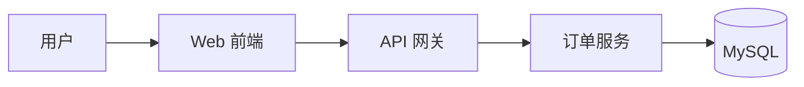

怎么理解这段代码：

- 这段代码用的是 `flowchart`
- 但它表达的语义是 `C4-L2` 的“系统内部主要容器如何分工”
- 所以它叫“整体架构图”，不是普通流程图

什么时候用：

- 想看系统由哪些主要技术单元组成

不该用在：

- 想看谁等待谁
- 想看订单状态怎么变化

### 5.2 系统上下文图

- 图名：系统上下文图
- 标准：`C4 Model Level 1`
- 常见 Mermaid 写法：`flowchart`

它回答的问题是：

- 这个系统和用户、外部系统是什么关系

最小示例：

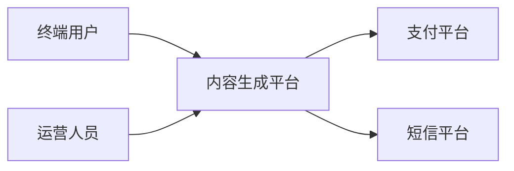

怎么理解：

- 这里重点不是系统内部有几个服务
- 而是系统与外部参与者、外部系统的关系

### 5.3 核心业务链路图

- 图名：核心业务链路图
- 标准：`UML Sequence / Business Flow`
- 常见 Mermaid 写法：`sequenceDiagram` 或 `flowchart`

如果你更想讲“谁调用谁”，用 `sequenceDiagram`：

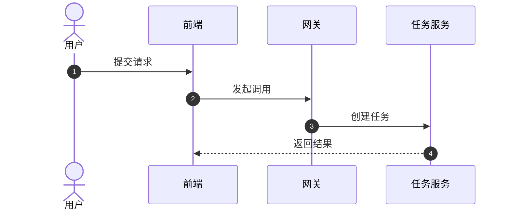

如果你更想讲“业务经过哪些步骤”，用 `flowchart`：

怎么理解：

- 图名还是“核心业务链路图”
- 只是它可以用两种 Mermaid 语法实现
- 语法选哪一种，取决于你要强调“消息交互”还是“业务步骤”

### 5.4 状态机图

- 图名：状态机图
- 标准：`UML State Machine`
- Mermaid 写法：`stateDiagram-v2`

它回答的问题是：

- 一个对象有哪些状态
- 什么条件触发状态迁移

最小示例：

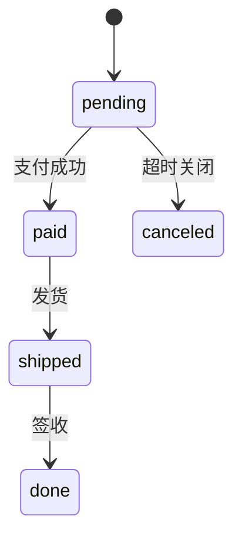

怎么理解：

- 这里不是在讲“下单步骤”
- 而是在讲“订单对象本身的状态变化”

### 5.5 数据模型图

- 图名：数据模型图
- 标准：`Data Model / ERD`
- 常见 Mermaid 写法：`flowchart`

它回答的问题是：

- 主要数据实体有哪些
- 它们之间如何关联

最小示例：

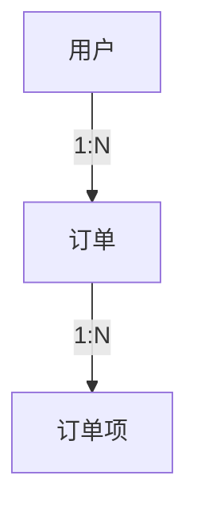

怎么理解：

- 这段代码还是 `flowchart`
- 但因为节点代表的是“数据实体”，箭头代表的是“关系”
- 所以它属于数据模型图，不属于架构图

### 5.6 代码图

- 图名：代码图
- 标准：`C4 Model Level 4 / UML Class`
- 常见 Mermaid 写法：`flowchart`

它回答的问题是：

- 类、接口、实现之间如何组织

最小示例：

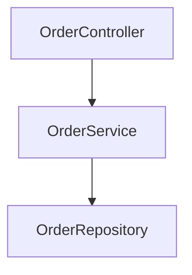

如果你把语义再往“类层级关系”靠，可以这样理解：

- `OrderController` 是入口层
- `OrderService` 是业务层
- `OrderRepository` 是持久化层

也就是说：

- 同样可能还是 `flowchart`
- 但图名和标准已经告诉你，这里重点是“代码组织”

### 5.7 模块依赖图

- 图名：模块依赖图
- 标准：`Module Dependency Diagram`
- 常见 Mermaid 写法：`flowchart`

它回答的问题是：

- 模块依赖方向是什么
- 哪些模块是公共模块

最小示例：

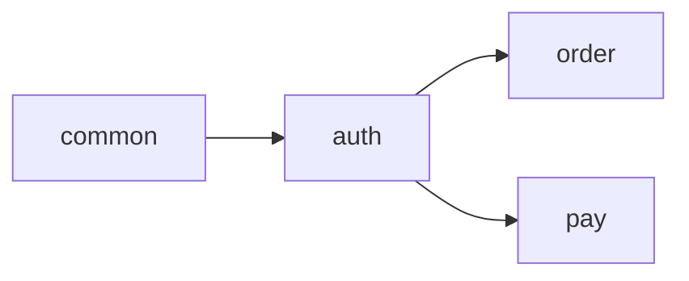

怎么理解：

- 这里看的是“依赖方向”
- 不是业务执行顺序

### 5.8 分层能力结构图

- 图名：分层能力结构图
- 标准：`Layered Capability Map`
- 常见 Mermaid 写法：`flowchart`

它回答的问题是：

- 系统能力按哪些层展开
- 每层负责什么

最小示例：

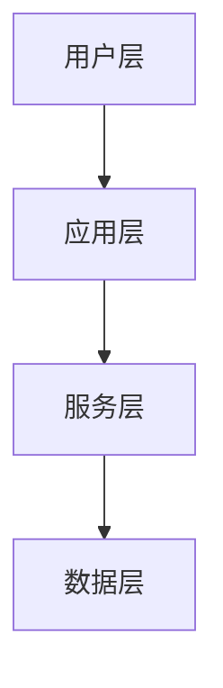

怎么理解：

- 这不是在讲具体哪个服务调用哪个服务
- 而是在讲能力的层次划分

### 5.9 技术栈图

- 图名：技术栈图
- 标准：`Tech Stack Diagram`
- 常见 Mermaid 写法：`mindmap`

它回答的问题是：

- 技术栈由哪些部分构成
- 模块和技术如何归类

最小示例：

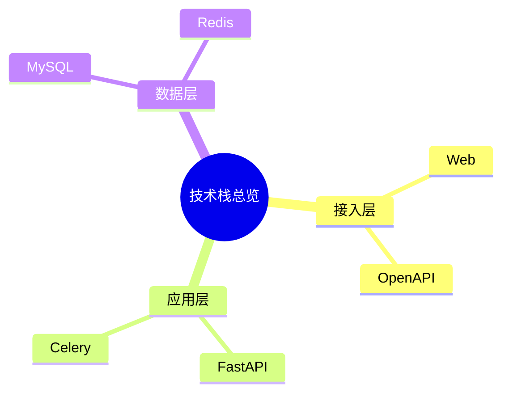

怎么理解：

- 这里没有“调用箭头”
- 它只是按主题做分类总览

### 5.10 部署图

- 图名：部署图
- 标准：`C4 Deployment`
- 常见 Mermaid 写法：`flowchart`

它回答的问题是：

- 系统部署在哪些环境和节点
- 网络入口在哪里

最小示例：

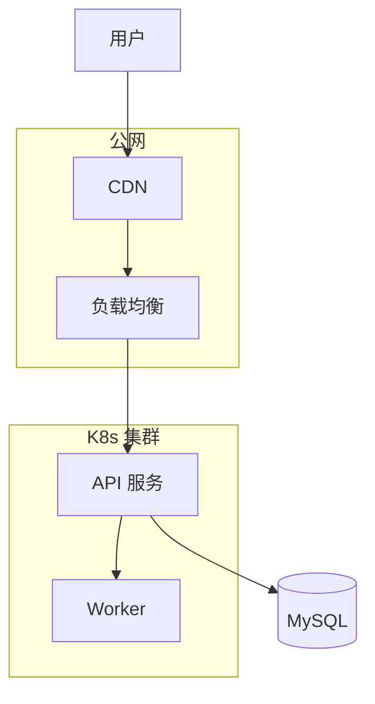

怎么理解：

- 架构图关注“系统内部有哪些单元”
- 部署图关注“这些单元落在什么运行环境里”

### 5.11 甘特图

- 图名：甘特图
- 标准：`Gantt`
- Mermaid 写法：`gantt`

它回答的问题是：

- 项目怎么排期
- 哪些任务并行，哪些任务依赖前置任务

最小示例：

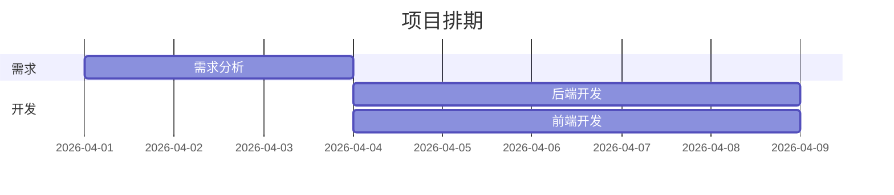

### 5.12 时间线图

- 图名：时间线图
- 标准：`Timeline`
- Mermaid 写法：`timeline`

它回答的问题是：

- 系统或产品在时间上如何演进

最小示例：

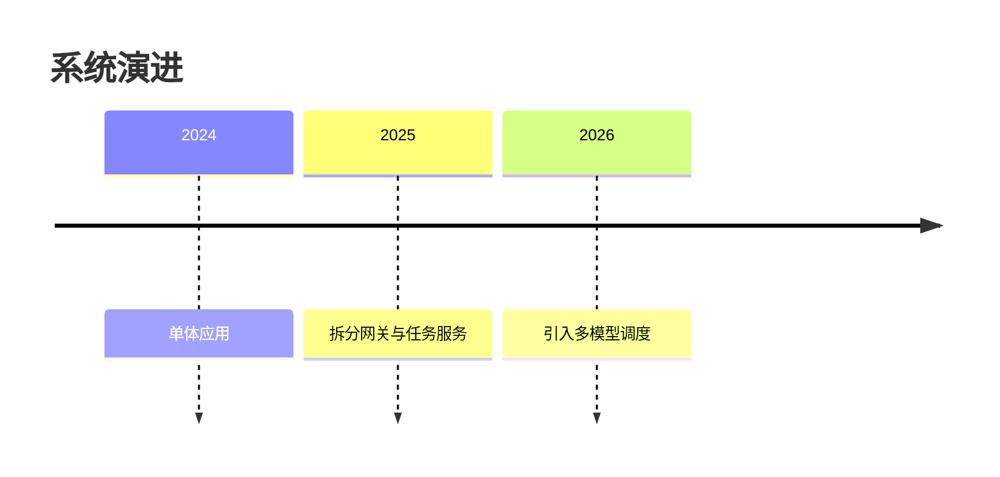

### 5.13 一张速查表

| 你想回答的问题 | 图名 | 标准 | Mermaid 常见写法 |
|------|------|------|------|
| 系统和外部世界什么关系 | 系统上下文图 | C4-L1 | `flowchart` |
| 系统内部有哪些主要服务和存储 | 整体架构图 | C4-L2 | `flowchart` |
| 某个服务内部有哪些组件 | 核心组件图 | C4-L3 | `flowchart` |
| 类、接口、实现如何组织 | 代码图 | C4-L4 / UML Class | `flowchart` |
| 一个请求如何流转 | 核心业务链路图 | UML Sequence / Business Flow | `sequenceDiagram` / `flowchart` |
| 一个对象状态如何变化 | 状态机图 | UML State Machine | `stateDiagram-v2` |
| 数据实体如何关联 | 数据模型图 | Data Model / ERD | `flowchart` |
| 技术和模块如何归类 | 技术栈图 | Tech Stack Diagram | `mindmap` |
| 系统部署在哪些环境 | 部署图 | C4 Deployment | `flowchart` |
| 项目怎么排期 | 甘特图 | Gantt | `gantt` |
| 系统如何历史演进 | 时间线图 | Timeline | `timeline` |

### 5.14 一个最关键的理解

很多人最容易混淆的点在这里：

- `flowchart` 不是“架构图”的同义词
- `flowchart` 只是 Mermaid 的一种画法

同样是 `flowchart`，可能画出来的是：

- 整体架构图
- 数据模型图
- 模块依赖图
- 分层能力结构图
- 业务流程图

真正决定它叫什么名字的，不是语法本身，而是：

- 节点代表什么
- 连线代表什么
- 这张图要回答什么问题

所以不要这样理解：

- `flowchart = 架构图`

而要这样理解：

- `flowchart` 只是工具
- `C4 / UML / ERD / Tech Stack` 才是在限定“这张图的语义”

## 6. 最容易混淆的几组词

### 5.1 `flowchart` 和 `sequenceDiagram`

- `flowchart`：看结构和步骤
- `sequenceDiagram`：看参与者之间的消息顺序

判断口诀：

- 问“过程怎么推进” -> `flowchart`
- 问“谁调用谁、谁等谁” -> `sequenceDiagram`

### 5.2 `流程图` 和 `状态机图`

- 流程图：讲一条业务路径怎么走
- 状态机图：讲对象处于什么状态以及如何切换

例子：

- “用户下单后系统做了哪些步骤” -> 流程图
- “订单有哪些状态，什么条件会从待支付变成已取消” -> 状态机图

### 5.3 `C4-L2` 和 `部署图`

- `C4-L2`：系统内部有哪些主要技术单元
- 部署图：这些技术单元落在哪些环境和节点

前者偏逻辑结构，后者偏运行环境。

### 5.4 `技术栈图` 和 `整体架构图`

- 技术栈图：偏分类总览
- 整体架构图：偏连接关系和系统边界

### 5.5 `数据模型图` 和 `代码图`

- 数据模型图：讲实体 / 表怎么关联
- 代码图：讲类 / 接口 / 实现怎么组织

## 7. 一个最实用的记忆法

当你看到一个术语时，先问自己它回答的是哪类问题：

- **系统和外部关系？** -> `C4-L1`
- **系统内部结构？** -> `C4-L2`
- **服务内部组件？** -> `C4-L3`
- **代码类和接口？** -> `C4-L4 / UML Class`
- **业务步骤怎么走？** -> `flowchart / Business Flow`
- **谁调用谁、谁等待谁？** -> `sequenceDiagram / UML Sequence`
- **状态如何变化？** -> `stateDiagram-v2 / UML State Machine`
- **数据怎么关联？** -> `Data Model / ERD`
- **技术和模块如何归类？** -> `mindmap / Tech Stack Diagram`
- **任务怎么排期？** -> `gantt`
- **历史如何演进？** -> `timeline`

## 8. 一句话总结

如果只记一条：

- `flowchart`、`sequenceDiagram`、`mindmap`、`gantt` 这些是 **Mermaid 画法**
- `UML`、`C4`、`ERD` 这些是 **你为什么这样画、这张图本质上在表达什么**

也就是：

- 前者偏“语法”
- 后者偏“建模语义”
