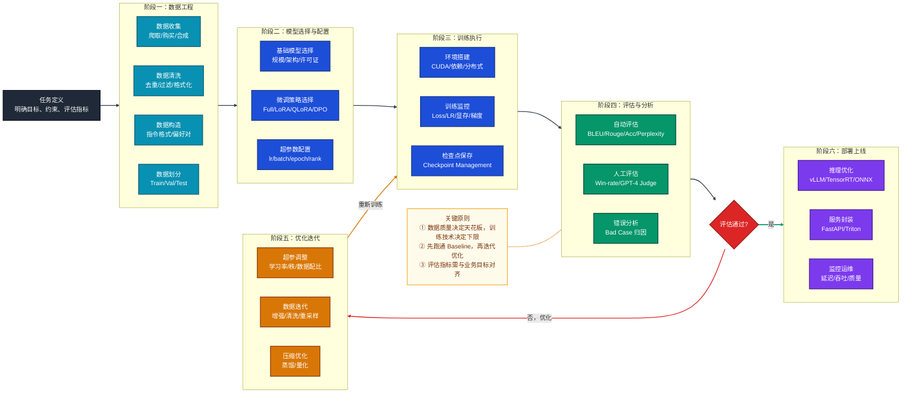

## LLM微调端到端流程总览图

```mermaid
flowchart LR
    %% ── 配色 ──────────────────────────────────────────────────────────
    classDef startStyle  fill:#1f2937,stroke:#111827,stroke-width:2px,color:#f9fafb
    classDef dataStyle   fill:#0891b2,stroke:#155e75,stroke-width:2px,color:#fff
    classDef trainStyle  fill:#1d4ed8,stroke:#1e3a8a,stroke-width:2px,color:#fff
    classDef evalStyle   fill:#059669,stroke:#064e3b,stroke-width:2px,color:#fff
    classDef optStyle    fill:#d97706,stroke:#92400e,stroke-width:2px,color:#fff
    classDef deployStyle fill:#7c3aed,stroke:#4c1d95,stroke-width:2px,color:#fff
    classDef decStyle    fill:#dc2626,stroke:#991b1b,stroke-width:2px,color:#fff
    classDef noteStyle   fill:#fffbeb,stroke:#f59e0b,stroke-width:1.5px,color:#78350f
    classDef layerStyle  fill:#f8fafc,stroke:#cbd5e0,stroke-width:1.5px

    START["任务定义<br>明确目标、约束、评估指标"]:::startStyle

    subgraph PHASE1["阶段一：数据工程"]
    direction LR
        D1["数据收集<br>爬取/购买/合成"]:::dataStyle
        D2["数据清洗<br>去重/过滤/格式化"]:::dataStyle
        D3["数据构造<br>指令格式/偏好对"]:::dataStyle
        D4["数据划分<br>Train/Val/Test"]:::dataStyle
    end
    class PHASE1 layerStyle

    subgraph PHASE2["阶段二：模型选择与配置"]
        direction LR
        M1["基础模型选择<br>规模/架构/许可证"]:::trainStyle
        M2["微调策略选择<br>Full/LoRA/QLoRA/DPO"]:::trainStyle
        M3["超参数配置<br>lr/batch/epoch/rank"]:::trainStyle
    end
    class PHASE2 layerStyle

    subgraph PHASE3["阶段三：训练执行"]
        direction LR
        T1["环境搭建<br>CUDA/依赖/分布式"]:::trainStyle
        T2["训练监控<br>Loss/LR/显存/梯度"]:::trainStyle
        T3["检查点保存<br>Checkpoint Management"]:::trainStyle
    end
    class PHASE3 layerStyle

    subgraph PHASE4["阶段四：评估与分析"]
        direction LR
        E1["自动评估<br>BLEU/Rouge/Acc/Perplexity"]:::evalStyle
        E2["人工评估<br>Win-rate/GPT-4 Judge"]:::evalStyle
        E3["错误分析<br>Bad Case 归因"]:::evalStyle
    end
    class PHASE4 layerStyle

    subgraph PHASE5["阶段五：优化迭代"]
        direction LR
        O1["超参调整<br>学习率/秩/数据配比"]:::optStyle
        O2["数据迭代<br>增强/清洗/重采样"]:::optStyle
        O3["压缩优化<br>蒸馏/量化"]:::optStyle
    end
    class PHASE5 layerStyle

    subgraph PHASE6["阶段六：部署上线"]
        direction LR
        DEP1["推理优化<br>vLLM/TensorRT/ONNX"]:::deployStyle
        DEP2["服务封装<br>FastAPI/Triton"]:::deployStyle
        DEP3["监控运维<br>延迟/吞吐/质量"]:::deployStyle
    end
    class PHASE6 layerStyle

    DEC{"评估通过?"}:::decStyle

    START --> PHASE1
    PHASE1 --> PHASE2
    PHASE2 --> PHASE3
    PHASE3 --> PHASE4
    PHASE4 --> DEC
    DEC -->|"是"| PHASE6
    DEC -->|"否，优化"| PHASE5
    PHASE5 -->|"重新训练"| PHASE3

    NOTE["关键原则<br>① 数据质量决定天花板，训练技术决定下限<br>② 先跑通 Baseline，再迭代优化<br>③ 评估指标需与业务目标对齐"]:::noteStyle
    NOTE -.- PHASE4

    %% 边索引：0-8，共 9 条
    linkStyle 0,1,2,3   stroke:#374151,stroke-width:2px
    linkStyle 4         stroke:#374151,stroke-width:2px
    linkStyle 5         stroke:#059669,stroke-width:2.5px
    linkStyle 6         stroke:#dc2626,stroke-width:2px
    linkStyle 7         stroke:#d97706,stroke-width:2px
    linkStyle 8         stroke:#d97706,stroke-width:2px
```