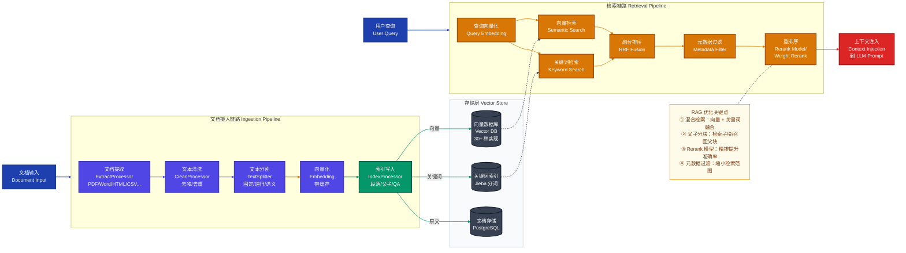

## RAG Pipeline 全链路架构

```mermaid
flowchart LR
    %% ── 配色定义 ──────────────────────────────────────────────
    classDef userStyle     fill:#1e40af,stroke:#1e3a8a,stroke-width:2.5px,color:#fff
    classDef routeStyle    fill:#4f46e5,stroke:#3730a3,stroke-width:2px,color:#fff
    classDef retrieveStyle fill:#d97706,stroke:#92400e,stroke-width:2px,color:#fff
    classDef coreStyle     fill:#dc2626,stroke:#991b1b,stroke-width:2.5px,color:#fff
    classDef storeStyle    fill:#059669,stroke:#064e3b,stroke-width:2px,color:#fff
    classDef dbStyle       fill:#374151,stroke:#111827,stroke-width:2px,color:#fff
    classDef noteStyle     fill:#fffbeb,stroke:#f59e0b,stroke-width:1.5px,color:#78350f
    classDef layerStyle    fill:#f8fafc,stroke:#cbd5e0,stroke-width:1.5px

    DOC["文档输入<br>Document Input"]:::userStyle

    %% ── 文档摄入链路 ────────────────────────────────────────
    subgraph Ingestion["文档摄入链路 Ingestion Pipeline"]
        direction LR
        EXT["文档提取<br>ExtractProcessor<br>PDF/Word/HTML/CSV..."]:::routeStyle
        CLEAN["文本清洗<br>CleanProcessor<br>去噪/去重"]:::routeStyle
        SPLIT["文本分割<br>TextSplitter<br>固定/递归/语义"]:::routeStyle
        EMB["向量化<br>Embedding<br>带缓存"]:::routeStyle
        INDEX["索引写入<br>IndexProcessor<br>段落/父子/QA"]:::storeStyle
    end
    class Ingestion layerStyle

    %% ── 存储层 ──────────────────────────────────────────────
    subgraph VectorStore["存储层 Vector Store"]
        direction TB
        VDB_MAIN[("向量数据库<br>Vector DB<br>30+ 种实现")]:::dbStyle
        KW_IDX[("关键词索引<br>Jieba 分词")]:::dbStyle
        DOC_STORE[("文档存储<br>PostgreSQL")]:::dbStyle
    end
    class VectorStore layerStyle

    %% ── 检索链路 ────────────────────────────────────────────
    QUERY["用户查询<br>User Query"]:::userStyle

    subgraph Retrieval["检索链路 Retrieval Pipeline"]
        direction LR
        Q_EMB["查询向量化<br>Query Embedding"]:::retrieveStyle
        VEC_SEARCH["向量检索<br>Semantic Search"]:::retrieveStyle
        KW_SEARCH["关键词检索<br>Keyword Search"]:::retrieveStyle
        RRF["融合排序<br>RRF Fusion"]:::retrieveStyle
        RERANK["重排序<br>Rerank Model/<br>Weight Rerank"]:::retrieveStyle
        FILTER["元数据过滤<br>Metadata Filter"]:::retrieveStyle
    end
    class Retrieval layerStyle

    %% ── 输出 ─────────────────────────────────────────────────
    CTX["上下文注入<br>Context Injection<br>到 LLM Prompt"]:::coreStyle

    %% ── 主流程 ─────────────────────────────────────────────
    DOC --> Ingestion
    EXT --> CLEAN
    CLEAN --> SPLIT
    SPLIT --> EMB
    EMB --> INDEX
    INDEX -->|"向量"| VDB_MAIN
    INDEX -->|"关键词"| KW_IDX
    INDEX -->|"原文"| DOC_STORE

    QUERY --> Retrieval
    Q_EMB --> VEC_SEARCH
    Q_EMB --> KW_SEARCH
    VEC_SEARCH --> RRF
    KW_SEARCH --> RRF
    VDB_MAIN --> VEC_SEARCH
    KW_IDX --> KW_SEARCH
    RRF --> FILTER
    FILTER --> RERANK
    RERANK --> CTX

    %% ── 注记 ─────────────────────────────────────────────────
    NOTE["RAG 优化关键点<br>① 混合检索：向量 + 关键词融合<br>② 父子分块：检索子块/召回父块<br>③ Rerank 模型：精排提升准确率<br>④ 元数据过滤：缩小检索范围"]:::noteStyle
    NOTE -.- RERANK

    %% 边索引：0-17，共 18 条
    linkStyle 0 stroke:#1e40af,stroke-width:2px
    linkStyle 1 stroke:#4f46e5,stroke-width:1.5px
    linkStyle 2 stroke:#4f46e5,stroke-width:1.5px
    linkStyle 3 stroke:#d97706,stroke-width:2px
    linkStyle 4 stroke:#059669,stroke-width:2px
    linkStyle 5 stroke:#059669,stroke-width:1.5px
    linkStyle 6 stroke:#059669,stroke-width:1.5px
    linkStyle 7 stroke:#059669,stroke-width:1.5px
    linkStyle 8 stroke:#1e40af,stroke-width:2px
    linkStyle 9 stroke:#d97706,stroke-width:1.5px
    linkStyle 10 stroke:#d97706,stroke-width:1.5px
    linkStyle 11 stroke:#d97706,stroke-width:1.5px
    linkStyle 12 stroke:#d97706,stroke-width:1.5px
    linkStyle 13 stroke:#374151,stroke-width:1.5px,stroke-dasharray:4 3
    linkStyle 14 stroke:#374151,stroke-width:1.5px,stroke-dasharray:4 3
    linkStyle 15 stroke:#d97706,stroke-width:1.5px
    linkStyle 16 stroke:#d97706,stroke-width:1.5px
    linkStyle 17 stroke:#dc2626,stroke-width:2px
    linkStyle 18 stroke:#374151,stroke-width:1.5px,stroke-dasharray:4 3
```