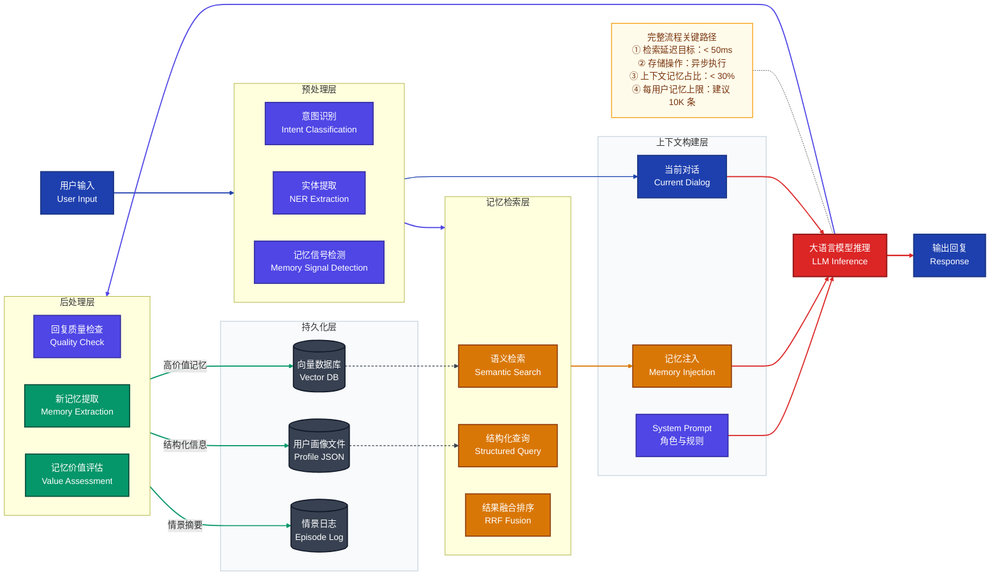

## 模型记忆端到端流程总览图

```mermaid
flowchart LR
    %% ── 配色定义 ────────────────────────────────────────────
    classDef userStyle     fill:#1e40af,stroke:#1e3a8a,stroke-width:2.5px,color:#fff
    classDef routeStyle    fill:#4f46e5,stroke:#3730a3,stroke-width:2px,color:#fff
    classDef retrieveStyle fill:#d97706,stroke:#92400e,stroke-width:2px,color:#fff
    classDef llmStyle      fill:#dc2626,stroke:#991b1b,stroke-width:2.5px,color:#fff
    classDef storeStyle    fill:#059669,stroke:#064e3b,stroke-width:2px,color:#fff
    classDef dbStyle       fill:#374151,stroke:#111827,stroke-width:2px,color:#fff
    classDef noteStyle     fill:#fffbeb,stroke:#f59e0b,stroke-width:1.5px,color:#78350f
    classDef layerStyle    fill:#f8fafc,stroke:#cbd5e0,stroke-width:1.5px

    USER["用户输入<br>User Input"]:::userStyle

    subgraph Preprocessing["预处理层"]
        direction LR
        PP1["意图识别<br>Intent Classification"]:::routeStyle
        PP2["实体提取<br>NER Extraction"]:::routeStyle
        PP3["记忆信号检测<br>Memory Signal Detection"]:::routeStyle
    end
    class Preprocessing layerStyle

    subgraph MemoryRetrieval["记忆检索层"]
        direction LR
        MR1["语义检索<br>Semantic Search"]:::retrieveStyle
        MR2["结构化查询<br>Structured Query"]:::retrieveStyle
        MR3["结果融合排序<br>RRF Fusion"]:::retrieveStyle
    end
    class MemoryRetrieval layerStyle

    subgraph ContextBuild["上下文构建层"]
        direction LR
        CB1["System Prompt<br>角色与规则"]:::routeStyle
        CB2["记忆注入<br>Memory Injection"]:::retrieveStyle
        CB3["当前对话<br>Current Dialog"]:::userStyle
    end
    class ContextBuild layerStyle

    LLM["大语言模型推理<br>LLM Inference"]:::llmStyle

    subgraph PostProcess["后处理层"]
        direction LR
        POST1["回复质量检查<br>Quality Check"]:::routeStyle
        POST2["新记忆提取<br>Memory Extraction"]:::storeStyle
        POST3["记忆价值评估<br>Value Assessment"]:::storeStyle
    end
    class PostProcess layerStyle

    subgraph Storage["持久化层"]
        direction LR
        DB1[("向量数据库<br>Vector DB")]:::dbStyle
        DB2[("用户画像文件<br>Profile JSON")]:::dbStyle
        DB3[("情景日志<br>Episode Log")]:::dbStyle
    end
    class Storage layerStyle

    RESPONSE["输出回复<br>Response"]:::userStyle

    USER --> Preprocessing
    Preprocessing --> MemoryRetrieval
    Preprocessing --> CB3
    MemoryRetrieval --> CB2
    CB1 --> LLM
    CB2 --> LLM
    CB3 --> LLM
    LLM --> PostProcess
    LLM --> RESPONSE
    PostProcess -->|"高价值记忆"| DB1
    PostProcess -->|"结构化信息"| DB2
    PostProcess -->|"情景摘要"| DB3
    DB1 --> MR1
    DB2 --> MR2

    NOTE["完整流程关键路径<br>① 检索延迟目标：< 50ms<br>② 存储操作：异步执行<br>③ 上下文记忆占比：< 30%<br>④ 每用户记忆上限：建议 10K 条"]:::noteStyle
    NOTE -.- LLM

    %% 边索引：0-13，共 14 条
    linkStyle 0 stroke:#1e40af,stroke-width:2px
    linkStyle 1 stroke:#4f46e5,stroke-width:2px
    linkStyle 2 stroke:#1e40af,stroke-width:1.5px
    linkStyle 3 stroke:#d97706,stroke-width:2px
    linkStyle 4,5,6 stroke:#dc2626,stroke-width:2px
    linkStyle 7 stroke:#4f46e5,stroke-width:2px
    linkStyle 8 stroke:#dc2626,stroke-width:2.5px
    linkStyle 9,10,11 stroke:#059669,stroke-width:2px
    linkStyle 12,13 stroke:#374151,stroke-width:1.5px,stroke-dasharray:4 3
```