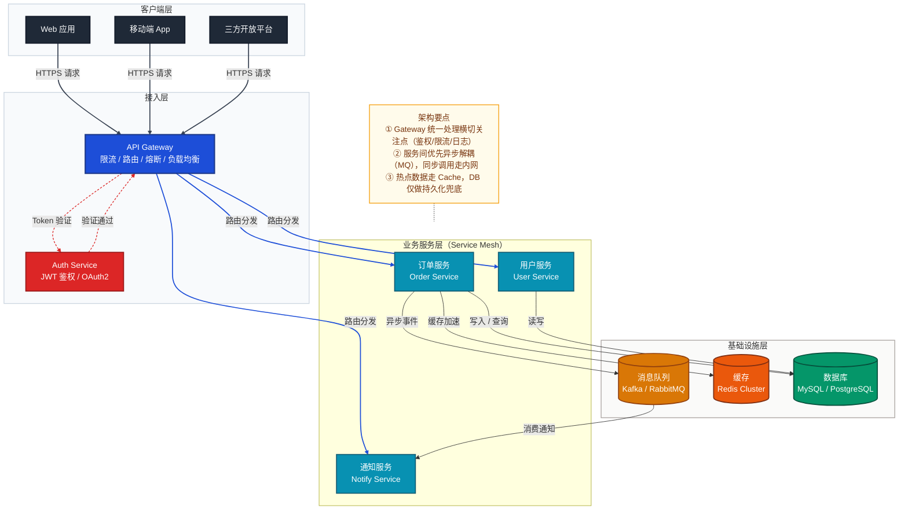

# 通用项目架构分析提示词

> 使用方式：根据需要选择「项目概览」或「项目详情」，将对应提示词发送给模型即可。
> 两者可以独立使用，也可以先概览再详情，由浅入深逐步理解项目。
> 适用范围：后端服务、前端应用、全栈项目、CLI 工具、SDK/库等各类 GitHub 项目。
> 分析目标：读完文档后，能用自己的话向他人清晰讲解这个项目。

---

## 一、项目概览（快速理解项目全貌）

**适用场景**：初次接触项目、项目评估、团队沟通、技术选型参考

```
请对该项目进行整体概览分析，帮助我快速理解项目全貌，目标是让我读完后能够向他人清晰讲解这个项目。
请涵盖以下方面，根据项目实际情况灵活调整侧重点：

0. **一句话定位（必须）**
   - 用一句话概括：这是一个「做什么」的「什么类型」项目，解决了「什么核心问题」
   - 例："这是一个基于 FastAPI 的 AI 工作流编排平台，解决了多模型协同调用和结果聚合的工程化问题"

1. **项目定位**
   - 项目解决什么问题？面向哪些用户或场景？
   - 项目的核心价值和主要功能是什么？

2. **技术栈概览**
   - 主要使用的语言、框架、核心依赖
   - 如有明显的技术选型特点（如微服务、Serverless 等），请简要说明

3. **项目结构**
   - 顶层目录结构及各目录的职责概述
   - 项目的组织方式（如单体应用、Monorepo、多模块等）

4. **核心模块与关系**
   - 项目包含哪些主要功能模块？各模块的核心职责是什么？
   - 模块之间的主要依赖和交互关系（建议用简要的架构图或关系图辅助说明）

5. **快速上手与入口**
   - 项目的入口文件或启动方式是什么？（如 `main.py`、`app.ts`、`docker-compose up` 等）
   - 如何快速将项目运行起来？（关键的安装和启动步骤）
   - 项目运行后，用户或开发者如何与之交互？（如访问 API、打开 Web 页面、执行命令等）

6. **核心请求链路（必须）**
   - 选取一个最典型的核心功能，用完整的请求链路将各模块串联起来
   - 格式：用户请求 → A 模块 → B 模块 → ... → 返回结果，说明每一步做了什么
   - 用 Mermaid 流程图展示，要求能一图看懂整个系统的协作方式

注意事项：
- 保持简洁，突出重点，避免过多实现细节
- "一句话定位"和"核心请求链路"是必须输出的两项，其余根据项目实际灵活调整
- 对于不确定或信息不足的部分，可以标注说明
```

---

## 二、项目详情（深入理解架构与实现）

**适用场景**：技术深入分析、架构设计参考、源码学习、开发参与准备

```
请对该项目进行深入的架构与实现分析，目标是让我读完后能够向他人深入讲解这个项目，包括设计决策背后的原因。
请涵盖以下方面，根据项目实际情况灵活调整深度和侧重点：

1. **架构风格识别（必须）**
   - 识别项目采用的整体架构风格，例如：
     - **分层架构**（MVC / 三层 / 四层）：各层职责如何划分？层间如何通信？
     - **DDD 领域驱动设计**：是否使用四层架构（展示层 → 应用层 → 领域层 → 基础设施层）？如何体现？
     - **Clean Architecture / Hexagonal**：核心域如何与外部解耦？
     - **微服务 / 模块化单体**：服务/模块边界如何确定？
   - 说明这种架构风格带来的核心好处和对应的代码组织方式
   - 用 Mermaid 分层架构图展示各层的职责边界

2. **模块详细拆解**
   - 各功能模块的内部结构和关键组件
   - 模块间的依赖关系、调用方式和数据流向
   - **若项目使用 DDD，请重点分析：**
     - **限界上下文（Bounded Context）划分**：识别项目中有哪些上下文，各自的业务边界是什么？上下文间如何集成（防腐层 / 共享内核 / 发布订阅）？
     - **聚合根（Aggregate Root）设计**：核心聚合根是哪些？聚合的一致性边界如何划定？
     - **实体（Entity）vs 值对象（Value Object）**：举例说明项目中哪些是实体，哪些是值对象，为什么这样区分？
     - **领域服务 vs 应用服务**：两者职责边界如何划分？哪些业务逻辑放在领域服务，哪些放在应用服务？
     - **仓储模式（Repository）**：仓储接口定义在哪一层？实现在哪一层？为什么这样设计？
     - **领域事件（Domain Event）**：项目中有哪些领域事件？如何发布和订阅？解耦了什么？
   - 用架构图或模块关系图辅助说明（建议使用 Mermaid 等格式）

3. **核心请求链路（必须）**
   - 选取 1~2 个最典型的核心功能，完整描述从请求进入到响应返回的全链路
   - 涵盖：接入层 → 业务逻辑 → 数据层 → 返回，说明每一步的关键处理逻辑
   - 用 Mermaid 时序图或流程图展示，重点标注各模块的职责边界

3. **数据层设计**（如适用）
   - 数据模型 / 数据库设计的主要结构
   - ORM 或数据访问层的组织方式
   - 缓存、消息队列等中间件的使用情况及其解决的问题

4. **接口与 API 设计**（如适用）
   - API 的组织方式和设计风格（REST / GraphQL / RPC 等）
   - 主要接口的分类和职责
   - 接口版本管理方式（如有）

5. **配置与部署**
   - 配置管理方式（环境变量、配置文件等）
   - 部署方式和相关基础设施（Docker、CI/CD 等）
   - 环境区分（开发 / 测试 / 生产）

6. **安全性设计**（如适用）
   - 认证与鉴权机制（如 JWT、OAuth、Session、RBAC 等）
   - 输入校验、数据脱敏、敏感信息管理等安全实践
   - 其他安全相关措施（如 CORS、限流、HTTPS、SQL 注入防护等）

7. **异常处理与可观测性**
   - 错误处理和异常传播的整体策略
   - 日志、监控、链路追踪等可观测性手段（如有）

8. **测试策略**（如适用）
   - 测试的类型和覆盖范围（单元测试、集成测试、E2E 等）
   - 测试框架和组织方式

9. **设计亮点与潜在关注点**
   - 项目中值得学习的设计模式或架构决策，重点分析"为什么这样设计"
   - 可能存在的技术债务或改进空间（如能观察到）

11. **FAQ 常见问题（必须，12 个以上）**
    提供面向以下场景的问答，每题给出详细解答：
    - **基本原理类**：如"项目的整体架构是什么？""XX 模块是如何工作的？"
    - **设计决策类**：如"为什么选择 XX 技术？""XX 和 YY 的区别是什么？"
    - **实际应用类**：如"如何扩展新功能？""如何集成第三方服务？"
    - **性能优化类**：如"系统瓶颈在哪？""如何提升 XX 的性能？"
    - **架构抽象层设计类（若项目使用 DDD，必须包含）**：
      - "项目划分了哪些限界上下文？边界是如何确定的？"
      - "领域层是如何保持纯粹性的（不依赖基础设施）？"
      - "应用服务和领域服务的职责边界在哪里？举例说明"
      - "聚合根的设计原则是什么？项目中如何体现的？"
      - "仓储接口为什么定义在领域层而不是基础设施层？"
      - "领域事件是如何实现业务解耦的？"

注意事项：
- "核心请求链路"和"FAQ"是必须输出的两项，其余根据项目实际灵活调整
- 重点分析"为什么这样设计"，而不仅仅是"是什么"
- 对于不确定的部分，可以标注为推测并说明依据
```

---

## 三、概览 vs 详情 对照

| 维度 | 项目概览 | 项目详情 |
|------|---------|---------|
| 目标 | 快速理解项目做什么、怎么组织、怎么跑 | 深入理解怎么实现、为什么这样设计 |
| 分析粒度 | 模块级：关注模块职责和关系 | 组件级：关注内部实现和设计决策 |
| 必须输出 | 一句话定位 + 核心请求链路 | 核心请求链路（完整版）+ FAQ |
| 业务流程 | 1 个核心链路的简要步骤 | 1~2 个核心链路的完整全链路描述 |
| 技术实现 | 技术栈 + 项目结构概述 | 数据层、API、安全、部署、测试等各维度 |
| Mermaid 图 | 整体架构图 + 核心流程图 | 模块关系图 + 详细时序图 + 部署架构图 |
| 篇幅 | 简洁精炼 | 详尽充分 |
| 适合 | 项目评估、团队沟通、快速上手 | 源码学习、架构参考、深度参与、面试准备 |


## 四、项目架构 mermaid作图风格参考

> 在架构分析中使用 Mermaid 图表时，可参考以下风格规范。
> 这是一份风格参考而非硬性要求，根据图表复杂度灵活取舍。

## 项目架构图示例
> 展示客户端 → API 网关 → 服务网格 → 数据层的标准分层微服务架构



---

## 最佳实践速查

| 设计原则 | 说明 |
|----------|------|
| **配色与样式定义** | 通过 `classDef` 预定义各类节点的颜色和边框样式，使不同层级或角色的组件在视觉上易于区分；主流程用饱和色，辅助/注记用低饱和暖色（`#fffbeb`） |
| **分层布局** | 使用 `subgraph` 对节点进行逻辑分组，体现架构的层次关系；外层 `class` 统一背景色；数据管道用 `LR`，分层系统用 `TB`，混合架构视核心轴决定 |
| **连接线区分** | 通过 `linkStyle` 对不同类型的连接线设置不同颜色和粗细，区分调用类型或数据流方向；`-->` 主流程，`==>` 关键路径，`-.->` 异步/可选；关键路径加粗 |
| **连接线标签说明** | 连接线上使用简明标签描述交互语义（如调用方式、数据类型等） |
| **节点换行** | 节点文本内换行须使用 `<br>` 标签（如 `["组件名<br>副标题"]`），`\n` 在大多数 Mermaid 渲染器中无效；首行组件名，`<br>` 换行后补充职责描述，避免过长 |
| **节点形状语义** | 用形状传递组件类型：`["text"]` 矩形表示服务/组件；`[("text")]` 圆柱体表示数据库/存储（DB、Cache、MQ 等持久化或中间件节点）；形状与颜色双重编码，一眼区分职责 |
| **辅助NOTE节点注释** | 对核心规则或易混淆的概念，可通过 `Note` 节点附加说明；使用 `NOTE -.- 核心子图` 悬浮注记模式，避免干扰主流程 |
